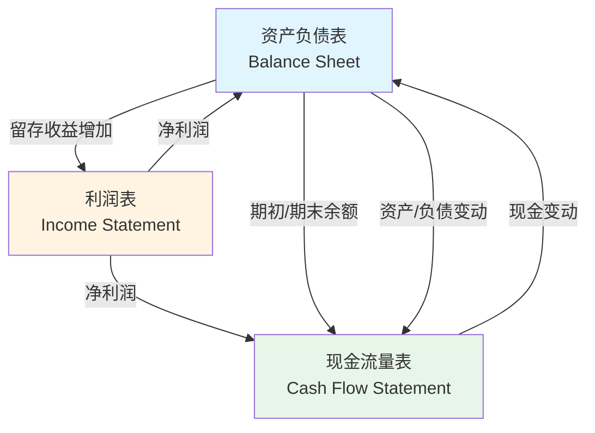

# 三表关系与综合分析

## 概述

三大财务报表不是孤立的，它们之间存在严密的勾稽关系。理解这些关系是进行综合财务分析和识别财务造假的关键。

### 学习目标

1. 理解三表之间的逻辑关系
2. 掌握关键勾稽关系的验证方法
3. 运用三表进行综合分析
4. 识别财务报表不一致的风险信号
5. 建立完整的财务分析框架


## 三表关系图



## 核心勾稽关系

### 1. 净利润的流向

**利润表 → 资产负债表**：
```
期末留存收益 = 期初留存收益 + 净利润 - 股利
```

**利润表 → 现金流量表**：
```
经营活动现金流 = 净利润 + 调整项 +/- 营运资本变动
```

### 2. 现金的平衡

**现金流量表 → 资产负债表**：
```
期末现金 = 期初现金 + CFO + CFI + CFF
```

### 3. 资产负债表的平衡

**恒等式**：
```
资产 = 负债 + 股东权益
```

**股东权益变动**：
```
期末权益 = 期初权益 + 净利润 - 股利 + 股票发行 - 股票回购 + 其他综合收益
```

## 详细勾稽关系

### 关系 1：净利润与留存收益

**公式**：
```
留存收益变动 = 净利润 - 股利 + 会计调整
```

**验证方法**：
1. 从利润表获取净利润
2. 从现金流量表获取股利支付
3. 计算留存收益变动
4. 与资产负债表留存收益变动对比

**案例**：
```
期初留存收益：$1,000
净利润：$200
股利支付：$50
期末留存收益：$1,000 + $200 - $50 = $1,150 ✓
```

### 关系 2：折旧与固定资产

**公式**：
```
期末固定资产净值 = 期初固定资产净值 + 资本支出 - 折旧 - 资产处置
```

**验证方法**：
1. 从资产负债表获取期初/期末固定资产
2. 从利润表获取折旧费用
3. 从现金流量表获取资本支出和资产处置
4. 验证平衡关系

### 关系 3：应收账款与收入

**公式**：
```
销售收现 = 收入 - 应收账款增加
```

**验证方法**：
1. 从利润表获取收入
2. 从资产负债表计算应收账款变动
3. 推算销售收现
4. 与现金流量表对比

### 关系 4：存货与成本

**公式**：
```
采购付现 = 销售成本 + 存货增加 - 应付账款增加
```

### 关系 5：利息与债务

**公式**：
```
利息费用 ≈ 平均债务 × 平均利率
```

**验证方法**：
1. 从资产负债表计算平均债务
2. 从利润表获取利息费用
3. 计算隐含利率
4. 与市场利率对比

## 综合分析框架

### 杜邦分析体系

**三因素分解**：
```
ROE = 净利率 × 资产周转率 × 权益乘数
    = (净利润/收入) × (收入/资产) × (资产/权益)
```

**五因素分解**：
```
ROE = 税负 × 利息负担 × 营业利润率 × 资产周转率 × 权益乘数
```

**应用**：
- 识别 ROE 驱动因素
- 跨公司对比
- 趋势分析

### 现金流与利润分析

**质量评估**：
```
现金流/利润比率 = CFO / 净利润
```

**理想状态**：
- 比率 > 1：利润有现金支持
- 比率 ≈ 1：正常状态
- 比率 < 1：利润质量存疑

**应计项目分析**：
```
应计项目 = 净利润 - CFO
```

### 营运资本分析

**营运资本**：
```
营运资本 = 流动资产 - 流动负债
```

**营运资本变动**：
```
营运资本变动 = 应收账款变动 + 存货变动 - 应付账款变动
```

**影响**：
- 正变动：占用现金
- 负变动：释放现金

## 财务造假识别

### 常见造假手法

#### 1. 虚增收入

**迹象**：
- 应收账款增速 > 收入增速
- CFO < 净利润且差距扩大
- 应收账款周转天数异常增加
- 关联交易收入占比高

**验证方法**：
```
收入质量 = 销售收现 / 收入
```
- 比率下降：收入质量存疑

#### 2. 隐藏费用

**迹象**：
- 资本化比例异常高
- 折旧政策过于乐观
- 费用资本化不合理
- 应付账款异常增加

#### 3. 操纵利润

**迹象**：
- 频繁调整会计政策
- 大量非经常性损益
- 关联交易利润
- 资产减值准备不足

### 三表一致性检查

**检查清单**：

1. **现金平衡**：
   ```
   期末现金 = 期初现金 + 三大现金流净额 ✓
   ```

2. **留存收益平衡**：
   ```
   留存收益变动 = 净利润 - 股利 ✓
   ```

3. **固定资产平衡**：
   ```
   固定资产变动 = 资本支出 - 折旧 - 处置 ✓
   ```

4. **现金流与利润一致**：
   ```
   CFO ≈ 净利润 + 折旧 +/- 营运资本变动 ✓
   ```

## 实战案例

### 案例 1：健康企业（Apple）

**三表特征**：
- CFO > 净利润（现金支持）
- FCF 强劲且稳定
- 应收账款质量高
- 三表勾稽关系清晰

### 案例 2：高增长企业（Tesla）

**三表特征**：
- 营运资本占用大
- 资本支出高
- FCF 从负转正
- 现金流改善明显

### 案例 3：问题企业（康美药业）

**异常信号**：
- 巨额现金但利息收入极低
- 应收账款激增
- 存货异常增加
- 现金流与利润严重背离

## 综合分析模板

### 分析步骤

1. **盈利能力分析**（利润表）
   - 收入增长
   - 利润率趋势
   - 成本结构

2. **财务状况分析**（资产负债表）
   - 资产质量
   - 负债水平
   - 权益结构

3. **现金流分析**（现金流量表）
   - CFO 质量
   - FCF 水平
   - 现金流趋势

4. **综合评估**
   - 三表勾稽验证
   - 杜邦分析
   - 风险识别

## 常见误区

1. **孤立看单张报表**
2. **忽视勾稽关系**
3. **不验证数据一致性**
4. **忽视会计政策影响**

## 延伸阅读

### 推荐书籍

1. 《财务报表分析》- Stephen Penman
2. 《Financial Shenanigans》- Howard Schilit
3. 《Quality of Earnings》- Thornton O'glove

### 参考文献

1. Penman, S. H. (2013). *Financial Statement Analysis and Security Valuation*.
2. Schilit, H., & Perler, J. (2010). *Financial Shenanigans*.
3. CFA Institute. (2023). *CFA Program Curriculum*.

---

**下一步**：学习 [财务比率分析](ratio-analysis.html)，掌握系统化的财务指标体系。
7. Palepu, K. G., Healy, P. M., & Peek, E. (2019). *Business Analysis and Valuation* (6th ed.). Cengage.
8. Fridson, M. S., & Alvarez, F. (2011). *Financial Statement Analysis: A Practitioner's Guide* (4th ed.). Wiley.


## 深度分析

### 核心机制解析

理解本主题需要从多个维度进行系统性分析。以下从理论基础、实践应用和历史验证三个层面展开深度探讨。

**理论基础层面**：本主题的核心逻辑建立在经济学和金融学的基本原理之上。通过对基础理论的深入理解，投资者能够建立起稳固的分析框架，避免被市场短期噪音所干扰。

**实践应用层面**：理论必须与实践相结合才能产生价值。在实际投资决策中，需要将抽象的概念转化为具体的分析工具和决策标准。

**历史验证层面**：金融市场有着丰富的历史记录，通过研究历史案例，我们可以验证理论的有效性，并从中提炼出具有普遍意义的规律。

### 关键影响因素

影响本主题的关键因素可以从以下几个维度进行分析：

1. **宏观经济环境**：利率水平、通货膨胀率、经济增长速度等宏观变量对本主题有着深远影响。在不同的宏观经济周期中，相关指标的表现会呈现出显著差异。

2. **市场结构因素**：市场参与者的构成、信息传播机制、流动性状况等市场结构因素决定了价格发现的效率和准确性。

3. **政策监管环境**：政府政策、监管框架的变化会直接影响相关市场的运作规则和参与者行为。

4. **技术创新驱动**：技术进步不断改变着金融市场的运作方式，从算法交易到区块链技术，每一次技术革新都带来新的机遇和挑战。

5. **全球化与地缘政治**：在全球化背景下，各国市场之间的联动性日益增强，地缘政治风险的影响也越来越不可忽视。

### 量化分析框架

为了更精确地分析和评估，可以采用以下量化框架：

| 分析维度 | 关键指标 | 参考基准 | 分析方法 |
|---------|---------|---------|---------|
| 规模评估 | 绝对值与相对值 | 历史均值 | 趋势分析 |
| 质量评估 | 稳定性指标 | 行业对标 | 横向比较 |
| 风险评估 | 波动率指标 | 风险阈值 | 情景分析 |
| 价值评估 | 估值倍数 | 历史区间 | 回归分析 |

通过系统性地应用上述框架，投资者可以对目标进行全面、客观的评估，从而做出更加理性的投资决策。


## 高级分析与前沿研究

### 学术研究进展

近年来，学术界对本领域的研究取得了重要进展。以下是几个值得关注的研究方向：

**行为金融学视角**：传统金融理论假设市场参与者是完全理性的，但行为金融学的研究表明，认知偏差和情绪因素在投资决策中扮演着重要角色。诺贝尔经济学奖得主丹尼尔·卡尼曼（Daniel Kahneman）和理查德·塞勒（Richard Thaler）的研究为我们理解市场非理性行为提供了重要框架。

**因子投资研究**：尤金·法玛（Eugene Fama）和肯尼斯·弗伦奇（Kenneth French）的三因子模型，以及后续发展的五因子模型，为系统性地解释股票收益差异提供了理论基础。这些研究表明，市值、账面市值比、盈利能力和投资模式等因子能够解释大部分股票收益的横截面差异。

**市场微观结构研究**：对市场流动性、价格发现机制和交易成本的深入研究，帮助我们更好地理解市场的运作机制，并为优化交易策略提供指导。

### 实战案例深度解析

**案例一：长期价值创造的典范**

以沃伦·巴菲特（Warren Buffett）的伯克希尔·哈撒韦（Berkshire Hathaway）为例，其长达数十年的卓越投资业绩证明了价值投资理念的有效性。从1965年至今，伯克希尔的账面价值年均增长率约为19.8%，远超同期标普500指数的约10.2%年均回报。

巴菲特的成功秘诀在于：
- 专注于具有持久竞争优势的优质企业
- 以合理价格买入，而非追求最低价格
- 长期持有，让复利效应充分发挥
- 保持充足的安全边际，控制下行风险

**案例二：危机中的机遇识别**

2008年金融危机期间，大多数投资者恐慌性抛售，但少数具有前瞻性的投资者却在危机中发现了历史性的投资机会。约翰·保尔森（John Paulson）通过做空次级抵押贷款相关证券，在危机中获得了约150亿美元的利润，成为金融史上最成功的单笔交易之一。

这个案例告诉我们：
- 深入的基本面研究能够发现市场定价错误
- 逆向思维往往能够发现被市场忽视的机会
- 风险管理和仓位控制是成功的关键

### 跨市场比较分析

不同市场在结构、监管、投资者构成等方面存在显著差异，这些差异对投资策略的选择有重要影响：

**美国市场特征**：
- 机构投资者主导，市场效率较高
- 信息披露制度完善，分析师覆盖广泛
- 衍生品市场发达，对冲工具丰富
- 长期牛市历史，但也经历过多次重大调整

**中国市场特征**：
- 散户投资者比例较高，市场波动性较大
- 政策因素影响显著，需要密切关注监管动向
- 新兴行业发展迅速，成长投资机会丰富
- A股、港股、美股中概股形成多层次市场体系

**欧洲市场特征**：
- 价值股比例较高，估值相对保守
- 受地缘政治和欧元区政策影响较大
- 部分行业（如奢侈品、工业）具有全球竞争优势
- ESG投资理念推广较为领先

