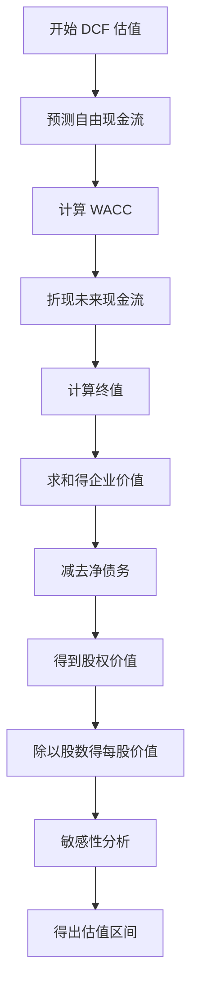

# DCF 估值详解：现金流折现法完全指南

## 概述

现金流折现法（Discounted Cash Flow, DCF）是最严谨、最理论化的估值方法，被认为是确定企业内在价值的"黄金标准"。DCF 的核心思想是：**一家公司的价值等于其未来所有自由现金流的现值之和**。


### 学习目标

完成本文学习后，你将能够：

1. 理解 DCF 估值的理论基础和适用场景
2. 掌握 WACC（加权平均资本成本）的完整计算方法
3. 学会预测企业未来自由现金流
4. 计算终值（Terminal Value）并理解其重要性
5. 进行敏感性分析，评估估值的稳健性
6. 应用 DCF 方法对真实公司进行估值

### 为什么 DCF 重要

DCF 是巴菲特、芒格等价值投资大师最推崇的估值方法。正如巴菲特所说：

> "内在价值是一家企业在其剩余寿命中可以产生的现金流的折现值。"

DCF 方法的优势：
- **理论严谨**：基于金融学基本原理
- **前瞻性**：关注未来而非过去
- **独立性**：不受市场情绪影响
- **全面性**：考虑企业长期价值创造能力

## DCF 理论基础

### 货币时间价值

DCF 的核心是货币时间价值原理：今天的 1 元钱比未来的 1 元钱更有价值，因为：

1. **机会成本**：今天的钱可以投资获得回报
2. **通货膨胀**：货币购买力随时间下降
3. **不确定性**：未来现金流存在风险


### DCF 基本公式

企业价值（Enterprise Value）的计算公式：

```
EV = Σ [FCFt / (1 + WACC)^t] + TV / (1 + WACC)^n

其中：
- FCFt = 第 t 年的自由现金流
- WACC = 加权平均资本成本（折现率）
- TV = 终值（Terminal Value）
- n = 预测期年数
```

股权价值（Equity Value）的计算：

```
股权价值 = 企业价值 - 净债务
每股价值 = 股权价值 / 流通股数

净债务 = 总债务 - 现金及现金等价物
```

### DCF 估值流程




## 自由现金流预测

### 自由现金流的定义

**企业自由现金流（FCFF - Free Cash Flow to Firm）**：

```
FCFF = EBIT × (1 - 税率) + 折旧摊销 - 资本支出 - 营运资本增加

或者：
FCFF = 经营活动现金流 - 资本支出
```

**股权自由现金流（FCFE - Free Cash Flow to Equity）**：

```
FCFE = 净利润 + 折旧摊销 - 资本支出 - 营运资本增加 + 净借款
```

### 预测步骤

#### 1. 历史分析（3-5 年）

分析历史财务数据，识别趋势：
- 收入增长率
- 利润率（毛利率、营业利润率）
- 资本支出占收入比例
- 营运资本变化
- 现金转化周期

#### 2. 收入预测

收入预测方法：

**自上而下法**：
```
收入 = 市场规模 × 市场份额 × 价格
```

**自下而上法**：
```
收入 = 产品线1收入 + 产品线2收入 + ...
每条产品线收入 = 销量 × 单价
```


#### 3. 利润率预测

关键驱动因素：
- **规模效应**：收入增长带来的成本摊薄
- **竞争格局**：定价权和成本压力
- **运营效率**：管理改善和技术进步
- **行业周期**：周期性行业的波动

#### 4. 资本支出预测

```
资本支出 = 维持性资本支出 + 扩张性资本支出

维持性资本支出 ≈ 折旧摊销
扩张性资本支出 = 支持收入增长所需投资
```

资本支出占收入比例（Capex/Sales）是关键指标。

#### 5. 营运资本预测

```
营运资本 = 流动资产 - 流动负债
         = (应收账款 + 存货) - 应付账款

营运资本增加 = 本年营运资本 - 上年营运资本
```

使用周转天数预测：
- 应收账款天数（DSO）
- 存货周转天数（DIO）
- 应付账款天数（DPO）

### 预测期选择

**典型预测期**：5-10 年

- **成熟企业**：5 年
- **成长企业**：10 年
- **周期性企业**：完整周期

预测期应覆盖企业达到稳定增长状态的时间。


## WACC 计算详解

### WACC 公式

```
WACC = (E/V) × Re + (D/V) × Rd × (1 - Tc)

其中：
- E = 股权市值
- D = 债务市值
- V = E + D（企业总价值）
- Re = 股权成本
- Rd = 债务成本
- Tc = 企业税率
```

### 计算步骤

#### 1. 确定资本结构

```
股权比例 = E / (E + D)
债务比例 = D / (E + D)
```

**注意事项**：
- 使用市值而非账面价值
- 使用目标资本结构而非当前结构
- 考虑行业平均水平

#### 2. 计算股权成本（Re）

使用 **CAPM 模型**（Capital Asset Pricing Model）：

```
Re = Rf + β × (Rm - Rf)

其中：
- Rf = 无风险利率（10年期国债收益率）
- β = 贝塔系数（系统性风险）
- Rm = 市场预期回报率
- (Rm - Rf) = 股权风险溢价（ERP）
```


**贝塔系数计算**：

```
β = Cov(Ri, Rm) / Var(Rm)

或使用回归分析：
Ri = α + β × Rm + ε
```

**去杠杆和加杠杆贝塔**：

```
去杠杆贝塔（Unlevered Beta）：
βu = βL / [1 + (1 - Tc) × (D/E)]

加杠杆贝塔（Levered Beta）：
βL = βu × [1 + (1 - Tc) × (D/E)]
```

**股权风险溢价参考值**：
- 美国市场：5-6%
- 中国市场：6-8%
- 新兴市场：8-10%

#### 3. 计算债务成本（Rd）

方法一：**使用当前债务利率**
```
Rd = 利息支出 / 总债务
```

方法二：**使用信用评级**
```
Rd = 无风险利率 + 信用利差
```

信用利差参考：
- AAA：0.5-1.0%
- AA：1.0-1.5%
- A：1.5-2.5%
- BBB：2.5-4.0%
- BB及以下：4.0%+


#### 4. 确定税率

使用**有效税率**而非法定税率：

```
有效税率 = 所得税费用 / 税前利润
```

建议使用 3-5 年平均有效税率。

### WACC 计算示例

假设某公司：
- 股权市值：1000 亿
- 债务市值：300 亿
- 无风险利率：3%
- 贝塔系数：1.2
- 市场风险溢价：6%
- 债务成本：5%
- 税率：25%

计算：
```
E/V = 1000 / 1300 = 76.9%
D/V = 300 / 1300 = 23.1%

Re = 3% + 1.2 × 6% = 10.2%

WACC = 76.9% × 10.2% + 23.1% × 5% × (1 - 25%)
     = 7.84% + 0.87%
     = 8.71%
```

## 终值计算

终值（Terminal Value）通常占企业总价值的 50-80%，是 DCF 估值中最关键的部分。

### 方法一：永续增长模型（Gordon Growth Model）

```
TV = FCFn+1 / (WACC - g)
   = FCFn × (1 + g) / (WACC - g)

其中：
- FCFn = 最后一年预测的自由现金流
- g = 永续增长率
```


**永续增长率选择**：

- **保守估计**：2-3%（接近 GDP 增长率）
- **合理估计**：3-4%
- **乐观估计**：4-5%

**重要原则**：
- g 必须小于 WACC
- g 不应超过长期 GDP 增长率
- 成熟企业 g 通常为 2-3%

### 方法二：退出倍数法（Exit Multiple）

```
TV = EBITDAn × 退出倍数

或

TV = EBITn × 退出倍数
```

退出倍数通常使用行业平均 EV/EBITDA 或 EV/EBIT 倍数。

### 两种方法比较

| 特征 | 永续增长模型 | 退出倍数法 |
|------|------------|-----------|
| 理论基础 | 严谨 | 依赖市场 |
| 适用场景 | 稳定增长企业 | 所有企业 |
| 敏感性 | 对 g 和 WACC 敏感 | 对倍数选择敏感 |
| 使用频率 | 更常用 | 作为交叉验证 |

## 完整 DCF 计算示例

### 案例 1：苹果公司（Apple Inc.）

**背景信息**（2023年数据）：
- 股价：$180
- 市值：$2.8 万亿
- 净债务：-$600 亿（净现金）
- 流通股：155 亿股


**步骤 1：预测自由现金流（5年）**

| 年份 | 2024E | 2025E | 2026E | 2027E | 2028E |
|------|-------|-------|-------|-------|-------|
| 收入（亿美元） | 4000 | 4200 | 4400 | 4600 | 4800 |
| 增长率 | 5% | 5% | 4.8% | 4.5% | 4.3% |
| EBIT（亿美元） | 1200 | 1260 | 1320 | 1380 | 1440 |
| EBIT率 | 30% | 30% | 30% | 30% | 30% |
| 税后EBIT | 900 | 945 | 990 | 1035 | 1080 |
| + 折旧摊销 | 120 | 126 | 132 | 138 | 144 |
| - 资本支出 | 100 | 105 | 110 | 115 | 120 |
| - 营运资本增加 | 20 | 20 | 20 | 20 | 20 |
| **FCFF** | **900** | **946** | **992** | **1038** | **1084** |

**步骤 2：计算 WACC**

```
无风险利率 Rf = 4%
贝塔 β = 1.2
市场风险溢价 = 6%
股权成本 Re = 4% + 1.2 × 6% = 11.2%

债务成本 Rd = 3.5%
税率 Tc = 25%

资本结构（目标）：
股权比例 = 95%
债务比例 = 5%

WACC = 95% × 11.2% + 5% × 3.5% × (1-25%)
     = 10.64% + 0.13%
     = 10.77%
```


**步骤 3：折现现金流**

| 年份 | FCFF | 折现因子 | 现值 |
|------|------|---------|------|
| 2024 | 900 | 0.903 | 812 |
| 2025 | 946 | 0.815 | 771 |
| 2026 | 992 | 0.736 | 730 |
| 2027 | 1038 | 0.664 | 689 |
| 2028 | 1084 | 0.600 | 650 |
| **合计** | | | **3652** |

**步骤 4：计算终值**

```
永续增长率 g = 3%
2029年 FCFF = 1084 × 1.03 = 1117 亿美元

TV = 1117 / (10.77% - 3%)
   = 1117 / 7.77%
   = 14,377 亿美元

TV现值 = 14,377 × 0.600
       = 8,626 亿美元
```

**步骤 5：计算企业价值和股权价值**

```
企业价值 = 预测期现值 + 终值现值
         = 3,652 + 8,626
         = 12,278 亿美元

股权价值 = 企业价值 - 净债务
         = 12,278 - (-600)
         = 12,878 亿美元

每股价值 = 12,878 / 155
         = $83.08
```

**结论**：
- DCF 估值：$83
- 当前股价：$180
- 隐含估值：股价被高估约 117%


### 案例 2：茅台（贵州茅台）

**背景信息**（2023年数据）：
- 股价：¥1800
- 市值：¥2.26 万亿
- 净现金：¥1500 亿
- 流通股：12.56 亿股

**步骤 1：预测自由现金流（10年，成长股）**

| 年份 | 2024E | 2025E | 2026E | 2027E | 2028E |
|------|-------|-------|-------|-------|-------|
| 收入（亿元） | 1400 | 1540 | 1680 | 1820 | 1960 |
| 增长率 | 12% | 10% | 9% | 8% | 8% |
| 净利润率 | 52% | 52% | 52% | 52% | 52% |
| FCFF（亿元） | 680 | 750 | 820 | 890 | 960 |

（后5年增长率逐步降至5%）

**步骤 2：WACC 计算**

```
Re = 4% + 0.8 × 7% = 9.6%（中国市场）
WACC ≈ 9.6%（几乎无债务）
```

**步骤 3：估值结果**

```
预测期现值：约 8,500 亿元
终值现值（g=3%）：约 15,000 亿元
企业价值：23,500 亿元
股权价值：25,000 亿元（加净现金）
每股价值：¥1,990

结论：合理估值区间 ¥1,800-2,200
```


### 案例 3：亚马逊（Amazon）

**背景信息**：
- 高成长、低利润率
- 大量资本支出
- 复杂业务结构（零售+AWS+广告）

**关键挑战**：
1. **负自由现金流历史**：需要分业务预测
2. **利润率扩张**：AWS 占比提升带来利润率改善
3. **资本密集度下降**：从自建转向第三方

**分业务预测**：

| 业务 | 收入占比 | 利润率 | 增长率 |
|------|---------|--------|--------|
| 在线零售 | 50% | 3% | 8% |
| AWS | 15% | 30% | 20% |
| 广告 | 8% | 50% | 25% |
| 其他 | 27% | 5% | 10% |

**估值要点**：
- 使用分部估值法（Sum-of-Parts）
- AWS 单独估值（更高倍数）
- 考虑期权价值（未来业务）

## 敏感性分析

敏感性分析评估关键假设变化对估值的影响。

### 单因素敏感性分析

**WACC 敏感性**：

| WACC | 估值 | 变化 |
|------|------|------|
| 9.77% | $95 | +14% |
| 10.77% | $83 | 基准 |
| 11.77% | $73 | -12% |


**永续增长率敏感性**：

| 增长率 | 估值 | 变化 |
|--------|------|------|
| 2% | $72 | -13% |
| 3% | $83 | 基准 |
| 4% | $97 | +17% |

### 双因素敏感性分析

**WACC vs 永续增长率矩阵**：

|  | g=2% | g=3% | g=4% |
|---|------|------|------|
| **WACC=9.77%** | $82 | $95 | $112 |
| **WACC=10.77%** | $72 | $83 | $97 |
| **WACC=11.77%** | $64 | $73 | $85 |

### 情景分析

| 情景 | 概率 | 收入增长 | WACC | g | 估值 |
|------|------|---------|------|---|------|
| 乐观 | 25% | 8% | 10% | 4% | $110 |
| 基准 | 50% | 5% | 10.77% | 3% | $83 |
| 悲观 | 25% | 2% | 12% | 2% | $58 |

**期望值** = 0.25×$110 + 0.5×$83 + 0.25×$58 = $83.5

### 蒙特卡洛模拟

对关键变量进行概率分布假设，运行数千次模拟：

```
变量分布：
- 收入增长率：正态分布，均值5%，标准差2%
- EBIT率：正态分布，均值30%，标准差3%
- WACC：正态分布，均值10.77%，标准差1%
- 永续增长率：均值3%，标准差0.5%

模拟结果：
- 中位数估值：$82
- 90%置信区间：$65-$105
- 估值低于当前股价的概率：85%
```


## Excel 模板说明

### 基本模板结构

**工作表组织**：

1. **Summary（摘要）**
   - 关键假设
   - 估值结果
   - 敏感性分析表

2. **Assumptions（假设）**
   - WACC 计算
   - 增长率假设
   - 利润率假设
   - 资本支出假设

3. **Historical（历史数据）**
   - 3-5年历史财务数据
   - 趋势分析
   - 比率计算

4. **Forecast（预测）**
   - 损益表预测
   - 资产负债表预测
   - 现金流量表预测

5. **DCF Valuation（DCF估值）**
   - 自由现金流计算
   - 折现计算
   - 终值计算
   - 企业价值和股权价值

6. **Sensitivity（敏感性）**
   - 单因素分析
   - 双因素矩阵
   - 情景分析

### 关键公式

**FCFF 计算**：
```excel
=EBIT*(1-Tax_Rate)+Depreciation-Capex-Change_in_NWC
```

**折现因子**：
```excel
=1/(1+WACC)^Year
```

**终值**：
```excel
=Last_Year_FCF*(1+g)/(WACC-g)
```

**企业价值**：
```excel
=SUM(PV_of_FCF)+PV_of_Terminal_Value
```


### 最佳实践

1. **使用命名区域**：为关键假设创建命名区域，提高可读性
2. **颜色编码**：
   - 蓝色：输入值
   - 黑色：公式
   - 绿色：链接到其他工作表
3. **数据验证**：对输入值设置合理范围
4. **错误检查**：使用 IFERROR 处理除零等错误
5. **版本控制**：保存不同假设版本

### 常用快捷键

- `F4`：切换绝对/相对引用
- `Ctrl + [`：追踪引用单元格
- `Ctrl + ]`：追踪从属单元格
- `Alt + =`：快速求和
- `F9`：计算工作表

## DCF 的局限性与注意事项

### 主要局限性

1. **对假设高度敏感**
   - 小的假设变化导致大的估值差异
   - 终值占比过高（50-80%）
   - WACC 和永续增长率难以精确确定

2. **预测困难**
   - 长期预测不确定性大
   - 行业变革难以预见
   - 竞争格局变化

3. **不适用场景**
   - 负现金流企业（早期创业公司）
   - 周期性极强的企业
   - 金融机构（特殊资本结构）
   - 困境企业

4. **忽略因素**
   - 管理层变化
   - 战略转型
   - 并购机会
   - 期权价值


### 使用建议

1. **保守假设**
   - 使用保守的增长率
   - 合理的利润率
   - 充足的安全边际

2. **多方法验证**
   - 结合相对估值法
   - 参考市场倍数
   - 对比同行估值

3. **持续更新**
   - 季度更新预测
   - 调整关键假设
   - 跟踪实际表现

4. **理解业务**
   - DCF 是工具，不是答案
   - 深入理解商业模式
   - 评估竞争优势

### 常见错误

1. **过度乐观**
   - 高估增长率
   - 低估竞争压力
   - 忽视周期性

2. **机械应用**
   - 不理解假设含义
   - 盲目相信模型输出
   - 忽视定性分析

3. **技术错误**
   - 混淆 FCFF 和 FCFE
   - 错误计算 WACC
   - 终值计算错误
   - 重复计算现金

## 实战应用指南

### DCF 估值检查清单

**准备阶段**：
- [ ] 收集 3-5 年历史财务数据
- [ ] 了解公司业务模式和行业
- [ ] 研究竞争格局和增长驱动因素
- [ ] 阅读管理层讨论和分析（MD&A）


**建模阶段**：
- [ ] 建立历史财务模型
- [ ] 计算历史比率和趋势
- [ ] 预测收入（多种方法验证）
- [ ] 预测利润率（考虑规模效应）
- [ ] 预测资本支出和营运资本
- [ ] 计算自由现金流
- [ ] 计算 WACC（详细分解）
- [ ] 计算终值（两种方法）
- [ ] 折现并求和

**验证阶段**：
- [ ] 检查预测合理性
- [ ] 与行业平均对比
- [ ] 进行敏感性分析
- [ ] 运行情景分析
- [ ] 与相对估值法对比
- [ ] 计算隐含倍数

**决策阶段**：
- [ ] 确定估值区间
- [ ] 计算安全边际
- [ ] 评估风险因素
- [ ] 制定投资决策

### 不同行业的 DCF 调整

**科技公司**：
- 高增长率（15-30%）
- 股权激励调整
- 研发资本化
- 平台价值评估

**消费品公司**：
- 稳定增长（5-10%）
- 品牌价值
- 渠道扩张
- 定价权分析

**周期性公司**：
- 使用周期调整后的现金流
- 考虑完整周期
- 保守的终值假设


**金融机构**：
- 使用股权自由现金流（FCFE）
- 或使用股利折现模型（DDM）
- 监管资本要求
- 资产质量分析

## 深入理解

### DCF 的哲学意义

DCF 不仅是估值工具，更是一种投资哲学：

1. **长期主义**：关注企业长期价值创造
2. **现金为王**：利润可以操纵，现金不会说谎
3. **内在价值**：价值独立于市场价格
4. **安全边际**：估值不确定性要求折扣

### 巴菲特的 DCF 观点

> "内在价值是一个非常重要的概念，它为评估投资和企业的相对吸引力提供了唯一的逻辑手段。内在价值的定义很简单：它是一家企业在其剩余寿命中可以产生的现金的折现值。"
> 
> — 沃伦·巴菲特

巴菲特的简化 DCF：
- 使用保守假设
- 要求高安全边际（30-50%）
- 关注可预测性
- 长期持有

### 学术研究

**有效性研究**：
- DCF 估值与长期股价相关性：0.6-0.7
- 优于简单倍数法
- 结合定性分析效果最佳

**行为金融学视角**：
- 分析师倾向过度乐观
- 锚定效应影响假设
- 确认偏差导致选择性使用


## 常见问题

**Q1：DCF 估值总是低于市场价格，是否说明市场总是高估？**

A：不一定。可能原因：
- 你的假设过于保守
- 市场预期更高增长
- 市场包含期权价值（未来机会）
- 市场情绪溢价
- 你的模型遗漏关键因素

**Q2：预测期应该选择多长？**

A：取决于企业特征：
- 成熟稳定企业：5年
- 成长型企业：7-10年
- 周期性企业：完整周期
- 原则：预测到企业达到稳定状态

**Q3：如何处理负自由现金流？**

A：几种方法：
- 延长预测期直到现金流转正
- 分业务估值（部分业务现金流为正）
- 使用其他估值方法（收入倍数）
- 评估是否为战略性投资

**Q4：WACC 和永续增长率哪个更重要？**

A：都很重要，但：
- WACC 影响所有现金流折现
- 永续增长率只影响终值
- 终值通常占总价值 50-80%
- 两者都需要仔细确定

**Q5：如何验证 DCF 估值的合理性？**

A：多种方法：
- 计算隐含倍数（EV/EBITDA, P/E）
- 与同行业公司对比
- 反向推算市场隐含假设
- 历史估值区间对比
- 多种估值方法交叉验证


## 延伸阅读

### 必读书籍

1. **《估值：难点、解决方案及相关案例》** - Aswath Damodaran
   - DCF 估值圣经
   - 详细案例和实践指导

2. **《投资估值》** - Aswath Damodaran
   - 学术和实践结合
   - 全面的估值方法论

3. **《财务建模与估值》** - Paul Pignataro
   - Excel 建模实战
   - 投行级别模板

4. **《巴菲特的估值逻辑》** - 刘建位
   - 价值投资视角的 DCF
   - 中国案例分析

5. **《McKinsey 公司估值》** - Tim Koller
   - 咨询公司视角
   - 企业价值管理

### 在线资源

- **Damodaran Online**：http://pages.stern.nyu.edu/~adamodar/
  - 免费数据和模板
  - 行业数据和风险溢价

- **CFA Institute**：估值相关研究
- **投资银行研报**：学习专业分析师的方法
- **公司年报和投资者关系**：一手数据来源

### 进阶主题

- 实物期权估值
- 蒙特卡洛模拟
- 多阶段 DCF 模型
- 跨境估值调整
- 私募股权估值


## 参考文献

1. Damodaran, A. (2012). *Investment Valuation: Tools and Techniques for Determining the Value of Any Asset*. Wiley Finance.

2. Koller, T., Goedhart, M., & Wessels, D. (2020). *Valuation: Measuring and Managing the Value of Companies*. McKinsey & Company.

3. Buffett, W. (1992). "Chairman's Letter to Shareholders." *Berkshire Hathaway Annual Report*.

4. Graham, B., & Dodd, D. (2008). *Security Analysis*. McGraw-Hill Education.

5. Penman, S. (2013). *Financial Statement Analysis and Security Valuation*. McGraw-Hill.

6. Fernández, P. (2019). "Company Valuation Methods." *IESE Business School Working Paper*.

7. Copeland, T., Koller, T., & Murrin, J. (2000). *Valuation: Measuring and Managing the Value of Companies*. Wiley.

8. Rosenbaum, J., & Pearl, J. (2013). *Investment Banking: Valuation, Leveraged Buyouts, and Mergers & Acquisitions*. Wiley.

9. Pignataro, P. (2013). *Financial Modeling and Valuation: A Practical Guide to Investment Banking and Private Equity*. Wiley.

10. Damodaran, A. (2006). *Damodaran on Valuation: Security Analysis for Investment and Corporate Finance*. Wiley.

11. 刘建位 (2018). 《巴菲特的估值逻辑：20个投资案例深入复盘》. 中信出版社.

12. CFA Institute (2020). *CFA Program Curriculum Level II: Equity Investments*.

13. Fernández, P. (2015). "WACC: Definition, Misconceptions and Errors." *Business Valuation Review*.

14. Kaplan, S., & Ruback, R. (1995). "The Valuation of Cash Flow Forecasts: An Empirical Analysis." *Journal of Finance*.

15. Lundholm, R., & Sloan, R. (2013). *Equity Valuation and Analysis*. McGraw-Hill.


## 深度分析

### 核心机制解析

理解本主题需要从多个维度进行系统性分析。以下从理论基础、实践应用和历史验证三个层面展开深度探讨。

**理论基础层面**：本主题的核心逻辑建立在经济学和金融学的基本原理之上。通过对基础理论的深入理解，投资者能够建立起稳固的分析框架，避免被市场短期噪音所干扰。

**实践应用层面**：理论必须与实践相结合才能产生价值。在实际投资决策中，需要将抽象的概念转化为具体的分析工具和决策标准。

**历史验证层面**：金融市场有着丰富的历史记录，通过研究历史案例，我们可以验证理论的有效性，并从中提炼出具有普遍意义的规律。

### 关键影响因素

影响本主题的关键因素可以从以下几个维度进行分析：

1. **宏观经济环境**：利率水平、通货膨胀率、经济增长速度等宏观变量对本主题有着深远影响。在不同的宏观经济周期中，相关指标的表现会呈现出显著差异。

2. **市场结构因素**：市场参与者的构成、信息传播机制、流动性状况等市场结构因素决定了价格发现的效率和准确性。

3. **政策监管环境**：政府政策、监管框架的变化会直接影响相关市场的运作规则和参与者行为。

4. **技术创新驱动**：技术进步不断改变着金融市场的运作方式，从算法交易到区块链技术，每一次技术革新都带来新的机遇和挑战。

5. **全球化与地缘政治**：在全球化背景下，各国市场之间的联动性日益增强，地缘政治风险的影响也越来越不可忽视。

### 量化分析框架

为了更精确地分析和评估，可以采用以下量化框架：

| 分析维度 | 关键指标 | 参考基准 | 分析方法 |
|---------|---------|---------|---------|
| 规模评估 | 绝对值与相对值 | 历史均值 | 趋势分析 |
| 质量评估 | 稳定性指标 | 行业对标 | 横向比较 |
| 风险评估 | 波动率指标 | 风险阈值 | 情景分析 |
| 价值评估 | 估值倍数 | 历史区间 | 回归分析 |

通过系统性地应用上述框架，投资者可以对目标进行全面、客观的评估，从而做出更加理性的投资决策。

