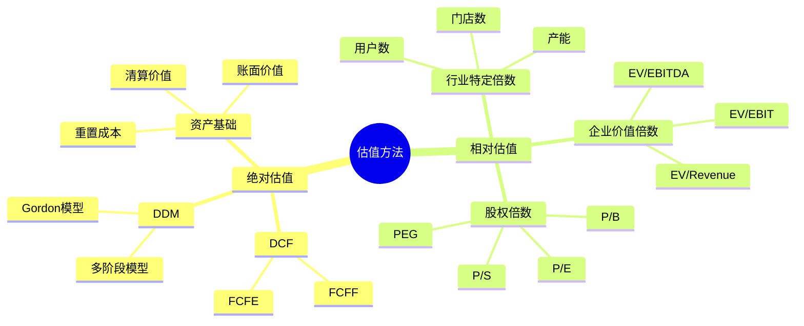
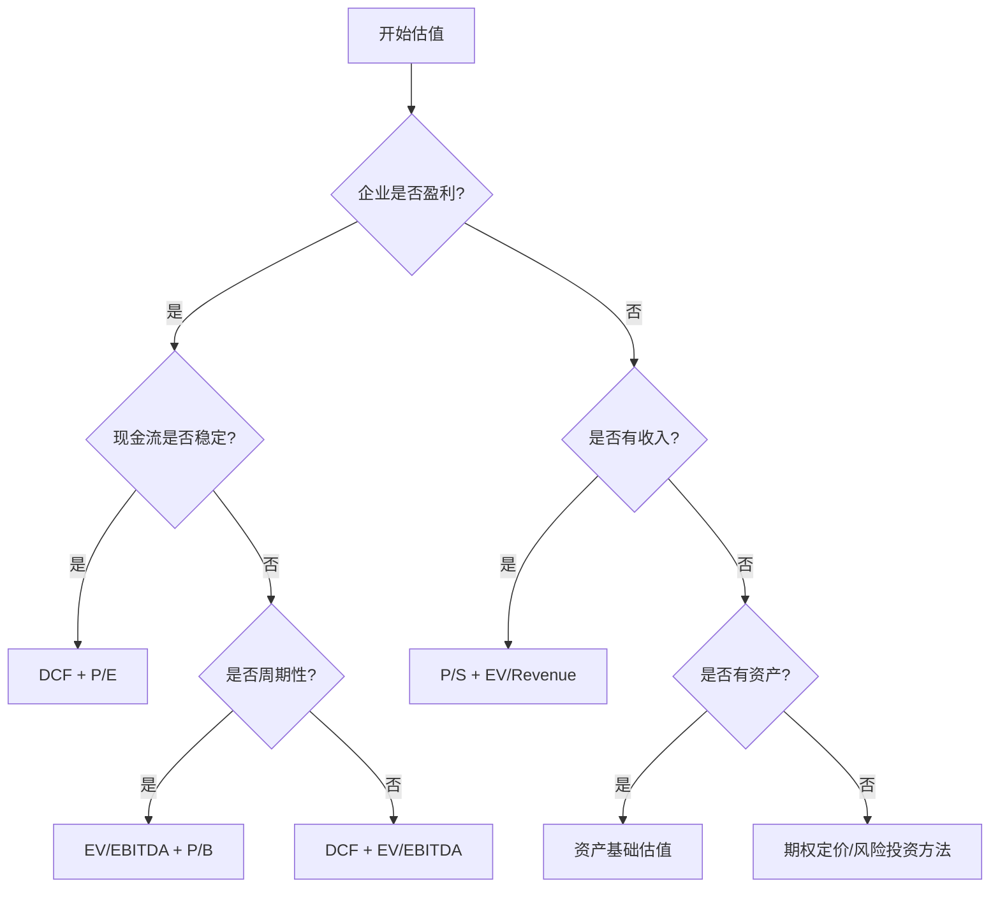

# 估值方法比较：选择最适合的估值工具

## 概述

没有一种估值方法适用于所有情况。成功的估值需要理解各种方法的优劣，并根据具体情况选择最合适的工具组合。

### 学习目标

1. 全面理解各种估值方法的特点
2. 掌握估值方法选择框架
3. 学会针对不同行业选择估值方法
4. 理解如何组合使用多种方法
5. 建立完整的估值分析流程


## 估值方法全景图

### 主要估值方法分类



## 估值方法对比矩阵

### 综合对比表

| 估值方法 | 理论基础 | 复杂度 | 数据要求 | 适用阶段 | 主要优势 | 主要劣势 |
|---------|---------|--------|---------|---------|---------|---------|
| **DCF** | 内在价值 | 高 | 高 | 成熟期 | 理论严谨 | 假设敏感 |
| **DDM** | 股利折现 | 中 | 中 | 成熟期 | 简单直观 | 仅适用分红股 |
| **P/E** | 市场倍数 | 低 | 低 | 盈利期 | 简单快速 | 受会计影响 |
| **P/B** | 账面价值 | 低 | 低 | 所有阶段 | 稳定可靠 | 忽视无形资产 |
| **EV/EBITDA** | 企业价值 | 中 | 中 | 盈利期 | 可比性强 | 忽视资本结构 |
| **P/S** | 收入倍数 | 低 | 低 | 亏损期 | 适用亏损企业 | 忽视盈利能力 |
| **资产基础** | 净资产 | 中 | 高 | 清算/重组 | 提供底线价值 | 忽视盈利能力 |


### 详细特征对比

#### 1. DCF 估值

**优势**：
- 基于企业基本面和未来现金流
- 不受市场情绪影响
- 理论上最准确
- 适合长期投资决策

**劣势**：
- 对假设高度敏感
- 需要大量预测和判断
- 终值占比过高
- 不适用于亏损或周期性企业

**最适合**：
- 现金流稳定可预测的企业
- 成熟行业的龙头公司
- 长期投资决策
- 并购估值

#### 2. 相对估值法

**优势**：
- 简单快速
- 反映市场共识
- 易于沟通
- 数据容易获取

**劣势**：
- 依赖市场定价
- 可能延续市场错误
- 需要真正可比公司
- 忽视企业独特性

**最适合**：
- 快速筛选
- 市场交易决策
- 与 DCF 交叉验证
- 行业内比较

#### 3. 资产基础估值

**优势**：
- 提供价值底线
- 适用于资产密集型企业
- 清算情景下可靠
- 不依赖盈利预测

**劣势**：
- 忽视盈利能力
- 资产评估困难
- 不适合轻资产企业
- 忽视商誉和品牌价值

**最适合**：
- 金融机构
- 房地产公司
- 困境企业
- 清算估值


## 行业适用性指南

### 不同行业的最佳估值方法

#### 科技行业

**首选方法**：
1. **DCF**（成熟科技公司）
   - 关注自由现金流
   - 考虑研发资本化
   - 长预测期（10年）

2. **EV/Revenue**（早期科技公司）
   - 尚未盈利
   - 关注收入增长
   - 参考同行倍数

3. **P/S 或 EV/用户数**（互联网公司）
   - 用户变现潜力
   - 网络效应价值

**案例**：
- 苹果、微软：DCF + P/E
- 亚马逊：DCF（分业务）+ EV/Sales
- 早期 SaaS：EV/ARR（年度经常性收入）

#### 消费品行业

**首选方法**：
1. **P/E**
   - 稳定盈利
   - 可预测现金流

2. **DCF**
   - 品牌价值评估
   - 长期增长潜力

3. **EV/EBITDA**
   - 跨国比较
   - 并购估值

**案例**：
- 可口可乐：P/E + DCF
- 茅台：P/E + DCF
- 奢侈品：P/E + 品牌价值

#### 金融行业

**首选方法**：
1. **P/B**
   - 资产负债表驱动
   - ROE 分析

2. **P/E**
   - 盈利能力
   - 与 ROE 结合

3. **DDM**（银行）
   - 稳定分红
   - 监管资本要求

**案例**：
- 银行：P/B + ROE 分析
- 保险：P/B + 内含价值
- 券商：P/B + P/E


#### 周期性行业

**首选方法**：
1. **EV/EBITDA**（周期中性）
   - 不受利息和税收影响
   - 跨周期比较

2. **P/B**
   - 资产价值底线
   - 周期低点估值

3. **周期调整后 P/E**
   - 使用正常化盈利
   - 平滑周期波动

**案例**：
- 钢铁、化工：EV/EBITDA + P/B
- 航空：EV/EBITDA
- 能源：P/B + 资源储量价值

#### 房地产行业

**首选方法**：
1. **NAV（净资产价值）**
   - 物业公允价值
   - 减去负债

2. **P/NAV**
   - 市价相对 NAV 折溢价
   - 行业比较

3. **DDM**（REITs）
   - 强制分红
   - 股息收益率

**案例**：
- 开发商：NAV + P/NAV
- REITs：DDM + P/FFO
- 物业管理：P/E + DCF

#### 医药行业

**首选方法**：
1. **DCF**
   - 药品管线价值
   - 专利到期影响

2. **EV/EBITDA**
   - 成熟药企
   - 并购估值

3. **P/S**（生物科技）
   - 研发阶段
   - 尚未盈利

**案例**：
- 辉瑞、强生：DCF + P/E
- 生物科技：管线价值 + P/S
- CRO：P/E + EV/EBITDA


## 估值方法选择框架

### 决策树



### 企业生命周期与估值方法

| 生命周期阶段 | 特征 | 首选估值方法 | 次选方法 |
|------------|------|------------|---------|
| **初创期** | 无收入/亏损 | 风险投资法 | 期权定价 |
| **成长期** | 高增长/低利润 | P/S, EV/Revenue | DCF（长期） |
| **扩张期** | 增长+盈利 | DCF, P/E | EV/EBITDA |
| **成熟期** | 稳定增长 | DCF, P/E | DDM |
| **衰退期** | 负增长 | P/B, 清算价值 | 资产基础 |

### 估值目的与方法选择

| 估值目的 | 推荐方法 | 原因 |
|---------|---------|------|
| **长期投资** | DCF + P/E | 关注内在价值 |
| **短期交易** | 相对估值 | 反映市场情绪 |
| **并购定价** | DCF + EV/EBITDA | 协同效应评估 |
| **IPO 定价** | 可比公司 P/E | 市场可接受性 |
| **困境投资** | 清算价值 + P/B | 下行保护 |
| **成长股投资** | DCF + PEG | 增长潜力 |


## 多方法组合策略

### 三角验证法

使用三种不同方法进行交叉验证：

**示例：估值成熟科技公司**

1. **DCF 估值**：$85/股
   - 基于 10 年现金流预测
   - WACC 10%
   - 永续增长率 3%

2. **P/E 估值**：$92/股
   - 行业平均 P/E：25x
   - 公司预期 EPS：$3.68
   - 估值：25 × $3.68 = $92

3. **EV/EBITDA 估值**：$88/股
   - 行业平均 EV/EBITDA：15x
   - 公司 EBITDA：$120亿
   - EV = 15 × $120 = $1,800亿
   - 减净债务，除以股数

**综合估值区间**：$85-92，中值 $88

### 加权平均法

根据可靠性分配权重：

```
综合估值 = w1 × DCF + w2 × P/E + w3 × EV/EBITDA

示例权重分配：
- DCF：50%（最可靠）
- P/E：30%
- EV/EBITDA：20%

综合估值 = 0.5×$85 + 0.3×$92 + 0.2×$88
         = $42.5 + $27.6 + $17.6
         = $87.7
```

### 情景分析法

不同情景下使用不同方法：

| 情景 | 概率 | 估值方法 | 估值结果 |
|------|------|---------|---------|
| 乐观 | 25% | DCF（高增长） | $110 |
| 基准 | 50% | DCF + P/E 平均 | $88 |
| 悲观 | 25% | P/B（清算） | $65 |

**期望值** = 0.25×$110 + 0.5×$88 + 0.25×$65 = $87.75


## 实战案例：完整估值分析

### 案例：腾讯控股估值（2023）

**公司背景**：
- 业务：社交、游戏、金融科技、广告、云
- 市值：约 3.5 万亿港元
- 股价：HK$350

#### 方法 1：DCF 估值

**关键假设**：
- 预测期：10年
- 收入增长：15% → 8%（逐步下降）
- EBIT率：25%
- WACC：9.5%
- 永续增长率：3%

**结果**：HK$380/股

#### 方法 2：分部估值（Sum-of-Parts）

| 业务 | 估值方法 | 价值（亿港元） |
|------|---------|--------------|
| 社交（微信） | DCF | 15,000 |
| 游戏 | P/E 20x | 8,000 |
| 金融科技 | P/E 25x | 6,000 |
| 广告 | EV/Revenue 5x | 3,000 |
| 云 | EV/Revenue 3x | 2,000 |
| 投资组合 | 市值 | 5,000 |
| **总计** | | **39,000** |

**每股价值**：39,000亿 / 95亿股 = HK$410

#### 方法 3：相对估值

**P/E 估值**：
- 可比公司平均 P/E：28x
- 腾讯预期 EPS：HK$13
- 估值：28 × 13 = HK$364

**EV/EBITDA 估值**：
- 可比公司平均：18x
- 腾讯 EBITDA：2,200亿
- EV = 18 × 2,200 = 39,600亿
- 减净现金 1,500亿
- 股权价值：38,100亿
- 每股：HK$401


#### 综合分析

**估值汇总**：

| 方法 | 估值 | 权重 | 加权值 |
|------|------|------|--------|
| DCF | HK$380 | 40% | 152 |
| 分部估值 | HK$410 | 30% | 123 |
| P/E | HK$364 | 15% | 55 |
| EV/EBITDA | HK$401 | 15% | 60 |
| **综合估值** | | | **HK$390** |

**估值区间**：HK$360-420

**投资建议**：
- 当前股价：HK$350
- 合理估值：HK$390
- 上行空间：11%
- 评级：买入

**关键风险**：
- 监管政策变化
- 游戏版号限制
- 竞争加剧
- 宏观经济下行

## 常见错误与陷阱

### 估值方法使用错误

1. **机械套用公式**
   - 不理解方法适用条件
   - 忽视企业特殊性
   - 盲目相信模型输出

2. **可比公司选择不当**
   - 业务模式不同
   - 规模差异过大
   - 地域市场不同
   - 发展阶段不匹配

3. **忽视会计差异**
   - 不同会计准则
   - 一次性项目
   - 表外项目
   - 会计政策差异

4. **过度依赖单一方法**
   - 不进行交叉验证
   - 忽视方法局限性
   - 缺乏敏感性分析


### 数据和假设陷阱

1. **历史数据问题**
   - 使用非经常性项目
   - 忽视业务结构变化
   - 不调整异常年份

2. **预测过于乐观**
   - 高估增长率
   - 低估竞争压力
   - 忽视周期性
   - 外推短期趋势

3. **折现率错误**
   - WACC 计算错误
   - 使用不当的贝塔
   - 忽视风险变化
   - 循环引用问题

4. **终值问题**
   - 永续增长率过高
   - 终值占比过大
   - 退出倍数不合理

## 最佳实践建议

### 估值流程检查清单

**准备阶段**：
- [ ] 深入理解业务模式
- [ ] 分析行业竞争格局
- [ ] 研究历史财务表现
- [ ] 识别关键价值驱动因素
- [ ] 评估管理层质量

**方法选择**：
- [ ] 根据企业特征选择主要方法
- [ ] 确定辅助验证方法
- [ ] 考虑行业惯例
- [ ] 评估数据可得性

**执行阶段**：
- [ ] 使用保守假设
- [ ] 进行敏感性分析
- [ ] 多方法交叉验证
- [ ] 计算估值区间
- [ ] 识别关键风险

**验证阶段**：
- [ ] 检查结果合理性
- [ ] 与历史估值对比
- [ ] 与同行业对比
- [ ] 反向推算隐含假设
- [ ] 评估安全边际


### 投资大师的估值智慧

**巴菲特**：
> "估值既是艺术也是科学。我们寻找的是大致正确，而不是精确错误。"

- 使用保守假设
- 要求高安全边际
- 关注可预测性
- 长期持有视角

**霍华德·马克斯**：
> "估值不是科学，而是一门艺术。关键是理解价值范围，而不是精确数字。"

- 承认不确定性
- 使用估值区间
- 关注风险调整后回报
- 逆向思维

**达里奥**：
> "不要过度依赖任何单一模型。使用多种方法，理解它们的假设和局限。"

- 多元化方法
- 情景分析
- 压力测试
- 持续更新

## 延伸阅读

### 推荐书籍

1. **《估值：难点、解决方案及相关案例》** - Aswath Damodaran
   - 各种估值方法详解
   - 大量实际案例

2. **《投资银行：估值、杠杆收购、兼并与收购》** - Joshua Rosenbaum
   - 投行级估值技术
   - 实战模板

3. **《麦肯锡公司估值》** - Tim Koller
   - 企业价值管理
   - 战略视角

4. **《聪明的投资者》** - 本杰明·格雷厄姆
   - 价值投资视角
   - 安全边际概念

5. **《证券分析》** - 格雷厄姆 & 多德
   - 估值经典
   - 基本面分析

### 在线资源

- **Damodaran Online**：免费估值数据和模板
- **CFA Institute**：估值研究和最佳实践
- **投资银行研报**：学习专业分析方法
- **公司财报和电话会议**：一手信息来源


## 参考文献

1. Damodaran, A. (2012). *Investment Valuation: Tools and Techniques for Determining the Value of Any Asset*. Wiley Finance.

2. Koller, T., Goedhart, M., & Wessels, D. (2020). *Valuation: Measuring and Managing the Value of Companies*. McKinsey & Company.

3. Rosenbaum, J., & Pearl, J. (2013). *Investment Banking: Valuation, Leveraged Buyouts, and Mergers & Acquisitions*. Wiley.

4. Graham, B., & Dodd, D. (2008). *Security Analysis*. McGraw-Hill Education.

5. Penman, S. (2013). *Financial Statement Analysis and Security Valuation*. McGraw-Hill.

6. Fernández, P. (2019). "Company Valuation Methods: The Most Common Errors in Valuations." *IESE Business School Working Paper*.

7. Kaplan, S., & Ruback, R. (1995). "The Valuation of Cash Flow Forecasts: An Empirical Analysis." *Journal of Finance*, 50(4), 1059-1093.

8. Buffett, W. (1992-2023). "Chairman's Letters to Shareholders." *Berkshire Hathaway Annual Reports*.

9. Marks, H. (2011). *The Most Important Thing: Uncommon Sense for the Thoughtful Investor*. Columbia Business School Publishing.

10. Dalio, R. (2017). *Principles: Life and Work*. Simon & Schuster.

11. CFA Institute (2020). *CFA Program Curriculum Level II: Equity Investments - Valuation*.

12. Lundholm, R., & Sloan, R. (2013). *Equity Valuation and Analysis*. McGraw-Hill.

13. Copeland, T., Koller, T., & Murrin, J. (2000). *Valuation: Measuring and Managing the Value of Companies*. Wiley.

14. 刘建位 (2018). 《巴菲特的估值逻辑：20个投资案例深入复盘》. 中信出版社.

15. Fernández, P. (2015). "Valuation Methods and Shareholder Value Creation." Academic Press.


## 深度分析

### 核心机制解析

理解本主题需要从多个维度进行系统性分析。以下从理论基础、实践应用和历史验证三个层面展开深度探讨。

**理论基础层面**：本主题的核心逻辑建立在经济学和金融学的基本原理之上。通过对基础理论的深入理解，投资者能够建立起稳固的分析框架，避免被市场短期噪音所干扰。

**实践应用层面**：理论必须与实践相结合才能产生价值。在实际投资决策中，需要将抽象的概念转化为具体的分析工具和决策标准。

**历史验证层面**：金融市场有着丰富的历史记录，通过研究历史案例，我们可以验证理论的有效性，并从中提炼出具有普遍意义的规律。

### 关键影响因素

影响本主题的关键因素可以从以下几个维度进行分析：

1. **宏观经济环境**：利率水平、通货膨胀率、经济增长速度等宏观变量对本主题有着深远影响。在不同的宏观经济周期中，相关指标的表现会呈现出显著差异。

2. **市场结构因素**：市场参与者的构成、信息传播机制、流动性状况等市场结构因素决定了价格发现的效率和准确性。

3. **政策监管环境**：政府政策、监管框架的变化会直接影响相关市场的运作规则和参与者行为。

4. **技术创新驱动**：技术进步不断改变着金融市场的运作方式，从算法交易到区块链技术，每一次技术革新都带来新的机遇和挑战。

5. **全球化与地缘政治**：在全球化背景下，各国市场之间的联动性日益增强，地缘政治风险的影响也越来越不可忽视。

### 量化分析框架

为了更精确地分析和评估，可以采用以下量化框架：

| 分析维度 | 关键指标 | 参考基准 | 分析方法 |
|---------|---------|---------|---------|
| 规模评估 | 绝对值与相对值 | 历史均值 | 趋势分析 |
| 质量评估 | 稳定性指标 | 行业对标 | 横向比较 |
| 风险评估 | 波动率指标 | 风险阈值 | 情景分析 |
| 价值评估 | 估值倍数 | 历史区间 | 回归分析 |

通过系统性地应用上述框架，投资者可以对目标进行全面、客观的评估，从而做出更加理性的投资决策。


## 高级分析与前沿研究

### 学术研究进展

近年来，学术界对本领域的研究取得了重要进展。以下是几个值得关注的研究方向：

**行为金融学视角**：传统金融理论假设市场参与者是完全理性的，但行为金融学的研究表明，认知偏差和情绪因素在投资决策中扮演着重要角色。诺贝尔经济学奖得主丹尼尔·卡尼曼（Daniel Kahneman）和理查德·塞勒（Richard Thaler）的研究为我们理解市场非理性行为提供了重要框架。

**因子投资研究**：尤金·法玛（Eugene Fama）和肯尼斯·弗伦奇（Kenneth French）的三因子模型，以及后续发展的五因子模型，为系统性地解释股票收益差异提供了理论基础。这些研究表明，市值、账面市值比、盈利能力和投资模式等因子能够解释大部分股票收益的横截面差异。

**市场微观结构研究**：对市场流动性、价格发现机制和交易成本的深入研究，帮助我们更好地理解市场的运作机制，并为优化交易策略提供指导。

### 实战案例深度解析

**案例一：长期价值创造的典范**

以沃伦·巴菲特（Warren Buffett）的伯克希尔·哈撒韦（Berkshire Hathaway）为例，其长达数十年的卓越投资业绩证明了价值投资理念的有效性。从1965年至今，伯克希尔的账面价值年均增长率约为19.8%，远超同期标普500指数的约10.2%年均回报。

巴菲特的成功秘诀在于：
- 专注于具有持久竞争优势的优质企业
- 以合理价格买入，而非追求最低价格
- 长期持有，让复利效应充分发挥
- 保持充足的安全边际，控制下行风险

**案例二：危机中的机遇识别**

2008年金融危机期间，大多数投资者恐慌性抛售，但少数具有前瞻性的投资者却在危机中发现了历史性的投资机会。约翰·保尔森（John Paulson）通过做空次级抵押贷款相关证券，在危机中获得了约150亿美元的利润，成为金融史上最成功的单笔交易之一。

这个案例告诉我们：
- 深入的基本面研究能够发现市场定价错误
- 逆向思维往往能够发现被市场忽视的机会
- 风险管理和仓位控制是成功的关键

### 跨市场比较分析

不同市场在结构、监管、投资者构成等方面存在显著差异，这些差异对投资策略的选择有重要影响：

**美国市场特征**：
- 机构投资者主导，市场效率较高
- 信息披露制度完善，分析师覆盖广泛
- 衍生品市场发达，对冲工具丰富
- 长期牛市历史，但也经历过多次重大调整

**中国市场特征**：
- 散户投资者比例较高，市场波动性较大
- 政策因素影响显著，需要密切关注监管动向
- 新兴行业发展迅速，成长投资机会丰富
- A股、港股、美股中概股形成多层次市场体系

**欧洲市场特征**：
- 价值股比例较高，估值相对保守
- 受地缘政治和欧元区政策影响较大
- 部分行业（如奢侈品、工业）具有全球竞争优势
- ESG投资理念推广较为领先


## 实用工具与操作指南

### 分析工具推荐

**数据获取工具**：
- **Bloomberg Terminal**：专业级金融数据平台，提供实时行情、历史数据、新闻资讯等全方位服务，是机构投资者的首选工具
- **Wind资讯（万得）**：中国最权威的金融数据平台，覆盖A股、债券、基金等全市场数据
- **FactSet**：提供全球股票、固定收益、另类投资等多资产类别的综合数据服务
- **免费替代方案**：Yahoo Finance、Google Finance、东方财富、同花顺等提供基础数据服务

**分析软件工具**：
- **Excel/Python**：用于财务模型构建、数据分析和可视化
- **Tableau/Power BI**：用于数据可视化和仪表板创建
- **R语言**：适合统计分析和量化研究

### 实操步骤指南

**第一步：信息收集**
1. 获取目标公司/资产的基本信息和历史数据
2. 收集行业报告和竞争对手数据
3. 整理宏观经济背景信息
4. 查阅相关学术研究和专业分析报告

**第二步：定量分析**
1. 建立财务模型，计算关键指标
2. 进行历史趋势分析
3. 与同行业公司进行横向比较
4. 构建估值模型，计算合理价值区间

**第三步：定性分析**
1. 评估竞争优势和护城河
2. 分析管理层质量和公司治理
3. 识别主要风险因素
4. 评估行业发展趋势

**第四步：综合判断**
1. 整合定量和定性分析结果
2. 进行情景分析（乐观/基准/悲观）
3. 确定投资论点和关键假设
4. 制定投资决策和风险管理方案

### 常见错误与规避方法

| 常见错误 | 产生原因 | 规避方法 |
|---------|---------|---------|
| 过度依赖历史数据 | 忽视结构性变化 | 结合前瞻性分析 |
| 锚定效应 | 过度依赖初始信息 | 定期重新评估假设 |
| 确认偏误 | 只寻找支持观点的证据 | 主动寻找反驳证据 |
| 过度自信 | 高估自身分析能力 | 保持谦逊，设置安全边际 |
| 忽视流动性风险 | 只关注收益不关注风险 | 全面评估风险因素 |

