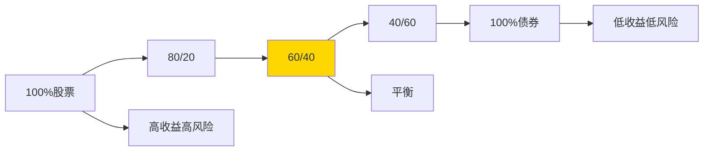

# 60/40 组合

## 概述

60/40 组合是最经典、最广为人知的资产配置策略之一，指的是将 60% 的资金投资于股票，40% 投资于债券。这个简单的配置方法已经存在了几十年，被无数个人投资者和机构采用。

**学习目标**：
- 理解 60/40 组合的历史起源和理论基础
- 掌握股债配置的核心逻辑
- 分析 60/40 组合的历史表现
- 了解当前环境下的挑战
- 学习如何调整和优化这一策略

**为什么重要**：60/40 组合是资产配置的基准，理解它的优势和局限性，对于构建适合自己的投资组合至关重要。即使不直接使用这个配置，它也是评估其他策略的参照标准。

## 历史起源

### 理论基础

60/40 组合的理论基础来自现代组合理论（MPT）。马科维茨的研究表明，通过组合不同相关性的资产，可以在不降低收益的情况下降低风险。

**关键发现**：
- 股票和债券的相关性较低（历史上约 0.2-0.3）
- 债券在股市下跌时往往表现较好
- 适度的债券配置可以显著降低组合波动率

### 演变历程

**1950s-1960s**：
- 机构投资者开始采用股债混合策略
- 养老金基金的标准配置
- 基于长期历史数据的实证研究

**1970s-1980s**：
- 个人投资者普及
- 共同基金推广
- 成为"平衡型基金"的标准

**1990s-2000s**：
- 目标日期基金采用
- 财务顾问的默认建议
- 学术研究验证

**2010s-至今**：
- 面临低利率挑战
- 出现各种变体
- 重新审视和调整

## 核心逻辑

### 股票部分（60%）

**作用**：
1. **增长引擎**：提供长期资本增值
2. **通胀对冲**：企业可以转嫁成本
3. **股息收入**：提供现金流

**特点**：
- 高预期收益（历史年化 10%）
- 高波动率（年化 15-18%）
- 长期向上趋势
- 短期波动大

### 债券部分（40%）

**作用**：
1. **稳定器**：降低组合波动率
2. **避险资产**：股市下跌时表现好
3. **收入来源**：提供稳定利息

**特点**：
- 低预期收益（历史年化 4-6%）
- 低波动率（年化 5-8%）
- 与股票负相关或低相关
- 保本性强

### 为什么是 60/40？

**经验法则**：
- 60% 股票：足够的增长潜力
- 40% 债券：足够的风险缓冲
- 平衡风险和收益

**风险收益权衡**：

**数据支持**：
- 60/40 在有效前沿上接近最优点
- 夏普比率通常较高
- 回撤可控（历史最大回撤约 -30%）

## 历史表现分析

### 长期表现（1926-2023）

| 指标 | 60/40 | 100%股票 | 100%债券 |
|-----|-------|---------|---------|
| 年化收益 | 8.7% | 10.3% | 5.3% |
| 年化波动率 | 11.2% | 18.5% | 5.8% |
| 夏普比率 | 0.78 | 0.56 | 0.91 |
| 最大回撤 | -32% | -83% | -21% |
| 正收益年份 | 78% | 73% | 82% |

**关键发现**：
1. 收益接近纯股票的 85%
2. 波动率只有纯股票的 60%
3. 夏普比率优于纯股票
4. 回撤显著降低

### 不同时期表现

**1980s-1990s（黄金时代）**：
- 股票大牛市
- 债券收益率下降（价格上涨）
- 60/40 年化收益 13-15%
- 几乎完美的配置

**2000s（失落的十年）**：
- 互联网泡沫破裂
- 2008 金融危机
- 60/40 年化收益 4-5%
- 债券表现救了组合

**2010s（复苏期）**：
- 股市强劲反弹
- 债券收益率持续下降
- 60/40 年化收益 10-12%
- 再次表现出色

**2020s（挑战期）**：
- 2020：COVID-19，60/40 收益 16%
- 2022：通胀飙升，60/40 亏损 -16%
- 股债同时下跌，罕见情况

### 危机中的表现

**2008 年金融危机**：
- 60/40：-22%
- 100% 股票：-37%
- 债券部分缓冲了 15% 的跌幅

**2020 年 COVID-19**：
- 60/40：最大回撤 -19%
- 快速反弹，全年 +16%
- 债券和股票都表现好

**2022 年通胀危机**：
- 60/40：-16%
- 股债同跌，罕见
- 40年来最差表现

## 实施方法

### 基础版本

**最简单的实施**：

| 资产 | 权重 | ETF 选择 |
|-----|------|---------|
| 美国股票 | 60% | VTI 或 SPY |
| 美国国债 | 40% | AGG 或 BND |

**优点**：
- 极其简单
- 成本低（费率 < 0.1%）
- 流动性好
- 易于再平衡

**缺点**：
- 缺乏国际分散化
- 债券久期固定
- 没有通胀保护

### 进阶版本

**增加分散化**：

| 资产 | 权重 | ETF 选择 |
|-----|------|---------|
| 美国大盘股 | 40% | SPY |
| 美国小盘股 | 10% | IWM |
| 国际发达市场 | 10% | VEA |
| 中期国债 | 25% | IEF |
| 长期国债 | 10% | TLT |
| 公司债 | 5% | LQD |

**优点**：
- 更好的分散化
- 捕捉小盘股溢价
- 国际敞口
- 债券久期多样化

**缺点**：
- 更复杂
- 再平衡更频繁
- 成本略高

### 生命周期调整

**年龄规则**：

$$
债券权重 = 年龄 \times 0.5
$$

或更保守的：

$$
债券权重 = 年龄
$$

**示例**：

| 年龄 | 股票 | 债券 | 理由 |
|-----|------|------|------|
| 30 | 85% | 15% | 长期增长 |
| 40 | 75% | 25% | 平衡增长 |
| 50 | 60% | 40% | 标准配置 |
| 60 | 45% | 55% | 保护本金 |
| 70 | 30% | 70% | 稳定收入 |

### 再平衡策略

**定期再平衡**：
- 频率：季度或年度
- 方法：卖出超配，买入低配
- 优点：纪律性强，简单
- 缺点：可能错过趋势

**阈值再平衡**：
- 触发：偏离 5-10% 时
- 方法：恢复到目标权重
- 优点：减少交易
- 缺点：需要监控

**混合策略**：
- 定期检查（季度）
- 偏离超过阈值时调整
- 平衡两种方法的优点

## 当前挑战

### 1. 低利率环境

**问题**：
- 债券收益率历史低位（2020-2021）
- 债券预期收益降低
- 60/40 预期收益下降

**影响**：
- 传统 60/40 预期收益可能只有 5-6%
- 难以满足退休需求
- 需要更高风险或更多储蓄

**应对**：
- 增加股票权重
- 增加另类资产
- 降低收益预期

### 2. 通胀风险

**问题**：
- 2021-2022 通胀飙升
- 传统债券不提供通胀保护
- 股债同时下跌

**2022 年教训**：
- 60/40 亏损 -16%
- 40 年来最差
- 股债相关性上升

**应对**：
- 增加 TIPS（通胀保值债券）
- 增加大宗商品
- 增加房地产

### 3. 股债相关性变化

**历史相关性**：
- 1990s-2010s：负相关或低相关
- 债券是有效的对冲

**近期变化**：
- 2022：相关性上升
- 股债同跌
- 分散化效果减弱

**原因**：
- 通胀预期变化
- 央行政策转向
- 利率上升

### 4. 人口老龄化

**问题**：
- 退休人口增加
- 需要更多稳定收入
- 传统 60/40 可能不够保守

**应对**：
- 增加债券权重
- 增加股息股票
- 考虑年金产品

## 改进方案

### 方案1：增加通胀保护

**配置**：
- 股票：50%
- 传统债券：25%
- TIPS：10%
- 大宗商品：10%
- 房地产：5%

**优点**：
- 通胀保护
- 更好的分散化
- 适应多种环境

### 方案2：全球分散化

**配置**：
- 美国股票：35%
- 国际股票：25%
- 美国债券：25%
- 国际债券：15%

**优点**：
- 地理分散化
- 货币分散化
- 降低单一市场风险

### 方案3：因子倾斜

**配置**：
- 价值股：30%
- 质量股：20%
- 小盘股：10%
- 债券：40%

**优点**：
- 捕捉因子溢价
- 潜在超额收益
- 仍保持平衡

### 方案4：动态配置

**方法**：
- 根据估值调整股债比例
- 股票便宜时增加股票
- 股票昂贵时增加债券

**指标**：
- 席勒 PE（CAPE）
- 股息收益率
- 债券收益率

**示例**：
- CAPE < 15：70% 股票
- CAPE 15-25：60% 股票
- CAPE > 25：50% 股票

## 常见问题

### Q1：60/40 已经过时了吗？

**答案**：不完全是，但需要调整。

**理由**：
- 核心逻辑仍然有效（股债分散化）
- 但需要适应新环境
- 可能需要更多资产类别
- 预期收益需要调整

### Q2：年轻人应该用 60/40 吗？

**答案**：通常不应该。

**理由**：
- 年轻人投资期限长
- 可以承受更高风险
- 应该更多股票（80-90%）
- 随年龄增长逐步增加债券

### Q3：退休人员应该用 60/40 吗？

**答案**：可能太激进。

**理由**：
- 退休人员风险承受能力低
- 需要稳定收入
- 可能需要 40/60 或更保守
- 考虑年金等产品

### Q4：如何应对低利率？

**选项**：
1. 接受更低收益
2. 增加股票权重
3. 增加另类资产
4. 延长工作年限
5. 增加储蓄率

### Q5：2022 年的表现说明什么？

**教训**：
1. 股债相关性会变化
2. 通胀是重要风险
3. 需要更多分散化
4. 不要过度依赖单一策略

## 实战建议

### 1. 确定适合的比例

**考虑因素**：
- 年龄和投资期限
- 风险承受能力
- 收入稳定性
- 其他资产（房产、养老金）

**测试方法**：
- 回测历史表现
- 压力测试
- 情景分析
- 睡眠测试（能否安心）

### 2. 选择合适的工具

**股票**：
- 低成本指数基金
- 全市场 ETF
- 考虑国际分散化

**债券**：
- 中期国债（5-10年）
- 总债券市场基金
- 考虑 TIPS

### 3. 制定再平衡计划

**频率**：
- 年度再平衡（最简单）
- 半年度（更及时）
- 季度（更频繁，成本更高）

**方法**：
- 使用新资金调整
- 税收损失收割
- 考虑交易成本

### 4. 监控和调整

**定期审查**：
- 年度审查配置
- 检查是否偏离目标
- 评估表现
- 调整预期

**调整触发**：
- 人生阶段变化
- 风险承受能力变化
- 市场环境重大变化
- 策略长期失效

## 延伸阅读

1. **Markowitz, H. (1952)**. "Portfolio Selection". *The Journal of Finance*, 7(1), 77-91.

2. **Swensen, D. F. (2005)**. *Unconventional Success: A Fundamental Approach to Personal Investment*. Free Press.

3. **Bernstein, W. J. (2010)**. *The Investor's Manifesto: Preparing for Prosperity, Armageddon, and Everything in Between*. Wiley.

4. **Ilmanen, A. (2011)**. *Expected Returns: An Investor's Guide to Harvesting Market Rewards*. Wiley.

5. **Arnott, R. D., Harvey, C. R., & Markowitz, H. (2019)**. "A Backtesting Protocol in the Era of Machine Learning". *The Journal of Financial Data Science*, 1(1), 64-74.

6. **Asness, C. S., Ilmanen, A., & Maloney, T. (2017)**. "Back in the Hunt: How to Get Competitive Returns with Half the Risk". *The Journal of Portfolio Management*, 43(3), 1-11.

## 总结

60/40 组合是一个经典的资产配置策略，经受了时间的考验。虽然面临低利率和高通胀的挑战，但其核心逻辑——通过股债分散化平衡风险和收益——仍然有效。

**关键要点**：
1. 60/40 提供了风险和收益的良好平衡
2. 历史表现优秀，但未来可能不同
3. 需要根据个人情况调整比例
4. 当前环境下可能需要增加其他资产
5. 定期再平衡和审查很重要

60/40 不是完美的策略，但它为个人投资者提供了一个简单、有效的起点。在实际应用中，要根据自己的年龄、风险承受能力和投资目标进行调整，并保持灵活性以适应市场变化。

---

**下一步学习**：
- [All Weather 组合](all-weather-portfolio.html) - 学习更分散化的配置
- [风险平价](risk-parity.html) - 理解风险平衡原理
- [战术配置](tactical-allocation.html) - 学习动态调整方法
