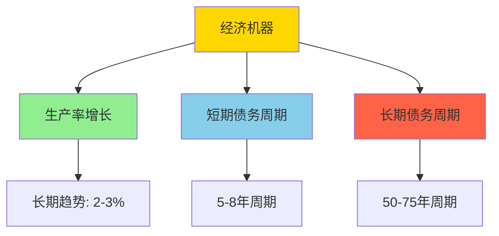
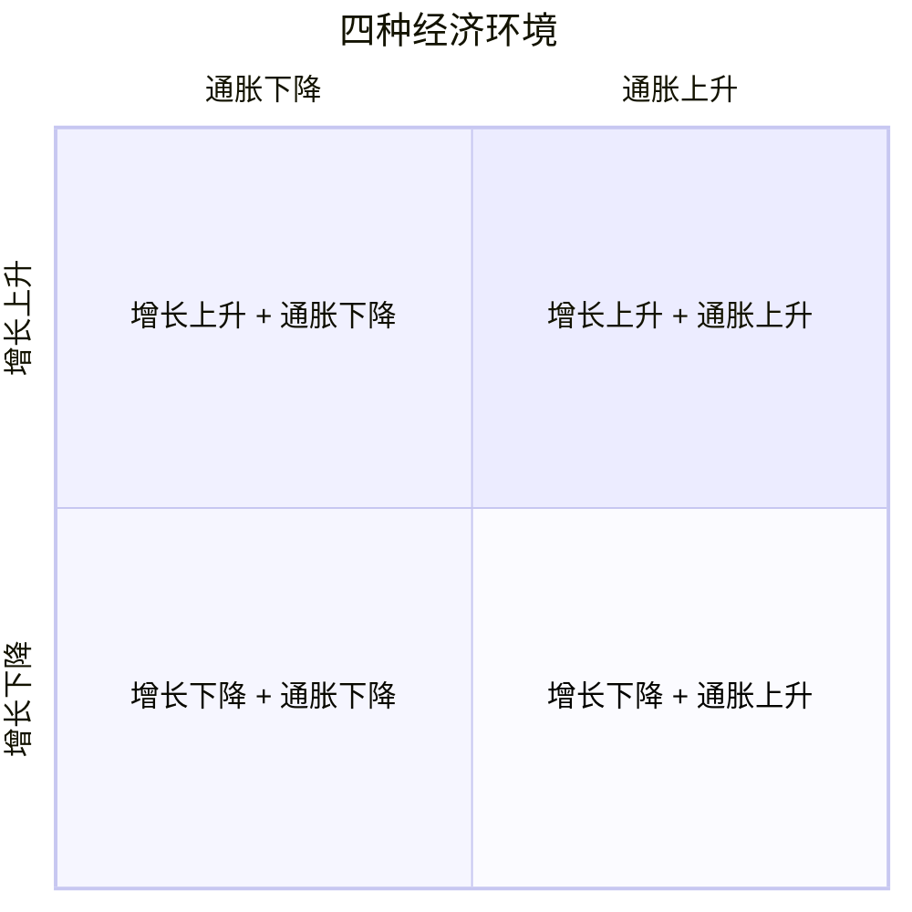

# All Weather 组合

## 概述

All Weather Portfolio（全天候投资组合）是由桥水基金（Bridgewater Associates）创始人雷·达里奥（Ray Dalio）设计的一种资产配置策略。这个策略的核心理念是构建一个能够在各种经济环境下都表现良好的投资组合，而不是试图预测市场走向。

**学习目标**：
- 理解 All Weather 策略的设计理念
- 掌握经济环境与资产表现的关系
- 学习 All Weather 的资产配置方法
- 了解策略的历史表现和适用场景
- 掌握个人投资者的实施方法

**为什么重要**：All Weather 策略代表了一种全新的投资思维方式——不预测市场，而是为所有可能的经济环境做好准备。这种方法简单、透明、易于理解，适合长期投资者。

## 达里奥的投资哲学

### 核心理念

**1. 不要预测市场**

达里奥认为，没有人能够持续准确地预测市场走向。与其试图择时，不如构建一个在各种环境下都能表现的组合。

> "我不知道未来会发生什么，但我知道如何为各种可能性做好准备。" —— Ray Dalio

**2. 平衡风险，而非平衡资金**

传统的 60/40 组合虽然资金分配平衡，但风险高度集中在股票上。All Weather 通过风险平价实现真正的风险平衡。

**3. 分散化是唯一的免费午餐**

通过持有在不同经济环境下表现良好的资产，可以降低组合波动率而不牺牲收益。

### 经济机器理论

达里奥将经济看作一台机器，由三大驱动力推动：

**1. 生产率增长**：
- 长期趋势，年均 2-3%
- 由技术进步、教育、创新驱动
- 相对稳定和可预测

**2. 短期债务周期**：
- 5-8 年周期
- 由信贷扩张和收缩驱动
- 央行通过利率调控

**3. 长期债务周期**：
- 50-75 年周期
- 债务累积到不可持续水平
- 导致去杠杆化和结构性调整

## 四种经济环境

### 经济环境矩阵

All Weather 策略基于一个简单但强大的框架：经济只有两个变量（增长和通胀），每个变量有两种状态（上升或下降），因此有四种可能的经济环境。

| 环境 | 增长 | 通胀 | 表现好的资产 |
|-----|------|------|------------|
| 1. 繁荣 | ↑ | ↑ | 股票、大宗商品、通胀保值债券 |
| 2. 增长 | ↑ | ↓ | 股票、公司债券 |
| 3. 衰退 | ↓ | ↓ | 国债、现金 |
| 4. 滞胀 | ↓ | ↑ | 通胀保值债券、大宗商品、黄金 |

### 资产在不同环境下的表现

**股票**：
- 增长上升时表现好
- 通胀温和时表现好
- 衰退和高通胀时表现差

**国债**：
- 增长下降时表现好
- 通胀下降时表现好
- 避险资产

**通胀保值债券（TIPS）**：
- 通胀上升时表现好
- 保护购买力
- 增长下降时也有支撑

**大宗商品**：
- 通胀上升时表现好
- 增长上升时表现好
- 供给冲击时表现好

**黄金**：
- 通胀上升时表现好
- 危机时避险
- 货币贬值时保值

## All Weather 资产配置

### 标准配置

**达里奥的原始配置**：

| 资产类别 | 权重 | 风险贡献 |
|---------|------|---------|
| 股票 | 30% | 25% |
| 长期国债（20-25年） | 40% | 25% |
| 中期国债（7-10年） | 15% | 25% |
| 大宗商品 | 7.5% | 12.5% |
| 黄金 | 7.5% | 12.5% |

**设计逻辑**：

1. **股票（30%）**：
   - 捕捉经济增长
   - 长期收益最高
   - 但波动率高，所以权重相对低

2. **国债（55%）**：
   - 分散股票风险
   - 衰退时表现好
   - 长期债券对利率更敏感

3. **通胀对冲（15%）**：
   - 大宗商品和黄金
   - 保护购买力
   - 滞胀时表现好

### 风险平衡原理

**为什么债券权重这么高？**

考虑波动率：
- 股票：年化波动率 18%
- 长期国债：年化波动率 12%
- 大宗商品：年化波动率 20%

**风险贡献计算**：
- 30% 股票 × 18% 波动率 = 5.4 单位风险
- 55% 债券 × 12% 波动率 = 6.6 单位风险
- 15% 商品 × 20% 波动率 = 3.0 单位风险

通过调整权重，使每类资产的风险贡献大致相等。

### 简化版本

**托尼·罗宾斯版本**（更适合个人投资者）：

| 资产类别 | 权重 |
|---------|------|
| 美国股票 | 30% |
| 长期国债 | 40% |
| 中期国债 | 15% |
| 黄金 | 7.5% |
| 大宗商品 | 7.5% |

**实施工具**：
- 股票：VTI（全市场）或 SPY（S&P 500）
- 长期国债：TLT（20年期以上）
- 中期国债：IEF（7-10年期）
- 黄金：GLD（黄金 ETF）
- 大宗商品：DBC（大宗商品 ETF）

## 历史表现分析

### 长期回测（1984-2023）

**年化收益**：
- All Weather：7.8%
- 60/40 组合：8.2%
- S&P 500：10.5%

**年化波动率**：
- All Weather：7.5%
- 60/40 组合：10.2%
- S&P 500：15.3%

**夏普比率**：
- All Weather：1.04
- 60/40 组合：0.80
- S&P 500：0.69

**最大回撤**：
- All Weather：-13.9%（2008）
- 60/40 组合：-32.5%（2008）
- S&P 500：-50.9%（2008）

### 关键时期表现

**2008 年金融危机**：
- All Weather：-3.9%
- 60/40 组合：-22.1%
- S&P 500：-37.0%

**2020 年 COVID-19**：
- All Weather：+12.5%
- 60/40 组合：+16.8%
- S&P 500：+18.4%

**2022 年通胀年**：
- All Weather：-12.8%
- 60/40 组合：-16.1%
- S&P 500：-18.1%

**关键发现**：
1. All Weather 在危机中表现出色
2. 牛市中跑输股票，但风险调整收益更好
3. 通胀环境下也有一定保护

## 实施指南

### 个人投资者版本

**步骤 1：选择工具**

| 资产 | ETF 选择 | 费率 |
|-----|---------|------|
| 美国股票 | VTI 或 SPY | 0.03% |
| 长期国债 | TLT | 0.15% |
| 中期国债 | IEF | 0.15% |
| 黄金 | GLD 或 IAU | 0.25% |
| 大宗商品 | DBC 或 PDBC | 0.87% |

**步骤 2：初始建仓**

假设投资 $100,000：
- VTI：$30,000
- TLT：$40,000
- IEF：$15,000
- GLD：$7,500
- DBC：$7,500

**步骤 3：再平衡**

**频率**：季度或半年度

**方法**：
1. 计算当前权重
2. 与目标权重比较
3. 偏离超过 5% 时调整
4. 优先使用新资金调整

**示例**：
- 目标：30% 股票
- 当前：35% 股票（市场上涨）
- 行动：卖出 5% 股票，买入其他资产

### 进阶版本

**增加资产类别**：

| 资产类别 | 权重 | 工具 |
|---------|------|------|
| 美国大盘股 | 15% | SPY |
| 美国小盘股 | 7.5% | IWM |
| 国际股票 | 7.5% | VEA |
| 长期国债 | 25% | TLT |
| 中期国债 | 15% | IEF |
| 通胀保值债券 | 15% | TIP |
| 黄金 | 7.5% | GLD |
| 大宗商品 | 7.5% | DBC |

**优势**：
- 更细致的分散化
- 更好的风险平衡
- 捕捉更多投资机会

### 税收优化

**账户配置**：

**应税账户**：
- 股票 ETF（长期资本利得税率低）
- 市政债券（免税）

**退休账户（IRA/401k）**：
- 债券 ETF（利息收入税率高）
- 大宗商品（税务复杂）
- 黄金（收藏品税率高）

**税收损失收割**：
- 亏损资产卖出抵税
- 买入类似但不同的 ETF
- 避免洗售规则（30天）

## 优势与局限

### 主要优势

**1. 简单透明**
- 规则明确
- 易于理解
- 易于实施

**2. 风险分散**
- 真正的风险平衡
- 适应多种环境
- 降低回撤

**3. 情绪管理**
- 不需要择时
- 减少焦虑
- 坚持更容易

**4. 长期稳定**
- 风险调整收益好
- 波动率低
- 适合长期持有

### 主要局限

**1. 牛市跑输**
- 股票权重低
- 错过大涨
- 需要耐心

**2. 大宗商品挑战**
- 波动率高
- 长期收益低
- 展期成本

**3. 利率环境敏感**
- 债券权重高
- 利率上升时承压
- 2022年表现差

**4. 实施成本**
- 多个 ETF
- 再平衡成本
- 大宗商品费率高

## 常见问题

### Q1：All Weather 适合我吗？

**适合**：
- 长期投资者（10年以上）
- 风险厌恶者
- 不想择时的投资者
- 追求稳定收益的投资者

**不适合**：
- 追求高收益的投资者
- 短期投资者
- 能够承受高波动的投资者
- 有择时能力的投资者

### Q2：需要多少资金？

**最低**：$5,000-$10,000
- 可以买入所有 5 个 ETF
- 每个 ETF 至少 1 股

**理想**：$50,000+
- 更好的分散化
- 再平衡更灵活
- 成本占比更低

### Q3：多久再平衡一次？

**建议**：
- 定期：半年度或年度
- 阈值：偏离 5-10% 时
- 混合：定期检查 + 阈值触发

**考虑因素**：
- 交易成本
- 税收影响
- 时间精力

### Q4：可以调整权重吗？

**可以，但要谨慎**：
- 保持风险平衡原则
- 不要过度倾斜
- 记录调整理由
- 定期审查

**示例调整**：
- 年轻投资者：增加股票至 40%
- 退休投资者：减少股票至 20%
- 看好通胀：增加 TIPS 和商品

### Q5：如何应对市场变化？

**原则**：坚持策略，不要频繁调整

**例外情况**：
- 结构性变化（如利率长期趋势改变）
- 个人情况变化（如临近退休）
- 策略失效（如长期表现远低于预期）

## 实战案例

### 案例1：年轻投资者（30岁）

**背景**：
- 年龄：30岁
- 投资期限：30年
- 风险承受能力：中等
- 初始资金：$50,000

**配置**：
- 股票：40%（增加）
- 长期国债：30%（减少）
- 中期国债：15%
- 黄金：7.5%
- 大宗商品：7.5%

**理由**：
- 投资期限长，可承受更高风险
- 增加股票捕捉长期增长
- 仍保持风险分散

### 案例2：退休投资者（65岁）

**背景**：
- 年龄：65岁
- 投资期限：20年
- 风险承受能力：低
- 初始资金：$500,000

**配置**：
- 股票：20%（减少）
- 长期国债：45%（增加）
- 中期国债：20%（增加）
- 黄金：7.5%
- 大宗商品：7.5%

**理由**：
- 降低波动率
- 增加稳定收入
- 保护本金

### 案例3：高通胀环境调整

**背景**：
- 2021-2022年高通胀
- 传统债券表现差
- 需要更多通胀保护

**调整**：
- 股票：30%
- 长期国债：25%（减少）
- 中期国债：10%（减少）
- 通胀保值债券：20%（新增）
- 黄金：7.5%
- 大宗商品：7.5%

**结果**：
- 2022年回撤减小
- 通胀保护增强
- 长期仍保持平衡

## 与其他策略对比

### vs 60/40 组合

| 特征 | All Weather | 60/40 |
|-----|------------|-------|
| 股票权重 | 30% | 60% |
| 债券权重 | 55% | 40% |
| 其他资产 | 15% | 0% |
| 年化收益 | 7.8% | 8.2% |
| 年化波动率 | 7.5% | 10.2% |
| 夏普比率 | 1.04 | 0.80 |
| 最大回撤 | -13.9% | -32.5% |

**结论**：All Weather 风险调整收益更好，但绝对收益略低。

### vs 永久组合

**永久组合**（Harry Browne）：
- 25% 股票
- 25% 长期国债
- 25% 黄金
- 25% 现金

**对比**：
- 永久组合更简单
- All Weather 更灵活
- All Weather 历史表现更好
- 永久组合更保守

### vs 纯股票

| 指标 | All Weather | S&P 500 |
|-----|------------|---------|
| 年化收益 | 7.8% | 10.5% |
| 年化波动率 | 7.5% | 15.3% |
| 夏普比率 | 1.04 | 0.69 |
| 最大回撤 | -13.9% | -50.9% |

**结论**：All Weather 收益低但风险更低，适合风险厌恶者。

## 延伸阅读

### 达里奥著作

1. **Dalio, R. (2017)**. *Principles: Life and Work*. Simon & Schuster.
   - 达里奥的人生和投资原则

2. **Dalio, R. (2018)**. *Principles for Navigating Big Debt Crises*. Bridgewater Associates.
   - 债务周期和危机应对

3. **Dalio, R. (2021)**. *Principles for Dealing with the Changing World Order*. Avid Reader Press.
   - 世界秩序变化和投资启示

### 策略研究

4. **Robbins, T. (2014)**. *Money: Master the Game*. Simon & Schuster.
   - 介绍 All Weather 策略给大众

5. **Asness, C. S., Frazzini, A., & Pedersen, L. H. (2012)**. "Leverage Aversion and Risk Parity". *Financial Analysts Journal*, 68(1), 47-59.

6. **Qian, E. (2011)**. "Risk Parity and Diversification". *The Journal of Investing*, 20(1), 119-127.

### 实施指南

7. **Swensen, D. F. (2005)**. *Unconventional Success: A Fundamental Approach to Personal Investment*. Free Press.
   - 个人投资者的资产配置

8. **Bernstein, W. J. (2010)**. *The Investor's Manifesto: Preparing for Prosperity, Armageddon, and Everything in Between*. Wiley.
   - 简单有效的投资策略

## 总结

All Weather 组合是一个简单但强大的投资策略，通过风险平衡和分散化，在各种经济环境下都能提供稳定的收益。它不追求最高收益，而是追求最佳的风险调整收益。

**关键要点**：
1. 为所有经济环境做好准备，而不是预测市场
2. 平衡风险贡献，而不是平衡资金
3. 简单、透明、易于实施
4. 适合长期投资者和风险厌恶者
5. 需要耐心和纪律，坚持策略

All Weather 不是完美的策略，但它为个人投资者提供了一个可靠的起点。在实际应用中，可以根据个人情况进行适当调整，但要保持核心原则不变。

---

**下一步学习**：
- [风险平价](risk-parity.html) - 深入理解风险平衡原理
- [60/40 组合](60-40-portfolio.html) - 对比传统配置方法
- [达里奥原则](../macro-investing/dalio-principles.html) - 学习达里奥的投资哲学
