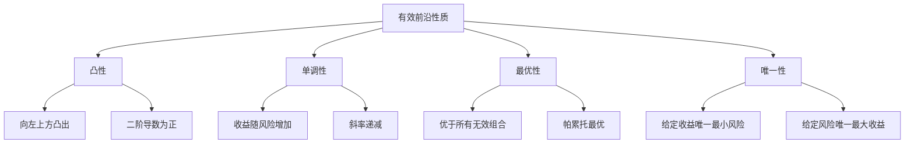
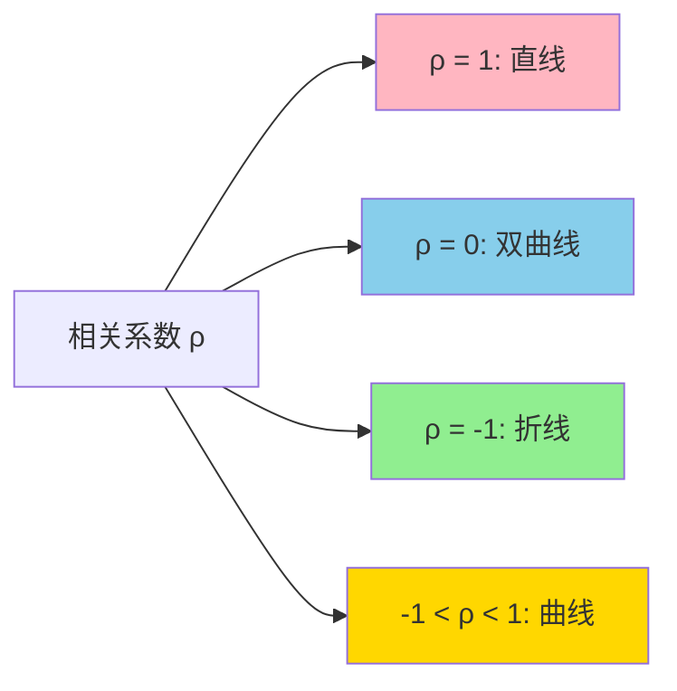
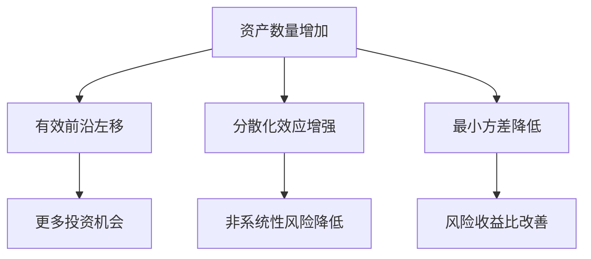

# 有效前沿

## 概述

有效前沿（Efficient Frontier）是现代组合理论中最重要的概念之一，它描述了在风险-收益平面上所有最优投资组合的集合。理解有效前沿对于构建科学的投资组合至关重要。

**学习目标**：
- 深入理解有效前沿的数学原理
- 掌握有效前沿的构建方法
- 学习如何在有效前沿上选择最优组合
- 了解影响有效前沿形状的因素
- 掌握实际应用中的技巧和注意事项

**为什么重要**：有效前沿为投资者提供了一个可视化的决策框架，帮助投资者在风险和收益之间做出理性权衡。它是资产配置的核心工具，被广泛应用于养老金管理、财富管理和机构投资。

## 有效前沿的定义

### 基本概念

**有效组合（Efficient Portfolio）**：在给定风险水平下收益最高，或在给定收益水平下风险最低的投资组合。

**有效前沿**：所有有效组合在风险-收益平面上构成的曲线。

**无效组合（Inefficient Portfolio）**：位于有效前沿下方的组合，存在相同风险但收益更高的组合，或相同收益但风险更低的组合。

### 数学表达

有效前沿可以通过求解以下优化问题得到：

**最小化风险**：
$$
\min_{w} \sigma_p^2 = w^T \Sigma w
$$

**约束条件**：
$$
\begin{aligned}
w^T \mu &= \mu_p \quad \text{(目标收益约束)} \\
w^T \mathbf{1} &= 1 \quad \text{(权重和为1)} \\
w_i &\geq 0 \quad \text{(非负约束，可选)}
\end{aligned}
$$

其中：
- $w$ 是权重向量
- $\Sigma$ 是协方差矩阵
- $\mu$ 是预期收益向量
- $\mu_p$ 是目标组合收益

### 有效前沿的性质



**1. 凸性**：有效前沿是一条向左上方凸出的曲线，这是由于分散化效应。

**2. 单调性**：沿着有效前沿向上移动，预期收益和风险同时增加。

**3. 最优性**：有效前沿上的任何组合都优于前沿下方的组合。

**4. 唯一性**：对于给定的预期收益，有效前沿上只有一个最小方差组合。

**5. 斜率递减**：有效前沿的斜率（边际收益/边际风险）随着风险增加而递减。

## 有效前沿的构建

### 两资产情况

**最简单的情况**：考虑两个资产 A 和 B。

**组合收益**：
$$
\mu_p = w_A \mu_A + w_B \mu_B = w_A \mu_A + (1-w_A) \mu_B
$$

**组合方差**：
$$
\sigma_p^2 = w_A^2 \sigma_A^2 + w_B^2 \sigma_B^2 + 2w_A w_B \rho_{AB} \sigma_A \sigma_B
$$

**相关系数的影响**：



- **ρ = 1**：完全正相关，组合在直线上，无分散化效应
- **ρ = -1**：完全负相关，可以构建零风险组合
- **-1 < ρ < 1**：部分分散化效应，曲线向左凸出

**示例**：
- 资产 A：μ = 8%, σ = 15%
- 资产 B：μ = 12%, σ = 25%
- ρ = 0.3

通过改变 $w_A$ 从 0 到 1，可以得到不同的组合，绘制出有效前沿。

### 多资产情况

**步骤**：

1. **数据准备**
   - 收集历史收益率数据
   - 计算预期收益向量 $\mu$
   - 计算协方差矩阵 $\Sigma$

2. **设定目标收益范围**
   - 最小收益：$\mu_{min} = \min_i \mu_i$
   - 最大收益：$\mu_{max} = \max_i \mu_i$
   - 生成一系列目标收益：$\mu_p \in [\mu_{min}, \mu_{max}]$

3. **优化求解**
   - 对每个目标收益 $\mu_p$，求解最小方差组合
   - 记录最优权重和对应的风险 $\sigma_p$

4. **绘制曲线**
   - 将所有 $(\sigma_p, \mu_p)$ 点连接成曲线

### Python 实现

```python
import numpy as np
import pandas as pd
from scipy.optimize import minimize
import matplotlib.pyplot as plt

def calculate_portfolio_stats(weights, returns, cov_matrix):
    """计算组合统计量"""
    portfolio_return = np.sum(returns * weights)
    portfolio_std = np.sqrt(np.dot(weights.T, np.dot(cov_matrix, weights)))
    return portfolio_return, portfolio_std

def minimize_variance(target_return, returns, cov_matrix):
    """最小化方差"""
    n_assets = len(returns)
    
    # 目标函数：最小化方差
    def portfolio_variance(weights):
        return np.dot(weights.T, np.dot(cov_matrix, weights))
    
    # 约束条件
    constraints = [
        {'type': 'eq', 'fun': lambda w: np.sum(w) - 1},  # 权重和为1
        {'type': 'eq', 'fun': lambda w: np.sum(w * returns) - target_return}  # 目标收益
    ]
    
    # 权重边界
    bounds = tuple((0, 1) for _ in range(n_assets))
    
    # 初始权重
    init_weights = np.array([1/n_assets] * n_assets)
    
    # 优化
    result = minimize(
        portfolio_variance,
        init_weights,
        method='SLSQP',
        bounds=bounds,
        constraints=constraints
    )
    
    return result.x

def generate_efficient_frontier(returns, cov_matrix, n_points=100):
    """生成有效前沿"""
    min_return = np.min(returns)
    max_return = np.max(returns)
    target_returns = np.linspace(min_return, max_return, n_points)
    
    efficient_portfolios = []
    for target in target_returns:
        try:
            weights = minimize_variance(target, returns, cov_matrix)
            p_return, p_std = calculate_portfolio_stats(weights, returns, cov_matrix)
            efficient_portfolios.append({
                'return': p_return,
                'std': p_std,
                'weights': weights
            })
        except:
            continue
    
    return efficient_portfolios

def plot_efficient_frontier(efficient_portfolios, returns, stds, labels):
    """绘制有效前沿"""
    ef_returns = [p['return'] for p in efficient_portfolios]
    ef_stds = [p['std'] for p in efficient_portfolios]
    
    plt.figure(figsize=(12, 8))
    plt.plot(ef_stds, ef_returns, 'b-', linewidth=2, label='Efficient Frontier')
    plt.scatter(stds, returns, c='red', s=100, label='Individual Assets')
    
    for i, label in enumerate(labels):
        plt.annotate(label, (stds[i], returns[i]))
    
    plt.xlabel('Risk (Standard Deviation)')
    plt.ylabel('Expected Return')
    plt.title('Efficient Frontier')
    plt.legend()
    plt.grid(True)
    plt.show()
```

## 关键点与特殊组合

### 最小方差组合（MVP）

**定义**：有效前沿最左端的点，风险最小的组合。

**求解**：
$$
\min_{w} w^T \Sigma w
$$
$$
\text{s.t. } w^T \mathbf{1} = 1
$$

**解析解**：
$$
w_{MVP} = \frac{\Sigma^{-1} \mathbf{1}}{\mathbf{1}^T \Sigma^{-1} \mathbf{1}}
$$

**特点**：
- 不依赖于预期收益估计
- 对估计误差相对稳健
- 适合风险极度厌恶的投资者

### 切点组合（Tangency Portfolio）

**定义**：从无风险资产点向有效前沿作切线，切点对应的组合。

**求解**：最大化夏普比率
$$
\max_{w} \frac{w^T \mu - r_f}{\sqrt{w^T \Sigma w}}
$$

**解析解**：
$$
w_{tan} = \frac{\Sigma^{-1} (\mu - r_f \mathbf{1})}{\mathbf{1}^T \Sigma^{-1} (\mu - r_f \mathbf{1})}
$$

**特点**：
- 夏普比率最大
- 所有投资者都应持有（两基金分离定理）
- 对预期收益估计敏感

### 等权重组合

**定义**：所有资产权重相等的组合。

$$
w_i = \frac{1}{n}, \quad i = 1, 2, ..., n
$$

**特点**：
- 简单易实施
- 不需要估计参数
- 通常不在有效前沿上
- 实证表现往往不错（1/n 悖论）

## 影响有效前沿的因素

### 1. 资产数量



**效应**：
- 资产越多，有效前沿越向左移动
- 分散化效应增强，可以实现更低的风险
- 但边际效应递减，超过20-30个资产后改善有限

### 2. 相关性

**低相关性**：
- 有效前沿向左凸出更多
- 分散化效应更强
- 可以实现更低的风险

**高相关性**：
- 有效前沿接近直线
- 分散化效应弱
- 风险降低有限

**实例**：
- 同行业股票：相关性高（0.7-0.9）
- 跨资产类别：相关性低（0.2-0.5）
- 对冲资产：负相关（-0.3 to 0）

### 3. 预期收益差异

**收益差异大**：
- 有效前沿更陡峭
- 风险收益权衡更明显
- 资产选择更重要

**收益差异小**：
- 有效前沿较平缓
- 风险分散更重要
- 资产选择影响小

### 4. 约束条件

**无约束**：
- 有效前沿最优
- 可能出现极端权重
- 允许卖空

**有约束**：
- 有效前沿向右下方移动
- 权重更分散
- 更符合实际

**常见约束**：
- 非负约束：$w_i \geq 0$
- 权重上限：$w_i \leq w_{max}$
- 行业限制：$\sum_{i \in sector} w_i \leq limit$

## 实际应用

### 案例1：股债配置

**资产**：
- 股票（S&P 500）：μ = 10%, σ = 18%
- 债券（10年期国债）：μ = 4%, σ = 6%
- 相关系数：ρ = 0.2

**有效前沿**：

| 股票权重 | 债券权重 | 预期收益 | 标准差 | 夏普比率 |
|---------|---------|---------|--------|---------|
| 0%      | 100%    | 4.0%    | 6.0%   | 0.67    |
| 20%     | 80%     | 5.2%    | 5.8%   | 0.90    |
| 40%     | 60%     | 6.4%    | 7.2%   | 0.89    |
| 60%     | 40%     | 7.6%    | 10.0%  | 0.76    |
| 80%     | 20%     | 8.8%    | 13.6%  | 0.65    |
| 100%    | 0%      | 10.0%   | 18.0%  | 0.56    |

**最优配置**：约 30% 股票，70% 债券（夏普比率最大）

### 案例2：多资产组合

**资产类别**：
1. 美国股票：μ = 9%, σ = 16%
2. 国际股票：μ = 8%, σ = 18%
3. 新兴市场：μ = 11%, σ = 25%
4. 债券：μ = 4%, σ = 5%
5. 房地产：μ = 7%, σ = 15%
6. 大宗商品：μ = 6%, σ = 20%

**相关系数矩阵**：
```
        US   Intl  EM   Bond  RE   Comm
US      1.0  0.8   0.7  0.2   0.6  0.3
Intl    0.8  1.0   0.8  0.3   0.5  0.4
EM      0.7  0.8   1.0  0.1   0.5  0.5
Bond    0.2  0.3   0.1  1.0   0.3  0.1
RE      0.6  0.5   0.5  0.3   1.0  0.4
Comm    0.3  0.4   0.5  0.1   0.4  1.0
```

**优化结果**：
- 最小方差组合：60% 债券，20% 美国股票，20% 其他
- 最大夏普比率：35% 美国股票，25% 新兴市场，20% 债券，20% 其他

### 案例3：目标日期基金

**概念**：根据退休日期自动调整资产配置，沿着有效前沿移动。

**生命周期配置**：


**配置变化**：
- 30岁：90% 股票，10% 债券（高风险高收益）
- 45岁：70% 股票，30% 债券（中等风险）
- 60岁：40% 股票，60% 债券（低风险）
- 75岁：20% 股票，80% 债券（保守）

## 实践挑战与解决方案

### 挑战1：估计误差

**问题**：
- 预期收益难以准确估计
- 协方差矩阵不稳定
- 有效前沿位置不确定

**解决方案**：
1. **收缩估计**：向均值或市场组合收缩
2. **贝叶斯方法**：结合先验信息
3. **稳健优化**：考虑参数不确定性
4. **情景分析**：测试不同假设下的结果

### 挑战2：权重不稳定

**问题**：
- 输入微小变化导致权重大幅变动
- 频繁再平衡成本高
- 实施困难

**解决方案**：
1. **正则化**：添加权重变化惩罚项
2. **换手率约束**：限制交易量
3. **权重约束**：设置上下限
4. **再平衡阈值**：只在偏离较大时调整

### 挑战3：极端权重

**问题**：
- 少数资产权重过高
- 集中度风险
- 流动性问题

**解决方案**：
1. **权重上限**：如单个资产不超过 20%
2. **分散化约束**：最小持仓数量
3. **行业限制**：行业权重上限
4. **流动性约束**：考虑交易量

### 挑战4：非正态分布

**问题**：
- 收益率有偏度和峰度
- 尾部风险
- 均值-方差不充分

**解决方案**：
1. **下行风险度量**：使用 CVaR
2. **高阶矩优化**：考虑偏度和峰度
3. **情景优化**：基于历史情景
4. **压力测试**：极端情况分析

## 常见误区

### 误区1：有效前沿是静态的

**真相**：有效前沿随时间变化，需要定期更新。市场环境、资产特性、相关性都会改变。

### 误区2：应该选择有效前沿上的任意点

**真相**：选择应该基于投资者的风险承受能力、投资目标和约束条件。

### 误区3：历史有效前沿可以预测未来

**真相**：历史数据只是参考，未来可能大不相同。需要结合前瞻性分析。

### 误区4：有效前沿上的组合一定优于其他组合

**真相**：考虑交易成本、税收、流动性后，有效前沿上的组合可能不是最优的。

### 误区5：更多资产总是更好

**真相**：资产数量增加的边际效应递减，过多资产增加管理复杂度和成本。

## 实战建议

### 1. 数据质量

**关键**：
- 使用足够长的历史数据（至少5-10年）
- 考虑结构性变化
- 调整异常值
- 使用多个数据源验证

### 2. 参数估计

**预期收益**：
- 不要完全依赖历史均值
- 结合估值、经济预测
- 使用收缩估计
- 考虑风险溢价

**协方差矩阵**：
- 使用因子模型
- 收缩估计（Ledoit-Wolf）
- 考虑时变性
- 稳健估计方法

### 3. 约束设置

**实用约束**：
- 权重上下限（如 5%-30%）
- 换手率限制（如年度 < 50%）
- 行业/地区限制
- 流动性要求

### 4. 实施与监控

**实施**：
- 分批建仓
- 考虑市场冲击
- 税收优化
- 成本控制

**监控**：
- 定期审查（季度/年度）
- 跟踪偏离度
- 评估表现
- 及时调整

## 延伸阅读

1. **Markowitz, H. (1952)**. "Portfolio Selection". *The Journal of Finance*, 7(1), 77-91.

2. **Merton, R. C. (1972)**. "An Analytic Derivation of the Efficient Portfolio Frontier". *Journal of Financial and Quantitative Analysis*, 7(4), 1851-1872.

3. **Elton, E. J., & Gruber, M. J. (1997)**. "Modern Portfolio Theory, 1950 to Date". *Journal of Banking & Finance*, 21(11-12), 1743-1759.

4. **DeMiguel, V., Garlappi, L., & Uppal, R. (2009)**. "Optimal Versus Naive Diversification: How Inefficient is the 1/N Portfolio Strategy?". *The Review of Financial Studies*, 22(5), 1915-1953.

5. **Michaud, R. O., & Michaud, R. O. (2008)**. *Efficient Asset Management: A Practical Guide to Stock Portfolio Optimization and Asset Allocation*. Oxford University Press.


6. Markowitz, H. (1952). "Portfolio Selection." *Journal of Finance*, 7(1), 77-91.
7. Sharpe, W. F. (1964). "Capital Asset Prices: A Theory of Market Equilibrium under Conditions of Risk." *Journal of Finance*, 19(3), 425-442.
8. Merton, R. C. (1973). "An Intertemporal Capital Asset Pricing Model." *Econometrica*, 41(5), 867-887.
## 总结

有效前沿是现代投资组合理论的核心概念，为投资者提供了科学的资产配置框架。理解有效前沿的构建、性质和应用，对于做出理性的投资决策至关重要。

**关键要点**：
1. 有效前沿描述了最优风险-收益组合
2. 分散化可以改善风险收益比
3. 投资者应根据风险偏好选择有效前沿上的点
4. 实践中需要考虑估计误差和各种约束
5. 有效前沿需要定期更新和调整

在实际应用中，要灵活运用有效前沿理论，结合市场环境、投资目标和实际约束，构建适合自己的投资组合。

---

**下一步学习**：
- [风险平价](risk-parity.html) - 学习基于风险贡献的配置方法
- [All Weather 组合](all-weather-portfolio.html) - 研究达里奥的全天候策略
- [现代组合理论](modern-portfolio-theory.html) - 回顾理论基础
