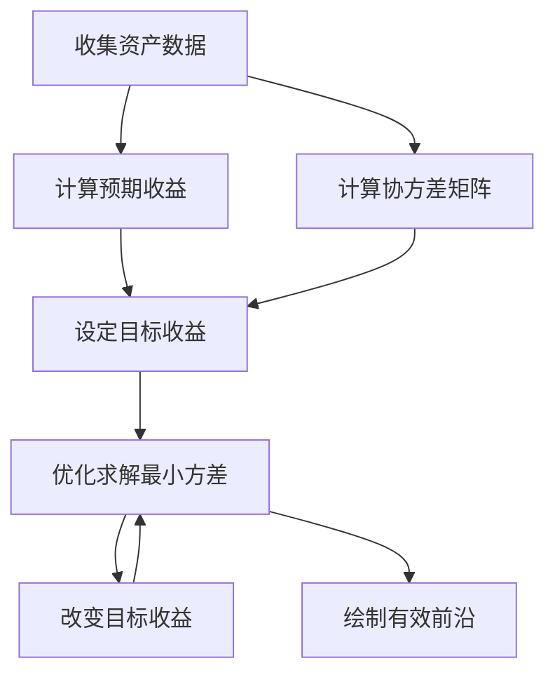
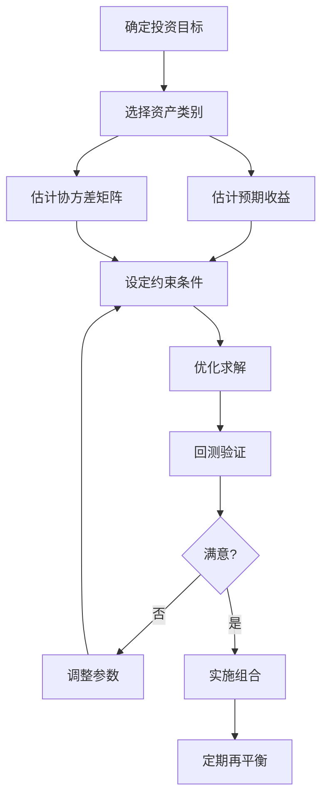

# 现代组合理论

## 概述

现代组合理论（Modern Portfolio Theory, MPT）由哈里·马科维茨（Harry Markowitz）于1952年提出，是现代金融学的基石之一。MPT 通过数学方法量化了投资组合的风险和收益关系，为投资者提供了科学的资产配置框架。马科维茨因此获得了1990年诺贝尔经济学奖。

**学习目标**：
- 理解 MPT 的理论基础和核心假设
- 掌握有效前沿的概念和构建方法
- 学习 CAPM 模型及其应用
- 了解 MPT 在实践中的局限性和改进方法
- 掌握组合优化的数学方法

**为什么重要**：MPT 改变了投资者对风险的认识，从关注单个资产转向关注整体组合，强调分散化的价值。它为资产配置、风险管理、业绩评估提供了理论基础，是每个投资者必须掌握的核心理论。

## MPT 理论基础

### 核心思想

**风险与收益的权衡**：投资者在追求收益的同时必须承担风险，理性的投资者会在给定风险水平下追求最大收益，或在给定收益水平下追求最小风险。

**分散化的价值**：通过持有多个相关性不完全的资产，可以在不降低预期收益的情况下降低组合风险。这是"不要把所有鸡蛋放在一个篮子里"的数学证明。

**系统性思维**：投资决策应该从组合整体出发，而不是孤立地评估单个资产。一个资产对组合的贡献取决于它与其他资产的相关性。

### 基本假设

MPT 建立在以下假设之上：

1. **投资者是风险厌恶的**：在相同预期收益下，投资者偏好风险更低的组合
2. **收益率服从正态分布**：资产收益率可以用均值和方差完全描述
3. **投资者是理性的**：投资者会根据均值-方差准则做出最优决策
4. **单期投资**：投资者的决策期限是单一的
5. **无交易成本和税收**：市场是完美的，没有摩擦
6. **信息对称**：所有投资者获得相同的信息
7. **可以无限制地借贷**：投资者可以按无风险利率借入或贷出资金

### 数学框架

**组合收益率**：

$$
R_p = \sum_{i=1}^{n} w_i R_i
$$

其中 $w_i$ 是资产 $i$ 的权重，$R_i$ 是资产 $i$ 的收益率。

**组合预期收益**：

$$
E(R_p) = \sum_{i=1}^{n} w_i E(R_i)
$$

**组合方差**：

$$
\sigma_p^2 = \sum_{i=1}^{n} \sum_{j=1}^{n} w_i w_j \sigma_{ij}
$$

其中 $\sigma_{ij}$ 是资产 $i$ 和 $j$ 的协方差。

**组合标准差**：

$$
\sigma_p = \sqrt{\sigma_p^2}
$$

## 有效前沿

### 定义与性质

**有效前沿（Efficient Frontier）**：在风险-收益平面上，所有最优投资组合构成的曲线。有效前沿上的每个点代表在给定风险水平下收益最高的组合，或在给定收益水平下风险最低的组合。

**性质**：
1. **凸性**：有效前沿是一条向左上方凸出的曲线
2. **单调性**：沿着有效前沿向上移动，风险和收益同时增加
3. **最优性**：有效前沿上的组合优于前沿下方的所有组合
4. **最小方差组合**：有效前沿的最左端点，风险最小但收益也最低

### 有效前沿的构建



**步骤**：
1. 收集历史数据，计算各资产的预期收益和协方差矩阵
2. 设定一系列目标收益水平
3. 对每个目标收益，求解最小方差组合
4. 将所有最优组合连接成有效前沿曲线

### 两资产组合示例

考虑两个资产 A 和 B：
- 资产 A：预期收益 8%，标准差 15%
- 资产 B：预期收益 12%，标准差 25%
- 相关系数 ρ = 0.3

**组合收益**：
$$
E(R_p) = w_A \times 8\% + w_B \times 12\%
$$

**组合标准差**：
$$
\sigma_p = \sqrt{w_A^2 \times 15\%^2 + w_B^2 \times 25\%^2 + 2w_Aw_B \times 15\% \times 25\% \times 0.3}
$$

通过改变权重 $w_A$ 和 $w_B$（$w_A + w_B = 1$），可以得到不同的风险-收益组合，这些组合构成有效前沿。

## 资本资产定价模型（CAPM）

### 理论基础

CAPM 是 MPT 的延伸，由威廉·夏普（William Sharpe）、约翰·林特纳（John Lintner）和简·莫辛（Jan Mossin）在1960年代独立提出。CAPM 描述了资产预期收益与系统性风险之间的关系。

**核心公式**：

$$
E(R_i) = R_f + \beta_i [E(R_m) - R_f]
$$

其中：
- $E(R_i)$：资产 $i$ 的预期收益率
- $R_f$：无风险利率
- $\beta_i$：资产 $i$ 的贝塔系数
- $E(R_m)$：市场组合的预期收益率
- $E(R_m) - R_f$：市场风险溢价

### 贝塔系数

**定义**：贝塔系数衡量资产收益率对市场收益率变化的敏感度。

$$
\beta_i = \frac{Cov(R_i, R_m)}{Var(R_m)}
$$

**解释**：
- β = 1：资产与市场同步波动
- β > 1：资产波动大于市场（高风险高收益）
- β < 1：资产波动小于市场（低风险低收益）
- β = 0：资产与市场无关（如无风险资产）
- β < 0：资产与市场反向波动（对冲资产）

### 证券市场线（SML）


**证券市场线**：描述预期收益与贝塔系数之间的线性关系。所有资产都应该位于 SML 上，如果偏离则存在套利机会。

**应用**：
1. **资产定价**：判断资产是否被高估或低估
2. **业绩评估**：计算詹森阿尔法（Jensen's Alpha）
3. **风险管理**：识别和管理系统性风险
4. **资本预算**：确定项目的必要收益率

### CAPM 的局限性

1. **假设过于理想化**：现实中存在交易成本、税收、信息不对称
2. **单因子模型**：只考虑市场风险，忽略其他风险因素
3. **贝塔不稳定**：贝塔系数随时间变化，历史贝塔不能准确预测未来
4. **实证检验结果不一致**：许多研究发现 CAPM 的预测能力有限

## 夏普比率与最优组合

### 夏普比率

**定义**：夏普比率衡量每单位风险的超额收益。

$$
Sharpe\ Ratio = \frac{E(R_p) - R_f}{\sigma_p}
$$

**解释**：
- 夏普比率越高，风险调整后的收益越好
- 可以用于比较不同投资策略的优劣
- 典型值：< 1（差），1-2（良好），> 2（优秀）

### 切点组合

**定义**：从无风险资产点向有效前沿作切线，切点对应的组合称为切点组合（Tangency Portfolio），也称为市场组合。

**性质**：
1. 切点组合的夏普比率最大
2. 所有投资者都应该持有切点组合（与无风险资产的组合）
3. 切点组合是风险资产的最优配置

**资本市场线（CML）**：

$$
E(R_p) = R_f + \frac{E(R_m) - R_f}{\sigma_m} \sigma_p
$$

CML 描述了有效组合的风险-收益关系，斜率为市场组合的夏普比率。

## 实践应用

### 组合构建流程



### Python 实现示例

```python
import numpy as np
import pandas as pd
from scipy.optimize import minimize
import matplotlib.pyplot as plt

# 计算组合统计量
def portfolio_stats(weights, returns, cov_matrix):
    portfolio_return = np.sum(returns * weights)
    portfolio_std = np.sqrt(np.dot(weights.T, np.dot(cov_matrix, weights)))
    sharpe_ratio = portfolio_return / portfolio_std
    return portfolio_return, portfolio_std, sharpe_ratio

# 最小化负夏普比率（最大化夏普比率）
def neg_sharpe_ratio(weights, returns, cov_matrix, risk_free_rate=0):
    p_return, p_std, _ = portfolio_stats(weights, returns, cov_matrix)
    return -(p_return - risk_free_rate) / p_std

# 优化求解
def optimize_portfolio(returns, cov_matrix, target_return=None):
    n_assets = len(returns)
    
    # 约束条件
    constraints = [{'type': 'eq', 'fun': lambda w: np.sum(w) - 1}]
    
    if target_return is not None:
        constraints.append({
            'type': 'eq',
            'fun': lambda w: np.sum(w * returns) - target_return
        })
    
    # 权重边界
    bounds = tuple((0, 1) for _ in range(n_assets))
    
    # 初始权重
    init_weights = np.array([1/n_assets] * n_assets)
    
    # 优化
    result = minimize(
        neg_sharpe_ratio,
        init_weights,
        args=(returns, cov_matrix),
        method='SLSQP',
        bounds=bounds,
        constraints=constraints
    )
    
    return result.x

# 生成有效前沿
def generate_efficient_frontier(returns, cov_matrix, n_points=100):
    min_return = np.min(returns)
    max_return = np.max(returns)
    target_returns = np.linspace(min_return, max_return, n_points)
    
    efficient_portfolios = []
    for target in target_returns:
        weights = optimize_portfolio(returns, cov_matrix, target)
        p_return, p_std, _ = portfolio_stats(weights, returns, cov_matrix)
        efficient_portfolios.append((p_std, p_return))
    
    return efficient_portfolios
```

### 实际案例：多资产组合

**资产类别**：
1. 美国大盘股（S&P 500）
2. 美国小盘股（Russell 2000）
3. 国际股票（MSCI EAFE）
4. 新兴市场股票（MSCI EM）
5. 美国国债（10年期）
6. 公司债券（投资级）
7. 房地产（REITs）
8. 大宗商品（CRB指数）

**历史数据（2000-2023年均值）**：
- 预期收益：7-12%
- 标准差：10-25%
- 相关系数：0.3-0.8

**优化结果**：
- 最小方差组合：60% 债券，20% 股票，20% 其他
- 最大夏普比率组合：40% 股票，30% 债券，30% 其他
- 风险承受能力决定在有效前沿上的位置

## MPT 的局限性与改进

### 主要局限性

1. **估计误差**
   - 预期收益难以准确估计
   - 协方差矩阵估计不稳定
   - 小样本偏差严重

2. **正态分布假设**
   - 实际收益率有偏度和峰度
   - 忽略尾部风险
   - 极端事件发生频率高于正态分布预测

3. **单期模型**
   - 忽略多期投资的复杂性
   - 不考虑再平衡成本
   - 忽略时间分散化效应

4. **交易成本**
   - 频繁再平衡成本高
   - 流动性约束
   - 市场冲击成本

5. **行为偏差**
   - 投资者并非完全理性
   - 损失厌恶
   - 过度自信

### 改进方法

**1. Black-Litterman 模型**
- 结合市场均衡和投资者观点
- 减少估计误差的影响
- 生成更稳定的权重

**2. 稳健优化（Robust Optimization）**
- 考虑参数不确定性
- 最坏情况优化
- 提高组合稳定性

**3. 下行风险度量**
- 使用 CVaR 代替方差
- 关注尾部风险
- 更符合投资者风险偏好

**4. 多期优化**
- 动态规划方法
- 考虑再平衡成本
- 时间分散化

**5. 因子模型**
- Fama-French 三因子/五因子
- 更准确的风险分解
- 更好的收益预测

## 历史影响与现代应用

### 理论影响

**学术贡献**：
- 1990年诺贝尔经济学奖（马科维茨、夏普、米勒）
- 现代金融学的基石
- 催生了大量后续研究

**实践影响**：
- 改变了投资管理行业
- 推动了指数基金的发展
- 成为机构投资者的标准工具

### 现代应用

**1. 养老金管理**
- 资产负债匹配
- 长期资产配置
- 风险预算

**2. 财富管理**
- 客户风险评估
- 个性化组合构建
- 目标日期基金

**3. 风险管理**
- VaR 计算
- 压力测试
- 情景分析

**4. 业绩归因**
- 分解收益来源
- 评估主动管理能力
- 风险调整收益

## 常见误区

### 误区1：分散化可以消除所有风险

**真相**：分散化只能降低非系统性风险（特定风险），无法消除系统性风险（市场风险）。在市场整体下跌时，所有资产都会受到影响。

### 误区2：历史数据可以准确预测未来

**真相**：历史收益率和相关性会随时间变化，过去的表现不能保证未来的结果。需要结合前瞻性分析和情景规划。

### 误区3：最优组合就是最好的组合

**真相**：数学上的最优组合可能不适合实际投资，需要考虑交易成本、流动性、税收、投资者约束等因素。

### 误区4：低相关性资产总是好的

**真相**：低相关性有助于分散化，但如果资产本身质量差或预期收益低，加入组合可能降低整体表现。

### 误区5：可以精确计算最优权重

**真相**：由于估计误差，最优权重只是近似值。小的输入变化可能导致权重大幅变动，需要使用稳健优化方法。

## 实战建议

### 1. 参数估计

**预期收益**：
- 使用长期历史均值
- 结合经济预测
- 考虑估值水平
- 应用收缩估计

**协方差矩阵**：
- 使用因子模型
- 收缩估计（Ledoit-Wolf）
- 滚动窗口估计
- 考虑结构突变

### 2. 约束设置

**实用约束**：
- 权重上下限（如 5%-30%）
- 换手率限制
- 行业/地区限制
- 流动性要求

### 3. 再平衡策略

**触发条件**：
- 定期再平衡（季度/年度）
- 阈值再平衡（偏离 5%）
- 混合策略

**成本控制**：
- 考虑交易成本
- 税收优化
- 批量交易

### 4. 监控与调整

**定期审查**：
- 检查假设是否成立
- 更新参数估计
- 评估组合表现
- 调整策略

## 延伸阅读

### 经典著作

1. **Markowitz, H. (1952)**. "Portfolio Selection". *The Journal of Finance*, 7(1), 77-91.
   - MPT 的开创性论文

2. **Markowitz, H. (1959)**. *Portfolio Selection: Efficient Diversification of Investments*. John Wiley & Sons.
   - MPT 的系统性阐述

3. **Sharpe, W. F. (1964)**. "Capital Asset Prices: A Theory of Market Equilibrium under Conditions of Risk". *The Journal of Finance*, 19(3), 425-442.
   - CAPM 的原始论文

4. **Merton, R. C. (1972)**. "An Analytic Derivation of the Efficient Portfolio Frontier". *Journal of Financial and Quantitative Analysis*, 7(4), 1851-1872.
   - 连续时间组合理论

### 现代发展

5. **Black, F., & Litterman, R. (1992)**. "Global Portfolio Optimization". *Financial Analysts Journal*, 48(5), 28-43.
   - Black-Litterman 模型

6. **Michaud, R. O. (1998)**. *Efficient Asset Management: A Practical Guide to Stock Portfolio Optimization and Asset Allocation*. Harvard Business School Press.
   - 稳健优化方法

7. **Ang, A. (2014)**. *Asset Management: A Systematic Approach to Factor Investing*. Oxford University Press.
   - 因子投资视角

8. **Lopez de Prado, M. (2018)**. *Advances in Financial Machine Learning*. Wiley.
   - 机器学习在组合优化中的应用

### 实践指南

9. **Swensen, D. F. (2009)**. *Pioneering Portfolio Management: An Unconventional Approach to Institutional Investment*. Free Press.
   - 耶鲁捐赠基金的实践

10. **Ilmanen, A. (2011)**. *Expected Returns: An Investor's Guide to Harvesting Market Rewards*. Wiley.
    - 预期收益估计

## 总结

现代组合理论为投资组合管理提供了科学的理论框架，其核心思想——分散化的价值、风险与收益的权衡、系统性思维——至今仍是投资管理的基础。尽管 MPT 有诸多假设和局限性，但通过各种改进方法，它仍然是构建投资组合的重要工具。

**关键要点**：
1. 分散化可以降低风险而不牺牲收益
2. 投资决策应从组合整体出发
3. 有效前沿描述了最优风险-收益组合
4. CAPM 建立了风险与收益的定价关系
5. 实践中需要考虑估计误差和各种约束
6. MPT 是起点，需要结合其他方法和实际情况

理解 MPT 不仅是学习金融理论，更是培养系统性投资思维的过程。在实际应用中，要灵活运用理论，结合市场环境和个人情况，构建适合自己的投资组合。

---

**下一步学习**：
- [有效前沿](efficient-frontier.html) - 深入理解最优组合的构建
- [风险平价](risk-parity.html) - 学习基于风险贡献的配置方法
- [组合优化](../quantitative-investing/portfolio-optimization.html) - 掌握优化算法的实现

**相关主题**：
- [因子投资](../quantitative-investing/factor-investing.html)
- [风险模型](../quantitative-investing/risk-models.html)
- [达里奥原则](../macro-investing/dalio-principles.html)


## 深度分析

### 核心机制解析

理解本主题需要从多个维度进行系统性分析。以下从理论基础、实践应用和历史验证三个层面展开深度探讨。

**理论基础层面**：本主题的核心逻辑建立在经济学和金融学的基本原理之上。通过对基础理论的深入理解，投资者能够建立起稳固的分析框架，避免被市场短期噪音所干扰。

**实践应用层面**：理论必须与实践相结合才能产生价值。在实际投资决策中，需要将抽象的概念转化为具体的分析工具和决策标准。

**历史验证层面**：金融市场有着丰富的历史记录，通过研究历史案例，我们可以验证理论的有效性，并从中提炼出具有普遍意义的规律。

### 关键影响因素

影响本主题的关键因素可以从以下几个维度进行分析：

1. **宏观经济环境**：利率水平、通货膨胀率、经济增长速度等宏观变量对本主题有着深远影响。在不同的宏观经济周期中，相关指标的表现会呈现出显著差异。

2. **市场结构因素**：市场参与者的构成、信息传播机制、流动性状况等市场结构因素决定了价格发现的效率和准确性。

3. **政策监管环境**：政府政策、监管框架的变化会直接影响相关市场的运作规则和参与者行为。

4. **技术创新驱动**：技术进步不断改变着金融市场的运作方式，从算法交易到区块链技术，每一次技术革新都带来新的机遇和挑战。

5. **全球化与地缘政治**：在全球化背景下，各国市场之间的联动性日益增强，地缘政治风险的影响也越来越不可忽视。

### 量化分析框架

为了更精确地分析和评估，可以采用以下量化框架：

| 分析维度 | 关键指标 | 参考基准 | 分析方法 |
|---------|---------|---------|---------|
| 规模评估 | 绝对值与相对值 | 历史均值 | 趋势分析 |
| 质量评估 | 稳定性指标 | 行业对标 | 横向比较 |
| 风险评估 | 波动率指标 | 风险阈值 | 情景分析 |
| 价值评估 | 估值倍数 | 历史区间 | 回归分析 |

通过系统性地应用上述框架，投资者可以对目标进行全面、客观的评估，从而做出更加理性的投资决策。


## 高级分析与前沿研究

### 学术研究进展

近年来，学术界对本领域的研究取得了重要进展。以下是几个值得关注的研究方向：

**行为金融学视角**：传统金融理论假设市场参与者是完全理性的，但行为金融学的研究表明，认知偏差和情绪因素在投资决策中扮演着重要角色。诺贝尔经济学奖得主丹尼尔·卡尼曼（Daniel Kahneman）和理查德·塞勒（Richard Thaler）的研究为我们理解市场非理性行为提供了重要框架。

**因子投资研究**：尤金·法玛（Eugene Fama）和肯尼斯·弗伦奇（Kenneth French）的三因子模型，以及后续发展的五因子模型，为系统性地解释股票收益差异提供了理论基础。这些研究表明，市值、账面市值比、盈利能力和投资模式等因子能够解释大部分股票收益的横截面差异。

**市场微观结构研究**：对市场流动性、价格发现机制和交易成本的深入研究，帮助我们更好地理解市场的运作机制，并为优化交易策略提供指导。

### 实战案例深度解析

**案例一：长期价值创造的典范**

以沃伦·巴菲特（Warren Buffett）的伯克希尔·哈撒韦（Berkshire Hathaway）为例，其长达数十年的卓越投资业绩证明了价值投资理念的有效性。从1965年至今，伯克希尔的账面价值年均增长率约为19.8%，远超同期标普500指数的约10.2%年均回报。

巴菲特的成功秘诀在于：
- 专注于具有持久竞争优势的优质企业
- 以合理价格买入，而非追求最低价格
- 长期持有，让复利效应充分发挥
- 保持充足的安全边际，控制下行风险

**案例二：危机中的机遇识别**

2008年金融危机期间，大多数投资者恐慌性抛售，但少数具有前瞻性的投资者却在危机中发现了历史性的投资机会。约翰·保尔森（John Paulson）通过做空次级抵押贷款相关证券，在危机中获得了约150亿美元的利润，成为金融史上最成功的单笔交易之一。

这个案例告诉我们：
- 深入的基本面研究能够发现市场定价错误
- 逆向思维往往能够发现被市场忽视的机会
- 风险管理和仓位控制是成功的关键

### 跨市场比较分析

不同市场在结构、监管、投资者构成等方面存在显著差异，这些差异对投资策略的选择有重要影响：

**美国市场特征**：
- 机构投资者主导，市场效率较高
- 信息披露制度完善，分析师覆盖广泛
- 衍生品市场发达，对冲工具丰富
- 长期牛市历史，但也经历过多次重大调整

**中国市场特征**：
- 散户投资者比例较高，市场波动性较大
- 政策因素影响显著，需要密切关注监管动向
- 新兴行业发展迅速，成长投资机会丰富
- A股、港股、美股中概股形成多层次市场体系

**欧洲市场特征**：
- 价值股比例较高，估值相对保守
- 受地缘政治和欧元区政策影响较大
- 部分行业（如奢侈品、工业）具有全球竞争优势
- ESG投资理念推广较为领先

