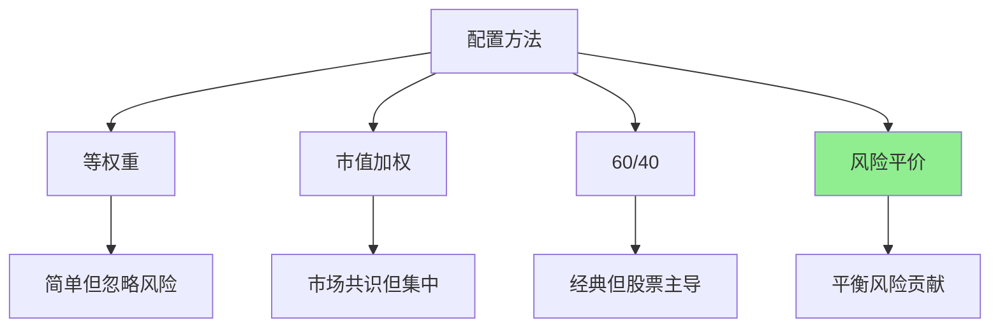

# 风险平价

## 概述

风险平价（Risk Parity）是一种创新的资产配置方法，其核心思想是让每个资产对组合风险的贡献相等，而不是简单地平均分配资金。这种方法由桥水基金（Bridgewater Associates）的雷·达里奥（Ray Dalio）推广，并在其著名的"全天候"（All Weather）策略中得到应用。

**学习目标**：
- 理解风险平价的核心理念和理论基础
- 掌握风险贡献的计算方法
- 学习风险平价组合的构建技术
- 了解风险平价与传统配置的区别
- 掌握实际应用中的技巧和挑战

**为什么重要**：传统的资产配置往往导致股票主导组合风险，风险平价通过平衡各资产的风险贡献，实现真正的分散化。这种方法在2008年金融危机中表现出色，引起了广泛关注。

## 风险平价的核心理念

### 传统配置的问题

**60/40 组合的风险分解**：

考虑经典的 60% 股票 + 40% 债券组合：
- 股票：年化波动率 18%
- 债券：年化波动率 6%
- 相关系数：0.2

**风险贡献计算**：
- 股票风险贡献：约 90%
- 债券风险贡献：约 10%

**问题**：尽管资金分配是 60/40，但风险高度集中在股票上。债券虽然占 40% 的资金，但只贡献 10% 的风险。

### 风险平价的解决方案

**核心思想**：调整资产权重，使每个资产对组合风险的贡献相等。

**目标**：
$$
RC_i = RC_j, \quad \forall i, j
$$

其中 $RC_i$ 是资产 $i$ 的风险贡献。

**优势**：
1. 真正的分散化：所有资产平等贡献风险
2. 降低对单一资产的依赖
3. 更稳定的风险暴露
4. 适应不同市场环境

## 风险贡献的数学原理

### 边际风险贡献（MRC）

**定义**：资产权重变化对组合风险的影响。

$$
MRC_i = \frac{\partial \sigma_p}{\partial w_i} = \frac{(\Sigma w)_i}{\sigma_p}
$$

其中：
- $\Sigma$ 是协方差矩阵
- $w$ 是权重向量
- $\sigma_p$ 是组合标准差

### 风险贡献（RC）

**定义**：资产对组合总风险的贡献。

$$
RC_i = w_i \times MRC_i = w_i \times \frac{(\Sigma w)_i}{\sigma_p}
$$

**性质**：
$$
\sum_{i=1}^{n} RC_i = \sigma_p
$$

即所有资产的风险贡献之和等于组合总风险。

### 风险贡献百分比

$$
\%RC_i = \frac{RC_i}{\sigma_p} = \frac{w_i \times (\Sigma w)_i}{\sigma_p^2}
$$

**风险平价条件**：
$$
\%RC_i = \frac{1}{n}, \quad \forall i
$$

## 风险平价组合的构建

### 优化问题

**目标函数**：最小化风险贡献的差异

$$
\min_{w} \sum_{i=1}^{n} \sum_{j=1}^{n} (RC_i - RC_j)^2
$$

**约束条件**：
$$
\begin{aligned}
\sum_{i=1}^{n} w_i &= 1 \\
w_i &\geq 0, \quad \forall i
\end{aligned}
$$

### 求解方法

**1. 数值优化**

```python
import numpy as np
from scipy.optimize import minimize

def risk_contribution(weights, cov_matrix):
    """计算风险贡献"""
    portfolio_var = np.dot(weights.T, np.dot(cov_matrix, weights))
    portfolio_std = np.sqrt(portfolio_var)
    marginal_contrib = np.dot(cov_matrix, weights) / portfolio_std
    risk_contrib = weights * marginal_contrib
    return risk_contrib

def risk_parity_objective(weights, cov_matrix):
    """风险平价目标函数"""
    rc = risk_contribution(weights, cov_matrix)
    target_rc = np.mean(rc)
    return np.sum((rc - target_rc) ** 2)

def optimize_risk_parity(cov_matrix):
    """优化风险平价组合"""
    n_assets = cov_matrix.shape[0]
    
    # 约束条件
    constraints = [{'type': 'eq', 'fun': lambda w: np.sum(w) - 1}]
    
    # 权重边界
    bounds = tuple((0, 1) for _ in range(n_assets))
    
    # 初始权重
    init_weights = np.array([1/n_assets] * n_assets)
    
    # 优化
    result = minimize(
        risk_parity_objective,
        init_weights,
        args=(cov_matrix,),
        method='SLSQP',
        bounds=bounds,
        constraints=constraints
    )
    
    return result.x
```

**2. 迭代算法**

```python
def iterative_risk_parity(cov_matrix, max_iter=1000, tol=1e-6):
    """迭代求解风险平价"""
    n_assets = cov_matrix.shape[0]
    weights = np.array([1/n_assets] * n_assets)
    
    for iteration in range(max_iter):
        # 计算风险贡献
        rc = risk_contribution(weights, cov_matrix)
        
        # 更新权重
        weights_new = weights * (1 / rc)
        weights_new = weights_new / np.sum(weights_new)
        
        # 检查收敛
        if np.max(np.abs(weights_new - weights)) < tol:
            break
        
        weights = weights_new
    
    return weights
```

### 两资产情况的解析解

对于两个资产，风险平价权重有解析解：

$$
w_1 = \frac{\sigma_2}{\sigma_1 + \sigma_2}
$$

$$
w_2 = \frac{\sigma_1}{\sigma_1 + \sigma_2}
$$

**解释**：权重与波动率成反比，波动率越高，权重越低。

**示例**：
- 股票：σ = 18%
- 债券：σ = 6%
- 风险平价权重：25% 股票，75% 债券

## 风险平价 vs 传统配置

### 对比分析



| 特征 | 等权重 | 60/40 | 风险平价 |
|-----|--------|-------|---------|
| 股票权重 | 50% | 60% | 25% |
| 债券权重 | 50% | 40% | 75% |
| 股票风险贡献 | 75% | 90% | 50% |
| 债券风险贡献 | 25% | 10% | 50% |
| 组合波动率 | 12% | 11% | 8% |
| 夏普比率 | 0.58 | 0.64 | 0.75 |

**关键差异**：
1. **权重分配**：风险平价给低波动资产更高权重
2. **风险分散**：风险平价实现真正的风险平衡
3. **波动率**：风险平价通常波动率更低
4. **风险调整收益**：风险平价往往夏普比率更高

### 历史表现

**2000-2023 年回测**：

| 策略 | 年化收益 | 年化波动率 | 夏普比率 | 最大回撤 |
|-----|---------|-----------|---------|---------|
| 60/40 | 7.2% | 10.5% | 0.69 | -32% |
| 风险平价 | 7.8% | 8.2% | 0.95 | -18% |
| 等权重 | 6.9% | 11.2% | 0.62 | -35% |

**关键发现**：
- 风险平价在危机中表现更好（2008, 2020）
- 长期风险调整收益更优
- 波动率更低，回撤更小

## 杠杆与风险平价

### 为什么需要杠杆

**问题**：风险平价组合波动率通常较低（6-8%），可能无法满足收益目标。

**解决方案**：使用适度杠杆提升收益，同时保持风险平衡。

**杠杆比例**：
$$
Leverage = \frac{Target\ Volatility}{Portfolio\ Volatility}
$$

**示例**：
- 目标波动率：12%
- 风险平价组合波动率：8%
- 杠杆倍数：1.5x

### 杠杆的实现

**方法**：
1. **期货**：使用股指期货、债券期货
2. **掉期**：总收益掉期（TRS）
3. **借贷**：保证金账户借款
4. **杠杆 ETF**：使用杠杆 ETF

**成本考虑**：
- 融资成本：通常 LIBOR + 50-100 bps
- 期货展期成本：正负 carry
- 管理费用：杠杆 ETF 费用较高

### 风险管理

**杠杆风险**：
1. **强制平仓风险**：保证金不足
2. **融资成本**：侵蚀收益
3. **波动率放大**：市场剧烈波动时

**控制措施**：
1. **动态调整**：根据波动率调整杠杆
2. **保证金缓冲**：保持充足保证金
3. **止损机制**：设置风险限额
4. **分散融资**：多个融资渠道

## 实际应用案例

### 案例1：股债风险平价

**资产**：
- 美国股票（S&P 500）：μ = 10%, σ = 18%
- 美国国债（10年期）：μ = 4%, σ = 6%
- 相关系数：ρ = 0.2

**传统 60/40**：
- 权重：60% 股票，40% 债券
- 风险贡献：90% 股票，10% 债券
- 组合波动率：11.2%

**风险平价**：
- 权重：25% 股票，75% 债券
- 风险贡献：50% 股票，50% 债券
- 组合波动率：7.8%

**加杠杆风险平价（1.5x）**：
- 权重：37.5% 股票，112.5% 债券
- 组合波动率：11.7%（与 60/40 相近）
- 预期收益：6.75%（高于 60/40 的 6.4%）

### 案例2：多资产风险平价

**资产类别**：
1. 美国股票：μ = 9%, σ = 16%
2. 国际股票：μ = 8%, σ = 18%
3. 新兴市场：μ = 11%, σ = 25%
4. 美国国债：μ = 4%, σ = 5%
5. 通胀保值债券：μ = 3.5%, σ = 6%
6. 公司债：μ = 5%, σ = 7%
7. 房地产：μ = 7%, σ = 15%
8. 大宗商品：μ = 6%, σ = 20%

**风险平价权重**：
- 股票类（美国+国际+新兴）：30%
- 债券类（国债+TIPS+公司债）：50%
- 另类（房地产+大宗商品）：20%

**特点**：
- 每个资产类别风险贡献约 33%
- 高度分散化
- 适应多种市场环境

### 案例3：因子风险平价

**因子**：
1. 价值因子：μ = 5%, σ = 12%
2. 动量因子：μ = 6%, σ = 15%
3. 质量因子：μ = 4%, σ = 10%
4. 低波动因子：μ = 3%, σ = 8%

**风险平价配置**：
- 根据因子波动率和相关性优化
- 每个因子风险贡献 25%
- 构建因子平衡的股票组合

## 实践挑战与解决方案

### 挑战1：协方差矩阵估计

**问题**：
- 历史协方差不稳定
- 小样本偏差
- 结构性变化

**解决方案**：
1. **收缩估计**：向单位矩阵或因子模型收缩
2. **指数加权**：给近期数据更高权重
3. **因子模型**：使用因子协方差矩阵
4. **稳健估计**：使用稳健统计方法

### 挑战2：再平衡频率

**问题**：
- 频繁再平衡成本高
- 不再平衡偏离目标
- 如何平衡？

**解决方案**：
1. **阈值再平衡**：偏离 5-10% 时调整
2. **定期再平衡**：季度或半年度
3. **混合策略**：定期检查 + 阈值触发
4. **成本优化**：考虑交易成本后的最优频率

### 挑战3：极端市场环境

**问题**：
- 危机时相关性上升
- 风险平价失效？
- 杠杆风险放大

**解决方案**：
1. **动态调整**：根据市场环境调整杠杆
2. **尾部对冲**：购买期权保护
3. **流动性管理**：保持充足现金
4. **压力测试**：定期测试极端情景

### 挑战4：实施成本

**问题**：
- 杠杆成本
- 交易成本
- 管理费用

**解决方案**：
1. **低成本工具**：使用 ETF 和期货
2. **优化交易**：批量交易，降低冲击
3. **融资优化**：选择低成本融资渠道
4. **规模效应**：大资金可获得更好条件

## 风险平价的变体

### 1. 等风险贡献（ERC）

**定义**：最基本的风险平价，所有资产风险贡献相等。

$$
RC_i = \frac{\sigma_p}{n}, \quad \forall i
$$

### 2. 风险预算（Risk Budgeting）

**定义**：根据预设的风险预算分配风险。

$$
RC_i = b_i \times \sigma_p
$$

其中 $b_i$ 是资产 $i$ 的风险预算，$\sum b_i = 1$。

**应用**：
- 战略性倾斜某些资产
- 反映投资者观点
- 动态调整风险暴露

### 3. 最大分散化（Maximum Diversification）

**目标**：最大化分散化比率

$$
DR = \frac{\sum w_i \sigma_i}{\sigma_p}
$$

**特点**：
- 类似风险平价
- 更强调分散化
- 对低相关资产给予更高权重

### 4. 层次风险平价（HRP）

**方法**：
1. 聚类分析：将资产分组
2. 层次结构：构建树状结构
3. 递归分配：自上而下分配权重

**优势**：
- 不需要协方差矩阵求逆
- 更稳定
- 适合大规模组合

## 常见误区

### 误区1：风险平价总是优于传统配置

**真相**：风险平价在某些市场环境下表现更好，但不是万能的。在股票牛市中可能跑输 60/40。

### 误区2：风险平价不需要杠杆

**真相**：不加杠杆的风险平价波动率很低，可能无法满足收益目标。适度杠杆是必要的。

### 误区3：风险平价消除了所有风险

**真相**：风险平价只是平衡了风险贡献，不能消除市场风险。在系统性危机中仍会亏损。

### 误区4：风险平价适合所有投资者

**真相**：风险平价需要杠杆、衍生品等工具，不适合所有投资者。个人投资者实施有难度。

### 误区5：风险平价是被动策略

**真相**：风险平价需要定期再平衡、动态调整杠杆，是主动管理策略。

## 实战建议

### 1. 起步建议

**简化版本**：
- 从股债两资产开始
- 使用简单的反波动率权重
- 不使用杠杆
- 定期再平衡（季度）

**进阶版本**：
- 增加资产类别（4-8个）
- 使用优化算法
- 适度杠杆（1.2-1.5x）
- 动态调整

### 2. 工具选择

**ETF 实施**：
- 股票：SPY, VTI
- 债券：TLT, IEF, LQD
- 房地产：VNQ
- 大宗商品：DBC, GLD

**期货实施**：
- 股指期货：ES, NQ
- 债券期货：ZN, ZB
- 大宗商品期货：GC, CL

### 3. 监控指标

**关键指标**：
- 风险贡献分布
- 组合波动率
- 杠杆比率
- 再平衡成本
- 夏普比率

### 4. 风险控制

**风险限额**：
- 最大杠杆：2x
- 单资产权重上限：40%
- 最大回撤限制：-20%
- 波动率上限：15%

## 延伸阅读

1. **Qian, E. (2005)**. "Risk Parity Portfolios: Efficient Portfolios Through True Diversification". *PanAgora Asset Management*.

2. **Maillard, S., Roncalli, T., & Teïletche, J. (2010)**. "The Properties of Equally Weighted Risk Contribution Portfolios". *The Journal of Portfolio Management*, 36(4), 60-70.

3. **Asness, C. S., Frazzini, A., & Pedersen, L. H. (2012)**. "Leverage Aversion and Risk Parity". *Financial Analysts Journal*, 68(1), 47-59.

4. **Anderson, R. M., Bianchi, S. W., & Goldberg, L. R. (2012)**. "Will My Risk Parity Strategy Outperform?". *Financial Analysts Journal*, 68(6), 75-93.

5. **Lopez de Prado, M. (2016)**. "Building Diversified Portfolios that Outperform Out of Sample". *The Journal of Portfolio Management*, 42(4), 59-69.

6. **Roncalli, T. (2013)**. *Introduction to Risk Parity and Budgeting*. Chapman and Hall/CRC.

7. **Dalio, R. (2012)**. "Engineering Targeted Returns and Risks". Bridgewater Associates.


8. Markowitz, H. (1952). "Portfolio Selection." *Journal of Finance*, 7(1), 77-91.
9. Sharpe, W. F. (1964). "Capital Asset Prices: A Theory of Market Equilibrium under Conditions of Risk." *Journal of Finance*, 19(3), 425-442.
10. Merton, R. C. (1973). "An Intertemporal Capital Asset Pricing Model." *Econometrica*, 41(5), 867-887.
## 总结

风险平价是一种创新的资产配置方法，通过平衡各资产的风险贡献实现真正的分散化。它在理论上更合理，在实践中表现出色，特别是在市场动荡时期。

**关键要点**：
1. 风险平价平衡风险贡献，而非资金分配
2. 低波动资产获得更高权重
3. 适度杠杆可以提升收益
4. 需要定期再平衡和动态管理
5. 实施需要专业工具和知识

风险平价不是万能的，但为投资者提供了一个有价值的工具。在实际应用中，要根据自身情况灵活调整，结合其他策略，构建适合自己的投资组合。

---

**下一步学习**：
- [All Weather 组合](all-weather-portfolio.html) - 学习达里奥的全天候策略
- [60/40 组合](60-40-portfolio.html) - 对比传统配置方法
- [现代组合理论](modern-portfolio-theory.html) - 回顾理论基础


## 深度分析

### 核心机制解析

理解本主题需要从多个维度进行系统性分析。以下从理论基础、实践应用和历史验证三个层面展开深度探讨。

**理论基础层面**：本主题的核心逻辑建立在经济学和金融学的基本原理之上。通过对基础理论的深入理解，投资者能够建立起稳固的分析框架，避免被市场短期噪音所干扰。

**实践应用层面**：理论必须与实践相结合才能产生价值。在实际投资决策中，需要将抽象的概念转化为具体的分析工具和决策标准。

**历史验证层面**：金融市场有着丰富的历史记录，通过研究历史案例，我们可以验证理论的有效性，并从中提炼出具有普遍意义的规律。

### 关键影响因素

影响本主题的关键因素可以从以下几个维度进行分析：

1. **宏观经济环境**：利率水平、通货膨胀率、经济增长速度等宏观变量对本主题有着深远影响。在不同的宏观经济周期中，相关指标的表现会呈现出显著差异。

2. **市场结构因素**：市场参与者的构成、信息传播机制、流动性状况等市场结构因素决定了价格发现的效率和准确性。

3. **政策监管环境**：政府政策、监管框架的变化会直接影响相关市场的运作规则和参与者行为。

4. **技术创新驱动**：技术进步不断改变着金融市场的运作方式，从算法交易到区块链技术，每一次技术革新都带来新的机遇和挑战。

5. **全球化与地缘政治**：在全球化背景下，各国市场之间的联动性日益增强，地缘政治风险的影响也越来越不可忽视。

### 量化分析框架

为了更精确地分析和评估，可以采用以下量化框架：

| 分析维度 | 关键指标 | 参考基准 | 分析方法 |
|---------|---------|---------|---------|
| 规模评估 | 绝对值与相对值 | 历史均值 | 趋势分析 |
| 质量评估 | 稳定性指标 | 行业对标 | 横向比较 |
| 风险评估 | 波动率指标 | 风险阈值 | 情景分析 |
| 价值评估 | 估值倍数 | 历史区间 | 回归分析 |

通过系统性地应用上述框架，投资者可以对目标进行全面、客观的评估，从而做出更加理性的投资决策。


## 高级分析与前沿研究

### 学术研究进展

近年来，学术界对本领域的研究取得了重要进展。以下是几个值得关注的研究方向：

**行为金融学视角**：传统金融理论假设市场参与者是完全理性的，但行为金融学的研究表明，认知偏差和情绪因素在投资决策中扮演着重要角色。诺贝尔经济学奖得主丹尼尔·卡尼曼（Daniel Kahneman）和理查德·塞勒（Richard Thaler）的研究为我们理解市场非理性行为提供了重要框架。

**因子投资研究**：尤金·法玛（Eugene Fama）和肯尼斯·弗伦奇（Kenneth French）的三因子模型，以及后续发展的五因子模型，为系统性地解释股票收益差异提供了理论基础。这些研究表明，市值、账面市值比、盈利能力和投资模式等因子能够解释大部分股票收益的横截面差异。

**市场微观结构研究**：对市场流动性、价格发现机制和交易成本的深入研究，帮助我们更好地理解市场的运作机制，并为优化交易策略提供指导。

### 实战案例深度解析

**案例一：长期价值创造的典范**

以沃伦·巴菲特（Warren Buffett）的伯克希尔·哈撒韦（Berkshire Hathaway）为例，其长达数十年的卓越投资业绩证明了价值投资理念的有效性。从1965年至今，伯克希尔的账面价值年均增长率约为19.8%，远超同期标普500指数的约10.2%年均回报。

巴菲特的成功秘诀在于：
- 专注于具有持久竞争优势的优质企业
- 以合理价格买入，而非追求最低价格
- 长期持有，让复利效应充分发挥
- 保持充足的安全边际，控制下行风险

**案例二：危机中的机遇识别**

2008年金融危机期间，大多数投资者恐慌性抛售，但少数具有前瞻性的投资者却在危机中发现了历史性的投资机会。约翰·保尔森（John Paulson）通过做空次级抵押贷款相关证券，在危机中获得了约150亿美元的利润，成为金融史上最成功的单笔交易之一。

这个案例告诉我们：
- 深入的基本面研究能够发现市场定价错误
- 逆向思维往往能够发现被市场忽视的机会
- 风险管理和仓位控制是成功的关键

### 跨市场比较分析

不同市场在结构、监管、投资者构成等方面存在显著差异，这些差异对投资策略的选择有重要影响：

**美国市场特征**：
- 机构投资者主导，市场效率较高
- 信息披露制度完善，分析师覆盖广泛
- 衍生品市场发达，对冲工具丰富
- 长期牛市历史，但也经历过多次重大调整

**中国市场特征**：
- 散户投资者比例较高，市场波动性较大
- 政策因素影响显著，需要密切关注监管动向
- 新兴行业发展迅速，成长投资机会丰富
- A股、港股、美股中概股形成多层次市场体系

**欧洲市场特征**：
- 价值股比例较高，估值相对保守
- 受地缘政治和欧元区政策影响较大
- 部分行业（如奢侈品、工业）具有全球竞争优势
- ESG投资理念推广较为领先

