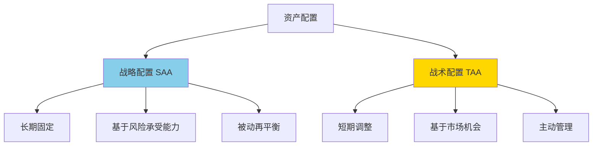
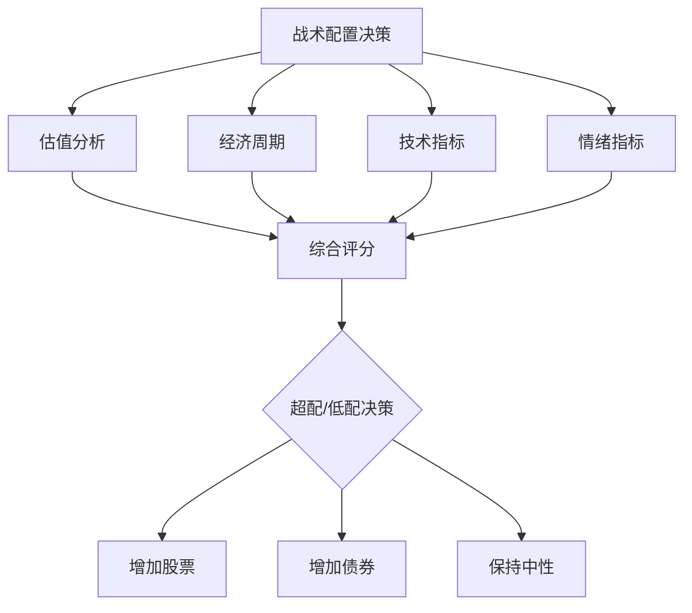

# 战术配置

## 概述

战术资产配置（Tactical Asset Allocation, TAA）是一种主动管理策略，通过根据市场环境、经济周期和估值水平动态调整资产权重，试图获得超越战略配置的收益。与长期固定的战略配置不同，战术配置允许在短期内偏离目标权重以捕捉市场机会。

**学习目标**：
- 理解战术配置与战略配置的区别
- 掌握战术配置的决策框架
- 学习常用的战术配置信号
- 了解实施方法和风险控制
- 评估战术配置的有效性

**为什么重要**：战术配置为投资者提供了在保持长期战略的同时，利用短期市场机会的方法。虽然难度较高，但如果执行得当，可以显著提升风险调整收益。

## 战术配置 vs 战略配置

### 核心区别

| 特征 | 战略配置 | 战术配置 |
|-----|---------|---------|
| 时间范围 | 长期（5-10年+） | 短期（数月到1-2年） |
| 调整频率 | 很少（年度再平衡） | 频繁（月度或季度） |
| 决策依据 | 风险承受能力、目标 | 市场环境、估值、动量 |
| 权重偏离 | 无或很小 | 可达 ±10-20% |
| 管理方式 | 被动 | 主动 |
| 成本 | 低 | 较高 |
| 难度 | 低 | 高 |

### 互补关系

**战略配置**：
- 提供长期框架
- 反映投资者特征
- 是基础和锚点

**战术配置**：
- 在战略基础上调整
- 捕捉短期机会
- 增强收益或降低风险

**示例**：
- 战略配置：60% 股票，40% 债券
- 战术调整：股市高估时降至 50% 股票，50% 债券
- 战术调整：股市低估时升至 70% 股票，30% 债券

## 战术配置的理论基础

### 市场有效性的争论

**有效市场假说（EMH）**：
- 市场价格反映所有信息
- 无法持续战胜市场
- 战术配置无效

**行为金融学**：
- 市场存在非理性行为
- 价格偏离基本面
- 存在可预测的模式
- 战术配置有机会

**实证证据**：
- 市场确实存在可预测性
- 但持续战胜市场很难
- 需要纪律和技能

### 可预测性来源

**1. 估值均值回归**
- 高估值后收益率低
- 低估值后收益率高
- 长期均值回归

**2. 动量效应**
- 趋势持续
- 强者恒强
- 短期可预测

**3. 经济周期**
- 不同阶段不同资产表现
- 周期可部分预测
- 领先指标

**4. 情绪极端**
- 恐慌和贪婪
- 市场过度反应
- 逆向机会

## 战术配置决策框架

### 多因子决策模型

**权重分配**：
- 估值：40%
- 经济周期：30%
- 技术指标：20%
- 情绪指标：10%

### 决策流程

**步骤 1：信号收集**
- 收集各类指标数据
- 计算指标值
- 标准化处理

**步骤 2：信号评分**
- 每个指标给出看多/看空信号
- 转换为数值评分（-2 到 +2）
- 加权平均

**步骤 3：配置决策**
- 综合评分 > 1：超配股票
- 综合评分 < -1：低配股票
- -1 到 1：保持中性

**步骤 4：实施调整**
- 计算目标权重
- 考虑交易成本
- 分批调整

**步骤 5：监控和调整**
- 定期审查信号
- 评估表现
- 必要时调整

## 常用战术配置信号

### 1. 估值指标

**席勒 PE（CAPE）**

$$
CAPE = \frac{当前价格}{过去10年平均实际盈利}
$$

**使用方法**：
- CAPE < 15：股票便宜，超配
- CAPE 15-25：中性
- CAPE > 25：股票贵，低配

**历史数据**：
- 长期均值：约 17
- 2000 年峰值：44
- 2009 年低点：13
- 当前水平：需实时查询

**局限性**：
- 可能长期偏离均值
- 不适合短期择时
- 行业结构变化影响

**股息收益率**

$$
股息收益率 = \frac{年度股息}{股价}
$$

**使用方法**：
- 与历史均值比较
- 与债券收益率比较
- 高股息收益率 → 股票吸引力高

**债券收益率**

**使用方法**：
- 10 年期国债收益率 > 4%：债券吸引力高
- 收益率曲线倒挂：经济衰退信号
- 实际收益率（名义收益率 - 通胀）

### 2. 经济周期指标

**领先指标**

**Conference Board 领先指标**：
- 包含 10 个子指标
- 预测未来 6-9 个月经济
- 上升 → 经济扩张 → 超配股票
- 下降 → 经济收缩 → 低配股票

**ISM 制造业 PMI**：
- > 50：扩张
- < 50：收缩
- 与股市相关性高

**收益率曲线**：
- 正常：长期利率 > 短期利率
- 倒挂：长期利率 < 短期利率（衰退信号）
- 陡峭化：经济复苏信号

**失业率**：
- 低失业率：经济强劲
- 失业率上升：经济放缓
- 注意拐点

### 3. 技术指标

**移动平均线**

**200 日移动平均线**：
- 价格 > 200 日均线：看多
- 价格 < 200 日均线：看空
- 简单有效的趋势指标

**金叉/死叉**：
- 50 日均线上穿 200 日均线：金叉（买入信号）
- 50 日均线下穿 200 日均线：死叉（卖出信号）

**相对强弱指数（RSI）**

$$
RSI = 100 - \frac{100}{1 + RS}
$$

其中 $RS = \frac{平均上涨幅度}{平均下跌幅度}$

**使用方法**：
- RSI > 70：超买，可能回调
- RSI < 30：超卖，可能反弹
- 背离：价格新高但 RSI 未新高（看跌）

**动量指标**

**12 个月动量**：
- 当前价格 vs 12 个月前价格
- 正动量：继续持有
- 负动量：减仓或卖出

### 4. 情绪指标

**VIX（恐慌指数）**

**使用方法**：
- VIX < 15：市场平静，可能自满
- VIX 15-25：正常
- VIX > 25：恐慌，可能是买入机会
- VIX > 40：极度恐慌

**看跌/看涨期权比率**

**使用方法**：
- 比率高：市场悲观（逆向买入信号）
- 比率低：市场乐观（逆向卖出信号）

**投资者情绪调查**

**AAII 情绪调查**：
- 看多比例 > 50%：过度乐观
- 看空比例 > 40%：过度悲观
- 逆向指标

## 战术配置策略

### 策略1：估值驱动

**方法**：
- 基于 CAPE 调整股债比例
- CAPE 低 → 增加股票
- CAPE 高 → 减少股票

**配置规则**：

| CAPE 水平 | 股票权重 | 债券权重 |
|----------|---------|---------|
| < 15 | 75% | 25% |
| 15-20 | 65% | 35% |
| 20-25 | 55% | 45% |
| 25-30 | 45% | 55% |
| > 30 | 35% | 65% |

**优点**：
- 基于基本面
- 长期有效
- 简单透明

**缺点**：
- 反应慢
- 可能长期偏离
- 错过短期机会

### 策略2：动量跟随

**方法**：
- 基于价格趋势调整
- 上升趋势 → 增加股票
- 下降趋势 → 减少股票

**配置规则**：
- 价格 > 200 日均线：60-70% 股票
- 价格 < 200 日均线：30-40% 股票

**优点**：
- 捕捉趋势
- 及时反应
- 降低回撤

**缺点**：
- 震荡市表现差
- 交易频繁
- 可能错过反转

### 策略3：经济周期轮动

**方法**：
- 根据经济周期阶段调整
- 不同阶段超配不同资产

**配置规则**：

| 周期阶段 | 股票 | 债券 | 大宗商品 | 现金 |
|---------|------|------|---------|------|
| 复苏 | 70% | 20% | 5% | 5% |
| 扩张 | 60% | 25% | 10% | 5% |
| 放缓 | 45% | 40% | 10% | 5% |
| 衰退 | 30% | 55% | 5% | 10% |

**优点**：
- 符合经济逻辑
- 分散化
- 适应环境

**缺点**：
- 周期判断难
- 转换点不明确
- 需要多种资产

### 策略4：多因子综合

**方法**：
- 综合多个信号
- 加权平均
- 动态调整

**信号权重**：
- 估值（CAPE）：30%
- 经济（PMI）：25%
- 技术（200日均线）：25%
- 情绪（VIX）：20%

**配置规则**：
- 综合评分 > 1：70% 股票
- 综合评分 0-1：60% 股票
- 综合评分 -1-0：50% 股票
- 综合评分 < -1：40% 股票

**优点**：
- 更稳健
- 减少误判
- 平滑调整

**缺点**：
- 复杂
- 需要维护
- 可能过度平滑

## 实施与风险控制

### 实施原则

**1. 设定偏离限制**
- 最大偏离：±20%
- 示例：战略 60% 股票，战术范围 40-80%

**2. 分批调整**
- 不要一次性大幅调整
- 分 2-3 次完成
- 降低市场冲击

**3. 考虑交易成本**
- 计算交易成本
- 只在收益 > 成本时调整
- 使用低成本工具

**4. 税收优化**
- 优先在退休账户调整
- 利用税收损失收割
- 考虑长期资本利得

### 风险控制

**1. 止损机制**
- 设定最大回撤限制（如 -15%）
- 触发时减仓
- 保护本金

**2. 仓位限制**
- 单一资产不超过 80%
- 保持最低分散化
- 避免过度集中

**3. 再评估机制**
- 定期审查策略
- 评估有效性
- 必要时调整

**4. 情绪管理**
- 遵守纪律
- 避免追涨杀跌
- 记录决策过程

### 监控指标

**业绩指标**：
- 绝对收益
- 相对收益（vs 基准）
- 夏普比率
- 最大回撤

**过程指标**：
- 调整频率
- 交易成本
- 信号准确率
- 偏离度

## 实战案例

### 案例1：2008 年金融危机

**背景**：
- 2007 年底：CAPE 27，PMI 下降，VIX 上升
- 多个信号显示风险

**战术调整**：
- 2008 年初：从 60% 股票降至 40%
- 避免了大部分跌幅

**结果**：
- 战略 60/40：-22%
- 战术调整：-12%
- 超额收益：+10%

### 案例2：2020 年 COVID-19

**背景**：
- 2020 年 3 月：市场暴跌，VIX 飙升至 80
- 估值快速下降

**战术调整**：
- 3 月底：从 50% 股票增至 70%
- 捕捉反弹

**结果**：
- 战略 60/40：+16%
- 战术调整：+22%
- 超额收益：+6%

### 案例3：2022 年通胀年

**背景**：
- 2021 年底：通胀上升，美联储转鹰
- 估值高，经济放缓

**战术调整**：
- 2022 年初：从 60% 股票降至 45%
- 增加 TIPS 和大宗商品

**结果**：
- 战略 60/40：-16%
- 战术调整：-10%
- 超额收益：+6%

## 常见误区

### 误区1：战术配置可以持续战胜市场

**真相**：战术配置很难持续战胜市场，需要技能、纪律和运气。

### 误区2：频繁调整更好

**真相**：过度交易增加成本，降低收益。应该只在高信度信号时调整。

### 误区3：可以完美择时

**真相**：没有人能完美择时。战术配置的目标是略微改善，而非完美。

### 误区4：战术配置适合所有人

**真相**：战术配置需要时间、知识和情绪控制，不适合所有投资者。

### 误区5：单一指标就够了

**真相**：单一指标容易误判，应该综合多个指标。

## 实战建议

### 1. 从小开始

**建议**：
- 先用小部分资金测试
- 积累经验
- 逐步扩大

### 2. 保持简单

**建议**：
- 使用 2-3 个核心指标
- 避免过度复杂
- 易于执行

### 3. 记录和学习

**建议**：
- 记录每次决策
- 分析对错
- 持续改进

### 4. 设定现实预期

**建议**：
- 目标：年化超额收益 1-3%
- 不要期望暴利
- 关注风险调整收益

### 5. 知道何时放弃

**建议**：
- 如果长期无效，考虑放弃
- 回归战略配置
- 不要固执

## 延伸阅读

1. **Meb Faber (2007)**. "A Quantitative Approach to Tactical Asset Allocation". *The Journal of Wealth Management*, 9(4), 69-79.

2. **Arnott, R. D., & Bernstein, P. L. (2002)**. "What Risk Premium Is Normal?". *Financial Analysts Journal*, 58(2), 64-85.

3. **Asness, C. S., Moskowitz, T. J., & Pedersen, L. H. (2013)**. "Value and Momentum Everywhere". *The Journal of Finance*, 68(3), 929-985.

4. **Ilmanen, A. (2011)**. *Expected Returns: An Investor's Guide to Harvesting Market Rewards*. Wiley.

5. **Shiller, R. J. (2015)**. *Irrational Exuberance* (3rd ed.). Princeton University Press.

6. **Siegel, J. J. (2014)**. *Stocks for the Long Run* (5th ed.). McGraw-Hill Education.

7. Markowitz, H. (1952). "Portfolio Selection." *Journal of Finance*, 7(1), 77-91.
8. Sharpe, W. F. (1964). "Capital Asset Prices: A Theory of Market Equilibrium under Conditions of Risk." *Journal of Finance*, 19(3), 425-442.
9. Merton, R. C. (1973). "An Intertemporal Capital Asset Pricing Model." *Econometrica*, 41(5), 867-887.
10. Black, F., & Litterman, R. (1992). "Global Portfolio Optimization." *Financial Analysts Journal*, 48(5), 28-43.
## 总结

战术资产配置是一种主动管理策略，通过动态调整资产权重试图获得超额收益。虽然难度较高，但如果执行得当，可以改善风险调整收益。

**关键要点**：
1. 战术配置是在战略基础上的短期调整
2. 需要综合多个信号做决策
3. 设定明确的规则和限制
4. 控制交易成本和风险
5. 保持纪律，避免情绪化决策

战术配置不适合所有投资者，需要时间、知识和情绪控制。对于大多数投资者，简单的战略配置加定期再平衡可能更合适。如果选择战术配置，要从小开始，保持简单，持续学习和改进。

---

**下一步学习**：
- [经济周期](../../02-economic-foundation/economic-cycles/cycle-overview.html) - 深入理解周期分析
- [技术分析](../../05-global-perspective/industry-analysis/overview.html) - 学习技术指标
- 行为金融学 - 理解市场心理

## 深度分析

### 核心机制解析

理解本主题需要从多个维度进行系统性分析。以下从理论基础、实践应用和历史验证三个层面展开深度探讨。

**理论基础层面**：本主题的核心逻辑建立在经济学和金融学的基本原理之上。通过对基础理论的深入理解，投资者能够建立起稳固的分析框架，避免被市场短期噪音所干扰。

**实践应用层面**：理论必须与实践相结合才能产生价值。在实际投资决策中，需要将抽象的概念转化为具体的分析工具和决策标准。

**历史验证层面**：金融市场有着丰富的历史记录，通过研究历史案例，我们可以验证理论的有效性，并从中提炼出具有普遍意义的规律。

### 关键影响因素

影响本主题的关键因素可以从以下几个维度进行分析：

1. **宏观经济环境**：利率水平、通货膨胀率、经济增长速度等宏观变量对本主题有着深远影响。在不同的宏观经济周期中，相关指标的表现会呈现出显著差异。

2. **市场结构因素**：市场参与者的构成、信息传播机制、流动性状况等市场结构因素决定了价格发现的效率和准确性。

3. **政策监管环境**：政府政策、监管框架的变化会直接影响相关市场的运作规则和参与者行为。

4. **技术创新驱动**：技术进步不断改变着金融市场的运作方式，从算法交易到区块链技术，每一次技术革新都带来新的机遇和挑战。

5. **全球化与地缘政治**：在全球化背景下，各国市场之间的联动性日益增强，地缘政治风险的影响也越来越不可忽视。

### 量化分析框架

为了更精确地分析和评估，可以采用以下量化框架：

| 分析维度 | 关键指标 | 参考基准 | 分析方法 |
|---------|---------|---------|---------|
| 规模评估 | 绝对值与相对值 | 历史均值 | 趋势分析 |
| 质量评估 | 稳定性指标 | 行业对标 | 横向比较 |
| 风险评估 | 波动率指标 | 风险阈值 | 情景分析 |
| 价值评估 | 估值倍数 | 历史区间 | 回归分析 |

通过系统性地应用上述框架，投资者可以对目标进行全面、客观的评估，从而做出更加理性的投资决策。

## 高级分析与前沿研究

### 学术研究进展

近年来，学术界对本领域的研究取得了重要进展。以下是几个值得关注的研究方向：

**行为金融学视角**：传统金融理论假设市场参与者是完全理性的，但行为金融学的研究表明，认知偏差和情绪因素在投资决策中扮演着重要角色。诺贝尔经济学奖得主丹尼尔·卡尼曼（Daniel Kahneman）和理查德·塞勒（Richard Thaler）的研究为我们理解市场非理性行为提供了重要框架。

**因子投资研究**：尤金·法玛（Eugene Fama）和肯尼斯·弗伦奇（Kenneth French）的三因子模型，以及后续发展的五因子模型，为系统性地解释股票收益差异提供了理论基础。这些研究表明，市值、账面市值比、盈利能力和投资模式等因子能够解释大部分股票收益的横截面差异。

**市场微观结构研究**：对市场流动性、价格发现机制和交易成本的深入研究，帮助我们更好地理解市场的运作机制，并为优化交易策略提供指导。

### 实战案例深度解析

**案例一：长期价值创造的典范**

以沃伦·巴菲特（Warren Buffett）的伯克希尔·哈撒韦（Berkshire Hathaway）为例，其长达数十年的卓越投资业绩证明了价值投资理念的有效性。从1965年至今，伯克希尔的账面价值年均增长率约为19.8%，远超同期标普500指数的约10.2%年均回报。

巴菲特的成功秘诀在于：
- 专注于具有持久竞争优势的优质企业
- 以合理价格买入，而非追求最低价格
- 长期持有，让复利效应充分发挥
- 保持充足的安全边际，控制下行风险

**案例二：危机中的机遇识别**

2008年金融危机期间，大多数投资者恐慌性抛售，但少数具有前瞻性的投资者却在危机中发现了历史性的投资机会。约翰·保尔森（John Paulson）通过做空次级抵押贷款相关证券，在危机中获得了约150亿美元的利润，成为金融史上最成功的单笔交易之一。

这个案例告诉我们：
- 深入的基本面研究能够发现市场定价错误
- 逆向思维往往能够发现被市场忽视的机会
- 风险管理和仓位控制是成功的关键

### 跨市场比较分析

不同市场在结构、监管、投资者构成等方面存在显著差异，这些差异对投资策略的选择有重要影响：

**美国市场特征**：
- 机构投资者主导，市场效率较高
- 信息披露制度完善，分析师覆盖广泛
- 衍生品市场发达，对冲工具丰富
- 长期牛市历史，但也经历过多次重大调整

**中国市场特征**：
- 散户投资者比例较高，市场波动性较大
- 政策因素影响显著，需要密切关注监管动向
- 新兴行业发展迅速，成长投资机会丰富
- A股、港股、美股中概股形成多层次市场体系

**欧洲市场特征**：
- 价值股比例较高，估值相对保守
- 受地缘政治和欧元区政策影响较大
- 部分行业（如奢侈品、工业）具有全球竞争优势
- ESG投资理念推广较为领先

## 实用工具与操作指南

### 分析工具推荐

**数据获取工具**：
- **Bloomberg Terminal**：专业级金融数据平台，提供实时行情、历史数据、新闻资讯等全方位服务，是机构投资者的首选工具
- **Wind资讯（万得）**：中国最权威的金融数据平台，覆盖A股、债券、基金等全市场数据
- **FactSet**：提供全球股票、固定收益、另类投资等多资产类别的综合数据服务
- **免费替代方案**：Yahoo Finance、Google Finance、东方财富、同花顺等提供基础数据服务

**分析软件工具**：
- **Excel/Python**：用于财务模型构建、数据分析和可视化
- **Tableau/Power BI**：用于数据可视化和仪表板创建
- **R语言**：适合统计分析和量化研究

### 实操步骤指南

**第一步：信息收集**
1. 获取目标公司/资产的基本信息和历史数据
2. 收集行业报告和竞争对手数据
3. 整理宏观经济背景信息
4. 查阅相关学术研究和专业分析报告

**第二步：定量分析**
1. 建立财务模型，计算关键指标
2. 进行历史趋势分析
3. 与同行业公司进行横向比较
4. 构建估值模型，计算合理价值区间

**第三步：定性分析**
1. 评估竞争优势和护城河
2. 分析管理层质量和公司治理
3. 识别主要风险因素
4. 评估行业发展趋势

**第四步：综合判断**
1. 整合定量和定性分析结果
2. 进行情景分析（乐观/基准/悲观）
3. 确定投资论点和关键假设
4. 制定投资决策和风险管理方案

### 常见错误与规避方法

| 常见错误 | 产生原因 | 规避方法 |
|---------|---------|---------|
| 过度依赖历史数据 | 忽视结构性变化 | 结合前瞻性分析 |
| 锚定效应 | 过度依赖初始信息 | 定期重新评估假设 |
| 确认偏误 | 只寻找支持观点的证据 | 主动寻找反驳证据 |
| 过度自信 | 高估自身分析能力 | 保持谦逊，设置安全边际 |
| 忽视流动性风险 | 只关注收益不关注风险 | 全面评估风险因素 |

