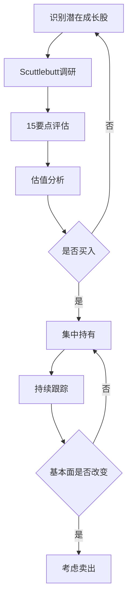
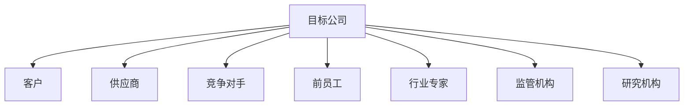

# 费雪方法论：《怎样选择成长股》核心思想

## 概述

菲利普·费雪（Philip Fisher, 1907-2004）是成长投资理论的奠基人之一，被誉为"成长股投资之父"。他的经典著作《怎样选择成长股》（Common Stocks and Uncommon Profits, 1958）深刻影响了包括沃伦·巴菲特在内的一代投资大师。


**学习目标**：
1. 理解费雪的投资哲学和核心理念
2. 掌握15个选股要点的具体应用
3. 学习Scuttlebutt调研方法的实践技巧
4. 了解费雪对巴菲特等投资大师的影响
5. 将费雪方法论应用于现代投资实践

**为什么重要**：费雪的方法论强调深度研究、长期持有和集中投资，这些理念在今天仍然具有重要的指导意义。理解费雪方法论，能够帮助投资者建立系统化的成长股投资框架，避免短期投机，专注于寻找和持有真正优秀的成长企业。


## 费雪的投资哲学

### 核心理念

**1. 集中投资于少数优质企业**
> "投资者应该把资金集中在少数几家真正了解的优秀公司上，而不是分散在许多平庸的公司上。" —— 菲利普·费雪

**特点**：
- 持有5-10只精选股票
- 深度研究每一只股票
- 高度确信后重仓持有
- 避免过度分散

**2. 长期持有优质成长股**
> "如果工作做得好，买入的时机选择得当，那么卖出的时机几乎永远不会到来。" —— 菲利普·费雪

**持有期**：
- 典型持有期：10年以上
- 某些股票持有20-30年
- 让复利充分发挥作用
- 避免频繁交易

**3. 关注企业质量而非价格**
- 优秀企业值得合理溢价
- 长期成长能够证明高估值
- 避免因价格便宜而买入平庸企业
- 质量比价格更重要

**4. 深度研究，超越财务报表**
- 实地调研
- 多方访谈
- 行业分析
- 竞争格局研究

### 投资流程



## 费雪的15个选股要点

### 第一组：产品和市场（要点1-4）

**要点1：公司的产品或服务是否有足够的市场潜力**

**评估标准**：
- 市场规模是否足够大
- 市场增长率如何
- 公司产品的市场份额
- 未来增长空间

**关键问题**：
- 总潜在市场（TAM）有多大？
- 市场年增长率是多少？
- 公司能获得多少市场份额？
- 是否有新市场机会？

**案例分析**：
- **英特尔（1970s）**：个人电脑革命带来的巨大市场
- **亚马逊（1990s）**：电子商务的无限潜力
- **特斯拉（2010s）**：电动车市场的爆发

**要点2：管理层是否有决心继续开发新产品或新工艺**

**评估标准**：
- 研发投入占比
- 新产品推出频率
- 技术创新能力
- 产品管线

**关键指标**：
- R&D支出/收入比例
- 新产品贡献的收入占比
- 专利数量和质量
- 技术团队实力

**优秀案例**：
- **苹果**：持续的产品创新（iPhone, iPad, Apple Watch）
- **辉瑞**：强大的药物研发管线
- **英伟达**：GPU技术的持续演进

**要点3：考虑到公司规模，研发努力的效率如何**

**评估维度**：
- 研发投入产出比
- 新产品成功率
- 研发周期
- 技术转化能力

**效率指标**：
```
研发效率 = 新产品收入 / 研发投入
专利效率 = 有效专利数 / 研发投入
```

**红旗信号**：
- 研发投入高但产出少
- 新产品失败率高
- 研发周期过长
- 技术商业化困难

**要点4：公司是否有高于平均水平的销售组织**

**评估标准**：
- 销售团队质量
- 销售网络覆盖
- 客户关系管理
- 市场营销能力

**关键指标**：
- 销售费用率
- 客户获取成本（CAC）
- 客户留存率
- 销售转化率

**优秀特征**：
- 强大的品牌影响力
- 高效的销售渠道
- 优质的客户服务
- 持续的客户关系


### 第二组：盈利能力（要点5-7）

**要点5：公司的利润率是否值得关注**

**评估标准**：
- 毛利率水平
- 净利率趋势
- 与同行对比
- 利润率改善空间

**优秀标准**：
- 毛利率 > 40%（科技、消费品）
- 净利率 > 15%
- 利润率持续提升
- 高于行业平均

**要点6：公司正在做什么来维持或改善利润率**

**改善途径**：
1. **规模效应**：成本摊薄
2. **产品升级**：提高售价
3. **效率提升**：降低成本
4. **自动化**：减少人工
5. **供应链优化**：降低采购成本

**要点7：公司的劳资关系和人事关系是否良好**

**评估指标**：
- 员工满意度
- 人才流失率
- 薪酬竞争力
- 企业文化

### 第三组：财务和管理（要点8-11）

**要点8：公司的高管关系是否良好**

**要点9：公司管理层的深度如何**

**要点10：公司的成本分析和会计控制系统有多好**

**要点11：是否有其他业务方面的线索表明公司相对于竞争对手有重要优势**

### 第四组：股东导向（要点12-14）

**要点12：公司是否有短期或长期的盈利展望**

**要点13：在可预见的未来，公司的增长是否需要足够的股权融资**

**要点14：管理层是否在事情进展顺利时向投资者畅所欲言，而在出现问题或失望时保持沉默**

### 第五组：诚信度（要点15）

**要点15：管理层的诚信度是否毋庸置疑**

**评估方法**：
- 历史承诺兑现情况
- 财务透明度
- 关联交易
- 股东沟通质量

## Scuttlebutt调研方法

### 什么是Scuttlebutt

**定义**：
Scuttlebutt是费雪创造的术语，原意是"闲聊、小道消息"，在投资中指通过与企业相关方的广泛交流来获取信息的调研方法。

**核心理念**：
- 超越财务报表
- 多角度验证信息
- 获取第一手资料
- 深入了解企业

### 调研对象



**1. 客户访谈**
- 产品满意度
- 服务质量
- 价格竞争力
- 替代品情况

**2. 供应商访谈**
- 付款及时性
- 合作稳定性
- 议价能力
- 订单趋势

**3. 竞争对手访谈**
- 市场地位
- 竞争优势
- 产品对比
- 战略方向

**4. 前员工访谈**
- 企业文化
- 管理层能力
- 内部问题
- 发展前景

**5. 行业专家访谈**
- 行业趋势
- 技术发展
- 竞争格局
- 政策影响

### 调研技巧

**提问技巧**：
1. **开放式问题**
   - "您如何看待这家公司？"
   - "这个行业的主要趋势是什么？"

2. **具体问题**
   - "与竞争对手相比，产品有什么优势？"
   - "客户为什么选择这家公司？"

3. **验证性问题**
   - "您听说过XX情况吗？"
   - "这个说法准确吗？"

**信息验证**：
- 多方交叉验证
- 寻找一致性
- 识别偏见
- 保持客观

### 现代Scuttlebutt实践

**线上调研**：
1. **社交媒体**
   - LinkedIn了解员工动态
   - Twitter关注行业讨论
   - Reddit社区意见

2. **在线评论**
   - Glassdoor员工评价
   - 产品评论网站
   - 客户反馈

3. **专业平台**
   - 行业论坛
   - 专家网络（GLG, AlphaSights）
   - 研究报告

**线下调研**：
1. **实地考察**
   - 门店访问
   - 工厂参观
   - 产品体验

2. **行业会议**
   - 参加展会
   - 技术论坛
   - 投资者会议

3. **专家访谈**
   - 行业顾问
   - 学术专家
   - 前高管

## 费雪的投资案例

### 案例1：摩托罗拉（1955-1972）

**投资背景**：
- 1955年买入
- 半导体行业早期
- 持有17年

**调研过程**：
- 访谈客户和供应商
- 了解技术优势
- 评估管理层能力
- 分析市场潜力

**投资结果**：
- 17年回报：20倍+
- 年化回报：19%+

**关键要素**：
- 技术领先
- 市场扩张
- 管理优秀
- 长期持有

### 案例2：德州仪器（1950s-1960s）

**投资逻辑**：
- 半导体技术革命
- 强大的研发能力
- 广阔的应用前景
- 优秀的管理团队

**持有期**：
- 长期持有超过10年
- 享受行业高速成长

**投资回报**：
- 数十倍回报
- 证明成长投资威力

## 费雪对巴菲特的影响

### 巴菲特的评价

> "我85%是格雷厄姆，15%是费雪。" —— 沃伦·巴菲特（早期）

> "随着时间推移，我越来越欣赏费雪的思想。" —— 沃伦·巴菲特（后期）

### 核心影响

**1. 关注企业质量**
- 从"烟蒂股"到"优质企业"
- 重视竞争优势
- 强调管理层质量

**2. 长期持有**
- 从短期套利到长期投资
- 让复利发挥作用
- 减少交易成本

**3. 集中投资**
- 从分散到集中
- 重仓最佳机会
- 深度研究

**4. 深度调研**
- 超越财务报表
- 实地考察
- 多方验证

### 巴菲特的实践

**See's Candies（1972）**：
- 品牌价值（费雪理念）
- 定价权
- 长期持有
- 巨大回报

**Coca-Cola（1988）**：
- 全球品牌
- 护城河
- 管理层优秀
- 持有至今

**Apple（2016）**：
- 生态系统
- 品牌忠诚度
- 创新能力
- 重仓持有

## 费雪方法论的现代应用

### 适用场景

**最适合**：
- 科技成长股
- 消费品牌
- 医疗创新
- 新兴产业

**不太适合**：
- 周期性行业
- 大宗商品
- 金融股
- 困境反转

### 实践建议

**1. 建立调研网络**
- 行业专家
- 前员工
- 客户供应商
- 竞争对手

**2. 系统化研究**
- 使用15要点清单
- 记录调研笔记
- 持续跟踪更新
- 定期复盘

**3. 耐心等待**
- 不急于买入
- 等待好价格
- 长期持有
- 避免频繁交易

**4. 持续学习**
- 跟踪行业动态
- 学习新技术
- 理解商业模式
- 提升判断力

## 延伸阅读

### 必读书籍

1. **《怎样选择成长股》** - 菲利普·费雪
   - 成长投资圣经
   - 15个选股要点
   - Scuttlebutt方法

2. **《保守型投资者夜夜安枕》** - 菲利普·费雪
   - 投资哲学深化
   - 风险管理
   - 长期视角

3. **《费雪论成长股获利》** - 菲利普·费雪
   - 投资实践
   - 案例分析
   - 经验总结

4. **《巴菲特之道》** - 罗伯特·哈格斯特朗
   - 费雪对巴菲特的影响
   - 投资方法融合

5. **《彼得·林奇的成功投资》** - 彼得·林奇
   - 费雪方法的实践
   - 成长股投资

### 推荐资源

1. **费雪家族网站** - Fisher Investments
2. **巴菲特致股东信** - 费雪影响的体现
3. **成长股投资论坛** - 方法交流
4. **行业研究报告** - 深度分析

## 参考文献

1. Fisher, P. (1958). *Common Stocks and Uncommon Profits*.
2. Fisher, P. (1975). *Conservative Investors Sleep Well*.
3. Fisher, P. (1996). *Developing an Investment Philosophy*.
4. Buffett, W. (1957-2024). *Berkshire Hathaway Shareholder Letters*.
5. Hagstrom, R. (2013). *The Warren Buffett Way*.
6. Lynch, P. (1989). *One Up On Wall Street*.
7. Train, J. (1980). *The Money Masters*.
8. Dorsey, P. (2008). *The Little Book That Builds Wealth*.
9. Greenblatt, J. (2010). *The Little Book That Beats the Market*.
10. Mauboussin, M. (2012). *The Success Equation*.

## 关键要点

1. **15个选股要点**：系统化评估企业质量的框架
2. **Scuttlebutt方法**：通过多方访谈深入了解企业
3. **集中投资**：重仓少数真正了解的优质企业
4. **长期持有**：让复利充分发挥作用
5. **质量优先**：优秀企业值得合理溢价
6. **深度研究**：超越财务报表，实地调研
7. **持续跟踪**：动态评估企业基本面变化

> "投资的艺术在于找到少数几家真正优秀的公司，然后长期持有。" —— 菲利普·费雪

> "如果你不愿意持有一只股票十年，那就不要考虑持有它十分钟。" —— 沃伦·巴菲特（受费雪影响）

费雪的方法论强调深度研究、长期持有和集中投资，这些理念在今天仍然具有重要的指导意义。通过系统化地应用15个选股要点和Scuttlebutt调研方法，投资者能够建立起完善的成长股投资框架，找到并持有真正优秀的成长企业，获得长期丰厚的回报。


## 高级分析与前沿研究

### 学术研究进展

近年来，学术界对本领域的研究取得了重要进展。以下是几个值得关注的研究方向：

**行为金融学视角**：传统金融理论假设市场参与者是完全理性的，但行为金融学的研究表明，认知偏差和情绪因素在投资决策中扮演着重要角色。诺贝尔经济学奖得主丹尼尔·卡尼曼（Daniel Kahneman）和理查德·塞勒（Richard Thaler）的研究为我们理解市场非理性行为提供了重要框架。

**因子投资研究**：尤金·法玛（Eugene Fama）和肯尼斯·弗伦奇（Kenneth French）的三因子模型，以及后续发展的五因子模型，为系统性地解释股票收益差异提供了理论基础。这些研究表明，市值、账面市值比、盈利能力和投资模式等因子能够解释大部分股票收益的横截面差异。

**市场微观结构研究**：对市场流动性、价格发现机制和交易成本的深入研究，帮助我们更好地理解市场的运作机制，并为优化交易策略提供指导。

### 实战案例深度解析

**案例一：长期价值创造的典范**

以沃伦·巴菲特（Warren Buffett）的伯克希尔·哈撒韦（Berkshire Hathaway）为例，其长达数十年的卓越投资业绩证明了价值投资理念的有效性。从1965年至今，伯克希尔的账面价值年均增长率约为19.8%，远超同期标普500指数的约10.2%年均回报。

巴菲特的成功秘诀在于：
- 专注于具有持久竞争优势的优质企业
- 以合理价格买入，而非追求最低价格
- 长期持有，让复利效应充分发挥
- 保持充足的安全边际，控制下行风险

**案例二：危机中的机遇识别**

2008年金融危机期间，大多数投资者恐慌性抛售，但少数具有前瞻性的投资者却在危机中发现了历史性的投资机会。约翰·保尔森（John Paulson）通过做空次级抵押贷款相关证券，在危机中获得了约150亿美元的利润，成为金融史上最成功的单笔交易之一。

这个案例告诉我们：
- 深入的基本面研究能够发现市场定价错误
- 逆向思维往往能够发现被市场忽视的机会
- 风险管理和仓位控制是成功的关键

### 跨市场比较分析

不同市场在结构、监管、投资者构成等方面存在显著差异，这些差异对投资策略的选择有重要影响：

**美国市场特征**：
- 机构投资者主导，市场效率较高
- 信息披露制度完善，分析师覆盖广泛
- 衍生品市场发达，对冲工具丰富
- 长期牛市历史，但也经历过多次重大调整

**中国市场特征**：
- 散户投资者比例较高，市场波动性较大
- 政策因素影响显著，需要密切关注监管动向
- 新兴行业发展迅速，成长投资机会丰富
- A股、港股、美股中概股形成多层次市场体系

**欧洲市场特征**：
- 价值股比例较高，估值相对保守
- 受地缘政治和欧元区政策影响较大
- 部分行业（如奢侈品、工业）具有全球竞争优势
- ESG投资理念推广较为领先


## 实用工具与操作指南

### 分析工具推荐

**数据获取工具**：
- **Bloomberg Terminal**：专业级金融数据平台，提供实时行情、历史数据、新闻资讯等全方位服务，是机构投资者的首选工具
- **Wind资讯（万得）**：中国最权威的金融数据平台，覆盖A股、债券、基金等全市场数据
- **FactSet**：提供全球股票、固定收益、另类投资等多资产类别的综合数据服务
- **免费替代方案**：Yahoo Finance、Google Finance、东方财富、同花顺等提供基础数据服务

**分析软件工具**：
- **Excel/Python**：用于财务模型构建、数据分析和可视化
- **Tableau/Power BI**：用于数据可视化和仪表板创建
- **R语言**：适合统计分析和量化研究

### 实操步骤指南

**第一步：信息收集**
1. 获取目标公司/资产的基本信息和历史数据
2. 收集行业报告和竞争对手数据
3. 整理宏观经济背景信息
4. 查阅相关学术研究和专业分析报告

**第二步：定量分析**
1. 建立财务模型，计算关键指标
2. 进行历史趋势分析
3. 与同行业公司进行横向比较
4. 构建估值模型，计算合理价值区间

**第三步：定性分析**
1. 评估竞争优势和护城河
2. 分析管理层质量和公司治理
3. 识别主要风险因素
4. 评估行业发展趋势

**第四步：综合判断**
1. 整合定量和定性分析结果
2. 进行情景分析（乐观/基准/悲观）
3. 确定投资论点和关键假设
4. 制定投资决策和风险管理方案

### 常见错误与规避方法

| 常见错误 | 产生原因 | 规避方法 |
|---------|---------|---------|
| 过度依赖历史数据 | 忽视结构性变化 | 结合前瞻性分析 |
| 锚定效应 | 过度依赖初始信息 | 定期重新评估假设 |
| 确认偏误 | 只寻找支持观点的证据 | 主动寻找反驳证据 |
| 过度自信 | 高估自身分析能力 | 保持谦逊，设置安全边际 |
| 忽视流动性风险 | 只关注收益不关注风险 | 全面评估风险因素 |


## 扩展参考资料

### 经典著作推荐

**基础理论类**：
1. 本杰明·格雷厄姆（Benjamin Graham）《聪明的投资者》（The Intelligent Investor, 1949）- 价值投资圣经，巴菲特称之为"有史以来最伟大的投资书籍"
2. 菲利普·费雪（Philip Fisher）《怎样选择成长股》（Common Stocks and Uncommon Profits, 1958）- 成长投资经典，强调定性分析的重要性
3. 彼得·林奇（Peter Lynch）《彼得·林奇的成功投资》（One Up on Wall Street, 1989）- 普通投资者如何发现十倍股
4. 霍华德·马克斯（Howard Marks）《投资最重要的事》（The Most Important Thing, 2011）- 橡树资本创始人的投资智慧

**宏观经济类**：
5. 瑞·达里奥（Ray Dalio）《原则》（Principles, 2017）- 桥水基金创始人的生活和工作原则
6. 约翰·梅纳德·凯恩斯（John Maynard Keynes）《就业、利息和货币通论》（The General Theory, 1936）- 现代宏观经济学奠基之作
7. 米尔顿·弗里德曼（Milton Friedman）《货币的祸害》（Money Mischief, 1992）- 货币主义经典著作

**量化投资类**：
8. 伊曼纽尔·德曼（Emanuel Derman）《宽客人生》（My Life as a Quant, 2004）- 量化金融先驱的回忆录
9. 马科维茨（Harry Markowitz）《组合选择》（Portfolio Selection, 1952）- 现代投资组合理论奠基论文

### 权威研究报告

- **美联储经济研究**：https://www.federalreserve.gov/econres.htm
- **国际货币基金组织（IMF）报告**：https://www.imf.org/en/Publications
- **世界银行研究**：https://www.worldbank.org/en/research
- **国际清算银行（BIS）季报**：https://www.bis.org/publ/qtrpdf/
- **中国人民银行货币政策报告**：http://www.pbc.gov.cn

### 在线学习资源

- **Coursera金融课程**：耶鲁大学Robert Shiller的《金融市场》课程
- **MIT OpenCourseWare**：麻省理工学院金融工程相关课程
- **CFA Institute**：特许金融分析师协会的专业学习资源
- **Investopedia**：金融术语和概念的权威解释网站
- **SSRN**：社会科学研究网络，提供大量金融学术论文

