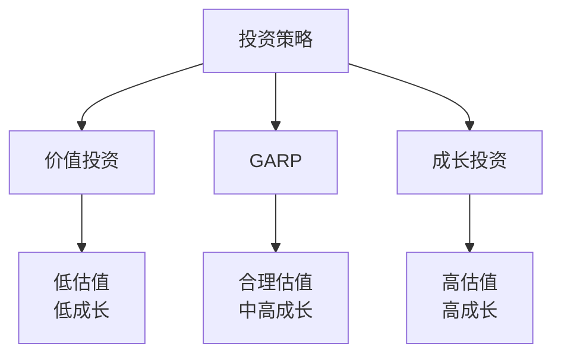

# GARP策略：合理价格的成长投资

## 概述

GARP（Growth At Reasonable Price）策略是成长投资与价值投资的完美结合，强调在合理价格买入优质成长股。这一策略由彼得·林奇发扬光大，成为最实用的投资方法之一。

**学习目标**：
1. 理解GARP策略的核心理念和优势
2. 掌握GARP选股的具体标准和方法
3. 学习如何平衡成长性与估值
4. 了解GARP策略的实践技巧
5. 认识GARP策略的适用场景和局限性

## GARP策略的核心理念

### 基本概念

**定义**：
GARP是一种投资策略，寻找那些具有良好成长前景、同时估值合理的股票。它避免了纯成长投资的高估值风险，也避免了纯价值投资可能错失成长机会的问题。

**核心原则**：
1. 寻找成长股
2. 但不支付过高价格
3. 关注PEG指标
4. 平衡成长与估值

### 投资哲学

**彼得·林奇的观点**：
> "我从不为成长股支付超过其增长率的价格。如果一家公司的增长率是15%，我愿意支付15倍的市盈率。" —— 彼得·林奇

**核心信念**：
- 成长很重要，但价格更重要
- 最好的投资是被低估的成长股
- PEG < 1是理想目标
- 安全边际仍然重要

### GARP vs 其他策略



**对比分析**：

| 维度 | 价值投资 | GARP | 成长投资 |
|------|---------|------|---------|
| 估值要求 | 低估值 | 合理估值 | 接受高估值 |
| 成长要求 | 不强调 | 中高成长 | 高成长 |
| PEG目标 | 不关注 | < 1 | 可接受>1 |
| 风险偏好 | 保守 | 平衡 | 激进 |
| 持有期 | 中长期 | 中长期 | 长期 |
| 代表人物 | 格雷厄姆 | 彼得·林奇 | 费雪 |

## GARP选股标准

### 核心指标

**1. PEG比率**
```
PEG = P/E / 预期增长率
```

**GARP标准**：
- 理想：PEG < 1
- 可接受：PEG = 1-1.5
- 避免：PEG > 2

**案例**：
```
公司A：
P/E = 20倍
增长率 = 25%
PEG = 0.8（符合GARP）

公司B：
P/E = 40倍
增长率 = 20%
PEG = 2.0（不符合GARP）
```

**2. 增长率要求**
- 收入增长：15-30%
- EPS增长：20-35%
- 可持续性：3-5年

**3. 估值要求**
- P/E：15-30倍
- P/S：2-8倍
- 低于行业平均或历史平均

**4. 盈利能力**
- ROE > 15%
- 毛利率稳定或提升
- 现金流健康

**5. 财务健康**
- 负债率适中
- 流动性充足
- 无重大财务风险

### 定性标准

**1. 商业模式**
- 清晰易懂
- 可持续性强
- 竞争优势明显

**2. 行业地位**
- 行业前三
- 市场份额稳定或提升
- 定价权

**3. 管理层**
- 诚信可靠
- 执行力强
- 股东导向

**4. 成长驱动**
- 市场扩张
- 产品创新
- 效率提升
- 并购整合

## GARP选股流程

### 第一步：初步筛选

**定量筛选**：
```
1. 收入增长率 > 15%
2. EPS增长率 > 20%
3. P/E < 30倍
4. PEG < 1.5
5. ROE > 15%
6. 负债率 < 60%
```

**结果**：
- 从数千只股票筛选出50-100只

### 第二步：深度分析

**财务分析**：
1. 收入质量
2. 利润质量
3. 现金流质量
4. 资产负债表健康度

**竞争分析**：
1. 行业地位
2. 竞争优势
3. 护城河评估
4. 竞争格局变化

**成长分析**：
1. 成长驱动因素
2. 市场空间
3. 成长可持续性
4. 风险因素

**结果**：
- 筛选出10-20只重点研究股票

### 第三步：估值分析

**多方法验证**：
1. PEG估值
2. DCF估值
3. 相对估值
4. 历史估值区间

**安全边际**：
```
内在价值：$100
当前价格：$80
安全边际：20%
```

**结果**：
- 确定5-10只买入标的

### 第四步：组合构建

**仓位分配**：
- 核心持仓（5-7只）：60-70%
- 卫星持仓（3-5只）：30-40%

**行业分散**：
- 避免过度集中
- 3-5个行业
- 考虑相关性

**动态调整**：
- 季度复盘
- 基本面跟踪
- 估值监控

## GARP实战案例

### 案例1：腾讯（2012-2015）

**2012年情况**：
```
股价：HK$200
P/E：25倍
增长率：30%
PEG：0.83
ROE：25%
```

**投资逻辑**：
- 移动互联网爆发
- 微信用户快速增长
- 游戏业务强劲
- 估值合理

**持有期表现**：
- 2012-2015：涨3倍
- 年化回报：45%

**GARP要素**：
- 高成长（30%）
- 合理估值（PEG<1）
- 强大护城河
- 优秀管理层

### 案例2：茅台（2016-2020）

**2016年情况**：
```
股价：¥300
P/E：18倍
增长率：20%
PEG：0.9
ROE：30%
```

**投资逻辑**：
- 消费升级
- 品牌护城河
- 定价权
- 估值合理

**持有期表现**：
- 2016-2020：涨6倍
- 年化回报：57%

**GARP要素**：
- 稳定成长（20%）
- 低估值（PEG<1）
- 最强护城河
- 现金流充沛

### 案例3：美团（2020）

**2020年情况**：
```
股价：HK$200
P/S：5倍
收入增长：30%
亏损转盈利
```

**投资逻辑**：
- 本地生活龙头
- 疫情后复苏
- 盈利能力改善
- 估值合理

**持有期表现**：
- 2020-2021：涨2倍
- 年化回报：100%

**GARP要素**：
- 高成长（30%）
- 合理P/S
- 规模效应
- 盈利拐点

## GARP策略的优势

### 1. 平衡风险收益

**优势**：
- 避免高估值风险
- 捕捉成长机会
- 下行保护
- 上行空间

**数据支持**：
```
历史回测（1990-2020）：
GARP策略年化回报：15%
纯成长策略：12%
纯价值策略：10%
市场平均：8%
```

### 2. 适应性强

**适用市场**：
- 牛市：捕捉成长
- 熊市：估值保护
- 震荡市：稳健收益

**适用风格**：
- 成长风格占优时表现好
- 价值风格占优时不落后
- 风格轮动时更稳定

### 3. 实用性强

**优势**：
- 标准明确
- 易于执行
- 可量化
- 可复制

### 4. 长期有效

**历史验证**：
- 彼得·林奇：13年年化29%
- 众多基金经理验证
- 学术研究支持

## GARP策略的局限性

### 1. 错失超级成长股

**问题**：
- PEG>1的股票可能被排除
- 可能错过亚马逊、特斯拉等
- 估值约束限制收益

**应对**：
- 适当放宽标准
- 关注质量
- 长期视角

### 2. 增长率预测困难

**问题**：
- 未来增长不确定
- 预测误差大
- PEG计算依赖预测

**应对**：
- 保守预测
- 多情景分析
- 持续跟踪

### 3. 市场风格影响

**问题**：
- 极端成长风格时跑输
- 需要耐心
- 短期可能落后

**应对**：
- 长期视角
- 坚持纪律
- 不追逐热点

## GARP投资建议

### 1. 选股建议

**优先行业**：
- 消费升级
- 医疗健康
- 科技应用
- 先进制造

**避免行业**：
- 强周期行业
- 夕阳产业
- 过度竞争行业

### 2. 买入时机

**理想时机**：
- 市场调整时
- 行业轮动时
- 个股回调时
- 业绩超预期后回调

**避免时机**：
- 市场狂热时
- 估值过高时
- 基本面恶化时

### 3. 持有策略

**持有条件**：
- 成长逻辑未变
- 估值仍合理
- 竞争优势稳固

**卖出信号**：
- 成长显著放缓
- 估值严重高估（PEG>2）
- 基本面恶化
- 发现更好机会

### 4. 组合管理

**分散度**：
- 持有10-15只股票
- 3-5个行业
- 避免过度集中

**再平衡**：
- 季度复盘
- 估值监控
- 动态调整

## 延伸阅读

### 必读书籍

1. **《彼得·林奇的成功投资》** - 彼得·林奇
   - GARP策略经典
   - 实战案例丰富
   - 选股方法详细

2. **《战胜华尔街》** - 彼得·林奇
   - 投资实践
   - 组合管理
   - 心理建设

3. **《投资中最简单的事》** - 邱国鹭
   - GARP在中国市场的应用
   - 实战经验
   - 投资框架

4. **《聪明的投资者》** - 本杰明·格雷厄姆
   - 价值投资基础
   - 安全边际
   - 市场先生

5. **《怎样选择成长股》** - 菲利普·费雪
   - 成长投资基础
   - 选股要点
   - 调研方法

### 推荐资源

1. **晨星网** - GARP基金筛选
2. **价值线** - 成长性评级
3. **Seeking Alpha** - 投资分析
4. **雪球** - 投资交流

## 参考文献

1. Lynch, P. (1989). *One Up On Wall Street*.
2. Lynch, P. (1993). *Beating the Street*.
3. Fisher, P. (1958). *Common Stocks and Uncommon Profits*.
4. Graham, B. (1949). *The Intelligent Investor*.
5. Qiu, G. (2014). *The Simplest Thing in Investing*.
6. Damodaran, A. (2012). *Investment Valuation*.
7. Greenblatt, J. (2010). *The Little Book That Beats the Market*.
8. Dorsey, P. (2008). *The Little Book That Builds Wealth*.
9. Hagstrom, R. (2013). *The Warren Buffett Way*.
10. Mauboussin, M. (2012). *The Success Equation*.

## 关键要点

1. **核心理念**：在合理价格买入成长股
2. **关键指标**：PEG < 1是理想目标
3. **选股标准**：成长性、估值、质量三者平衡
4. **投资优势**：风险收益平衡、适应性强、长期有效
5. **实践建议**：保守预测、分散投资、动态调整

> "我寻找的是那些被低估的成长股，而不是被高估的成长股。" —— 彼得·林奇

> "最好的投资是那些既有成长性又有合理估值的公司。" —— 沃伦·巴菲特

GARP策略是成长投资与价值投资的完美结合，通过在合理价格买入优质成长股，投资者能够在控制风险的同时获得可观的长期回报。这是一种实用、有效、经过验证的投资策略，值得每一位投资者学习和实践。


## 高级分析与前沿研究

### 学术研究进展

近年来，学术界对本领域的研究取得了重要进展。以下是几个值得关注的研究方向：

**行为金融学视角**：传统金融理论假设市场参与者是完全理性的，但行为金融学的研究表明，认知偏差和情绪因素在投资决策中扮演着重要角色。诺贝尔经济学奖得主丹尼尔·卡尼曼（Daniel Kahneman）和理查德·塞勒（Richard Thaler）的研究为我们理解市场非理性行为提供了重要框架。

**因子投资研究**：尤金·法玛（Eugene Fama）和肯尼斯·弗伦奇（Kenneth French）的三因子模型，以及后续发展的五因子模型，为系统性地解释股票收益差异提供了理论基础。这些研究表明，市值、账面市值比、盈利能力和投资模式等因子能够解释大部分股票收益的横截面差异。

**市场微观结构研究**：对市场流动性、价格发现机制和交易成本的深入研究，帮助我们更好地理解市场的运作机制，并为优化交易策略提供指导。

### 实战案例深度解析

**案例一：长期价值创造的典范**

以沃伦·巴菲特（Warren Buffett）的伯克希尔·哈撒韦（Berkshire Hathaway）为例，其长达数十年的卓越投资业绩证明了价值投资理念的有效性。从1965年至今，伯克希尔的账面价值年均增长率约为19.8%，远超同期标普500指数的约10.2%年均回报。

巴菲特的成功秘诀在于：
- 专注于具有持久竞争优势的优质企业
- 以合理价格买入，而非追求最低价格
- 长期持有，让复利效应充分发挥
- 保持充足的安全边际，控制下行风险

**案例二：危机中的机遇识别**

2008年金融危机期间，大多数投资者恐慌性抛售，但少数具有前瞻性的投资者却在危机中发现了历史性的投资机会。约翰·保尔森（John Paulson）通过做空次级抵押贷款相关证券，在危机中获得了约150亿美元的利润，成为金融史上最成功的单笔交易之一。

这个案例告诉我们：
- 深入的基本面研究能够发现市场定价错误
- 逆向思维往往能够发现被市场忽视的机会
- 风险管理和仓位控制是成功的关键

### 跨市场比较分析

不同市场在结构、监管、投资者构成等方面存在显著差异，这些差异对投资策略的选择有重要影响：

**美国市场特征**：
- 机构投资者主导，市场效率较高
- 信息披露制度完善，分析师覆盖广泛
- 衍生品市场发达，对冲工具丰富
- 长期牛市历史，但也经历过多次重大调整

**中国市场特征**：
- 散户投资者比例较高，市场波动性较大
- 政策因素影响显著，需要密切关注监管动向
- 新兴行业发展迅速，成长投资机会丰富
- A股、港股、美股中概股形成多层次市场体系

**欧洲市场特征**：
- 价值股比例较高，估值相对保守
- 受地缘政治和欧元区政策影响较大
- 部分行业（如奢侈品、工业）具有全球竞争优势
- ESG投资理念推广较为领先

