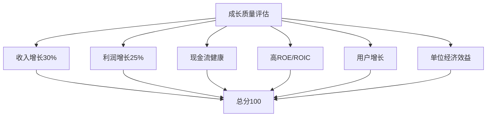

# 成长指标体系：量化评估企业成长性

## 概述

成长投资需要系统化的指标体系来评估企业的成长性。本文将介绍核心的成长指标，包括收入增长、盈利能力、现金流质量、资本效率等维度，帮助投资者建立完整的成长性评估框架。

**学习目标**：
1. 掌握核心成长指标的定义和计算方法
2. 理解不同指标的适用场景和局限性
3. 学习如何综合运用多个指标评估企业
4. 了解行业差异对指标的影响
5. 建立系统化的成长性评估框架

## 核心成长指标

### 1. 收入增长指标

**年收入增长率（YoY Revenue Growth）**
```
收入增长率 = (本年收入 - 去年收入) / 去年收入 × 100%
```

**评估标准**：
- 优秀：> 30%
- 良好：20-30%
- 一般：10-20%
- 较弱：< 10%

**复合年增长率（CAGR）**
```
CAGR = [(期末值/期初值)^(1/年数) - 1] × 100%
```

**同店销售增长（Same-Store Sales Growth）**
- 适用于零售、餐饮行业
- 排除新店影响
- 反映内生增长

**2. 盈利增长指标**

**EPS增长率**
```
EPS增长率 = (本年EPS - 去年EPS) / 去年EPS × 100%
```

**营业利润增长率**
```
营业利润增长率 = (本年营业利润 - 去年营业利润) / 去年营业利润 × 100%
```

**净利润增长率**
```
净利润增长率 = (本年净利润 - 去年净利润) / 去年净利润 × 100%
```

### 3. 盈利能力指标

**毛利率（Gross Margin）**
```
毛利率 = (收入 - 成本) / 收入 × 100%
```

**行业标准**：
- 软件/SaaS：> 70%
- 消费品牌：40-60%
- 零售：20-40%
- 制造业：15-30%

**净利率（Net Margin）**
```
净利率 = 净利润 / 收入 × 100%
```

**营业利润率（Operating Margin）**
```
营业利润率 = 营业利润 / 收入 × 100%
```

**ROE（净资产收益率）**
```
ROE = 净利润 / 股东权益 × 100%
```

**优秀标准**：
- ROE > 20%：优秀
- ROE 15-20%：良好
- ROE < 15%：一般

**ROIC（投入资本回报率）**
```
ROIC = NOPAT / 投入资本 × 100%
```

### 4. 现金流指标

**经营现金流增长率**
```
经营现金流增长率 = (本年经营现金流 - 去年经营现金流) / 去年经营现金流 × 100%
```

**自由现金流（FCF）**
```
FCF = 经营现金流 - 资本支出
```

**FCF转化率**
```
FCF转化率 = 自由现金流 / 净利润 × 100%
```

**优秀标准**：> 80%

**现金流利润率**
```
现金流利润率 = 经营现金流 / 收入 × 100%
```

### 5. 资本效率指标

**资产周转率**
```
资产周转率 = 收入 / 总资产
```

**存货周转率**
```
存货周转率 = 销售成本 / 平均存货
```

**应收账款周转率**
```
应收账款周转率 = 收入 / 平均应收账款
```

**资本支出比率**
```
资本支出比率 = 资本支出 / 收入 × 100%
```

**轻资产模式**：< 5%
**重资产模式**：> 15%

## 非财务成长指标

### 1. 用户增长指标

**月活跃用户（MAU）**
- 互联网公司核心指标
- 增长率和绝对数量

**日活跃用户（DAU）**
- 用户粘性指标
- DAU/MAU比率

**付费用户数**
- 变现能力
- 付费转化率

**用户留存率**
```
留存率 = 期末活跃用户 / 期初活跃用户 × 100%
```

### 2. 单位经济效益

**客户获取成本（CAC）**
```
CAC = 销售和营销费用 / 新增客户数
```

**客户生命周期价值（LTV）**
```
LTV = ARPU × 客户生命周期 × 毛利率
```

**LTV/CAC比率**
- 优秀：> 3
- 良好：2-3
- 警戒：< 2

**回收期**
```
回收期 = CAC / (ARPU × 毛利率)
```

**优秀标准**：< 12个月

### 3. 产品指标

**NPS（净推荐值）**
```
NPS = 推荐者% - 贬损者%
```

**优秀标准**：
- NPS > 50：优秀
- NPS 30-50：良好
- NPS < 30：需改进

**产品使用频率**
- 日均使用时长
- 使用频次
- 功能使用率

**客户满意度（CSAT）**
- 产品满意度
- 服务满意度
- 整体体验

### 4. 市场指标

**市场份额**
- 绝对市场份额
- 相对市场份额
- 份额变化趋势

**品牌认知度**
- 品牌知名度
- 品牌偏好度
- 购买意向

**市场渗透率**
```
渗透率 = 实际用户数 / 潜在用户数 × 100%
```

## 行业特定指标

### SaaS企业

**ARR（年度经常性收入）**
```
ARR = MRR × 12
```

**MRR（月度经常性收入）**
- 可预测的收入
- 增长趋势

**净收入留存率（NRR）**
```
NRR = (期初ARR + 增购 - 流失) / 期初ARR × 100%
```

**优秀标准**：> 120%

**Magic Number**
```
Magic Number = 本季度新增ARR / 上季度销售和营销费用
```

**优秀标准**：> 0.75

### 电商企业

**GMV（商品交易总额）**
```
GMV = 订单数 × 客单价
```

**订单转化率**
```
转化率 = 订单数 / 访问量 × 100%
```

**复购率**
```
复购率 = 重复购买客户数 / 总客户数 × 100%
```

**客单价（AOV）**
```
AOV = GMV / 订单数
```

### 平台企业

**网络效应强度**
- 用户增长加速度
- 交易密度
- 平台活跃度

**供需平衡**
- 供给侧增长
- 需求侧增长
- 匹配效率

**Take Rate**
```
Take Rate = 平台收入 / GMV × 100%
```

## 综合评估框架

### 成长质量评分卡



**评分标准**：
- 90-100分：优秀
- 80-90分：良好
- 70-80分：一般
- < 70分：需改进

### 成长阶段判断

**早期成长期**：
- 收入高增长（> 50%）
- 亏损或微利
- 用户快速增长
- 市场份额提升

**快速成长期**：
- 收入增长30-50%
- 盈利能力改善
- 规模效应显现
- 行业地位确立

**成熟成长期**：
- 收入增长15-30%
- 稳定盈利
- 现金流充沛
- 市场领导地位

**稳定期**：
- 收入增长< 15%
- 高盈利能力
- 分红回购
- 防御性增长

## 实战应用

### 案例分析：特斯拉（2015-2020）

**收入增长**：
- 2015-2020 CAGR：52%
- 持续高增长

**盈利能力**：
- 毛利率：20%+
- 净利率：由负转正
- 规模效应显现

**现金流**：
- 经营现金流转正
- 自由现金流改善
- 资本支出下降

**非财务指标**：
- 交付量增长：50%+
- 市场份额：电动车第一
- 品牌价值：持续提升

**综合评估**：
- 成长性：优秀
- 盈利能力：改善中
- 现金流：健康
- 投资价值：高

### 案例分析：拼多多（2018-2021）

**收入增长**：
- 2018-2021 CAGR：158%
- 超高速增长

**用户增长**：
- MAU：8.8亿（2021）
- 年活跃买家：8.7亿
- 用户粘性提升

**单位经济效益**：
- CAC持续下降
- LTV提升
- LTV/CAC > 3

**盈利能力**：
- 由亏损转盈利
- 营业利润率：15%+
- 规模效应显著

**综合评估**：
- 成长性：优秀
- 用户基础：强大
- 盈利能力：快速改善
- 投资价值：高

## 常见误区

### 误区1：只看收入增长

**问题**：
- 忽视盈利能力
- 忽视现金流
- 忽视增长质量

**正确做法**：
- 综合评估
- 关注盈利路径
- 评估可持续性

### 误区2：忽视行业差异

**问题**：
- 不同行业标准不同
- 生命周期阶段不同
- 商业模式差异

**正确做法**：
- 行业对比
- 同类公司对比
- 考虑发展阶段

### 误区3：过度依赖单一指标

**问题**：
- 片面评估
- 忽视风险
- 误判企业

**正确做法**：
- 多维度评估
- 交叉验证
- 动态跟踪

## 延伸阅读

### 必读书籍

1. **《财务报表分析》** - 马丁·弗里德森
2. **《价值评估》** - 阿斯沃斯·达摩达兰
3. **《精益数据分析》** - 阿利斯泰尔·克罗尔
4. **《增长黑客》** - 肖恩·埃利斯
5. **《SaaS创业路线图》** - 菲尔·纳德尔

### 推荐资源

1. **财务数据平台**：Bloomberg, FactSet, Wind
2. **行业研究**：Gartner, IDC, 艾瑞咨询
3. **公司公告**：年报、季报、投资者关系
4. **分析工具**：Excel, Python, Tableau

## 参考文献

1. Damodaran, A. (2012). *Investment Valuation*.
2. Fridson, M. (2011). *Financial Statement Analysis*.
3. Croll, A. (2013). *Lean Analytics*.
4. Ellis, S. (2017). *Hacking Growth*.
5. Nadella, P. (2018). *The SaaS Playbook*.
6. Ries, E. (2011). *The Lean Startup*.
7. Blank, S. (2013). *The Four Steps to the Epiphany*.
8. Maurya, A. (2012). *Running Lean*.
9. Osterwalder, A. (2010). *Business Model Generation*.
10. Thiel, P. (2014). *Zero to One*.

## 关键要点

1. **多维度评估**：收入、利润、现金流、用户、效率
2. **行业差异**：不同行业有不同的关键指标
3. **成长质量**：关注增长的可持续性和健康度
4. **综合分析**：避免单一指标误导
5. **动态跟踪**：持续监控指标变化趋势

成长指标体系是评估企业成长性的重要工具。通过系统化地运用财务和非财务指标，投资者能够全面评估企业的成长潜力和质量，做出更明智的投资决策。


## 深度分析

### 核心机制解析

理解本主题需要从多个维度进行系统性分析。以下从理论基础、实践应用和历史验证三个层面展开深度探讨。

**理论基础层面**：本主题的核心逻辑建立在经济学和金融学的基本原理之上。通过对基础理论的深入理解，投资者能够建立起稳固的分析框架，避免被市场短期噪音所干扰。

**实践应用层面**：理论必须与实践相结合才能产生价值。在实际投资决策中，需要将抽象的概念转化为具体的分析工具和决策标准。

**历史验证层面**：金融市场有着丰富的历史记录，通过研究历史案例，我们可以验证理论的有效性，并从中提炼出具有普遍意义的规律。

### 关键影响因素

影响本主题的关键因素可以从以下几个维度进行分析：

1. **宏观经济环境**：利率水平、通货膨胀率、经济增长速度等宏观变量对本主题有着深远影响。在不同的宏观经济周期中，相关指标的表现会呈现出显著差异。

2. **市场结构因素**：市场参与者的构成、信息传播机制、流动性状况等市场结构因素决定了价格发现的效率和准确性。

3. **政策监管环境**：政府政策、监管框架的变化会直接影响相关市场的运作规则和参与者行为。

4. **技术创新驱动**：技术进步不断改变着金融市场的运作方式，从算法交易到区块链技术，每一次技术革新都带来新的机遇和挑战。

5. **全球化与地缘政治**：在全球化背景下，各国市场之间的联动性日益增强，地缘政治风险的影响也越来越不可忽视。

### 量化分析框架

为了更精确地分析和评估，可以采用以下量化框架：

| 分析维度 | 关键指标 | 参考基准 | 分析方法 |
|---------|---------|---------|---------|
| 规模评估 | 绝对值与相对值 | 历史均值 | 趋势分析 |
| 质量评估 | 稳定性指标 | 行业对标 | 横向比较 |
| 风险评估 | 波动率指标 | 风险阈值 | 情景分析 |
| 价值评估 | 估值倍数 | 历史区间 | 回归分析 |

通过系统性地应用上述框架，投资者可以对目标进行全面、客观的评估，从而做出更加理性的投资决策。


## 高级分析与前沿研究

### 学术研究进展

近年来，学术界对本领域的研究取得了重要进展。以下是几个值得关注的研究方向：

**行为金融学视角**：传统金融理论假设市场参与者是完全理性的，但行为金融学的研究表明，认知偏差和情绪因素在投资决策中扮演着重要角色。诺贝尔经济学奖得主丹尼尔·卡尼曼（Daniel Kahneman）和理查德·塞勒（Richard Thaler）的研究为我们理解市场非理性行为提供了重要框架。

**因子投资研究**：尤金·法玛（Eugene Fama）和肯尼斯·弗伦奇（Kenneth French）的三因子模型，以及后续发展的五因子模型，为系统性地解释股票收益差异提供了理论基础。这些研究表明，市值、账面市值比、盈利能力和投资模式等因子能够解释大部分股票收益的横截面差异。

**市场微观结构研究**：对市场流动性、价格发现机制和交易成本的深入研究，帮助我们更好地理解市场的运作机制，并为优化交易策略提供指导。

### 实战案例深度解析

**案例一：长期价值创造的典范**

以沃伦·巴菲特（Warren Buffett）的伯克希尔·哈撒韦（Berkshire Hathaway）为例，其长达数十年的卓越投资业绩证明了价值投资理念的有效性。从1965年至今，伯克希尔的账面价值年均增长率约为19.8%，远超同期标普500指数的约10.2%年均回报。

巴菲特的成功秘诀在于：
- 专注于具有持久竞争优势的优质企业
- 以合理价格买入，而非追求最低价格
- 长期持有，让复利效应充分发挥
- 保持充足的安全边际，控制下行风险

**案例二：危机中的机遇识别**

2008年金融危机期间，大多数投资者恐慌性抛售，但少数具有前瞻性的投资者却在危机中发现了历史性的投资机会。约翰·保尔森（John Paulson）通过做空次级抵押贷款相关证券，在危机中获得了约150亿美元的利润，成为金融史上最成功的单笔交易之一。

这个案例告诉我们：
- 深入的基本面研究能够发现市场定价错误
- 逆向思维往往能够发现被市场忽视的机会
- 风险管理和仓位控制是成功的关键

### 跨市场比较分析

不同市场在结构、监管、投资者构成等方面存在显著差异，这些差异对投资策略的选择有重要影响：

**美国市场特征**：
- 机构投资者主导，市场效率较高
- 信息披露制度完善，分析师覆盖广泛
- 衍生品市场发达，对冲工具丰富
- 长期牛市历史，但也经历过多次重大调整

**中国市场特征**：
- 散户投资者比例较高，市场波动性较大
- 政策因素影响显著，需要密切关注监管动向
- 新兴行业发展迅速，成长投资机会丰富
- A股、港股、美股中概股形成多层次市场体系

**欧洲市场特征**：
- 价值股比例较高，估值相对保守
- 受地缘政治和欧元区政策影响较大
- 部分行业（如奢侈品、工业）具有全球竞争优势
- ESG投资理念推广较为领先

