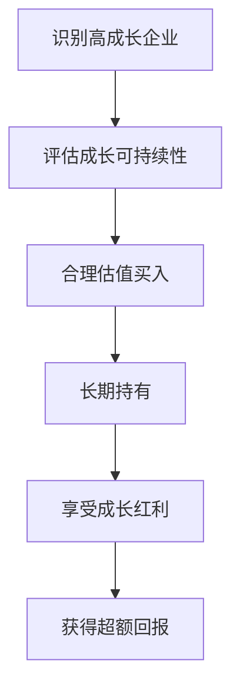
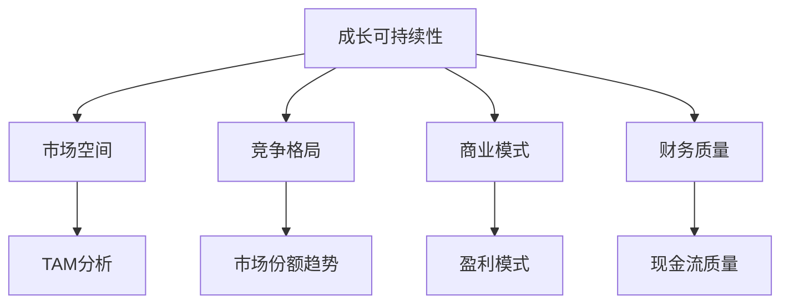

# 成长投资原则：寻找未来的赢家

## 概述

成长投资（Growth Investing）是一种专注于投资高成长潜力企业的投资策略。与价值投资关注"便宜"不同，成长投资者愿意为优质成长企业支付溢价，相信企业未来的高速增长能够证明当前的高估值是合理的。


**学习目标**：
1. 理解成长投资的核心理念和哲学
2. 掌握识别高成长企业的关键指标
3. 学习成长投资的选股标准和方法
4. 了解成长投资与价值投资的区别与联系
5. 认识成长投资的风险和应对策略

**为什么重要**：在科技创新加速、产业变革频繁的时代，成长投资成为获取超额回报的重要途径。理解成长投资原则，能帮助投资者把握时代机遇，投资于改变世界的伟大企业，分享企业高速成长带来的丰厚回报。


## 成长投资的核心理念

### 什么是成长投资

**定义**：
成长投资是一种投资策略，专注于寻找和投资那些收入、利润或现金流增长速度显著高于市场平均水平的企业，即使这些企业的当前估值看起来较高。

**核心信念**：
- 企业的未来增长潜力比当前价格更重要
- 高质量的成长能够证明高估值的合理性
- 时间是成长企业的朋友
- 复合增长的力量是惊人的

**投资逻辑**：


### 成长投资 vs 价值投资

**核心差异**：

| 维度 | 价值投资 | 成长投资 |
|------|---------|---------|
| 关注点 | 当前价格 vs 内在价值 | 未来成长潜力 |
| 估值容忍度 | 要求低估值 | 接受合理溢价 |
| 持有期 | 等待价值回归 | 等待成长兑现 |
| 风险来源 | 价值陷阱 | 成长不及预期 |
| 典型行业 | 传统行业、周期股 | 科技、消费、医疗 |
| 代表人物 | 格雷厄姆、巴菲特 | 费雪、彼得·林奇 |

**共同点**：
- 都需要深入的基本面分析
- 都强调安全边际（定义不同）
- 都需要长期视角
- 都追求超额回报

**融合趋势**：
现代投资实践中，成长与价值的界限日益模糊。巴菲特后期的投资（如Apple）就融合了两者的优点：
- 寻找具有成长潜力的优质企业
- 在合理价格买入
- 长期持有享受成长


## 成长投资的核心原则

### 原则1：寻找结构性成长机会

**什么是结构性成长**：
- 由行业趋势、技术革新、消费升级等长期因素驱动
- 不依赖于经济周期
- 具有长期可持续性
- 市场空间巨大

**识别方法**：
1. **技术创新驱动**
   - 人工智能、云计算、新能源
   - 颠覆性技术带来的新市场
   - 技术渗透率提升

2. **消费升级驱动**
   - 中产阶级扩大
   - 品质消费、品牌消费
   - 服务消费增长

3. **政策支持驱动**
   - 产业政策扶持
   - 监管环境改善
   - 基础设施建设

4. **人口结构变化**
   - 老龄化带来的医疗需求
   - 年轻人的新消费习惯
   - 城镇化进程

**案例**：
- 云计算：企业数字化转型的必然趋势
- 电动车：能源转型和环保政策推动
- 医疗健康：老龄化和健康意识提升

### 原则2：关注竞争优势和护城河

**成长企业的护城河**：
1. **技术领先**
   - 专利保护
   - 技术壁垒
   - 研发能力

2. **网络效应**
   - 用户越多，价值越大
   - 社交网络、平台经济
   - 形成自然垄断

3. **品牌优势**
   - 强大的品牌认知
   - 客户忠诚度
   - 定价权

4. **规模效应**
   - 成本优势
   - 市场份额
   - 供应链优势

5. **转换成本**
   - 客户迁移成本高
   - 企业软件、云服务
   - 生态系统锁定

**评估标准**：
- 护城河是否在加深？
- 竞争对手能否轻易复制？
- 护城河能维持多久？

### 原则3：重视管理层质量

**为什么重要**：
成长企业面临快速变化的市场环境，优秀的管理层是成功的关键。

**评估维度**：
1. **战略眼光**
   - 能否把握行业趋势
   - 战略布局是否清晰
   - 执行力如何

2. **创新能力**
   - 研发投入
   - 产品创新记录
   - 技术储备

3. **资本配置**
   - 投资回报率
   - 并购整合能力
   - 股东回报意识

4. **企业文化**
   - 吸引人才能力
   - 员工满意度
   - 创新氛围

5. **诚信度**
   - 财务透明度
   - 承诺兑现情况
   - 与股东沟通

**红旗信号**：
- 频繁更换高管
- 会计处理激进
- 过度承诺
- 关联交易频繁


### 原则4：评估成长的可持续性

**关键问题**：
- 成长能持续多久？
- 成长的质量如何？
- 成长的驱动因素是什么？

**评估框架**：


**市场空间分析**：
1. **TAM（Total Addressable Market）**
   - 总潜在市场规模
   - 市场增长率
   - 渗透率空间

2. **SAM（Serviceable Available Market）**
   - 可服务市场
   - 公司能够触达的市场

3. **SOM（Serviceable Obtainable Market）**
   - 可获得市场份额
   - 短期内能实现的市场

**成长质量指标**：
- 收入增长是否伴随利润增长
- 现金流是否健康
- 客户留存率
- 单位经济效益
- 资本效率

### 原则5：合理估值，避免过度支付

**成长投资的估值挑战**：
- 传统估值方法可能不适用
- 需要对未来做出假设
- 估值弹性大

**估值方法**：
1. **PEG比率**
   ```
   PEG = PE / 预期增长率
   PEG < 1：可能被低估
   PEG = 1：合理估值
   PEG > 2：可能被高估
   ```

2. **DCF估值**
   - 预测未来现金流
   - 使用合理折现率
   - 敏感性分析

3. **相对估值**
   - 与同行业公司对比
   - 历史估值区间
   - 成长阶段调整

4. **市销率（P/S）**
   - 适用于高成长但未盈利企业
   - 关注收入增长质量

**安全边际**：
虽然成长投资接受溢价，但仍需要安全边际：
- 保守的增长假设
- 合理的估值倍数
- 分散投资降低风险

### 原则6：长期持有，让复利发挥作用

**复合增长的力量**：
```
假设企业年增长30%：
1年后：1.30倍
3年后：2.20倍
5年后：3.71倍
10年后：13.79倍
```

**持有策略**：
1. **持有条件**
   - 成长逻辑未改变
   - 竞争优势仍在
   - 估值仍合理
   - 管理层可信

2. **卖出信号**
   - 成长显著放缓
   - 竞争优势削弱
   - 估值严重高估
   - 发现更好机会

**避免频繁交易**：
- 交易成本侵蚀收益
- 税收影响
- 难以把握时机
- 错失长期收益


## 成长投资的选股标准

### 财务指标筛选

**收入增长**：
- 年收入增长率 > 20%
- 增长加速更佳
- 有机增长 vs 并购增长

**利润增长**：
- EPS增长率 > 25%
- 利润率提升
- 规模效应显现

**现金流**：
- 经营现金流为正
- 自由现金流增长
- 资本支出合理

**财务健康**：
- 负债率适中
- 流动性充足
- ROE > 15%

### 定性因素评估

**行业地位**：
- 市场份额前三
- 行业增速 > GDP增速
- 进入壁垒高

**产品竞争力**：
- 产品差异化
- 技术领先性
- 客户满意度

**商业模式**：
- 可扩展性强
- 边际成本递减
- 网络效应明显

**管理团队**：
- 创始人领导
- 股权激励合理
- 长期战略清晰

## 成长投资的风险管理

### 主要风险

**1. 成长不及预期**
- 市场竞争加剧
- 技术路线错误
- 管理执行不力

**应对**：
- 保守预测
- 持续跟踪
- 及时止损

**2. 估值风险**
- 市场情绪变化
- 利率上升
- 风格轮动

**应对**：
- 避免追高
- 分批建仓
- 长期视角

**3. 黑天鹅事件**
- 监管政策变化
- 技术颠覆
- 管理层变动

**应对**：
- 分散投资
- 持续学习
- 灵活调整

### 风险控制策略

**组合管理**：
- 持有8-15只股票
- 单只持仓不超过15%
- 行业分散

**仓位管理**：
- 根据确信度调整仓位
- 高确信度：10-15%
- 中等确信度：5-10%
- 低确信度：<5%

**动态调整**：
- 定期审视持仓
- 根据基本面变化调整
- 及时止盈止损

## 成长投资的实践策略

### 自上而下选股

**步骤**：
1. **识别成长赛道**
   - 宏观趋势分析
   - 行业研究
   - 政策导向

2. **筛选优质企业**
   - 行业龙头
   - 竞争优势
   - 财务指标

3. **深度研究**
   - 商业模式
   - 管理团队
   - 竞争格局

4. **估值分析**
   - 多种方法验证
   - 安全边际
   - 买入时机

### 自下而上选股

**步骤**：
1. **发现优秀企业**
   - 日常观察
   - 产品体验
   - 行业交流

2. **基本面分析**
   - 财务数据
   - 竞争优势
   - 成长潜力

3. **行业验证**
   - 行业空间
   - 竞争格局
   - 发展趋势

4. **投资决策**
   - 估值合理性
   - 风险评估
   - 买入执行


## 成功成长投资者的特质

### 必备能力

**1. 前瞻性思维**
- 把握时代趋势
- 理解技术变革
- 预见消费变化

**2. 学习能力**
- 快速学习新知识
- 理解新商业模式
- 跟上技术发展

**3. 风险承受能力**
- 接受波动
- 长期视角
- 情绪控制

**4. 研究能力**
- 深度分析
- 独立思考
- 持续跟踪

### 心理素质

**耐心**：
- 等待好机会
- 持有优质企业
- 不被短期波动影响

**勇气**：
- 敢于重仓
- 逆向思维
- 坚持信念

**谦逊**：
- 承认错误
- 及时调整
- 持续学习

## 延伸阅读

### 必读书籍

1. **《怎样选择成长股》** - 菲利普·费雪
   - 成长投资经典
   - 15个选股要点
   - Scuttlebutt调研法

2. **《彼得·林奇的成功投资》** - 彼得·林奇
   - 实战经验分享
   - 十倍股理论
   - 选股方法论

3. **《投资中最简单的事》** - 邱国鹭
   - 成长投资实践
   - 中国市场经验
   - 投资框架

4. **《增长黑客》** - 肖恩·埃利斯
   - 理解企业增长
   - 增长策略
   - 数据驱动

5. **《从0到1》** - 彼得·蒂尔
   - 创新思维
   - 垄断优势
   - 未来视角

### 推荐资源

1. **ARK Invest研究报告** - 前沿科技投资
2. **a16z博客** - 科技投资洞察
3. **红杉资本研究** - 成长企业分析
4. **高瓴资本观点** - 长期价值投资

## 参考文献

1. Fisher, P. (1958). *Common Stocks and Uncommon Profits*.
2. Lynch, P. (1989). *One Up On Wall Street*.
3. Damodaran, A. (2012). *Investment Valuation: Tools and Techniques for Determining the Value of Any Asset*.
4. Dorsey, P. (2008). *The Little Book That Builds Wealth*.
5. Greenblatt, J. (2010). *The Little Book That Beats the Market*.
6. Mauboussin, M. (2012). *The Success Equation: Untangling Skill and Luck in Business, Sports, and Investing*.
7. Thiel, P. (2014). *Zero to One: Notes on Startups, or How to Build the Future*.
8. Ellis, S. (2017). *Hacking Growth: How Today's Fastest-Growing Companies Drive Breakout Success*.
9. Qiu, G. (2014). *The Simplest Thing in Investing* (投资中最简单的事).
10. Christensen, C. (1997). *The Innovator's Dilemma*.

## 关键要点

1. **核心理念**：关注未来成长潜力，愿意为优质成长支付合理溢价
2. **选股标准**：结构性成长机会、竞争优势、优秀管理层、可持续成长
3. **估值方法**：PEG、DCF、相对估值，保持安全边际
4. **风险管理**：分散投资、仓位控制、动态调整
5. **成功要素**：前瞻性思维、学习能力、耐心、勇气

> "最好的投资是那些能够持续多年保持高增长的企业。" —— 菲利普·费雪

> "你不需要成为火箭科学家。投资不是智商160的人击败智商130的人的游戏。" —— 沃伦·巴菲特

成长投资是一门艺术，也是一门科学。它需要投资者具备前瞻性的眼光、深入的研究能力和坚定的信念。在这个快速变化的时代，掌握成长投资原则，能够帮助我们把握时代机遇，投资于改变世界的伟大企业，获得丰厚的长期回报。

