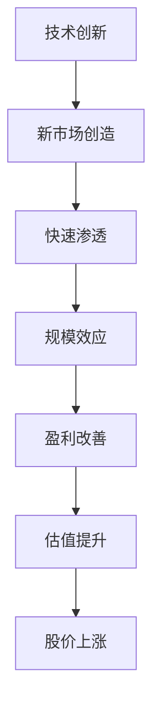

# 科技成长股分析：投资未来的技术革命

## 概述

科技成长股代表着创新和未来，是成长投资中最具吸引力但也最具挑战性的领域。本文将深入探讨科技成长股的投资逻辑、分析框架和实践策略。

**学习目标**：
1. 理解科技成长股的特点和投资逻辑
2. 掌握科技企业的分析框架和评估方法
3. 学习不同科技细分领域的投资要点
4. 了解科技股的估值方法和风险管理
5. 把握技术创新带来的投资机遇

## 科技成长股的特点

### 核心特征

**1. 高成长性**
- 收入增长：30-100%+
- 市场扩张快速
- 技术渗透率提升
- 规模效应显著

**2. 高估值**
- P/E：50-200倍
- P/S：10-50倍
- 市梦率定价
- 未来预期驱动

**3. 高波动性**
- 股价波动大
- 情绪影响强
- 风格轮动明显
- 需要强心脏

**4. 赢家通吃**
- 网络效应
- 平台经济
- 生态系统
- 马太效应

### 投资逻辑



## 科技细分领域分析

### 1. 云计算（Cloud Computing）

**市场机会**：
- 企业数字化转型
- 混合云、多云趋势
- SaaS应用爆发
- 全球市场规模：$500B+

**关键指标**：
- ARR增长率
- 净收入留存率（NRR）
- 客户数量和质量
- 毛利率（> 70%）

**代表公司**：
- AWS（亚马逊）
- Azure（微软）
- Google Cloud
- Salesforce
- Snowflake

**投资要点**：
- 市场份额趋势
- 技术领先性
- 生态系统
- 客户粘性

### 2. 人工智能（AI）

**市场机会**：
- 生成式AI革命
- 行业应用广泛
- 算力需求爆发
- 全球市场规模：$1T+（2030）

**投资主线**：
1. **算力层**：英伟达、AMD
2. **模型层**：OpenAI、Anthropic
3. **应用层**：各行业AI应用

**关键指标**：
- GPU出货量
- 模型性能
- 用户增长
- 商业化进展

**投资要点**：
- 技术壁垒
- 数据优势
- 应用场景
- 商业模式

### 3. 半导体（Semiconductor）

**市场机会**：
- AI芯片需求
- 汽车电子化
- 5G/6G通信
- IoT设备

**产业链分析**：
1. **设计**：英伟达、AMD、高通
2. **制造**：台积电、三星
3. **设备**：ASML、应用材料
4. **封测**：日月光、长电科技

**周期性特征**：
- 库存周期：3-4年
- 资本支出周期
- 需求波动

**投资要点**：
- 技术节点
- 产能利用率
- 客户结构
- 定价权

### 4. 软件即服务（SaaS）

**商业模式优势**：
- 订阅制收入
- 高毛利率（70-90%）
- 可预测性强
- 客户粘性高

**关键指标**：
- ARR增长
- NRR（> 120%）
- Magic Number（> 0.75）
- CAC回收期（< 12月）

**代表公司**：
- Salesforce
- ServiceNow
- Workday
- Zoom
- Datadog

**投资要点**：
- 产品竞争力
- 市场空间
- 客户留存
- 盈利路径

### 5. 电子商务（E-commerce）

**市场趋势**：
- 线上渗透率提升
- 直播电商
- 社交电商
- 跨境电商

**关键指标**：
- GMV增长
- 活跃用户
- 订单频次
- Take Rate

**代表公司**：
- 亚马逊
- 阿里巴巴
- 拼多多
- Shopify

**投资要点**：
- 用户规模
- 购物体验
- 物流效率
- 盈利能力

## 科技股估值方法

### 1. 收入倍数法（P/S）

**适用场景**：
- 高成长但未盈利
- SaaS企业
- 平台企业

**估值区间**：
- 超高成长（> 50%）：P/S 15-30
- 高成长（30-50%）：P/S 10-20
- 中速成长（20-30%）：P/S 5-15

**案例**：
```
Snowflake（2021）：
收入：$1.2B
增长率：100%+
市值：$80B
P/S：67倍（高估）
```

### 2. PEG估值法

**公式**：
```
PEG = P/E / 增长率
```

**评估标准**：
- PEG < 1：低估
- PEG = 1-2：合理
- PEG > 2：高估

**案例**：
```
英伟达（2023）：
P/E：60倍
增长率：80%
PEG：0.75（低估）
```

### 3. DCF估值法

**挑战**：
- 未来现金流不确定
- 折现率选择
- 终值估算

**改进方法**：
- 情景分析
- 敏感性分析
- 多阶段模型

### 4. 可比公司法

**对比维度**：
- 收入增长率
- 利润率
- 市场地位
- 技术领先性

**调整因素**：
- 成长性差异
- 盈利能力差异
- 竞争优势差异

## 科技股投资策略

### 1. 赛道选择

**优先级排序**：
1. **必选赛道**：
   - 云计算
   - 人工智能
   - 半导体

2. **重点赛道**：
   - 网络安全
   - 数字支付
   - 企业软件

3. **观察赛道**：
   - 元宇宙
   - Web3
   - 量子计算

**评估标准**：
- 市场空间
- 技术成熟度
- 政策支持
- 竞争格局

### 2. 公司筛选

**第一步：定量筛选**
- 收入增长 > 30%
- 毛利率 > 60%
- 研发投入 > 15%
- 现金流健康

**第二步：定性评估**
- 技术领先性
- 产品竞争力
- 管理团队
- 商业模式

**第三步：估值分析**
- 相对估值
- 绝对估值
- 安全边际

### 3. 仓位管理

**核心持仓（30-40%）**：
- 行业龙头
- 确定性高
- 长期持有

**成长持仓（30-40%）**：
- 高成长企业
- 中等确定性
- 动态调整

**主题持仓（20-30%）**：
- 新兴主题
- 高风险高回报
- 灵活配置

### 4. 风险管理

**分散投资**：
- 持有10-15只股票
- 跨细分领域
- 避免过度集中

**止损策略**：
- 基本面恶化：坚决止损
- 估值过高：减仓
- 技术破位：考虑止损

**动态调整**：
- 季度复盘
- 跟踪基本面
- 调整仓位

## 科技股风险分析

### 主要风险

**1. 技术风险**
- 技术路线错误
- 被颠覆风险
- 研发失败

**2. 竞争风险**
- 竞争加剧
- 价格战
- 市场份额流失

**3. 监管风险**
- 反垄断
- 数据隐私
- 国家安全

**4. 估值风险**
- 利率上升
- 风格轮动
- 情绪变化

**5. 宏观风险**
- 经济衰退
- 地缘政治
- 汇率波动

### 风险应对

**技术风险**：
- 持续跟踪技术趋势
- 评估技术壁垒
- 分散技术路线

**竞争风险**：
- 关注竞争格局
- 评估护城河
- 跟踪市场份额

**监管风险**：
- 关注政策动向
- 评估合规性
- 分散地域

**估值风险**：
- 避免追高
- 分批建仓
- 长期视角

## 实战案例

### 案例1：英伟达（2016-2024）

**投资逻辑**：
- GPU技术领先
- AI算力需求爆发
- 数据中心增长
- 游戏市场稳定

**关键里程碑**：
- 2016：深度学习兴起
- 2018：数据中心业务起飞
- 2020：AI训练需求激增
- 2023：生成式AI革命

**投资回报**：
- 2016-2024：50倍+
- 年化回报：60%+

**成功要素**：
- 技术领先
- 市场时机
- 执行力强
- 长期持有

### 案例2：特斯拉（2019-2021）

**投资逻辑**：
- 电动车革命
- 技术领先
- 品牌优势
- 规模效应

**关键转折**：
- 2019：Model 3量产
- 2020：上海工厂投产
- 2021：盈利能力改善

**投资回报**：
- 2019-2021：20倍+
- 年化回报：200%+

**成功要素**：
- 把握趋势
- 技术突破
- 执行改善
- 估值扩张

## 延伸阅读

### 必读书籍

1. **《创新者的窘境》** - 克莱顿·克里斯坦森
2. **《从0到1》** - 彼得·蒂尔
3. **《浪潮之巅》** - 吴军
4. **《硅谷钢铁侠》** - 阿什利·万斯
5. **《增长黑客》** - 肖恩·埃利斯

### 推荐资源

1. **ARK Invest** - 前沿科技投资研究
2. **a16z** - 科技投资洞察
3. **Gartner** - 技术趋势报告
4. **CB Insights** - 科技行业分析

## 参考文献

1. Christensen, C. (1997). *The Innovator's Dilemma*.
2. Thiel, P. (2014). *Zero to One*.
3. Wu, J. (2011). *On Top of Tides*.
4. Vance, A. (2015). *Elon Musk: Tesla, SpaceX, and the Quest for a Fantastic Future*.
5. Ellis, S. (2017). *Hacking Growth*.
6. Damodaran, A. (2012). *Investment Valuation*.
7. Mauboussin, M. (2012). *The Success Equation*.
8. Ries, E. (2011). *The Lean Startup*.
9. Moore, G. (1991). *Crossing the Chasm*.
10. Isaacson, W. (2011). *Steve Jobs*.

## 关键要点

1. **赛道选择**：云计算、AI、半导体是核心赛道
2. **公司筛选**：技术领先、高成长、强执行
3. **估值方法**：P/S、PEG、DCF综合运用
4. **风险管理**：分散投资、动态调整、止损纪律
5. **长期视角**：把握技术趋势，耐心持有优质企业

科技成长股投资需要对技术趋势的深刻理解、对企业的深度研究和对风险的审慎管理。通过系统化的分析框架和严格的投资纪律，投资者能够把握技术革命带来的巨大投资机遇。


## 深度分析

### 核心机制解析

理解本主题需要从多个维度进行系统性分析。以下从理论基础、实践应用和历史验证三个层面展开深度探讨。

**理论基础层面**：本主题的核心逻辑建立在经济学和金融学的基本原理之上。通过对基础理论的深入理解，投资者能够建立起稳固的分析框架，避免被市场短期噪音所干扰。

**实践应用层面**：理论必须与实践相结合才能产生价值。在实际投资决策中，需要将抽象的概念转化为具体的分析工具和决策标准。

**历史验证层面**：金融市场有着丰富的历史记录，通过研究历史案例，我们可以验证理论的有效性，并从中提炼出具有普遍意义的规律。

### 关键影响因素

影响本主题的关键因素可以从以下几个维度进行分析：

1. **宏观经济环境**：利率水平、通货膨胀率、经济增长速度等宏观变量对本主题有着深远影响。在不同的宏观经济周期中，相关指标的表现会呈现出显著差异。

2. **市场结构因素**：市场参与者的构成、信息传播机制、流动性状况等市场结构因素决定了价格发现的效率和准确性。

3. **政策监管环境**：政府政策、监管框架的变化会直接影响相关市场的运作规则和参与者行为。

4. **技术创新驱动**：技术进步不断改变着金融市场的运作方式，从算法交易到区块链技术，每一次技术革新都带来新的机遇和挑战。

5. **全球化与地缘政治**：在全球化背景下，各国市场之间的联动性日益增强，地缘政治风险的影响也越来越不可忽视。

### 量化分析框架

为了更精确地分析和评估，可以采用以下量化框架：

| 分析维度 | 关键指标 | 参考基准 | 分析方法 |
|---------|---------|---------|---------|
| 规模评估 | 绝对值与相对值 | 历史均值 | 趋势分析 |
| 质量评估 | 稳定性指标 | 行业对标 | 横向比较 |
| 风险评估 | 波动率指标 | 风险阈值 | 情景分析 |
| 价值评估 | 估值倍数 | 历史区间 | 回归分析 |

通过系统性地应用上述框架，投资者可以对目标进行全面、客观的评估，从而做出更加理性的投资决策。


## 高级分析与前沿研究

### 学术研究进展

近年来，学术界对本领域的研究取得了重要进展。以下是几个值得关注的研究方向：

**行为金融学视角**：传统金融理论假设市场参与者是完全理性的，但行为金融学的研究表明，认知偏差和情绪因素在投资决策中扮演着重要角色。诺贝尔经济学奖得主丹尼尔·卡尼曼（Daniel Kahneman）和理查德·塞勒（Richard Thaler）的研究为我们理解市场非理性行为提供了重要框架。

**因子投资研究**：尤金·法玛（Eugene Fama）和肯尼斯·弗伦奇（Kenneth French）的三因子模型，以及后续发展的五因子模型，为系统性地解释股票收益差异提供了理论基础。这些研究表明，市值、账面市值比、盈利能力和投资模式等因子能够解释大部分股票收益的横截面差异。

**市场微观结构研究**：对市场流动性、价格发现机制和交易成本的深入研究，帮助我们更好地理解市场的运作机制，并为优化交易策略提供指导。

### 实战案例深度解析

**案例一：长期价值创造的典范**

以沃伦·巴菲特（Warren Buffett）的伯克希尔·哈撒韦（Berkshire Hathaway）为例，其长达数十年的卓越投资业绩证明了价值投资理念的有效性。从1965年至今，伯克希尔的账面价值年均增长率约为19.8%，远超同期标普500指数的约10.2%年均回报。

巴菲特的成功秘诀在于：
- 专注于具有持久竞争优势的优质企业
- 以合理价格买入，而非追求最低价格
- 长期持有，让复利效应充分发挥
- 保持充足的安全边际，控制下行风险

**案例二：危机中的机遇识别**

2008年金融危机期间，大多数投资者恐慌性抛售，但少数具有前瞻性的投资者却在危机中发现了历史性的投资机会。约翰·保尔森（John Paulson）通过做空次级抵押贷款相关证券，在危机中获得了约150亿美元的利润，成为金融史上最成功的单笔交易之一。

这个案例告诉我们：
- 深入的基本面研究能够发现市场定价错误
- 逆向思维往往能够发现被市场忽视的机会
- 风险管理和仓位控制是成功的关键

### 跨市场比较分析

不同市场在结构、监管、投资者构成等方面存在显著差异，这些差异对投资策略的选择有重要影响：

**美国市场特征**：
- 机构投资者主导，市场效率较高
- 信息披露制度完善，分析师覆盖广泛
- 衍生品市场发达，对冲工具丰富
- 长期牛市历史，但也经历过多次重大调整

**中国市场特征**：
- 散户投资者比例较高，市场波动性较大
- 政策因素影响显著，需要密切关注监管动向
- 新兴行业发展迅速，成长投资机会丰富
- A股、港股、美股中概股形成多层次市场体系

**欧洲市场特征**：
- 价值股比例较高，估值相对保守
- 受地缘政治和欧元区政策影响较大
- 部分行业（如奢侈品、工业）具有全球竞争优势
- ESG投资理念推广较为领先


## 实用工具与操作指南

### 分析工具推荐

**数据获取工具**：
- **Bloomberg Terminal**：专业级金融数据平台，提供实时行情、历史数据、新闻资讯等全方位服务，是机构投资者的首选工具
- **Wind资讯（万得）**：中国最权威的金融数据平台，覆盖A股、债券、基金等全市场数据
- **FactSet**：提供全球股票、固定收益、另类投资等多资产类别的综合数据服务
- **免费替代方案**：Yahoo Finance、Google Finance、东方财富、同花顺等提供基础数据服务

**分析软件工具**：
- **Excel/Python**：用于财务模型构建、数据分析和可视化
- **Tableau/Power BI**：用于数据可视化和仪表板创建
- **R语言**：适合统计分析和量化研究

### 实操步骤指南

**第一步：信息收集**
1. 获取目标公司/资产的基本信息和历史数据
2. 收集行业报告和竞争对手数据
3. 整理宏观经济背景信息
4. 查阅相关学术研究和专业分析报告

**第二步：定量分析**
1. 建立财务模型，计算关键指标
2. 进行历史趋势分析
3. 与同行业公司进行横向比较
4. 构建估值模型，计算合理价值区间

**第三步：定性分析**
1. 评估竞争优势和护城河
2. 分析管理层质量和公司治理
3. 识别主要风险因素
4. 评估行业发展趋势

**第四步：综合判断**
1. 整合定量和定性分析结果
2. 进行情景分析（乐观/基准/悲观）
3. 确定投资论点和关键假设
4. 制定投资决策和风险管理方案

### 常见错误与规避方法

| 常见错误 | 产生原因 | 规避方法 |
|---------|---------|---------|
| 过度依赖历史数据 | 忽视结构性变化 | 结合前瞻性分析 |
| 锚定效应 | 过度依赖初始信息 | 定期重新评估假设 |
| 确认偏误 | 只寻找支持观点的证据 | 主动寻找反驳证据 |
| 过度自信 | 高估自身分析能力 | 保持谦逊，设置安全边际 |
| 忽视流动性风险 | 只关注收益不关注风险 | 全面评估风险因素 |


## 扩展参考资料

### 经典著作推荐

**基础理论类**：
1. 本杰明·格雷厄姆（Benjamin Graham）《聪明的投资者》（The Intelligent Investor, 1949）- 价值投资圣经，巴菲特称之为"有史以来最伟大的投资书籍"
2. 菲利普·费雪（Philip Fisher）《怎样选择成长股》（Common Stocks and Uncommon Profits, 1958）- 成长投资经典，强调定性分析的重要性
3. 彼得·林奇（Peter Lynch）《彼得·林奇的成功投资》（One Up on Wall Street, 1989）- 普通投资者如何发现十倍股
4. 霍华德·马克斯（Howard Marks）《投资最重要的事》（The Most Important Thing, 2011）- 橡树资本创始人的投资智慧

**宏观经济类**：
5. 瑞·达里奥（Ray Dalio）《原则》（Principles, 2017）- 桥水基金创始人的生活和工作原则
6. 约翰·梅纳德·凯恩斯（John Maynard Keynes）《就业、利息和货币通论》（The General Theory, 1936）- 现代宏观经济学奠基之作
7. 米尔顿·弗里德曼（Milton Friedman）《货币的祸害》（Money Mischief, 1992）- 货币主义经典著作

**量化投资类**：
8. 伊曼纽尔·德曼（Emanuel Derman）《宽客人生》（My Life as a Quant, 2004）- 量化金融先驱的回忆录
9. 马科维茨（Harry Markowitz）《组合选择》（Portfolio Selection, 1952）- 现代投资组合理论奠基论文

### 权威研究报告

- **美联储经济研究**：https://www.federalreserve.gov/econres.htm
- **国际货币基金组织（IMF）报告**：https://www.imf.org/en/Publications
- **世界银行研究**：https://www.worldbank.org/en/research
- **国际清算银行（BIS）季报**：https://www.bis.org/publ/qtrpdf/
- **中国人民银行货币政策报告**：http://www.pbc.gov.cn

### 在线学习资源

- **Coursera金融课程**：耶鲁大学Robert Shiller的《金融市场》课程
- **MIT OpenCourseWare**：麻省理工学院金融工程相关课程
- **CFA Institute**：特许金融分析师协会的专业学习资源
- **Investopedia**：金融术语和概念的权威解释网站
- **SSRN**：社会科学研究网络，提供大量金融学术论文


## 综合评估框架

### 多维度评估矩阵

在进行全面分析时，需要从多个维度构建系统性的评估框架。以下矩阵提供了一个结构化的分析方法：

**维度一：基本面分析**
- 财务健康状况：资产负债结构、现金流质量、盈利能力趋势
- 业务竞争力：市场份额、定价权、客户粘性
- 管理层质量：战略执行力、资本配置能力、诚信记录
- 行业地位：竞争格局、进入壁垒、替代威胁

**维度二：估值分析**
- 绝对估值：DCF模型、资产重置价值、清算价值
- 相对估值：P/E、P/B、EV/EBITDA与历史均值和同行比较
- 成长性调整：PEG比率、EV/Sales对高成长企业的适用性
- 股息收益率：对价值型投资者的吸引力

**维度三：风险评估**
- 系统性风险：宏观经济、利率、汇率、地缘政治
- 非系统性风险：行业监管、竞争加剧、技术颠覆
- 流动性风险：市场深度、持仓集中度
- 信用风险：债务水平、再融资能力

**维度四：催化剂分析**
- 短期催化剂：季报超预期、新产品发布、并购重组
- 中期催化剂：行业周期转折、政策红利释放
- 长期催化剂：技术革命、人口结构变化、全球化趋势

### 决策树框架

```
投资决策流程
├── 1. 初步筛选
│   ├── 行业吸引力评估
│   ├── 公司基本面初筛
│   └── 估值合理性初判
├── 2. 深度研究
│   ├── 财务报表深度分析
│   ├── 竞争优势评估
│   ├── 管理层访谈/调研
│   └── 行业专家咨询
├── 3. 估值建模
│   ├── 构建DCF模型
│   ├── 相对估值比较
│   └── 情景分析
├── 4. 风险评估
│   ├── 识别主要风险因素
│   ├── 量化风险影响
│   └── 制定风险应对方案
└── 5. 投资决策
    ├── 确定仓位大小
    ├── 设定买入价格区间
    └── 制定退出策略
```

### 投资组合构建原则

在将单个投资标的纳入组合时，需要考虑以下原则：

1. **分散化原则**：不同行业、地区、资产类别的合理分散，降低非系统性风险
2. **相关性管理**：选择低相关性资产，提高组合的风险调整后收益
3. **仓位管理**：根据确信度和风险水平动态调整仓位
4. **再平衡机制**：定期或在偏离目标配置时进行再平衡
5. **流动性管理**：保持适当的现金或高流动性资产比例

