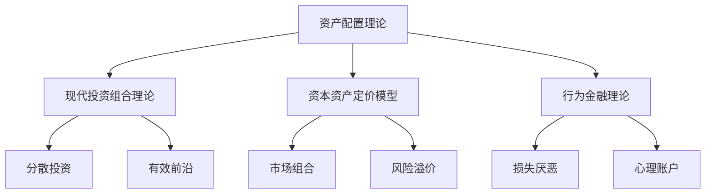

# 资产配置策略

## 概述

资产配置（Asset Allocation）是指在不同资产类别之间分配投资资金的过程，是决定投资组合长期表现的最重要因素。研究表明，资产配置决定了 90% 以上的投资组合收益变化。通过指数投资工具实施资产配置，可以以低成本、高效率的方式构建多元化投资组合。

**学习目标**：
- 理解资产配置的重要性和理论基础
- 掌握主要资产类别的特点和相关性
- 学会根据个人情况确定资产配置
- 了解经典资产配置模型和策略
- 掌握使用 ETF 实施资产配置的方法

**为什么重要**：
资产配置是投资成功的基石。正确的资产配置可以在控制风险的同时获取合理收益，而错误的配置可能导致巨大损失。对于长期投资者而言，资产配置比选股和择时更为重要。

## 资产配置的理论基础

### 现代投资组合理论（MPT）

**核心思想**：
- 投资者应关注组合整体，而非单个资产
- 通过分散投资降低风险
- 在给定风险水平下最大化收益
- 在给定收益水平下最小化风险

**有效前沿**：
```
有效前沿上的组合：
- 给定风险下收益最高
- 给定收益下风险最低
- 理性投资者只选择有效前沿上的组合
```

**最优组合**：
- 取决于投资者的风险偏好
- 风险厌恶程度越高，股票配置越低
- 风险承受能力越强，股票配置越高



### 资产配置的重要性

**Brinson 研究（1986）**：
- 资产配置解释 93.6% 的收益变化
- 选股解释 4.6%
- 择时解释 1.8%

**结论**：
- 资产配置是最重要的投资决策
- 选股和择时相对不重要
- 应将精力集中在资产配置上

### 分散投资的好处

**降低风险**：
- 非系统性风险可以通过分散消除
- 持有 20-30 只股票可消除大部分非系统性风险
- 跨资产类别分散更有效

**提高风险调整后收益**：
- 相同风险下获得更高收益
- 相同收益下承担更低风险
- 夏普比率提高

**平滑收益曲线**：
- 减少波动
- 降低最大回撤
- 改善投资体验

## 主要资产类别

### 1. 股票（Equities）

**特点**：
- 高预期收益：长期年化 8-10%
- 高波动性：年波动率 15-20%
- 流动性好
- 通胀对冲

**细分类别**：
- 国内 vs 国际
- 大盘 vs 中小盘
- 价值 vs 成长
- 发达市场 vs 新兴市场

**ETF 工具**：
- 美国股票：VTI、SPY、IVV
- 国际股票：VXUS、EFA、VEA
- 新兴市场：VWO、EEM、IEMG

### 2. 债券（Fixed Income）

**特点**：
- 中等预期收益：长期年化 3-5%
- 低波动性：年波动率 3-6%
- 提供稳定现金流
- 与股票负相关或低相关

**细分类别**：
- 政府债券 vs 公司债券
- 投资级 vs 高收益
- 短期 vs 长期
- 国内 vs 国际

**ETF 工具**：
- 综合债券：AGG、BND、BNDX
- 国债：TLT、IEF、SHY
- 公司债：LQD、HYG、JNK

### 3. 房地产（Real Estate）

**特点**：
- 中高预期收益：长期年化 6-8%
- 中等波动性：年波动率 10-15%
- 通胀对冲
- 提供租金收入

**投资方式**：
- REITs（房地产投资信托）
- 房地产 ETF

**ETF 工具**：
- VNQ（美国房地产）
- VNQI（国际房地产）
- IYR（房地产）

### 4. 商品（Commodities）

**特点**：
- 中等预期收益：长期年化 4-6%
- 高波动性：年波动率 15-25%
- 通胀对冲
- 与股票低相关

**细分类别**：
- 贵金属：黄金、白银
- 能源：石油、天然气
- 农产品：小麦、玉米
- 工业金属：铜、铝

**ETF 工具**：
- GLD（黄金）
- SLV（白银）
- DBC（商品综合）
- USO（石油）

### 5. 现金及等价物（Cash）

**特点**：
- 低预期收益：年化 1-3%
- 极低波动性
- 高流动性
- 保值功能

**投资工具**：
- 货币市场基金
- 短期国债
- 银行存款

**ETF 工具**：
- SHV（短期国债）
- BIL（1-3 月国债）

### 资产类别相关性

**历史相关性矩阵**（1990-2020）：

|  | 美国股票 | 国际股票 | 债券 | 房地产 | 商品 |
|---|---------|---------|------|--------|------|
| 美国股票 | 1.00 | 0.85 | -0.05 | 0.65 | 0.25 |
| 国际股票 | 0.85 | 1.00 | 0.10 | 0.60 | 0.35 |
| 债券 | -0.05 | 0.10 | 1.00 | 0.15 | -0.10 |
| 房地产 | 0.65 | 0.60 | 0.15 | 1.00 | 0.30 |
| 商品 | 0.25 | 0.35 | -0.10 | 0.30 | 1.00 |

**关键观察**：
- 股票之间高度相关（0.85）
- 债券与股票负相关或低相关
- 商品与股票低相关
- 分散投资可降低组合风险

## 确定资产配置

### 影响因素

**1. 投资目标**：
- 退休储蓄
- 子女教育
- 购房首付
- 财富增值

**2. 投资期限**：
- 短期（< 3 年）：保守配置
- 中期（3-10 年）：平衡配置
- 长期（> 10 年）：激进配置

**3. 风险承受能力**：
- 财务能力：收入、资产、负债
- 心理承受能力：对波动的容忍度
- 投资经验：知识和经验水平

**4. 年龄和生命周期**：
- 年轻：高股票配置
- 中年：平衡配置
- 临近退休：保守配置
- 退休后：更保守配置

**5. 收入稳定性**：
- 稳定收入：可承担更高风险
- 不稳定收入：需要更保守

**6. 其他资产**：
- 房产
- 养老金
- 社保
- 人力资本

### 风险承受能力评估

**财务风险承受能力**：
```
评分标准：
- 年龄：< 30 岁（5分）、30-40（4分）、40-50（3分）、50-60（2分）、> 60（1分）
- 投资期限：> 20 年（5分）、10-20 年（4分）、5-10 年（3分）、3-5 年（2分）、< 3 年（1分）
- 收入稳定性：非常稳定（5分）、稳定（4分）、一般（3分）、不稳定（2分）、很不稳定（1分）
- 储蓄率：> 30%（5分）、20-30%（4分）、10-20%（3分）、5-10%（2分）、< 5%（1分）
- 应急基金：> 12 个月（5分）、6-12 个月（4分）、3-6 个月（3分）、1-3 个月（2分）、< 1 个月（1分）

总分：
- 20-25 分：高风险承受能力（80-100% 股票）
- 15-19 分：中高风险承受能力（60-80% 股票）
- 10-14 分：中等风险承受能力（40-60% 股票）
- 5-9 分：低风险承受能力（20-40% 股票）
```

**心理风险承受能力**：
```
问题：
1. 如果投资组合一年内下跌 20%，你会：
   a) 恐慌卖出（1分）
   b) 感到不安但持有（2分）
   c) 保持冷静（3分）
   d) 加仓买入（4分）

2. 你更关注：
   a) 避免损失（1分）
   b) 稳定收益（2分）
   c) 平衡风险收益（3分）
   d) 最大化收益（4分）

3. 你的投资经验：
   a) 无经验（1分）
   b) 少量经验（2分）
   c) 一定经验（3分）
   d) 丰富经验（4分）

总分：
- 10-12 分：高风险承受能力
- 7-9 分：中等风险承受能力
- 4-6 分：低风险承受能力
- 3 分：极低风险承受能力
```

### 生命周期资产配置

**目标日期法则**：
```
股票配置 % = 110 - 年龄
或
股票配置 % = 120 - 年龄（考虑寿命延长）
```

**示例**：
- 30 岁：90% 股票、10% 债券
- 40 岁：80% 股票、20% 债券
- 50 岁：70% 股票、30% 债券
- 60 岁：60% 股票、40% 债券
- 70 岁：50% 股票、50% 债券

**滑翔路径（Glide Path）**：
- 随年龄增长逐步降低股票配置
- 平滑过渡
- 降低退休前后的风险


## 经典资产配置模型

### 1. 60/40 组合

**配置**：
- 60% 股票
- 40% 债券

**特点**：
- 经典平衡组合
- 风险适中
- 历史表现稳健

**历史表现（1926-2020）**：
- 年化收益：8.7%
- 年波动率：11.5%
- 最大回撤：-32%（2008）
- 夏普比率：0.50

**适用人群**：
- 中等风险承受能力
- 退休前 10-20 年
- 平衡型投资者

**ETF 实施**：
- 60% VTI（美国股票）
- 40% BND（美国债券）

### 2. 全球分散组合

**配置**：
- 40% 美国股票
- 30% 国际股票
- 20% 债券
- 10% 房地产/商品

**特点**：
- 全球分散
- 多资产类别
- 降低单一市场风险

**ETF 实施**：
- 40% VTI（美国股票）
- 30% VXUS（国际股票）
- 20% BND（债券）
- 5% VNQ（房地产）
- 5% GLD（黄金）

### 3. 三基金组合（Bogle 组合）

**配置**：
- 40% 美国股票
- 20% 国际股票
- 40% 债券

**特点**：
- 简单高效
- 低成本
- 全球分散

**ETF 实施**：
- 40% VTI（美国股票）
- 20% VXUS（国际股票）
- 40% BND（债券）

**优势**：
- 只需 3 只 ETF
- 年费用 < 0.10%
- 易于管理

### 4. 永久组合（Permanent Portfolio）

**配置**：
- 25% 股票
- 25% 长期国债
- 25% 黄金
- 25% 现金

**特点**：
- 极度分散
- 全天候策略
- 低波动

**历史表现（1972-2020）**：
- 年化收益：8.6%
- 年波动率：7.9%
- 最大回撤：-13%
- 夏普比率：0.65

**ETF 实施**：
- 25% VTI（股票）
- 25% TLT（长期国债）
- 25% GLD（黄金）
- 25% SHV（短期国债）

### 5. 全天候组合（All Weather）

**配置**（Ray Dalio）：
- 30% 股票
- 40% 长期国债
- 15% 中期国债
- 7.5% 黄金
- 7.5% 商品

**特点**：
- 风险平价
- 适应各种经济环境
- 低波动

**ETF 实施**：
- 30% VTI（股票）
- 40% TLT（长期国债）
- 15% IEF（中期国债）
- 7.5% GLD（黄金）
- 7.5% DBC（商品）

### 6. 耶鲁捐赠基金模型

**配置**（David Swensen）：
- 30% 美国股票
- 15% 国际发达市场股票
- 5% 新兴市场股票
- 20% 房地产
- 15% 国债
- 15% TIPS（通胀保护债券）

**特点**：
- 机构投资者模型
- 高度分散
- 包含另类资产

**ETF 实施**：
- 30% VTI（美国股票）
- 15% VEA（国际发达）
- 5% VWO（新兴市场）
- 20% VNQ（房地产）
- 15% IEF（国债）
- 15% TIP（TIPS）

## 资产配置实施

### 初始建仓

**步骤**：
1. 确定目标配置
2. 选择合适的 ETF
3. 计算每只 ETF 的份额
4. 分批建仓（降低择时风险）
5. 记录成本和份额

**分批建仓策略**：
- 一次性投入：市场择时风险
- 分 3-6 个月建仓：平滑风险
- 定期定额：最简单方法

### 持续投入

**定投策略**：
- 每月固定金额
- 按目标配置比例分配
- 自动化执行

**示例**：
```
月投入：10000 元
目标配置：60% 股票、40% 债券

每月投入：
- 股票 ETF：6000 元
- 债券 ETF：4000 元
```

### 再平衡

**目的**：
- 维持目标配置
- 控制风险暴露
- 自动低买高卖

**再平衡方法**：
1. 时间触发：定期再平衡
2. 阈值触发：偏离超过阈值
3. 混合方法：结合两者

**详见**：rebalancing.md

### 税收优化

**账户选择**：
- 应税账户：税收效率高的 ETF
  - 股票 ETF（长期持有）
  - 市政债券 ETF
- 退休账户：任何 ETF
  - 债券 ETF
  - 高换手 ETF
  - REITs

**税收损失收割**：
- 卖出亏损头寸
- 实现税收损失
- 买入类似 ETF
- 抵消资本利得

## 不同人生阶段的资产配置

### 年轻阶段（20-35 岁）

**特点**：
- 投资期限长
- 风险承受能力高
- 人力资本丰富
- 财务资本少

**建议配置**：
- 80-90% 股票
- 10-20% 债券
- 重点：积累资本

**示例组合**：
- 50% VTI（美国股票）
- 30% VXUS（国际股票）
- 10% VWO（新兴市场）
- 10% BND（债券）

### 中年阶段（35-50 岁）

**特点**：
- 收入高峰期
- 家庭责任重
- 需要平衡风险收益
- 开始为退休储蓄

**建议配置**：
- 60-80% 股票
- 20-40% 债券
- 重点：稳健增长

**示例组合**：
- 40% VTI（美国股票）
- 20% VXUS（国际股票）
- 10% VWO（新兴市场）
- 25% BND（债券）
- 5% VNQ（房地产）

### 临近退休（50-65 岁）

**特点**：
- 投资期限缩短
- 风险承受能力降低
- 需要保护资本
- 开始规划退休收入

**建议配置**：
- 40-60% 股票
- 40-60% 债券
- 重点：资本保护

**示例组合**：
- 30% VTI（美国股票）
- 15% VXUS（国际股票）
- 45% BND（债券）
- 10% TIP（TIPS）

### 退休阶段（65+ 岁）

**特点**：
- 依赖投资收入
- 需要稳定现金流
- 风险承受能力低
- 需要考虑遗产规划

**建议配置**：
- 30-50% 股票
- 50-70% 债券
- 重点：收入和保值

**示例组合**：
- 25% VTI（美国股票）
- 10% VXUS（国际股票）
- 50% BND（债券）
- 10% TIP（TIPS）
- 5% SHV（现金）

## 常见误区

### 误区 1：资产配置一成不变

**真相**：
- 需要随生命周期调整
- 需要根据市场环境微调
- 需要定期再平衡
- 需要考虑个人情况变化

### 误区 2：只关注收益不关注风险

**真相**：
- 风险和收益是一体两面
- 高收益必然伴随高风险
- 应关注风险调整后收益
- 夏普比率比收益率更重要

### 误区 3：过度分散

**真相**：
- 分散有边际递减效应
- 20-30 只股票足够分散
- 3-5 个资产类别足够
- 过度分散增加成本和复杂度

### 误区 4：忽视相关性

**真相**：
- 相关性决定分散效果
- 高相关资产无法有效分散
- 需要选择低相关资产
- 危机时相关性会上升

### 误区 5：频繁调整配置

**真相**：
- 频繁调整增加成本
- 增加税收负担
- 可能错失市场机会
- 应保持纪律性

## 延伸阅读

### 经典书籍

1. **《资产配置》** - David M. Darst
   - 资产配置的全面指南

2. **《不落俗套的成功》** - David Swensen
   - 耶鲁捐赠基金的资产配置实践

3. **《投资组合管理》** - Harry Markowitz
   - 现代投资组合理论的奠基之作

### 学术论文

1. **Brinson, G. P., Hood, L. R., & Beebower, G. L. (1986)** - "Determinants of Portfolio Performance"
   - 资产配置重要性的经典研究

2. **Ibbotson, R. G., & Kaplan, P. D. (2000)** - "Does Asset Allocation Policy Explain 40, 90, or 100 Percent of Performance?"
   - 资产配置对业绩的影响

## 参考文献

1. Brinson, G. P., Hood, L. R., & Beebower, G. L. (1986). Determinants of portfolio performance. *Financial Analysts Journal*, 42(4), 39-44.

2. Markowitz, H. (1952). Portfolio selection. *The Journal of Finance*, 7(1), 77-91.

3. Swensen, D. F. (2005). *Unconventional Success: A Fundamental Approach to Personal Investment*. Free Press.

4. Ibbotson, R. G., & Kaplan, P. D. (2000). Does asset allocation policy explain 40, 90, or 100 percent of performance? *Financial Analysts Journal*, 56(1), 26-33.

5. Bernstein, W. J. (2010). *The Investor's Manifesto*. John Wiley & Sons.

6. Ferri, R. A. (2010). *All About Asset Allocation* (2nd ed.). McGraw-Hill Education.

7. Darst, D. M. (2008). *The Art of Asset Allocation* (2nd ed.). McGraw-Hill Education.

8. Bodie, Z., Kane, A., & Marcus, A. J. (2018). *Investments* (11th ed.). McGraw-Hill Education.

9. Merton, R. C. (1969). Lifetime portfolio selection under uncertainty: The continuous-time case. *The Review of Economics and Statistics*, 51(3), 247-257.

10. Campbell, J. Y., & Viceira, L. M. (2002). *Strategic Asset Allocation: Portfolio Choice for Long-Term Investors*. Oxford University Press.
