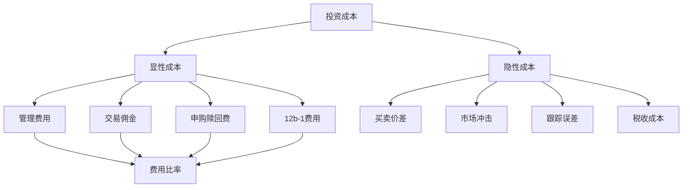
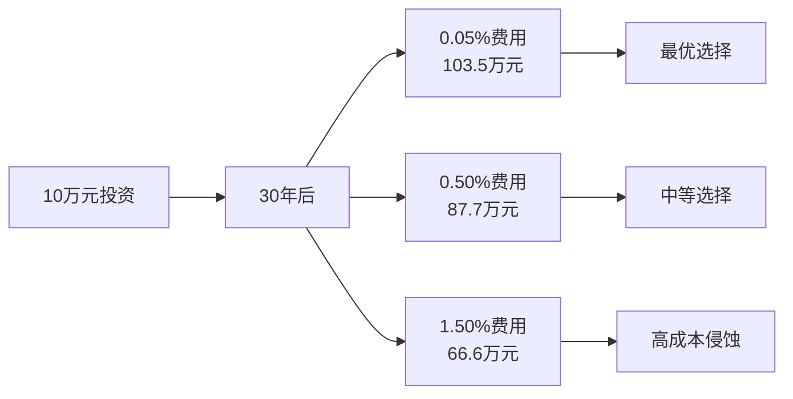

# 成本分析

## 概述

投资成本是影响长期投资收益的关键因素之一。即使看似微小的费用差异，经过多年复利累积，也会对最终财富产生巨大影响。指数投资的核心优势之一就是低成本，但投资者仍需全面了解各类成本的构成、影响和优化方法，才能真正实现成本最小化，收益最大化。

**学习目标**：
- 理解投资成本的各个组成部分
- 掌握费用比率（Expense Ratio）的计算和比较
- 认识隐性成本对投资收益的影响
- 学会评估和选择低成本投资产品
- 了解成本的长期复利效应

**为什么重要**：
约翰·博格（John Bogle）曾说："在投资中，你得到的是你不付出的。"成本是投资者唯一可以完全控制的因素。通过最小化成本，投资者可以确保获得更多的市场收益。研究表明，低成本基金的长期表现显著优于高成本基金，成本分析是成功投资的基础。

## 投资成本的构成

### 显性成本

**1. 管理费用（Management Fee）**：
- 定义：基金公司收取的管理服务费用
- 范围：0.03% - 2.00% 年费率
- 指数基金：0.03% - 0.20%
- 主动基金：0.50% - 2.00%
- 计算：按日计提，从基金资产中扣除

**2. 费用比率（Expense Ratio）**：
- 定义：基金运营的总年度费用占资产的比例
- 包含：管理费、托管费、审计费、法律费用等
- 指数基金：0.03% - 0.25%
- 主动基金：0.50% - 2.50%
- 重要性：最重要的成本指标

**3. 交易佣金（Trading Commission）**：
- 传统券商：5-10 美元/笔
- 折扣券商：0-5 美元/笔
- 零佣金券商：0 美元（Robinhood、Webull、富途等）
- 趋势：越来越多券商提供零佣金交易

**4. 申购赎回费（Load Fees）**：
- 前端费用（Front-end Load）：买入时收取，0-5.75%
- 后端费用（Back-end Load）：卖出时收取，0-5%
- 指数基金：通常无申购赎回费
- 主动基金：部分收取

**5. 12b-1 费用**：
- 定义：用于营销和分销的费用
- 范围：0-1.00% 年费率
- 指数基金：通常为 0
- 主动基金：0.25-1.00%



### 隐性成本

**1. 买卖价差（Bid-Ask Spread）**：
- 定义：买入价和卖出价之间的差额
- 流动性好的 ETF：0.01-0.05%
- 流动性差的 ETF：0.10-0.50%
- 影响因素：交易量、市场波动、做市商
- 优化：选择流动性好的 ETF

**2. 市场冲击成本（Market Impact）**：
- 定义：大额交易对市场价格的影响
- 小额交易：影响可忽略
- 大额交易：0.10-1.00%
- 优化：分批交易、使用限价单

**3. 跟踪误差（Tracking Error）**：
- 定义：基金收益与指数收益的偏离
- 优秀指数基金：0.05-0.15% 年化
- 一般指数基金：0.15-0.50% 年化
- 原因：现金拖累、抽样误差、费用
- 重要性：影响实际收益

**4. 现金拖累（Cash Drag）**：
- 定义：基金持有现金导致的收益损失
- 原因：应对赎回、等待投资时机
- 影响：0.05-0.20% 年化
- 指数基金：现金比例通常很低

**5. 证券借贷收入**：
- 定义：基金出借证券获得的收入
- 收益：0.05-0.30% 年化
- 分配：部分返还给投资者
- 效果：降低净费用

## 费用比率详解

### 费用比率的计算

**公式**：
```
费用比率 = 年度总费用 / 平均净资产
```

**示例**：
- 基金平均净资产：10 亿美元
- 年度总费用：200 万美元
- 费用比率：200万 / 10亿 = 0.20%

**包含的费用**：
- 管理费
- 托管费
- 审计费
- 法律费用
- 董事会费用
- 其他运营费用

**不包含的费用**：
- 交易佣金
- 买卖价差
- 申购赎回费
- 税收

### 不同产品的费用对比

**指数共同基金**：
- Vanguard 500 Index Fund (VFIAX)：0.04%
- Fidelity 500 Index Fund (FXAIX)：0.015%
- Schwab S&P 500 Index Fund (SWPPX)：0.02%

**指数 ETF**：
- SPDR S&P 500 ETF (SPY)：0.0945%
- iShares Core S&P 500 ETF (IVV)：0.03%
- Vanguard S&P 500 ETF (VOO)：0.03%

**主动共同基金**：
- 平均费用比率：0.50-1.50%
- 高端主动基金：1.00-2.50%
- 对冲基金：1.00-2.00% + 20% 业绩提成

**费用趋势**：
- 2000年：平均指数基金费用 0.27%
- 2010年：平均指数基金费用 0.15%
- 2020年：平均指数基金费用 0.06%
- 2024年：平均指数基金费用 0.05%

**费用战争**：
- Vanguard、Fidelity、Schwab 竞相降费
- 部分基金费用降至 0.015%
- 零费用指数基金出现（Fidelity ZERO 系列）

### 费用对收益的影响

**短期影响（1年）**：
假设投资 10 万元，市场收益 8%

- 费用 0.05%：收益 7,950 元
- 费用 0.50%：收益 7,500 元
- 费用 1.50%：收益 6,500 元

差异看似不大，但长期累积效果惊人。

**长期影响（30年）**：
假设初始投资 10 万元，年化收益 8%

**费用 0.05%（实际收益 7.95%）**：
- 10 年后：21.8 万元
- 20 年后：47.5 万元
- 30 年后：103.5 万元

**费用 0.50%（实际收益 7.50%）**：
- 10 年后：20.6 万元
- 20 年后：42.5 万元
- 30 年后：87.7 万元

**费用 1.50%（实际收益 6.50%）**：
- 10 年后：18.8 万元
- 20 年后：35.4 万元
- 30 年后：66.6 万元

**30年财富对比**：
- 0.05% vs 0.50%：多 18% 财富（15.8 万元）
- 0.05% vs 1.50%：多 55% 财富（36.9 万元）
- 0.50% vs 1.50%：多 32% 财富（21.1 万元）



### 费用的复利效应

**复利公式**：
```
最终价值 = 初始投资 × (1 + 收益率 - 费用率)^年数
```

**1% 费用的长期影响**：
- 10 年：减少 10% 财富
- 20 年：减少 22% 财富
- 30 年：减少 35% 财富
- 40 年：减少 50% 财富

**约翰·博格的计算**：
假设 40 年投资生涯，年化收益 7%：
- 0% 费用：1 美元变成 14.97 美元
- 1% 费用：1 美元变成 9.85 美元
- 2% 费用：1 美元变成 6.45 美元

**结论**：
- 2% 费用侵蚀 57% 的投资收益
- 费用是投资者的"隐形杀手"
- 最小化费用是成功投资的关键

## 交易成本分析

### 佣金成本

**传统券商**：
- 全服务券商：10-50 美元/笔
- 折扣券商：5-10 美元/笔
- 在线券商：0-7 美元/笔

**零佣金时代**：
- 2019年：美国主要券商取消股票和 ETF 交易佣金
- Robinhood、Webull、富途等：零佣金
- 中国券商：万分之2.5-3 佣金率

**佣金影响**：
假设每月交易 1 次，每次 10 美元佣金：
- 年度佣金：120 美元
- 10 万元投资：0.12% 年度成本
- 30 年累积：显著影响

**优化策略**：
- 选择零佣金券商
- 减少交易频率
- 批量交易
- 使用免佣金 ETF 列表

### 买卖价差成本

**价差定义**：
- 买入价（Ask）：投资者买入时的价格
- 卖出价（Bid）：投资者卖出时的价格
- 价差：Ask - Bid

**价差示例**：
- SPY（S&P 500 ETF）：
  - 买入价：450.02
  - 卖出价：450.01
  - 价差：0.01 美元（0.002%）

- 小型 ETF：
  - 买入价：25.15
  - 卖出价：25.05
  - 价差：0.10 美元（0.40%）

**影响因素**：
- 交易量：交易量大，价差小
- 波动性：波动大，价差大
- 做市商：做市商多，价差小
- 市场环境：危机时期价差扩大

**价差成本**：
- 每次交易：支付半个价差
- 买入卖出：支付完整价差
- 频繁交易：价差成本累积

**优化策略**：
- 选择流动性好的 ETF（日交易量 > 100万股）
- 使用限价单
- 避免市价单
- 在交易活跃时段交易

### 市场冲击成本

**定义**：
大额交易对市场价格的影响

**影响程度**：
- 小额交易（< 1万股）：影响可忽略
- 中等交易（1-10万股）：0.05-0.20%
- 大额交易（> 10万股）：0.20-1.00%

**影响因素**：
- 交易规模
- 市场流动性
- 交易速度
- 市场波动

**优化策略**：
- 分批交易
- 使用算法交易
- 选择流动性好的时段
- 使用限价单

### 总交易成本

**单次交易成本**：
```
总成本 = 佣金 + 买卖价差 + 市场冲击
```

**示例**：
- 零佣金券商：0
- SPY 价差：0.002%
- 小额交易冲击：0.01%
- 总成本：0.012%

**年度交易成本**：
假设每季度再平衡，每次交易 4 个 ETF：
- 单次成本：0.012% × 4 = 0.048%
- 年度成本：0.048% × 4 = 0.192%

**长期影响**：
- 10 年：减少 2% 财富
- 20 年：减少 4% 财富
- 30 年：减少 6% 财富

## 税收成本

### 资本利得税

**税率**：
- 短期资本利得（持有 < 1年）：按普通收入税率（10-37%）
- 长期资本利得（持有 ≥ 1年）：0%、15% 或 20%

**税率档次（2024年）**：
- 0% 税率：单身收入 < $44,625，夫妻 < $89,250
- 15% 税率：单身 $44,625-$492,300，夫妻 $89,250-$553,850
- 20% 税率：单身 > $492,300，夫妻 > $553,850

**税收影响**：
假设年化收益 8%，长期资本利得税率 15%：
- 税前收益：8.00%
- 税后收益：6.80%
- 税收拖累：1.20%

### 分红税

**分红税率**：
- 合格分红（Qualified Dividends）：按长期资本利得税率
- 普通分红（Ordinary Dividends）：按普通收入税率

**指数基金分红**：
- S&P 500 指数：分红率约 1.5-2.0%
- 高分红指数：分红率 3-5%
- 成长股指数：分红率 < 1%

**税收影响**：
假设分红率 2%，税率 15%：
- 年度分红税：2% × 15% = 0.30%
- 长期累积：显著影响

### 税收效率对比

**主动基金**：
- 高换手率：50-100% 年换手
- 频繁实现资本利得
- 短期资本利得多
- 税收拖累：0.5-1.5% 年化

**指数基金**：
- 低换手率：5-20% 年换手
- 长期持有
- 延迟实现资本利得
- 税收拖累：0.1-0.3% 年化

**ETF 的税收优势**：
- 实物申赎机制
- 避免实现资本利得
- 税收效率最高
- 税收拖累：0.05-0.15% 年化

### 税收优化策略

**1. 账户分层**：
- 退休账户（401k、IRA）：税收递延或免税
- 应税账户：选择税收效率高的产品

**2. 资产配置优化**：
- 退休账户：高分红资产、债券、REITs
- 应税账户：低分红股票、指数基金、ETF

**3. 税收损失收割（Tax-Loss Harvesting）**：
- 卖出亏损资产
- 实现税收损失
- 抵消资本利得
- 降低税负

**4. 长期持有**：
- 持有超过 1 年
- 享受长期资本利得税率
- 大幅降低税负

**5. 捐赠增值资产**：
- 捐赠长期持有的增值资产
- 避免资本利得税
- 获得慈善扣除

## 成本优化策略

### 选择低成本产品

**指数基金选择标准**：
1. 费用比率 < 0.20%
2. 跟踪误差 < 0.15%
3. 规模 > 10 亿美元
4. 流动性好
5. 税收效率高

**推荐低成本产品**：

**美国股票**：
- Vanguard Total Stock Market ETF (VTI)：0.03%
- Fidelity ZERO Total Market Index Fund (FZROX)：0%
- Schwab U.S. Broad Market ETF (SCHB)：0.03%

**国际股票**：
- Vanguard Total International Stock ETF (VXUS)：0.07%
- iShares Core MSCI Total International Stock ETF (IXUS)：0.07%
- Schwab International Equity ETF (SCHF)：0.06%

**债券**：
- Vanguard Total Bond Market ETF (BND)：0.03%
- iShares Core U.S. Aggregate Bond ETF (AGG)：0.03%
- Schwab U.S. Aggregate Bond ETF (SCHZ)：0.04%

### 降低交易频率

**策略**：
- 年度再平衡代替季度再平衡
- 使用阈值触发代替时间触发
- 利用现金流再平衡
- 批量交易

**效果**：
- 减少交易次数 50-75%
- 降低交易成本 50-75%
- 提高税收效率
- 简化管理

### 使用零佣金券商

**推荐券商**：
- Fidelity：零佣金 + 优质服务
- Schwab：零佣金 + 丰富产品
- Vanguard：低成本基金 + 零佣金
- Robinhood：零佣金 + 简单界面

**注意事项**：
- 检查其他费用（账户费、转账费）
- 确认免佣金产品范围
- 评估服务质量
- 考虑平台稳定性

### 税收优化

**应税账户策略**：
- 选择 ETF 而非共同基金
- 选择低分红指数
- 长期持有
- 税收损失收割

**退休账户策略**：
- 最大化退休账户贡献
- 在退休账户持有高税收资产
- 利用税收递延优势

**效果**：
- 降低税收拖累 0.5-1.0%
- 长期显著提升收益
- 30 年多积累 15-30% 财富

## 成本对比案例

### 案例 1：指数基金 vs 主动基金

**假设**：
- 初始投资：10 万元
- 投资期限：30 年
- 市场收益：8% 年化

**指数基金**：
- 费用比率：0.05%
- 交易成本：0.10%
- 税收拖累：0.15%
- 总成本：0.30%
- 实际收益：7.70%
- 30 年后：96.8 万元

**主动基金**：
- 费用比率：1.00%
- 交易成本：0.50%
- 税收拖累：1.00%
- 总成本：2.50%
- 实际收益：5.50%
- 30 年后：52.5 万元

**差异**：
- 绝对差异：44.3 万元
- 相对差异：84% 更多
- 成本侵蚀：主动基金损失 47% 潜在收益

### 案例 2：高费用 ETF vs 低费用 ETF

**假设**：
- 初始投资：10 万元
- 投资期限：20 年
- 市场收益：8% 年化

**低费用 ETF（VOO）**：
- 费用比率：0.03%
- 实际收益：7.97%
- 20 年后：47.2 万元

**高费用 ETF**：
- 费用比率：0.50%
- 实际收益：7.50%
- 20 年后：42.5 万元

**差异**：
- 绝对差异：4.7 万元
- 相对差异：11% 更多
- 0.47% 费用差异导致 11% 财富差异

### 案例 3：频繁交易 vs 长期持有

**假设**：
- 初始投资：10 万元
- 投资期限：10 年
- 市场收益：8% 年化

**长期持有**：
- 年度交易：1 次
- 交易成本：0.05%
- 税收拖累：0.20%
- 总成本：0.25%
- 实际收益：7.75%
- 10 年后：21.2 万元

**频繁交易**：
- 年度交易：12 次
- 交易成本：0.60%
- 税收拖累：1.20%
- 总成本：1.80%
- 实际收益：6.20%
- 10 年后：18.3 万元

**差异**：
- 绝对差异：2.9 万元
- 相对差异：16% 更多
- 频繁交易侵蚀 16% 收益

## 常见误区

### 误区 1：费用差异很小，不重要

**真相**：
- 短期看似不大
- 长期复利效应巨大
- 0.5% 费用差异 = 30年 20% 财富差异
- 成本是唯一可控因素

### 误区 2：主动基金值得更高费用

**真相**：
- 85% 主动基金跑输指数
- 高费用不等于高收益
- 费用是确定的，超额收益不确定
- 低成本是成功的关键

### 误区 3：零费用基金是最好的

**真相**：
- 需要考虑总成本
- 跟踪误差可能更大
- 流动性可能较差
- 综合评估更重要

### 误区 4：ETF 总是比共同基金便宜

**真相**：
- 部分共同基金费用更低
- 需要考虑交易成本
- 税收效率 ETF 更优
- 具体情况具体分析

### 误区 5：税收成本可以忽略

**真相**：
- 应税账户税收影响巨大
- 0.5-1.5% 年度税收拖累
- 30 年累积效果显著
- 税收优化很重要

## 延伸阅读

### 经典书籍

1. **《共同基金常识》（The Little Book of Common Sense Investing）** - John C. Bogle
   - 成本分析的经典之作
   - 博格的成本哲学

2. **《投资的四大支柱》（The Four Pillars of Investing）** - William J. Bernstein
   - 成本是四大支柱之一
   - 深入分析成本影响

3. **《投资者的敌人》（The Investor's Manifesto）** - William J. Bernstein
   - 成本是投资者的主要敌人
   - 最小化成本的策略

### 研究报告

1. **Bogle, J. C. (2014)** - "The Arithmetic of 'All-In' Investment Expenses"
   - 全面分析投资费用
   - 量化成本影响

2. **French, K. R. (2008)** - "The Cost of Active Investing"
   - 主动投资的成本
   - 学术研究

3. **Morningstar (Annual)** - "Fee Study"
   - 年度费用研究
   - 行业趋势

### 在线资源

1. **Morningstar Fee Analyzer** - 费用分析工具
2. **Personal Capital Fee Analyzer** - 投资组合费用分析
3. **Vanguard Cost Matters** - 成本重要性研究
4. **Bogleheads Cost Matters** - 成本分析指南

## 参考文献

1. Bogle, J. C. (2017). *The Little Book of Common Sense Investing* (10th Anniversary ed.). John Wiley & Sons.

2. Bogle, J. C. (2014). The arithmetic of 'all-in' investment expenses. *Financial Analysts Journal*, 70(1), 13-21.

3. French, K. R. (2008). The cost of active investing. *The Journal of Finance*, 63(4), 1537-1573.

4. Bernstein, W. J. (2010). *The Investor's Manifesto*. John Wiley & Sons.

5. Carhart, M. M. (1997). On persistence in mutual fund performance. *The Journal of Finance*, 52(1), 57-82.

6. Cremers, M., & Petajisto, A. (2009). How active is your fund manager? A new measure that predicts performance. *The Review of Financial Studies*, 22(9), 3329-3365.

7. Gruber, M. J. (1996). Another puzzle: The growth in actively managed mutual funds. *The Journal of Finance*, 51(3), 783-810.

8. Malkiel, B. G. (2019). *A Random Walk Down Wall Street* (12th ed.). W. W. Norton & Company.

9. Sharpe, W. F. (1991). The arithmetic of active management. *Financial Analysts Journal*, 47(1), 7-9.

10. Swensen, D. F. (2005). *Unconventional Success: A Fundamental Approach to Personal Investment*. Free Press.
