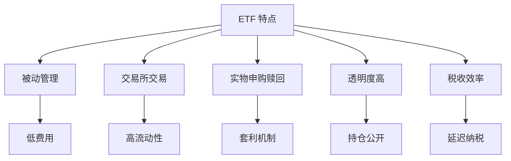

# ETF 投资指南

## 概述

交易所交易基金（Exchange-Traded Fund, ETF）是一种在证券交易所上市交易的投资基金，结合了开放式基金和封闭式基金的优点。ETF 通常追踪特定指数，为投资者提供了一种低成本、高流动性、透明度高的投资工具。

**学习目标**：
- 理解 ETF 的定义、结构和运作机制
- 掌握不同类型 ETF 的特点和应用场景
- 学会评估和选择优质 ETF 产品
- 了解 ETF 的交易策略和技巧
- 认识 ETF 投资的风险和注意事项

**为什么重要**：
ETF 已成为现代投资组合的核心工具，全球 ETF 资产规模超过 10 万亿美元。对于个人投资者而言，ETF 提供了以前只有机构投资者才能获得的投资机会和效率。理解 ETF 的运作和选择方法，是构建高效投资组合的关键。

## ETF 基础知识

### ETF 的定义和特点

**定义**：
ETF 是一种在证券交易所上市交易的开放式投资基金，其份额可以像股票一样在二级市场买卖。

**核心特点**：

**1. 被动管理**：
- 大多数 ETF 追踪指数
- 透明的投资策略
- 低管理费用

**2. 交易所交易**：
- 实时交易
- 价格透明
- 流动性好

**3. 实物申购赎回**：
- 授权参与者（AP）机制
- 一篮子股票换取 ETF 份额
- 套利机制保证价格接近净值

**4. 透明度高**：
- 每日公布持仓
- 实时净值（iNAV）
- 规则明确

**5. 税收效率**：
- 实物申购赎回减少资本利得
- 低换手率
- 延迟纳税



### ETF 与其他投资工具对比

**ETF vs 开放式基金**：

| 特征 | ETF | 开放式基金 |
|------|-----|------------|
| 交易方式 | 交易所实时交易 | 基金公司申购赎回 |
| 交易价格 | 市场价格 | 净值 |
| 交易时间 | 交易时段内随时 | 每日一次 |
| 最低投资 | 1 份（几十到几百元） | 通常 1000 元起 |
| 费用 | 低（0.03-0.50%） | 较高（0.5-2.0%） |
| 透明度 | 每日公布持仓 | 季度公布 |
| 税收效率 | 高 | 较低 |

**ETF vs 封闭式基金**：

| 特征 | ETF | 封闭式基金 |
|------|-----|------------|
| 份额变化 | 可变（申购赎回） | 固定 |
| 折溢价 | 很小（套利机制） | 可能较大 |
| 流动性 | 通常较好 | 可能较差 |
| 管理方式 | 多为被动 | 多为主动 |

**ETF vs 股票**：

| 特征 | ETF | 股票 |
|------|-----|------|
| 分散度 | 高（一篮子股票） | 低（单一公司） |
| 风险 | 系统性风险 | 个股风险 |
| 研究难度 | 低 | 高 |
| 股息 | 定期分配 | 不确定 |

### ETF 的运作机制

**一级市场（申购赎回）**：
- 授权参与者（AP）：大型机构
- 最小申购单位：通常 5-10 万份
- 实物交换：一篮子股票  ETF 份额
- 套利机制：保证价格接近净值

**二级市场（交易）**：
- 普通投资者参与
- 像股票一样买卖
- 实时价格
- 流动性由做市商提供

**套利机制**：
```
如果 ETF 价格 > 净值：
  AP 买入一篮子股票  申购 ETF  在市场卖出 ETF  获利

如果 ETF 价格 < 净值：
  AP 买入 ETF  赎回获得一篮子股票  卖出股票  获利
```

这种套利机制确保 ETF 价格紧密跟踪净值。

## ETF 类型

### 按资产类别分类

**1. 股票 ETF**：
- 追踪股票指数
- 最常见的 ETF 类型
- 例如：SPY（S&P 500）、QQQ（NASDAQ-100）

**2. 债券 ETF**：
- 追踪债券指数
- 提供固定收益暴露
- 例如：AGG（美国综合债券）、TLT（长期国债）

**3. 商品 ETF**：
- 追踪商品价格
- 黄金、石油、农产品等
- 例如：GLD（黄金）、USO（石油）

**4. 货币 ETF**：
- 追踪外汇汇率
- 货币对冲工具
- 例如：FXE（欧元）、FXY（日元）

**5. 另类 ETF**：
- 房地产（REITs）
- 私募股权
- 对冲基金策略

### 按投资策略分类

**1. 被动指数 ETF**：
- 完全复制指数
- 最低成本
- 最高透明度
- 例如：VOO（Vanguard S&P 500）

**2. Smart Beta ETF**：
- 基于因子的策略
- 价值、动量、质量等
- 费用略高于被动 ETF
- 例如：MTUM（动量）、QUAL（质量）

**3. 主动管理 ETF**：
- 基金经理主动选股
- 费用较高
- 透明度仍高于传统基金
- 例如：ARKK（ARK Innovation）

**4. 杠杆 ETF**：
- 放大指数收益（2x、3x）
- 高风险高收益
- 适合短期交易
- 例如：TQQQ（3x NASDAQ-100）

**5. 反向 ETF**：
- 与指数反向变动
- 用于对冲或做空
- 适合短期使用
- 例如：SH（反向 S&P 500）

### 按地域分类

**1. 国内市场 ETF**：
- 追踪本国指数
- 例如：SPY（美国）、510300（沪深 300）

**2. 国际发达市场 ETF**：
- 追踪发达国家指数
- 例如：EFA（EAFE）、VEA（发达市场）

**3. 新兴市场 ETF**：
- 追踪新兴国家指数
- 例如：EEM（新兴市场）、VWO（新兴市场）

**4. 单一国家 ETF**：
- 专注特定国家
- 例如：EWJ（日本）、MCHI（中国）

**5. 全球市场 ETF**：
- 覆盖全球市场
- 例如：VT（全球股票）、ACWI（全球市场）

### 按行业/主题分类

**1. 行业 ETF**：
- 科技：XLK、VGT
- 医疗：XLV、VHT
- 金融：XLF、VFH
- 能源：XLE、VDE
- 消费：XLY、XLP

**2. 主题 ETF**：
- 人工智能：BOTZ、ROBO
- 清洁能源：ICLN、TAN
- 电动汽车：DRIV、IDRV
- 云计算：SKYY、CLOU
- 生物科技：IBB、XBI

## ETF 选择标准

### 核心评估指标

**1. 费用率（Expense Ratio）**：
- 年度管理费用
- 越低越好
- 被动 ETF：0.03-0.20%
- Smart Beta：0.20-0.50%
- 主动 ETF：0.50-1.00%

**2. 跟踪误差（Tracking Error）**：
- ETF 收益与指数收益的偏离
- 越小越好
- 优秀 ETF：< 0.10%
- 可接受：0.10-0.30%
- 需警惕：> 0.30%

**3. 流动性**：
- 日均交易量
- 买卖价差
- 大型 ETF：日交易量 > 100 万份
- 买卖价差：< 0.10%

**4. 资产规模（AUM）**：
- 越大越好
- 最低要求：> 1 亿美元
- 理想规模：> 10 亿美元
- 规模过小可能被清盘

**5. 历史表现**：
- 与基准对比
- 不同市场环境下的表现
- 长期稳定性

### 详细评估清单

**基本信息**：
- [ ] ETF 名称和代码
- [ ] 发行公司
- [ ] 成立日期
- [ ] 资产规模

**投资策略**：
- [ ] 追踪指数
- [ ] 复制方法（完全/抽样/优化）
- [ ] 投资范围
- [ ] 再平衡频率

**成本分析**：
- [ ] 费用率
- [ ] 买卖价差
- [ ] 跟踪误差
- [ ] 税收效率

**流动性评估**：
- [ ] 日均交易量
- [ ] 买卖价差
- [ ] 做市商数量
- [ ] 折溢价历史

**风险评估**：
- [ ] 波动率
- [ ] 最大回撤
- [ ] Beta 值
- [ ] 集中度风险

**持仓分析**：
- [ ] 前 10 大持仓
- [ ] 行业分布
- [ ] 地域分布
- [ ] 市值分布

## ETF 交易策略

### 基本交易技巧

**1. 交易时间选择**：
- 避开开盘和收盘：波动大、价差大
- 最佳时间：开盘后 30 分钟到收盘前 30 分钟
- 流动性最好的时段

**2. 订单类型**：
- 限价单：指定价格，避免滑点
- 市价单：立即成交，可能滑点
- 止损单：风险管理
- 建议：使用限价单

**3. 买卖价差管理**：
- 查看实时买卖价差
- 价差 < 0.10% 为佳
- 大额交易分批执行
- 避免流动性差的 ETF

**4. 折溢价监控**：
- 查看 ETF 价格 vs iNAV
- 折价时买入
- 溢价时卖出
- 通常偏离 < 0.50%

### 投资策略

**1. 核心-卫星策略**：
- 核心（70-80%）：广基 ETF
  - 例如：VTI（全美股票）、VXUS（国际股票）
- 卫星（20-30%）：行业/主题 ETF
  - 例如：QQQ（科技）、XLV（医疗）

**2. 资产配置策略**：
- 股债配置：
  - 保守：40% 股票 + 60% 债券
  - 平衡：60% 股票 + 40% 债券
  - 激进：80% 股票 + 20% 债券
- 使用 ETF 实现：
  - 股票：VTI、VXUS
  - 债券：BND、BNDX

**3. 地域分散策略**：
- 美国：50%（VTI）
- 国际发达：30%（VEA）
- 新兴市场：20%（VWO）

**4. 行业轮动策略**：
- 根据经济周期调整行业配置
- 复苏期：金融、工业
- 繁荣期：科技、可选消费
- 衰退期：必需消费、医疗
- 萧条期：公用事业、债券

**5. 定投策略**：
- 定期定额投资
- 平滑市场波动
- 降低择时风险
- 适合长期投资

### 高级策略

**1. 税收损失收割**：
- 卖出亏损 ETF
- 实现税收损失
- 买入类似 ETF
- 避免洗售规则（30 天）

**2. 再平衡策略**：
- 定期恢复目标配置
- 卖出涨多的
- 买入跌多的
- 自动低买高卖

**3. 对冲策略**：
- 使用反向 ETF 对冲
- 使用期权保护
- 降低下行风险

**4. 杠杆策略**（高风险）：
- 使用杠杆 ETF 放大收益
- 仅适合短期交易
- 长期持有会有损耗
- 需要密切监控

## ETF 投资风险

### 主要风险类型

**1. 市场风险**：
- ETF 跟随市场波动
- 无法避免系统性风险
- 需要长期投资视角

**2. 跟踪误差风险**：
- ETF 可能偏离指数
- 原因：费用、交易成本、现金拖累
- 选择低跟踪误差的 ETF

**3. 流动性风险**：
- 小型 ETF 流动性差
- 买卖价差大
- 难以大额交易
- 选择大型 ETF

**4. 折溢价风险**：
- ETF 价格偏离净值
- 通常很小（< 0.50%）
- 极端情况可能较大
- 监控折溢价

**5. 集中度风险**：
- 某些 ETF 集中度高
- 前几大持仓占比大
- 行业集中
- 需要分散投资

**6. 杠杆/反向 ETF 风险**：
- 长期持有会有损耗
- 复利效应导致偏离
- 仅适合短期交易
- 需要专业知识

**7. 新兴市场风险**：
- 政治风险
- 汇率风险
- 流动性风险
- 监管风险

### 风险管理

**分散投资**：
- 多个 ETF 组合
- 不同资产类别
- 不同地域
- 不同行业

**定期监控**：
- 跟踪误差
- 折溢价
- 持仓变化
- 费用变化

**设置止损**：
- 个人风险承受能力
- 止损点设置
- 纪律执行

**长期投资**：
- 避免频繁交易
- 穿越市场周期
- 降低交易成本

## 全球主要 ETF 市场

### 美国市场

**规模**：
- 全球最大 ETF 市场
- 资产规模 > 7 万亿美元
- 产品数量 > 3000 只

**主要发行商**：
- BlackRock（iShares）：市场份额 40%
- Vanguard：市场份额 25%
- State Street（SPDR）：市场份额 15%
- Invesco：市场份额 5%

**代表性 ETF**：
- SPY：S&P 500，最大的 ETF
- IVV：S&P 500，低费用
- VOO：S&P 500，Vanguard
- QQQ：NASDAQ-100
- VTI：全美股票市场

### 中国市场

**规模**：
- 快速增长的市场
- 资产规模 > 2 万亿人民币
- 产品数量 > 700 只

**主要类型**：
- 宽基指数 ETF
- 行业主题 ETF
- 跨境 ETF
- 债券 ETF

**代表性 ETF**：
- 510300：沪深 300
- 510500：中证 500
- 159915：创业板
- 512880：证券 ETF
- 515050：5G ETF

**特点**：
- T+1 交易
- 涨跌停限制
- 费用较高（0.5-1.0%）
- 流动性集中在大型 ETF

### 欧洲市场

**规模**：
- 第二大 ETF 市场
- 资产规模 > 1.5 万亿美元
- 产品数量 > 2000 只

**特点**：
- UCITS 标准
- 跨境销售
- 多币种
- 税收优惠

### 其他市场

**日本**：
- 亚洲第二大市场
- 资产规模 > 6000 亿美元

**加拿大**：
- 成熟市场
- 资产规模 > 3000 亿加元

**澳大利亚**：
- 快速增长
- 资产规模 > 1000 亿澳元

## 实战应用案例

### 案例 1：退休储蓄组合

**目标**：
- 30 岁开始
- 退休年龄 65 岁
- 投资期限 35 年
- 风险承受能力中等

**组合配置**：
- 70% 股票 ETF
  - 40% VTI（美国股票）
  - 20% VXUS（国际股票）
  - 10% VWO（新兴市场）
- 30% 债券 ETF
  - 20% BND（美国债券）
  - 10% BNDX（国际债券）

**执行策略**：
- 每月定投
- 年度再平衡
- 随年龄降低股票比例

**预期结果**：
- 年化收益：7-8%
- 35 年后：初始投资增长 10-15 倍

### 案例 2：核心-卫星策略

**目标**：
- 获取市场收益
- 适度追求超额收益
- 控制风险

**核心持仓（80%）**：
- 50% VTI（美国全市场）
- 30% VXUS（国际市场）

**卫星持仓（20%）**：
- 10% QQQ（科技成长）
- 5% XLV（医疗保健）
- 5% VNQ（房地产）

**管理**：
- 核心长期持有
- 卫星根据市场调整
- 季度再平衡

### 案例 3：行业轮动策略

**策略**：
- 根据经济周期调整行业配置
- 使用行业 ETF 实施

**经济复苏期**：
- 40% XLF（金融）
- 30% XLI（工业）
- 30% XLY（可选消费）

**经济繁荣期**：
- 40% XLK（科技）
- 30% XLY（可选消费）
- 30% XLE（能源）

**经济衰退期**：
- 40% XLP（必需消费）
- 30% XLV（医疗）
- 30% XLU（公用事业）

**执行**：
- 监控经济指标
- 提前调整配置
- 避免频繁交易

## 常见误区

### 误区 1：所有 ETF 都是低成本的

**真相**：
- 被动 ETF 成本低（0.03-0.20%）
- Smart Beta 成本中等（0.20-0.50%）
- 主动 ETF 成本较高（0.50-1.00%）
- 杠杆/反向 ETF 成本很高（0.75-1.50%）
- 需要仔细比较费用

### 误区 2：ETF 没有风险

**真相**：
- 仍然承担市场风险
- 可能有跟踪误差
- 流动性风险
- 折溢价风险
- 需要风险管理

### 误区 3：杠杆 ETF 适合长期持有

**真相**：
- 每日重置导致路径依赖
- 长期持有会有损耗
- 仅适合短期交易
- 需要专业知识

### 误区 4：ETF 价格越低越好

**真相**：
- 价格不重要，看总成本
- 关注费用率
- 关注跟踪误差
- 关注流动性

### 误区 5：新 ETF 更好

**真相**：
- 新 ETF 可能缺乏流动性
- 历史记录短
- 可能被清盘
- 优先选择成熟产品

## 延伸阅读

### 经典书籍

1. **《ETF 投资指南》** - Richard A. Ferri
   - ETF 投资的全面指南

2. **《ETF 手册》** - Gary L. Gastineau
   - ETF 的深度分析

3. **《指数基金投资指南》** - 银行螺丝钉
   - 中国市场 ETF 投资实践

### 在线资源

1. **ETF.com** - ETF 资讯和分析
2. **Morningstar ETF Research** - ETF 评级
3. **ETF Database** - ETF 筛选工具
4. **iShares** - BlackRock ETF 教育资源
5. **Vanguard** - 先锋集团 ETF 资源

## 参考文献

1. Ferri, R. A. (2009). *The ETF Book: All You Need to Know About Exchange-Traded Funds*. John Wiley & Sons.

2. Gastineau, G. L. (2010). *The Exchange-Traded Funds Manual* (2nd ed.). John Wiley & Sons.

3. Madhavan, A. (2016). Exchange-traded funds and the new dynamics of investing. *Annual Review of Financial Economics*, 8, 37-57.

4. Ben-David, I., Franzoni, F., & Moussawi, R. (2018). Do ETFs increase volatility? *The Journal of Finance*, 73(6), 2471-2535.

5. Bhattacharya, A., & O'Hara, M. (2018). Can ETFs increase market fragility? Effect of information linkages in ETF markets. *Working Paper*.

6. Lettau, M., & Madhavan, A. (2018). Exchange-traded funds 101 for economists. *Journal of Economic Perspectives*, 32(1), 135-154.

7. Hill, J. M., Nadig, D., & Hougan, M. (2015). A comprehensive guide to exchange-traded funds (ETFs). *CFA Institute Research Foundation*.

8. Kostovetsky, L. (2003). Index mutual funds and exchange-traded funds. *The Journal of Portfolio Management*, 29(4), 80-92.

9. Poterba, J. M., & Shoven, J. B. (2002). Exchange-traded funds: A new investment option for taxable investors. *American Economic Review*, 92(2), 422-427.

10. Agapova, A. (2011). Conventional mutual index funds versus exchange-traded funds. *Journal of Financial Markets*, 14(2), 323-343.
