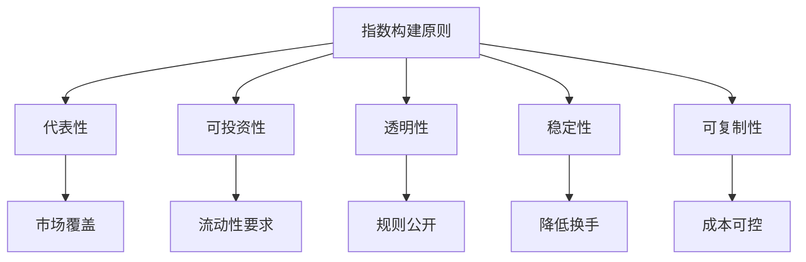

# 指数构建方法

## 概述

指数构建（Index Construction）是指数投资的核心基础，决定了指数如何选择成分股、如何分配权重、如何进行调整。理解指数构建方法对于选择合适的指数产品、评估指数表现至关重要。

**学习目标**：
- 理解指数构建的基本原则和流程
- 掌握不同的加权方法及其特点
- 了解指数调整和再平衡机制
- 认识主要指数类型和代表性指数
- 学会评估指数质量和适用性

**为什么重要**：
指数构建方法直接影响指数的风险收益特征、成本效率和投资价值。不同的构建方法会导致截然不同的投资结果。作为指数投资者，理解这些方法有助于做出明智的产品选择，避免隐藏的风险和成本。

## 指数构建的基本原则

### 核心原则

**1. 代表性（Representativeness）**：
- 准确反映目标市场或板块
- 覆盖足够的市场份额
- 包含具有代表性的公司

**2. 可投资性（Investability）**：
- 成分股具有足够流动性
- 可以实际买卖
- 交易成本合理

**3. 透明性（Transparency）**：
- 规则明确公开
- 调整可预测
- 数据可获得

**4. 稳定性（Stability）**：
- 避免频繁调整
- 降低跟踪成本
- 减少交易冲击

**5. 可复制性（Replicability）**：
- 投资者可以复制
- 成本可控
- 实施可行



### 构建流程

**第一步：定义指数范围**：
- 地域范围：国家、地区、全球
- 市场范围：主板、创业板、全市场
- 行业范围：单一行业、多行业、全行业
- 市值范围：大盘、中盘、小盘

**第二步：设定筛选标准**：
- 市值要求：最低市值门槛
- 流动性要求：日均交易量、换手率
- 上市时间：IPO 后等待期
- 财务要求：盈利、资产质量

**第三步：选择加权方法**：
- 市值加权
- 等权重
- 基本面加权
- 其他加权方式

**第四步：确定调整规则**：
- 定期调整：季度、半年、年度
- 临时调整：并购、退市
- 缓冲区机制：避免频繁进出

**第五步：计算和发布**：
- 指数计算方法
- 发布频率
- 数据来源

## 加权方法

### 1. 市值加权（Market Capitalization Weighting）

**定义**：
根据公司市值分配权重，市值越大权重越高

**计算公式**：
```
权重_i = 市值_i / Σ市值
```

**优势**：
- 自动再平衡：价格上涨自动增加权重
- 交易成本低：无需频繁调整
- 代表市场共识：反映市场整体看法
- 容量大：适合大规模资金

**劣势**：
- 集中度风险：大公司权重过高
- 动量偏差：追涨杀跌
- 高估股票权重大：可能买入泡沫
- 小公司权重低：错失成长机会

**代表指数**：
- S&P 500
- MSCI World
- 沪深 300
- 恒生指数

**变种：自由流通市值加权**：
- 只计算可交易股份
- 排除战略持股、限售股
- 更准确反映可投资市场
- 现代指数的主流方法

### 2. 等权重（Equal Weighting）

**定义**：
所有成分股权重相等

**计算公式**：
```
权重_i = 1 / N
```
其中 N 是成分股数量

**优势**：
- 分散度高：避免集中风险
- 小盘股倾斜：增加小公司暴露
- 价值倾斜：自动低买高卖
- 简单直观：易于理解

**劣势**：
- 高换手率：需要频繁再平衡
- 交易成本高：每次调整交易量大
- 容量限制：不适合大规模资金
- 流动性风险：小公司流动性差

**再平衡需求**：
- 季度再平衡：恢复等权重
- 交易成本：0.5-1.0% 年度成本
- 市场冲击：大量交易影响价格

**代表指数**：
- S&P 500 Equal Weight
- MSCI World Equal Weight
- Russell 2000 Equal Weight

### 3. 基本面加权（Fundamental Weighting）

**定义**：
根据公司基本面指标（而非市值）分配权重

**常用指标**：
- 营业收入
- 账面价值
- 现金流
- 股息
- 盈利

**计算方法**：
```
权重_i = 基本面指标_i / Σ基本面指标
```

**优势**：
- 价值倾斜：避免高估股票
- 基本面锚定：不受市场情绪影响
- 长期表现：历史上优于市值加权
- 反向投资：自动低买高卖

**劣势**：
- 高换手率：基本面变化导致调整
- 数据滞后：财务数据更新慢
- 主观性：指标选择有争议
- 偏离市场：可能长期跑输

**代表指数**：
- FTSE RAFI US 1000
- WisdomTree Earnings Index
- Research Affiliates Fundamental Index

### 4. 因子加权（Factor Weighting）

**定义**：
根据特定因子（价值、动量、质量等）调整权重

**常见因子**：
- 价值因子：低 P/E、低 P/B
- 动量因子：过去表现
- 质量因子：ROE、盈利稳定性
- 低波动因子：历史波动率

**Smart Beta 策略**：
- 单因子：专注一个因子
- 多因子：组合多个因子
- 动态因子：根据市场环境调整

**优势**：
- 系统化：规则明确
- 因子溢价：获取风险溢价
- 透明度：方法公开
- 成本适中：介于主动和被动之间

**劣势**：
- 因子拥挤：过多资金追逐
- 周期性：因子表现有周期
- 复杂性：难以理解
- 费用较高：比传统指数贵

**代表指数**：
- MSCI Minimum Volatility
- S&P 500 Value
- MSCI Momentum
- MSCI Quality

### 5. 其他加权方法

**风险平价加权（Risk Parity）**：
- 根据风险贡献分配权重
- 低波动资产权重高
- 高波动资产权重低
- 目标：等风险贡献

**最大分散化加权（Maximum Diversification）**：
- 优化权重以最大化分散度
- 降低组合波动
- 数学优化方法

**最小方差加权（Minimum Variance）**：
- 优化权重以最小化组合方差
- 低波动倾斜
- 适合风险厌恶投资者

## 指数调整和再平衡

### 定期调整

**调整频率**：
- 季度调整：最常见
- 半年调整：降低成本
- 年度调整：最低成本
- 月度调整：高换手策略

**调整内容**：
- 成分股调整：新增、剔除
- 权重调整：恢复目标权重
- 因子暴露调整：维持因子特征

**调整流程**：
1. 提前公告：通常提前 2-4 周
2. 生效日期：固定日期
3. 执行方式：收盘价执行
4. 数据发布：及时更新

### 缓冲区机制

**目的**：
- 减少频繁进出
- 降低交易成本
- 提高稳定性

**实施方法**：
- 纳入门槛：市值排名前 X
- 剔除门槛：市值排名后 Y
- 缓冲区：X 到 Y 之间
- 现有成分股在缓冲区内保留

**示例：沪深 300**：
- 纳入：排名前 240
- 剔除：排名后 360
- 缓冲区：240-360
- 现有成分股在缓冲区内不调整

### 临时调整

**触发事件**：
- 退市：公司退市
- 并购：公司被收购
- 分拆：公司分拆
- 暂停交易：长期停牌

**处理方式**：
- 立即剔除：退市、并购
- 暂时保留：短期停牌
- 替换：选择替代公司
- 权重调整：重新分配权重

### 再平衡成本

**直接成本**：
- 买卖价差：0.05-0.20%
- 佣金费用：0.01-0.05%
- 印花税：0-0.10%

**间接成本**：
- 市场冲击：0.10-0.50%
- 机会成本：难以量化
- 时机成本：执行延迟

**成本控制**：
- 降低调整频率
- 使用缓冲区
- 优化执行算法
- 批量交易

## 主要指数类型

### 1. 广基指数（Broad Market Index）

**定义**：
覆盖整个市场或大部分市场的指数

**特点**：
- 成分股数量多：100-3000 只
- 市场覆盖率高：80-100%
- 分散度高
- 代表性强

**代表指数**：
- **美国**：
  - Wilshire 5000：全市场
  - Russell 3000：大中小盘
  - S&P 1500：大中小盘

- **全球**：
  - MSCI ACWI：全球市场
  - FTSE All-World：全球市场

- **中国**：
  - 中证全指：全市场
  - 中证 800：大中盘

### 2. 大盘指数（Large Cap Index）

**定义**：
追踪大市值公司的指数

**特点**：
- 市值门槛高
- 流动性好
- 稳定性强
- 代表经济主体

**代表指数**：
- **美国**：
  - S&P 500：美国大盘
  - Dow Jones Industrial Average：30 只蓝筹股
  - NASDAQ-100：科技大盘

- **中国**：
  - 上证 50：上海大盘
  - 沪深 300：A 股大盘
  - 恒生指数：香港大盘

### 3. 中小盘指数（Mid/Small Cap Index）

**定义**：
追踪中小市值公司的指数

**特点**：
- 成长性强
- 波动性高
- 流动性较差
- 超额收益潜力

**代表指数**：
- **美国**：
  - S&P MidCap 400：中盘
  - S&P SmallCap 600：小盘
  - Russell 2000：小盘

- **中国**：
  - 中证 500：中盘
  - 中证 1000：小盘
  - 创业板指：成长型

### 4. 行业指数（Sector Index）

**定义**：
追踪特定行业或板块的指数

**GICS 行业分类**：
- 能源（Energy）
- 材料（Materials）
- 工业（Industrials）
- 可选消费（Consumer Discretionary）
- 必需消费（Consumer Staples）
- 医疗保健（Health Care）
- 金融（Financials）
- 信息技术（Information Technology）
- 通信服务（Communication Services）
- 公用事业（Utilities）
- 房地产（Real Estate）

**代表指数**：
- S&P 500 Sector Indices
- MSCI World Sector Indices
- 中证行业指数系列

### 5. 风格指数（Style Index）

**定义**：
根据投资风格（价值、成长）分类的指数

**价值指数**：
- 低 P/E、低 P/B
- 高股息收益率
- 成熟稳定公司

**成长指数**：
- 高盈利增长
- 高销售增长
- 创新型公司

**代表指数**：
- Russell 1000 Value/Growth
- S&P 500 Value/Growth
- MSCI World Value/Growth

### 6. 主题指数（Thematic Index）

**定义**：
追踪特定投资主题的指数

**常见主题**：
- ESG（环境、社会、治理）
- 清洁能源
- 人工智能
- 生物科技
- 云计算
- 电动汽车

**特点**：
- 集中度高
- 波动性大
- 成长潜力高
- 风险较高

## 指数质量评估

### 评估维度

**1. 代表性**：
- 市场覆盖率
- 成分股数量
- 行业分布
- 市值分布

**2. 流动性**：
- 日均交易量
- 买卖价差
- 市场深度
- 冲击成本

**3. 稳定性**：
- 换手率
- 成分股变动频率
- 权重变化幅度
- 历史波动率

**4. 可复制性**：
- 跟踪误差
- 交易成本
- 实施难度
- 容量限制

**5. 透明度**：
- 规则清晰度
- 数据可获得性
- 调整可预测性
- 历史数据完整性

### 关键指标

**换手率（Turnover Rate）**：
```
年换手率 = 年度交易量 / 平均市值
```
- 低换手率：< 10%
- 中等换手率：10-30%
- 高换手率：> 30%

**集中度（Concentration）**：
```
前 10 大权重占比
```
- 低集中度：< 30%
- 中等集中度：30-50%
- 高集中度：> 50%

**有效成分股数量（Effective Number of Stocks）**：
```
ENS = 1 / Σ(权重_i)
```
- 衡量真实分散度
- 考虑权重分布
- 越高越分散

## 指数构建的挑战

### 1. 指数效应（Index Effect）

**现象**：
- 纳入指数：股价上涨
- 剔除指数：股价下跌
- 调整日：交易量激增

**原因**：
- 被动资金跟踪
- 流动性改善
- 市场关注度提高

**影响**：
- 增加跟踪成本
- 扭曲价格发现
- 套利机会

**应对**：
- 提前公告
- 分散执行
- 使用算法交易

### 2. 集中度风险

**问题**：
- 大公司权重过高
- 行业集中
- 地域集中

**案例**：
- 2000 年科技泡沫：科技股占 S&P 500 的 35%
- 2020 年：FAANG 占 S&P 500 的 25%
- 日本 1989 年：日本股市占全球 45%

**缓解措施**：
- 权重上限：单只股票不超过 X%
- 行业上限：单一行业不超过 Y%
- 分散投资：多个指数组合

### 3. 新兴行业纳入

**挑战**：
- 新行业定义模糊
- 公司分类困难
- 市值波动大
- 盈利不稳定

**案例**：
- 互联网公司：科技还是通信？
- 特斯拉：汽车还是科技？
- 金融科技：金融还是科技？

**解决方案**：
- 明确分类标准
- 定期审查调整
- 行业分类演进

### 4. 国际指数挑战

**复杂性**：
- 多个市场
- 不同交易时间
- 汇率波动
- 监管差异

**数据问题**：
- 数据质量参差
- 报告标准不同
- 时区差异
- 假期不同

**解决方案**：
- 统一数据标准
- 汇率对冲选项
- 本地化处理

## 实战应用

### 选择指数的考虑因素

**1. 投资目标**：
- 核心持仓：广基指数
- 行业配置：行业指数
- 风格倾斜：风格指数
- 主题投资：主题指数

**2. 风险承受能力**：
- 保守：大盘、低波动
- 中等：广基、平衡
- 激进：小盘、主题

**3. 投资期限**：
- 短期：流动性好的指数
- 中期：平衡型指数
- 长期：成长型指数

**4. 成本考虑**：
- 费用率
- 跟踪误差
- 交易成本
- 税收效率

### 指数组合构建

**核心-卫星策略**：
- 核心（70%）：广基指数
- 卫星（30%）：行业/主题指数

**地域分散**：
- 本国市场：50-60%
- 发达市场：30-40%
- 新兴市场：10-20%

**风格平衡**：
- 价值：40-50%
- 成长：40-50%
- 混合：10-20%

## 常见误区

### 误区 1：所有指数都一样

**真相**：
- 构建方法差异大
- 风险收益特征不同
- 成本差异显著
- 适用场景不同

### 误区 2：成分股越多越好

**真相**：
- 有效分散度更重要
- 过多成分股增加成本
- 流动性可能下降
- 100-500 只通常足够

### 误区 3：指数调整不重要

**真相**：
- 调整影响成本
- 影响跟踪误差
- 影响税收效率
- 需要仔细评估

### 误区 4：市值加权总是最好

**真相**：
- 有集中度风险
- 可能买入泡沫
- 其他方法各有优势
- 需要根据目标选择

## 延伸阅读

### 经典书籍

1. **《指数革命》（The Index Revolution）** - Charles D. Ellis
   - 指数投资的历史和发展

2. **《Smart Beta 投资》** - Andrew L. Berkin & Larry E. Swedroe
   - 因子加权和 Smart Beta

3. **《指数基金投资指南》** - 银行螺丝钉
   - 中国市场指数投资实践

### 学术论文

1. **Arnott, R. D., Hsu, J., & Moore, P. (2005)** - "Fundamental Indexation"
   - 基本面加权的理论基础

2. **Chow, T., Hsu, J., Kalesnik, V., & Little, B. (2011)** - "A Survey of Alternative Equity Index Strategies"
   - 另类指数策略综述

### 在线资源

1. **S&P Dow Jones Indices** - 指数方法论
2. **MSCI** - 指数构建指南
3. **FTSE Russell** - 指数规则手册
4. **中证指数公司** - A 股指数方法

## 参考文献

1. Arnott, R. D., Hsu, J., & Moore, P. (2005). Fundamental indexation. *Financial Analysts Journal*, 61(2), 83-99.

2. Chow, T., Hsu, J., Kalesnik, V., & Little, B. (2011). A survey of alternative equity index strategies. *Financial Analysts Journal*, 67(5), 37-57.

3. Amenc, N., Goltz, F., & Le Sourd, V. (2006). Assessing the quality of stock market indices. *EDHEC Risk and Asset Management Research Centre*.

4. Blitz, D., & Van Vliet, P. (2007). The volatility effect: Lower risk without lower return. *Journal of Portfolio Management*, 34(1), 102-113.

5. Hsu, J., & Campollo, C. (2006). New frontiers in index investing: An examination of fundamental indexation. *Journal of Indexes*, 9(1), 32-38.

6. Siegel, L. B. (2003). Benchmarks and investment management. *Research Foundation of CFA Institute*.

7. Malkiel, B. G. (2003). Passive investment strategies and efficient markets. *European Financial Management*, 9(1), 1-10.

8. Cremers, M., & Petajisto, A. (2009). How active is your fund manager? A new measure that predicts performance. *The Review of Financial Studies*, 22(9), 3329-3365.

9. Ang, A. (2014). *Asset Management: A Systematic Approach to Factor Investing*. Oxford University Press.

10. Bender, J., Briand, R., Melas, D., & Subramanian, R. (2013). Foundations of factor investing. *MSCI Research Paper*.
