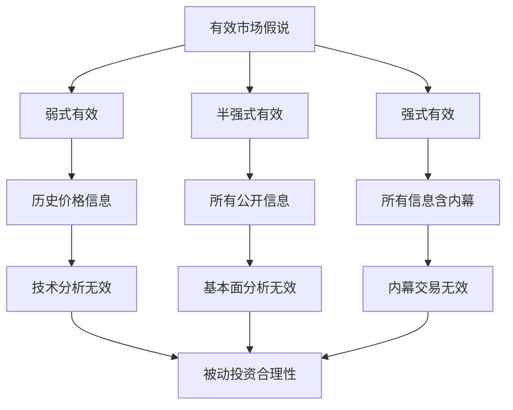

# 被动投资理论

## 概述

被动投资（Passive Investing）是一种投资策略，旨在通过复制市场指数的表现来获取市场平均收益，而不是试图通过选股或择时来战胜市场。这种投资方法建立在有效市场假说的理论基础上，强调低成本、长期持有和广泛分散的投资原则。

**学习目标**：
- 理解被动投资的理论基础和发展历程
- 掌握有效市场假说的三种形式及其含义
- 对比主动投资和被动投资的优劣势
- 认识被动投资的成本优势和复利效应
- 了解被动投资的适用场景和局限性

**为什么重要**：
被动投资代表了投资理念的重大转变，从试图战胜市场到接受市场收益。对于大多数投资者而言，被动投资提供了一种简单、低成本、有效的财富积累方式。理解被动投资的理论基础，有助于建立正确的投资观念，避免过度交易和追逐热点的陷阱。

## 被动投资的理论基础

### 有效市场假说（EMH）

**定义**：
有效市场假说认为，在一个有效的市场中，资产价格充分反映了所有可获得的信息。因此，投资者无法通过分析信息来持续获得超额收益。

**三种形式**：

**1. 弱式有效市场（Weak Form EMH）**：
- 价格反映了所有历史价格和交易量信息
- 技术分析无效
- 无法通过研究历史价格模式获利
- 实证：大部分市场符合弱式有效

**2. 半强式有效市场（Semi-Strong Form EMH）**：
- 价格反映了所有公开可得的信息
- 基本面分析无效
- 新信息迅速反映在价格中
- 实证：发达市场基本符合半强式有效

**3. 强式有效市场（Strong Form EMH）**：
- 价格反映了所有信息，包括内幕信息
- 即使内幕交易也无法获利
- 实证：现实中不存在强式有效市场



### 随机漫步理论

**核心观点**：
股票价格的变动是随机的，无法预测。今天的价格变化与昨天的价格变化无关。

**数学表达**：
```
P(t+1) = P(t) + ε
```
其中 ε 是随机误差项

**投资含义**：
- 短期价格波动不可预测
- 长期持有优于频繁交易
- 分散投资降低风险

### 现代投资组合理论（MPT）

**马科维茨理论**：
- 投资者应关注组合的整体风险和收益
- 通过分散投资降低非系统性风险
- 有效前沿：最优风险收益组合

**资本资产定价模型（CAPM）**：
- 市场组合是最优组合
- 投资者应持有市场组合
- 被动投资的理论支撑

**分离定理**：
- 投资决策可分为两步
- 第一步：确定最优风险资产组合（市场组合）
- 第二步：根据风险偏好配置无风险资产和市场组合

## 主动投资 vs 被动投资

### 主动投资的特点

**定义**：
通过选股、择时等方式试图战胜市场基准的投资策略

**方法**：
- 基本面分析：研究公司财务和行业
- 技术分析：研究价格图表和指标
- 量化分析：使用数学模型选股
- 宏观分析：根据经济周期调整配置

**优势**：
- 理论上可获得超额收益
- 灵活应对市场变化
- 可以避开高估资产
- 满足投资者的控制感

**劣势**：
- 高管理费用（1-2%）
- 高交易成本
- 税收效率低
- 大多数主动基金跑输指数

### 被动投资的特点

**定义**：
通过复制市场指数来获取市场平均收益的投资策略

**方法**：
- 完全复制：持有指数所有成分股
- 抽样复制：持有代表性成分股
- 优化复制：使用优化算法最小化跟踪误差

**优势**：
- 低管理费用（0.03-0.20%）
- 低交易成本
- 税收效率高
- 透明度高
- 长期表现优异

**劣势**：
- 无法战胜市场
- 被动承受市场下跌
- 包含所有股票（含差公司）
- 缺乏灵活性

### 业绩对比

**SPIVA 报告（S&P Indices Versus Active）**：

**美国市场（15年数据）**：
- 85% 的大盘主动基金跑输 S&P 500
- 90% 的中盘主动基金跑输中盘指数
- 95% 的小盘主动基金跑输小盘指数

**全球市场**：
- 发达市场：80-90% 主动基金跑输
- 新兴市场：70-80% 主动基金跑输
- 固定收益：85-95% 主动基金跑输

**长期趋势**：
- 时间越长，主动基金跑输比例越高
- 10年：80% 跑输
- 15年：85% 跑输
- 20年：90% 跑输


### 主动基金跑输的原因

**1. 成本拖累**：
- 管理费：1-2% 年费
- 交易成本：0.5-1%
- 税收成本：0.5-1%
- 总成本：2-4% 年度拖累

**2. 市场有效性**：
- 信息传播迅速
- 专业投资者众多
- 竞争激烈
- 超额收益难以持续

**3. 规模限制**：
- 大型基金难以灵活调仓
- 市场冲击成本高
- 流动性约束
- 策略容量有限

**4. 行为偏差**：
- 过度自信
- 羊群效应
- 损失厌恶
- 短期主义

**5. 幸存者偏差**：
- 表现差的基金被清盘
- 统计数据高估主动基金表现
- 实际跑输比例更高

## 被动投资的成本优势

### 费用对比

**主动管理基金**：
- 管理费：1.0-2.0%
- 12b-1 费用：0.25-1.0%
- 交易成本：0.5-1.0%
- 总费用比率：1.5-3.0%

**被动指数基金**：
- 管理费：0.03-0.20%
- 无 12b-1 费用
- 交易成本：0.05-0.10%
- 总费用比率：0.05-0.30%

**费用差异**：
- 年度差异：1.5-2.5%
- 看似不大，但长期影响巨大

### 复利效应

**案例分析**：
假设初始投资 10 万元，年化收益 8%，投资 30 年

**被动投资（费用 0.1%）**：
- 实际收益：7.9%
- 30 年后：92.7 万元

**主动投资（费用 2.0%）**：
- 实际收益：6.0%
- 30 年后：57.4 万元

**差异**：
- 绝对差异：35.3 万元
- 相对差异：61% 更多

**费用侵蚀收益**：
```
最终财富 = 初始投资 × (1 + 收益率 - 费用率)^年数
```

**1% 费用差异的长期影响**：
- 10 年：10% 财富差异
- 20 年：22% 财富差异
- 30 年：35% 财富差异
- 40 年：50% 财富差异

### 税收效率

**主动基金的税收劣势**：
- 高换手率：50-100% 年换手
- 频繁实现资本利得
- 短期资本利得税率高
- 税收拖累：0.5-1.5%

**被动基金的税收优势**：
- 低换手率：5-20% 年换手
- 长期持有
- 延迟实现资本利得
- 税收拖累：0.1-0.3%

**税收效率对比**：
- 应税账户：被动投资优势明显
- 退休账户：税收影响较小
- 长期投资：税收差异累积

### 交易成本

**主动基金的交易成本**：
- 买卖价差：0.1-0.5%
- 市场冲击：0.2-0.8%
- 机会成本：难以量化
- 总成本：0.5-1.5%

**被动基金的交易成本**：
- 低换手率
- 批量交易降低成本
- 优化执行算法
- 总成本：0.05-0.15%

## 被动投资的发展历程

### 理论奠基（1950-1970）

**1952年**：马科维茨发表现代投资组合理论
- 奠定分散投资的理论基础

**1964年**：夏普提出资本资产定价模型
- 市场组合是最优组合

**1965年**：法玛提出有效市场假说
- 为被动投资提供理论支撑

**1973年**：布莱克-斯科尔斯期权定价模型
- 完善金融市场理论

### 实践起步（1970-1990）

**1971年**：第一只指数基金
- Wells Fargo 为机构投资者创建

**1975年**：Vanguard 成立
- 约翰·博格创立先锋集团

**1976年**：第一只零售指数基金
- Vanguard 500 Index Fund
- 初期遭遇冷遇，被称为"博格的愚蠢"

**1980年代**：缓慢增长
- 投资者逐渐接受被动投资理念
- 学术研究支持被动投资

### 快速发展（1990-2010）

**1993年**：第一只 ETF
- SPDR S&P 500 ETF (SPY) 上市
- 开启 ETF 时代

**2000年代**：ETF 爆发式增长
- 产品种类丰富
- 费用持续下降
- 投资者接受度提高

**2008年金融危机**：
- 主动基金大量跑输
- 被动投资理念得到验证
- 资金大量流入指数基金

### 主流化（2010-至今）

**规模增长**：
- 2010年：被动基金规模 2 万亿美元
- 2020年：被动基金规模 11 万亿美元
- 2023年：被动基金规模 15 万亿美元

**市场份额**：
- 2010年：被动基金占比 20%
- 2020年：被动基金占比 45%
- 2023年：被动基金占比 55%

**费用战争**：
- Vanguard、Fidelity、Schwab 竞相降费
- 部分指数基金费用降至 0.03%
- 零费用指数基金出现

**产品创新**：
- Smart Beta ETF
- ESG 指数基金
- 主题指数基金
- 因子指数基金

## 被动投资的适用场景

### 适合被动投资的情况

**1. 有效市场**：
- 大盘股市场
- 发达国家市场
- 流动性好的市场
- 信息透明的市场

**2. 长期投资**：
- 退休储蓄
- 教育基金
- 长期财富积累
- 时间跨度 10 年以上

**3. 普通投资者**：
- 缺乏专业知识
- 时间精力有限
- 风险承受能力中等
- 追求稳健收益

**4. 核心持仓**：
- 投资组合的基础部分
- 60-80% 的资产配置
- 提供市场暴露
- 降低整体成本

### 被动投资的局限性

**1. 市场下跌时无法避险**：
- 被动承受市场波动
- 无法主动减仓
- 需要心理承受能力

**2. 包含所有股票**：
- 包括高估的股票
- 包括基本面差的公司
- 无法剔除问题公司

**3. 指数集中度风险**：
- 市值加权导致大公司权重高
- 科技股集中度高
- 行业集中风险

**4. 新兴市场效率较低**：
- 信息不对称
- 市场操纵
- 主动管理可能有优势

**5. 特殊市场环境**：
- 市场泡沫时期
- 系统性风险时期
- 结构性转变时期

## 被动投资的实施策略

### 核心-卫星策略

**核心部分（70-80%）**：
- 广泛分散的指数基金
- 低成本
- 长期持有
- 提供市场收益

**卫星部分（20-30%）**：
- 主动管理或主题投资
- 追求超额收益
- 灵活调整
- 增加组合收益潜力

### 全球分散

**地域分散**：
- 美国市场：40-50%
- 国际发达市场：30-40%
- 新兴市场：10-20%

**资产类别分散**：
- 股票：60-80%
- 债券：20-40%
- 另类资产：0-10%

### 定期再平衡

**再平衡原则**：
- 维持目标资产配置
- 控制风险暴露
- 纪律性投资

**再平衡频率**：
- 时间触发：季度或年度
- 阈值触发：偏离 5-10%
- 混合方法

### 税收优化

**账户选择**：
- 应税账户：税收效率高的指数基金
- 退休账户：可以持有任何基金
- 税收递延账户：主动基金

**税收损失收割**：
- 卖出亏损头寸
- 实现税收损失
- 抵消资本利得
- 降低税负

## 常见误区

### 误区 1：被动投资就是不管不顾

**真相**：
- 需要选择合适的指数
- 需要定期再平衡
- 需要税收优化
- 需要风险管理

### 误区 2：被动投资无法战胜市场

**真相**：
- 被动投资的目标是获取市场收益
- 扣除费用后，战胜大多数主动基金
- 长期来看，战胜 80-90% 的投资者

### 误区 3：被动投资只适合牛市

**真相**：
- 熊市中主动基金也大多跑输
- 长期持有穿越牛熊
- 市场择时极其困难

### 误区 4：被动投资没有风险

**真相**：
- 仍然承担市场风险
- 需要承受波动
- 需要长期投资视角

### 误区 5：所有指数基金都一样

**真相**：
- 跟踪误差不同
- 费用差异大
- 流动性不同
- 需要仔细选择

## 延伸阅读

### 经典书籍

1. **《漫步华尔街》（A Random Walk Down Wall Street）** - Burton Malkiel
   - 被动投资的经典之作
   - 有效市场假说的通俗解读

2. **《共同基金常识》（The Little Book of Common Sense Investing）** - John C. Bogle
   - 指数基金之父的投资智慧
   - 简单而深刻

3. **《投资者的敌人》（The Investor's Manifesto）** - William J. Bernstein
   - 投资的基本原则
   - 被动投资的科学依据

4. **《不落俗套的成功》（Unconventional Success）** - David Swensen
   - 耶鲁捐赠基金的投资理念
   - 机构投资者的被动投资实践

5. **《指数基金投资指南》** - 银行螺丝钉
   - 中国市场的指数投资实践
   - 适合中国投资者

### 学术论文

1. **Fama, E. F. (1970)** - "Efficient Capital Markets: A Review of Theory and Empirical Work"
   - 有效市场假说的奠基之作

2. **Sharpe, W. F. (1991)** - "The Arithmetic of Active Management"
   - 数学证明主动管理的零和游戏本质

3. **French, K. R. (2008)** - "The Cost of Active Investing"
   - 量化主动投资的成本

4. **Malkiel, B. G. (2003)** - "The Efficient Market Hypothesis and Its Critics"
   - 有效市场假说的辩护

5. **Bogle, J. C. (2014)** - "The Arithmetic of 'All-In' Investment Expenses"
   - 全面分析投资费用的影响

### 在线资源

1. **Vanguard Research** - 先锋集团研究报告
2. **Morningstar** - 基金评级和研究
3. **SPIVA Scorecard** - 主动基金业绩对比
4. **Bogleheads Forum** - 被动投资社区
5. **ETF.com** - ETF 资讯和分析

## 参考文献

1. Malkiel, B. G. (2019). *A Random Walk Down Wall Street* (12th ed.). W. W. Norton & Company.

2. Bogle, J. C. (2017). *The Little Book of Common Sense Investing* (10th Anniversary ed.). John Wiley & Sons.

3. Fama, E. F. (1970). Efficient capital markets: A review of theory and empirical work. *The Journal of Finance*, 25(2), 383-417.

4. Sharpe, W. F. (1991). The arithmetic of active management. *Financial Analysts Journal*, 47(1), 7-9.

5. French, K. R. (2008). The cost of active investing. *The Journal of Finance*, 63(4), 1537-1573.

6. Bernstein, W. J. (2010). *The Investor's Manifesto*. John Wiley & Sons.

7. Swensen, D. F. (2005). *Unconventional Success: A Fundamental Approach to Personal Investment*. Free Press.

8. Ellis, C. D. (2013). *Winning the Loser's Game* (6th ed.). McGraw-Hill Education.

9. Ferri, R. A. (2010). *The ETF Book: All You Need to Know About Exchange-Traded Funds*. John Wiley & Sons.

10. Swedroe, L. E., & Grogan, K. (2014). *Reducing the Risk of Black Swans*. BAM Alliance Press.

11. Malkiel, B. G. (2003). The efficient market hypothesis and its critics. *Journal of Economic Perspectives*, 17(1), 59-82.

12. Bogle, J. C. (2014). The arithmetic of 'all-in' investment expenses. *Financial Analysts Journal*, 70(1), 13-21.

13. Cremers, M., & Petajisto, A. (2009). How active is your fund manager? A new measure that predicts performance. *The Review of Financial Studies*, 22(9), 3329-3365.

14. Gruber, M. J. (1996). Another puzzle: The growth in actively managed mutual funds. *The Journal of Finance*, 51(3), 783-810.

15. Carhart, M. M. (1997). On persistence in mutual fund performance. *The Journal of Finance*, 52(1), 57-82.
