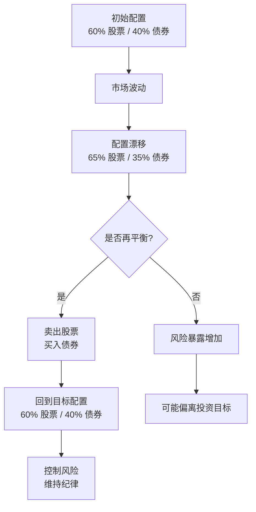

# 再平衡策略

## 概述

投资组合再平衡（Portfolio Rebalancing）是指定期调整投资组合中各类资产的权重，使其回到目标配置比例的过程。随着市场波动，不同资产的价值会发生变化，导致实际配置偏离目标配置。再平衡通过"卖高买低"的机制，帮助投资者控制风险、维持投资纪律，并可能提升长期收益。

**学习目标**：
- 理解再平衡的原理和重要性
- 掌握不同的再平衡方法和触发机制
- 学会选择合适的再平衡频率
- 了解再平衡的成本和税收影响
- 认识再平衡在不同市场环境下的作用

**为什么重要**：
再平衡是投资组合管理的核心环节，它不仅是风险控制的工具，也是纪律性投资的体现。通过系统化的再平衡，投资者可以避免情绪化决策，自动实现"低买高卖"，长期来看能够提升风险调整后的收益。

## 再平衡的原理

### 为什么需要再平衡

**资产配置漂移**：

假设初始配置为 60% 股票 / 40% 债券，投资 10 万元：
- 股票：6 万元
- 债券：4 万元

一年后，股票上涨 20%，债券上涨 5%：
- 股票：7.2 万元（占比 63.2%）
- 债券：4.2 万元（占比 36.8%）
- 总资产：11.4 万元

**配置偏离的影响**：
- 风险暴露增加：股票占比从 60% 升至 63.2%
- 偏离投资目标：不再符合风险承受能力
- 风险收益失衡：承担更多风险但未必获得相应收益

### 再平衡的机制

**卖高买低**：
- 卖出表现好的资产（股票）
- 买入表现差的资产（债券）
- 回到目标配置 60/40

**再平衡后**：
- 卖出股票：7.2 - 6.84 = 0.36 万元
- 买入债券：4.56 - 4.2 = 0.36 万元
- 新配置：6.84 万股票（60%）/ 4.56 万债券（40%）

**长期效果**：
- 自动低买高卖
- 控制风险暴露
- 提升风险调整后收益
- 维持投资纪律

### 再平衡的收益来源

**1. 波动率收益（Volatility Harvesting）**：
- 资产价格波动创造再平衡机会
- 高波动资产提供更多再平衡收益
- 数学上的"凹性收益"

**2. 均值回归效应**：
- 资产价格倾向于回归长期均值
- 卖出高估资产，买入低估资产
- 捕捉价格回归带来的收益

**3. 风险溢价再平衡**：
- 不同资产的风险溢价不同
- 维持风险暴露获得风险溢价
- 避免风险暴露过度集中

**历史数据**：
- 60/40 组合年化再平衡收益：0.3-0.5%
- 高波动市场再平衡收益更高
- 长期累积效果显著

## 再平衡方法

### 1. 时间触发再平衡（Calendar Rebalancing）

**定义**：
按固定时间间隔进行再平衡，无论配置偏离程度如何。

**常见频率**：
- 月度再平衡
- 季度再平衡
- 半年度再平衡
- 年度再平衡

**优点**：
- 简单易执行
- 纪律性强
- 可预测性高
- 便于计划

**缺点**：
- 可能过度交易（偏离小时）
- 可能交易不足（偏离大时）
- 不考虑市场波动
- 固定成本

**适用场景**：
- 普通投资者
- 退休账户（无税收影响）
- 低成本交易环境
- 长期投资

**实施建议**：
- 年度再平衡最常见
- 季度再平衡适合波动大的市场
- 月度再平衡通常过于频繁

### 2. 阈值触发再平衡（Threshold Rebalancing）

**定义**：
当资产配置偏离目标超过预设阈值时进行再平衡。

**常见阈值**：
- 绝对阈值：偏离 5%、10%
- 相对阈值：偏离 20%、25%

**示例**：
目标配置 60% 股票，绝对阈值 5%：
- 触发再平衡：股票占比 < 55% 或 > 65%
- 不触发：股票占比在 55-65% 之间

**优点**：
- 响应市场波动
- 避免不必要的交易
- 控制交易成本
- 灵活性高

**缺点**：
- 需要持续监控
- 实施复杂度高
- 可能长期不触发
- 可能频繁触发

**适用场景**：
- 专业投资者
- 应税账户（减少交易）
- 高交易成本环境
- 波动性市场

**阈值选择**：
- 5% 阈值：适合保守投资者
- 10% 阈值：平衡交易频率和偏离度
- 20% 阈值：适合激进投资者

### 3. 混合方法（Hybrid Approach）

**定义**：
结合时间触发和阈值触发的优点。

**常见组合**：
- 季度检查 + 5% 阈值
- 年度检查 + 10% 阈值
- 半年检查 + 7.5% 阈值

**实施流程**：
1. 定期检查配置（如季度）
2. 如果偏离超过阈值，则再平衡
3. 如果未超过阈值，不交易

**优点**：
- 平衡纪律性和灵活性
- 控制交易频率
- 响应市场变化
- 实用性强

**缺点**：
- 规则较复杂
- 需要定期监控
- 参数选择需要经验

**适用场景**：
- 大多数投资者
- 各类账户
- 推荐方法

### 4. 现金流再平衡（Cash Flow Rebalancing）

**定义**：
利用新增资金或提取资金时进行再平衡，不卖出现有资产。

**方法**：
- 新增资金：买入低配资产
- 提取资金：卖出高配资产
- 分红再投资：投向低配资产

**优点**：
- 零交易成本
- 无税收影响
- 简单易行
- 适合定投

**缺点**：
- 再平衡速度慢
- 依赖现金流
- 大额偏离难以纠正
- 不适合提取期

**适用场景**：
- 积累期投资者
- 定期定投
- 应税账户
- 辅助方法

**实施建议**：
- 与其他方法结合使用
- 优先使用现金流再平衡
- 必要时进行主动再平衡

## 再平衡频率选择

### 频率对比分析

**年度再平衡**：
- 交易次数：1 次/年
- 平均偏离度：中等
- 交易成本：低
- 税收影响：低
- 管理难度：低
- 推荐度：★★★★★

**季度再平衡**：
- 交易次数：4 次/年
- 平均偏离度：较低
- 交易成本：中等
- 税收影响：中等
- 管理难度：中等
- 推荐度：★★★★

**月度再平衡**：
- 交易次数：12 次/年
- 平均偏离度：低
- 交易成本：高
- 税收影响：高
- 管理难度：高
- 推荐度：★★

**历史回测结果**：

Vanguard 研究（1926-2009）：
- 不再平衡：年化收益 9.1%，波动率 11.9%
- 月度再平衡：年化收益 9.2%，波动率 11.4%
- 季度再平衡：年化收益 9.2%，波动率 11.4%
- 年度再平衡：年化收益 9.2%，波动率 11.5%

**结论**：
- 再平衡频率对收益影响不大
- 年度再平衡性价比最高
- 过度再平衡增加成本
- 完全不再平衡风险增加

### 影响频率选择的因素

**1. 账户类型**：
- 退休账户：可以频繁再平衡（无税收）
- 应税账户：降低再平衡频率（减少税收）

**2. 交易成本**：
- 零佣金：可以适当提高频率
- 有佣金：降低频率

**3. 资产波动性**：
- 高波动：可能需要更频繁再平衡
- 低波动：降低频率

**4. 投资者类型**：
- 专业投资者：可以使用复杂策略
- 普通投资者：简单的年度再平衡

**5. 组合复杂度**：
- 简单组合（2-3 类资产）：年度即可
- 复杂组合（5+ 类资产）：可能需要季度

## 再平衡的成本考虑

### 交易成本

**直接成本**：
- 佣金费用：0-10 美元/笔
- 买卖价差：0.01-0.10%
- ETF 溢价/折价：0-0.50%

**间接成本**：
- 市场冲击：大额交易影响价格
- 机会成本：等待交易时机
- 时间成本：研究和执行

**降低成本的方法**：
- 使用零佣金券商
- 选择流动性好的 ETF
- 批量交易
- 利用现金流再平衡

### 税收影响

**资本利得税**：
- 短期资本利得：按普通收入税率（最高 37%）
- 长期资本利得：0%、15% 或 20%
- 税收拖累：0.5-1.5% 年化

**税收优化策略**：

**1. 账户分层**：
- 退休账户：频繁再平衡
- 应税账户：降低频率

**2. 税收损失收割**：
- 卖出亏损资产
- 实现税收损失
- 抵消资本利得

**3. 特定份额识别**：
- 选择高成本份额卖出
- 减少资本利得
- 降低税负

**4. 长期持有**：
- 持有超过 1 年
- 享受长期资本利得税率
- 大幅降低税负

**税收效率对比**：
- 退休账户再平衡：无税收影响
- 应税账户年度再平衡：0.2-0.5% 税收拖累
- 应税账户季度再平衡：0.5-1.0% 税收拖累

### 成本收益分析

**再平衡收益**：
- 波动率收益：0.3-0.5% 年化
- 风险控制：降低波动率 0.5-1.0%
- 纪律性投资：避免情绪化决策

**再平衡成本**：
- 交易成本：0.05-0.20% 年化
- 税收成本：0.2-1.0% 年化（应税账户）
- 时间成本：难以量化

**净收益**：
- 退休账户：0.2-0.4% 年化
- 应税账户：0-0.3% 年化（取决于频率）

**最优策略**：
- 退休账户：年度或季度再平衡
- 应税账户：年度再平衡 + 现金流再平衡

## 不同市场环境下的再平衡

### 牛市中的再平衡

**特点**：
- 股票持续上涨
- 股票占比不断增加
- 需要卖出股票买入债券

**心理挑战**：
- 卖出表现好的资产（股票）
- 买入表现差的资产（债券）
- 感觉"错过"更多收益

**正确做法**：
- 坚持再平衡纪律
- 控制风险暴露
- 避免过度集中

**历史案例**：
1990年代科技泡沫：
- 不再平衡：科技股占比达 80%+
- 坚持再平衡：控制科技股在 60%
- 2000年泡沫破裂：再平衡组合损失小得多

### 熊市中的再平衡

**特点**：
- 股票持续下跌
- 股票占比不断减少
- 需要卖出债券买入股票

**心理挑战**：
- 买入"下跌的刀子"
- 恐惧心理
- 怀疑投资策略

**正确做法**：
- 坚持再平衡纪律
- 低价买入股票
- 为复苏做准备

**历史案例**：
2008年金融危机：
- 坚持再平衡：在底部买入股票
- 2009-2010年：获得丰厚回报
- 不再平衡：错过低价买入机会

### 震荡市中的再平衡

**特点**：
- 市场上下波动
- 频繁触发再平衡
- 可能过度交易

**策略调整**：
- 适当放宽阈值
- 降低再平衡频率
- 关注交易成本

**收益机会**：
- 波动率收益最大化
- 多次低买高卖机会
- 但要控制成本

## 实战应用

### 简单组合再平衡

**60/40 组合**：
- 目标：60% 股票 / 40% 债券
- 阈值：5% 绝对偏离
- 频率：年度检查

**再平衡流程**：
1. 年底检查当前配置
2. 计算偏离度
3. 如果股票 < 55% 或 > 65%，则再平衡
4. 否则不交易

**示例**：
- 当前配置：65% 股票 / 35% 债券
- 偏离度：5%（触发再平衡）
- 操作：卖出 5% 股票，买入 5% 债券
- 结果：回到 60/40

### 多资产组合再平衡

**全球分散组合**：
- 美国股票：40%
- 国际股票：20%
- 新兴市场：10%
- 债券：25%
- 房地产：5%

**再平衡策略**：
- 频率：季度检查
- 阈值：相对偏离 20%
- 方法：混合方法

**相对偏离计算**：
- 美国股票目标：40%
- 相对阈值 20%：40% × 20% = 8%
- 触发范围：32-48%

**优先级排序**：
1. 计算所有资产的偏离度
2. 优先调整偏离最大的资产
3. 考虑交易成本
4. 批量执行交易

### 使用 ETF 再平衡

**优势**：
- 交易便捷
- 成本低
- 流动性好
- 透明度高

**注意事项**：
- 选择流动性好的 ETF
- 注意买卖价差
- 避免溢价时买入
- 批量交易降低成本

**推荐 ETF**：
- 美国股票：VTI、SPY、IVV
- 国际股票：VXUS、EFA
- 债券：BND、AGG
- 房地产：VNQ

### 自动化再平衡

**智能投顾（Robo-Advisor）**：
- Vanguard Personal Advisor
- Betterment
- Wealthfront
- Schwab Intelligent Portfolios

**功能**：
- 自动监控配置
- 自动执行再平衡
- 税收优化
- 现金流管理

**优点**：
- 完全自动化
- 纪律性强
- 税收优化
- 省时省力

**缺点**：
- 管理费用：0.25-0.50%
- 灵活性较低
- 依赖算法

## 常见误区

### 误区 1：再平衡会降低收益

**真相**：
- 短期可能降低收益（牛市中）
- 长期提升风险调整后收益
- 主要目的是控制风险
- 收益提升是副产品

### 误区 2：应该根据市场预测调整再平衡

**真相**：
- 市场择时极其困难
- 再平衡应该机械化执行
- 不要试图预测市场
- 纪律性是关键

### 误区 3：再平衡越频繁越好

**真相**：
- 过度再平衡增加成本
- 年度再平衡通常足够
- 频率对收益影响不大
- 成本可能抵消收益

### 误区 4：小额偏离也要立即再平衡

**真相**：
- 小额偏离影响有限
- 交易成本可能超过收益
- 设置合理阈值
- 避免过度交易

### 误区 5：所有账户都用同样的再平衡策略

**真相**：
- 退休账户可以频繁再平衡
- 应税账户应降低频率
- 根据账户类型调整策略
- 税收影响差异大

## 延伸阅读

### 经典书籍

1. **《资产配置》（Asset Allocation）** - Roger C. Gibson
   - 再平衡的理论基础
   - 实践指南

2. **《投资组合管理》（Portfolio Management）** - Frank J. Fabozzi
   - 专业的组合管理技术
   - 包含再平衡策略

3. **《智慧型资产配置》（The Intelligent Asset Allocator）** - William J. Bernstein
   - 再平衡的数学原理
   - 历史回测数据

### 研究报告

1. **Vanguard (2010)** - "Best practices for portfolio rebalancing"
   - 再平衡最佳实践
   - 历史数据分析

2. **Schwab (2013)** - "Does portfolio rebalancing work?"
   - 再平衡效果验证
   - 不同策略对比

3. **Morningstar (2015)** - "The rebalancing bonus"
   - 再平衡收益来源
   - 量化分析

### 在线资源

1. **Bogleheads Wiki** - Rebalancing
2. **Portfolio Visualizer** - 再平衡回测工具
3. **Vanguard Research** - 再平衡研究
4. **Morningstar** - 再平衡指南

## 参考文献

1. Jaconetti, C. M., Kinniry, F. M., & Zilbering, Y. (2010). *Best practices for portfolio rebalancing*. Vanguard Research.

2. Bernstein, W. J. (2000). *The Intelligent Asset Allocator*. McGraw-Hill.

3. Gibson, R. C. (2008). *Asset Allocation: Balancing Financial Risk* (4th ed.). McGraw-Hill.

4. Plaxco, L. M., & Arnott, R. D. (2002). Rebalancing a global policy benchmark. *The Journal of Portfolio Management*, 28(2), 9-22.

5. Buetow, G. W., Sellers, R., Trotter, D., Hunt, E., & Whipple, W. A. (2002). The benefits of rebalancing. *The Journal of Portfolio Management*, 28(2), 23-32.

6. Daryanani, G. (2008). Opportunistic rebalancing: A new paradigm for wealth managers. *Journal of Financial Planning*, 21(1), 48-61.

7. Masters, S. J. (2003). Rebalancing. *The Journal of Portfolio Management*, 29(3), 52-57.

8. Tsai, C. (2001). Rebalancing diversified portfolios of various risk profiles. *The Journal of Financial Planning*, 14(10), 104-110.

9. Willenbrock, S. (2011). Diversification return, portfolio rebalancing, and the commodity return puzzle. *Financial Analysts Journal*, 67(4), 42-49.

10. Perold, A. F., & Sharpe, W. F. (1988). Dynamic strategies for asset allocation. *Financial Analysts Journal*, 44(1), 16-27.
