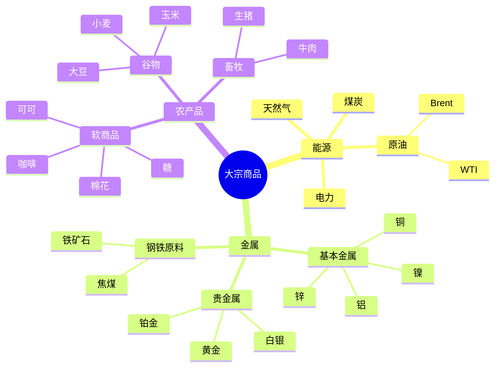
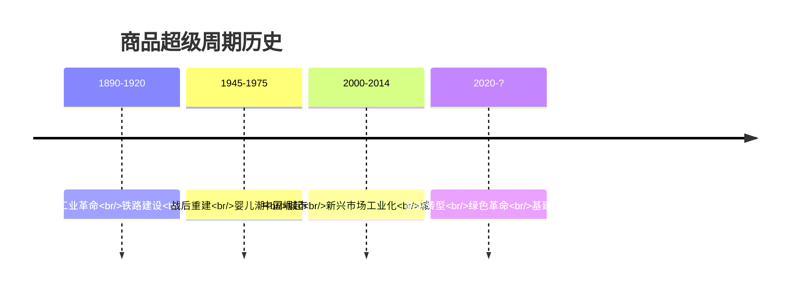
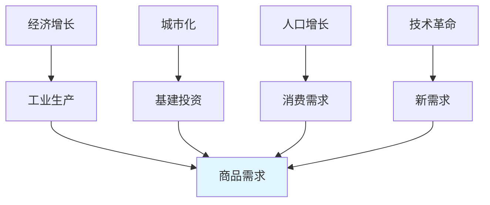
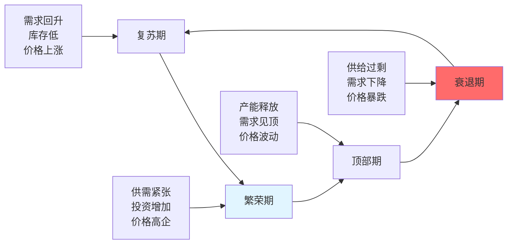
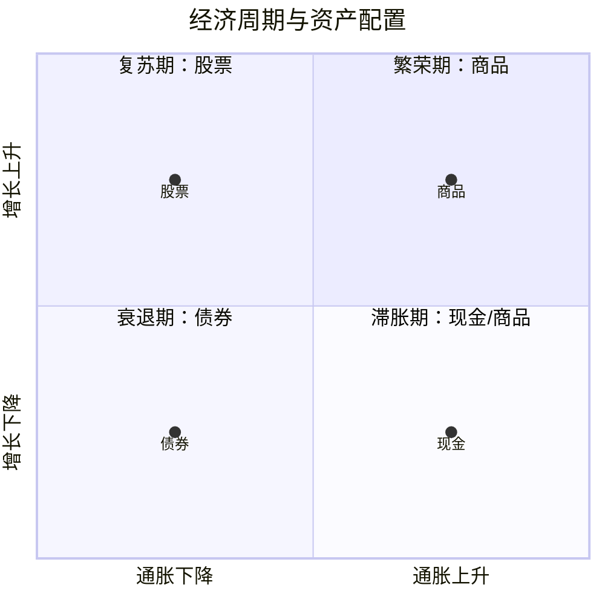

# 大宗商品周期：资源投资的周期性规律

## 概述

大宗商品（Commodities）是全球经济的基础原材料，包括能源、金属和农产品。商品价格呈现明显的周期性波动，这些周期与全球经济增长、货币政策、地缘政治和供需平衡密切相关。理解商品周期对于宏观投资、通胀对冲和资产配置至关重要。

**学习目标**：
- 理解大宗商品的分类和特点
- 掌握商品周期的驱动因素
- 学习历史上的超级周期
- 了解商品投资策略和工具
- 分析商品与其他资产的关系

**为什么重要**：
商品是实体经济的晴雨表，价格波动反映全球供需平衡和经济活力。商品投资不仅能提供多样化收益，更是对冲通胀和货币贬值的重要工具。理解商品周期有助于把握经济大趋势和资产配置时机。

## 大宗商品分类

### 三大类别



### 商品特性

**1. 能源商品**：
- **原油**：
  - 全球最重要的商品
  - 地缘政治敏感
  - OPEC影响供给
  - 与经济增长高度相关

- **天然气**：
  - 区域性定价
  - 运输成本高
  - 清洁能源转型受益

**2. 金属商品**：
- **黄金**：
  - 货币属性
  - 避险资产
  - 通胀对冲
  - 与美元负相关

- **铜**：
  - "铜博士"（经济晴雨表）
  - 工业需求驱动
  - 供给集中度高
  - 电气化趋势受益

**3. 农产品**：
- 天气敏感
- 季节性强
- 库存周期短
- 需求相对稳定

## 商品周期理论

### 超级周期（Super Cycle）

**定义**：
持续10-35年的长期价格上涨趋势，由结构性供需失衡驱动。

**历史超级周期**：



### 周期驱动因素

**1. 需求侧**：



**关键因素**：
- GDP增长率
- 工业生产指数
- 基建投资规模
- 城市化率
- 人口增长

**2. 供给侧**：

**供给特点**：
- 开发周期长（矿山5-10年）
- 资本密集
- 地理集中
- 技术进步缓慢

**供给响应**：
```
价格上涨 → 投资增加 → 产能扩张（滞后3-7年）→ 供给过剩 → 价格下跌
```

**3. 金融因素**：

- **美元**：
  - 商品以美元计价
  - 美元走弱→商品价格上涨
  - 美元走强→商品价格下跌

- **利率**：
  - 低利率→持有成本低→价格上涨
  - 高利率→持有成本高→价格下跌

- **投机资金**：
  - 金融化程度提高
  - 对冲基金参与
  - 增加波动性

### 周期阶段

**完整周期的四个阶段**：



## 历史超级周期分析

### 2000-2014年：中国驱动的超级周期

**背景**：
- 中国加入WTO（2001）
- 大规模基建投资
- 城市化加速
- 制造业崛起

**价格表现**：

| 商品 | 2000年 | 2008年峰值 | 涨幅 | 2014年 |
|------|--------|-----------|------|--------|
| 原油 | $30 | $147 | +390% | $100 |
| 铜 | $1,800 | $8,900 | +394% | $7,000 |
| 铁矿石 | $13 | $190 | +1,361% | $90 |
| 黄金 | $280 | $1,900 | +579% | $1,200 |

**阶段划分**：

**2000-2008：上升期**
- 中国需求爆发
- 全球供给不足
- 价格持续上涨
- 投资热潮

**2008-2009：暴跌期**
- 金融危机
- 需求骤降
- 价格腰斩
- 去库存

**2009-2011：反弹期**
- 中国4万亿刺激
- 需求快速恢复
- 价格创新高
- 供给扩张

**2011-2014：顶部期**
- 中国增速放缓
- 产能过剩显现
- 价格高位震荡
- 投资减少

**2014-2016：崩溃期**
- 中国经济转型
- 供给严重过剩
- 价格暴跌50-70%
- 行业亏损

**关键驱动**：
- 中国钢铁产量从1.3亿吨增至8亿吨
- 中国铜消费占全球50%
- 中国原油进口从1亿吨增至3亿吨

### 2020-？：能源转型周期

**新驱动力**：
- 碳中和目标
- 清洁能源转型
- 电气化浪潮
- 基建投资

**受益商品**：

**1. 能源转型金属**：
- **铜**：电网、电动车
- **锂**：电池
- **钴**：电池
- **镍**：电池
- **稀土**：电机、风机

**2. 传统能源**：
- 投资不足
- 供给受限
- 短期价格支撑

**价格表现**（2020-2022）：
- 铜：+100%
- 锂：+1000%
- 镍：+150%
- 原油：+200%（从负油价恢复）

## 商品与经济周期

### 美林时钟中的商品



**商品表现最佳**：
- 经济增长加速
- 通胀上升
- 需求旺盛
- 供给紧张

**商品表现最差**：
- 经济衰退
- 通胀下降
- 需求疲弱
- 供给过剩

### 商品与通胀

**正相关关系**：
```
通胀上升 → 商品价格上涨
商品价格上涨 → 推高通胀
```

**对冲通胀**：
- 商品是实物资产
- 价值不会被通胀侵蚀
- 历史上与CPI高度相关
- 优于股票和债券

**历史数据**：
- 1970年代滞胀：商品年化回报+20%
- 2000-2011年：商品年化回报+10%
- 2010-2020年：商品年化回报-2%

## 投资策略

### 1. 趋势跟踪

**策略逻辑**：
- 识别长期趋势
- 顺势持有
- 适合超级周期

**实施方法**：
- 使用移动平均线
- 突破策略
- 动量指标

**案例**：
2000-2008年做多商品指数，年化回报15%+

### 2. 均值回归

**策略逻辑**：
- 商品价格围绕生产成本波动
- 极端价格会回归
- 适合周期底部和顶部

**实施方法**：
- 计算历史平均价格
- 识别极端偏离
- 逆向交易

**案例**：
2020年原油负价格，抄底获利200%+

### 3. 跨品种套利

**策略逻辑**：
- 利用相关商品价差
- 降低方向性风险
- 稳定收益

**常见套利**：
- 原油裂解价差（原油vs汽油/柴油）
- 大豆压榨价差（大豆vs豆油/豆粕）
- 金银比价（黄金/白银）

### 4. 季节性交易

**策略逻辑**：
- 农产品有明显季节性
- 种植/收获周期
- 天气影响

**案例**：
- 玉米：春季播种前价格上涨
- 天然气：冬季取暖需求增加

### 5. 宏观主题投资

**策略逻辑**：
- 基于长期结构性变化
- 持有数年
- 高确信度

**当前主题**：
- **能源转型**：铜、锂、镍
- **去美元化**：黄金
- **粮食安全**：农产品
- **供应链重组**：关键矿产

## 投资工具

### 1. 期货合约

**优势**：
- 杠杆交易
- 流动性好
- 价格透明

**劣势**：
- 需要专业知识
- 保证金要求
- 展期成本

**主要交易所**：
- NYMEX（纽约商品交易所）
- COMEX（纽约金属交易所）
- LME（伦敦金属交易所）
- SHFE（上海期货交易所）

### 2. ETF/ETN

**商品ETF**：
- SPDR Gold Shares (GLD)
- iShares Silver Trust (SLV)
- United States Oil Fund (USO)
- Invesco DB Commodity Index (DBC)

**优势**：
- 简单易用
- 流动性好
- 无需展期

**劣势**：
- 管理费用
- 跟踪误差
- 税务复杂

### 3. 商品股票

**上游公司**：
- 矿业公司（必和必拓、力拓）
- 石油公司（埃克森美孚、壳牌）
- 农业公司

**优势**：
- 杠杆效应（价格上涨时利润放大）
- 股息收入
- 管理层价值创造

**劣势**：
- 公司特定风险
- 与商品价格相关性不完美
- 运营风险

### 4. 实物持有

**适用商品**：
- 黄金
- 白银
- 钻石

**优势**：
- 无对手方风险
- 真正拥有
- 长期保值

**劣势**：
- 储存成本
- 保险费用
- 流动性差
- 买卖价差大

## 风险管理

### 商品特有风险

**1. 高波动性**：
- 价格波动远超股票
- 单日波动可达5-10%
- 需要更大风险承受能力

**2. 展期成本**：
- 期货合约到期需展期
- Contango（远期升水）：展期亏损
- Backwardation（远期贴水）：展期收益

**3. 流动性风险**：
- 部分商品流动性差
- 买卖价差大
- 极端情况难以平仓

**4. 地缘政治风险**：
- 产地集中
- 运输路线
- 政策变化
- 战争冲突

### 风险控制

**仓位管理**：
- 商品配置不超过投资组合20%
- 单一商品不超过5%
- 根据波动率调整

**止损策略**：
- 技术止损：支撑位下方
- 百分比止损：10-15%
- 时间止损：持有期限

**分散化**：
- 跨商品类别
- 跨地域
- 跨策略
- 与其他资产组合

## 实践案例

### 案例1：2008年原油泡沫

**上涨阶段**（2007-2008年上半年）：
- 原油从$70涨至$147
- 驱动因素：
  - 中国需求强劲
  - 美元走弱
  - 地缘政治紧张
  - 投机资金涌入

**泡沫信号**：
- 价格脱离基本面
- 库存开始上升
- 需求增速放缓
- 媒体过度报道

**崩溃**（2008年下半年）：
- 金融危机爆发
- 需求骤降
- 原油跌至$35（-76%）
- 投机资金撤离

**教训**：
- 注意泡沫信号
- 及时获利了结
- 不要追高
- 保持流动性

### 案例2：2020年负油价

**背景**：
- COVID-19疫情
- 全球封锁
- 需求崩溃
- 储存空间耗尽

**事件**（2020年4月20日）：
- WTI 5月合约跌至-$37
- 历史首次负价格
- 持有者付钱让人接货

**原因**：
- 实物交割压力
- 储存设施满载
- 流动性枯竭
- 技术性抛售

**机会**：
- 6月合约仍在$20+
- 远期合约正常
- 抄底机会

**结果**：
- 2021年原油回到$70+
- 抄底者获利200%+

**启示**：
- 理解期货机制
- 极端情况下的机会
- 风险与收益并存
- 需要专业知识

### 案例3：锂价暴涨（2021-2022）

**驱动因素**：
- 电动车销量爆发
- 电池需求激增
- 供给增长缓慢
- 库存极低

**价格表现**：
- 碳酸锂从$5,000涨至$80,000/吨
- 涨幅1500%
- 锂矿股涨幅500-1000%

**投资机会**：
- 锂矿公司（Albemarle, SQM）
- 电池公司
- 锂ETF

**风险**：
- 供给快速扩张
- 技术替代
- 需求不及预期
- 价格回调风险

## 延伸阅读

- [康波周期理论](../../02-economic-foundation/economic-cycles/kondratieff-wave.html)
- [通胀理论](../../01-financial-cognition/inflation-theory.html)
- [全球宏观策略](./global-macro-strategies.html)
- [能源行业分析](../../05-global-perspective/industry-analysis/energy/oil-gas.html)

## 参考文献

1. Heap, A. (2005). *China - The Engine of a Commodities Super Cycle*. Citigroup Research.
2. Erten, B., & Ocampo, J. A. (2013). "Super cycles of commodity prices since the mid-nineteenth century". *World Development*, 44, 14-30.
3. Jacks, D. S. (2019). "From boom to bust: A typology of real commodity prices in the long run". *Cliometrica*, 13(2), 202-220.
4. Radetzki, M. (2006). "The anatomy of three commodity booms". *Resources Policy*, 31(1), 56-64.
5. Cuddington, J. T., & Jerrett, D. (2008). "Super cycles in real metals prices?". *IMF Staff Papers*, 55(4), 541-565.
6. Humphreys, D. (2010). "The great metals boom: A retrospective". *Resources Policy*, 35(1), 1-13.
7. Baffes, J., & Haniotis, T. (2010). "Placing the 2006/08 commodity price boom into perspective". *World Bank Policy Research Working Paper*, 5371.
8. Frankel, J. A. (2008). "The effect of monetary policy on real commodity prices". In *Asset Prices and Monetary Policy* (pp. 291-333). University of Chicago Press.


## 深度分析

### 核心机制解析

理解本主题需要从多个维度进行系统性分析。以下从理论基础、实践应用和历史验证三个层面展开深度探讨。

**理论基础层面**：本主题的核心逻辑建立在经济学和金融学的基本原理之上。通过对基础理论的深入理解，投资者能够建立起稳固的分析框架，避免被市场短期噪音所干扰。

**实践应用层面**：理论必须与实践相结合才能产生价值。在实际投资决策中，需要将抽象的概念转化为具体的分析工具和决策标准。

**历史验证层面**：金融市场有着丰富的历史记录，通过研究历史案例，我们可以验证理论的有效性，并从中提炼出具有普遍意义的规律。

### 关键影响因素

影响本主题的关键因素可以从以下几个维度进行分析：

1. **宏观经济环境**：利率水平、通货膨胀率、经济增长速度等宏观变量对本主题有着深远影响。在不同的宏观经济周期中，相关指标的表现会呈现出显著差异。

2. **市场结构因素**：市场参与者的构成、信息传播机制、流动性状况等市场结构因素决定了价格发现的效率和准确性。

3. **政策监管环境**：政府政策、监管框架的变化会直接影响相关市场的运作规则和参与者行为。

4. **技术创新驱动**：技术进步不断改变着金融市场的运作方式，从算法交易到区块链技术，每一次技术革新都带来新的机遇和挑战。

5. **全球化与地缘政治**：在全球化背景下，各国市场之间的联动性日益增强，地缘政治风险的影响也越来越不可忽视。

### 量化分析框架

为了更精确地分析和评估，可以采用以下量化框架：

| 分析维度 | 关键指标 | 参考基准 | 分析方法 |
|---------|---------|---------|---------|
| 规模评估 | 绝对值与相对值 | 历史均值 | 趋势分析 |
| 质量评估 | 稳定性指标 | 行业对标 | 横向比较 |
| 风险评估 | 波动率指标 | 风险阈值 | 情景分析 |
| 价值评估 | 估值倍数 | 历史区间 | 回归分析 |

通过系统性地应用上述框架，投资者可以对目标进行全面、客观的评估，从而做出更加理性的投资决策。

