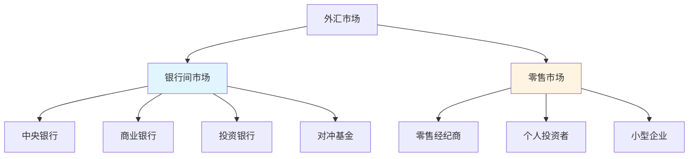
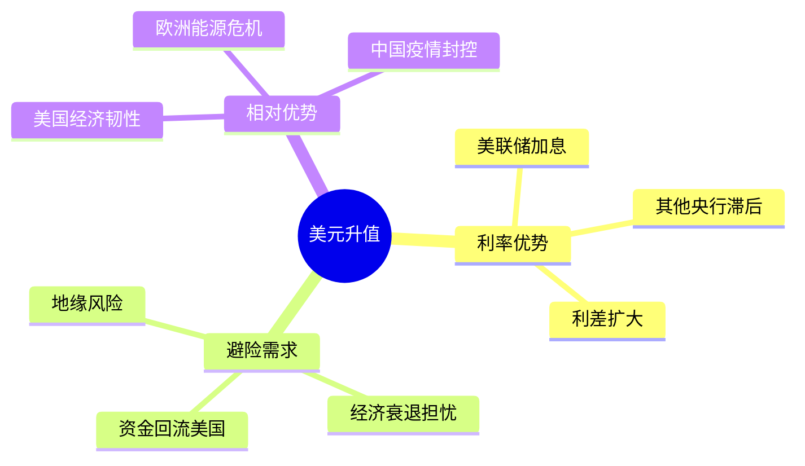

# 货币交易：外汇市场投资策略

## 概述

外汇市场是全球最大、流动性最强的金融市场，日交易量超过6万亿美元。货币交易不仅是投机工具，更是理解全球经济格局、资本流动和政策博弈的窗口。成功的货币交易需要深入理解宏观经济、货币政策和地缘政治。

**学习目标**：
- 理解外汇市场的结构和运作机制
- 掌握汇率决定的主要因素
- 学习主要货币交易策略
- 了解风险管理和头寸管理
- 分析历史上的重大货币事件

**为什么重要**：
货币是全球经济的血液，汇率变动影响贸易、投资和资产价格。理解货币交易不仅有助于直接参与外汇市场，更能帮助投资者理解全球资本流动，优化跨境投资决策。

## 外汇市场基础

### 市场结构



**市场特点**：
- **24小时交易**：跨越全球时区
- **高流动性**：主要货币对点差极小
- **杠杆交易**：通常50-500倍杠杆
- **双向交易**：可做多或做空
- **去中心化**：无集中交易所

### 主要货币对

**主要货币对**（Majors）：
- EUR/USD（欧元/美元）- 交易量最大
- USD/JPY（美元/日元）
- GBP/USD（英镑/美元）
- USD/CHF（美元/瑞士法郎）
- AUD/USD（澳元/美元）
- USD/CAD（美元/加元）
- NZD/USD（纽元/美元）

**交叉货币对**（Crosses）：
- EUR/GBP、EUR/JPY、GBP/JPY等
- 不涉及美元的货币对

**新兴市场货币**：
- USD/CNY（美元/人民币）
- USD/MXN（美元/墨西哥比索）
- USD/BRL（美元/巴西雷亚尔）
- USD/TRY（美元/土耳其里拉）

### 报价机制

**直接报价 vs 间接报价**：

```
EUR/USD = 1.1000
- 基础货币：EUR（欧元）
- 报价货币：USD（美元）
- 含义：1欧元 = 1.10美元
```

**买入价和卖出价**：
- Bid（买入价）：做市商愿意买入的价格
- Ask（卖出价）：做市商愿意卖出的价格
- Spread（点差）：Ask - Bid

**点（Pip）**：
- 汇率变动的最小单位
- 大多数货币对：0.0001
- 日元货币对：0.01

## 汇率决定因素

### 1. 利率差异

**利率平价理论**：

```
预期汇率变动 = 利率差异
```

**机制**：
- 高利率货币吸引资本流入
- 资本流入推高货币价值
- 但预期贬值会抵消利率优势

**套息交易**（Carry Trade）：
- 借入低利率货币
- 投资高利率货币
- 赚取利差
- 风险：汇率逆转


### 2. 经济增长

**相对增长理论**：
- 经济增长强劲→货币升值
- 吸引投资流入
- 提高资产回报预期
- 增强货币需求

**关键指标**：
- GDP增长率
- 就业数据
- 制造业PMI
- 零售销售
- 工业生产

### 3. 通胀差异

**购买力平价**（PPP）：

```
长期汇率 = 两国价格水平比率
```

**机制**：
- 高通胀国家货币贬值
- 维持购买力平衡
- 长期趋势，短期偏离

### 4. 国际收支

**经常账户**：
- 贸易顺差→货币升值压力
- 贸易逆差→货币贬值压力
- 但资本流动更重要

**资本账户**：
- 资本流入→货币升值
- 资本流出→货币贬值
- 短期影响更显著

### 5. 政治和地缘风险

**避险情绪**：
- 风险上升：资金流向避险货币（USD, JPY, CHF）
- 风险下降：资金流向高收益货币（AUD, NZD, 新兴市场）

**政治事件**：
- 选举
- 政策变化
- 地缘冲突
- 贸易谈判

### 6. 央行政策

**货币政策立场**：
- 鹰派（加息倾向）→货币升值
- 鸽派（降息倾向）→货币贬值
- 前瞻指引影响预期

**干预行动**：
- 直接干预：买卖本币
- 口头干预：政策声明
- 效果取决于市场信心

## 主要交易策略

### 1. 趋势跟踪

**策略逻辑**：
- 识别主要趋势
- 顺势交易
- 使用技术指标确认

**工具**：
- 移动平均线
- MACD
- ADX（趋势强度）
- 突破策略

**示例**：
```
EUR/USD上升趋势
- 50日均线上穿200日均线（金叉）
- 价格持续创新高
- 做多EUR/USD
- 止损设在近期低点下方
```

### 2. 区间交易

**策略逻辑**：
- 识别支撑和阻力
- 在区间内高抛低吸
- 适用于震荡市场

**关键点**：
- 明确的支撑/阻力位
- 低波动环境
- 快速止损

### 3. 突破交易

**策略逻辑**：
- 等待关键位突破
- 突破后顺势交易
- 捕捉大趋势起点

**注意事项**：
- 假突破风险
- 需要成交量确认
- 及时止损

### 4. 套息交易（Carry Trade）

**经典策略**：
```
做多高利率货币 / 做空低利率货币
```

**历史案例**：
- 借日元（0%利率）
- 买澳元（4%利率）
- 2003-2007年表现优异
- 2008年崩溃（日元暴涨）

**风险**：
- 汇率逆转风险
- 流动性风险
- 政策变化风险

**适用条件**：
- 低波动环境
- 稳定的利差
- 风险偏好上升

### 5. 新闻交易

**策略逻辑**：
- 交易重要经济数据发布
- 捕捉短期波动
- 高风险高回报

**关键数据**：
- 非农就业报告（美国）
- CPI通胀数据
- GDP数据
- 央行利率决议
- PMI数据

**执行方法**：
- 预期交易：提前建仓
- 反应交易：数据后快速进场
- 需要快速执行能力

### 6. 宏观主题交易

**策略逻辑**：
- 基于宏观经济判断
- 长期持有（数月至数年）
- 大趋势交易

**示例主题**：
- **美元走弱**（2020-2021）：
  - 美联储大放水
  - 财政赤字扩大
  - 做空USD，做多EUR, AUD

- **日元升值**（2008）：
  - 套息交易平仓
  - 避险需求
  - 做多JPY

## 风险管理

### 头寸管理

**仓位规模**：
```
风险金额 = 账户资金 × 风险百分比
仓位大小 = 风险金额 / (入场价 - 止损价)
```

**示例**：
```
账户：$100,000
风险：2%（$2,000）
EUR/USD入场：1.1000
止损：1.0950（50点）
仓位：$2,000 / 0.0050 = 40万欧元
```

### 止损策略

**固定点数止损**：
- 设定固定点数（如50点）
- 简单明确
- 不考虑市场波动

**技术止损**：
- 基于支撑/阻力
- 基于均线
- 基于ATR（平均真实波幅）

**时间止损**：
- 持有一定时间后平仓
- 避免长期套牢
- 适用于短线交易

### 杠杆使用

**杠杆倍数**：
- 零售市场：50-500倍
- 机构市场：10-50倍

**风险**：
- 放大收益也放大损失
- 容易爆仓
- 情绪压力大

**建议**：
- 新手：10倍以下
- 有经验：20-50倍
- 专业：根据策略调整
- 永远不要满仓

### 相关性管理

**货币对相关性**：

| 货币对 | EUR/USD | GBP/USD | USD/JPY | AUD/USD |
|--------|---------|---------|---------|---------|
| EUR/USD | 1.00 | 0.85 | -0.70 | 0.75 |
| GBP/USD | 0.85 | 1.00 | -0.65 | 0.70 |
| USD/JPY | -0.70 | -0.65 | 1.00 | -0.60 |
| AUD/USD | 0.75 | 0.70 | -0.60 | 1.00 |

**风险**：
- 同时持有高相关货币对
- 实际风险敞口被放大
- 分散化失效

**解决**：
- 选择低相关货币对
- 限制相关头寸总量
- 动态监控相关性变化

## 实践案例

### 案例1：2022年美元强势

**背景**：
- 美联储激进加息
- 欧洲能源危机
- 全球经济放缓
- 避险需求上升

**分析**：


**交易策略**：
- 做多USD/EUR
- 做多USD/JPY
- 做多USD/GBP

**结果**：
- EUR/USD从1.15跌至0.95（-17%）
- USD/JPY从115升至150（+30%）
- 美元指数上涨15%

**关键因素**：
- 正确判断美联储政策
- 识别欧洲弱势
- 把握避险情绪

### 案例2：2015年瑞郎黑天鹅

**背景**：
- 瑞士央行维持EUR/CHF 1.20下限
- 市场认为下限不可破
- 大量套息交易

**事件**（2015年1月15日）：
- 瑞士央行突然取消下限
- EUR/CHF暴跌30%
- 多家经纪商破产

**教训**：
- 不要依赖政策承诺
- 控制杠杆
- 分散风险
- 黑天鹅随时可能发生

### 案例3：2016年英镑闪崩

**背景**：
- 英国脱欧公投
- 市场预期留欧
- GBP/USD在1.50附近

**事件**（2016年6月24日）：
- 脱欧派意外获胜
- GBP/USD暴跌10%至1.32
- 10月7日闪崩至1.18

**交易机会**：
- 公投前做空英镑（高风险）
- 闪崩后抄底（需要勇气）
- 长期做空英镑（趋势交易）

**启示**：
- 政治事件影响巨大
- 市场预期可能错误
- 波动中有机会也有风险

## 技术分析工具

### 图表类型

**K线图**：
- 显示开盘、收盘、最高、最低
- 识别价格模式
- 最常用

**线图**：
- 只显示收盘价
- 简洁清晰
- 适合长期趋势

### 技术指标

**趋势指标**：
- 移动平均线（MA）
- MACD
- ADX

**震荡指标**：
- RSI（相对强弱指数）
- 随机指标（Stochastic）
- CCI

**成交量指标**：
- OBV（能量潮）
- 成交量加权平均价（VWAP）

### 图表形态

**反转形态**：
- 头肩顶/底
- 双顶/底
- 三重顶/底

**持续形态**：
- 三角形
- 旗形
- 矩形

## 基本面分析

### 经济日历

**重要数据发布**：

**美国**：
- 非农就业（每月第一个周五）
- CPI（每月中旬）
- FOMC会议（每6周）
- GDP（每季度）

**欧元区**：
- ECB利率决议
- 德国IFO指数
- 欧元区PMI

**日本**：
- BOJ政策会议
- Tankan调查
- 贸易数据

### 央行观察

**关键要素**：
- 政策声明措辞变化
- 经济预测更新
- 投票结果（鹰派vs鸽派）
- 新闻发布会问答

**前瞻指引**：
- 未来政策路径
- 条件性承诺
- 影响市场预期

## 常见错误

### 1. 过度杠杆

**问题**：
- 使用过高杠杆
- 小波动导致爆仓
- 情绪失控

**解决**：
- 限制杠杆倍数
- 严格止损
- 保持冷静

### 2. 逆势交易

**问题**：
- 试图抄底摸顶
- 对抗主要趋势
- 频繁止损

**解决**：
- 顺势交易
- 等待确认信号
- 耐心等待机会

### 3. 情绪化交易

**问题**：
- 报复性交易
- 过度自信
- 恐惧和贪婪

**解决**：
- 制定交易计划
- 严格执行
- 记录交易日志
- 定期复盘

### 4. 忽视风险管理

**问题**：
- 不设止损
- 仓位过大
- 过度集中

**解决**：
- 每笔交易设止损
- 控制单笔风险
- 分散投资

## 工具和资源

### 交易平台

**零售平台**：
- MetaTrader 4/5
- cTrader
- TradingView
- Interactive Brokers

**数据和分析**：
- Bloomberg Terminal
- Reuters Eikon
- Forex Factory（经济日历）
- DailyFX（分析和教育）

### 学习资源

**书籍**：
1. 《外汇交易圣经》- 魏强斌
2. 《日本蜡烛图技术》- Steve Nison
3. 《货币战争》- 宋鸿兵
4. 《Trading in the Zone》- Mark Douglas

**网站**：
- BIS（国际清算银行）
- 各国央行官网
- Forex Factory
- Babypips（初学者）

## 延伸阅读

- [全球宏观策略](./global-macro-strategies.html)
- [索罗斯反身性理论](./soros-reflexivity.html)
- [货币政策工具](../../02-economic-foundation/monetary-policy/policy-tools.html)
- [国际收支分析](../../06-macro-framework/global-capital-flows.html)

## 参考文献

1. King, M., & Rime, D. (2010). "The $4 trillion question: what explains FX growth since the 2007 survey?". *BIS Quarterly Review*.
2. Menkhoff, L., et al. (2012). "Currency momentum strategies". *Journal of Financial Economics*, 106(3), 660-684.
3. Burnside, C., et al. (2011). "Carry trade and momentum in currency markets". *Annual Review of Financial Economics*, 3(1), 511-535.
4. Lyons, R. (2001). *The Microstructure Approach to Exchange Rates*. MIT Press.
5. Sarno, L., & Taylor, M. (2002). *The Economics of Exchange Rates*. Cambridge University Press.
6. Galati, G., & Melvin, M. (2004). "Why has FX trading surged? Explaining the 2004 triennial survey". *BIS Quarterly Review*.
7. Evans, M., & Lyons, R. (2002). "Order flow and exchange rate dynamics". *Journal of Political Economy*, 110(1), 170-180.
8. Brunnermeier, M., Nagel, S., & Pedersen, L. (2008). "Carry trades and currency crashes". *NBER Macroeconomics Annual*, 23(1), 313-348.
9. Brealey, R. A., Myers, S. C., & Allen, F. (2020). *Principles of Corporate Finance* (13th ed.). McGraw-Hill.
10. Bodie, Z., Kane, A., & Marcus, A. J. (2021). *Investments* (12th ed.). McGraw-Hill.


## 深度分析

### 核心机制解析

理解本主题需要从多个维度进行系统性分析。以下从理论基础、实践应用和历史验证三个层面展开深度探讨。

**理论基础层面**：本主题的核心逻辑建立在经济学和金融学的基本原理之上。通过对基础理论的深入理解，投资者能够建立起稳固的分析框架，避免被市场短期噪音所干扰。

**实践应用层面**：理论必须与实践相结合才能产生价值。在实际投资决策中，需要将抽象的概念转化为具体的分析工具和决策标准。

**历史验证层面**：金融市场有着丰富的历史记录，通过研究历史案例，我们可以验证理论的有效性，并从中提炼出具有普遍意义的规律。

### 关键影响因素

影响本主题的关键因素可以从以下几个维度进行分析：

1. **宏观经济环境**：利率水平、通货膨胀率、经济增长速度等宏观变量对本主题有着深远影响。在不同的宏观经济周期中，相关指标的表现会呈现出显著差异。

2. **市场结构因素**：市场参与者的构成、信息传播机制、流动性状况等市场结构因素决定了价格发现的效率和准确性。

3. **政策监管环境**：政府政策、监管框架的变化会直接影响相关市场的运作规则和参与者行为。

4. **技术创新驱动**：技术进步不断改变着金融市场的运作方式，从算法交易到区块链技术，每一次技术革新都带来新的机遇和挑战。

5. **全球化与地缘政治**：在全球化背景下，各国市场之间的联动性日益增强，地缘政治风险的影响也越来越不可忽视。

### 量化分析框架

为了更精确地分析和评估，可以采用以下量化框架：

| 分析维度 | 关键指标 | 参考基准 | 分析方法 |
|---------|---------|---------|---------|
| 规模评估 | 绝对值与相对值 | 历史均值 | 趋势分析 |
| 质量评估 | 稳定性指标 | 行业对标 | 横向比较 |
| 风险评估 | 波动率指标 | 风险阈值 | 情景分析 |
| 价值评估 | 估值倍数 | 历史区间 | 回归分析 |

通过系统性地应用上述框架，投资者可以对目标进行全面、客观的评估，从而做出更加理性的投资决策。


## 高级分析与前沿研究

### 学术研究进展

近年来，学术界对本领域的研究取得了重要进展。以下是几个值得关注的研究方向：

**行为金融学视角**：传统金融理论假设市场参与者是完全理性的，但行为金融学的研究表明，认知偏差和情绪因素在投资决策中扮演着重要角色。诺贝尔经济学奖得主丹尼尔·卡尼曼（Daniel Kahneman）和理查德·塞勒（Richard Thaler）的研究为我们理解市场非理性行为提供了重要框架。

**因子投资研究**：尤金·法玛（Eugene Fama）和肯尼斯·弗伦奇（Kenneth French）的三因子模型，以及后续发展的五因子模型，为系统性地解释股票收益差异提供了理论基础。这些研究表明，市值、账面市值比、盈利能力和投资模式等因子能够解释大部分股票收益的横截面差异。

**市场微观结构研究**：对市场流动性、价格发现机制和交易成本的深入研究，帮助我们更好地理解市场的运作机制，并为优化交易策略提供指导。

### 实战案例深度解析

**案例一：长期价值创造的典范**

以沃伦·巴菲特（Warren Buffett）的伯克希尔·哈撒韦（Berkshire Hathaway）为例，其长达数十年的卓越投资业绩证明了价值投资理念的有效性。从1965年至今，伯克希尔的账面价值年均增长率约为19.8%，远超同期标普500指数的约10.2%年均回报。

巴菲特的成功秘诀在于：
- 专注于具有持久竞争优势的优质企业
- 以合理价格买入，而非追求最低价格
- 长期持有，让复利效应充分发挥
- 保持充足的安全边际，控制下行风险

**案例二：危机中的机遇识别**

2008年金融危机期间，大多数投资者恐慌性抛售，但少数具有前瞻性的投资者却在危机中发现了历史性的投资机会。约翰·保尔森（John Paulson）通过做空次级抵押贷款相关证券，在危机中获得了约150亿美元的利润，成为金融史上最成功的单笔交易之一。

这个案例告诉我们：
- 深入的基本面研究能够发现市场定价错误
- 逆向思维往往能够发现被市场忽视的机会
- 风险管理和仓位控制是成功的关键

### 跨市场比较分析

不同市场在结构、监管、投资者构成等方面存在显著差异，这些差异对投资策略的选择有重要影响：

**美国市场特征**：
- 机构投资者主导，市场效率较高
- 信息披露制度完善，分析师覆盖广泛
- 衍生品市场发达，对冲工具丰富
- 长期牛市历史，但也经历过多次重大调整

**中国市场特征**：
- 散户投资者比例较高，市场波动性较大
- 政策因素影响显著，需要密切关注监管动向
- 新兴行业发展迅速，成长投资机会丰富
- A股、港股、美股中概股形成多层次市场体系

**欧洲市场特征**：
- 价值股比例较高，估值相对保守
- 受地缘政治和欧元区政策影响较大
- 部分行业（如奢侈品、工业）具有全球竞争优势
- ESG投资理念推广较为领先


## 实用工具与操作指南

### 分析工具推荐

**数据获取工具**：
- **Bloomberg Terminal**：专业级金融数据平台，提供实时行情、历史数据、新闻资讯等全方位服务，是机构投资者的首选工具
- **Wind资讯（万得）**：中国最权威的金融数据平台，覆盖A股、债券、基金等全市场数据
- **FactSet**：提供全球股票、固定收益、另类投资等多资产类别的综合数据服务
- **免费替代方案**：Yahoo Finance、Google Finance、东方财富、同花顺等提供基础数据服务

**分析软件工具**：
- **Excel/Python**：用于财务模型构建、数据分析和可视化
- **Tableau/Power BI**：用于数据可视化和仪表板创建
- **R语言**：适合统计分析和量化研究

### 实操步骤指南

**第一步：信息收集**
1. 获取目标公司/资产的基本信息和历史数据
2. 收集行业报告和竞争对手数据
3. 整理宏观经济背景信息
4. 查阅相关学术研究和专业分析报告

**第二步：定量分析**
1. 建立财务模型，计算关键指标
2. 进行历史趋势分析
3. 与同行业公司进行横向比较
4. 构建估值模型，计算合理价值区间

**第三步：定性分析**
1. 评估竞争优势和护城河
2. 分析管理层质量和公司治理
3. 识别主要风险因素
4. 评估行业发展趋势

**第四步：综合判断**
1. 整合定量和定性分析结果
2. 进行情景分析（乐观/基准/悲观）
3. 确定投资论点和关键假设
4. 制定投资决策和风险管理方案

### 常见错误与规避方法

| 常见错误 | 产生原因 | 规避方法 |
|---------|---------|---------|
| 过度依赖历史数据 | 忽视结构性变化 | 结合前瞻性分析 |
| 锚定效应 | 过度依赖初始信息 | 定期重新评估假设 |
| 确认偏误 | 只寻找支持观点的证据 | 主动寻找反驳证据 |
| 过度自信 | 高估自身分析能力 | 保持谦逊，设置安全边际 |
| 忽视流动性风险 | 只关注收益不关注风险 | 全面评估风险因素 |

