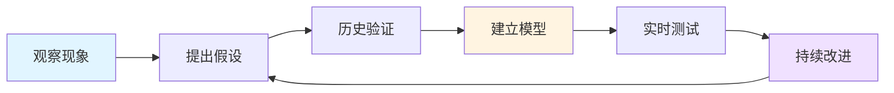
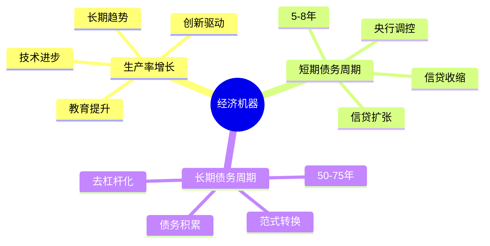
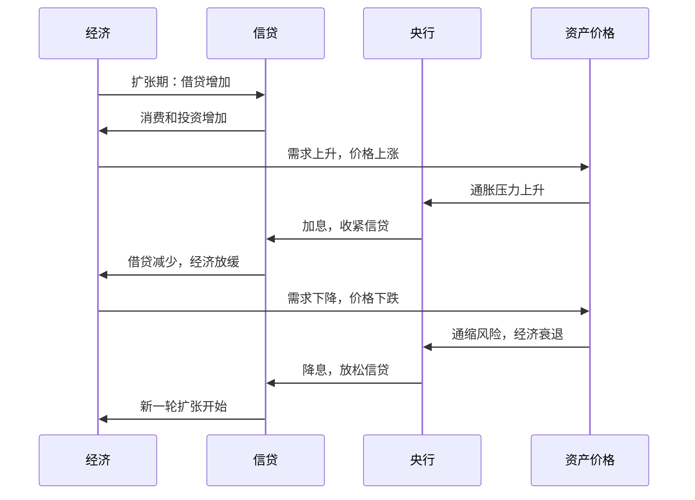
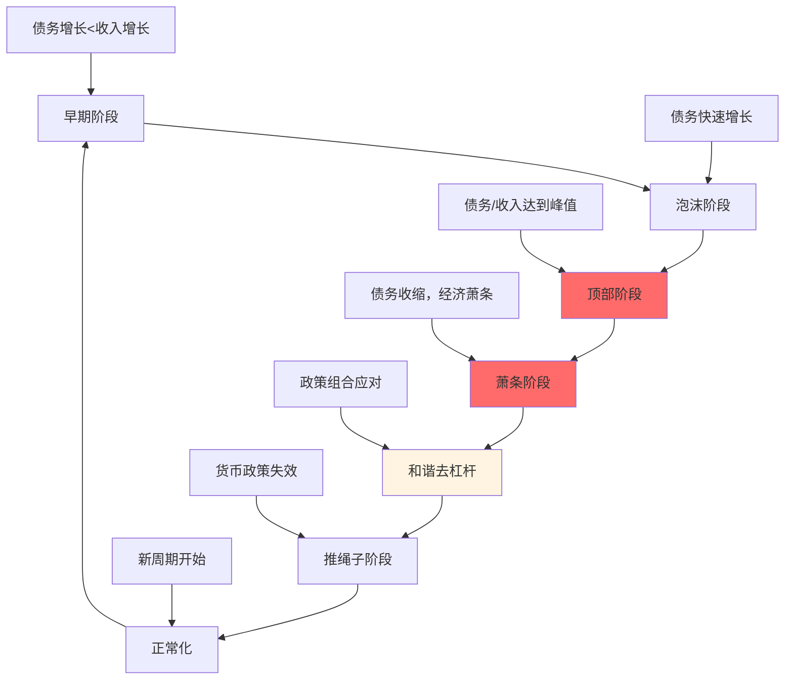
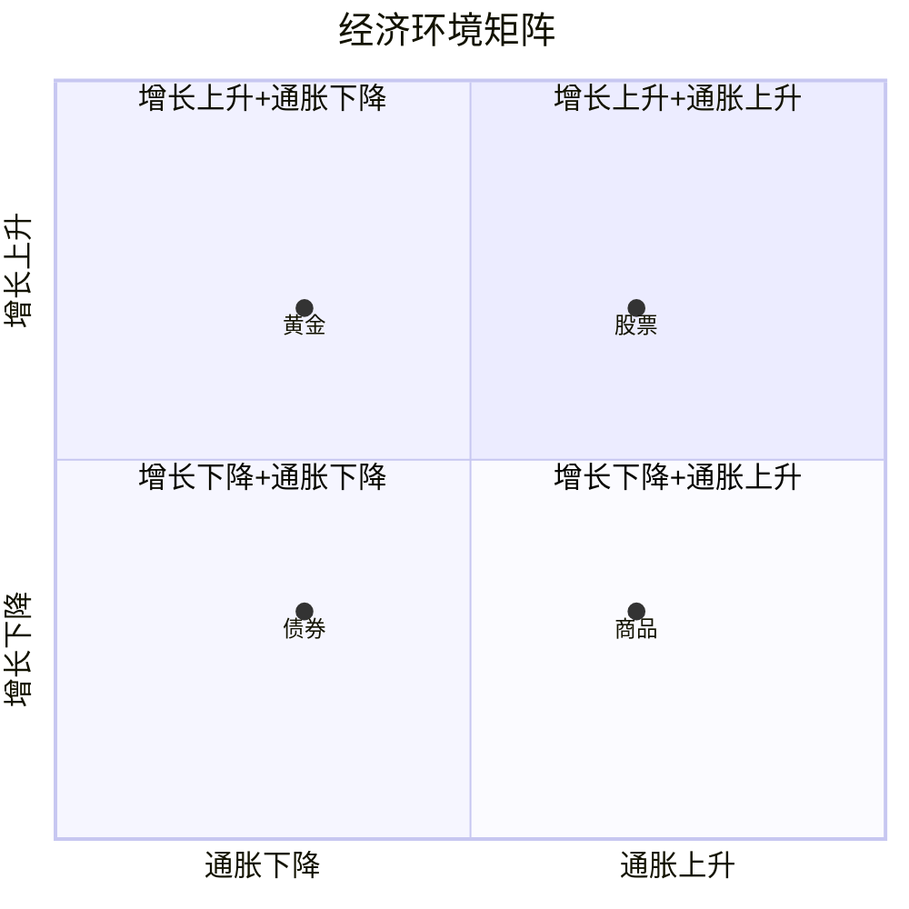
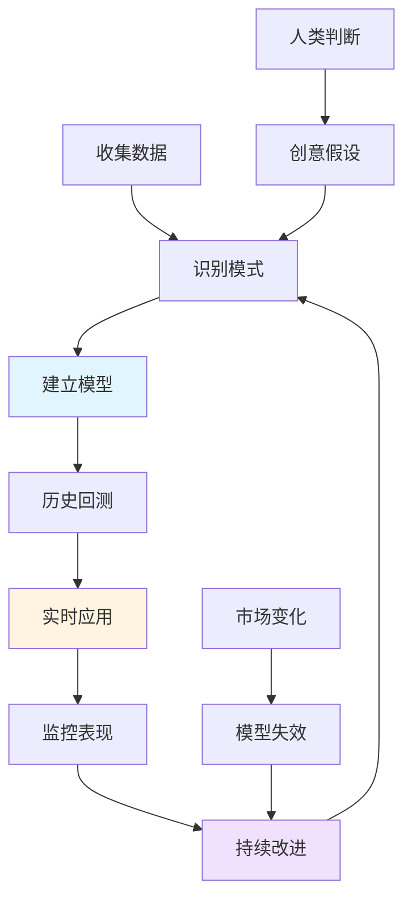

# 达里奥投资原则：经济机器与全天候策略

## 概述

瑞·达里奥（Ray Dalio）是桥水基金（Bridgewater Associates）创始人，管理资产规模超过1500亿美元，是全球最成功的宏观投资者之一。他的投资哲学建立在对经济运行机制的深刻理解之上，强调系统化思维、风险平衡和长期视角。

**学习目标**：
- 理解达里奥的"经济机器"运作原理
- 掌握All Weather（全天候）投资组合的构建逻辑
- 深入学习债务周期理论及其投资应用
- 了解桥水基金的投资决策流程
- 学会将达里奥原则应用到实际投资中

**为什么重要**：
达里奥的投资框架不仅帮助桥水基金在过去40年持续创造超额收益，更重要的是提供了一套系统化理解经济和市场的方法论。他的"原则"（Principles）和债务周期研究已成为机构投资者的必读材料。

## 核心投资哲学

### 1. 极度求真和极度透明

**核心理念**：
- 追求真相，而非自我感觉良好
- 承认自己不知道的事情
- 建立系统化的决策流程
- 通过数据和历史验证假设

**投资应用**：


### 2. 理解经济机器的运作

达里奥认为经济就像一台机器，由简单的零件和简单的交易组成，理解这台机器的运作原理是成功投资的基础。

### 3. 平衡风险而非预测未来

**关键洞察**：
- 未来不可精确预测
- 但可以构建在各种情景下都能表现良好的组合
- 通过分散化和风险平衡降低不确定性

## 经济机器运作原理

### 三大驱动力

达里奥将经济运行归结为三个主要驱动力：



### 1. 生产率增长（长期趋势）

**特征**：
- 时间跨度：几十年甚至上百年
- 驱动因素：技术进步、教育、创新
- 增长率：发达国家约2-3%/年
- 影响：决定长期生活水平提升

**投资含义**：
- 长期股票回报的基础
- 不同国家生产率差异决定长期投资回报差异
- 技术革命带来的投资机会

### 2. 短期债务周期（5-8年）

**运作机制**：



**四个阶段**：

1. **扩张期**：
   - 信贷宽松，借贷容易
   - 消费和投资增加
   - 经济增长加速
   - 资产价格上涨

2. **繁荣期**：
   - 经济过热
   - 通胀上升
   - 央行开始加息
   - 信贷成本上升

3. **收缩期**：
   - 信贷收紧
   - 消费和投资减少
   - 经济增长放缓
   - 资产价格下跌

4. **衰退期**：
   - 经济衰退
   - 失业率上升
   - 央行降息刺激
   - 为下一轮扩张做准备

**投资策略**：
- 扩张期：超配股票和风险资产
- 繁荣期：开始降低风险敞口
- 收缩期：增加债券和防御性资产
- 衰退期：准备重新配置风险资产

### 3. 长期债务周期（50-75年）

**核心机制**：

债务相对于收入的比率长期上升，最终达到无法持续的水平，引发去杠杆化。

**周期阶段**：



**历史案例**：
- 1930年代大萧条
- 1980年代拉美债务危机
- 1990年代日本泡沫破裂
- 2008年全球金融危机
- 2010年代欧债危机

### 去杠杆化的四种方式

达里奥识别出四种去杠杆化方式，成功的去杠杆需要平衡使用：

1. **紧缩**（Austerity）
   - 减少支出
   - 痛苦但必要
   - 过度紧缩导致通缩螺旋

2. **债务违约/重组**（Debt Defaults/Restructuring）
   - 减少债务负担
   - 对债权人造成损失
   - 破坏信用体系

3. **财富再分配**（Wealth Redistribution）
   - 从富人向穷人转移
   - 通过税收实现
   - 可能抑制生产积极性

4. **印钞**（Money Printing）
   - 央行购买资产
   - 降低实际债务负担
   - 风险是通胀失控

**和谐去杠杆**：

最佳结果是平衡使用四种方式，使名义GDP增长率略高于名义利率，实现"和谐去杠杆"。

**投资含义**：
- 识别长期债务周期位置至关重要
- 在债务周期后期降低风险
- 去杠杆期间现金和黄金表现较好
- 关注政策组合的有效性

## All Weather（全天候）投资组合

### 核心理念

All Weather组合的设计目标是在所有经济环境下都能获得稳定的正回报，而不是预测哪种环境会发生。

**四种经济环境**：



### 资产配置逻辑

**四种环境下的资产表现**：

| 环境 | 增长↑通胀↓ | 增长↑通胀↑ | 增长↓通胀↓ | 增长↓通胀↑ |
|------|-----------|-----------|-----------|-----------|
| 股票 | ✓✓ | ✓ | ✗ | ✗✗ |
| 债券 | ✓ | ✗ | ✓✓ | ✗ |
| 商品 | ✗ | ✓✓ | ✗✗ | ✓ |
| 黄金 | ✗ | ✓ | ✓ | ✓✓ |
| 现金 | → | ✗ | ✓ | ✗ |

### 标准All Weather配置

**经典配置**（风险平价）：

```
30% 股票
40% 长期国债
15% 中期国债
7.5% 商品
7.5% 黄金
```

**配置原理**：

1. **风险平衡**：
   - 每种资产贡献相等的风险
   - 不是按金额平均分配
   - 债券波动率低，所以配置比例高

2. **环境分散**：
   - 每种经济环境都有表现良好的资产
   - 不依赖对未来的预测
   - 降低组合整体波动

3. **杠杆使用**：
   - 原始版本使用适度杠杆
   - 提升低波动资产（债券）的回报
   - 在保持低波动的同时提高收益

### 历史表现

**回测数据**（1984-2023）：
- 年化回报：约9-10%
- 年化波动率：约10-12%
- 最大回撤：约-15%（2008年）
- 夏普比率：约0.7-0.8

**对比传统60/40组合**：
- 回报相近或略低
- 波动率显著更低
- 回撤更小
- 在危机中表现更稳健

### 实施要点

**1. 再平衡**：
- 定期（如每季度）再平衡
- 保持目标配置比例
- 自动实现"低买高卖"

**2. 成本控制**：
- 使用低成本ETF
- 减少交易频率
- 注意税收影响

**3. 个人化调整**：
- 根据风险承受能力调整
- 考虑投资期限
- 结合其他投资目标

**简化版本**（无杠杆，适合个人投资者）：

```
40% 全球股票ETF
40% 长期国债ETF
10% 商品ETF
10% 黄金ETF
```

## 投资决策流程

### 桥水的系统化方法



### 关键原则

**1. 系统化决策**：
- 将投资逻辑编码为规则
- 减少情绪影响
- 可回测和验证
- 持续优化

**2. 多样化**：
- 15-20个不相关的回报流
- 降低组合风险80%
- "圣杯"不是找到最好的投资，而是找到不相关的好投资

**3. 风险管理**：
- 关注风险而非回报
- 使用风险预算
- 设置止损机制
- 压力测试

**4. 创意择优**（Idea Meritocracy）：
- 最好的想法胜出
- 不论来自谁
- 通过数据和逻辑验证
- 集体智慧

## 债务周期投资策略

### 识别周期位置

**关键指标**：

1. **债务负担**：
   - 债务/GDP比率
   - 债务偿还/收入比率
   - 趋势和加速度

2. **债务增长**：
   - 信贷增长率
   - 相对于GDP增长
   - 私人部门vs公共部门

3. **资产价格**：
   - 相对于历史水平
   - 相对于收入和GDP
   - 泡沫指标

4. **政策空间**：
   - 利率水平
   - 央行资产负债表
   - 财政赤字和债务

### 不同阶段的投资策略

**早期阶段**（债务健康）：
- 配置：股票为主
- 逻辑：经济增长强劲，债务可持续
- 风险：相对较低

**中期阶段**（债务上升）：
- 配置：平衡配置
- 逻辑：增长持续但债务积累
- 风险：中等，需要监控

**后期阶段**（债务过高）：
- 配置：降低风险资产
- 逻辑：债务不可持续，危机风险上升
- 风险：高，需要防御

**危机阶段**（去杠杆）：
- 配置：现金、黄金、优质债券
- 逻辑：资产价格下跌，流动性为王
- 风险：极高，保护资本

**复苏阶段**（去杠杆后）：
- 配置：逐步增加风险资产
- 逻辑：估值低，政策支持
- 风险：降低，机会增加

## 实践案例

### 案例1：2008年金融危机

**达里奥的判断**（2007年）：
- 美国房地产泡沫
- 债务水平过高
- 金融系统脆弱
- 长期债务周期接近顶部

**桥水的应对**：
- 2007年开始降低风险敞口
- 增加黄金和国债配置
- 做空次贷相关资产
- 保持充足流动性

**结果**：
- 2008年Pure Alpha基金回报+9.5%
- 同期标普500下跌-37%
- All Weather基金回报-3.9%（远好于市场）

**关键决策**：
1. 提前识别债务周期风险
2. 系统化风险管理
3. 多样化配置降低损失
4. 危机中保持纪律

### 案例2：2020年疫情危机

**初期判断**（2020年2-3月）：
- 疫情冲击导致经济急停
- 但不是债务周期问题
- 政策空间充足
- 危机是暂时的

**桥水的应对**：
- 短期：降低风险，保持流动性
- 中期：预判政策反应（大规模刺激）
- 长期：增加通胀对冲资产

**结果**：
- Pure Alpha基金2020年回报+12.1%
- All Weather基金回报+9.7%
- 成功把握了政策驱动的复苏

**关键洞察**：
1. 区分债务危机和外生冲击
2. 理解政策反应函数
3. 快速调整配置
4. 把握复苏机会

## 达里奥的投资智慧

### 核心语录

> "我不知道未来会怎样，但我知道如何应对任何可能发生的情况。"

> "多样化是唯一的免费午餐。"

> "痛苦+反思=进步"

> "不要让自己的观点阻碍你看到现实。"

> "最大的错误是不知道自己不知道。"

### 关键原则总结

1. **理解经济机器**：
   - 经济运行有规律可循
   - 历史会重演但不会完全相同
   - 理解因果关系

2. **平衡风险**：
   - 不要预测，要准备
   - 构建全天候组合
   - 多样化是关键

3. **系统化思维**：
   - 将经验转化为原则
   - 建立决策系统
   - 持续改进

4. **谦逊和开放**：
   - 承认不确定性
   - 寻求不同观点
   - 从错误中学习

5. **长期视角**：
   - 关注长期趋势
   - 理解周期
   - 耐心等待

## 如何应用达里奥原则

### 个人投资者的实践步骤

**步骤1：建立经济理解**
- 学习经济机器原理
- 追踪关键经济指标
- 理解当前周期位置

**步骤2：构建全天候组合**
- 根据风险承受能力调整
- 使用低成本ETF实施
- 定期再平衡

**步骤3：系统化决策**
- 制定投资原则
- 记录决策过程
- 定期复盘

**步骤4：风险管理**
- 设定风险预算
- 分散投资
- 避免过度集中

**步骤5：持续学习**
- 阅读桥水研究
- 学习历史案例
- 改进投资框架

### 常见误区

**误区1：完全照搬All Weather**
- 问题：忽视个人情况
- 解决：根据目标和风险承受能力调整

**误区2：过度依赖模型**
- 问题：忽视常识和判断
- 解决：结合系统和人类智慧

**误区3：短期评估**
- 问题：All Weather是长期策略
- 解决：至少5-10年视角

**误区4：忽视成本**
- 问题：频繁交易和高费用
- 解决：使用低成本工具，减少交易

## 延伸阅读

**达里奥著作**：
1. 《原则》（Principles）- 生活和工作原则
2. 《债务危机》（Big Debt Crises）- 债务周期详解
3. 《变化中的世界秩序》（Principles for Dealing with the Changing World Order）- 大国兴衰

**相关主题**：
- [债务周期理论](../../06-macro-framework/debt-cycles.html)
- [风险平价策略](../asset-allocation/risk-parity.html)
- [经济周期分析](../../02-economic-foundation/economic-cycles/cycle-overview.html)
- [全球宏观策略](./global-macro-strategies.html)

**视频资源**：
- "How the Economic Machine Works" - 达里奥30分钟动画
- "Principles for Success" - 达里奥原则系列

## 参考文献

1. Dalio, R. (2017). *Principles: Life and Work*. Simon & Schuster.
2. Dalio, R. (2018). *A Template for Understanding Big Debt Crises*. Bridgewater Associates.
3. Dalio, R. (2021). *Principles for Dealing with the Changing World Order*. Avid Reader Press.
4. Bridgewater Associates. (2012). "How the Economic Machine Works". Research Paper.
5. Bridgewater Associates. (2020). "The All Weather Strategy". Investment Report.
6. Bridgewater Associates. (2023). "Daily Observations". Research Series.
7. Housel, M. (2020). "The Psychology of Money". Harriman House.
8. Marks, H. (2011). "The Most Important Thing". Columbia Business School Publishing.
9. Swensen, D. (2009). "Pioneering Portfolio Management". Free Press.
10. Asness, C., Frazzini, A., & Pedersen, L. (2012). "Leverage Aversion and Risk Parity". *Financial Analysts Journal*, 68(1), 47-59.


## 深度分析

### 核心机制解析

理解本主题需要从多个维度进行系统性分析。以下从理论基础、实践应用和历史验证三个层面展开深度探讨。

**理论基础层面**：本主题的核心逻辑建立在经济学和金融学的基本原理之上。通过对基础理论的深入理解，投资者能够建立起稳固的分析框架，避免被市场短期噪音所干扰。

**实践应用层面**：理论必须与实践相结合才能产生价值。在实际投资决策中，需要将抽象的概念转化为具体的分析工具和决策标准。

**历史验证层面**：金融市场有着丰富的历史记录，通过研究历史案例，我们可以验证理论的有效性，并从中提炼出具有普遍意义的规律。

### 关键影响因素

影响本主题的关键因素可以从以下几个维度进行分析：

1. **宏观经济环境**：利率水平、通货膨胀率、经济增长速度等宏观变量对本主题有着深远影响。在不同的宏观经济周期中，相关指标的表现会呈现出显著差异。

2. **市场结构因素**：市场参与者的构成、信息传播机制、流动性状况等市场结构因素决定了价格发现的效率和准确性。

3. **政策监管环境**：政府政策、监管框架的变化会直接影响相关市场的运作规则和参与者行为。

4. **技术创新驱动**：技术进步不断改变着金融市场的运作方式，从算法交易到区块链技术，每一次技术革新都带来新的机遇和挑战。

5. **全球化与地缘政治**：在全球化背景下，各国市场之间的联动性日益增强，地缘政治风险的影响也越来越不可忽视。

### 量化分析框架

为了更精确地分析和评估，可以采用以下量化框架：

| 分析维度 | 关键指标 | 参考基准 | 分析方法 |
|---------|---------|---------|---------|
| 规模评估 | 绝对值与相对值 | 历史均值 | 趋势分析 |
| 质量评估 | 稳定性指标 | 行业对标 | 横向比较 |
| 风险评估 | 波动率指标 | 风险阈值 | 情景分析 |
| 价值评估 | 估值倍数 | 历史区间 | 回归分析 |

通过系统性地应用上述框架，投资者可以对目标进行全面、客观的评估，从而做出更加理性的投资决策。


## 高级分析与前沿研究

### 学术研究进展

近年来，学术界对本领域的研究取得了重要进展。以下是几个值得关注的研究方向：

**行为金融学视角**：传统金融理论假设市场参与者是完全理性的，但行为金融学的研究表明，认知偏差和情绪因素在投资决策中扮演着重要角色。诺贝尔经济学奖得主丹尼尔·卡尼曼（Daniel Kahneman）和理查德·塞勒（Richard Thaler）的研究为我们理解市场非理性行为提供了重要框架。

**因子投资研究**：尤金·法玛（Eugene Fama）和肯尼斯·弗伦奇（Kenneth French）的三因子模型，以及后续发展的五因子模型，为系统性地解释股票收益差异提供了理论基础。这些研究表明，市值、账面市值比、盈利能力和投资模式等因子能够解释大部分股票收益的横截面差异。

**市场微观结构研究**：对市场流动性、价格发现机制和交易成本的深入研究，帮助我们更好地理解市场的运作机制，并为优化交易策略提供指导。

### 实战案例深度解析

**案例一：长期价值创造的典范**

以沃伦·巴菲特（Warren Buffett）的伯克希尔·哈撒韦（Berkshire Hathaway）为例，其长达数十年的卓越投资业绩证明了价值投资理念的有效性。从1965年至今，伯克希尔的账面价值年均增长率约为19.8%，远超同期标普500指数的约10.2%年均回报。

巴菲特的成功秘诀在于：
- 专注于具有持久竞争优势的优质企业
- 以合理价格买入，而非追求最低价格
- 长期持有，让复利效应充分发挥
- 保持充足的安全边际，控制下行风险

**案例二：危机中的机遇识别**

2008年金融危机期间，大多数投资者恐慌性抛售，但少数具有前瞻性的投资者却在危机中发现了历史性的投资机会。约翰·保尔森（John Paulson）通过做空次级抵押贷款相关证券，在危机中获得了约150亿美元的利润，成为金融史上最成功的单笔交易之一。

这个案例告诉我们：
- 深入的基本面研究能够发现市场定价错误
- 逆向思维往往能够发现被市场忽视的机会
- 风险管理和仓位控制是成功的关键

### 跨市场比较分析

不同市场在结构、监管、投资者构成等方面存在显著差异，这些差异对投资策略的选择有重要影响：

**美国市场特征**：
- 机构投资者主导，市场效率较高
- 信息披露制度完善，分析师覆盖广泛
- 衍生品市场发达，对冲工具丰富
- 长期牛市历史，但也经历过多次重大调整

**中国市场特征**：
- 散户投资者比例较高，市场波动性较大
- 政策因素影响显著，需要密切关注监管动向
- 新兴行业发展迅速，成长投资机会丰富
- A股、港股、美股中概股形成多层次市场体系

**欧洲市场特征**：
- 价值股比例较高，估值相对保守
- 受地缘政治和欧元区政策影响较大
- 部分行业（如奢侈品、工业）具有全球竞争优势
- ESG投资理念推广较为领先

