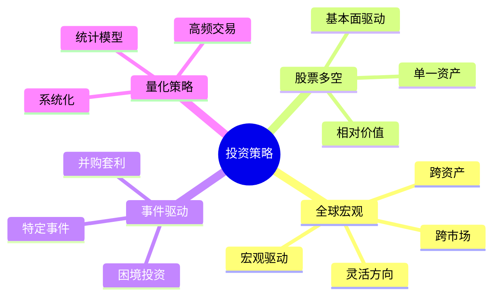
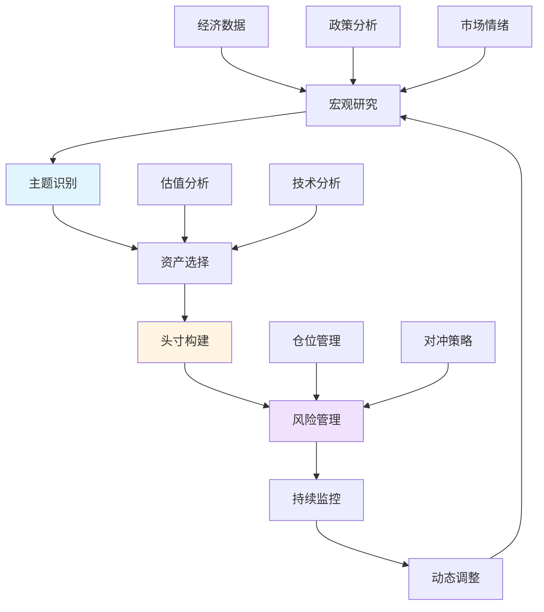

# 全球宏观投资策略：跨市场多资产配置

## 概述

全球宏观投资（Global Macro）是一种基于宏观经济分析，在全球范围内跨资产类别、跨市场进行投资的策略。这种策略不受地域、资产类别或做多做空方向的限制，追求在任何市场环境下都能获得绝对回报。全球宏观是对冲基金最重要的策略之一，代表人物包括索罗斯、达里奥、德鲁肯米勒等传奇投资者。

**学习目标**：
- 理解全球宏观投资的核心理念和框架
- 掌握主要策略类型和实施方法
- 学习顶级宏观基金的投资流程
- 了解风险管理和组合构建
- 分析历史上的经典宏观交易

**为什么重要**：
在全球化和金融市场高度关联的今天，单一市场或资产类别的投资面临越来越大的系统性风险。全球宏观策略通过跨市场配置和灵活调整，能够在不同经济环境下寻找机会，实现风险分散和收益优化。

## 核心理念

### 投资哲学

**1. 宏观驱动**：
- 宏观因素是资产价格的主要驱动力
- 理解经济周期、政策和资本流动
- 自上而下的分析框架

**2. 全球视野**：
- 不受地域限制
- 寻找全球最佳机会
- 理解市场间的联动

**3. 多资产配置**：
- 股票、债券、外汇、商品
- 灵活切换
- 对冲和套利

**4. 绝对回报**：
- 不以基准为目标
- 追求任何环境下的正回报
- 可做多也可做空

**5. 风险管理**：
- 严格控制下行风险
- 动态调整敞口
- 保护资本

### 与其他策略的对比



| 维度 | 全球宏观 | 股票多空 | 事件驱动 | 量化策略 |
|------|---------|---------|---------|---------|
| 资产类别 | 多资产 | 股票为主 | 股票为主 | 多资产 |
| 分析方法 | 宏观分析 | 基本面 | 事件分析 | 统计模型 |
| 持有期 | 数周至数月 | 数月至数年 | 数周至数月 | 数秒至数天 |
| 杠杆 | 中高 | 中 | 低中 | 高 |
| 容量 | 大 | 中 | 小 | 中 |
| 代表人物 | 索罗斯、达里奥 | 格林布拉特 | 保尔森 | 西蒙斯 |

## 策略类型

### 1. 方向性策略（Directional）

**核心逻辑**：
- 判断资产价格方向
- 建立多头或空头头寸
- 赚取价格变动收益

**常见交易**：

**股指期货**：
```
看多经济 → 做多股指期货
看空经济 → 做空股指期货
```

**利率产品**：
```
预期加息 → 做空债券
预期降息 → 做多债券
```

**外汇**：
```
看多美元 → 做多USD/JPY
看空美元 → 做空USD/EUR
```

**商品**：
```
看多通胀 → 做多商品指数
看空需求 → 做空工业金属
```

**案例**：
2022年初判断美联储将激进加息，做空长期国债，获利20%+

### 2. 相对价值策略（Relative Value）

**核心逻辑**：
- 识别相关资产间的价差
- 做多低估，做空高估
- 赚取价差收敛收益
- 降低方向性风险

**常见交易**：

**利率曲线交易**：
```
陡峭化：做多长期债券，做空短期债券
平坦化：做空长期债券，做多短期债券
```

**跨国利差**：
```
做多高利率国家债券
做空低利率国家债券
对冲汇率风险
```

**股指价差**：
```
做多新兴市场股指
做空发达市场股指
```

**案例**：
2020年做多中国国债vs做空美国国债，赚取利差和汇率收益

### 3. 套利策略（Arbitrage）

**核心逻辑**：
- 利用市场定价错误
- 同时买卖相关资产
- 锁定无风险或低风险收益

**常见套利**：

**跨市场套利**：
```
同一资产在不同市场的价差
例如：A股vs H股
```

**跨期套利**：
```
不同到期日合约的价差
例如：近月vs远月期货
```

**跨品种套利**：
```
相关商品的价差
例如：原油裂解价差
```

### 4. 事件驱动策略（Event-Driven）

**核心逻辑**：
- 交易特定宏观事件
- 央行会议、选举、公投
- 捕捉事件前后的波动

**常见事件**：

**央行政策**：
- 利率决议
- QE启动/退出
- 前瞻指引变化

**政治事件**：
- 选举
- 公投（如英国脱欧）
- 政策变化

**地缘政治**：
- 贸易战
- 制裁
- 军事冲突

**案例**：
2016年英国脱欧公投，做空英镑，获利15%+

### 5. 趋势跟踪策略（Trend Following）

**核心逻辑**：
- 识别并跟随主要趋势
- 顺势交易
- 让利润奔跑

**实施方法**：
- 技术指标（移动平均线、MACD）
- 突破策略
- 动量指标

**适用场景**：
- 明确的宏观趋势
- 低波动环境
- 流动性充足

**案例**：
2020-2021年跟随美元走弱趋势，做空美元指数，年化回报12%

## 投资流程

### 完整框架



### 步骤详解

**步骤1：宏观研究**

**经济分析**：
- 全球经济增长趋势
- 主要经济体对比
- 经济周期位置
- 领先指标变化

**政策分析**：
- 货币政策立场
- 财政政策方向
- 监管政策变化
- 地缘政治风险

**市场分析**：
- 资产价格趋势
- 估值水平
- 市场情绪
- 资金流向

**步骤2：主题识别**

**提炼投资主题**（2-3个核心主题）：

**示例主题**：
- **通胀回归**（2021-2022）
- **美元走弱**（2020-2021）
- **中国复苏**（2023）
- **能源转型**（2020-）
- **去全球化**（2022-）

**主题评估**：
- 确信度：高/中/低
- 时间跨度：短期/中期/长期
- 潜在回报：预期收益
- 风险因素：可能出错的地方

**步骤3：资产选择**

**为每个主题选择最佳表达方式**：

**通胀回归主题**：
- 做多商品（原油、铜）
- 做多通胀保护债券（TIPS）
- 做空长期国债
- 做多能源股

**美元走弱主题**：
- 做空美元指数
- 做多新兴市场货币
- 做多黄金
- 做多新兴市场股票

**步骤4：头寸构建**

**仓位分配**：
```
总风险预算：10%
主题1（高确信度）：5%
主题2（中确信度）：3%
主题3（低确信度）：2%
```

**工具选择**：
- 期货：杠杆、流动性
- 期权：非线性收益、有限风险
- ETF：简单、透明
- 现货：无展期成本

**时机选择**：
- 渐进式建仓
- 等待确认信号
- 技术面配合

**步骤5：风险管理**

**止损设置**：
- 技术止损：关键支撑/阻力
- 百分比止损：5-10%
- 时间止损：持有期限
- 主题止损：逻辑改变

**对冲策略**：
- 尾部风险对冲（买入看跌期权）
- 相关性对冲
- 动态对冲

**压力测试**：
- 极端情景分析
- 最大回撤评估
- 流动性压力测试

**步骤6：持续监控**

**日常监控**：
- 经济数据发布
- 政策声明
- 市场价格变化
- 头寸盈亏

**定期复盘**：
- 每周：回顾主题有效性
- 每月：全面评估组合
- 每季：战略调整

**步骤7：动态调整**

**加仓条件**：
- 主题得到验证
- 价格回调提供机会
- 确信度提升

**减仓条件**：
- 目标价位达到
- 主题逻辑减弱
- 风险收益比恶化

**平仓条件**：
- 主题失效
- 触发止损
- 出现更好机会

## 顶级宏观基金

### 1. 桥水基金（Bridgewater Associates）

**创始人**：瑞·达里奥

**策略特点**：
- 系统化宏观投资
- 风险平价
- All Weather组合
- 长期视角

**核心优势**：
- 深度宏观研究
- 债务周期理论
- 全球配置
- 风险管理

**代表产品**：
- Pure Alpha（主动宏观）
- All Weather（被动配置）

**业绩**：
- 1991-2020年年化回报12%+
- 管理规模$1500亿+

### 2. 量子基金（Quantum Fund）

**创始人**：乔治·索罗斯

**策略特点**：
- 反身性理论
- 高杠杆
- 集中押注
- 灵活机动

**经典交易**：
- 1992年狙击英镑
- 1997年亚洲金融危机
- 2008年做空金融股

**业绩**：
- 1969-2000年年化回报30%+
- 多次单年回报超过50%

### 3. 都铎投资（Tudor Investment）

**创始人**：保罗·都铎·琼斯

**策略特点**：
- 技术分析+宏观分析
- 趋势跟踪
- 严格风险控制
- 快速反应

**经典交易**：
- 1987年预测股灾
- 做空获利200%+

**业绩**：
- 1980-2020年年化回报20%+
- 极少亏损年份

### 4. 千禧管理（Millennium Management）

**创始人**：伊兹·英格兰

**策略特点**：
- 多策略平台
- 严格风险控制
- 团队化运作
- 高频率调整

**业绩**：
- 1989-2020年年化回报13%+
- 管理规模$500亿+

## 实践案例

### 案例1：2008年金融危机

**宏观判断**（2007年）：
- 美国房地产泡沫
- 次贷风险积累
- 金融系统脆弱
- 信贷周期见顶

**投资主题**：
1. 房地产崩溃
2. 金融系统危机
3. 经济衰退
4. 避险需求

**头寸构建**：
- 做空次贷CDO
- 做空金融股
- 做空房地产股
- 做多国债
- 做多黄金

**代表基金**：
- 保尔森基金：+590%（2007）
- 桥水Pure Alpha：+9.5%（2008）

**关键成功因素**：
- 提前识别系统性风险
- 深入研究次贷结构
- 坚持逻辑不动摇
- 严格风险管理

### 案例2：2020年疫情交易

**阶段1：恐慌期**（2020年2-3月）

**判断**：
- 疫情冲击经济
- 流动性危机
- 政策将大力救助

**交易**：
- 做空股指（2月）
- 做多波动率（VIX）
- 做多美元（避险）
- 做多黄金

**阶段2：复苏期**（2020年4-12月）

**判断**：
- 史无前例的刺激
- 流动性泛滥
- 经济将V型复苏
- 通胀预期上升

**交易**：
- 做多股票（4月）
- 做空美元
- 做多商品
- 做多新兴市场

**结果**：
- 灵活调整的基金年回报20-40%
- 固守方向的基金亏损或微利

**启示**：
- 快速适应环境变化
- 理解政策反应函数
- 保持灵活性
- 及时调整头寸

### 案例3：2022年通胀交易

**宏观判断**（2021年底-2022年初）：
- 通胀持续高企
- 美联储将激进加息
- 经济增长放缓
- 估值压缩

**投资主题**：
1. 加息周期
2. 通胀持续
3. 增长放缓
4. 美元走强

**头寸构建**：
- 做空长期国债
- 做多美元
- 做多能源
- 做空高估值科技股
- 做多价值股

**结果**：
- 能源+50%
- 美元指数+15%
- 长期国债-30%
- 科技股-40%

**成功基金**：
- 正确判断通胀粘性
- 提前布局能源
- 及时做空债券
- 年回报20-30%

## 风险管理

### 组合层面

**风险预算**：
```
总风险：年化波动率15%
股票风险：5%
债券风险：3%
外汇风险：4%
商品风险：3%
```

**相关性管理**：
- 监控资产间相关性
- 避免过度集中
- 危机时相关性趋于1

**流动性管理**：
- 保持充足现金
- 避免流动性差的资产
- 压力情景下的退出能力

### 头寸层面

**仓位限制**：
- 单一头寸：不超过总资产5%
- 单一主题：不超过总资产15%
- 单一资产类别：不超过总资产30%

**止损纪律**：
- 预设止损点
- 严格执行
- 不抱幻想
- 及时认错

**杠杆控制**：
- 总杠杆：2-4倍
- 根据波动率调整
- 危机时降低杠杆
- 保持安全边际

### 心理管理

**情绪控制**：
- 避免过度自信
- 不要报复性交易
- 保持冷静客观
- 接受不确定性

**纪律执行**：
- 遵循交易计划
- 不随意改变策略
- 记录交易日志
- 定期复盘

## 个人投资者应用

### 简化版全球宏观策略

**步骤1：宏观判断**
- 关注主要经济体
- 理解经济周期位置
- 识别1-2个核心主题

**步骤2：资产配置**
- 使用ETF实施
- 跨资产分散
- 定期再平衡

**步骤3：风险控制**
- 限制杠杆（1-2倍）
- 设置止损
- 保持流动性

**示例组合**（2024年）：

**主题**：软着陆+通胀回落

**配置**：
- 40% 全球股票ETF
- 30% 短期国债ETF
- 15% 黄金ETF
- 10% 商品ETF
- 5% 现金

**调整触发**：
- 经济数据显著变化
- 政策立场转变
- 市场估值极端

### 常见错误

**错误1：过度交易**
- 问题：频繁调整
- 后果：高成本，错失趋势
- 解决：坚持主题，减少噪音

**错误2：过度杠杆**
- 问题：杠杆过高
- 后果：小波动导致爆仓
- 解决：控制杠杆，保守为主

**错误3：忽视风险**
- 问题：只看收益
- 后果：黑天鹅事件重创
- 解决：严格风险管理

**错误4：固守观点**
- 问题：不愿认错
- 后果：小错变大错
- 解决：保持灵活，及时调整

## 工具和资源

### 数据和研究

**宏观数据**：
- FRED（美联储经济数据）
- Trading Economics
- IMF、世界银行
- 各国央行网站

**市场数据**：
- Bloomberg Terminal
- Reuters Eikon
- Wind资讯
- TradingView

**研究报告**：
- 桥水Daily Observations
- 高盛全球宏观研究
- 摩根士丹利策略报告
- 中金宏观研究

### 交易工具

**期货**：
- 股指期货
- 利率期货
- 外汇期货
- 商品期货

**ETF**：
- 股票ETF（SPY, EEM）
- 债券ETF（TLT, SHY）
- 商品ETF（GLD, USO）
- 货币ETF（UUP）

**期权**：
- 指数期权
- ETF期权
- 外汇期权

### 学习资源

**书籍**：
1. 《金融炼金术》- 索罗斯
2. 《原则》- 达里奥
3. 《投资最重要的事》- 霍华德·马克斯
4. 《宏观交易》- Greg Coffey

**课程**：
- CFA宏观经济学
- 对冲基金策略课程
- 全球宏观投资研讨会

## 延伸阅读

- [自上而下投资方法](./top-down-approach.html)
- [达里奥投资原则](./dalio-principles.html)
- [索罗斯反身性理论](./soros-reflexivity.html)
- [货币交易策略](./currency-trading.html)
- [商品周期分析](./commodity-cycles.html)
- [经济周期理论](../../02-economic-foundation/economic-cycles/cycle-overview.html)

## 参考文献

1. Soros, G. (2003). *The Alchemy of Finance*. Wiley.
2. Dalio, R. (2017). *Principles: Life and Work*. Simon & Schuster.
3. Druckenmiller, S. (2015). "The Art of Macro Trading". *Sohn Investment Conference*.
4. Jones, P. T. (2000). "Trading Philosophy". *Market Wizards Interview*.
5. Mallaby, S. (2010). *More Money Than God: Hedge Funds and the Making of a New Elite*. Penguin.
6. Fung, W., & Hsieh, D. A. (1997). "Empirical characteristics of dynamic trading strategies: The case of hedge funds". *The Review of Financial Studies*, 10(2), 275-302.
7. Pojarliev, M., & Levich, R. M. (2010). "Trades of the living dead: Style differences, style persistence and performance of currency fund managers". *Journal of International Money and Finance*, 29(8), 1752-1775.
8. Bridgewater Associates. (2020). "How the Economic Machine Works". Research Paper.
9. Goldman Sachs. (2023). "Global Macro Research: Top Trades". Annual Report.
10. Morgan Stanley. (2023). "Global Investment Strategy". Quarterly Update.


## 深度分析

### 核心机制解析

理解本主题需要从多个维度进行系统性分析。以下从理论基础、实践应用和历史验证三个层面展开深度探讨。

**理论基础层面**：本主题的核心逻辑建立在经济学和金融学的基本原理之上。通过对基础理论的深入理解，投资者能够建立起稳固的分析框架，避免被市场短期噪音所干扰。

**实践应用层面**：理论必须与实践相结合才能产生价值。在实际投资决策中，需要将抽象的概念转化为具体的分析工具和决策标准。

**历史验证层面**：金融市场有着丰富的历史记录，通过研究历史案例，我们可以验证理论的有效性，并从中提炼出具有普遍意义的规律。

### 关键影响因素

影响本主题的关键因素可以从以下几个维度进行分析：

1. **宏观经济环境**：利率水平、通货膨胀率、经济增长速度等宏观变量对本主题有着深远影响。在不同的宏观经济周期中，相关指标的表现会呈现出显著差异。

2. **市场结构因素**：市场参与者的构成、信息传播机制、流动性状况等市场结构因素决定了价格发现的效率和准确性。

3. **政策监管环境**：政府政策、监管框架的变化会直接影响相关市场的运作规则和参与者行为。

4. **技术创新驱动**：技术进步不断改变着金融市场的运作方式，从算法交易到区块链技术，每一次技术革新都带来新的机遇和挑战。

5. **全球化与地缘政治**：在全球化背景下，各国市场之间的联动性日益增强，地缘政治风险的影响也越来越不可忽视。

### 量化分析框架

为了更精确地分析和评估，可以采用以下量化框架：

| 分析维度 | 关键指标 | 参考基准 | 分析方法 |
|---------|---------|---------|---------|
| 规模评估 | 绝对值与相对值 | 历史均值 | 趋势分析 |
| 质量评估 | 稳定性指标 | 行业对标 | 横向比较 |
| 风险评估 | 波动率指标 | 风险阈值 | 情景分析 |
| 价值评估 | 估值倍数 | 历史区间 | 回归分析 |

通过系统性地应用上述框架，投资者可以对目标进行全面、客观的评估，从而做出更加理性的投资决策。


## 高级分析与前沿研究

### 学术研究进展

近年来，学术界对本领域的研究取得了重要进展。以下是几个值得关注的研究方向：

**行为金融学视角**：传统金融理论假设市场参与者是完全理性的，但行为金融学的研究表明，认知偏差和情绪因素在投资决策中扮演着重要角色。诺贝尔经济学奖得主丹尼尔·卡尼曼（Daniel Kahneman）和理查德·塞勒（Richard Thaler）的研究为我们理解市场非理性行为提供了重要框架。

**因子投资研究**：尤金·法玛（Eugene Fama）和肯尼斯·弗伦奇（Kenneth French）的三因子模型，以及后续发展的五因子模型，为系统性地解释股票收益差异提供了理论基础。这些研究表明，市值、账面市值比、盈利能力和投资模式等因子能够解释大部分股票收益的横截面差异。

**市场微观结构研究**：对市场流动性、价格发现机制和交易成本的深入研究，帮助我们更好地理解市场的运作机制，并为优化交易策略提供指导。

### 实战案例深度解析

**案例一：长期价值创造的典范**

以沃伦·巴菲特（Warren Buffett）的伯克希尔·哈撒韦（Berkshire Hathaway）为例，其长达数十年的卓越投资业绩证明了价值投资理念的有效性。从1965年至今，伯克希尔的账面价值年均增长率约为19.8%，远超同期标普500指数的约10.2%年均回报。

巴菲特的成功秘诀在于：
- 专注于具有持久竞争优势的优质企业
- 以合理价格买入，而非追求最低价格
- 长期持有，让复利效应充分发挥
- 保持充足的安全边际，控制下行风险

**案例二：危机中的机遇识别**

2008年金融危机期间，大多数投资者恐慌性抛售，但少数具有前瞻性的投资者却在危机中发现了历史性的投资机会。约翰·保尔森（John Paulson）通过做空次级抵押贷款相关证券，在危机中获得了约150亿美元的利润，成为金融史上最成功的单笔交易之一。

这个案例告诉我们：
- 深入的基本面研究能够发现市场定价错误
- 逆向思维往往能够发现被市场忽视的机会
- 风险管理和仓位控制是成功的关键

### 跨市场比较分析

不同市场在结构、监管、投资者构成等方面存在显著差异，这些差异对投资策略的选择有重要影响：

**美国市场特征**：
- 机构投资者主导，市场效率较高
- 信息披露制度完善，分析师覆盖广泛
- 衍生品市场发达，对冲工具丰富
- 长期牛市历史，但也经历过多次重大调整

**中国市场特征**：
- 散户投资者比例较高，市场波动性较大
- 政策因素影响显著，需要密切关注监管动向
- 新兴行业发展迅速，成长投资机会丰富
- A股、港股、美股中概股形成多层次市场体系

**欧洲市场特征**：
- 价值股比例较高，估值相对保守
- 受地缘政治和欧元区政策影响较大
- 部分行业（如奢侈品、工业）具有全球竞争优势
- ESG投资理念推广较为领先

