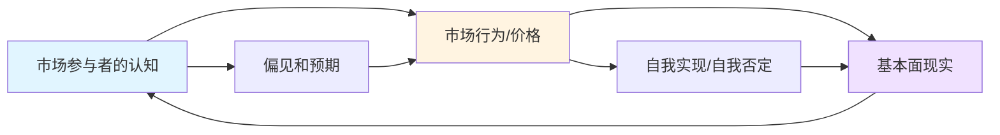
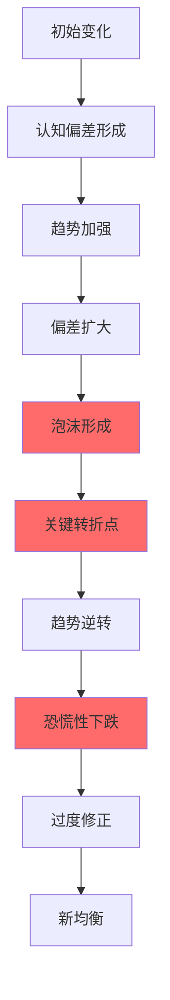
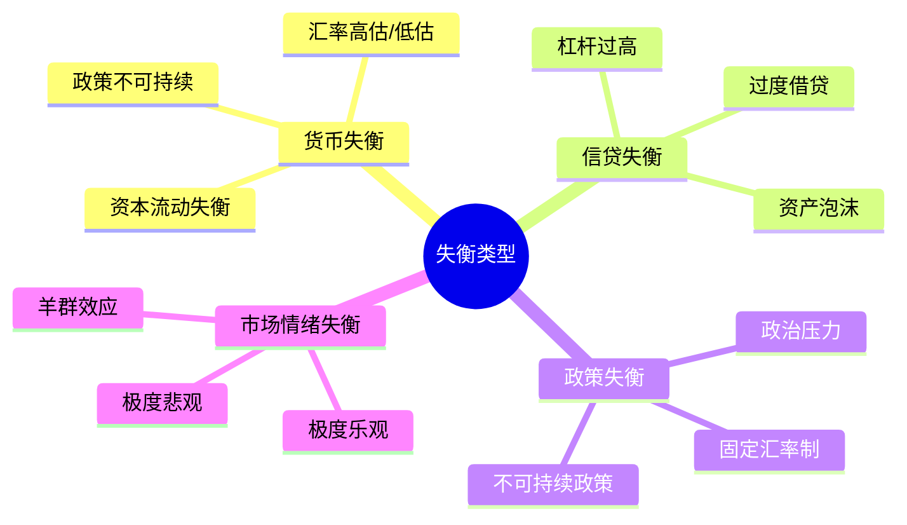
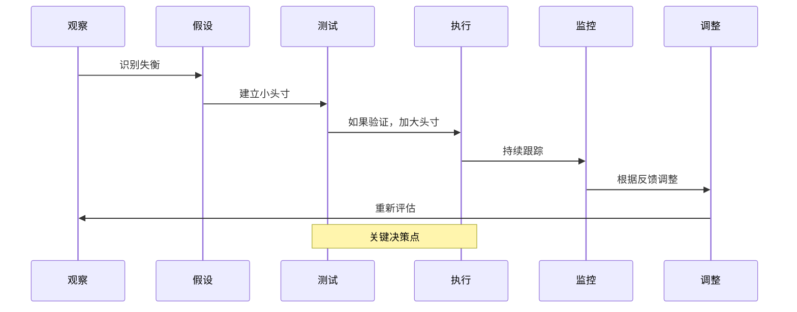
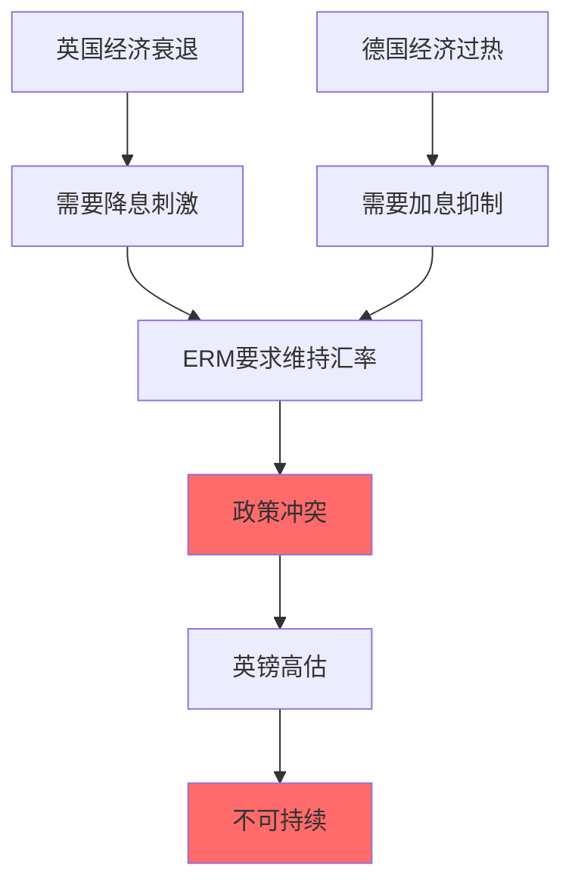

# 索罗斯反身性理论：市场哲学与投机艺术

## 概述

乔治·索罗斯（George Soros）是20世纪最成功的投机者之一，他的量子基金在1969-2000年间年化回报率超过30%。索罗斯的投资哲学建立在"反身性"（Reflexivity）理论之上，这一理论挑战了传统经济学的有效市场假说，揭示了市场参与者的认知和市场现实之间的相互影响机制。

**学习目标**：
- 理解反身性理论的核心概念和哲学基础
- 掌握繁荣-萧条序列的运作机制
- 学习索罗斯的投机策略和风险管理
- 深入分析经典交易案例（英镑狙击战）
- 了解如何识别和利用市场失衡

**为什么重要**：
反身性理论提供了理解市场泡沫、金融危机和极端市场行为的独特视角。它不仅是投资理论，更是一种认识论，帮助我们理解人类认知的局限性和市场的非理性特征。

## 反身性理论核心

### 哲学基础

索罗斯的反身性理论源于卡尔·波普尔（Karl Popper）的开放社会理论和认识论。

**核心观点**：
1. **人类认知的不完美性**：
   - 我们对现实的理解总是不完整和有偏差的
   - 我们的认知受到情绪、偏见和不完整信息的影响
   - 完美的知识是不可能的

2. **参与者和现实的双向影响**：
   - 参与者的认知影响现实（认知函数）
   - 现实反过来影响参与者的认知（参与函数）
   - 两者形成反馈循环

### 反身性机制



**两个函数**：

1. **认知函数**（Cognitive Function）：
   ```
   参与者的认知 = f(现实)
   ```
   - 参与者试图理解现实
   - 但理解总是不完美的
   - 存在认知偏差

2. **参与函数**（Participating Function）：
   ```
   现实 = f(参与者的认知)
   ```
   - 参与者的行为影响现实
   - 预期可以自我实现
   - 形成反馈循环

### 与有效市场假说的对比

| 维度 | 有效市场假说 | 反身性理论 |
|------|-------------|-----------|
| 信息 | 完全反映在价格中 | 不完整且有偏差 |
| 参与者 | 理性 | 有偏见，会犯错 |
| 价格 | 反映基本面 | 影响基本面 |
| 均衡 | 趋向均衡 | 远离均衡 |
| 可预测性 | 不可预测 | 可识别模式 |
| 泡沫 | 不存在 | 必然发生 |

## 繁荣-萧条序列

### 完整周期

索罗斯将反身性过程描述为"繁荣-萧条序列"（Boom-Bust Sequence）：



### 八个阶段详解

**阶段1：未被识别的趋势**
- 基本面出现变化
- 大多数人未注意
- 价格开始缓慢变化
- 例子：互联网早期发展

**阶段2：趋势被识别**
- 一些参与者注意到变化
- 开始建立头寸
- 价格加速上涨
- 媒体开始报道

**阶段3：正反馈加速**
- 更多人加入
- 价格快速上涨
- 基本面改善（自我实现）
- 乐观情绪蔓延

**阶段4：信念形成**
- "这次不一样"的信念
- 忽视风险信号
- 杠杆增加
- 投机盛行

**阶段5：现实检验**
- 基本面开始恶化
- 但价格仍在上涨
- 偏差达到极限
- 警告信号出现

**阶段6：转折点**
- 某个事件触发
- 信心开始动摇
- 价格停止上涨
- 聪明钱开始退出

**阶段7：恐慌性下跌**
- 趋势逆转
- 负反馈循环
- 杠杆平仓
- 流动性枯竭

**阶段8：过度修正**
- 价格跌破合理水平
- 悲观情绪极端
- 为下一轮周期播种
- 价值投资者进场

### 关键特征

**自我强化**：
- 上涨吸引更多买家
- 下跌引发更多卖家
- 趋势自我延续
- 直到不可持续

**非对称性**：
- 上涨缓慢渐进
- 下跌快速剧烈
- "爬楼梯，坐电梯"

**不可预测的转折点**：
- 何时转折难以预测
- 但可以识别脆弱性
- 关注极端情绪和估值

## 索罗斯的投资策略

### 核心原则

**1. 寻找失衡**

索罗斯寻找市场认知与现实之间的巨大偏差：



**2. 测试假设**

- 建立小头寸测试
- 观察市场反应
- 如果正确，加大头寸
- 如果错误，快速退出

**3. 杠杆使用**

- 在高确信度时使用杠杆
- 放大收益
- 但严格控制风险
- 设置止损

**4. 灵活性**

> "重要的不是你对错多少次，而是你对的时候赚多少，错的时候亏多少。"

- 不固守观点
- 快速承认错误
- 及时调整策略
- 保持开放心态

### 投资流程



### 风险管理

**止损原则**：
- 预设最大损失
- 严格执行止损
- 不让小错变大错
- 保护资本

**头寸管理**：
- 根据确信度调整仓位
- 高确信度：大头寸
- 低确信度：小头寸
- 不确定时：观望

**分散与集中**：
- 在不同主题间分散
- 在单一主题内集中
- 避免过度分散
- 保持灵活性

## 经典案例：狙击英镑

### 背景（1992年）

**欧洲汇率机制（ERM）**：
- 欧洲国家货币汇率固定在一定范围内
- 英镑与德国马克挂钩
- 英国承诺维持汇率

**经济失衡**：
- 英国经济衰退，需要降息
- 德国经济过热，需要加息
- 英镑被高估
- 政策冲突不可调和



### 索罗斯的分析

**失衡识别**：
1. **经济基本面**：
   - 英国失业率上升
   - GDP增长疲弱
   - 需要宽松政策

2. **政策约束**：
   - ERM限制货币政策
   - 必须维持高利率
   - 外汇储备有限

3. **政治压力**：
   - 公众反对高利率
   - 政府面临选举压力
   - 退出ERM的政治成本

4. **市场情绪**：
   - 投机者开始做空英镑
   - 英格兰银行被迫干预
   - 外汇储备消耗

**反身性分析**：
- 做空压力→英镑贬值压力→更多投机者加入→压力增大
- 英格兰银行干预→外汇储备减少→防御能力下降→信心下降
- 负反馈循环形成

### 交易执行

**1992年9月初**：
- 索罗斯开始建立英镑空头
- 头寸规模：约100亿美元
- 使用杠杆放大收益
- 同时做多德国马克

**9月16日（黑色星期三）**：

**时间线**：
- 早晨：英格兰银行加息至12%
- 上午：再次加息至15%
- 下午：投机压力持续
- 傍晚：英国宣布退出ERM

**市场反应**：
- 英镑暴跌15%
- 索罗斯获利约10亿美元
- 英格兰银行损失数十亿英镑

### 成功因素

**1. 正确识别不可持续的失衡**：
- 经济基本面与政策目标冲突
- 政治意愿不足
- 资源有限

**2. 反身性理解**：
- 预见负反馈循环
- 理解政策制定者的困境
- 把握临界点

**3. 果断执行**：
- 大规模头寸
- 使用杠杆
- 坚持到底

**4. 风险可控**：
- 最坏情况：英国成功防守，损失有限
- 最好情况：英镑崩溃，收益巨大
- 风险回报比极佳

### 启示

**对投资者**：
- 寻找政策不可持续的情况
- 理解反身性机制
- 在高确信度时果断行动
- 但要控制风险

**对政策制定者**：
- 固定汇率制度的脆弱性
- 不要对抗市场力量
- 及时调整不可持续的政策
- 保持政策灵活性

## 其他经典交易

### 1. 做空泰铢（1997年亚洲金融危机）

**失衡**：
- 泰国经常账户赤字巨大
- 外债高企
- 固定汇率制度
- 外汇储备不足

**结果**：
- 泰铢崩溃
- 引发亚洲金融危机
- 索罗斯再次获利

**争议**：
- 被指责引发危机
- 索罗斯辩称只是揭示了问题
- 引发关于投机的道德讨论

### 2. 做多德国统一（1990年）

**洞察**：
- 德国统一将带来巨大投资需求
- 德国马克将走强
- 德国股市将受益

**执行**：
- 做多德国马克
- 买入德国股票
- 获得可观回报

### 3. 2008年金融危机

**判断**：
- 房地产泡沫
- 金融系统脆弱
- 信贷失衡

**操作**：
- 做空金融股
- 做空房地产相关资产
- 2007-2008年获利超过10亿美元

## 识别反身性机会

### 信号清单

**泡沫信号**：
- [ ] 价格远超历史水平
- [ ] "这次不一样"的叙事
- [ ] 杠杆快速增加
- [ ] 新手大量涌入
- [ ] 媒体过度报道
- [ ] 估值指标极端
- [ ] 信贷快速扩张
- [ ] 监管放松

**崩溃信号**：
- [ ] 价格停止上涨
- [ ] 新资金流入减少
- [ ] 杠杆开始平仓
- [ ] 负面新闻增加
- [ ] 政策开始收紧
- [ ] 流动性问题出现
- [ ] 信心开始动摇
- [ ] 技术面破位

### 分析框架

**步骤1：识别趋势**
- 什么在快速变化？
- 价格、信贷、情绪？
- 持续多久了？

**步骤2：寻找偏差**
- 市场认知与现实的差距
- 估值是否合理？
- 基本面是否支持？

**步骤3：评估可持续性**
- 趋势能持续多久？
- 什么会导致逆转？
- 政策空间如何？

**步骤4：构建假设**
- 如果趋势继续会怎样？
- 如果逆转会怎样？
- 触发因素是什么？

**步骤5：测试和执行**
- 建立小头寸测试
- 观察市场反应
- 根据反馈调整

## 索罗斯的投资智慧

### 核心语录

> "世界经济史是一部基于假象和谎言的连续剧。要获得财富，做法就是认清其假象，投入其中，然后在假象被公众认识之前退出游戏。"

> "我富有只是因为我知道我什么时候错了。"

> "重要的不是你对错多少次，而是你对的时候赚多少，错的时候亏多少。"

> "市场总是错的。"

> "金融市场天生就不稳定，国际金融市场更是如此。"

### 关键原则

**1. 可错性（Fallibility）**：
- 承认自己会犯错
- 保持谦逊
- 快速纠错
- 从错误中学习

**2. 反身性思维**：
- 理解认知和现实的互动
- 识别自我强化的趋势
- 预见反馈循环
- 把握转折点

**3. 不对称性**：
- 寻找风险回报比极佳的机会
- 小风险，大收益
- 控制下行风险
- 让利润奔跑

**4. 灵活性**：
- 不固守观点
- 根据新信息调整
- 保持开放心态
- 适应市场变化

**5. 勇气**：
- 在高确信度时果断行动
- 敢于建立大头寸
- 承受压力
- 坚持到底

## 批评与局限

### 理论批评

**1. 难以证伪**：
- 反身性理论过于宽泛
- 可以解释任何市场行为
- 缺乏精确的预测能力

**2. 实证困难**：
- 难以量化反身性
- 因果关系难以确定
- 缺乏严格的数学模型

**3. 过度强调非理性**：
- 市场长期仍趋向有效
- 套利机制存在
- 不是所有价格都是泡沫

### 实践挑战

**1. 时机难以把握**：
- 泡沫可以持续很久
- "市场保持非理性的时间可以长过你保持偿付能力的时间"
- 过早做空代价高昂

**2. 需要巨大资源**：
- 大规模头寸
- 杠杆使用
- 承受损失的能力
- 不适合小投资者

**3. 道德争议**：
- 投机是否加剧危机？
- 是否应该限制投机？
- 社会责任问题

## 如何应用反身性理论

### 个人投资者的实践

**1. 识别极端**：
- 关注市场情绪指标
- 识别过度乐观或悲观
- 避免在泡沫顶部买入
- 在恐慌时寻找机会

**2. 逆向思维**：
- 当所有人都看多时警惕
- 当所有人都看空时考虑买入
- 但要有基本面支持

**3. 风险管理**：
- 不要过度杠杆
- 设置止损
- 分散投资
- 保持流动性

**4. 保持灵活**：
- 不固守观点
- 根据新信息调整
- 承认错误
- 及时止损

### 常见错误

**错误1：过早做空泡沫**
- 问题：泡沫可以持续很久
- 后果：被迫止损，错失最终机会
- 解决：等待明确的转折信号

**错误2：过度自信**
- 问题：认为自己能准确预测
- 后果：头寸过大，风险失控
- 解决：保持谦逊，控制仓位

**错误3：忽视基本面**
- 问题：只看情绪，不看价值
- 后果：在合理价位做空
- 解决：结合基本面分析

**错误4：缺乏纪律**
- 问题：不执行止损
- 后果：小错变大错
- 解决：严格风险管理

## 延伸阅读

**索罗斯著作**：
1. 《金融炼金术》（The Alchemy of Finance）- 反身性理论详解
2. 《索罗斯论索罗斯》（Soros on Soros）- 投资哲学访谈
3. 《开放社会》（Open Society）- 哲学基础
4. 《超越金融》（The Crisis of Global Capitalism）- 全球视角

**相关主题**：
- [全球宏观策略](./global-macro-strategies.html)
- [货币交易](./currency-trading.html)
- 行为金融学
- 市场泡沫分析

**纪录片**：
- "Soros: The Life, Ideas, and Impact of the World's Most Influential Investor"
- "The Money Masters" - 包含索罗斯访谈

## 参考文献

1. Soros, G. (2003). *The Alchemy of Finance*. Wiley. (原版1987)
2. Soros, G. (1995). *Soros on Soros: Staying Ahead of the Curve*. Wiley.
3. Soros, G. (1998). *The Crisis of Global Capitalism*. PublicAffairs.
4. Soros, G. (2008). *The New Paradigm for Financial Markets*. PublicAffairs.
5. Kaufman, M. (2002). *Soros: The Life and Times of a Messianic Billionaire*. Knopf.
6. Slater, R. (1996). *Soros: The World's Most Influential Investor*. McGraw-Hill.
7. Mallaby, S. (2010). *More Money Than God: Hedge Funds and the Making of a New Elite*. Penguin.
8. Kindleberger, C., & Aliber, R. (2011). *Manias, Panics, and Crashes*. Palgrave Macmillan.
9. Shiller, R. (2015). *Irrational Exuberance*. Princeton University Press.
10. Taleb, N. (2007). *The Black Swan*. Random House.


## 深度分析

### 核心机制解析

理解本主题需要从多个维度进行系统性分析。以下从理论基础、实践应用和历史验证三个层面展开深度探讨。

**理论基础层面**：本主题的核心逻辑建立在经济学和金融学的基本原理之上。通过对基础理论的深入理解，投资者能够建立起稳固的分析框架，避免被市场短期噪音所干扰。

**实践应用层面**：理论必须与实践相结合才能产生价值。在实际投资决策中，需要将抽象的概念转化为具体的分析工具和决策标准。

**历史验证层面**：金融市场有着丰富的历史记录，通过研究历史案例，我们可以验证理论的有效性，并从中提炼出具有普遍意义的规律。

### 关键影响因素

影响本主题的关键因素可以从以下几个维度进行分析：

1. **宏观经济环境**：利率水平、通货膨胀率、经济增长速度等宏观变量对本主题有着深远影响。在不同的宏观经济周期中，相关指标的表现会呈现出显著差异。

2. **市场结构因素**：市场参与者的构成、信息传播机制、流动性状况等市场结构因素决定了价格发现的效率和准确性。

3. **政策监管环境**：政府政策、监管框架的变化会直接影响相关市场的运作规则和参与者行为。

4. **技术创新驱动**：技术进步不断改变着金融市场的运作方式，从算法交易到区块链技术，每一次技术革新都带来新的机遇和挑战。

5. **全球化与地缘政治**：在全球化背景下，各国市场之间的联动性日益增强，地缘政治风险的影响也越来越不可忽视。

### 量化分析框架

为了更精确地分析和评估，可以采用以下量化框架：

| 分析维度 | 关键指标 | 参考基准 | 分析方法 |
|---------|---------|---------|---------|
| 规模评估 | 绝对值与相对值 | 历史均值 | 趋势分析 |
| 质量评估 | 稳定性指标 | 行业对标 | 横向比较 |
| 风险评估 | 波动率指标 | 风险阈值 | 情景分析 |
| 价值评估 | 估值倍数 | 历史区间 | 回归分析 |

通过系统性地应用上述框架，投资者可以对目标进行全面、客观的评估，从而做出更加理性的投资决策。


## 高级分析与前沿研究

### 学术研究进展

近年来，学术界对本领域的研究取得了重要进展。以下是几个值得关注的研究方向：

**行为金融学视角**：传统金融理论假设市场参与者是完全理性的，但行为金融学的研究表明，认知偏差和情绪因素在投资决策中扮演着重要角色。诺贝尔经济学奖得主丹尼尔·卡尼曼（Daniel Kahneman）和理查德·塞勒（Richard Thaler）的研究为我们理解市场非理性行为提供了重要框架。

**因子投资研究**：尤金·法玛（Eugene Fama）和肯尼斯·弗伦奇（Kenneth French）的三因子模型，以及后续发展的五因子模型，为系统性地解释股票收益差异提供了理论基础。这些研究表明，市值、账面市值比、盈利能力和投资模式等因子能够解释大部分股票收益的横截面差异。

**市场微观结构研究**：对市场流动性、价格发现机制和交易成本的深入研究，帮助我们更好地理解市场的运作机制，并为优化交易策略提供指导。

### 实战案例深度解析

**案例一：长期价值创造的典范**

以沃伦·巴菲特（Warren Buffett）的伯克希尔·哈撒韦（Berkshire Hathaway）为例，其长达数十年的卓越投资业绩证明了价值投资理念的有效性。从1965年至今，伯克希尔的账面价值年均增长率约为19.8%，远超同期标普500指数的约10.2%年均回报。

巴菲特的成功秘诀在于：
- 专注于具有持久竞争优势的优质企业
- 以合理价格买入，而非追求最低价格
- 长期持有，让复利效应充分发挥
- 保持充足的安全边际，控制下行风险

**案例二：危机中的机遇识别**

2008年金融危机期间，大多数投资者恐慌性抛售，但少数具有前瞻性的投资者却在危机中发现了历史性的投资机会。约翰·保尔森（John Paulson）通过做空次级抵押贷款相关证券，在危机中获得了约150亿美元的利润，成为金融史上最成功的单笔交易之一。

这个案例告诉我们：
- 深入的基本面研究能够发现市场定价错误
- 逆向思维往往能够发现被市场忽视的机会
- 风险管理和仓位控制是成功的关键

### 跨市场比较分析

不同市场在结构、监管、投资者构成等方面存在显著差异，这些差异对投资策略的选择有重要影响：

**美国市场特征**：
- 机构投资者主导，市场效率较高
- 信息披露制度完善，分析师覆盖广泛
- 衍生品市场发达，对冲工具丰富
- 长期牛市历史，但也经历过多次重大调整

**中国市场特征**：
- 散户投资者比例较高，市场波动性较大
- 政策因素影响显著，需要密切关注监管动向
- 新兴行业发展迅速，成长投资机会丰富
- A股、港股、美股中概股形成多层次市场体系

**欧洲市场特征**：
- 价值股比例较高，估值相对保守
- 受地缘政治和欧元区政策影响较大
- 部分行业（如奢侈品、工业）具有全球竞争优势
- ESG投资理念推广较为领先

