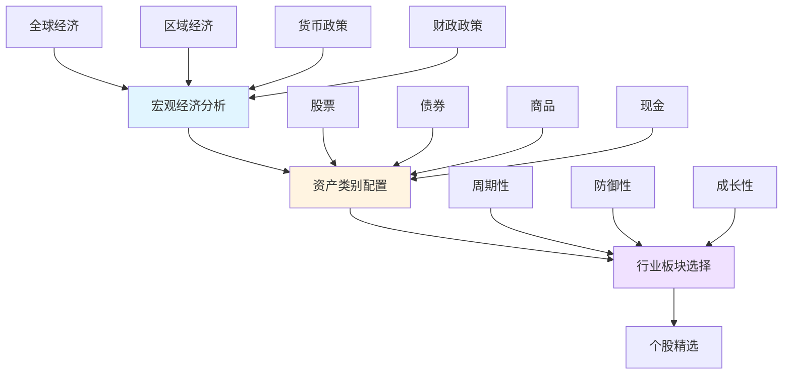
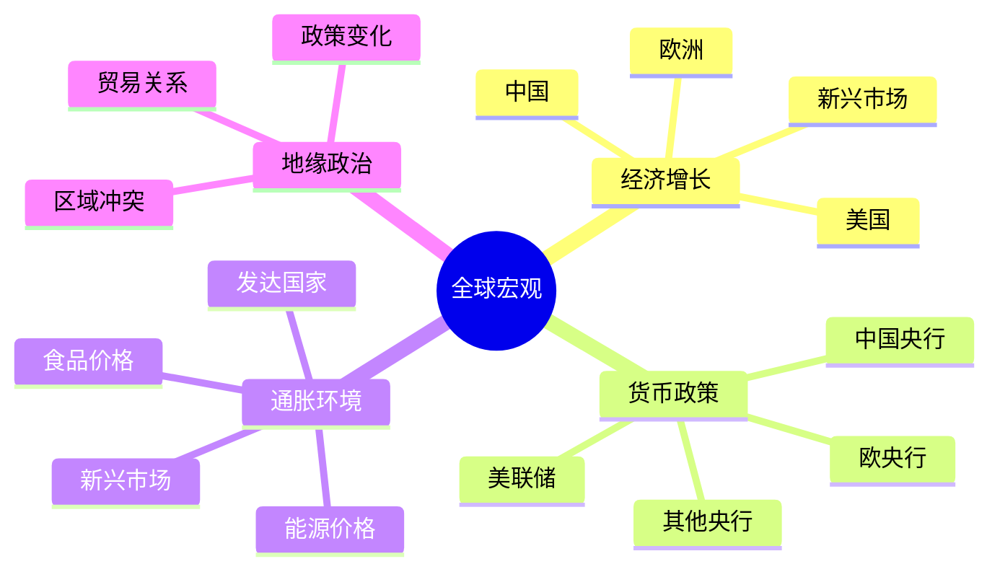

# 自上而下投资方法

## 概述

自上而下（Top-Down）投资方法是一种从宏观经济环境出发，逐步细化到行业选择和个股配置的系统化投资框架。这种方法强调宏观经济趋势对资产价格的决定性影响，认为正确判断经济周期和政策方向比选择个股更为重要。

**学习目标**：
- 理解自上而下分析的完整框架和逻辑
- 掌握从宏观到微观的分析层次和方法
- 学会将宏观判断转化为投资决策
- 了解该方法的优势和局限性

**为什么重要**：
在全球化和金融市场高度关联的今天，宏观因素对资产价格的影响越来越显著。自上而下方法帮助投资者把握大趋势，避免"只见树木不见森林"的局限，在正确的时间配置正确的资产类别。

## 核心概念

### 分析框架的三个层次

自上而下投资方法包含三个递进的分析层次：

### 第一层：宏观经济分析

**核心问题**：
- 全球经济处于什么阶段？（复苏、繁荣、衰退、萧条）
- 主要经济体的增长趋势如何？
- 通胀水平和预期如何变化？
- 货币政策和财政政策的方向？
- 地缘政治风险如何？

**关键指标**：
- GDP 增长率及其组成部分
- 失业率和就业数据
- CPI、PPI 通胀指标
- 利率水平和曲线形态
- PMI 等领先指标
- 信贷增长和货币供应

### 第二层：资产类别配置

基于宏观判断，决定在不同资产类别之间的配置比例：

**经济周期与资产配置**：

| 经济阶段 | 股票 | 债券 | 商品 | 现金 | 逻辑 |
|---------|------|------|------|------|------|
| 复苏期 | ↑↑ | ↑ | → | ↓ | 经济改善，企业盈利回升 |
| 繁荣期 | ↑ | ↓ | ↑↑ | ↓ | 通胀上升，商品需求旺盛 |
| 滞胀期 | ↓ | → | ↑ | ↑ | 增长放缓，通胀高企 |
| 衰退期 | ↓↓ | ↑↑ | ↓ | ↑ | 避险需求，利率下降 |

### 第三层：行业和个股选择

**行业轮动策略**：

不同经济阶段，不同行业的表现差异显著：

- **早周期**（复苏初期）：金融、房地产、可选消费
- **中周期**（繁荣期）：工业、材料、能源
- **晚周期**（繁荣后期）：能源、材料、公用事业
- **衰退期**：必需消费、医疗保健、公用事业

## 实施流程

### 步骤 1：全球宏观环境评估

**分析框架**：

**实践方法**：
1. 追踪主要经济体的 GDP、就业、通胀数据
2. 关注央行政策会议和声明
3. 分析财政政策变化（刺激或紧缩）
4. 评估地缘政治风险对市场的影响
5. 综合判断全球经济所处周期位置

### 步骤 2：确定投资主题

基于宏观判断，提炼出 2-3 个核心投资主题：

**示例主题**：
- **通胀回归**：配置商品、通胀保护债券、实物资产
- **科技创新**：配置科技股、创新型企业
- **能源转型**：配置新能源、清洁技术
- **中国复苏**：配置中国资产、亚洲市场
- **美元走弱**：配置新兴市场、大宗商品

### 步骤 3：资产配置决策

**战略配置**（长期，1-3年）：
- 基于长期经济趋势
- 相对稳定，调整频率低
- 例如：股票 60%、债券 30%、商品 10%

**战术配置**（短期，3-12个月）：
- 基于经济周期判断
- 灵活调整，把握阶段性机会
- 例如：在复苏期超配股票至 70%

### 步骤 4：行业配置

**行业评分模型**：

为每个行业评分（1-5分）：
- 宏观环境适配度
- 盈利增长前景
- 估值吸引力
- 政策支持力度
- 技术创新潜力

选择得分最高的 5-8 个行业进行配置。

### 步骤 5：个股筛选

在选定行业内，筛选优质个股：

**筛选标准**：
- 行业龙头地位
- 财务健康状况
- 管理层质量
- 估值合理性
- 增长可持续性

## 实践案例

### 案例 1：2020年疫情后的配置策略

**宏观判断**（2020年4月）：
- 全球经济深度衰退
- 各国推出史无前例的货币和财政刺激
- 利率降至零或负值
- 疫情终将过去，经济将强劲复苏

**投资主题**：
1. 流动性泛滥驱动的资产价格上涨
2. 疫情后经济复苏
3. 数字化转型加速

**资产配置**：
- **超配股票**（70%）：受益于刺激政策和复苏预期
- **低配债券**（15%）：利率极低，回报有限
- **配置商品**（10%）：通胀预期上升
- **持有现金**（5%）：保持灵活性

**行业选择**：
- 科技（云计算、电商、远程办公）
- 新能源（政策支持）
- 可选消费（复苏受益）
- 金融（经济复苏受益）

**结果**：
2020年4月至2021年底，全球股市大幅上涨，科技股和新能源表现尤为突出，该策略取得显著超额收益。

### 案例 2：2022年通胀环境下的调整

**宏观判断**（2022年初）：
- 通胀持续高企，超出预期
- 美联储开始激进加息
- 经济增长放缓风险上升
- 地缘政治紧张（俄乌冲突）

**投资主题**：
1. 应对高通胀和加息
2. 防御性配置
3. 能源和商品机会

**资产配置调整**：
- **降低股票**（50%）：加息压制估值
- **增加债券**（25%）：利率上升后吸引力提升
- **增加商品**（20%）：通胀对冲
- **增加现金**（5%）：等待更好机会

**行业调整**：
- 减持：高估值科技股、长久期成长股
- 增持：能源、材料、必需消费、医疗
- 持有：金融（受益于加息）

**结果**：
2022年股市大幅下跌，但能源和必需消费表现相对较好，防御性配置有效降低了损失。

## 方法优势

### 1. 把握大趋势

**优势**：
- 避免在错误的时间配置错误的资产
- 顺应经济周期，提高胜率
- 减少个股选择错误的影响

**实例**：
2008年金融危机前，自上而下投资者通过宏观分析识别出房地产泡沫和信贷风险，提前降低风险资产配置，避免了重大损失。

### 2. 系统化决策

**优势**：
- 提供清晰的分析框架
- 决策过程可追溯、可复盘
- 减少情绪化决策

### 3. 适应性强

**优势**：
- 可应用于不同市场和资产类别
- 适合管理大规模资金
- 便于团队协作和分工

### 4. 风险管理

**优势**：
- 通过资产配置分散风险
- 及时识别系统性风险
- 动态调整应对环境变化

## 方法局限

### 1. 宏观预测困难

**挑战**：
- 经济数据滞后且经常修正
- 政策变化难以准确预测
- 黑天鹅事件无法预见

**应对**：
- 建立多情景分析框架
- 保持投资组合的灵活性
- 设置止损和风险控制机制

### 2. 时机把握难度大

**挑战**：
- 经济周期转折点难以精确判断
- 市场反应可能提前或滞后
- 频繁调整增加交易成本

**应对**：
- 采用渐进式调整而非一次性大幅调整
- 结合技术分析辅助时机选择
- 设定明确的调整触发条件

### 3. 可能错过优质个股

**挑战**：
- 过度关注宏观，忽视公司基本面
- 可能错过逆周期的优秀企业
- 行业配置限制了选股范围

**应对**：
- 在选定行业内深入研究个股
- 保留一定比例的灵活配置空间
- 结合自下而上分析补充

## 与自下而上方法的对比

| 维度 | 自上而下 | 自下而上 |
|------|---------|---------|
| 起点 | 宏观经济 | 个股分析 |
| 重点 | 资产配置、行业轮动 | 选股能力 |
| 适用规模 | 大资金 | 中小资金 |
| 调整频率 | 较高 | 较低 |
| 分析工具 | 经济指标、政策分析 | 财务分析、估值模型 |
| 代表人物 | 索罗斯、达里奥 | 巴菲特、林奇 |
| 优势 | 把握大趋势、风险控制 | 发现低估值、长期持有 |
| 劣势 | 预测困难、交易成本 | 忽视宏观、集中风险 |

**最佳实践**：
许多成功投资者结合两种方法：
- 用自上而下确定大方向和资产配置
- 用自下而上在选定领域精选个股
- 例如：桥水基金的"All Weather"策略结合了宏观配置和精选投资

## 实战应用指南

### 建立自己的分析框架

**步骤 1：信息来源**
- 经济数据：各国统计局、央行网站
- 政策信息：央行会议纪要、政府报告
- 市场数据：Bloomberg、Wind、同花顺
- 研究报告：投行、券商宏观研究

**步骤 2：定期评估**
- 每月：更新经济数据，评估周期位置
- 每季：全面复盘，调整投资主题
- 每年：战略配置审视，长期趋势判断

**步骤 3：决策流程**
1. 收集和分析宏观数据
2. 判断经济周期位置
3. 确定投资主题和资产配置
4. 选择行业和个股
5. 执行交易并监控
6. 定期复盘和调整

### 常见错误

**错误 1：过度交易**
- 问题：频繁根据短期数据调整配置
- 后果：高交易成本，错失长期趋势
- 解决：设定明确的调整阈值，避免噪音干扰

**错误 2：线性外推**
- 问题：简单延续当前趋势
- 后果：在拐点处犯错
- 解决：关注领先指标，识别转折信号

**错误 3：忽视估值**
- 问题：只看宏观，不看价格
- 后果：在高位买入，低位卖出
- 解决：结合估值分析，寻找性价比

**错误 4：过度自信**
- 问题：认为能准确预测宏观
- 后果：集中押注，风险过大
- 解决：保持谦逊，分散配置，设置止损

## 工具和资源

### 数据和分析工具

**免费资源**：
- FRED（美联储经济数据库）
- Trading Economics（全球经济数据）
- 各国央行官网
- IMF、世界银行数据

**付费工具**：
- Bloomberg Terminal
- Wind 资讯
- FactSet
- Refinitiv Eikon

### 学习资源

**推荐书籍**：
1. 《投资最重要的事》- 霍华德·马克斯
2. 《债务危机》- 瑞·达里奥
3. 《金融炼金术》- 乔治·索罗斯
4. 《周期》- 霍华德·马克斯
5. 《宏观经济学》- 曼昆

**研究机构**：
- 桥水基金（Bridgewater）研究报告
- 高盛全球宏观研究
- 摩根士丹利宏观策略
- 中金公司宏观研究

## 延伸阅读

- [美林时钟详解](../../02-economic-foundation/economic-cycles/merrill-lynch-clock.html)
- [达里奥原则](./dalio-principles.html)
- [全球宏观策略](./global-macro-strategies.html)
- [资产配置理论](../asset-allocation/modern-portfolio-theory.html)
- [经济周期理论](../../02-economic-foundation/economic-cycles/cycle-overview.html)

## 参考文献

1. Dalio, R. (2018). *Principles for Navigating Big Debt Crises*. Bridgewater Associates.
2. Marks, H. (2018). *Mastering the Market Cycle*. Houghton Mifflin Harcourt.
3. Soros, G. (2003). *The Alchemy of Finance*. Wiley.
4. Swensen, D. (2009). *Pioneering Portfolio Management*. Free Press.
5. Grantham, J. (2021). "Waiting for the Last Dance". GMO Quarterly Letter.
6. Bridgewater Associates. (2020). "How the Economic Machine Works". Research Paper.
7. Goldman Sachs. (2023). "Global Macro Research: Top of Mind". Annual Report.
8. Morgan Stanley. (2023). "Global Investment Strategy". Quarterly Update.

## 深度分析

### 核心机制解析

理解本主题需要从多个维度进行系统性分析。以下从理论基础、实践应用和历史验证三个层面展开深度探讨。

**理论基础层面**：本主题的核心逻辑建立在经济学和金融学的基本原理之上。通过对基础理论的深入理解，投资者能够建立起稳固的分析框架，避免被市场短期噪音所干扰。

**实践应用层面**：理论必须与实践相结合才能产生价值。在实际投资决策中，需要将抽象的概念转化为具体的分析工具和决策标准。

**历史验证层面**：金融市场有着丰富的历史记录，通过研究历史案例，我们可以验证理论的有效性，并从中提炼出具有普遍意义的规律。

### 关键影响因素

影响本主题的关键因素可以从以下几个维度进行分析：

1. **宏观经济环境**：利率水平、通货膨胀率、经济增长速度等宏观变量对本主题有着深远影响。在不同的宏观经济周期中，相关指标的表现会呈现出显著差异。

2. **市场结构因素**：市场参与者的构成、信息传播机制、流动性状况等市场结构因素决定了价格发现的效率和准确性。

3. **政策监管环境**：政府政策、监管框架的变化会直接影响相关市场的运作规则和参与者行为。

4. **技术创新驱动**：技术进步不断改变着金融市场的运作方式，从算法交易到区块链技术，每一次技术革新都带来新的机遇和挑战。

5. **全球化与地缘政治**：在全球化背景下，各国市场之间的联动性日益增强，地缘政治风险的影响也越来越不可忽视。

### 量化分析框架

为了更精确地分析和评估，可以采用以下量化框架：

| 分析维度 | 关键指标 | 参考基准 | 分析方法 |
|---------|---------|---------|---------|
| 规模评估 | 绝对值与相对值 | 历史均值 | 趋势分析 |
| 质量评估 | 稳定性指标 | 行业对标 | 横向比较 |
| 风险评估 | 波动率指标 | 风险阈值 | 情景分析 |
| 价值评估 | 估值倍数 | 历史区间 | 回归分析 |

通过系统性地应用上述框架，投资者可以对目标进行全面、客观的评估，从而做出更加理性的投资决策。

