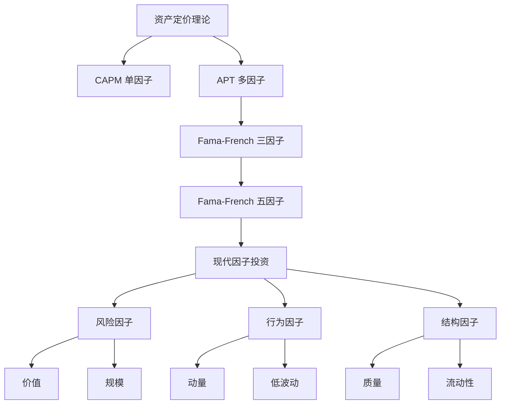

# 因子投资总览

## 概述

因子投资（Factor Investing）是一种系统化的投资方法，通过识别和利用能够解释资产收益差异的特定因子来构建投资组合。这种方法将传统的主动投资和被动投资相结合，既保持了系统化和透明度，又能够获取超越市场的超额收益。

**学习目标**：
- 理解因子投资的理论基础和发展历程
- 掌握主要因子的定义、构建方法和经济逻辑
- 了解因子投资的实践应用和组合构建
- 认识因子投资的优势、局限性和风险
- 学习如何评估和选择因子策略

**为什么重要**：
因子投资代表了现代投资管理的重要发展方向，它将学术研究成果转化为可实施的投资策略。对于工程师背景的投资者，因子投资提供了一个系统化、可量化、可回测的投资框架，特别适合利用数据分析和编程能力来实现投资目标。

## 因子投资的理论基础

### 资产定价理论演进

**资本资产定价模型（CAPM）**：
- 单因子模型：市场因子（Beta）
- 假设：市场组合是唯一的系统性风险来源
- 局限性：无法解释实际收益的横截面差异

**套利定价理论（APT）**：
- 多因子框架：允许多个风险因子
- 理论基础：无套利原则
- 灵活性：不限定具体因子数量和类型

**Fama-French 三因子模型**：
- 市场因子（Market）
- 规模因子（Size/SMB）
- 价值因子（Value/HML）
- 突破：解释了约 90% 的股票收益差异

### 因子溢价的经济学解释

**风险补偿理论**：
- 因子收益是对承担系统性风险的补偿
- 投资者要求更高的预期收益来承担特定风险
- 例如：价值股在经济衰退时表现更差，因此需要风险溢价

**行为金融学解释**：
- 投资者的认知偏差和行为偏差
- 市场摩擦和交易成本
- 例如：动量效应可能源于投资者的羊群效应和反应不足

**结构性障碍**：
- 机构投资者的约束条件
- 监管限制和投资政策
- 例如：小盘股溢价可能源于机构投资者的流动性需求



## 主要因子类型

### 1. 价值因子（Value）

**定义**：
相对于基本面指标（账面价值、盈利、现金流等），价格较低的股票

**常用指标**：
- 市净率（P/B）
- 市盈率（P/E）
- 市销率（P/S）
- 企业价值倍数（EV/EBITDA）
- 股息收益率

**经济逻辑**：
- 风险补偿：价值股在经济衰退时更脆弱
- 行为偏差：投资者过度外推增长预期
- 均值回归：估值最终回归合理水平

**历史表现**：
- 长期年化超额收益：3-5%
- 周期性：在经济复苏期表现突出
- 近期挑战：2010年代表现不佳

### 2. 规模因子（Size）

**定义**：
小市值公司相对于大市值公司的超额收益

**衡量方法**：
- 市值分组：小盘股 vs 大盘股
- SMB（Small Minus Big）因子

**经济逻辑**：
- 流动性风险：小盘股流动性较差
- 信息不对称：小公司信息披露较少
- 破产风险：小公司财务更脆弱

**实践考虑**：
- 微盘股效应更显著
- 交易成本较高
- 容量限制

### 3. 动量因子（Momentum）

**定义**：
过去表现好的股票继续表现好，表现差的继续表现差

**构建方法**：
- 回溯期：通常 6-12 个月
- 持有期：1-6 个月
- 跳过最近一个月（短期反转）

**经济逻辑**：
- 反应不足：投资者对信息反应缓慢
- 羊群效应：趋势追随行为
- 风险动态变化：赢家风险降低

**特点**：
- 短期有效性强
- 崩盘风险：市场反转时损失大
- 与价值因子负相关

### 4. 质量因子（Quality）

**定义**：
盈利能力强、财务稳健、经营效率高的公司

**衡量指标**：
- 盈利能力：ROE、ROA、毛利率
- 财务稳健：低杠杆、稳定盈利
- 经营效率：资产周转率、应计项目
- 增长质量：盈利增长稳定性

**经济逻辑**：
- 持续竞争优势
- 抗风险能力强
- 投资者偏好稳定性

**投资价值**：
- 防御性强
- 与价值因子互补
- 适合长期持有

### 5. 低波动因子（Low Volatility）

**定义**：
历史波动率低的股票表现优于高波动股票

**衡量方法**：
- 历史波动率
- Beta 值
- 特质波动率

**经济逻辑**：
- 彩票效应：投资者过度追逐高波动股票
- 杠杆约束：机构投资者无法使用杠杆
- 行为偏差：过度自信和赌博心理

**应用场景**：
- 防御性投资
- 降低组合波动
- 风险调整后收益优异

### 6. 盈利因子（Profitability）

**定义**：
当前盈利能力强的公司

**衡量指标**：
- 毛利率
- 营业利润率
- 资产收益率（ROA）
- 现金流盈利能力

**理论基础**：
- Fama-French 五因子模型的新增因子
- 盈利能力预测未来收益

### 7. 投资因子（Investment）

**定义**：
资产增长率低的公司表现优于资产增长率高的公司

**衡量方法**：
- 总资产增长率
- 资本支出增长率
- 库存增长率

**经济逻辑**：
- 过度投资：管理层过度扩张
- 资本回报递减
- 盈利质量下降

## 因子投资策略构建

### 单因子策略

**构建步骤**：
1. **因子定义**：选择具体的因子指标
2. **股票筛选**：确定投资范围（市值、流动性）
3. **因子计算**：计算每只股票的因子值
4. **排序分组**：按因子值排序，分成若干组
5. **组合构建**：做多高因子组，做空低因子组（可选）
6. **再平衡**：定期调整组合（月度、季度）

**权重方案**：
- 等权重：简单但可能集中度高
- 市值加权：降低交易成本
- 因子加权：根据因子暴露度加权
- 风险平价：根据风险贡献加权

### 多因子策略

**组合方法**：

**1. 顺序筛选法**：
- 先按因子 1 筛选
- 再按因子 2 筛选
- 依次类推
- 优点：简单直观
- 缺点：因子顺序影响结果

**2. 综合评分法**：
- 计算每个因子的标准化得分
- 加权求和得到综合得分
- 按综合得分排序选股
- 优点：考虑所有因子
- 缺点：权重设定主观

**3. 多因子回归法**：
- 建立多元回归模型
- 预测股票未来收益
- 按预测收益构建组合
- 优点：统计严谨
- 缺点：模型复杂，过拟合风险

**因子选择原则**：
- 经济逻辑清晰
- 历史表现稳健
- 因子间相关性低
- 样本外有效性

### 因子时机选择

**周期轮动**：
- 经济周期不同阶段，不同因子表现不同
- 复苏期：价值、小盘
- 繁荣期：动量、成长
- 衰退期：质量、低波动
- 萧条期：防御性因子

**估值调整**：
- 因子本身也有估值
- 当因子"便宜"时增加配置
- 当因子"昂贵"时减少配置

**动态配置**：
- 根据宏观环境调整因子权重
- 根据因子表现调整配置
- 风险管理：控制因子暴露

## 因子投资的实践应用

### Smart Beta 策略

**定义**：
介于主动和被动之间的投资策略，通过系统化规则获取因子溢价

**常见类型**：
- 单因子 Smart Beta：价值 ETF、动量 ETF
- 多因子 Smart Beta：综合多个因子
- 基本面加权：按基本面指标加权而非市值

**优势**：
- 透明度高：规则明确
- 成本低：相对主动管理
- 系统化：消除情绪影响

**局限性**：
- 拥挤交易：策略容量有限
- 因子失效：历史表现不保证未来
- 交易成本：频繁调整增加成本

### 因子增强策略

**核心思想**：
在被动指数基础上，通过因子倾斜获取超额收益

**实施方法**：
- 保持与基准的高度相关性
- 适度偏离：增加好因子暴露，减少坏因子暴露
- 控制跟踪误差：通常 1-3%

**应用场景**：
- 机构投资者的核心持仓
- 养老金、捐赠基金
- 长期投资账户

### 因子对冲策略

**多空策略**：
- 做多高因子股票
- 做空低因子股票
- 市场中性：消除市场风险

**优势**：
- 纯粹的因子暴露
- 降低市场风险
- 绝对收益策略

**挑战**：
- 做空成本和限制
- 杠杆要求
- 监管约束

## 因子投资的评估

### 因子有效性检验

**统计显著性**：
- t 统计量 > 2
- 夏普比率 > 0.5
- 信息比率 > 0.5

**经济显著性**：
- 年化超额收益 > 2%
- 扣除交易成本后仍为正
- 风险调整后收益有吸引力

**稳健性检验**：
- 不同时期：多个时间段
- 不同市场：多个国家/地区
- 不同定义：多种因子构建方法
- 样本外测试：避免数据挖掘

### 因子表现归因

**收益分解**：
```
总收益 = 市场收益 + 因子收益 + 选股收益 + 交互效应
```

**风险归因**：
- 因子风险贡献
- 特质风险贡献
- 风险集中度

**业绩评估指标**：
- 因子暴露度：实际 vs 目标
- 因子收益贡献
- 信息比率
- 最大回撤

## 因子投资的风险管理

### 主要风险类型

**1. 因子拥挤风险**：
- 过多资金追逐同一因子
- 因子溢价被压缩
- 反转时损失巨大

**识别方法**：
- 因子估值：相对历史水平
- 资金流向：ETF 资金流入
- 市场情绪：投资者关注度

**2. 因子周期性风险**：
- 因子表现有周期性
- 长期低迷期可能持续数年
- 投资者信心动摇

**应对策略**：
- 多因子分散
- 长期视角
- 动态调整

**3. 实施风险**：
- 交易成本侵蚀收益
- 市场冲击成本
- 流动性风险

**控制方法**：
- 降低换手率
- 优化交易执行
- 容量管理

### 风险控制措施

**组合层面**：
- 因子分散：不过度集中单一因子
- 行业中性：控制行业暴露
- 风格平衡：平衡成长和价值

**头寸层面**：
- 个股权重上限
- 行业权重限制
- 因子暴露限制

**动态管理**：
- 定期再平衡
- 风险预算调整
- 止损机制

## 因子投资的未来趋势

### 新兴因子

**ESG 因子**：
- 环境、社会、治理因素
- 可持续投资需求增长
- 监管推动

**另类数据因子**：
- 卫星图像数据
- 社交媒体情绪
- 信用卡交易数据
- 网络流量数据

**机器学习因子**：
- 非线性关系挖掘
- 高维数据处理
- 动态因子选择

### 技术进步

**大数据和云计算**：
- 处理海量数据
- 实时因子计算
- 高频因子策略

**人工智能**：
- 因子发现自动化
- 组合优化智能化
- 风险管理精细化

**区块链**：
- 透明度提升
- 交易成本降低
- 新型资产类别

### 监管和市场环境

**透明度要求**：
- 因子披露标准化
- 费用透明化
- 业绩归因要求

**市场结构变化**：
- 被动投资占比提升
- 因子拥挤加剧
- 超额收益压缩

**全球化**：
- 跨市场因子投资
- 货币对冲策略
- 新兴市场机会

## 实战应用指南

### 个人投资者

**入门建议**：
1. 从单因子 ETF 开始
2. 理解因子的经济逻辑
3. 长期持有，避免频繁交易
4. 分散投资多个因子

**产品选择**：
- 低费率：< 0.5%
- 流动性好：日均交易量大
- 跟踪误差小：< 1%
- 历史业绩稳定

**组合构建**：
- 核心持仓：市值加权指数（60%）
- 因子增强：多因子 Smart Beta（30%）
- 卫星策略：单因子策略（10%）

### 机构投资者

**尽职调查**：
- 因子定义和构建方法
- 历史业绩和归因分析
- 风险管理框架
- 实施能力和成本

**实施考虑**：
- 策略容量：是否适合资金规模
- 交易成本：预期成本 vs 预期收益
- 运营复杂度：内部能力要求
- 监管合规：投资政策限制

**业绩监控**：
- 因子暴露跟踪
- 归因分析
- 风险指标监控
- 定期策略评估

## 常见误区

### 误区 1：因子投资是被动投资

**真相**：
- 因子投资是系统化的主动投资
- 主动选择因子和权重
- 需要持续监控和调整

### 误区 2：历史表现保证未来收益

**真相**：
- 因子溢价可能消失或减弱
- 市场环境变化影响因子表现
- 需要理解因子背后的经济逻辑

### 误区 3：更多因子总是更好

**真相**：
- 因子间可能高度相关
- 过多因子增加复杂度
- 可能导致过拟合
- 3-5 个低相关因子通常足够

### 误区 4：因子投资不需要风险管理

**真相**：
- 因子有周期性和拥挤风险
- 需要动态调整和再平衡
- 风险管理至关重要

### 误区 5：因子投资只适合量化投资者

**真相**：
- 基本面投资者也在使用因子
- 因子提供系统化框架
- 可以与主观判断结合

## 延伸阅读

### 经典书籍

1. **《Your Complete Guide to Factor-Based Investing》** - Andrew L. Berkin & Larry E. Swedroe
   - 因子投资的全面指南
   - 适合入门和进阶

2. **《Expected Returns》** - Antti Ilmanen
   - 资产预期收益的深度分析
   - 学术和实践结合

3. **《Quantitative Equity Portfolio Management》** - Ludwig B. Chincarini & Daehwan Kim
   - 量化股票组合管理
   - 技术性较强

4. **《Factor Investing and Asset Allocation》** - Vasant Naik et al.
   - 因子投资和资产配置
   - 机构投资者视角

5. **《Efficiently Inefficient》** - Lasse Heje Pedersen
   - 市场有效性和因子投资
   - 理论和实践平衡

### 学术论文

1. **Fama & French (1992)** - "The Cross-Section of Expected Stock Returns"
   - 三因子模型的奠基之作

2. **Fama & French (2015)** - "A Five-Factor Asset Pricing Model"
   - 五因子模型

3. **Jegadeesh & Titman (1993)** - "Returns to Buying Winners and Selling Losers"
   - 动量效应

4. **Asness, Moskowitz & Pedersen (2013)** - "Value and Momentum Everywhere"
   - 跨资产类别的因子

5. **Hou, Xue & Zhang (2015)** - "Digesting Anomalies"
   - q-因子模型

### 在线资源

1. **AQR Capital Management** - 研究论文和白皮书
2. **Research Affiliates** - 因子投资研究
3. **MSCI** - 因子指数和研究
4. **FTSE Russell** - Smart Beta 研究
5. **Morningstar** - 因子 ETF 分析

### 数据和工具

1. **Kenneth French Data Library** - 因子数据
2. **CRSP** - 股票数据
3. **Compustat** - 财务数据
4. **Bloomberg** - 综合金融数据
5. **FactSet** - 因子分析工具

## 参考文献

1. Fama, E. F., & French, K. R. (1992). The cross-section of expected stock returns. *The Journal of Finance*, 47(2), 427-465.

2. Fama, E. F., & French, K. R. (2015). A five-factor asset pricing model. *Journal of Financial Economics*, 116(1), 1-22.

3. Jegadeesh, N., & Titman, S. (1993). Returns to buying winners and selling losers: Implications for stock market efficiency. *The Journal of Finance*, 48(1), 65-91.

4. Asness, C. S., Moskowitz, T. J., & Pedersen, L. H. (2013). Value and momentum everywhere. *The Journal of Finance*, 68(3), 929-985.

5. Ang, A., Hodrick, R. J., Xing, Y., & Zhang, X. (2006). The cross-section of volatility and expected returns. *The Journal of Finance*, 61(1), 259-299.

6. Novy-Marx, R. (2013). The other side of value: The gross profitability premium. *Journal of Financial Economics*, 108(1), 1-28.

7. Hou, K., Xue, C., & Zhang, L. (2015). Digesting anomalies: An investment approach. *The Review of Financial Studies*, 28(3), 650-705.

8. Harvey, C. R., Liu, Y., & Zhu, H. (2016). ... and the cross-section of expected returns. *The Review of Financial Studies*, 29(1), 5-68.

9. McLean, R. D., & Pontiff, J. (2016). Does academic research destroy stock return predictability? *The Journal of Finance*, 71(1), 5-32.

10. Berkin, A. L., & Swedroe, L. E. (2016). *Your Complete Guide to Factor-Based Investing*. BAM Alliance Press.

11. Ilmanen, A. (2011). *Expected Returns: An Investor's Guide to Harvesting Market Rewards*. John Wiley & Sons.

12. Pedersen, L. H. (2015). *Efficiently Inefficient: How Smart Money Invests and Market Prices Are Determined*. Princeton University Press.

13. Bender, J., Briand, R., Melas, D., & Subramanian, R. (2013). Foundations of factor investing. *MSCI Research Paper*.

14. Ang, A. (2014). *Asset Management: A Systematic Approach to Factor Investing*. Oxford University Press.

15. Asness, C. S., Frazzini, A., & Pedersen, L. H. (2019). Quality minus junk. *Review of Accounting Studies*, 24(1), 34-112.
