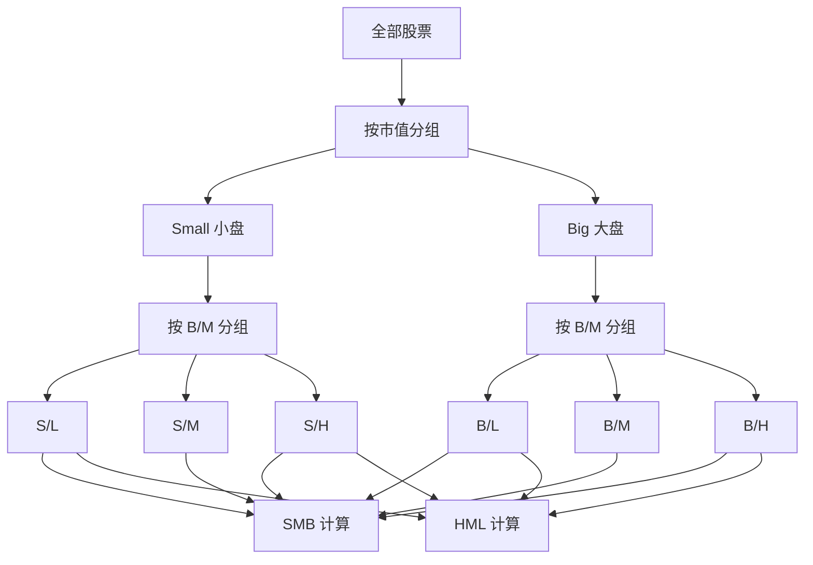

# Fama-French 三因子/五因子模型

## 概述

Fama-French 模型是现代资产定价理论的里程碑，由诺贝尔经济学奖得主 Eugene Fama 和 Kenneth French 提出。该模型从单因子的 CAPM 扩展到多因子框架，显著提高了对股票收益横截面差异的解释能力。

**学习目标**：
- 理解 Fama-French 模型的理论基础和发展历程
- 掌握三因子和五因子的定义、构建方法和经济含义
- 学习如何使用模型进行资产定价和业绩评估
- 了解模型的实证检验结果和局限性
- 掌握模型在投资实践中的应用

**为什么重要**：
Fama-French 模型是学术研究和投资实践的桥梁，它将严谨的学术研究转化为可操作的投资策略。对于量化投资者，这是必须掌握的基础模型；对于基本面投资者，它提供了系统化的分析框架。

## 从 CAPM 到 Fama-French

### CAPM 的局限性

**资本资产定价模型（CAPM）**：
$$E(R_i) = R_f + \beta_i[E(R_m) - R_f]$$

其中：
- $E(R_i)$：资产 i 的预期收益率
- $R_f$：无风险利率
- $\beta_i$：资产 i 的市场 Beta
- $E(R_m)$：市场组合的预期收益率

**CAPM 的问题**：
1. **规模效应**：小盘股收益高于 CAPM 预测
2. **价值效应**：高账面市值比股票收益高于预测
3. **解释力不足**：只能解释约 70% 的收益差异

### 实证异象的发现

**规模效应（Size Effect）**：
- Banz (1981) 发现小盘股长期超额收益
- 1926-1980 年，小盘股年化超额收益约 5%
- CAPM 无法解释这一现象

**价值效应（Value Effect）**：
- Basu (1977) 发现低 P/E 股票超额收益
- Rosenberg, Reid & Lanstein (1985) 发现低 P/B 股票超额收益
- 价值股长期跑赢成长股

## Fama-French 三因子模型

### 模型公式

$$R_{it} - R_{ft} = \alpha_i + \beta_{i,M}(R_{Mt} - R_{ft}) + \beta_{i,SMB}SMB_t + \beta_{i,HML}HML_t + \epsilon_{it}$$

其中：
- $R_{it} - R_{ft}$：资产 i 的超额收益
- $R_{Mt} - R_{ft}$：市场超额收益（Market Factor）
- $SMB_t$：规模因子（Small Minus Big）
- $HML_t$：价值因子（High Minus Low）
- $\alpha_i$：Jensen's Alpha，超额收益
- $\beta$：因子暴露度
- $\epsilon_{it}$：残差项

### 三个因子详解

#### 1. 市场因子（Market Factor, Mkt-RF）

**定义**：
市场组合相对于无风险利率的超额收益

**构建方法**：
- 市场组合：所有股票的市值加权组合
- 无风险利率：通常使用 1 个月国债利率
- Mkt-RF = 市场收益率 - 无风险利率

**经济含义**：
- 系统性风险补偿
- 所有股票共同面对的风险
- 继承自 CAPM

#### 2. 规模因子（SMB - Small Minus Big）

**定义**：
小市值股票组合收益减去大市值股票组合收益

**构建步骤**：
1. 按市值中位数将股票分为 Small (S) 和 Big (B) 两组
2. 按账面市值比分为 High (H)、Medium (M)、Low (L) 三组
3. 形成 6 个组合：S/H, S/M, S/L, B/H, B/M, B/L
4. SMB = (S/H + S/M + S/L)/3 - (B/H + B/M + B/L)/3

**经济含义**：
- 小公司风险溢价
- 流动性风险补偿
- 信息不对称风险
- 破产风险溢价

**历史表现**：
- 1926-2020 年平均年化收益：约 3.3%
- 波动性较高
- 周期性明显

#### 3. 价值因子（HML - High Minus Low）

**定义**：
高账面市值比股票组合收益减去低账面市值比股票组合收益

**构建步骤**：
1. 计算账面市值比（B/M = Book Equity / Market Equity）
2. 按 B/M 分为 High (H)、Medium (M)、Low (L) 三组
3. 按市值分为 Small (S) 和 Big (B) 两组
4. 形成 6 个组合
5. HML = (S/H + B/H)/2 - (S/L + B/L)/2

**经济含义**：
- 困境风险补偿
- 价值股在经济衰退时更脆弱
- 行为偏差：投资者过度外推
- 均值回归

**历史表现**：
- 1926-2020 年平均年化收益：约 4.8%
- 2010 年代表现不佳
- 与经济周期相关

### 因子构建的技术细节

**时间点选择**：
- 每年 6 月底重新分组
- 使用上一年末的市值数据
- 使用上一财年的账面价值数据

**数据滞后**：
- 账面价值数据滞后 6 个月
- 确保数据在投资时点可获得
- 避免前视偏差

**再平衡频率**：
- 年度再平衡（6 月底）
- 降低交易成本
- 保持因子暴露稳定

**权重方案**：
- 市值加权
- 每个组合内按市值加权
- 避免小盘股过度影响



## Fama-French 五因子模型

### 模型扩展

**五因子模型公式**：
$$R_{it} - R_{ft} = \alpha_i + \beta_{i,M}MKT_t + \beta_{i,SMB}SMB_t + \beta_{i,HML}HML_t + \beta_{i,RMW}RMW_t + \beta_{i,CMA}CMA_t + \epsilon_{it}$$

新增两个因子：
- $RMW_t$：盈利因子（Robust Minus Weak）
- $CMA_t$：投资因子（Conservative Minus Aggressive）

### 新增因子详解

#### 4. 盈利因子（RMW - Robust Minus Weak）

**定义**：
高盈利能力公司收益减去低盈利能力公司收益

**盈利能力衡量**：
$$Profitability = \frac{Revenue - COGS - SG\&A - Interest}{Book Equity}$$

**构建方法**：
1. 按盈利能力分为 Robust (R)、Neutral (N)、Weak (W) 三组
2. 按市值分为 Small (S) 和 Big (B) 两组
3. 形成 6 个组合
4. RMW = (S/R + B/R)/2 - (S/W + B/W)/2

**经济含义**：
- 盈利能力预测未来收益
- 高盈利公司更稳健
- 质量溢价

**历史表现**：
- 1963-2020 年平均年化收益：约 3.1%
- 波动性较低
- 防御性强

#### 5. 投资因子（CMA - Conservative Minus Aggressive）

**定义**：
低资产增长公司收益减去高资产增长公司收益

**投资强度衡量**：
$$Investment = \frac{\Delta Total Assets}{Total Assets_{t-1}}$$

**构建方法**：
1. 按资产增长率分为 Conservative (C)、Neutral (N)、Aggressive (A) 三组
2. 按市值分为 Small (S) 和 Big (B) 两组
3. 形成 6 个组合
4. CMA = (S/C + B/C)/2 - (S/A + B/A)/2

**经济含义**：
- 过度投资降低回报
- 资本回报递减
- 管理层过度扩张

**历史表现**：
- 1963-2020 年平均年化收益：约 3.0%
- 与价值因子相关
- 周期性

### 三因子 vs 五因子

**五因子的改进**：
- 解释力提升：R² 从 90% 提升到 93%
- 更好解释盈利能力和投资模式的影响
- 价值因子（HML）的重要性下降

**实证结果**：
- RMW 和 CMA 显著
- HML 在五因子模型中不显著
- 但 HML 仍有独立信息

**争议**：
- 是否应该保留 HML？
- 五因子是否过度拟合？
- 样本外表现如何？

## 模型的实证检验

### 解释力分析

**R² 比较**：
- CAPM：约 70%
- 三因子：约 90%
- 五因子：约 93%

**Alpha 分析**：
- 三因子模型显著降低 Alpha
- 大部分异象可以被因子解释
- 残留 Alpha 较小且不显著

### 跨市场验证

**国际市场**：
- 欧洲市场：因子显著
- 日本市场：因子显著
- 新兴市场：因子显著但波动大

**跨资产类别**：
- 债券市场：部分因子有效
- 商品市场：因子效果较弱
- 房地产：规模和价值因子有效

### 时间稳定性

**长期表现**：
- 1926-2020 年：因子持续有效
- 不同经济周期：表现有差异
- 近期挑战：价值因子表现不佳

**样本外测试**：
- 模型发表后表现
- 避免数据挖掘偏差
- 因子溢价有所下降但仍存在

## 模型应用

### 1. 资产定价

**预期收益估计**：
使用因子模型估计资产的预期收益：
$$E(R_i) = R_f + \beta_{i,M}E(MKT) + \beta_{i,SMB}E(SMB) + \beta_{i,HML}E(HML)$$

**步骤**：
1. 估计资产的因子暴露度（Beta）
2. 估计因子的预期溢价
3. 计算资产的预期收益

**应用场景**：
- 股票估值
- 项目评估
- 资本成本估计

### 2. 业绩评估

**Alpha 分解**：
$$\alpha_i = R_i - [R_f + \beta_{i,M}MKT + \beta_{i,SMB}SMB + \beta_{i,HML}HML]$$

**解释**：
- $\alpha > 0$：超额收益，选股能力
- $\alpha = 0$：收益完全由因子暴露解释
- $\alpha < 0$：表现不佳

**应用**：
- 基金经理业绩评估
- 区分技能和运气
- 风险调整后收益

### 3. 投资组合构建

**因子倾斜策略**：
- 增加对高溢价因子的暴露
- 减少对低溢价因子的暴露
- 控制非预期风险

**Smart Beta 策略**：
- 价值 ETF：高 HML 暴露
- 小盘 ETF：高 SMB 暴露
- 质量 ETF：高 RMW 暴露

**多因子组合**：
- 平衡多个因子暴露
- 分散因子风险
- 提高风险调整后收益

### 4. 风险管理

**风险归因**：
$$Var(R_i) = \beta_{i,M}^2Var(MKT) + \beta_{i,SMB}^2Var(SMB) + \beta_{i,HML}^2Var(HML) + Var(\epsilon_i)$$

**应用**：
- 识别风险来源
- 控制因子暴露
- 压力测试

## 实践案例

### 案例 1：基金业绩评估

**背景**：
评估一只主动管理基金的业绩

**数据**：
- 基金月度收益：2010-2020 年
- 三因子数据：Kenneth French 数据库

**回归结果**：
```
R_fund - R_f = 0.5% + 0.95*MKT + 0.3*SMB + 0.2*HML
                (2.1)   (45.2)      (3.5)     (2.8)

R² = 0.92
```

**解释**：
- Alpha = 0.5% 月度（6% 年化），显著为正
- 市场 Beta = 0.95，接近市场
- 小盘倾斜：SMB Beta = 0.3
- 价值倾斜：HML Beta = 0.2
- 92% 的收益可由因子解释

**结论**：
基金经理有选股能力，年化超额收益 6%

### 案例 2：投资组合优化

**目标**：
构建一个多因子增强组合

**方法**：
1. 选择高 HML、高 RMW、低 CMA 的股票
2. 控制市场 Beta 接近 1
3. 控制 SMB 暴露为中性
4. 分散行业和个股

**结果**：
- 年化收益：12%（vs 市场 10%）
- 波动率：15%（vs 市场 16%）
- 夏普比率：0.67（vs 市场 0.50）
- 最大回撤：-25%（vs 市场 -30%）

## 模型的局限性

### 理论局限

**1. 因子选择的主观性**：
- 为什么是这些因子？
- 是否遗漏重要因子？
- 数据挖掘风险

**2. 经济解释的争议**：
- 风险补偿 vs 行为偏差
- 因子溢价的来源不明确
- 理论基础不如 CAPM 坚实

**3. 时变性**：
- 因子溢价随时间变化
- 模型参数不稳定
- 需要动态调整

### 实践局限

**1. 交易成本**：
- 因子策略需要频繁交易
- 小盘股交易成本高
- 实际收益低于理论收益

**2. 容量限制**：
- 小盘股容量有限
- 大资金难以实施
- 拥挤交易风险

**3. 因子失效风险**：
- 策略公开后溢价下降
- 市场环境变化
- 长期低迷期

### 近期挑战

**价值因子困境**：
- 2010 年代表现不佳
- 科技股主导市场
- 价值投资"死亡"？

**因子拥挤**：
- 过多资金追逐因子
- 溢价被压缩
- 反转风险增加

**新因子涌现**：
- ESG 因子
- 另类数据因子
- 机器学习因子

## 延伸阅读

### 原始论文

1. **Fama, E. F., & French, K. R. (1992)**. "The Cross-Section of Expected Stock Returns". *The Journal of Finance*, 47(2), 427-465.
   - 三因子模型的奠基之作

2. **Fama, E. F., & French, K. R. (1993)**. "Common Risk Factors in the Returns on Stocks and Bonds". *Journal of Financial Economics*, 33(1), 3-56.
   - 三因子模型的详细构建

3. **Fama, E. F., & French, K. R. (2015)**. "A Five-Factor Asset Pricing Model". *Journal of Financial Economics*, 116(1), 1-22.
   - 五因子模型

4. **Fama, E. F., & French, K. R. (2018)**. "Choosing Factors". *Journal of Financial Economics*, 128(2), 234-252.
   - 因子选择指南

### 相关研究

5. **Carhart, M. M. (1997)**. "On Persistence in Mutual Fund Performance". *The Journal of Finance*, 52(1), 57-82.
   - 四因子模型（加入动量）

6. **Hou, K., Xue, C., & Zhang, L. (2015)**. "Digesting Anomalies: An Investment Approach". *The Review of Financial Studies*, 28(3), 650-705.
   - q-因子模型（竞争模型）

7. **Novy-Marx, R. (2013)**. "The Other Side of Value: The Gross Profitability Premium". *Journal of Financial Economics*, 108(1), 1-28.
   - 盈利因子的发现

### 实践指南

8. **Berkin, A. L., & Swedroe, L. E. (2016)**. *Your Complete Guide to Factor-Based Investing*. BAM Alliance Press.

9. **Ilmanen, A. (2011)**. *Expected Returns: An Investor's Guide to Harvesting Market Rewards*. John Wiley & Sons.

10. **Ang, A. (2014)**. *Asset Management: A Systematic Approach to Factor Investing*. Oxford University Press.

### 数据资源

11. **Kenneth French Data Library**: https://mba.tuck.dartmouth.edu/pages/faculty/ken.french/data_library.html
    - 因子数据免费下载
    - 每日更新
    - 全球市场数据

12. **AQR Capital Management**: https://www.aqr.com/Insights/Datasets
    - 扩展因子数据
    - 研究论文

## 参考文献

[前面列出的 12 篇文献，加上以下补充]

13. Banz, R. W. (1981). The relationship between return and market value of common stocks. *Journal of Financial Economics*, 9(1), 3-18.

14. Basu, S. (1977). Investment performance of common stocks in relation to their price-earnings ratios: A test of the efficient market hypothesis. *The Journal of Finance*, 32(3), 663-682.

15. Rosenberg, B., Reid, K., & Lanstein, R. (1985). Persuasive evidence of market inefficiency. *The Journal of Portfolio Management*, 11(3), 9-16.
4. Fama, E. F., & French, K. R. (1993). "Common Risk Factors in the Returns on Stocks and Bonds." *Journal of Financial Economics*, 33(1), 3-56.
5. Jegadeesh, N., & Titman, S. (1993). "Returns to Buying Winners and Selling Losers." *Journal of Finance*, 48(1), 65-91.
6. Asness, C. S., Moskowitz, T. J., & Pedersen, L. H. (2013). "Value and Momentum Everywhere." *Journal of Finance*, 68(3), 929-985.
7. Novy-Marx, R. (2013). "The Other Side of Value: The Gross Profitability Premium." *Journal of Financial Economics*, 108(1), 1-28.
8. Harvey, C. R., Liu, Y., & Zhu, H. (2016). "...and the Cross-Section of Expected Returns." *Review of Financial Studies*, 29(1), 5-68.
9. Ang, A. (2014). *Asset Management: A Systematic Approach to Factor Investing*. Oxford University Press.
10. Ilmanen, A. (2011). *Expected Returns: An Investor's Guide to Harvesting Market Rewards*. Wiley.


## 深度分析

### 核心机制解析

理解本主题需要从多个维度进行系统性分析。以下从理论基础、实践应用和历史验证三个层面展开深度探讨。

**理论基础层面**：本主题的核心逻辑建立在经济学和金融学的基本原理之上。通过对基础理论的深入理解，投资者能够建立起稳固的分析框架，避免被市场短期噪音所干扰。

**实践应用层面**：理论必须与实践相结合才能产生价值。在实际投资决策中，需要将抽象的概念转化为具体的分析工具和决策标准。

**历史验证层面**：金融市场有着丰富的历史记录，通过研究历史案例，我们可以验证理论的有效性，并从中提炼出具有普遍意义的规律。

### 关键影响因素

影响本主题的关键因素可以从以下几个维度进行分析：

1. **宏观经济环境**：利率水平、通货膨胀率、经济增长速度等宏观变量对本主题有着深远影响。在不同的宏观经济周期中，相关指标的表现会呈现出显著差异。

2. **市场结构因素**：市场参与者的构成、信息传播机制、流动性状况等市场结构因素决定了价格发现的效率和准确性。

3. **政策监管环境**：政府政策、监管框架的变化会直接影响相关市场的运作规则和参与者行为。

4. **技术创新驱动**：技术进步不断改变着金融市场的运作方式，从算法交易到区块链技术，每一次技术革新都带来新的机遇和挑战。

5. **全球化与地缘政治**：在全球化背景下，各国市场之间的联动性日益增强，地缘政治风险的影响也越来越不可忽视。

### 量化分析框架

为了更精确地分析和评估，可以采用以下量化框架：

| 分析维度 | 关键指标 | 参考基准 | 分析方法 |
|---------|---------|---------|---------|
| 规模评估 | 绝对值与相对值 | 历史均值 | 趋势分析 |
| 质量评估 | 稳定性指标 | 行业对标 | 横向比较 |
| 风险评估 | 波动率指标 | 风险阈值 | 情景分析 |
| 价值评估 | 估值倍数 | 历史区间 | 回归分析 |

通过系统性地应用上述框架，投资者可以对目标进行全面、客观的评估，从而做出更加理性的投资决策。


## 高级分析与前沿研究

### 学术研究进展

近年来，学术界对本领域的研究取得了重要进展。以下是几个值得关注的研究方向：

**行为金融学视角**：传统金融理论假设市场参与者是完全理性的，但行为金融学的研究表明，认知偏差和情绪因素在投资决策中扮演着重要角色。诺贝尔经济学奖得主丹尼尔·卡尼曼（Daniel Kahneman）和理查德·塞勒（Richard Thaler）的研究为我们理解市场非理性行为提供了重要框架。

**因子投资研究**：尤金·法玛（Eugene Fama）和肯尼斯·弗伦奇（Kenneth French）的三因子模型，以及后续发展的五因子模型，为系统性地解释股票收益差异提供了理论基础。这些研究表明，市值、账面市值比、盈利能力和投资模式等因子能够解释大部分股票收益的横截面差异。

**市场微观结构研究**：对市场流动性、价格发现机制和交易成本的深入研究，帮助我们更好地理解市场的运作机制，并为优化交易策略提供指导。

### 实战案例深度解析

**案例一：长期价值创造的典范**

以沃伦·巴菲特（Warren Buffett）的伯克希尔·哈撒韦（Berkshire Hathaway）为例，其长达数十年的卓越投资业绩证明了价值投资理念的有效性。从1965年至今，伯克希尔的账面价值年均增长率约为19.8%，远超同期标普500指数的约10.2%年均回报。

巴菲特的成功秘诀在于：
- 专注于具有持久竞争优势的优质企业
- 以合理价格买入，而非追求最低价格
- 长期持有，让复利效应充分发挥
- 保持充足的安全边际，控制下行风险

**案例二：危机中的机遇识别**

2008年金融危机期间，大多数投资者恐慌性抛售，但少数具有前瞻性的投资者却在危机中发现了历史性的投资机会。约翰·保尔森（John Paulson）通过做空次级抵押贷款相关证券，在危机中获得了约150亿美元的利润，成为金融史上最成功的单笔交易之一。

这个案例告诉我们：
- 深入的基本面研究能够发现市场定价错误
- 逆向思维往往能够发现被市场忽视的机会
- 风险管理和仓位控制是成功的关键

### 跨市场比较分析

不同市场在结构、监管、投资者构成等方面存在显著差异，这些差异对投资策略的选择有重要影响：

**美国市场特征**：
- 机构投资者主导，市场效率较高
- 信息披露制度完善，分析师覆盖广泛
- 衍生品市场发达，对冲工具丰富
- 长期牛市历史，但也经历过多次重大调整

**中国市场特征**：
- 散户投资者比例较高，市场波动性较大
- 政策因素影响显著，需要密切关注监管动向
- 新兴行业发展迅速，成长投资机会丰富
- A股、港股、美股中概股形成多层次市场体系

**欧洲市场特征**：
- 价值股比例较高，估值相对保守
- 受地缘政治和欧元区政策影响较大
- 部分行业（如奢侈品、工业）具有全球竞争优势
- ESG投资理念推广较为领先


## 实用工具与操作指南

### 分析工具推荐

**数据获取工具**：
- **Bloomberg Terminal**：专业级金融数据平台，提供实时行情、历史数据、新闻资讯等全方位服务，是机构投资者的首选工具
- **Wind资讯（万得）**：中国最权威的金融数据平台，覆盖A股、债券、基金等全市场数据
- **FactSet**：提供全球股票、固定收益、另类投资等多资产类别的综合数据服务
- **免费替代方案**：Yahoo Finance、Google Finance、东方财富、同花顺等提供基础数据服务

**分析软件工具**：
- **Excel/Python**：用于财务模型构建、数据分析和可视化
- **Tableau/Power BI**：用于数据可视化和仪表板创建
- **R语言**：适合统计分析和量化研究

### 实操步骤指南

**第一步：信息收集**
1. 获取目标公司/资产的基本信息和历史数据
2. 收集行业报告和竞争对手数据
3. 整理宏观经济背景信息
4. 查阅相关学术研究和专业分析报告

**第二步：定量分析**
1. 建立财务模型，计算关键指标
2. 进行历史趋势分析
3. 与同行业公司进行横向比较
4. 构建估值模型，计算合理价值区间

**第三步：定性分析**
1. 评估竞争优势和护城河
2. 分析管理层质量和公司治理
3. 识别主要风险因素
4. 评估行业发展趋势

**第四步：综合判断**
1. 整合定量和定性分析结果
2. 进行情景分析（乐观/基准/悲观）
3. 确定投资论点和关键假设
4. 制定投资决策和风险管理方案

### 常见错误与规避方法

| 常见错误 | 产生原因 | 规避方法 |
|---------|---------|---------|
| 过度依赖历史数据 | 忽视结构性变化 | 结合前瞻性分析 |
| 锚定效应 | 过度依赖初始信息 | 定期重新评估假设 |
| 确认偏误 | 只寻找支持观点的证据 | 主动寻找反驳证据 |
| 过度自信 | 高估自身分析能力 | 保持谦逊，设置安全边际 |
| 忽视流动性风险 | 只关注收益不关注风险 | 全面评估风险因素 |

