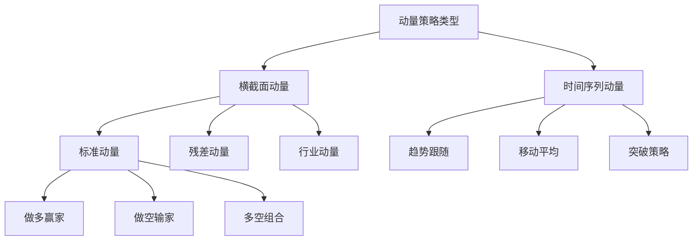

# 动量因子

## 概述

动量效应（Momentum Effect）是金融市场中最稳健和普遍的异象之一，指的是过去表现好的资产在未来一段时间内继续表现好，而过去表现差的资产继续表现差的现象。这一效应挑战了市场有效性假说，为量化投资提供了重要的收益来源。

**学习目标**：
- 理解动量效应的定义和历史发现
- 掌握动量因子的构建方法和技术细节
- 了解动量效应的理论解释和经济逻辑
- 学习动量策略的实施和风险管理
- 认识动量因子的局限性和崩盘风险

**为什么重要**：
动量效应是少数几个在学术研究发表后仍然持续有效的异象，在全球各类资产中都存在。对于量化投资者，动量策略是核心策略之一；对于主观投资者，理解动量效应有助于把握市场趋势和避免逆势操作。

## 动量效应的发现

### 学术研究历程

**早期发现**：
- Jegadeesh & Titman (1993)：系统性研究美股动量效应
- 1965-1989 年数据：买入赢家卖出输家，月度超额收益 1%
- 统计显著性强，经济意义大

**后续验证**：
- Rouwenhorst (1998)：12 个欧洲国家验证
- Asness, Moskowitz & Pedersen (2013)：跨资产类别验证
- 全球股票、债券、商品、外汇市场都存在动量效应

**时间跨度**：
- 短期反转（1 个月）：负动量
- 中期动量（3-12 个月）：正动量
- 长期反转（3-5 年）：负动量

### 动量效应的特征

**普遍性**：
- 跨市场：发达市场和新兴市场
- 跨资产：股票、债券、商品、外汇
- 跨时间：100 多年历史数据验证

**持续性**：
- 学术发表后仍然有效
- 1993 年论文发表后，效应略有减弱但依然显著
- 2000-2020 年平均年化收益约 5-8%

**周期性**：
- 牛市中更强
- 市场趋势明显时表现好
- 市场反转时表现差

## 动量因子构建

### 标准构建方法

**Jegadeesh-Titman 方法**：

1. **形成期（Formation Period）**：
   - 回溯期：通常 6-12 个月
   - 计算累计收益率
   - 跳过最近 1 个月（避免短期反转）

2. **排序分组**：
   - 按形成期收益率排序
   - 分为 10 组或 5 组
   - 赢家组（Winners）：收益率最高的 10%
   - 输家组（Losers）：收益率最低的 10%

3. **持有期（Holding Period）**：
   - 持有期：通常 1-6 个月
   - 做多赢家组，做空输家组
   - 等权重或市值加权

4. **再平衡**：
   - 月度再平衡
   - 重叠持有期策略：同时持有多个组合

**数学表达**：
$$MOM_{t} = \frac{1}{N}\sum_{i=1}^{N}(R_{i,t-12,t-2})$$

其中：
- $R_{i,t-12,t-2}$：股票 i 在 t-12 到 t-2 月的累计收益
- 跳过 t-1 月（最近一个月）

### 技术细节

**回溯期选择**：
- 3 个月：短期动量，波动大
- 6 个月：中期动量，平衡
- 12 个月：长期动量，稳定
- 最优：6-12 个月

**跳过期（Skip Period）**：
- 跳过最近 1 个月
- 原因：短期反转效应
- 提高策略稳定性

**持有期选择**：
- 1 个月：高换手，高成本
- 3 个月：平衡
- 6 个月：低换手，低成本
- 最优：1-3 个月

**权重方案**：
- 等权重：简单，但小盘股影响大
- 市值加权：降低交易成本
- 排名加权：根据动量强度加权
- 风险平价：根据波动率调整

### 动量因子变种

**1. 残差动量（Residual Momentum）**：
- 剔除市场和行业影响
- 只保留个股特质动量
- 降低系统性风险

**2. 行业动量（Industry Momentum）**：
- 行业层面的动量
- 行业轮动策略
- 与个股动量互补

**3. 52 周高点动量**：
- 当前价格接近 52 周高点的股票
- 心理锚定效应
- George & Hwang (2004)

**4. 加速动量（Accelerating Momentum）**：
- 动量的动量
- 收益率加速上升的股票
- 更强的信号

**5. 时间序列动量（Time Series Momentum）**：
- 资产自身的历史收益
- 不需要横截面比较
- Moskowitz, Ooi & Pedersen (2012)

## 动量效应的理论解释

### 行为金融学解释

**1. 反应不足（Underreaction）**：
- 投资者对新信息反应缓慢
- 好消息逐步反映到价格
- 价格趋势持续

**心理机制**：
- 保守主义偏差：过度依赖先验信念
- 确认偏差：选择性关注支持性信息
- 锚定效应：价格调整不充分

**2. 羊群效应（Herding）**：
- 投资者模仿他人行为
- 趋势自我强化
- 正反馈循环

**3. 过度自信（Overconfidence）**：
- 投资者过度自信自己的判断
- 延迟对错误的纠正
- 趋势延续

### 风险补偿解释

**1. 时变风险（Time-Varying Risk）**：
- 赢家股票风险降低
- 输家股票风险增加
- 动量收益是风险补偿

**2. 流动性风险**：
- 赢家股票流动性改善
- 输家股票流动性恶化
- 流动性溢价变化

**3. 信息扩散**：
- 信息逐步扩散到市场
- 价格发现过程
- 合理的价格调整

### 市场微观结构

**1. 交易摩擦**：
- 交易成本限制套利
- 卖空限制
- 价格调整缓慢

**2. 机构投资者行为**：
- 动量交易策略
- 趋势跟随
- 正反馈交易

**3. 信息不对称**：
- 知情交易者逐步建仓
- 价格逐步反映信息
- 趋势形成

## 动量策略实施

### 单资产动量策略

**股票动量**：
- 选股范围：大中盘股（流动性好）
- 形成期：6-12 个月
- 持有期：1-3 个月
- 再平衡：月度

**实施步骤**：
1. 计算所有股票的 6 个月动量
2. 排序并分为 10 组
3. 做多前 10%，做空后 10%
4. 等权重或市值加权
5. 每月再平衡

**预期收益**：
- 年化超额收益：5-10%
- 夏普比率：0.5-0.8
- 最大回撤：-30% 到 -50%

### 多资产动量策略

**资产类别**：
- 股票指数
- 债券
- 商品
- 外汇

**时间序列动量**：
- 每个资产独立判断
- 12 个月移动平均
- 价格 > 均线：做多
- 价格 < 均线：做空或现金

**优势**：
- 分散化
- 降低相关性
- 捕捉趋势

### 动量与其他因子结合

**动量 + 价值**：
- 负相关：分散风险
- 互补策略
- 提高夏普比率

**动量 + 质量**：
- 高质量赢家
- 降低崩盘风险
- 更稳定的收益

**动量 + 低波动**：
- 低波动赢家
- 防御性动量
- 降低回撤

## 动量策略的风险

### 崩盘风险（Momentum Crashes）

**特征**：
- 市场急剧反转时
- 赢家暴跌，输家暴涨
- 短期巨大损失

**历史案例**：
- 2009 年 3-4 月：-73% 月度损失
- 市场从底部反弹时
- 输家股票反弹最猛

**原因**：
- 赢家估值过高
- 输家过度悲观
- 市场情绪逆转

**应对措施**：
- 动态风险管理
- 波动率调整
- 止损机制
- 与价值因子对冲

### 拥挤交易风险

**问题**：
- 过多资金追逐动量
- 策略容量有限
- 收益率下降

**识别**：
- 动量 ETF 资金流入
- 策略拥挤度指标
- 市场情绪指标

**应对**：
- 容量管理
- 策略创新
- 另类数据

### 交易成本

**成本来源**：
- 买卖价差
- 市场冲击
- 佣金和费用

**影响**：
- 高换手率：月度 50-100%
- 小盘股成本更高
- 侵蚀收益

**降低成本**：
- 降低换手率
- 优化执行
- 使用衍生品

## 动量策略优化

### 动态调整

**市场状态调整**：
- 牛市：增加动量暴露
- 熊市：减少动量暴露
- 震荡市：降低仓位

**波动率调整**：
- 高波动：降低杠杆
- 低波动：提高杠杆
- 目标波动率：15%

**估值调整**：
- 动量 + 估值筛选
- 避免高估值赢家
- 提高安全边际

### 信号增强

**多时间框架**：
- 短期（3 个月）
- 中期（6 个月）
- 长期（12 个月）
- 综合信号

**多维度动量**：
- 价格动量
- 盈利动量
- 分析师预期动量
- 综合评分

**机器学习**：
- 非线性关系
- 特征工程
- 预测模型

## 实践案例

### 案例 1：美股动量策略

**策略设计**：
- 股票池：S&P 500
- 形成期：12 个月（跳过最近 1 个月）
- 持有期：1 个月
- 做多前 20%，做空后 20%

**回测结果（2000-2020）**：
- 年化收益：8.5%
- 波动率：18%
- 夏普比率：0.47
- 最大回撤：-45%（2009 年）

**交易成本**：
- 月度换手率：60%
- 估计交易成本：2% 年化
- 净收益：6.5%

### 案例 2：多资产动量

**资产配置**：
- 股票：40%
- 债券：30%
- 商品：20%
- 外汇：10%

**策略**：
- 12 个月时间序列动量
- 每月再平衡
- 目标波动率：10%

**结果（2000-2020）**：
- 年化收益：7.2%
- 波动率：9.5%
- 夏普比率：0.76
- 最大回撤：-18%

**优势**：
- 分散化
- 低相关性
- 更稳定

## 延伸阅读

### 经典论文

1. **Jegadeesh, N., & Titman, S. (1993)**. "Returns to Buying Winners and Selling Losers: Implications for Stock Market Efficiency". *The Journal of Finance*, 48(1), 65-91.

2. **Moskowitz, T. J., Ooi, Y. H., & Pedersen, L. H. (2012)**. "Time Series Momentum". *Journal of Financial Economics*, 104(2), 228-250.

3. **Asness, C. S., Moskowitz, T. J., & Pedersen, L. H. (2013)**. "Value and Momentum Everywhere". *The Journal of Finance*, 68(3), 929-985.

4. **Daniel, K., Hirshleifer, D., & Subrahmanyam, A. (1998)**. "Investor Psychology and Security Market Under- and Overreactions". *The Journal of Finance*, 53(6), 1839-1885.

5. **Hong, H., & Stein, J. C. (1999)**. "A Unified Theory of Underreaction, Momentum Trading, and Overreaction in Asset Markets". *The Journal of Finance*, 54(6), 2143-2184.

### 实践指南

6. **Antonacci, G. (2014)**. *Dual Momentum Investing: An Innovative Strategy for Higher Returns with Lower Risk*. McGraw-Hill Education.

7. **Faber, M. T. (2007)**. "A Quantitative Approach to Tactical Asset Allocation". *The Journal of Wealth Management*, 9(4), 69-79.

8. **Hurst, B., Ooi, Y. H., & Pedersen, L. H. (2017)**. "A Century of Evidence on Trend-Following Investing". *The Journal of Portfolio Management*, 44(1), 15-29.

## 参考文献

[前面列出的 8 篇文献，加上以下补充]

9. George, T. J., & Hwang, C. Y. (2004). "The 52-week high and momentum investing". *The Journal of Finance*, 59(5), 2145-2176.

10. Barroso, P., & Santa-Clara, P. (2015). "Momentum has its moments". *Journal of Financial Economics*, 116(1), 111-120.

11. Daniel, K., & Moskowitz, T. J. (2016). "Momentum crashes". *Journal of Financial Economics*, 122(2), 221-247.

12. Novy-Marx, R. (2012). "Is momentum really momentum?". *Journal of Financial Economics*, 103(3), 429-453.

13. Rouwenhorst, K. G. (1998). "International momentum strategies". *The Journal of Finance*, 53(1), 267-284.

14. Carhart, M. M. (1997). "On persistence in mutual fund performance". *The Journal of Finance*, 52(1), 57-82.

15. Blitz, D., & Van Vliet, P. (2008). "Global tactical cross-asset allocation: Applying value and momentum across asset classes". *The Journal of Portfolio Management*, 35(1), 23-38.
8. Fama, E. F., & French, K. R. (1993). "Common Risk Factors in the Returns on Stocks and Bonds." *Journal of Financial Economics*, 33(1), 3-56.

## 深度分析

### 核心机制解析

理解本主题需要从多个维度进行系统性分析。以下从理论基础、实践应用和历史验证三个层面展开深度探讨。

**理论基础层面**：本主题的核心逻辑建立在经济学和金融学的基本原理之上。通过对基础理论的深入理解，投资者能够建立起稳固的分析框架，避免被市场短期噪音所干扰。

**实践应用层面**：理论必须与实践相结合才能产生价值。在实际投资决策中，需要将抽象的概念转化为具体的分析工具和决策标准。

**历史验证层面**：金融市场有着丰富的历史记录，通过研究历史案例，我们可以验证理论的有效性，并从中提炼出具有普遍意义的规律。

### 关键影响因素

影响本主题的关键因素可以从以下几个维度进行分析：

1. **宏观经济环境**：利率水平、通货膨胀率、经济增长速度等宏观变量对本主题有着深远影响。在不同的宏观经济周期中，相关指标的表现会呈现出显著差异。

2. **市场结构因素**：市场参与者的构成、信息传播机制、流动性状况等市场结构因素决定了价格发现的效率和准确性。

3. **政策监管环境**：政府政策、监管框架的变化会直接影响相关市场的运作规则和参与者行为。

4. **技术创新驱动**：技术进步不断改变着金融市场的运作方式，从算法交易到区块链技术，每一次技术革新都带来新的机遇和挑战。

5. **全球化与地缘政治**：在全球化背景下，各国市场之间的联动性日益增强，地缘政治风险的影响也越来越不可忽视。

### 量化分析框架

为了更精确地分析和评估，可以采用以下量化框架：

| 分析维度 | 关键指标 | 参考基准 | 分析方法 |
|---------|---------|---------|---------|
| 规模评估 | 绝对值与相对值 | 历史均值 | 趋势分析 |
| 质量评估 | 稳定性指标 | 行业对标 | 横向比较 |
| 风险评估 | 波动率指标 | 风险阈值 | 情景分析 |
| 价值评估 | 估值倍数 | 历史区间 | 回归分析 |

通过系统性地应用上述框架，投资者可以对目标进行全面、客观的评估，从而做出更加理性的投资决策。

