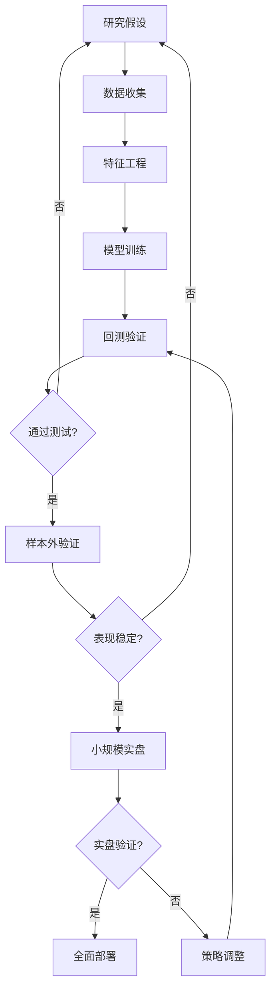

# 量化基金研究

## 概述

量化对冲基金代表了现代投资管理的最前沿，它们运用数学模型、统计方法、机器学习算法和高性能计算来寻找市场中的投资机会。这些基金通常由数学家、物理学家、计算机科学家和工程师组成，而非传统的金融分析师。

量化基金的核心优势在于：
- **系统化决策**：消除人为情绪和认知偏差
- **规模化处理**：同时分析数千只证券
- **快速执行**：毫秒级的交易执行能力
- **数据驱动**：基于历史数据和统计规律
- **风险控制**：精确的风险测量和管理

本文将深入研究全球最成功的量化基金，分析它们的投资策略、技术优势、组织文化和业绩表现，为有志于量化投资的工程师提供实践指南。

## 量化基金的演进历史

### 早期探索（1970s-1980s）

量化投资的起源可以追溯到 1970 年代学术界对市场效率的研究。

**学术基础**：
- Eugene Fama 的有效市场假说（EMH）
- Harry Markowitz 的现代投资组合理论（MPT）
- William Sharpe 的资本资产定价模型（CAPM）
- Fischer Black 和 Myron Scholes 的期权定价模型

**先驱者**：
- **Edward Thorp**：第一位将数学应用于投资的先驱，从 21 点算牌到可转债套利
- **Barr Rosenberg**：创建了第一个多因子风险模型（BARRA 模型）
- **David Shaw**：计算机科学家转型，创立 D.E. Shaw

### 量化革命（1990s-2000s）

1990 年代，计算能力的提升和金融数据的丰富为量化投资创造了条件：

**技术突破**：
- 高性能计算机的普及
- 实时市场数据的可获得性
- 电子交易系统的发展
- 互联网带来的信息优势

**策略创新**：
- 统计套利策略的成熟
- 高频交易的兴起
- 机器学习在投资中的应用
- 另类数据的使用

### 现代量化时代（2010s-至今）

进入 21 世纪，量化基金已经成为金融市场的主导力量：

**市场地位**：
- 量化基金管理超过 1 万亿美元资产
- 占美国股票交易量的 60-70%
- 在固定收益、外汇、大宗商品市场也占据重要地位

**技术前沿**：
- 深度学习和神经网络
- 自然语言处理（NLP）分析新闻和社交媒体
- 卫星图像、信用卡数据等另类数据
- 云计算和分布式系统

## 顶级量化基金深度分析

### Renaissance Technologies（文艺复兴科技）

**基金概况**：
- **创始人**：James Simons（数学家，前 NSA 密码破译员）
- **成立时间**：1982 年
- **旗舰基金**：Medallion Fund（大奖章基金）
- **管理规模**：约 130 亿美元（仅限内部员工）
- **业绩记录**：1988-2018 年平均年化回报 66%（扣除费用前），39%（扣除费用后）

**投资策略**：

Renaissance 的策略高度保密，但已知的特点包括：

1. **短期统计套利**：
   - 持仓周期通常为 1-2 天
   - 利用短期价格异常
   - 高频交易策略
   - 每年进行数百万笔交易

2. **多市场覆盖**：
   - 股票、期货、外汇、固定收益
   - 全球市场参与
   - 跨资产类别套利

3. **信号挖掘**：
   - 使用数千个微小的交易信号
   - 每个信号单独可能不显著
   - 组合后产生稳定收益
   - 持续寻找新的市场异常

**技术优势**：

1. **人才团队**：
   - 雇佣数学家、物理学家、统计学家
   - 很少雇佣传统金融背景人员
   - 博士学位比例极高
   - 鼓励学术研究文化

2. **数据处理**：
   - 收集和处理海量历史数据
   - 自建数据清洗和标准化系统
   - 实时数据流处理能力
   - 数据质量控制严格

3. **计算基础设施**：
   - 超级计算机集群
   - 低延迟交易系统
   - 分布式计算架构
   - 持续的技术投资

**组织文化**：
- 极度保密，很少对外披露策略细节
- 学术研究氛围，鼓励探索和创新
- 慷慨的薪酬和利润分享
- 长期雇佣关系，员工流失率低

**业绩分析**：

Medallion Fund 是投资史上最成功的基金之一：
- 30 年间仅有一年亏损（1989 年）
- 夏普比率估计超过 2.0
- 即使在市场危机中也能盈利
- 2008 年金融危机期间回报 +80%

**费用结构**：
- 管理费：5%
- 业绩提成：44%
- 即使扣除高额费用，投资者仍获得惊人回报

**投资者启示**：
- 短期市场效率低下确实存在
- 技术和数据优势可以转化为持续收益
- 严格的风险管理至关重要
- 保密和信息优势是竞争壁垒

### Two Sigma Investments

**基金概况**：
- **创始人**：John Overdeck 和 David Siegel（均为 D.E. Shaw 前员工）
- **成立时间**：2001 年
- **管理规模**：约 600 亿美元
- **员工数量**：1,700+ 人，其中约 1,000 人为技术和研究人员

**投资策略**：

Two Sigma 采用多策略方法，结合机器学习和大数据分析：

1. **机器学习驱动**：
   - 使用监督学习预测资产价格
   - 无监督学习发现市场模式
   - 强化学习优化交易执行
   - 深度学习处理非结构化数据

2. **大数据分析**：
   - 处理 PB 级别的数据
   - 另类数据源：卫星图像、社交媒体、网络爬虫
   - 实时新闻和事件分析
   - 自然语言处理（NLP）

3. **多策略组合**：
   - 股票多空策略
   - 统计套利
   - 宏观策略
   - 固定收益套利

**技术架构**：

1. **数据平台**：
   - 分布式数据存储系统
   - 实时数据流处理
   - 数据版本控制和回溯
   - 数据质量监控

2. **研究平台**：
   - Jupyter Notebook 环境
   - 共享代码库和模型库
   - 回测框架
   - 协作工具

3. **交易系统**：
   - 低延迟执行系统
   - 智能订单路由
   - 交易成本分析（TCA）
   - 风险实时监控

**组织特点**：
- 开放的研究文化，鼓励知识共享
- 定期举办内部研讨会和讲座
- 与学术界保持紧密联系
- 支持员工发表学术论文

**业绩表现**：
- 旗舰基金年化回报约 15-20%
- 夏普比率约 1.5
- 在 2020 年疫情期间表现优异
- 长期稳定的风险调整后回报

**投资者启示**：
- 机器学习可以有效应用于投资
- 另类数据提供信息优势
- 技术基础设施是竞争力的关键
- 开放文化促进创新

### AQR Capital Management

**基金概况**：
- **创始人**：Cliff Asness（芝加哥大学 Eugene Fama 的学生）
- **成立时间**：1998 年
- **管理规模**：约 1,000 亿美元（高峰期超过 2,000 亿）
- **投资风格**：学术研究驱动的因子投资

**投资策略**：

AQR 是将学术研究转化为投资策略的典范：

1. **因子投资**：
   - 价值因子（Value）
   - 动量因子（Momentum）
   - 质量因子（Quality）
   - 低波动因子（Low Volatility）
   - 套利因子（Carry）

2. **多资产类别**：
   - 股票多空
   - 全球宏观
   - 固定收益
   - 大宗商品
   - 外汇

3. **风险平价**：
   - 基于风险贡献的资产配置
   - 杠杆使用优化
   - 动态再平衡

**学术贡献**：

AQR 的创始人和研究团队发表了大量学术论文：
- Cliff Asness 关于价值和动量的研究
- Andrea Frazzini 关于低波动异常的研究
- Lasse Pedersen 关于流动性和套利的研究
- 定期发布研究报告，对行业透明

**业绩特点**：
- 长期稳定的超额收益
- 2018-2020 年经历了价值因子的困难期
- 强调风险调整后回报而非绝对回报
- 费用相对较低（相比其他对冲基金）

**投资者启示**：
- 学术研究可以转化为实际投资策略
- 因子投资需要长期坚持
- 短期表现不佳不代表策略失效
- 透明度和教育对投资者很重要

### Citadel（城堡投资）

**基金概况**：
- **创始人**：Ken Griffin
- **成立时间**：1990 年
- **管理规模**：约 500 亿美元（对冲基金）+ 做市商业务
- **业务范围**：多策略对冲基金 + 高频做市商（Citadel Securities）

**投资策略**：

Citadel 采用多策略方法，结合量化和基本面分析：

1. **量化策略**：
   - 统计套利
   - 高频交易
   - 期权做市
   - 波动率套利

2. **基本面策略**：
   - 股票多空
   - 信用策略
   - 可转债套利
   - 并购套利

3. **全球宏观**：
   - 利率策略
   - 外汇交易
   - 大宗商品
   - 新兴市场

**技术优势**：

1. **交易基础设施**：
   - 全球最快的交易系统之一
   - 微秒级延迟
   - 直连交易所
   - 智能订单路由

2. **做市商业务协同**：
   - Citadel Securities 是美国最大的股票做市商
   - 处理约 25% 的美国股票交易量
   - 订单流信息优势（合规范围内）
   - 流动性提供能力

**风险管理**：
- 实时风险监控系统
- 严格的止损纪律
- 多策略分散化
- 压力测试和情景分析

**业绩表现**：
- 旗舰基金 Wellington 年化回报约 19%（1990-2022）
- 2008 年金融危机期间亏损，但快速恢复
- 2020 年疫情期间回报 +24%
- 长期稳定的业绩记录

**投资者启示**：
- 多策略分散化降低风险
- 技术基础设施是核心竞争力
- 风险管理比策略本身更重要
- 危机中的表现体现真实能力

### D.E. Shaw & Co.

**基金概况**：
- **创始人**：David E. Shaw（计算机科学家）
- **成立时间**：1988 年
- **管理规模**：约 600 亿美元
- **特点**：计算金融的先驱

**投资策略**：

D.E. Shaw 是最早将计算机科学应用于投资的机构之一：

1. **计算套利**：
   - 利用计算能力发现定价错误
   - 跨市场套利
   - 统计关系挖掘
   - 复杂衍生品定价

2. **系统化宏观**：
   - 基于模型的宏观交易
   - 利率和外汇策略
   - 大宗商品交易
   - 新兴市场投资

3. **长短期股票**：
   - 量化选股模型
   - 基本面与量化结合
   - 行业中性策略
   - 全球股票覆盖

**技术创新**：
- 早期采用并行计算
- 自主开发交易系统
- 机器学习算法研究
- 大数据处理能力

**人才培养**：

D.E. Shaw 被称为"量化基金的黄埔军校"：
- Jeff Bezos（亚马逊创始人）曾在此工作
- John Overdeck 和 David Siegel（Two Sigma 创始人）
- 许多校友创立了自己的量化基金

**业绩特点**：
- 长期稳定的回报
- 较低的波动率
- 多策略分散化
- 风险控制严格

### Millennium Management

**基金概况**：
- **创始人**：Israel Englander
- **成立时间**：1989 年
- **管理规模**：约 570 亿美元
- **策略类型**：多策略平台模式

**独特模式**：

Millennium 采用"pod"（团队）模式，与其他量化基金不同：

1. **Pod 结构**：
   - 将资金分配给多个独立的交易团队（pods）
   - 每个 pod 有 2-5 名交易员
   - 各 pod 独立运作，策略保密
   - 约 200+ 个 pods

2. **风险管理**：
   - 每个 pod 有严格的风险限额
   - 实时监控和止损
   - 表现不佳的 pod 会被关闭
   - 整体组合风险控制

3. **激励机制**：
   - 交易员获得利润的 15-20%
   - 表现优异者获得更多资金
   - 竞争性的内部环境
   - 高流动率（相比其他量化基金）

**策略多样性**：
- 股票多空
- 统计套利
- 可转债套利
- 固定收益相对价值
- 大宗商品交易
- 宏观策略

**业绩表现**：
- 年化回报约 13-15%
- 极低的波动率（年化波动率 <5%）
- 很少出现亏损年份
- 夏普比率约 2.5-3.0

**投资者启示**：
- 多策略分散化可以降低风险
- 严格的风险管理是成功关键
- 人才激励机制影响业绩
- 平台模式可以规模化

### Bridgewater Associates（桥水基金）

**基金概况**：
- **创始人**：Ray Dalio
- **成立时间**：1975 年
- **管理规模**：约 1,500 亿美元（全球最大对冲基金）
- **投资风格**：系统化宏观投资

**投资策略**：

虽然 Bridgewater 不是纯量化基金，但其系统化方法值得研究：

1. **Pure Alpha 策略**：
   - 全球宏观多空策略
   - 基于经济原理和历史模式
   - 跨资产类别配置
   - 目标年化回报 12-15%

2. **All Weather 策略**：
   - 风险平价组合
   - 适应不同经济环境
   - 低波动率
   - 目标年化回报 7-10%

**系统化方法**：

1. **经济机器模型**：
   - 将经济视为机器，有规律可循
   - 债务周期理论
   - 通胀和增长的四象限
   - 历史数据验证

2. **决策规则**：
   - 将投资原则编码为算法
   - 消除情绪影响
   - 可回测和验证
   - 持续改进

**组织文化**：
- 极度透明和开放
- 鼓励"创意择优"（Idea Meritocracy）
- 系统化决策流程
- 持续学习和改进

**业绩表现**：
- Pure Alpha 长期年化回报约 12%
- All Weather 年化回报约 7-8%
- 2020 年 Pure Alpha 回报 +14.6%
- 风险调整后回报优秀

**投资者启示**：
- 宏观投资可以系统化
- 经济原理和历史规律有价值
- 风险平价是有效的配置方法
- 组织文化影响投资业绩

### Winton Group

**基金概况**：
- **创始人**：David Harding（英国数学家）
- **成立时间**：1997 年
- **管理规模**：约 200 亿美元（高峰期超过 300 亿）
- **总部**：伦敦

**投资策略**：

Winton 专注于趋势跟踪和统计套利：

1. **趋势跟踪**：
   - 中长期趋势识别
   - 跨市场应用
   - 动量策略
   - 风险管理严格

2. **统计模型**：
   - 基于统计显著性
   - 大样本数据验证
   - 避免过拟合
   - 样本外测试

**科学方法**：
- 强调统计严谨性
- 避免数据挖掘陷阱
- 使用贝叶斯方法
- 持续的学术研究

**业绩波动**：
- 2010-2014 年表现优异
- 2015-2019 年遭遇困难（趋势策略失效）
- 2020 年后业绩改善
- 展示了量化策略的周期性

**投资者启示**：
- 即使是成功的策略也会经历困难期
- 统计严谨性不能保证持续盈利
- 市场环境变化影响策略有效性
- 需要耐心和长期视角

## 量化基金的核心能力

### 数据获取和处理

**传统数据**：
- 价格和成交量数据
- 财务报表数据
- 宏观经济数据
- 分析师预测数据

**另类数据**：
- 卫星图像（停车场车辆数、油罐储量）
- 信用卡交易数据
- 社交媒体情绪
- 网络爬虫数据（价格、库存）
- 地理位置数据
- 天气数据

**数据处理能力**：
- 数据清洗和标准化
- 缺失值处理
- 异常值检测
- 数据版本控制
- 实时数据流处理

### 模型开发和验证

**模型开发流程**：

**验证方法**：
- 交叉验证（Cross-validation）
- 样本外测试（Out-of-sample testing）
- 前推分析（Walk-forward analysis）
- 蒙特卡洛模拟
- 压力测试

**避免过拟合**：
- 限制模型复杂度
- 使用正则化技术
- 增加样本量
- 理论支持的特征选择
- 多重假设检验校正

### 交易执行能力

**执行算法**：
- VWAP（成交量加权平均价）
- TWAP（时间加权平均价）
- Implementation Shortfall
- 自适应算法
- 暗池交易

**成本控制**：
- 交易成本分析（TCA）
- 市场冲击最小化
- 佣金优化
- 滑点控制
- 时机选择

**技术要求**：
- 低延迟网络
- 协议栈优化
- FPGA 硬件加速
- 智能订单路由
- 实时监控

### 风险管理系统

**风险测量**：
- VaR（风险价值）
- CVaR（条件风险价值）
- 压力测试
- 情景分析
- 敏感性分析

**风险控制**：
- 实时风险监控
- 自动止损机制
- 仓位限制
- 杠杆控制
- 流动性管理

**归因分析**：
- 因子归因
- 策略归因
- 交易成本归因
- 业绩分解
- 持续改进

## 量化基金的投资策略分类

### 高频交易（HFT）

**策略特点**：
- 持仓时间：秒级到分钟级
- 交易频率：每天数千到数百万笔
- 利润来源：微小的价格差异
- 技术要求：极低延迟

**主要策略**：
1. **做市策略**：提供流动性，赚取买卖价差
2. **套利策略**：跨市场、跨产品套利
3. **订单预测**：预测大单对价格的影响
4. **事件驱动**：快速响应新闻和数据发布

**代表基金**：
- Citadel Securities
- Virtu Financial
- Jump Trading
- Tower Research Capital

**挑战**：
- 技术军备竞赛
- 利润空间压缩
- 监管压力增加
- 需要持续投资

### 统计套利

**策略特点**：
- 持仓时间：天到周
- 基于统计关系
- 市场中性
- 风险可控

**主要方法**：
1. **配对交易**：交易相关性高的证券对
2. **均值回归**：利用价格偏离均值的机会
3. **协整套利**：基于长期均衡关系
4. **因子中性**：对冲系统性风险

**代表基金**：
- Renaissance Technologies
- Two Sigma
- PDT Partners
- Quantitative Investment Management (QIM)

**风险**：
- 关系破裂风险
- 流动性风险
- 模型风险
- 拥挤交易风险

### 因子投资

**策略特点**：
- 持仓时间：月到年
- 基于学术研究
- 系统化选股
- 长期有效

**核心因子**：
1. **价值因子**：低估值股票
2. **动量因子**：趋势延续
3. **质量因子**：高质量企业
4. **低波动因子**：低风险股票
5. **规模因子**：小盘股溢价

**代表基金**：
- AQR Capital Management
- Acadian Asset Management
- Dimensional Fund Advisors
- Research Affiliates

**实施方式**：
- 多因子组合
- 因子时机选择
- 动态权重调整
- 风险控制

### 机器学习策略

**应用领域**：
1. **预测模型**：
   - 价格预测
   - 波动率预测
   - 风险预测
   - 事件影响预测

2. **模式识别**：
   - 图表模式
   - 市场状态识别
   - 异常检测
   - 关系发现

3. **自然语言处理**：
   - 新闻情绪分析
   - 财报解读
   - 社交媒体监控
   - 管理层语言分析

**常用算法**：
- 随机森林（Random Forest）
- 梯度提升（Gradient Boosting）
- 神经网络（Neural Networks）
- 深度学习（Deep Learning）
- 强化学习（Reinforcement Learning）

**代表基金**：
- Two Sigma
- WorldQuant
- Man AHL
- Numerai（众包模型）

**挑战**：
- 过拟合风险高
- 解释性差
- 数据需求大
- 计算成本高

## 量化基金的业绩分析

### 长期业绩对比

| 基金 | 年化回报 | 夏普比率 | 最大回撤 | 成立年份 |
|------|---------|---------|---------|---------|
| Renaissance Medallion | 39%* | >2.0 | -20% | 1988 |
| Citadel Wellington | 19% | 1.5 | -55% (2008) | 1990 |
| Two Sigma Compass | 17% | 1.5 | -15% | 2001 |
| AQR Absolute Return | 10% | 1.0 | -25% | 1998 |
| Millennium | 13% | 2.5 | -5% | 1989 |
| D.E. Shaw Composite | 15% | 1.3 | -20% | 1988 |

*扣除费用后

### 业绩特征分析

**超额收益来源**：
1. **信息优势**：更快、更全面的数据处理
2. **执行优势**：更低的交易成本
3. **模型优势**：更准确的预测能力
4. **风险管理**：更好的风险控制

**业绩持续性**：
- 顶级量化基金展现长期稳定性
- 但也会经历困难期（如 AQR 的 2018-2020）
- 策略容量限制影响规模扩张
- 市场环境变化影响策略有效性

**与传统基金对比**：
- 量化基金平均夏普比率更高
- 波动率通常更低
- 最大回撤控制更好
- 但绝对回报不一定更高

### 危机中的表现

**2008 年金融危机**：
- Renaissance Medallion：+80%
- Citadel：-55%（后快速恢复）
- AQR：-30%
- 表现差异巨大，取决于策略类型

**2020 年疫情危机**：
- 大多数量化基金表现优异
- 快速适应市场变化
- 风险管理系统发挥作用
- 展现了系统化方法的优势

**2022 年加息周期**：
- 因子策略表现分化
- 价值因子表现优异
- 动量策略遭遇挑战
- 宏观策略获利

## 量化基金的运营模式

### 人才招聘和培养

**招聘标准**：
- 顶尖大学的博士学位（数学、物理、计算机）
- 强大的编程能力（Python、C++、Java）
- 统计和机器学习知识
- 解决问题的能力
- 团队合作精神

**培训体系**：
- 入职培训项目
- 导师制度
- 内部研讨会
- 学术交流
- 持续学习文化

**薪酬结构**：
- 基本工资：20-50 万美元
- 奖金：基本工资的 1-5 倍
- 利润分成：顶级交易员可获得数百万
- 股权激励：长期留任

### 技术基础设施

**硬件投资**：
- 高性能计算集群
- 低延迟网络设备
- 协处理器（GPU、FPGA）
- 数据存储系统
- 备份和灾备系统

**软件系统**：
- 回测平台
- 实时交易系统
- 风险管理系统
- 数据管理平台
- 监控和报警系统

**成本结构**：
- 技术投资占运营成本的 30-50%
- 持续的升级和维护
- 规模效应明显
- 技术优势是护城河

### 合规和监管

**监管要求**：
- SEC 注册和报告
- 交易监控和审计
- 反洗钱（AML）合规
- 最佳执行义务
- 信息披露要求

**内部控制**：
- 交易前风险检查
- 实时监控系统
- 异常交易报警
- 定期审计
- 合规培训

**监管趋势**：
- 对高频交易的审查增加
- 算法交易的透明度要求
- 市场操纵的防范
- 系统性风险的关注

## 量化投资的未来趋势

### 人工智能的深化应用

**深度学习**：
- 处理非结构化数据（图像、文本、音频）
- 发现复杂的非线性关系
- 端到端学习
- 迁移学习应用

**强化学习**：
- 优化交易执行
- 动态资产配置
- 自适应策略
- 多智能体系统

**挑战**：
- 可解释性问题
- 过拟合风险
- 计算成本
- 数据需求

### 另类数据的扩展

**新数据源**：
- 物联网（IoT）数据
- 区块链数据
- 基因组数据
- 气候数据
- 供应链数据

**数据挑战**：
- 数据质量参差不齐
- 隐私和合规问题
- 数据成本上升
- 信息优势缩短

### 量子计算的潜力

**应用前景**：
- 组合优化
- 风险模拟
- 期权定价
- 机器学习加速

**现状**：
- 仍处于早期阶段
- 实用化需要时间
- 部分基金已开始研究
- 长期潜力巨大

### 去中心化金融（DeFi）

**新机会**：
- 加密货币套利
- 流动性挖矿
- 自动做市商（AMM）
- 链上数据分析

**挑战**：
- 监管不确定性
- 技术风险
- 流动性问题
- 市场成熟度

## 个人投资者的启示

### 可借鉴的原则

**系统化思维**：
- 建立明确的投资规则
- 消除情绪决策
- 记录和回顾交易
- 持续改进流程

**数据驱动**：
- 基于数据而非直觉
- 回测投资想法
- 量化风险和回报
- 客观评估业绩

**风险管理**：
- 设定止损规则
- 控制仓位大小
- 分散投资
- 定期再平衡

**持续学习**：
- 学习编程和数据分析
- 理解统计方法
- 跟踪学术研究
- 实践和迭代

### 可使用的工具

**编程语言**：
- Python：最流行的量化投资语言
- R：统计分析
- Julia：高性能计算
- C++：低延迟交易

**数据平台**：
- Yahoo Finance：免费历史数据
- Alpha Vantage：API 接口
- Quandl：另类数据
- Bloomberg Terminal：专业数据（昂贵）

**回测框架**：
- Backtrader：Python 回测库
- Zipline：Quantopian 开源框架
- QuantConnect：云端回测平台
- Backtest.py：轻量级回测工具

**机器学习库**：
- Scikit-learn：经典机器学习
- TensorFlow/PyTorch：深度学习
- XGBoost：梯度提升
- LightGBM：高效训练

### 现实的期望

**收益预期**：
- 个人投资者很难复制顶级量化基金的业绩
- 年化 10-15% 的超额收益已经非常优秀
- 需要长期坚持才能看到效果
- 短期可能表现不佳

**资源限制**：
- 数据获取成本
- 计算资源限制
- 交易成本更高
- 信息劣势

**优势领域**：
- 长期因子投资（容量大）
- 小盘股策略（大基金难以参与）
- 特定行业专长
- 灵活性和适应性

## 量化投资的风险和局限

### 模型风险

**过拟合**：
- 在历史数据上表现完美
- 样本外表现糟糕
- 参数过度优化
- 缺乏理论支持

**数据偏差**：
- 生存偏差（Survivorship Bias）
- 前视偏差（Look-ahead Bias）
- 数据挖掘偏差
- 样本选择偏差

**模型失效**：
- 市场结构变化
- 监管环境改变
- 技术进步
- 竞争加剧

### 系统性风险

**技术故障**：
- 软件 Bug
- 硬件故障
- 网络中断
- 数据错误

**著名事故**：
- 2012 年 Knight Capital：软件错误导致 4.4 亿美元损失
- 2010 年闪电崩盘：算法交易引发市场暴跌
- 2007 年量化危机：多家量化基金同时亏损

**风险控制**：
- 多重验证机制
- 熔断机制
- 人工监督
- 灾备系统

### 策略拥挤

**拥挤交易**：
- 多家基金使用相似策略
- 同时买入或卖出
- 放大市场波动
- 利润空间压缩

**2007 年量化危机**：
- 多家量化基金同时去杠杆
- 相似持仓被迫平仓
- 短期内巨额亏损
- 展示了策略拥挤的风险

**应对方法**：
- 策略多样化
- 监控拥挤度指标
- 灵活调整仓位
- 保持流动性

### 监管和道德问题

**监管关注**：
- 高频交易的公平性
- 市场操纵行为
- 内幕信息使用
- 算法透明度

**道德争议**：
- 是否加剧市场波动
- 是否损害长期投资者利益
- 技术优势是否公平
- 社会价值的质疑

## 成功量化基金的共同特征

### 人才密度

**团队构成**：
- 高比例的博士学位
- 多学科背景（数学、物理、计算机、工程）
- 持续的人才投资
- 竞争性的薪酬

**文化特点**：
- 学术研究氛围
- 开放的知识共享（内部）
- 鼓励创新和实验
- 数据和证据驱动

### 技术投资

**持续投入**：
- 每年投入数千万到数亿美元
- 技术团队占员工 50% 以上
- 自主研发核心系统
- 保持技术领先

**竞争壁垒**：
- 技术优势难以复制
- 需要长期积累
- 规模效应明显
- 形成护城河

### 风险管理文化

**风险优先**：
- 风险管理是核心竞争力
- 实时监控和控制
- 严格的止损纪律
- 压力测试常态化

**生存第一**：
- 避免致命风险
- 保持流动性
- 控制杠杆
- 分散化投资

### 长期视角

**策略开发**：
- 基于长期有效的原理
- 避免短期数据挖掘
- 理论支持的策略
- 持续改进和迭代

**业绩评估**：
- 关注长期表现
- 风险调整后回报
- 策略容量考虑
- 可持续性分析

## 量化投资的学习路径

### 基础知识

**数学基础**：
- 概率论和统计学
- 线性代数
- 微积分
- 优化理论
- 时间序列分析

**金融知识**：
- 金融市场结构
- 资产定价理论
- 投资组合理论
- 衍生品定价
- 风险管理

**编程技能**：
- Python 编程
- 数据处理（Pandas、NumPy）
- 可视化（Matplotlib、Plotly）
- 机器学习（Scikit-learn）
- 回测框架

### 进阶学习

**量化策略**：
- 因子投资
- 统计套利
- 趋势跟踪
- 均值回归
- 事件驱动

**机器学习**：
- 监督学习
- 无监督学习
- 强化学习
- 深度学习
- 自然语言处理

**高级主题**：
- 高频交易
- 期权策略
- 风险模型
- 交易执行
- 另类数据

### 实践项目

**初级项目**：
1. 实现简单的动量策略
2. 构建多因子选股模型
3. 配对交易策略
4. 均值回归策略

**中级项目**：
1. 机器学习预测模型
2. 情绪分析策略
3. 期权波动率套利
4. 跨市场套利

**高级项目**：
1. 完整的量化交易系统
2. 实时风险管理系统
3. 自动化交易执行
4. 另类数据挖掘

### 学习资源

**在线课程**：
- Coursera：Machine Learning for Trading
- Udacity：AI for Trading
- QuantInsti：量化交易课程
- WorldQuant University：金融工程硕士

**书籍推荐**：
- 《量化交易：如何建立自己的算法交易业务》- Ernest Chan
- 《主动投资组合管理》- Richard Grinold
- 《统计套利》- Andrew Pole
- 《机器学习与资产定价》- Marcos López de Prado

**社区和平台**：
- QuantConnect：云端量化平台
- Quantopian（已关闭，但资源仍可用）
- Kaggle：数据科学竞赛
- GitHub：开源量化项目

## 关键要点

1. **量化基金的成功基于技术、数据和人才的综合优势**，而非单一的"圣杯"策略

2. **顶级量化基金如 Renaissance 展现了惊人的业绩**，但这需要顶尖人才、巨额技术投资和长期积累

3. **不同量化基金采用不同策略**：高频交易、统计套利、因子投资、机器学习等，各有优劣

4. **风险管理是量化投资的核心**，严格的风险控制是长期生存的关键

5. **量化策略也会经历困难期**，如 AQR 在 2018-2020 年的价值因子困境，需要长期视角

6. **个人投资者可以学习量化方法**，但要有现实的期望，重点在系统化思维和风险管理

7. **技术优势是护城河**，但需要持续投资才能保持，竞争日益激烈

8. **量化投资的未来在于 AI、另类数据和新技术**，但基本原则不变：寻找市场异常，严格风险控制

9. **工程师背景是优势**，编程和数据分析能力可以转化为投资优势

10. **从简单策略开始**，逐步积累经验，避免过度复杂化

## 延伸阅读

### 书籍
1. 《The Man Who Solved the Market》- Gregory Zuckerman（Renaissance 传记）
2. 《More Money Than God》- Sebastian Mallaby（对冲基金历史）
3. 《Quantitative Trading》- Ernest Chan
4. 《Algorithmic Trading》- Jeffrey Bacidore
5. 《Machine Learning for Asset Managers》- Marcos López de Prado

### 学术论文
1. "The Quants" - Scott Patterson
2. "Efficiently Inefficient" - Lasse Pedersen
3. "Active Portfolio Management" - Richard Grinold
4. "Advances in Financial Machine Learning" - Marcos López de Prado

### 在线资源
1. AQR 研究论文库：https://www.aqr.com/Insights/Research
2. Two Sigma 博客：https://www.twosigma.com/insights
3. QuantConnect 文档：https://www.quantconnect.com/docs
4. Quantitative Finance Stack Exchange

## 参考文献

1. Zuckerman, G. (2019). *The Man Who Solved the Market: How Jim Simons Launched the Quant Revolution*. Portfolio.
2. Mallaby, S. (2010). *More Money Than God: Hedge Funds and the Making of a New Elite*. Penguin Press.
3. Patterson, S. (2010). *The Quants: How a New Breed of Math Whizzes Conquered Wall Street and Nearly Destroyed It*. Crown Business.
4. Pedersen, L. H. (2015). *Efficiently Inefficient: How Smart Money Invests and Market Prices Are Determined*. Princeton University Press.
5. López de Prado, M. (2018). *Advances in Financial Machine Learning*. Wiley.
6. Chan, E. (2009). *Quantitative Trading: How to Build Your Own Algorithmic Trading Business*. Wiley.
7. Grinold, R. C., & Kahn, R. N. (1999). *Active Portfolio Management*. McGraw-Hill.
8. Asness, C. S., Moskowitz, T. J., & Pedersen, L. H. (2013). "Value and Momentum Everywhere". *Journal of Finance*, 68(3), 929-985.
9. Frazzini, A., & Pedersen, L. H. (2014). "Betting Against Beta". *Journal of Financial Economics*, 111(1), 1-25.
10. Carhart, M. M. (1997). "On Persistence in Mutual Fund Performance". *Journal of Finance*, 52(1), 57-82.
11. Jegadeesh, N., & Titman, S. (1993). "Returns to Buying Winners and Selling Losers". *Journal of Finance*, 48(1), 65-91.
12. Fama, E. F., & French, K. R. (2015). "A Five-Factor Asset Pricing Model". *Journal of Financial Economics*, 116(1), 1-22.

---

[← 返回量化投资模块](index.html) | [← 返回投资体系](../index.html)
