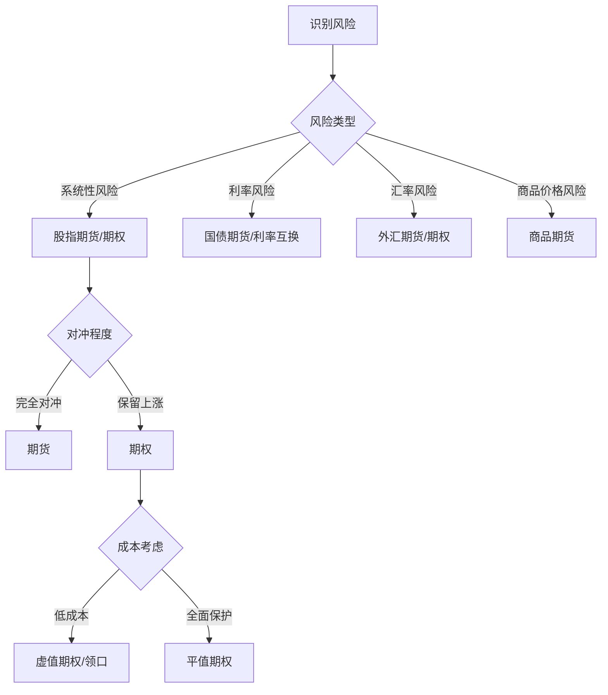

# 组合对冲策略

## 概述

对冲（Hedging）是通过建立反向头寸来降低投资组合风险的策略。与分散化不同，对冲使用衍生品等工具主动管理特定风险。本文系统讲解对冲的原理、工具、策略和实施方法。

**学习目标**：
- 理解对冲的基本原理和类型
- 掌握主要对冲工具的使用方法
- 学会设计和实施对冲策略
- 了解对冲的成本和效果评估
- 掌握动态对冲和尾部风险对冲

**为什么重要**：分散化只能降低非系统性风险，对冲可以管理系统性风险和特定风险因子。在市场下跌或波动加剧时，有效的对冲策略可以保护资本，让投资者在危机中生存并抓住机会。

## 对冲基本原理

### 对冲的定义

**对冲**：建立一个与现有头寸风险特征相反的头寸，使得两个头寸的盈亏相互抵消，从而降低整体风险。

**核心思想**：
```
现有头寸风险 + 对冲头寸风险 = 降低的总风险
```

### 对冲 vs 分散化

| 维度 | 分散化 | 对冲 |
|-----|-------|------|
| 原理 | 持有多个低相关资产 | 建立反向头寸 |
| 工具 | 现货资产 | 衍生品为主 |
| 成本 | 机会成本 | 显性成本（权利金、价差） |
| 效果 | 降低非系统性风险 | 可降低系统性风险 |
| 灵活性 | 较低 | 高（可动态调整） |
| 复杂度 | 简单 | 复杂 |

### 对冲的类型

**完全对冲（Perfect Hedge）**：
- 完全消除风险
- 收益也被锁定
- 实际中很难实现

**部分对冲（Partial Hedge）**：
- 对冲部分风险敞口
- 保留部分上涨潜力
- 最常见的实践方式

**动态对冲（Dynamic Hedge）**：
- 根据市场变化调整对冲比率
- 适应性强但成本较高
- 需要持续监控和调整

**静态对冲（Static Hedge）**：
- 建立后不调整
- 成本较低但可能失效
- 适合明确的短期风险


## 对冲工具

### 期货（Futures）

**定义**：标准化的远期合约，约定在未来某个时间以特定价格买卖标的资产。

**对冲机制**：
- 做多现货 + 做空期货 = 锁定价格
- 期货价格与现货价格高度相关
- 到期时基差收敛

**常用期货合约**：
- 股指期货（S&P 500、纳斯达克100）
- 国债期货（10年期、30年期）
- 商品期货（原油、黄金、农产品）
- 外汇期货（欧元、日元）

**对冲比率计算**：

**最小方差对冲比率**：
$
h^* = \rho \frac{\sigma_S}{\sigma_F}
$

其中：
- $\rho$ 是现货与期货的相关系数
- $\sigma_S$ 是现货波动率
- $\sigma_F$ 是期货波动率

**基于回归的对冲比率**：
$
h^* = \frac{Cov(S, F)}{Var(F)} = \beta
$

**Python实现**：

```python
import numpy as np
import pandas as pd
from scipy import stats

class FuturesHedge:
    def __init__(self, spot_returns, futures_returns):
        """
        spot_returns: 现货收益率
        futures_returns: 期货收益率
        """
        self.spot_returns = spot_returns
        self.futures_returns = futures_returns
    
    def calculate_hedge_ratio(self, method='regression'):
        """
        计算对冲比率
        method: 'regression' 或 'minimum_variance'
        """
        if method == 'regression':
            # 回归法
            slope, intercept, r_value, p_value, std_err = \
                stats.linregress(self.futures_returns, self.spot_returns)
            hedge_ratio = slope
            
        elif method == 'minimum_variance':
            # 最小方差法
            correlation = np.corrcoef(self.spot_returns, self.futures_returns)[0, 1]
            spot_std = np.std(self.spot_returns)
            futures_std = np.std(self.futures_returns)
            hedge_ratio = correlation * (spot_std / futures_std)
        
        return hedge_ratio
    
    def calculate_hedged_portfolio(self, hedge_ratio):
        """
        计算对冲后的组合收益
        """
        # 对冲组合 = 现货 - hedge_ratio × 期货
        hedged_returns = self.spot_returns - hedge_ratio * self.futures_returns
        
        return hedged_returns
    
    def evaluate_hedge_effectiveness(self, hedge_ratio):
        """
        评估对冲效果
        """
        hedged_returns = self.calculate_hedged_portfolio(hedge_ratio)
        
        # 风险降低比例
        unhedged_var = np.var(self.spot_returns)
        hedged_var = np.var(hedged_returns)
        variance_reduction = (unhedged_var - hedged_var) / unhedged_var
        
        # 对冲效率
        hedge_effectiveness = 1 - (hedged_var / unhedged_var)
        
        return {
            'hedge_ratio': hedge_ratio,
            'unhedged_volatility': np.std(self.spot_returns),
            'hedged_volatility': np.std(hedged_returns),
            'variance_reduction': variance_reduction,
            'hedge_effectiveness': hedge_effectiveness
        }

# 示例
np.random.seed(42)
spot_returns = np.random.normal(0.0005, 0.02, 250)
futures_returns = 0.95 * spot_returns + np.random.normal(0, 0.005, 250)

hedge = FuturesHedge(spot_returns, futures_returns)
hedge_ratio = hedge.calculate_hedge_ratio('regression')
effectiveness = hedge.evaluate_hedge_effectiveness(hedge_ratio)

print(f"对冲比率: {hedge_ratio:.4f}")
print(f"未对冲波动率: {effectiveness['unhedged_volatility']:.4%}")
print(f"对冲后波动率: {effectiveness['hedged_volatility']:.4%}")
print(f"对冲效率: {effectiveness['hedge_effectiveness']:.2%}")
```

**期货对冲的优缺点**：

**优点**：
- 流动性好，成本低
- 杠杆效率高
- 标准化，易于交易
- 可以对冲系统性风险

**缺点**：
- 基差风险（期货与现货价格差异）
- 需要保证金管理
- 到期需要展期
- 可能过度对冲或对冲不足

### 期权（Options）

**定义**：赋予持有人在未来某个时间以特定价格买入（看涨）或卖出（看跌）标的资产的权利。

**对冲机制**：
- 买入看跌期权：保险策略
- 卖出看涨期权：备兑策略
- 组合期权策略：精细化风险管理

#### 保护性看跌期权（Protective Put）

**策略**：持有股票 + 买入看跌期权

**效果**：
- 锁定最低价格（行权价）
- 保留上涨潜力
- 成本：期权权利金

**损益图**：
```
收益
  ^
  |     /
  |    /
  |   /
  |  /________  (行权价)
  |
  +-----------> 股价
```

**Python实现**：

```python
class ProtectivePut:
    def __init__(self, stock_price, strike_price, premium, shares=100):
        """
        stock_price: 当前股价
        strike_price: 行权价
        premium: 期权权利金
        shares: 股票数量
        """
        self.stock_price = stock_price
        self.strike_price = strike_price
        self.premium = premium
        self.shares = shares
    
    def calculate_payoff(self, future_prices):
        """
        计算不同价格下的损益
        """
        # 股票损益
        stock_payoff = (future_prices - self.stock_price) * self.shares
        
        # 看跌期权损益
        put_payoff = np.maximum(self.strike_price - future_prices, 0) * self.shares
        
        # 总损益（扣除权利金）
        total_payoff = stock_payoff + put_payoff - self.premium * self.shares
        
        return {
            'future_prices': future_prices,
            'stock_payoff': stock_payoff,
            'put_payoff': put_payoff,
            'total_payoff': total_payoff
        }
    
    def calculate_protection_cost(self):
        """
        计算保护成本（年化）
        """
        cost_percentage = self.premium / self.stock_price
        return cost_percentage
    
    def plot_payoff(self):
        """
        绘制损益图
        """
        import matplotlib.pyplot as plt
        
        # 生成价格范围
        prices = np.linspace(self.stock_price * 0.7, 
                           self.stock_price * 1.3, 100)
        
        payoff = self.calculate_payoff(prices)
        
        plt.figure(figsize=(12, 7))
        plt.plot(prices, payoff['stock_payoff'], 
                label='Stock Only', linestyle='--')
        plt.plot(prices, payoff['total_payoff'], 
                label='Protected Portfolio', linewidth=2)
        plt.axhline(y=0, color='black', linestyle='-', alpha=0.3)
        plt.axvline(x=self.strike_price, color='red', 
                   linestyle='--', alpha=0.5, label=f'Strike: ${self.strike_price}')
        
        plt.xlabel('Stock Price at Expiration')
        plt.ylabel('Profit/Loss')
        plt.title('Protective Put Strategy')
        plt.legend()
        plt.grid(True, alpha=0.3)
        return plt

# 示例
put_hedge = ProtectivePut(
    stock_price=100,
    strike_price=95,  # 5%虚值
    premium=3,
    shares=100
)

cost = put_hedge.calculate_protection_cost()
print(f"保护成本: {cost:.2%}")

prices = np.array([80, 90, 95, 100, 110, 120])
payoff = put_hedge.calculate_payoff(prices)
print("\n不同价格下的损益:")
for price, total in zip(prices, payoff['total_payoff']):
    print(f"  ${price}: ${total:.0f}")
```

#### 领口策略（Collar）

**策略**：持有股票 + 买入看跌期权 + 卖出看涨期权

**效果**：
- 降低保护成本（卖出看涨收取权利金）
- 限制上涨潜力
- 适合温和看涨或中性预期

**零成本领口**：
- 选择行权价使得收取的权利金等于支付的权利金
- 完全免费的保护（但牺牲上涨空间）

```python
class CollarStrategy:
    def __init__(self, stock_price, put_strike, call_strike, 
                 put_premium, call_premium, shares=100):
        self.stock_price = stock_price
        self.put_strike = put_strike
        self.call_strike = call_strike
        self.put_premium = put_premium
        self.call_premium = call_premium
        self.shares = shares
    
    def calculate_payoff(self, future_prices):
        """计算领口策略损益"""
        # 股票损益
        stock_payoff = (future_prices - self.stock_price) * self.shares
        
        # 看跌期权损益（买入）
        put_payoff = np.maximum(self.put_strike - future_prices, 0) * self.shares
        
        # 看涨期权损益（卖出）
        call_payoff = -np.maximum(future_prices - self.call_strike, 0) * self.shares
        
        # 净权利金
        net_premium = (self.call_premium - self.put_premium) * self.shares
        
        # 总损益
        total_payoff = stock_payoff + put_payoff + call_payoff + net_premium
        
        return {
            'future_prices': future_prices,
            'total_payoff': total_payoff,
            'net_premium': net_premium
        }
    
    def is_zero_cost(self):
        """判断是否为零成本领口"""
        return abs(self.call_premium - self.put_premium) < 0.01

# 示例：零成本领口
collar = CollarStrategy(
    stock_price=100,
    put_strike=95,   # 下行保护
    call_strike=108, # 上行限制
    put_premium=3,
    call_premium=3,  # 零成本
    shares=100
)

print(f"零成本领口: {collar.is_zero_cost()}")
```

#### 尾部风险对冲（Tail Risk Hedging）

**策略**：买入深度虚值看跌期权

**目的**：
- 保护极端下跌风险
- 成本低（虚值期权便宜）
- 正常情况下损失权利金
- 危机时获得巨额收益

**实施要点**：
- 选择行权价：通常为当前价格的80-85%
- 期限：3-6个月
- 滚动策略：到期前展期
- 成本控制：年化成本1-3%

```python
class TailRiskHedge:
    def __init__(self, portfolio_value, hedge_ratio=0.1):
        """
        portfolio_value: 组合价值
        hedge_ratio: 对冲比例（用于购买期权的资金比例）
        """
        self.portfolio_value = portfolio_value
        self.hedge_ratio = hedge_ratio
    
    def calculate_put_quantity(self, index_level, put_price, multiplier=100):
        """
        计算需要购买的看跌期权数量
        """
        hedge_amount = self.portfolio_value * self.hedge_ratio
        contracts = hedge_amount / (put_price * multiplier)
        return int(contracts)
    
    def simulate_crisis_protection(self, market_drops, put_strike, 
                                   index_level, put_price, multiplier=100):
        """
        模拟危机中的保护效果
        """
        contracts = self.calculate_put_quantity(index_level, put_price, multiplier)
        
        results = []
        for drop in market_drops:
            # 组合损失
            portfolio_loss = self.portfolio_value * drop
            
            # 期权收益
            new_index = index_level * (1 + drop)
            put_payoff = max(put_strike - new_index, 0) * multiplier * contracts
            
            # 净损失
            net_loss = portfolio_loss - put_payoff
            
            # 保护效果
            protection_rate = put_payoff / abs(portfolio_loss) if portfolio_loss < 0 else 0
            
            results.append({
                'market_drop': drop,
                'portfolio_loss': portfolio_loss,
                'put_payoff': put_payoff,
                'net_loss': net_loss,
                'protection_rate': protection_rate
            })
        
        return pd.DataFrame(results)

# 示例
tail_hedge = TailRiskHedge(portfolio_value=1000000, hedge_ratio=0.02)

# 模拟不同程度的市场下跌
market_drops = np.array([-0.05, -0.10, -0.20, -0.30, -0.40])
protection = tail_hedge.simulate_crisis_protection(
    market_drops=market_drops,
    put_strike=3400,  # 深度虚值
    index_level=4000,
    put_price=10,
    multiplier=100
)

print("\n尾部风险对冲效果:")
print(protection.to_string(index=False))
```

### 波动率对冲

**VIX期货和期权**：
- VIX指数衡量市场恐慌程度
- 与股市负相关
- 危机时VIX飙升

**策略**：
- 买入VIX看涨期权
- 做多VIX期货
- 投资VIX ETF（如VXX、UVXY）

**注意事项**：
- VIX产品有展期成本（contango）
- 长期持有会损失价值
- 仅用于短期对冲

### 跨资产对冲

**黄金对冲**：
- 传统避险资产
- 与股市低相关或负相关
- 通胀对冲

**国债对冲**：
- 风险资产下跌时，国债上涨
- 流动性好
- 收益率低

**货币对冲**：
- 美元：避险货币
- 日元、瑞士法郎：避险货币
- 对冲汇率风险

## 对冲策略设计

### 确定对冲目标

**风险识别**：
1. 系统性风险（市场整体下跌）
2. 特定因子风险（利率、汇率）
3. 个股风险
4. 流动性风险

**对冲目标设定**：
- 完全对冲 vs 部分对冲
- 对冲期限（短期 vs 长期）
- 成本预算
- 可接受的残余风险

### 选择对冲工具

**决策框架**：



### 计算对冲规模

**基于Beta的对冲**：

对冲股票组合的系统性风险：
$
Futures\ Contracts = \frac{Portfolio\ Value \times \beta}{Futures\ Price \times Multiplier}
$

**基于久期的对冲**：

对冲债券组合的利率风险：
$
Futures\ Contracts = \frac{Portfolio\ Duration \times Portfolio\ Value}{Futures\ Duration \times Futures\ Price \times Multiplier}
$

**Python实现**：

```python
class HedgeCalculator:
    def __init__(self, portfolio_value):
        self.portfolio_value = portfolio_value
    
    def calculate_equity_hedge(self, portfolio_beta, 
                              futures_price, multiplier=250):
        """
        计算股指期货对冲数量
        """
        contracts = (self.portfolio_value * portfolio_beta) / \
                   (futures_price * multiplier)
        return int(contracts)
    
    def calculate_bond_hedge(self, portfolio_duration, 
                            futures_duration, futures_price, 
                            multiplier=1000):
        """
        计算国债期货对冲数量
        """
        contracts = (portfolio_duration * self.portfolio_value) / \
                   (futures_duration * futures_price * multiplier)
        return int(contracts)
    
    def calculate_currency_hedge(self, foreign_exposure, 
                                spot_rate, contract_size=125000):
        """
        计算外汇期货对冲数量
        """
        contracts = foreign_exposure / contract_size
        return int(contracts)

# 示例
calc = HedgeCalculator(portfolio_value=10000000)

# 股票对冲
equity_contracts = calc.calculate_equity_hedge(
    portfolio_beta=1.2,
    futures_price=4000,
    multiplier=250
)
print(f"需要做空股指期货: {equity_contracts} 张")

# 债券对冲
bond_contracts = calc.calculate_bond_hedge(
    portfolio_duration=7.5,
    futures_duration=6.8,
    futures_price=120,
    multiplier=1000
)
print(f"需要做空国债期货: {bond_contracts} 张")
```

### 动态对冲

**Delta对冲**：
- 持续调整对冲比率以保持Delta中性
- 适用于期权做市商
- 成本高但效果好

**再平衡策略**：
- 定期调整（如每周、每月）
- 基于阈值调整（Delta变化超过10%）
- 平衡成本和效果

```python
class DynamicHedge:
    def __init__(self, initial_position, hedge_threshold=0.1):
        """
        initial_position: 初始头寸
        hedge_threshold: 再平衡阈值
        """
        self.position = initial_position
        self.hedge_position = 0
        self.hedge_threshold = hedge_threshold
        self.rebalance_history = []
    
    def calculate_required_hedge(self, current_delta):
        """
        计算所需对冲头寸
        """
        return -self.position * current_delta
    
    def should_rebalance(self, current_delta):
        """
        判断是否需要再平衡
        """
        required_hedge = self.calculate_required_hedge(current_delta)
        deviation = abs(required_hedge - self.hedge_position) / abs(self.position)
        return deviation > self.hedge_threshold
    
    def rebalance(self, current_delta, price):
        """
        执行再平衡
        """
        if self.should_rebalance(current_delta):
            new_hedge = self.calculate_required_hedge(current_delta)
            trade_size = new_hedge - self.hedge_position
            
            self.rebalance_history.append({
                'delta': current_delta,
                'old_hedge': self.hedge_position,
                'new_hedge': new_hedge,
                'trade_size': trade_size,
                'price': price
            })
            
            self.hedge_position = new_hedge
            return True
        return False

# 示例
hedge = DynamicHedge(initial_position=10000, hedge_threshold=0.1)

# 模拟Delta变化
deltas = [0.5, 0.55, 0.6, 0.65, 0.7, 0.65, 0.6]
prices = [100, 102, 105, 108, 110, 107, 105]

for delta, price in zip(deltas, prices):
    rebalanced = hedge.rebalance(delta, price)
    if rebalanced:
        print(f"再平衡: Delta={delta:.2f}, 新对冲头寸={hedge.hedge_position:.0f}")
```

## 对冲成本与效果评估

### 对冲成本

**显性成本**：
- 期权权利金
- 期货价差（bid-ask spread）
- 交易佣金
- 保证金利息

**隐性成本**：
- 机会成本（放弃的上涨收益）
- 再平衡成本
- 基差风险
- 展期成本（roll cost）

**成本计算示例**：

```python
class HedgeCostAnalysis:
    def __init__(self, portfolio_value):
        self.portfolio_value = portfolio_value
    
    def calculate_put_protection_cost(self, put_premium, 
                                     strike, spot, days_to_expiry):
        """
        计算看跌期权保护成本
        """
        # 绝对成本
        absolute_cost = put_premium * self.portfolio_value / spot
        
        # 年化成本
        annualized_cost = (put_premium / spot) * (365 / days_to_expiry)
        
        # 保护程度
        protection_level = (spot - strike) / spot
        
        return {
            'absolute_cost': absolute_cost,
            'cost_percentage': put_premium / spot,
            'annualized_cost': annualized_cost,
            'protection_level': protection_level
        }
    
    def calculate_collar_cost(self, put_premium, call_premium, 
                             put_strike, call_strike, spot):
        """
        计算领口策略成本
        """
        net_premium = put_premium - call_premium
        net_cost = net_premium * self.portfolio_value / spot
        
        # 保护范围
        downside_protection = (spot - put_strike) / spot
        upside_cap = (call_strike - spot) / spot
        
        return {
            'net_cost': net_cost,
            'net_premium_pct': net_premium / spot,
            'downside_protection': downside_protection,
            'upside_cap': upside_cap
        }

# 示例
cost_analysis = HedgeCostAnalysis(portfolio_value=1000000)

# 看跌期权成本
put_cost = cost_analysis.calculate_put_protection_cost(
    put_premium=5,
    strike=95,
    spot=100,
    days_to_expiry=90
)
print(f"看跌期权年化成本: {put_cost['annualized_cost']:.2%}")

# 领口策略成本
collar_cost = cost_analysis.calculate_collar_cost(
    put_premium=5,
    call_premium=4,
    put_strike=95,
    call_strike=110,
    spot=100
)
print(f"领口策略净成本: {collar_cost['net_premium_pct']:.2%}")
```

### 对冲效果评估

**评估指标**：

1. **风险降低**：
   $
   Risk\ Reduction = \frac{Var(Unhedged) - Var(Hedged)}{Var(Unhedged)}
   $

2. **对冲效率**：
   $
   Hedge\ Effectiveness = 1 - \frac{Var(Hedged)}{Var(Unhedged)}
   $

3. **夏普比率改善**：
   $
   Sharpe\ Improvement = Sharpe(Hedged) - Sharpe(Unhedged)
   $

4. **最大回撤改善**：
   $
   Drawdown\ Improvement = MDD(Unhedged) - MDD(Hedged)
   $

```python
class HedgePerformance:
    def __init__(self, unhedged_returns, hedged_returns):
        self.unhedged_returns = unhedged_returns
        self.hedged_returns = hedged_returns
    
    def calculate_metrics(self, risk_free_rate=0.02/252):
        """
        计算对冲效果指标
        """
        # 波动率
        unhedged_vol = np.std(self.unhedged_returns) * np.sqrt(252)
        hedged_vol = np.std(self.hedged_returns) * np.sqrt(252)
        
        # 夏普比率
        unhedged_sharpe = (np.mean(self.unhedged_returns) - risk_free_rate) / \
                         np.std(self.unhedged_returns) * np.sqrt(252)
        hedged_sharpe = (np.mean(self.hedged_returns) - risk_free_rate) / \
                       np.std(self.hedged_returns) * np.sqrt(252)
        
        # 最大回撤
        unhedged_mdd = self._calculate_max_drawdown(self.unhedged_returns)
        hedged_mdd = self._calculate_max_drawdown(self.hedged_returns)
        
        # 对冲效率
        hedge_effectiveness = 1 - (np.var(self.hedged_returns) / 
                                  np.var(self.unhedged_returns))
        
        return {
            'unhedged_volatility': unhedged_vol,
            'hedged_volatility': hedged_vol,
            'volatility_reduction': (unhedged_vol - hedged_vol) / unhedged_vol,
            'unhedged_sharpe': unhedged_sharpe,
            'hedged_sharpe': hedged_sharpe,
            'sharpe_improvement': hedged_sharpe - unhedged_sharpe,
            'unhedged_max_drawdown': unhedged_mdd,
            'hedged_max_drawdown': hedged_mdd,
            'drawdown_improvement': unhedged_mdd - hedged_mdd,
            'hedge_effectiveness': hedge_effectiveness
        }
    
    def _calculate_max_drawdown(self, returns):
        """计算最大回撤"""
        cumulative = (1 + returns).cumprod()
        running_max = np.maximum.accumulate(cumulative)
        drawdown = (cumulative - running_max) / running_max
        return drawdown.min()

# 示例
np.random.seed(42)
unhedged = np.random.normal(0.0005, 0.02, 250)
hedged = np.random.normal(0.0004, 0.012, 250)  # 降低波动率

perf = HedgePerformance(unhedged, hedged)
metrics = perf.calculate_metrics()

print("\n对冲效果评估:")
print(f"波动率降低: {metrics['volatility_reduction']:.1%}")
print(f"夏普比率改善: {metrics['sharpe_improvement']:.2f}")
print(f"最大回撤改善: {metrics['drawdown_improvement']:.1%}")
print(f"对冲效率: {metrics['hedge_effectiveness']:.1%}")
```


## 实战案例

### 案例1：2020年疫情崩盘中的尾部对冲

**背景**：
- 2020年2月-3月，疫情引发市场恐慌
- 标普500在一个月内下跌34%
- VIX指数飙升至82

**对冲策略**：
- 持有深度虚值看跌期权（行权价为当时市场的85%）
- 成本：组合价值的2%
- 期限：3个月滚动

**结果**：
- 组合未对冲损失：-30%
- 期权收益：+25%
- 净损失：-7%
- 保护效果：77%

**教训**：
- 尾部对冲在极端情况下非常有效
- 平时的成本是必要的"保险费"
- 需要持续滚动，不能因为"浪费"而停止

### 案例2：长期资本管理公司（LTCM）的对冲失败

**背景**：
- 1998年，LTCM是全球最大的对冲基金
- 使用复杂的数学模型进行套利和对冲
- 高杠杆（25-30倍）

**对冲策略**：
- 多种套利策略，理论上完全对冲
- 依赖历史相关性和波动率

**失败原因**：
1. **相关性崩溃**：俄罗斯违约后，历史相关性完全失效
2. **流动性枯竭**：无法按预期价格平仓
3. **杠杆放大**：小的对冲误差被杠杆放大
4. **模型风险**：过度依赖历史数据

**教训**：
- 对冲不是万能的，极端情况下可能失效
- 杠杆会放大对冲误差
- 流动性是对冲的前提
- 不要过度自信于模型

### 案例3：桥水基金的全天候策略

**策略概述**：
- 分散投资于不同资产类别
- 使用杠杆平衡各资产的风险贡献
- 通过对冲降低整体波动率

**对冲方法**：
- 股票：使用股指期货调整敞口
- 债券：使用利率期货管理久期
- 商品：使用商品期货对冲通胀风险
- 货币：对冲汇率风险

**效果**：
- 年化收益：7-10%
- 年化波动率：10-12%
- 夏普比率：0.6-0.8
- 在多次危机中表现稳健

**启示**：
- 系统化的对冲策略可以长期有效
- 分散化和对冲相结合
- 动态调整对冲比率
- 关注风险平价而非资金平价

## 常见误区

### 误区1：对冲会降低收益

**真相**：对冲降低的是风险，长期来看风险调整后收益可能更高。

**正确理解**：
- 对冲降低波动率，提高夏普比率
- 在危机中保护资本，保留再投资能力
- 避免被迫在低点卖出

### 误区2：完全对冲是最好的

**真相**：完全对冲会锁定收益，失去上涨机会。

**正确做法**：
- 根据市场环境调整对冲程度
- 牛市：降低对冲，保留上涨空间
- 熊市：增加对冲，保护资本
- 部分对冲通常是最优选择

### 误区3：对冲一次就够了

**真相**：对冲需要持续管理和调整。

**正确做法**：
- 定期评估对冲效果
- 根据市场变化调整策略
- 期权到期需要展期
- 动态对冲需要再平衡

### 误区4：对冲成本太高不值得

**真相**：对冲成本是风险管理的必要投入。

**正确理解**：
- 保险都有成本，关键是性价比
- 尾部对冲成本低但关键时刻有效
- 可以通过领口策略降低成本
- 危机中的损失远超对冲成本

### 误区5：历史对冲比率永远有效

**真相**：市场环境变化，对冲比率需要调整。

**正确做法**：
- 定期重新计算对冲比率
- 使用滚动窗口而非全部历史数据
- 考虑市场结构变化
- 压力测试对冲策略

## 实战建议

### 1. 建立对冲框架

**系统化方法**：
```
1. 风险识别 → 确定需要对冲的风险
2. 工具选择 → 选择合适的对冲工具
3. 规模计算 → 确定对冲数量
4. 成本评估 → 评估对冲成本是否可接受
5. 实施执行 → 建立对冲头寸
6. 监控调整 → 持续监控和再平衡
7. 效果评估 → 定期评估对冲效果
```

### 2. 分层对冲策略

**三层防护**：
- **第一层**：分散化（降低非系统性风险）
- **第二层**：部分对冲（降低系统性风险）
- **第三层**：尾部保护（应对极端风险）

### 3. 成本控制

**降低对冲成本的方法**：
- 使用领口策略（卖出看涨降低成本）
- 选择虚值期权（成本低但保护有限）
- 仅对冲核心风险（不是所有风险都需要对冲）
- 动态调整对冲程度（根据市场环境）

### 4. 时机选择

**何时增加对冲**：
- 估值过高
- 波动率处于低位（期权便宜）
- 经济周期后期
- 地缘政治风险上升

**何时减少对冲**：
- 市场已经大幅下跌
- 波动率极高（期权昂贵）
- 经济复苏初期
- 风险偏好回升

### 5. 记录和学习

**建立对冲日志**：
- 记录每次对冲决策的理由
- 跟踪对冲成本和效果
- 分析成功和失败的案例
- 持续改进对冲策略

## 高级主题

### Gamma对冲

**定义**：对冲期权的Gamma风险（Delta的变化率）。

**应用**：
- 期权做市商必须进行Gamma对冲
- 大幅市场波动时Gamma风险显著
- 需要频繁调整

### Vega对冲

**定义**：对冲波动率风险。

**方法**：
- 使用不同期限的期权
- 构建波动率中性组合
- 对冲隐含波动率变化

### 跨期对冲

**定义**：使用不同到期日的工具进行对冲。

**应用**：
- 管理期限结构风险
- 降低展期成本
- 平滑对冲效果

### 基差对冲

**定义**：对冲现货与期货之间的基差风险。

**方法**：
- 监控基差变化
- 选择最优交割月份
- 考虑持有成本

## 监管与合规

### 监管要求

**机构投资者**：
- 必须有书面的对冲政策
- 对冲工具需要董事会批准
- 定期报告对冲效果
- 符合投资限制

**对冲基金**：
- 披露对冲策略
- 杠杆限制
- 风险管理要求

### 会计处理

**对冲会计**：
- 公允价值对冲
- 现金流对冲
- 境外经营净投资对冲

**要求**：
- 对冲关系文档化
- 对冲有效性测试
- 定期评估

## 延伸阅读

### 经典著作

1. **Hull, J. C. (2017)**. *Options, Futures, and Other Derivatives* (10th ed.). Pearson.
   - 衍生品和对冲的权威教材

2. **Taleb, N. N. (2007)**. *The Black Swan*. Random House.
   - 尾部风险和极端事件

3. **Lowenstein, R. (2000)**. *When Genius Failed: The Rise and Fall of Long-Term Capital Management*. Random House.
   - LTCM对冲失败的深度分析

4. **Dalio, R. (2017)**. *Principles*. Simon & Schuster.
   - 包含全天候策略的理念

### 实践指南

5. **Natenberg, S. (1994)**. *Option Volatility and Pricing*. McGraw-Hill.
   - 期权对冲实践指南

6. **Sinclair, E. (2010)**. *Option Trading: Pricing and Volatility Strategies and Techniques*. Wiley.
   - 高级期权对冲策略

7. **Bhansali, V. (2008)**. *Tail Risk Hedging*. McGraw-Hill.
   - 尾部风险对冲专著

### 学术论文

8. **Black, F., & Scholes, M. (1973)**. "The Pricing of Options and Corporate Liabilities". *Journal of Political Economy*, 81(3), 637-654.
   - 期权定价理论基础

9. **Merton, R. C. (1973)**. "Theory of Rational Option Pricing". *Bell Journal of Economics and Management Science*, 4(1), 141-183.
   - 期权理论扩展

10. **Bhansali, V., & Davis, J. (2010)**. "Tail Risk Management". *Journal of Portfolio Management*, 36(4), 68-75.
    - 尾部风险管理研究

## 总结

对冲是风险管理的重要工具，但需要正确理解和使用：

**关键要点**：
1. 对冲不是消除风险，而是管理风险
2. 选择合适的对冲工具和策略至关重要
3. 对冲有成本，需要权衡成本和收益
4. 动态对冲比静态对冲更有效但成本更高
5. 尾部风险对冲在危机中价值巨大
6. 对冲需要持续监控和调整
7. 不要过度依赖对冲，分散化同样重要

**实践框架**：
- 日常：部分对冲系统性风险（期货、期权）
- 长期：尾部风险保护（深度虚值期权）
- 特定：针对性对冲（利率、汇率、商品）
- 动态：根据市场环境调整对冲程度
- 评估：定期评估对冲成本和效果

对冲是一门艺术，也是一门科学。成功的对冲需要理论知识、实践经验和持续学习的结合。记住：对冲的目的不是最大化收益，而是在可接受的成本下管理风险，让投资组合在各种市场环境下都能生存和发展。

---

**下一步学习**：
- [仓位管理](position-sizing.html) - 学习如何确定合理的仓位大小
- [行为金融学](behavioral-finance.html) - 理解心理因素对风险管理的影响
- [压力测试](stress-testing.html) - 评估极端情景下的风险

**相关主题**：
- [VaR和CVaR](var-cvar.html)
- [风险测量](risk-measurement.html)
- [风险类型](risk-types.html)
