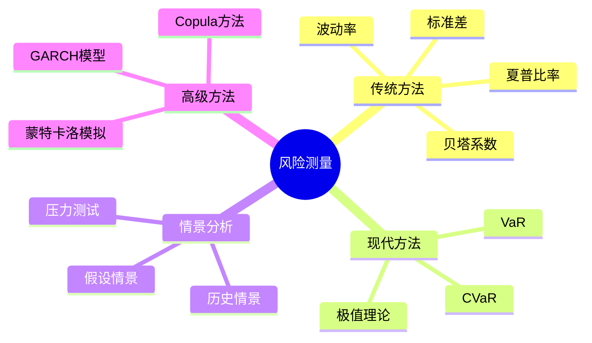
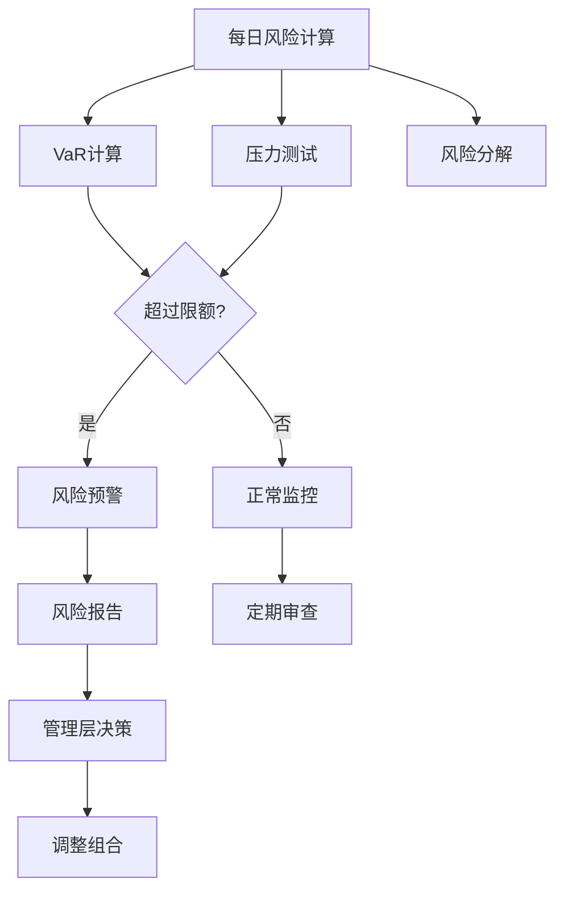

# 风险测量方法

## 概述

风险测量是风险管理的核心环节。只有准确量化风险，才能有效管理风险。本文系统介绍风险测量的主要方法，从基础的波动率到高级的VaR和压力测试，帮助投资者建立完整的风险测量框架。

**学习目标**：
- 掌握主要风险测量指标及其计算方法
- 理解不同风险度量方法的优缺点
- 学会选择适合的风险测量工具
- 了解风险测量在实践中的应用
- 掌握风险报告和监控方法

**为什么重要**：准确的风险测量是风险管理的基础。没有量化就没有管理，只有准确测量风险，才能制定合理的风险限额、评估风险调整后的收益、进行有效的风险对冲。

## 风险测量框架



## 传统风险度量方法

### 波动率（Volatility）

**定义**：资产收益率的标准差，衡量收益的不确定性。

**计算方法**：

**历史波动率**：
$$
\sigma = \sqrt{\frac{1}{n-1} \sum_{i=1}^{n} (r_i - \bar{r})^2}
$$

其中：
- $r_i$ 是第 $i$ 期的收益率
- $\bar{r}$ 是平均收益率
- $n$ 是观察期数

**年化波动率**：
$$
\sigma_{annual} = \sigma_{daily} \times \sqrt{252}
$$

**隐含波动率**：
- 从期权价格反推的波动率
- 反映市场对未来波动的预期
- VIX指数是标普500的隐含波动率

**优点**：
- 计算简单
- 易于理解
- 广泛应用

**缺点**：
- 假设收益率正态分布
- 对极端值敏感
- 不区分上行和下行风险

**实际应用**：
- 资产配置：高波动资产配置较低权重
- 期权定价：Black-Scholes模型的关键输入
- 风险预算：根据波动率分配风险

### 贝塔系数（Beta）

**定义**：资产收益率对市场收益率变化的敏感度。

**计算公式**：
$$
\beta_i = \frac{Cov(R_i, R_m)}{Var(R_m)} = \rho_{i,m} \frac{\sigma_i}{\sigma_m}
$$

其中：
- $R_i$ 是资产收益率
- $R_m$ 是市场收益率
- $\rho_{i,m}$ 是相关系数

**解释**：
- β = 1：与市场同步
- β > 1：比市场波动大（进攻型）
- β < 1：比市场波动小（防守型）
- β = 0：与市场无关
- β < 0：与市场反向（对冲型）

**行业贝塔示例**：
- 科技股：β ≈ 1.2-1.5
- 金融股：β ≈ 1.1-1.3
- 公用事业：β ≈ 0.5-0.7
- 消费必需品：β ≈ 0.6-0.8

**应用**：
- 组合风险分解：系统性风险 vs 特定风险
- 业绩归因：区分市场收益和超额收益
- 对冲策略：构建市场中性组合

### 下行风险度量

**半方差（Semi-Variance）**：
只考虑低于目标收益的偏差。

$$
Semi-Variance = \frac{1}{n} \sum_{r_i < target} (r_i - target)^2
$$

**下行标准差（Downside Deviation）**：
$$
DD = \sqrt{Semi-Variance}
$$

**最大回撤（Maximum Drawdown）**：
从峰值到谷底的最大跌幅。

$$
MDD = \max_{t \in [0,T]} \left( \frac{Peak_t - Trough_t}{Peak_t} \right)
$$

**案例**：
- 2008年金融危机：标普500最大回撤 -56.8%
- 2020年疫情：标普500最大回撤 -33.9%（快速恢复）
- 纳斯达克2000-2002：最大回撤 -78%

**Sortino比率**：
使用下行标准差代替总标准差。

$$
Sortino = \frac{R_p - R_f}{DD}
$$

优点：更符合投资者风险偏好（只关心下行风险）

## Value at Risk (VaR)

### 定义与概念

**VaR定义**：在正常市场条件下，给定置信水平和时间范围内，投资组合可能遭受的最大损失。

**三要素**：
1. 置信水平（如95%、99%）
2. 时间范围（如1天、10天）
3. 损失金额

**示例**：
"95%置信水平下，1天VaR为100万美元"
- 意味着：95%的情况下，1天损失不超过100万
- 或者：5%的情况下，1天损失可能超过100万

### VaR计算方法

**1. 历史模拟法（Historical Simulation）**

**步骤**：
1. 收集历史收益率数据（如过去250天）
2. 计算每天的组合价值变化
3. 排序，找到第5百分位数（95%置信水平）

**优点**：
- 不假设分布
- 简单直观
- 捕捉实际市场行为

**缺点**：
- 依赖历史数据
- 无法预测新的风险
- 需要大量数据

**Python实现**：
```python
import numpy as np
import pandas as pd

def historical_var(returns, confidence_level=0.95):
    """
    计算历史VaR
    
    Parameters:
    returns: 历史收益率序列
    confidence_level: 置信水平
    
    Returns:
    VaR值（正数表示损失）
    """
    # 排序
    sorted_returns = np.sort(returns)
    
    # 找到百分位数
    index = int((1 - confidence_level) * len(sorted_returns))
    var = -sorted_returns[index]
    
    return var

# 示例
returns = np.random.normal(0.001, 0.02, 1000)  # 模拟收益率
var_95 = historical_var(returns, 0.95)
print(f"95% VaR: {var_95:.2%}")
```

**2. 方差-协方差法（Variance-Covariance Method）**

**假设**：收益率服从正态分布

**公式**：
$$
VaR = -(\mu - z_\alpha \sigma) \times V
$$

其中：
- $\mu$ 是预期收益率
- $z_\alpha$ 是置信水平对应的标准正态分位数
- $\sigma$ 是波动率
- $V$ 是投资组合价值

**标准正态分位数**：
- 90%置信水平：$z = 1.28$
- 95%置信水平：$z = 1.65$
- 99%置信水平：$z = 2.33$

**示例计算**：
- 组合价值：1000万
- 日均收益率：0.05%
- 日波动率：1.5%
- 95%置信水平

$$
VaR = -(0.05\% - 1.65 \times 1.5\%) \times 1000万 = 24.25万
$$

**优点**：
- 计算快速
- 易于实现
- 适合线性组合

**缺点**：
- 假设正态分布（实际有肥尾）
- 不适合非线性工具（期权）
- 低估极端风险

**3. 蒙特卡洛模拟法（Monte Carlo Simulation）**

**步骤**：
1. 假设收益率分布（可以是非正态）
2. 随机生成大量情景（如10000次）
3. 计算每个情景下的组合价值
4. 排序，找到百分位数

**优点**：
- 灵活性高
- 可以处理复杂工具
- 可以模拟路径依赖

**缺点**：
- 计算量大
- 需要假设分布
- 模型风险

**Python实现**：
```python
def monte_carlo_var(mu, sigma, value, n_simulations=10000, 
                    confidence_level=0.95, time_horizon=1):
    """
    蒙特卡洛VaR计算
    
    Parameters:
    mu: 预期收益率（年化）
    sigma: 波动率（年化）
    value: 组合价值
    n_simulations: 模拟次数
    confidence_level: 置信水平
    time_horizon: 时间范围（天）
    
    Returns:
    VaR值
    """
    # 调整为日度参数
    mu_daily = mu / 252
    sigma_daily = sigma / np.sqrt(252)
    
    # 生成随机收益率
    random_returns = np.random.normal(
        mu_daily * time_horizon,
        sigma_daily * np.sqrt(time_horizon),
        n_simulations
    )
    
    # 计算组合价值变化
    portfolio_values = value * (1 + random_returns)
    losses = value - portfolio_values
    
    # 计算VaR
    var = np.percentile(losses, confidence_level * 100)
    
    return var

# 示例
var_mc = monte_carlo_var(
    mu=0.08,  # 8%年化收益
    sigma=0.20,  # 20%年化波动率
    value=1000000,  # 100万组合
    n_simulations=10000,
    confidence_level=0.95
)
print(f"95% VaR (Monte Carlo): ${var_mc:,.0f}")
```

### VaR的局限性

**1. 不是一致性风险度量**
- 不满足次可加性：组合VaR可能大于各部分VaR之和
- 鼓励过度集中

**2. 忽略尾部风险**
- 只关注分位数，不关心超出部分
- 不区分小幅超出和巨额损失

**3. 模型风险**
- 依赖假设（分布、相关性）
- 历史数据可能不代表未来

**4. 顺周期性**
- 平静期VaR低，鼓励冒险
- 危机期VaR高，强制减仓

**案例**：2008年金融危机
- 许多机构的VaR模型严重低估风险
- 实际损失远超VaR预测
- 相关性在危机中急剧上升

## Conditional VaR (CVaR)

### 定义与优势

**CVaR定义**：也称为Expected Shortfall（ES），是超过VaR的条件期望损失。

$$
CVaR_\alpha = E[Loss | Loss > VaR_\alpha]
$$

**优势**：
1. 一致性风险度量：满足次可加性
2. 考虑尾部风险：关注极端损失
3. 更保守：总是大于等于VaR

**示例**：
- 95% VaR = 100万
- 95% CVaR = 150万
- 意味着：在最坏的5%情况下，平均损失150万

### CVaR计算

**历史模拟法**：
```python
def historical_cvar(returns, confidence_level=0.95):
    """
    计算历史CVaR
    """
    # 计算VaR
    var = historical_var(returns, confidence_level)
    
    # 找到超过VaR的损失
    losses = -returns
    tail_losses = losses[losses > var]
    
    # 计算平均值
    cvar = np.mean(tail_losses)
    
    return cvar
```

**方差-协方差法**（正态分布假设）：
$$
CVaR = \mu + \sigma \frac{\phi(z_\alpha)}{1-\alpha}
$$

其中 $\phi$ 是标准正态密度函数。

## 压力测试与情景分析

### 历史情景

**重现历史危机**：
- 1987年黑色星期一
- 1998年俄罗斯违约/LTCM
- 2008年雷曼破产
- 2020年疫情崩盘

**方法**：
1. 提取历史危机期间的市场变动
2. 应用到当前组合
3. 评估潜在损失

**案例**：2008年情景
- 股票：-40%
- 高收益债：-30%
- 投资级债：-10%
- 黄金：+5%
- 美元：+10%

### 假设情景

**宏观情景**：
- 经济衰退
- 通胀飙升
- 利率急升
- 地缘冲突

**市场情景**：
- 股市崩盘
- 信用危机
- 流动性枯竭
- 波动率飙升

**情景设计原则**：
1. 严重但合理
2. 多维度冲击
3. 考虑相关性变化
4. 包含二阶效应

### 反向压力测试

**定义**：从结果倒推原因，找出导致重大损失的情景。

**步骤**：
1. 设定不可接受的损失水平
2. 寻找导致此损失的市场情景
3. 评估情景发生的可能性
4. 制定应对措施

**优势**：
- 发现隐藏风险
- 挑战假设
- 改进风险管理

## 高级风险测量方法

### GARCH模型

**定义**：广义自回归条件异方差模型，捕捉波动率聚集现象。

**GARCH(1,1)模型**：
$$
\sigma_t^2 = \omega + \alpha \epsilon_{t-1}^2 + \beta \sigma_{t-1}^2
$$

**特点**：
- 波动率时变
- 捕捉波动率聚集
- 更准确的短期预测

**应用**：
- 动态VaR计算
- 期权定价
- 风险预算

### 极值理论（EVT）

**定义**：专门研究极端事件的统计理论。

**广义帕累托分布（GPD）**：
用于拟合超过阈值的损失分布。

**优势**：
- 专注尾部风险
- 不依赖整体分布假设
- 更准确估计极端损失

**应用**：
- 估计极端VaR（99.9%）
- 保险定价
- 资本充足率计算

### Copula方法

**定义**：描述多个变量联合分布的工具。

**优势**：
- 分离边缘分布和相关结构
- 捕捉尾部相关性
- 灵活建模复杂依赖关系

**应用**：
- 多资产组合VaR
- 信用组合风险
- 结构化产品定价

## 风险分解与归因

### 边际VaR

**定义**：增加一单位资产对组合VaR的影响。

$$
Marginal\ VaR_i = \frac{\partial VaR_p}{\partial w_i}
$$

**应用**：
- 识别风险贡献最大的资产
- 优化组合风险
- 风险预算分配

### 成分VaR

**定义**：每个资产对组合VaR的贡献。

$$
Component\ VaR_i = w_i \times Marginal\ VaR_i
$$

**性质**：
$$
\sum_{i=1}^{n} Component\ VaR_i = VaR_p
$$

**应用**：
- 风险归因
- 业绩评估
- 风险限额设定

### 增量VaR

**定义**：增加或减少某资产后，组合VaR的变化。

$$
Incremental\ VaR_i = VaR_p - VaR_{p(-i)}
$$

**应用**：
- 评估交易影响
- 风险对冲决策
- 组合再平衡

## 风险调整绩效指标

### 夏普比率（Sharpe Ratio）

$$
Sharpe = \frac{R_p - R_f}{\sigma_p}
$$

**优点**：简单、广泛使用
**缺点**：假设正态分布、不区分上下行风险

### 信息比率（Information Ratio）

$$
IR = \frac{\alpha}{\sigma_\alpha}
$$

其中 $\alpha$ 是超额收益，$\sigma_\alpha$ 是跟踪误差。

**应用**：评估主动管理能力

### Calmar比率

$$
Calmar = \frac{Annual\ Return}{Maximum\ Drawdown}
$$

**优点**：关注最大回撤
**应用**：对冲基金评估

### 风险调整收益率（RAROC）

$$
RAROC = \frac{Expected\ Return - Expected\ Loss}{Economic\ Capital}
$$

**应用**：
- 银行资本配置
- 业务线评估
- 定价决策

## 实践应用

### 风险限额设定

**VaR限额**：
- 交易台：日VaR不超过100万
- 组合：月VaR不超过5%资产净值
- 压力VaR：不超过10%资产净值

**止损限额**：
- 单日损失：不超过2%
- 月度损失：不超过8%
- 最大回撤：不超过20%

### 风险监控流程



### 风险报告

**日度报告**：
- VaR和CVaR
- 压力测试结果
- 限额使用情况
- 异常波动说明

**月度报告**：
- 风险趋势分析
- 风险归因
- 回测结果
- 模型验证

**季度报告**：
- 风险管理评估
- 模型更新
- 政策建议
- 行业对比

## 常见误区

### 误区1：VaR是最大损失

**真相**：VaR是在一定置信水平下的损失，实际损失可能超过VaR。需要关注CVaR和压力测试。

### 误区2：历史数据完全可靠

**真相**：历史不会简单重复。需要结合前瞻性分析和情景规划。

### 误区3：模型越复杂越好

**真相**：复杂模型可能过拟合，且难以解释。简单稳健的模型往往更实用。

### 误区4：风险测量可以完全自动化

**真相**：需要人工判断和专业经验。模型只是工具，不能替代思考。

### 误区5：只关注统计风险

**真相**：还需要关注模型风险、流动性风险、操作风险等难以量化的风险。

## 实战建议

### 1. 多种方法结合

**不要依赖单一方法**：
- VaR + CVaR：全面评估
- 历史 + 情景：结合实际和假设
- 统计 + 压力：常态和极端

### 2. 定期回测

**验证模型准确性**：
- 统计VaR违背次数
- 评估预测误差
- 及时调整模型

### 3. 关注假设

**明确模型假设**：
- 分布假设
- 相关性假设
- 参数稳定性

### 4. 情景更新

**定期更新压力情景**：
- 反映当前市场环境
- 纳入新的风险因素
- 学习历史教训

## 延伸阅读

### 经典著作

1. **Jorion, P. (2006)**. *Value at Risk: The New Benchmark for Managing Financial Risk*. McGraw-Hill.
   - VaR权威教材

2. **McNeil, A. J., Frey, R., & Embrechts, P. (2015)**. *Quantitative Risk Management*. Princeton University Press.
   - 量化风险管理全面指南

3. **Dowd, K. (2005)**. *Measuring Market Risk*. Wiley.
   - 市场风险测量实践

4. **Alexander, C. (2008)**. *Market Risk Analysis* (4 volumes). Wiley.
   - 市场风险分析百科全书

### 技术文献

5. **Artzner, P., et al. (1999)**. "Coherent Measures of Risk". *Mathematical Finance*, 9(3), 203-228.
   - 一致性风险度量理论

6. **Rockafellar, R. T., & Uryasev, S. (2000)**. "Optimization of Conditional Value-at-Risk". *Journal of Risk*, 2, 21-42.
   - CVaR优化方法

7. **Engle, R. F. (1982)**. "Autoregressive Conditional Heteroscedasticity with Estimates of the Variance of United Kingdom Inflation". *Econometrica*, 50(4), 987-1007.
   - ARCH模型原始论文


8. Jorion, P. (2006). *Value at Risk: The New Benchmark for Managing Financial Risk* (3rd ed.). McGraw-Hill.
9. Taleb, N. N. (2007). *The Black Swan: The Impact of the Highly Improbable*. Random House.
10. Kahneman, D. (2011). *Thinking, Fast and Slow*. Farrar, Straus and Giroux.
## 总结

风险测量是风险管理的基础，需要：

**关键要点**：
1. 没有完美的风险度量方法，需要多种方法结合
2. VaR简单但有局限，CVaR更全面
3. 压力测试和情景分析不可或缺
4. 定期回测和模型验证至关重要
5. 风险测量需要结合专业判断
6. 关注模型假设和局限性

风险测量不是目的，而是手段。准确的风险测量帮助我们更好地理解风险、管理风险、在风险和收益之间做出明智的权衡。

---

**下一步学习**：
- [VaR和CVaR](var-cvar.html) - 深入学习VaR和CVaR的计算和应用
- 压力测试 - 掌握压力测试的方法和实践
- 组合对冲 - 学习如何对冲风险

**相关主题**：
- [风险类型](risk-types.html)
- 仓位管理
- [组合优化](../quantitative-investing/portfolio-optimization.html)


## 深度分析

### 核心机制解析

理解本主题需要从多个维度进行系统性分析。以下从理论基础、实践应用和历史验证三个层面展开深度探讨。

**理论基础层面**：本主题的核心逻辑建立在经济学和金融学的基本原理之上。通过对基础理论的深入理解，投资者能够建立起稳固的分析框架，避免被市场短期噪音所干扰。

**实践应用层面**：理论必须与实践相结合才能产生价值。在实际投资决策中，需要将抽象的概念转化为具体的分析工具和决策标准。

**历史验证层面**：金融市场有着丰富的历史记录，通过研究历史案例，我们可以验证理论的有效性，并从中提炼出具有普遍意义的规律。

### 关键影响因素

影响本主题的关键因素可以从以下几个维度进行分析：

1. **宏观经济环境**：利率水平、通货膨胀率、经济增长速度等宏观变量对本主题有着深远影响。在不同的宏观经济周期中，相关指标的表现会呈现出显著差异。

2. **市场结构因素**：市场参与者的构成、信息传播机制、流动性状况等市场结构因素决定了价格发现的效率和准确性。

3. **政策监管环境**：政府政策、监管框架的变化会直接影响相关市场的运作规则和参与者行为。

4. **技术创新驱动**：技术进步不断改变着金融市场的运作方式，从算法交易到区块链技术，每一次技术革新都带来新的机遇和挑战。

5. **全球化与地缘政治**：在全球化背景下，各国市场之间的联动性日益增强，地缘政治风险的影响也越来越不可忽视。

### 量化分析框架

为了更精确地分析和评估，可以采用以下量化框架：

| 分析维度 | 关键指标 | 参考基准 | 分析方法 |
|---------|---------|---------|---------|
| 规模评估 | 绝对值与相对值 | 历史均值 | 趋势分析 |
| 质量评估 | 稳定性指标 | 行业对标 | 横向比较 |
| 风险评估 | 波动率指标 | 风险阈值 | 情景分析 |
| 价值评估 | 估值倍数 | 历史区间 | 回归分析 |

通过系统性地应用上述框架，投资者可以对目标进行全面、客观的评估，从而做出更加理性的投资决策。


## 高级分析与前沿研究

### 学术研究进展

近年来，学术界对本领域的研究取得了重要进展。以下是几个值得关注的研究方向：

**行为金融学视角**：传统金融理论假设市场参与者是完全理性的，但行为金融学的研究表明，认知偏差和情绪因素在投资决策中扮演着重要角色。诺贝尔经济学奖得主丹尼尔·卡尼曼（Daniel Kahneman）和理查德·塞勒（Richard Thaler）的研究为我们理解市场非理性行为提供了重要框架。

**因子投资研究**：尤金·法玛（Eugene Fama）和肯尼斯·弗伦奇（Kenneth French）的三因子模型，以及后续发展的五因子模型，为系统性地解释股票收益差异提供了理论基础。这些研究表明，市值、账面市值比、盈利能力和投资模式等因子能够解释大部分股票收益的横截面差异。

**市场微观结构研究**：对市场流动性、价格发现机制和交易成本的深入研究，帮助我们更好地理解市场的运作机制，并为优化交易策略提供指导。

### 实战案例深度解析

**案例一：长期价值创造的典范**

以沃伦·巴菲特（Warren Buffett）的伯克希尔·哈撒韦（Berkshire Hathaway）为例，其长达数十年的卓越投资业绩证明了价值投资理念的有效性。从1965年至今，伯克希尔的账面价值年均增长率约为19.8%，远超同期标普500指数的约10.2%年均回报。

巴菲特的成功秘诀在于：
- 专注于具有持久竞争优势的优质企业
- 以合理价格买入，而非追求最低价格
- 长期持有，让复利效应充分发挥
- 保持充足的安全边际，控制下行风险

**案例二：危机中的机遇识别**

2008年金融危机期间，大多数投资者恐慌性抛售，但少数具有前瞻性的投资者却在危机中发现了历史性的投资机会。约翰·保尔森（John Paulson）通过做空次级抵押贷款相关证券，在危机中获得了约150亿美元的利润，成为金融史上最成功的单笔交易之一。

这个案例告诉我们：
- 深入的基本面研究能够发现市场定价错误
- 逆向思维往往能够发现被市场忽视的机会
- 风险管理和仓位控制是成功的关键

### 跨市场比较分析

不同市场在结构、监管、投资者构成等方面存在显著差异，这些差异对投资策略的选择有重要影响：

**美国市场特征**：
- 机构投资者主导，市场效率较高
- 信息披露制度完善，分析师覆盖广泛
- 衍生品市场发达，对冲工具丰富
- 长期牛市历史，但也经历过多次重大调整

**中国市场特征**：
- 散户投资者比例较高，市场波动性较大
- 政策因素影响显著，需要密切关注监管动向
- 新兴行业发展迅速，成长投资机会丰富
- A股、港股、美股中概股形成多层次市场体系

**欧洲市场特征**：
- 价值股比例较高，估值相对保守
- 受地缘政治和欧元区政策影响较大
- 部分行业（如奢侈品、工业）具有全球竞争优势
- ESG投资理念推广较为领先

