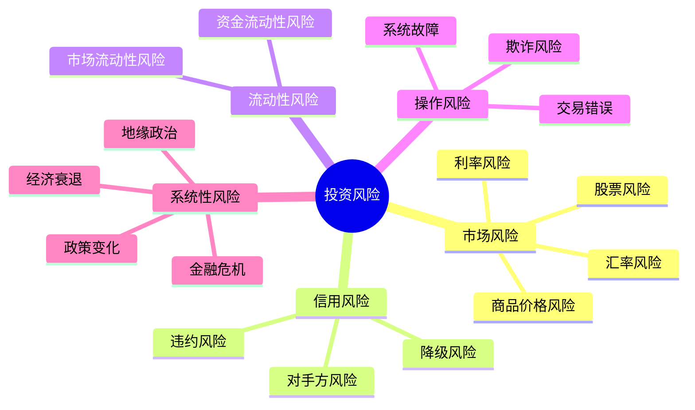
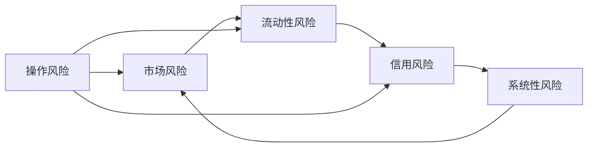

# 风险类型详解

## 概述

投资风险是指投资收益的不确定性，可能导致实际收益偏离预期收益。理解不同类型的风险是有效风险管理的基础。本文将系统介绍投资中的主要风险类型，帮助投资者识别、评估和管理各类风险。

**学习目标**：
- 掌握五大类风险的定义和特征
- 理解不同风险之间的相互关系
- 学会识别投资组合中的各类风险
- 了解不同资产类别面临的主要风险
- 建立全面的风险认知框架

**为什么重要**：只有全面理解各类风险，才能制定有效的风险管理策略。不同类型的风险需要不同的管理方法，忽视任何一类风险都可能导致严重损失。

## 风险分类框架

## 市场风险（Market Risk）

### 定义与特征

**市场风险**是指由于市场价格变动导致投资组合价值变化的风险。这是投资中最常见、最直接的风险类型。

**核心特征**：
- 影响范围广，几乎所有资产都面临市场风险
- 可以通过分散化部分降低
- 与宏观经济因素密切相关
- 可以通过衍生品对冲

### 主要类型

**1. 股票风险（Equity Risk）**

股票价格波动导致的风险，包括：

**系统性风险（Beta风险）**：
- 与整体市场相关的风险
- 无法通过分散化消除
- 由宏观因素驱动（经济增长、利率、通胀）
- 用贝塔系数衡量

**非系统性风险（Alpha风险）**：
- 特定公司或行业的风险
- 可以通过分散化降低
- 包括：经营风险、财务风险、管理风险

**案例**：2008年金融危机
- 系统性风险：标普500指数下跌37%
- 非系统性风险：金融股下跌超过50%，而消费必需品股相对抗跌

**2. 利率风险（Interest Rate Risk）**

利率变动对资产价格的影响，主要影响固定收益证券。

**久期风险**：
- 债券价格与利率反向变动
- 久期越长，利率敏感度越高
- 公式：价格变动 ≈ -久期 × 利率变动

**再投资风险**：
- 利率下降时，到期资金无法以原利率再投资
- 影响长期投资的复利效应

**收益率曲线风险**：
- 不同期限利率变动不一致
- 影响债券组合的相对价值

**案例**：2022年美联储加息
- 10年期美债收益率从1.5%升至4%
- 长期债券价格大幅下跌
- 20年期美债ETF（TLT）下跌超过30%

**3. 汇率风险（Currency Risk）**

汇率波动对跨境投资的影响。

**交易风险**：
- 已确定的外币现金流的汇率风险
- 影响进出口企业和跨境投资者

**折算风险**：
- 财务报表折算时的汇率风险
- 影响跨国公司的账面价值

**经济风险**：
- 汇率变动对企业竞争力的长期影响
- 影响出口导向型企业

**案例**：2022年美元走强
- 美元指数上涨超过15%
- 持有欧元、日元资产的美国投资者遭受汇兑损失
- 新兴市场货币大幅贬值

**4. 商品价格风险（Commodity Risk）**

大宗商品价格波动的风险。

**能源价格风险**：
- 石油、天然气价格波动
- 影响能源企业和高能耗行业

**金属价格风险**：
- 贵金属（黄金、白银）
- 工业金属（铜、铝）

**农产品价格风险**：
- 受天气、供需影响大
- 季节性特征明显

**案例**：2022年能源危机
- 欧洲天然气价格暴涨10倍
- 原油价格突破120美元/桶
- 能源股大幅上涨，但下游企业成本压力巨大

### 市场风险的度量

**波动率（Volatility）**：
- 标准差衡量价格波动程度
- VIX指数反映市场恐慌程度

**贝塔系数（Beta）**：
- 衡量系统性风险
- β > 1：高于市场波动
- β < 1：低于市场波动

**最大回撤（Maximum Drawdown）**：
- 从峰值到谷底的最大跌幅
- 反映极端情况下的损失

## 信用风险（Credit Risk）

### 定义与特征

**信用风险**是指债务人无法履行合约义务导致损失的风险。主要影响债券投资者和贷款机构。

**核心特征**：
- 损失具有不对称性（只有损失，没有超额收益）
- 与经济周期高度相关
- 可以通过信用分析和分散化管理
- 信用评级是重要参考

### 主要类型

**1. 违约风险（Default Risk）**

债务人完全无法偿还债务的风险。

**主权违约**：
- 国家无法偿还外债
- 历史案例：阿根廷（2001）、希腊（2012）

**企业违约**：
- 公司破产或重组
- 历史案例：雷曼兄弟（2008）、恒大集团（2021）

**违约率统计**：
- 投资级债券：年违约率 < 0.5%
- 高收益债券：年违约率 2-5%
- 经济衰退期违约率大幅上升

**2. 降级风险（Downgrade Risk）**

信用评级下调导致债券价格下跌的风险。

**评级变动影响**：
- 从投资级降至垃圾级影响最大
- 机构投资者被迫抛售
- 融资成本上升

**案例**：通用电气（GE）
- 2018年从AA+降至BBB+
- 债券价格大幅下跌
- 融资成本显著上升

**3. 对手方风险（Counterparty Risk）**

交易对手无法履行合约义务的风险。

**衍生品交易**：
- OTC衍生品面临对手方风险
- 2008年AIG危机凸显此风险

**证券借贷**：
- 借券方违约风险
- 需要足额抵押品

**清算风险**：
- 交易结算过程中的风险
- 中央对手方清算降低此风险

### 信用风险的度量

**信用利差（Credit Spread）**：
- 公司债收益率 - 国债收益率
- 反映市场对信用风险的定价

**违约概率（Probability of Default, PD）**：
- 基于历史数据或市场价格估算
- 穆迪、标普提供历史违约率数据

**违约损失率（Loss Given Default, LGD）**：
- 违约后的损失比例
- 高级债券 LGD 约 40%
- 次级债券 LGD 约 70%

**预期损失（Expected Loss）**：
$$
EL = PD \times LGD \times EAD
$$
其中 EAD 是违约风险敞口

## 流动性风险（Liquidity Risk）

### 定义与特征

**流动性风险**是指无法以合理价格及时买卖资产的风险。

**核心特征**：
- 在市场压力时期急剧恶化
- 与市场风险相互强化
- 难以量化和预测
- 对杠杆投资者影响巨大

### 主要类型

**1. 市场流动性风险（Market Liquidity Risk）**

资产本身难以交易的风险。

**流动性指标**：
- 买卖价差（Bid-Ask Spread）
- 交易量
- 市场深度
- 价格冲击

**流动性分层**：
- 高流动性：大盘股、国债、主要货币
- 中等流动性：小盘股、公司债、新兴市场
- 低流动性：私募股权、房地产、另类投资

**案例**：2020年3月流动性危机
- 疫情恐慌导致流动性枯竭
- 连美国国债都出现流动性问题
- 美联储紧急干预，提供无限流动性

**2. 资金流动性风险（Funding Liquidity Risk）**

无法获得足够资金满足义务的风险。

**保证金追缴**：
- 衍生品交易需要追加保证金
- 无法追加则被强制平仓

**赎回压力**：
- 开放式基金面临大规模赎回
- 被迫低价抛售资产

**再融资风险**：
- 短期债务到期无法展期
- 融资成本大幅上升

**案例**：长期资本管理公司（LTCM）
- 1998年俄罗斯违约引发流动性危机
- 高杠杆放大损失
- 无法满足保证金要求
- 最终被迫救助

### 流动性风险的管理

**流动性缓冲**：
- 持有现金或高流动性资产
- 建立信用额度

**资产负债匹配**：
- 长期资产用长期资金
- 避免期限错配

**压力测试**：
- 模拟极端情况下的流动性需求
- 制定应急计划

## 操作风险（Operational Risk）

### 定义与特征

**操作风险**是指由于内部流程、人员、系统不完善或外部事件导致损失的风险。

**核心特征**：
- 难以量化和预测
- 损失可能巨大
- 可以通过内部控制降低
- 监管日益重视

### 主要类型

**1. 交易错误（Trading Errors）**

人为失误导致的交易损失。

**常见错误**：
- 输入错误（胖手指错误）
- 误解指令
- 未经授权交易

**案例**：瑞银"胖手指"事件
- 2012年交易员输入错误
- 导致23亿美元损失
- 交易员被判刑

**2. 系统故障（System Failures）**

技术系统问题导致的风险。

**IT系统风险**：
- 交易系统宕机
- 数据丢失或错误
- 网络安全漏洞

**案例**：骑士资本集团
- 2012年交易软件故障
- 45分钟内损失4.4亿美元
- 公司被迫出售

**3. 欺诈风险（Fraud Risk）**

内部或外部欺诈导致的损失。

**内部欺诈**：
- 未经授权交易
- 挪用资金
- 虚假报告

**外部欺诈**：
- 黑客攻击
- 身份盗用
- 市场操纵

**案例**：麦道夫庞氏骗局
- 650亿美元欺诈案
- 持续20多年
- 监管和内控失败

**4. 法律与合规风险**

违反法律法规导致的风险。

**监管处罚**：
- 违规交易
- 信息披露不当
- 反洗钱失败

**诉讼风险**：
- 客户诉讼
- 监管诉讼
- 集体诉讼

### 操作风险的管理

**内部控制**：
- 职责分离
- 双重验证
- 定期审计

**技术保障**：
- 系统冗余
- 数据备份
- 网络安全

**培训与文化**：
- 员工培训
- 风险意识
- 合规文化

## 系统性风险（Systemic Risk）

### 定义与特征

**系统性风险**是指影响整个金融系统或经济体系的风险，单个机构无法通过分散化消除。

**核心特征**：
- 影响范围极广
- 传染性强
- 难以预测和防范
- 需要政策干预

### 主要类型

**1. 金融危机风险**

金融系统崩溃的风险。

**银行危机**：
- 银行挤兑
- 信贷紧缩
- 支付系统瘫痪

**市场崩盘**：
- 股市暴跌
- 流动性枯竭
- 恐慌性抛售

**案例**：2008年全球金融危机
- 次贷危机引发
- 雷曼兄弟破产
- 全球金融系统濒临崩溃
- 各国政府大规模救助

**2. 经济衰退风险**

经济增长大幅放缓或负增长的风险。

**衰退特征**：
- GDP连续两个季度负增长
- 失业率上升
- 企业盈利下降
- 资产价格下跌

**案例**：2020年疫情衰退
- 全球经济急剧收缩
- 失业率飙升
- 各国推出大规模刺激政策

**3. 政策风险**

政府政策变化导致的风险。

**货币政策风险**：
- 利率大幅变动
- 量化宽松或紧缩
- 汇率政策调整

**财政政策风险**：
- 税收政策变化
- 政府支出调整
- 债务危机

**监管政策风险**：
- 行业监管加强
- 反垄断调查
- 环保政策

**案例**：中国互联网监管
- 2021年反垄断加强
- 教育培训行业整顿
- 相关股票大幅下跌

**4. 地缘政治风险**

国际政治冲突和紧张局势的风险。

**战争风险**：
- 军事冲突
- 贸易战
- 制裁与反制裁

**政治不稳定**：
- 政权更迭
- 社会动荡
- 恐怖主义

**案例**：俄乌冲突
- 2022年俄罗斯入侵乌克兰
- 能源价格飙升
- 全球供应链中断
- 俄罗斯资产暴跌

### 系统性风险的应对

**宏观审慎监管**：
- 资本充足率要求
- 压力测试
- 系统重要性机构监管

**政策工具**：
- 货币政策调整
- 财政刺激
- 流动性支持

**国际协调**：
- G20协调
- 国际货币基金组织
- 金融稳定委员会

## 风险之间的相互关系

### 风险传染

**风险螺旋**：
- 市场下跌 → 流动性恶化 → 被迫抛售 → 市场进一步下跌
- 信用恶化 → 融资困难 → 违约增加 → 信用进一步恶化

### 风险聚集

**相关性上升**：
- 危机时期，资产相关性趋于1
- 分散化效果减弱
- "唯一的对冲是现金"

**杠杆放大**：
- 杠杆放大所有风险
- 流动性风险尤其致命
- 强制平仓加剧市场波动

## 不同资产类别的主要风险

### 股票

**主要风险**：
- 市场风险（系统性和非系统性）
- 流动性风险（小盘股）
- 操作风险（交易错误）

**次要风险**：
- 汇率风险（跨境投资）
- 系统性风险（金融危机）

### 债券

**主要风险**：
- 信用风险（公司债）
- 利率风险（长期债券）
- 流动性风险（高收益债）

**次要风险**：
- 汇率风险（外币债券）
- 再投资风险

### 衍生品

**主要风险**：
- 市场风险（高杠杆）
- 对手方风险（OTC）
- 流动性风险（复杂产品）

**次要风险**：
- 操作风险（复杂性）
- 模型风险（定价错误）

### 另类投资

**主要风险**：
- 流动性风险（私募股权、房地产）
- 估值风险（缺乏市场价格）
- 操作风险（复杂结构）

**次要风险**：
- 信用风险（对冲基金）
- 监管风险（加密货币）

## 常见误区

### 误区1：分散化可以消除所有风险

**真相**：分散化只能降低非系统性风险，无法消除系统性风险。在极端市场条件下，所有资产都会下跌。

### 误区2：低风险等于低波动

**真相**：波动率只是风险的一个维度。信用风险、流动性风险可能不表现为高波动，但损失可能更大。

### 误区3：历史低风险意味着未来低风险

**真相**：风险是动态变化的。长期平静后往往伴随剧烈波动（"黑天鹅"事件）。

### 误区4：对冲可以完全消除风险

**真相**：对冲有成本，且可能不完美。极端情况下，对冲工具可能失效。

### 误区5：只关注市场风险

**真相**：其他类型的风险同样重要。操作风险、流动性风险可能导致灾难性损失。

## 实战建议

### 1. 建立风险清单

**定期审查**：
- 识别投资组合面临的所有风险
- 评估每类风险的严重程度
- 制定应对措施

### 2. 多维度风险管理

**不要只关注一类风险**：
- 市场风险：分散化、对冲
- 信用风险：信用分析、分散
- 流动性风险：保持流动性缓冲
- 操作风险：内部控制
- 系统性风险：资产配置、现金储备

### 3. 压力测试

**情景分析**：
- 模拟极端市场情况
- 评估组合在危机中的表现
- 制定应急计划

### 4. 动态调整

**根据市场环境调整**：
- 牛市：可以承担更多风险
- 熊市：降低风险敞口
- 危机：保持流动性

## 延伸阅读

### 经典著作

1. **Jorion, P. (2006)**. *Value at Risk: The New Benchmark for Managing Financial Risk*. McGraw-Hill.
   - 风险管理经典教材

2. **Hull, J. C. (2018)**. *Risk Management and Financial Institutions*. Wiley.
   - 全面的风险管理指南

3. **Taleb, N. N. (2007)**. *The Black Swan: The Impact of the Highly Improbable*. Random House.
   - 极端风险和不确定性

4. **Damodaran, A. (2007)**. *Strategic Risk Taking: A Framework for Risk Management*. Pearson.
   - 战略风险管理

### 实践指南

5. **Crouhy, M., Galai, D., & Mark, R. (2014)**. *The Essentials of Risk Management*. McGraw-Hill.
   - 实用风险管理手册

6. **McNeil, A. J., Frey, R., & Embrechts, P. (2015)**. *Quantitative Risk Management: Concepts, Techniques and Tools*. Princeton University Press.
   - 量化风险管理

7. **Rebonato, R. (2007)**. *Plight of the Fortune Tellers: Why We Need to Manage Financial Risk Differently*. Princeton University Press.
   - 风险管理的反思

8. Jorion, P. (2006). *Value at Risk: The New Benchmark for Managing Financial Risk* (3rd ed.). McGraw-Hill.
## 总结

理解不同类型的风险是有效风险管理的基础。投资者需要：

**关键要点**：
1. 风险是多维度的，不能只关注市场风险
2. 不同类型的风险相互关联，可能形成风险螺旋
3. 分散化有效但有限，无法消除系统性风险
4. 流动性风险和操作风险常被低估但可能致命
5. 风险管理需要多种工具和方法的组合
6. 定期审查和动态调整风险管理策略

风险管理不是消除风险，而是理解风险、量化风险、在可承受范围内承担风险。只有全面理解各类风险，才能制定有效的风险管理策略，在追求收益的同时保护资本。

---

**下一步学习**：
- [风险测量方法](risk-measurement.html) - 学习如何量化各类风险
- [VaR和CVaR](var-cvar.html) - 掌握风险度量的核心工具
- 组合对冲 - 学习风险对冲策略

**相关主题**：
- 压力测试
- 仓位管理
- 行为金融学
