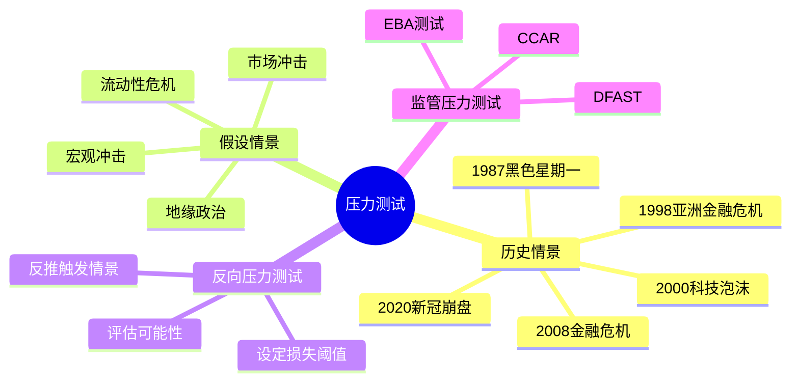
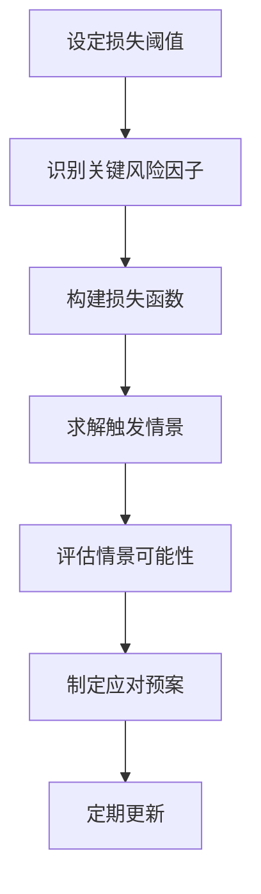

# 压力测试

## 概述

压力测试（Stress Testing）是评估投资组合在极端市场条件下潜在损失的核心风险管理工具。与VaR关注正常市场条件下的风险不同，压力测试专门针对低概率、高冲击的极端情景，是识别"黑天鹅"风险的重要手段。

**学习目标**：
- 理解压力测试的原理与分类
- 掌握历史情景和假设情景的设计方法
- 学会实施完整的压力测试流程
- 了解监管压力测试的要求与实践
- 将压力测试结果转化为风险管理行动

**为什么重要**：2008年金融危机深刻揭示了仅依赖VaR的局限性——正常市场假设在危机中完全失效。压力测试填补了统计模型的盲区，帮助投资者在极端情况发生前做好准备。

## 压力测试框架



## 压力测试的类型

### 历史情景分析（Historical Scenario Analysis）

**核心思路**：将历史上真实发生的极端市场事件"重放"到当前组合，评估如果同样的冲击再次发生，组合会损失多少。

**主要历史情景**：

#### 1987年黑色星期一
- 触发因素：程序化交易、组合保险策略失效
- 市场冲击：道琼斯指数单日暴跌22.6%
- 关键特征：流动性瞬间枯竭，卖单无法成交
- 对当前组合的启示：评估极端流动性风险

#### 1997-1998年亚洲金融危机
- 触发因素：泰铢贬值引发连锁反应
- 市场冲击：亚洲货币贬值30-80%，股市腰斩
- 关键特征：新兴市场传染效应，美元流动性危机
- 对当前组合的启示：新兴市场敞口和货币风险

#### 2000-2002年科技泡沫破裂
- 触发因素：互联网公司估值泡沫破裂
- 市场冲击：纳斯达克从峰值下跌78%，历时2.5年
- 关键特征：高估值成长股遭受毁灭性打击
- 对当前组合的启示：成长股集中度风险

#### 2008年全球金融危机
- 触发因素：次贷危机引发系统性金融危机
- 市场冲击：标普500下跌56.8%，信用市场冻结
- 关键特征：相关性趋近于1，分散化失效
- 对当前组合的启示：系统性风险和相关性风险

**历史情景参数示例（2008年危机）**：

| 资产类别 | 价格变动 | 波动率变化 | 相关性变化 |
|---------|---------|-----------|-----------|
| 美国股票 | -40% | +300% | 趋近1 |
| 高收益债 | -30% | +400% | 高度正相关 |
| 投资级债 | -8% | +150% | 轻微正相关 |
| 新兴市场股 | -55% | +350% | 高度正相关 |
| 黄金 | +5% | +100% | 负相关 |
| 美元指数 | +15% | +200% | 负相关 |
| 原油 | -70% | +500% | 正相关 |

### 假设情景分析（Hypothetical Scenario Analysis）

**核心思路**：基于对未来可能发生的极端事件的判断，构建尚未发生但合理可信的冲击情景。

#### 宏观经济情景

**情景A：滞胀冲击**
- 背景：通胀持续高企，经济增长停滞
- 关键假设：
  - CPI突破10%，持续12个月
  - GDP增长降至-2%
  - 央行被迫加息至8%
- 市场影响：
  - 股票：-35%（估值压缩+盈利下滑）
  - 长期国债：-25%（利率上升）
  - 大宗商品：+30%（通胀对冲）
  - 房地产：-20%（利率上升）

**情景B：通缩螺旋**
- 背景：需求崩溃，价格持续下跌
- 关键假设：
  - CPI降至-3%，持续18个月
  - 失业率升至15%
  - 央行利率降至零下限
- 市场影响：
  - 股票：-50%（盈利崩溃）
  - 长期国债：+20%（避险需求）
  - 信用债：-40%（违约率飙升）
  - 黄金：+15%（货币体系不确定性）

**情景C：地缘政治危机**
- 背景：主要大国之间爆发严重冲突
- 关键假设：
  - 全球贸易中断30%
  - 能源供应受阻
  - 金融制裁升级
- 市场影响：
  - 能源股：+40%
  - 全球股票：-30%
  - 美元：+20%（避险）
  - 新兴市场：-50%

#### 市场结构情景

**情景D：流动性危机**
- 背景：市场流动性突然枯竭
- 关键特征：
  - 买卖价差扩大10-50倍
  - 大额订单无法执行
  - 融资渠道关闭
- 对组合的影响：
  - 无法按预期价格平仓
  - 被迫折价出售资产
  - 保证金追缴引发连锁清仓

**情景E：相关性崩溃**
- 背景：历史上低相关的资产突然高度相关
- 关键特征：
  - 分散化效果消失
  - 对冲策略失效
  - 组合损失远超预期
- 历史案例：2008年危机中，几乎所有风险资产同步下跌

### 反向压力测试（Reverse Stress Testing）

**核心思路**：不是从情景推损失，而是从不可接受的损失倒推可能导致该损失的情景。

**实施步骤**：



**示例**：
- 损失阈值：组合净值下跌30%
- 关键风险因子：股票敞口60%、债券40%
- 触发情景：股票下跌45% + 债券下跌10%
- 可能性评估：历史上约每20年发生一次
- 应对预案：设置动态止损，购买尾部保护

**反向压力测试的价值**：
1. 发现隐藏的脆弱性
2. 挑战"不可能发生"的假设
3. 为极端情景制定应急预案
4. 改进风险限额设定

## 压力测试实施流程

### 第一步：确定测试范围

**组合范围**：
- 全组合测试 vs 子组合测试
- 包含所有资产类别
- 考虑表外敞口和衍生品

**风险因子识别**：
- 市场风险因子（股价、利率、汇率、商品价格）
- 信用风险因子（信用利差、违约率）
- 流动性风险因子（买卖价差、市场深度）
- 宏观风险因子（GDP、通胀、失业率）

### 第二步：情景设计

**情景设计原则**：
1. **严重但合理**：情景应该是极端的，但不是不可能发生的
2. **多维度冲击**：同时考虑多个风险因子的联动
3. **考虑相关性变化**：危机中相关性会发生根本性变化
4. **包含二阶效应**：考虑市场反馈和流动性螺旋

**情景文档化**：
```
情景名称：2008年金融危机重演
情景描述：类似2008年的系统性金融危机
触发事件：主要金融机构流动性危机
时间范围：12个月
关键假设：
  - 股票市场：-45%
  - 信用利差：+500bps
  - 波动率：VIX升至80
  - 流动性：市场深度下降70%
相关性假设：
  - 股票与信用债相关性：0.8（正常0.3）
  - 股票与黄金相关性：-0.5（正常-0.1）
```

### 第三步：计算损失

**全值重估法（Full Revaluation）**：
- 在情景假设下重新计算每个头寸的价值
- 最准确，但计算量大
- 适合含有非线性工具（期权）的组合

**敏感度分析法（Sensitivity Analysis）**：
- 使用希腊字母（Delta、Gamma、Vega等）近似计算
- 计算速度快，但对大幅冲击精度下降
- 适合线性组合的快速评估

**Python示例**：
```python
import numpy as np
import pandas as pd

class StressTest:
    def __init__(self, portfolio):
        """
        portfolio: dict, {asset: (value, sensitivity)}
        """
        self.portfolio = portfolio
    
    def apply_scenario(self, scenario):
        """
        scenario: dict, {asset: shock_percentage}
        返回组合损失
        """
        total_loss = 0
        loss_breakdown = {}
        
        for asset, (value, sensitivity) in self.portfolio.items():
            if asset in scenario:
                shock = scenario[asset]
                loss = value * shock * sensitivity
                total_loss += loss
                loss_breakdown[asset] = loss
        
        return total_loss, loss_breakdown

# 示例
portfolio = {
    'US_Equity': (1000000, 1.0),    # 100万，敏感度1
    'EM_Equity': (500000, 1.2),     # 50万，敏感度1.2（更高波动）
    'Corp_Bond': (800000, 0.6),     # 80万，敏感度0.6
    'Gold': (200000, -0.3),         # 20万，负相关
}

# 2008年危机情景
crisis_2008 = {
    'US_Equity': -0.45,
    'EM_Equity': -0.55,
    'Corp_Bond': -0.25,
    'Gold': 0.05,
}

st = StressTest(portfolio)
total_loss, breakdown = st.apply_scenario(crisis_2008)
print(f"总损失: ${total_loss:,.0f}")
print(f"损失率: {total_loss/sum(v for v,_ in portfolio.values()):.1%}")
for asset, loss in breakdown.items():
    print(f"  {asset}: ${loss:,.0f}")
```

### 第四步：结果分析与报告

**关键分析维度**：
1. 总损失金额和损失率
2. 各资产类别的损失贡献
3. 与VaR的比较（压力损失/VaR倍数）
4. 流动性影响评估
5. 资本充足率影响

**压力测试报告模板**：

| 情景 | 总损失 | 损失率 | 最大单资产损失 | 流动性影响 |
|-----|-------|-------|-------------|-----------|
| 2008危机 | -$X | -X% | 股票 -$X | 高 |
| 滞胀冲击 | -$X | -X% | 债券 -$X | 中 |
| 地缘危机 | -$X | -X% | 新兴市场 -$X | 高 |

### 第五步：行动计划

**基于压力测试结果的行动**：

1. **调整资产配置**：减少在极端情景下损失最大的资产敞口
2. **购买保护**：通过期权或其他衍生品对冲尾部风险
3. **提高流动性储备**：确保在危机中有足够的流动性缓冲
4. **设置触发机制**：当市场信号出现时自动启动风险降低程序
5. **制定应急预案**：明确在不同损失水平下的应对措施

## 监管压力测试

### 银行业监管压力测试

**美国DFAST/CCAR**：
- 美联储每年对大型银行进行压力测试
- 基准情景、不利情景、严重不利情景
- 评估资本充足率在压力下的变化
- 结果影响股息支付和股票回购计划

**欧洲EBA压力测试**：
- 欧洲银行管理局每两年进行一次
- 覆盖欧盟主要银行
- 评估银行系统的整体韧性

**巴塞尔协议要求**：
- 银行必须定期进行内部压力测试
- 压力测试结果用于资本规划
- 需要向监管机构报告

### 资产管理行业压力测试

**IOSCO指引**：
- 基金公司应定期进行流动性压力测试
- 评估在赎回压力下的流动性状况
- 确保基金能够满足投资者赎回需求

**实践要求**：
- 至少每季度进行一次压力测试
- 覆盖市场风险和流动性风险
- 结果向董事会报告

## 压力测试的局限性

### 情景选择偏差
- 测试的情景可能遗漏真正的"黑天鹅"
- 历史情景无法预测全新类型的危机
- 解决方案：保持情景库的多样性，定期更新

### 模型风险
- 损失计算依赖模型假设
- 非线性效应难以完全捕捉
- 解决方案：使用多种计算方法，进行敏感性分析

### 行为假设
- 假设组合在危机中保持静态
- 实际中投资者会主动调整
- 解决方案：加入动态行为假设

### 相关性不稳定
- 危机中相关性会发生根本性变化
- 历史相关性可能严重低估危机损失
- 解决方案：使用危机相关性矩阵

## 最佳实践

### 建立情景库

**情景库应包含**：
- 5-10个历史情景（覆盖不同类型危机）
- 5-10个假设情景（覆盖当前主要风险）
- 2-3个反向压力测试情景
- 定期更新（至少每季度）

### 整合到投资流程

**日常整合**：
- 新投资决策前进行压力测试
- 将压力损失纳入投资审批标准
- 设置基于压力测试的风险限额

**定期审查**：
- 月度：更新市场参数，重新运行测试
- 季度：审查情景库，添加新情景
- 年度：全面评估压力测试框架

### 沟通与报告

**向投资委员会报告**：
- 关键情景下的损失摘要
- 与上期比较的变化
- 需要关注的风险集中点
- 建议的风险管理行动

## 延伸阅读

1. **Basel Committee on Banking Supervision (2018)**. *Stress Testing Principles*. BIS.
   - 监管压力测试的权威指引

2. **Schuermann, T. (2014)**. "Stress Testing Banks". *International Journal of Forecasting*, 30(3), 717-728.
   - 银行压力测试的学术综述

3. **Taleb, N. N. (2007)**. *The Black Swan: The Impact of the Highly Improbable*. Random House.
   - 极端事件的哲学思考

4. **Jorion, P. (2006)**. *Value at Risk* (3rd ed.). McGraw-Hill.
   - 包含压力测试的全面风险管理教材

## 总结

压力测试是风险管理工具箱中不可或缺的组成部分：

1. **补充VaR的盲区**：专注于统计模型无法捕捉的极端风险
2. **历史与假设结合**：既从历史中学习，也对未来保持想象力
3. **反向思维**：从损失倒推情景，发现隐藏脆弱性
4. **行动导向**：测试结果必须转化为具体的风险管理行动
5. **持续更新**：随市场环境变化不断完善情景库

---

**下一步学习**：
- [组合对冲](portfolio-hedging.html) - 学习如何对冲压力测试揭示的风险
- [仓位管理](position-sizing.html) - 基于风险评估确定合理仓位
- [行为金融学](behavioral-finance.html) - 理解危机中的非理性行为

**相关主题**：
- [风险测量](risk-measurement.html)
- [VaR和CVaR](var-cvar.html)
- [风险类型](risk-types.html)
