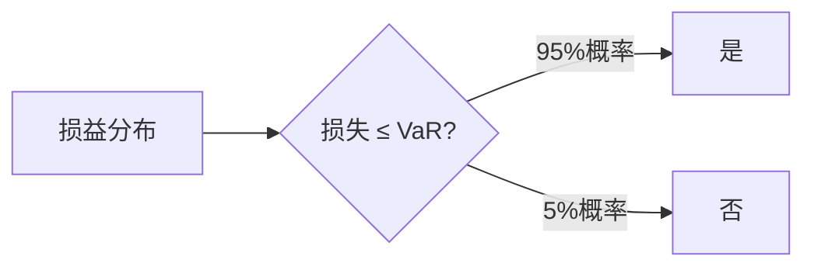

# VaR 和 CVaR 深度解析

## 概述

Value at Risk (VaR) 和 Conditional Value at Risk (CVaR) 是现代风险管理的核心工具。VaR回答"正常情况下最多损失多少"，CVaR回答"极端情况下平均损失多少"。本文深入讲解这两个指标的理论基础、计算方法、实际应用和局限性。

**学习目标**：
- 深入理解VaR和CVaR的数学定义
- 掌握三种主要计算方法及其实现
- 理解VaR和CVaR的优缺点
- 学会在实践中应用VaR和CVaR
- 了解监管要求和行业标准

**为什么重要**：VaR是全球金融机构风险管理的标准工具，被巴塞尔协议要求用于资本充足率计算。CVaR克服了VaR的主要缺陷，是更优的风险度量。理解这两个指标对于专业风险管理至关重要。

## VaR 理论基础

### 数学定义

**VaR定义**：在给定置信水平 $\alpha$ 和时间范围 $T$ 内，投资组合的最大可能损失。

**数学表达**：
$$
P(Loss \leq VaR_\alpha) = \alpha
$$

或等价地：
$$
VaR_\alpha = -F^{-1}(1-\alpha)
$$

其中 $F$ 是损益分布函数。

**三要素**：
1. **置信水平** $\alpha$：通常为95%或99%
2. **时间范围** $T$：通常为1天或10天
3. **货币单位**：损失金额

**示例解释**：
"95%置信水平下，1天VaR为100万美元"表示：
- 95%的概率下，1天损失不超过100万
- 5%的概率下，1天损失可能超过100万
- 平均每20个交易日会有1天损失超过100万


### VaR的直观理解

**分位数视角**：
VaR本质上是损益分布的分位数。如果将过去250天的收益率从低到高排序，95% VaR就是第13个最差的收益率（250 × 5% ≈ 13）。

**概率视角**：


**时间尺度转换**：
- 1天VaR → 10天VaR：乘以 √10 ≈ 3.16（假设独立同分布）
- 日度VaR → 年度VaR：乘以 √252 ≈ 15.87

**注意**：时间尺度转换假设收益率独立同分布，实际中可能存在自相关和波动率聚集。

### VaR的发展历史

**1990年代初**：JP Morgan开发RiskMetrics系统，将VaR推广到金融行业。

**1996年**：巴塞尔委员会允许银行使用内部VaR模型计算市场风险资本。

**2008年后**：金融危机暴露VaR的局限性，监管机构要求补充压力测试和CVaR。

**当前**：VaR仍是行业标准，但需要与其他风险度量工具结合使用。

## VaR计算方法详解

### 方法一：历史模拟法

**核心思想**：历史会重演，过去的收益率分布代表未来的可能性。

**详细步骤**：

1. **收集历史数据**：
   - 时间窗口：通常250-500个交易日
   - 数据频率：日度数据
   - 数据来源：可靠的市场数据提供商

2. **计算历史收益率**：
   $
   r_t = \frac{P_t - P_{t-1}}{P_{t-1}}
   $

3. **应用到当前组合**：
   - 将历史收益率应用到当前持仓
   - 计算每个历史情景下的组合价值变化

4. **排序并找分位数**：
   - 将损益从小到大排序
   - 95% VaR = 第5百分位数

**Python完整实现**：

```python
import numpy as np
import pandas as pd
import matplotlib.pyplot as plt
from scipy import stats

class HistoricalVaR:
    def __init__(self, returns, portfolio_value):
        """
        returns: DataFrame, 各资产的历史收益率
        portfolio_value: dict, {asset: value}
        """
        self.returns = returns
        self.portfolio_value = portfolio_value
        self.weights = self._calculate_weights()
    
    def _calculate_weights(self):
        total = sum(self.portfolio_value.values())
        return {k: v/total for k, v in self.portfolio_value.items()}
    
    def calculate_portfolio_returns(self):
        """计算组合历史收益率"""
        portfolio_returns = pd.Series(0, index=self.returns.index)
        for asset, weight in self.weights.items():
            if asset in self.returns.columns:
                portfolio_returns += weight * self.returns[asset]
        return portfolio_returns
    
    def calculate_var(self, confidence_level=0.95):
        """计算VaR"""
        portfolio_returns = self.calculate_portfolio_returns()
        var_percentile = (1 - confidence_level) * 100
        var = np.percentile(portfolio_returns, var_percentile)
        
        # 转换为货币金额
        total_value = sum(self.portfolio_value.values())
        var_amount = -var * total_value
        
        return {
            'var_percentage': -var,
            'var_amount': var_amount,
            'confidence_level': confidence_level
        }
    
    def plot_distribution(self, confidence_level=0.95):
        """可视化收益率分布和VaR"""
        portfolio_returns = self.calculate_portfolio_returns()
        var_result = self.calculate_var(confidence_level)
        var_threshold = -var_result['var_percentage']
        
        plt.figure(figsize=(12, 6))
        plt.hist(portfolio_returns, bins=50, alpha=0.7, edgecolor='black')
        plt.axvline(var_threshold, color='red', linestyle='--', 
                   label=f'VaR ({confidence_level:.0%}): {var_result["var_percentage"]:.2%}')
        plt.xlabel('Portfolio Returns')
        plt.ylabel('Frequency')
        plt.title('Historical Return Distribution with VaR')
        plt.legend()
        plt.grid(True, alpha=0.3)
        return plt

# 示例使用
np.random.seed(42)
dates = pd.date_range('2020-01-01', periods=500, freq='D')
returns_data = pd.DataFrame({
    'Stock_A': np.random.normal(0.0005, 0.02, 500),
    'Stock_B': np.random.normal(0.0003, 0.015, 500),
    'Bond': np.random.normal(0.0002, 0.005, 500)
}, index=dates)

portfolio = {
    'Stock_A': 500000,
    'Stock_B': 300000,
    'Bond': 200000
}

hist_var = HistoricalVaR(returns_data, portfolio)
var_95 = hist_var.calculate_var(0.95)
var_99 = hist_var.calculate_var(0.99)

print(f"95% VaR: ${var_95['var_amount']:,.0f} ({var_95['var_percentage']:.2%})")
print(f"99% VaR: ${var_99['var_amount']:,.0f} ({var_99['var_percentage']:.2%})")
```

**优点**：
- 不需要假设分布形式
- 自动捕捉实际市场的肥尾特征
- 包含资产间的真实相关性
- 易于理解和解释

**缺点**：
- 完全依赖历史数据
- 无法预测前所未有的事件
- 需要大量历史数据（至少250个观测值）
- 对数据窗口选择敏感

**改进方法**：
- **加权历史模拟**：给近期数据更高权重
- **Bootstrap方法**：通过重采样增加样本量
- **波动率调整**：根据当前波动率调整历史收益率

### 方法二：方差-协方差法（参数法）

**核心假设**：收益率服从正态分布（或多元正态分布）。

**单资产VaR公式**：
$
VaR_\alpha = -(μ - z_\alpha σ) × V
$

**组合VaR公式**：
$
VaR_p = z_\alpha \sqrt{w^T \Sigma w} × V
$

其中：
- $w$ 是权重向量
- $\Sigma$ 是协方差矩阵
- $z_\alpha$ 是标准正态分位数

**关键参数**：

| 置信水平 | 单侧分位数 $z_\alpha$ |
|---------|---------------------|
| 90% | 1.282 |
| 95% | 1.645 |
| 97.5% | 1.960 |
| 99% | 2.326 |
| 99.5% | 2.576 |

**Python实现**：

```python
class ParametricVaR:
    def __init__(self, returns, portfolio_value):
        self.returns = returns
        self.portfolio_value = portfolio_value
        self.weights = self._calculate_weights()
        
    def _calculate_weights(self):
        total = sum(self.portfolio_value.values())
        weights = []
        assets = []
        for asset in self.returns.columns:
            if asset in self.portfolio_value:
                weights.append(self.portfolio_value[asset] / total)
                assets.append(asset)
        return np.array(weights), assets
    
    def calculate_var(self, confidence_level=0.95, time_horizon=1):
        """
        计算参数VaR
        time_horizon: 时间范围（天）
        """
        weights, assets = self.weights
        
        # 计算均值和协方差矩阵
        returns_subset = self.returns[assets]
        mean_returns = returns_subset.mean().values
        cov_matrix = returns_subset.cov().values
        
        # 组合均值和标准差
        portfolio_mean = np.dot(weights, mean_returns)
        portfolio_std = np.sqrt(np.dot(weights, np.dot(cov_matrix, weights)))
        
        # 调整到指定时间范围
        portfolio_mean_adjusted = portfolio_mean * time_horizon
        portfolio_std_adjusted = portfolio_std * np.sqrt(time_horizon)
        
        # 计算VaR
        z_score = stats.norm.ppf(1 - confidence_level)
        var_percentage = -(portfolio_mean_adjusted + z_score * portfolio_std_adjusted)
        
        total_value = sum(self.portfolio_value.values())
        var_amount = var_percentage * total_value
        
        return {
            'var_percentage': var_percentage,
            'var_amount': var_amount,
            'confidence_level': confidence_level,
            'time_horizon': time_horizon,
            'portfolio_mean': portfolio_mean,
            'portfolio_std': portfolio_std
        }
    
    def marginal_var(self, confidence_level=0.95):
        """计算边际VaR"""
        weights, assets = self.weights
        returns_subset = self.returns[assets]
        cov_matrix = returns_subset.cov().values
        
        portfolio_std = np.sqrt(np.dot(weights, np.dot(cov_matrix, weights)))
        z_score = stats.norm.ppf(1 - confidence_level)
        
        # 边际VaR = z * (Σw) / σ_p
        marginal_var = z_score * np.dot(cov_matrix, weights) / portfolio_std
        
        return dict(zip(assets, marginal_var))
    
    def component_var(self, confidence_level=0.95):
        """计算成分VaR"""
        weights, assets = self.weights
        marginal = self.marginal_var(confidence_level)
        
        total_value = sum(self.portfolio_value.values())
        component = {}
        for asset, w in zip(assets, weights):
            component[asset] = w * marginal[asset] * total_value
        
        return component

# 示例
param_var = ParametricVaR(returns_data, portfolio)
var_result = param_var.calculate_var(0.95, time_horizon=1)
print(f"\n参数法 95% VaR: ${var_result['var_amount']:,.0f}")
print(f"组合日均收益: {var_result['portfolio_mean']:.4%}")
print(f"组合日波动率: {var_result['portfolio_std']:.4%}")

# 边际VaR
marginal = param_var.marginal_var(0.95)
print("\n边际VaR:")
for asset, mvar in marginal.items():
    print(f"  {asset}: {mvar:.4%}")

# 成分VaR
component = param_var.component_var(0.95)
print("\n成分VaR:")
for asset, cvar in component.items():
    print(f"  {asset}: ${cvar:,.0f}")
```

**优点**：
- 计算速度快
- 需要的数据量少
- 易于分解和归因
- 适合线性组合

**缺点**：
- 正态分布假设不现实（实际有肥尾）
- 严重低估极端风险
- 不适合含期权的组合
- 对参数估计误差敏感

**适用场景**：
- 快速风险评估
- 线性组合（股票、债券）
- 日常风险监控
- 风险归因分析

### 方法三：蒙特卡洛模拟法

**核心思想**：通过随机模拟大量可能的未来情景，构建损益分布。

**实施步骤**：

1. **选择随机过程模型**：
   - 几何布朗运动（GBM）
   - 跳跃扩散模型
   - GARCH模型

2. **参数估计**：
   - 从历史数据估计参数
   - 或使用隐含参数（期权价格）

3. **生成随机路径**：
   - 模拟10,000-100,000次
   - 每次模拟一个完整的价格路径

4. **计算组合价值**：
   - 在每个情景下重新估值
   - 处理路径依赖和非线性

5. **提取VaR**：
   - 排序所有情景的损益
   - 找到对应分位数

**Python实现**：

```python
class MonteCarloVaR:
    def __init__(self, returns, portfolio_value):
        self.returns = returns
        self.portfolio_value = portfolio_value
        
    def simulate_gbm(self, n_simulations=10000, time_horizon=1):
        """
        使用几何布朗运动模拟
        """
        weights, assets = self._calculate_weights()
        returns_subset = self.returns[assets]
        
        # 估计参数
        mean_returns = returns_subset.mean().values
        cov_matrix = returns_subset.cov().values
        
        # 生成相关的随机数
        L = np.linalg.cholesky(cov_matrix)
        
        simulated_returns = []
        for _ in range(n_simulations):
            # 生成独立标准正态随机数
            z = np.random.standard_normal(len(assets))
            # 转换为相关的随机数
            correlated_z = np.dot(L, z)
            # 计算收益率
            sim_return = mean_returns * time_horizon + \
                        correlated_z * np.sqrt(time_horizon)
            # 计算组合收益率
            portfolio_return = np.dot(weights, sim_return)
            simulated_returns.append(portfolio_return)
        
        return np.array(simulated_returns)
    
    def calculate_var(self, confidence_level=0.95, 
                     n_simulations=10000, time_horizon=1):
        """计算蒙特卡洛VaR"""
        simulated_returns = self.simulate_gbm(n_simulations, time_horizon)
        
        # 计算VaR
        var_percentile = (1 - confidence_level) * 100
        var = -np.percentile(simulated_returns, var_percentile)
        
        total_value = sum(self.portfolio_value.values())
        var_amount = var * total_value
        
        return {
            'var_percentage': var,
            'var_amount': var_amount,
            'confidence_level': confidence_level,
            'n_simulations': n_simulations,
            'simulated_returns': simulated_returns
        }
    
    def _calculate_weights(self):
        total = sum(self.portfolio_value.values())
        weights = []
        assets = []
        for asset in self.returns.columns:
            if asset in self.portfolio_value:
                weights.append(self.portfolio_value[asset] / total)
                assets.append(asset)
        return np.array(weights), assets
    
    def plot_simulation(self, confidence_level=0.95, n_simulations=10000):
        """可视化模拟结果"""
        result = self.calculate_var(confidence_level, n_simulations)
        simulated_returns = result['simulated_returns']
        
        plt.figure(figsize=(12, 6))
        plt.hist(simulated_returns, bins=100, alpha=0.7, edgecolor='black')
        plt.axvline(-result['var_percentage'], color='red', linestyle='--',
                   label=f'VaR ({confidence_level:.0%}): {result["var_percentage"]:.2%}')
        plt.xlabel('Simulated Returns')
        plt.ylabel('Frequency')
        plt.title(f'Monte Carlo Simulation ({n_simulations:,} scenarios)')
        plt.legend()
        plt.grid(True, alpha=0.3)
        return plt

# 示例
mc_var = MonteCarloVaR(returns_data, portfolio)
mc_result = mc_var.calculate_var(0.95, n_simulations=10000)
print(f"\n蒙特卡洛 95% VaR: ${mc_result['var_amount']:,.0f}")
```

**优点**：
- 灵活性高，可以模拟复杂情景
- 适合非线性工具（期权、结构化产品）
- 可以处理路径依赖
- 可以使用非正态分布

**缺点**：
- 计算量大，速度慢
- 需要选择合适的随机过程
- 模型风险高
- 结果有随机性（需要大量模拟）

**适用场景**：
- 含期权的复杂组合
- 路径依赖产品
- 需要考虑极端情景
- 研究和回测

### 三种方法的比较

| 维度 | 历史模拟 | 参数法 | 蒙特卡洛 |
|-----|---------|-------|---------|
| 计算速度 | 快 | 最快 | 慢 |
| 数据需求 | 大量历史数据 | 较少 | 中等 |
| 分布假设 | 无 | 正态分布 | 灵活 |
| 肥尾捕捉 | 好 | 差 | 中等 |
| 非线性工具 | 可以 | 不适合 | 最适合 |
| 前瞻性 | 差 | 中等 | 好 |
| 模型风险 | 低 | 中等 | 高 |
| 适用场景 | 日常监控 | 快速评估 | 复杂产品 |

**实践建议**：
- 日常监控：使用历史模拟法
- 快速评估：使用参数法
- 复杂组合：使用蒙特卡洛法
- 最佳实践：三种方法结合，相互验证


## VaR的局限性

### 1. 不是一致性风险度量

**次可加性问题**：
$
VaR(X + Y) \leq VaR(X) + VaR(Y)
$
这个不等式不一定成立！

**实际案例**：
- 组合A：VaR = 100万
- 组合B：VaR = 100万
- 合并组合：VaR可能 > 200万

**后果**：
- 鼓励过度集中风险
- 分散化可能增加VaR
- 不适合风险预算分配

### 2. 忽略尾部风险

**VaR只告诉分位数，不告诉超出部分**：

```
情景A：95% VaR = 100万，最坏情况损失 110万
情景B：95% VaR = 100万，最坏情况损失 1000万
```

VaR无法区分这两种情况！

**2008年金融危机教训**：
- 许多机构的VaR模型显示风险可控
- 实际损失远超VaR预测
- 问题在于尾部风险被严重低估

### 3. 模型风险

**参数法的正态分布假设**：
- 实际收益率有肥尾（极端值比正态分布预测的更频繁）
- 偏度（不对称）和峰度（尖峰）被忽略
- 低估极端损失概率

**实证研究**：
- 正态分布预测：99% VaR每100天违背1次
- 实际观察：每100天违背3-5次
- 低估倍数：3-5倍

**历史模拟法的局限**：
- 假设未来类似过去
- 无法预测前所未有的事件
- 对数据窗口选择敏感

### 4. 顺周期性

**平静期**：
- 历史波动率低
- VaR估计值低
- 鼓励增加风险敞口

**危机期**：
- 历史波动率高
- VaR估计值高
- 强制减少风险敞口（在最坏的时机）

**后果**：
- 放大市场波动
- 加剧金融不稳定
- 顺周期的资本要求

### 5. 相关性不稳定

**正常时期**：
- 资产相关性较低
- 分散化有效
- VaR较低

**危机时期**：
- 相关性趋近于1
- 分散化失效
- 实际损失远超VaR

**案例**：2008年危机
- 危机前：股票与高收益债相关性 ≈ 0.3
- 危机中：相关性 > 0.8
- 结果：组合损失远超VaR预测

## CVaR（Conditional VaR）

### 定义与优势

**CVaR定义**：
也称为Expected Shortfall (ES) 或 Average VaR，是超过VaR的条件期望损失。

**数学定义**：
$
CVaR_\alpha = E[Loss | Loss > VaR_\alpha]
$

或等价地：
$
CVaR_\alpha = \frac{1}{1-\alpha} \int_\alpha^1 VaR_u \, du
$

**直观理解**：
- VaR回答："最坏的5%情况下，损失至少多少？"
- CVaR回答："最坏的5%情况下，平均损失多少？"

**示例**：
```
95% VaR = 100万
95% CVaR = 150万

解释：
- 95%的情况下，损失不超过100万
- 最坏的5%情况下，平均损失150万
- CVaR考虑了尾部的所有损失，不只是分位数
```

### CVaR的优势

**1. 一致性风险度量**

CVaR满足所有一致性公理：
- **单调性**：风险更大的组合，CVaR更高
- **次可加性**：$CVaR(X+Y) \leq CVaR(X) + CVaR(Y)$
- **正齐次性**：$CVaR(λX) = λ \cdot CVaR(X)$
- **平移不变性**：$CVaR(X+c) = CVaR(X) + c$

**实际意义**：
- 鼓励分散化
- 适合风险预算
- 理论基础扎实

**2. 关注尾部风险**

CVaR不仅看分位数，还看超出部分的平均值，更全面地反映极端风险。

**3. 优化友好**

CVaR是凸函数，可以用线性规划求解，适合组合优化。

### CVaR计算方法

**历史模拟法**：

```python
class CVaR:
    def __init__(self, returns, portfolio_value):
        self.returns = returns
        self.portfolio_value = portfolio_value
    
    def calculate_portfolio_returns(self):
        """计算组合收益率"""
        total = sum(self.portfolio_value.values())
        weights = {k: v/total for k, v in self.portfolio_value.items()}
        
        portfolio_returns = pd.Series(0, index=self.returns.index)
        for asset, weight in weights.items():
            if asset in self.returns.columns:
                portfolio_returns += weight * self.returns[asset]
        return portfolio_returns
    
    def calculate_var_cvar(self, confidence_level=0.95):
        """同时计算VaR和CVaR"""
        portfolio_returns = self.calculate_portfolio_returns()
        
        # 计算VaR
        var_percentile = (1 - confidence_level) * 100
        var = np.percentile(portfolio_returns, var_percentile)
        
        # 计算CVaR：超过VaR的平均损失
        tail_losses = portfolio_returns[portfolio_returns <= var]
        cvar = tail_losses.mean()
        
        total_value = sum(self.portfolio_value.values())
        
        return {
            'var_percentage': -var,
            'var_amount': -var * total_value,
            'cvar_percentage': -cvar,
            'cvar_amount': -cvar * total_value,
            'confidence_level': confidence_level,
            'tail_observations': len(tail_losses),
            'cvar_var_ratio': -cvar / var if var != 0 else None
        }
    
    def plot_var_cvar(self, confidence_level=0.95):
        """可视化VaR和CVaR"""
        portfolio_returns = self.calculate_portfolio_returns()
        result = self.calculate_var_cvar(confidence_level)
        
        plt.figure(figsize=(14, 7))
        
        # 绘制分布
        plt.hist(portfolio_returns, bins=50, alpha=0.7, 
                edgecolor='black', label='Return Distribution')
        
        # 标记VaR
        plt.axvline(-result['var_percentage'], color='orange', 
                   linestyle='--', linewidth=2,
                   label=f'VaR ({confidence_level:.0%}): {result["var_percentage"]:.2%}')
        
        # 标记CVaR
        plt.axvline(-result['cvar_percentage'], color='red', 
                   linestyle='--', linewidth=2,
                   label=f'CVaR ({confidence_level:.0%}): {result["cvar_percentage"]:.2%}')
        
        # 高亮尾部区域
        tail_returns = portfolio_returns[portfolio_returns <= -result['var_percentage']]
        plt.hist(tail_returns, bins=20, alpha=0.9, 
                color='red', edgecolor='black', label='Tail Losses')
        
        plt.xlabel('Portfolio Returns')
        plt.ylabel('Frequency')
        plt.title('VaR vs CVaR Comparison')
        plt.legend()
        plt.grid(True, alpha=0.3)
        return plt

# 示例
cvar_calc = CVaR(returns_data, portfolio)
result = cvar_calc.calculate_var_cvar(0.95)

print(f"\n95% VaR:  ${result['var_amount']:,.0f} ({result['var_percentage']:.2%})")
print(f"95% CVaR: ${result['cvar_amount']:,.0f} ({result['cvar_percentage']:.2%})")
print(f"CVaR/VaR比率: {result['cvar_var_ratio']:.2f}")
print(f"尾部观测数: {result['tail_observations']}")
```

**参数法（正态分布假设）**：

在正态分布假设下，CVaR有解析解：

$
CVaR_\alpha = μ + σ \frac{\phi(z_\alpha)}{1-\alpha}
$

其中 $\phi$ 是标准正态密度函数。

```python
def parametric_cvar(mean, std, confidence_level=0.95):
    """
    参数法计算CVaR（正态分布假设）
    """
    z_alpha = stats.norm.ppf(1 - confidence_level)
    phi_z = stats.norm.pdf(z_alpha)
    
    cvar = mean + std * phi_z / (1 - confidence_level)
    
    return -cvar  # 返回正数表示损失

# 示例
mean_return = 0.0005
std_return = 0.02
cvar_95 = parametric_cvar(mean_return, std_return, 0.95)
print(f"参数法 95% CVaR: {cvar_95:.2%}")
```

**蒙特卡洛法**：

```python
def monte_carlo_cvar(simulated_returns, confidence_level=0.95):
    """
    从蒙特卡洛模拟结果计算CVaR
    """
    # 计算VaR
    var_percentile = (1 - confidence_level) * 100
    var = np.percentile(simulated_returns, var_percentile)
    
    # 计算CVaR
    tail_losses = simulated_returns[simulated_returns <= var]
    cvar = tail_losses.mean()
    
    return -var, -cvar

# 使用之前的蒙特卡洛模拟结果
mc_var_result = mc_var.calculate_var(0.95, n_simulations=10000)
simulated_returns = mc_var_result['simulated_returns']
var, cvar = monte_carlo_cvar(simulated_returns, 0.95)

print(f"\n蒙特卡洛法:")
print(f"95% VaR:  {var:.2%}")
print(f"95% CVaR: {cvar:.2%}")
```

### CVaR在组合优化中的应用

**最小化CVaR的组合优化**：

传统的均值-方差优化：
$
\min_w \quad w^T \Sigma w
$

CVaR优化：
$
\min_w \quad CVaR_\alpha(w)
$

**优势**：
- 直接优化尾部风险
- 可以用线性规划求解
- 更符合投资者对极端损失的关注

**Python实现（简化版）**：

```python
from scipy.optimize import minimize

def cvar_optimization(returns, target_return, confidence_level=0.95):
    """
    最小化CVaR的组合优化
    """
    n_assets = returns.shape[1]
    
    def portfolio_cvar(weights):
        portfolio_returns = returns @ weights
        var_percentile = (1 - confidence_level) * 100
        var = np.percentile(portfolio_returns, var_percentile)
        tail_losses = portfolio_returns[portfolio_returns <= var]
        cvar = -tail_losses.mean()  # 负号因为要最小化损失
        return cvar
    
    def portfolio_return(weights):
        return returns.mean() @ weights
    
    # 约束条件
    constraints = [
        {'type': 'eq', 'fun': lambda w: np.sum(w) - 1},  # 权重和为1
        {'type': 'eq', 'fun': lambda w: portfolio_return(w) - target_return}  # 目标收益
    ]
    
    # 边界条件
    bounds = tuple((0, 1) for _ in range(n_assets))
    
    # 初始权重
    w0 = np.array([1/n_assets] * n_assets)
    
    # 优化
    result = minimize(portfolio_cvar, w0, method='SLSQP',
                     bounds=bounds, constraints=constraints)
    
    return result.x

# 示例
target_return = 0.0004  # 日均0.04%
optimal_weights = cvar_optimization(returns_data.values, target_return)
print("\nCVaR最优权重:")
for asset, weight in zip(returns_data.columns, optimal_weights):
    print(f"  {asset}: {weight:.2%}")
```

## VaR回测（Backtesting）

### 为什么需要回测

**验证模型准确性**：
- VaR是预测，需要验证是否准确
- 监管要求定期回测
- 发现模型问题，及时调整

**回测方法**：

### 1. 违背次数检验（Kupiec Test）

**原理**：统计实际损失超过VaR的次数，与理论预期比较。

**理论预期**：
- 95% VaR：每100天应该违背5次
- 99% VaR：每100天应该违背1次

**似然比检验**：
$
LR = -2 \ln\left[\frac{(1-p)^{T-N} p^N}{(1-\frac{N}{T})^{T-N} (\frac{N}{T})^N}\right]
$

其中：
- $T$ 是总天数
- $N$ 是实际违背次数
- $p$ 是理论违背概率（如0.05）

**判断标准**：
- $LR$ 服从 $\chi^2(1)$ 分布
- 临界值（95%置信）：3.84
- $LR > 3.84$：拒绝模型

**Python实现**：

```python
def kupiec_test(returns, var_estimates, confidence_level=0.95):
    """
    Kupiec回测
    """
    # 计算违背次数
    violations = (returns < -var_estimates).sum()
    n_observations = len(returns)
    
    # 理论违背概率
    p = 1 - confidence_level
    
    # 实际违背率
    violation_rate = violations / n_observations
    
    # 似然比统计量
    if violations == 0:
        lr_stat = -2 * n_observations * np.log(1 - p)
    elif violations == n_observations:
        lr_stat = -2 * n_observations * np.log(p)
    else:
        lr_stat = -2 * (
            (n_observations - violations) * np.log((1-p) / (1-violation_rate)) +
            violations * np.log(p / violation_rate)
        )
    
    # 临界值（95%置信）
    critical_value = 3.84
    
    # 判断
    reject = lr_stat > critical_value
    
    return {
        'violations': violations,
        'violation_rate': violation_rate,
        'expected_violations': n_observations * p,
        'lr_statistic': lr_stat,
        'critical_value': critical_value,
        'reject_model': reject
    }

# 示例
# 假设我们有历史VaR估计和实际收益率
portfolio_returns = cvar_calc.calculate_portfolio_returns()
var_estimates = pd.Series([hist_var.calculate_var(0.95)['var_percentage']] * len(portfolio_returns))

backtest_result = kupiec_test(portfolio_returns.values, var_estimates.values, 0.95)
print("\nKupiec回测结果:")
print(f"实际违背次数: {backtest_result['violations']}")
print(f"预期违背次数: {backtest_result['expected_violations']:.1f}")
print(f"违背率: {backtest_result['violation_rate']:.2%}")
print(f"LR统计量: {backtest_result['lr_statistic']:.2f}")
print(f"拒绝模型: {backtest_result['reject_model']}")
```

### 2. 条件覆盖检验（Christoffersen Test）

**扩展Kupiec检验**：
不仅检验违背次数，还检验违背的独立性。

**原理**：
- 违背应该是独立的
- 不应该出现违背聚集（连续多天违背）

### 3. 流量检验（Traffic Light Test）

**巴塞尔委员会采用的方法**：

| 违背次数 | 区域 | 含义 |
|---------|------|------|
| 0-4次 | 绿区 | 模型可接受 |
| 5-9次 | 黄区 | 需要关注 |
| ≥10次 | 红区 | 模型不可接受 |

（基于250天回测期，99% VaR）

## 实践应用

### 风险限额设定

**基于VaR的限额体系**：

```
公司层面：
  - 总VaR限额：不超过净资产的10%
  - 压力VaR限额：不超过净资产的20%

部门层面：
  - 股票部门：VaR ≤ 500万
  - 固收部门：VaR ≤ 300万
  - 另类投资：VaR ≤ 200万

交易员层面：
  - 单个交易员：VaR ≤ 50万
  - 单日损失：≤ VaR × 1.5
```

### 风险调整绩效评估

**RAROC（Risk-Adjusted Return on Capital）**：

$
RAROC = \frac{Expected\ Return - Expected\ Loss}{VaR\ or\ CVaR}
$

**应用**：
- 评估不同策略的风险调整后收益
- 资本配置决策
- 交易员绩效考核

```python
def calculate_raroc(returns, var, risk_free_rate=0.02/252):
    """
    计算RAROC
    """
    mean_return = returns.mean()
    excess_return = mean_return - risk_free_rate
    raroc = excess_return / var
    
    # 年化
    raroc_annual = raroc * np.sqrt(252)
    
    return raroc_annual

# 示例
portfolio_returns = cvar_calc.calculate_portfolio_returns()
var_95 = hist_var.calculate_var(0.95)['var_percentage']
raroc = calculate_raroc(portfolio_returns, var_95)
print(f"\nRAROC: {raroc:.2f}")
```

### 监管报告

**巴塞尔协议要求**：
- 银行必须计算市场风险VaR
- 资本要求 = max(前一日VaR, 过去60天平均VaR × 乘数)
- 乘数至少为3，根据回测结果调整

**报告频率**：
- 日度：VaR计算和监控
- 周度：回测和限额使用情况
- 月度：详细风险报告
- 季度：模型验证

## 常见误区

### 误区1：VaR是最大损失

**真相**：VaR是在一定置信水平下的损失，实际损失可能远超VaR。

**正确理解**：
- 95% VaR = 100万：意味着5%的情况下损失会超过100万
- 超过的部分可能是110万，也可能是1000万
- 需要结合CVaR和压力测试

### 误区2：VaR越低越好

**真相**：过低的VaR可能意味着收益也低。

**正确做法**：
- 关注风险调整后收益（夏普比率、RAROC）
- 在可承受的VaR范围内最大化收益
- 不同策略有不同的合理VaR水平

### 误区3：历史VaR完全可靠

**真相**：历史不会简单重复，"这次不一样"有时是真的。

**正确做法**：
- 结合历史模拟和情景分析
- 定期更新数据窗口
- 关注市场结构变化

### 误区4：VaR可以完全自动化

**真相**：需要人工判断和专业经验。

**正确做法**：
- 模型只是工具，不能替代思考
- 异常情况需要人工审查
- 定期审查模型假设

### 误区5：只关注VaR，忽略其他风险

**真相**：VaR主要衡量市场风险，其他风险同样重要。

**正确做法**：
- 流动性风险：能否及时平仓
- 操作风险：系统故障、人为错误
- 模型风险：模型假设是否合理
- 信用风险：对手方违约

## 实战建议

### 1. 多种方法结合

**不要依赖单一方法**：
- 日常：历史模拟法（快速、直观）
- 验证：参数法（理论基础）
- 复杂组合：蒙特卡洛法（灵活）
- 极端情景：压力测试

### 2. VaR + CVaR + 压力测试

**完整的风险评估框架**：
- VaR：正常市场条件
- CVaR：尾部风险
- 压力测试：极端情景
- 最大回撤：历史最坏情况

### 3. 定期回测和校准

**持续改进**：
- 每月回测VaR准确性
- 违背次数过多：模型过于乐观
- 违背次数过少：模型过于保守
- 及时调整参数和方法

### 4. 情景敏感性分析

**理解VaR的驱动因素**：
- 哪些资产贡献最大风险
- 相关性变化的影响
- 波动率变化的影响
- 极端情景下的表现

### 5. 清晰的沟通

**向非技术人员解释VaR**：
- 使用简单语言
- 提供具体金额
- 说明局限性
- 结合历史案例

## 延伸阅读

### 经典著作

1. **Jorion, P. (2006)**. *Value at Risk: The New Benchmark for Managing Financial Risk* (3rd ed.). McGraw-Hill.
   - VaR的权威教材，全面系统

2. **McNeil, A. J., Frey, R., & Embrechts, P. (2015)**. *Quantitative Risk Management: Concepts, Techniques and Tools*. Princeton University Press.
   - 包含CVaR和极值理论的深入讨论

3. **Dowd, K. (2005)**. *Measuring Market Risk* (2nd ed.). Wiley.
   - 实践导向的风险测量指南

### 学术论文

4. **Artzner, P., Delbaen, F., Eber, J. M., & Heath, D. (1999)**. "Coherent Measures of Risk". *Mathematical Finance*, 9(3), 203-228.
   - 一致性风险度量的奠基性论文

5. **Rockafellar, R. T., & Uryasev, S. (2000)**. "Optimization of Conditional Value-at-Risk". *Journal of Risk*, 2, 21-42.
   - CVaR优化方法

6. **Kupiec, P. H. (1995)**. "Techniques for Verifying the Accuracy of Risk Measurement Models". *Journal of Derivatives*, 3(2), 73-84.
   - VaR回测方法

7. **Christoffersen, P. F. (1998)**. "Evaluating Interval Forecasts". *International Economic Review*, 39(4), 841-862.
   - 条件覆盖检验

### 监管文件

8. **Basel Committee on Banking Supervision (2019)**. *Minimum Capital Requirements for Market Risk*. BIS.
   - 监管VaR要求

9. **IOSCO (2018)**. *Recommendations for Liquidity Risk Management for Collective Investment Schemes*. IOSCO.
   - 资产管理行业风险管理指引

## 总结

VaR和CVaR是现代风险管理的核心工具，但需要正确理解和使用：

**关键要点**：
1. VaR简单直观，但有重要局限性（忽略尾部、不一致）
2. CVaR克服VaR的主要缺陷，是更优的风险度量
3. 三种计算方法各有优缺点，应结合使用
4. 必须定期回测，验证模型准确性
5. VaR不是最大损失，需要结合压力测试
6. 风险管理需要多种工具的组合，不能只依赖VaR

**实践框架**：
- 日常监控：历史VaR + CVaR
- 风险限额：基于CVaR设定
- 极端情景：压力测试
- 模型验证：定期回测
- 组合优化：最小化CVaR

VaR和CVaR是工具，不是目的。真正的风险管理需要深入理解风险的本质，结合定量分析和定性判断，在风险和收益之间做出明智的权衡。

---

**下一步学习**：
- [压力测试](stress-testing.html) - 评估极端情景下的风险
- [组合对冲](portfolio-hedging.html) - 学习如何对冲风险
- [仓位管理](position-sizing.html) - 基于风险确定合理仓位

**相关主题**：
- [风险测量](risk-measurement.html)
- [风险类型](risk-types.html)
- [组合优化](../quantitative-investing/portfolio-optimization.html)
