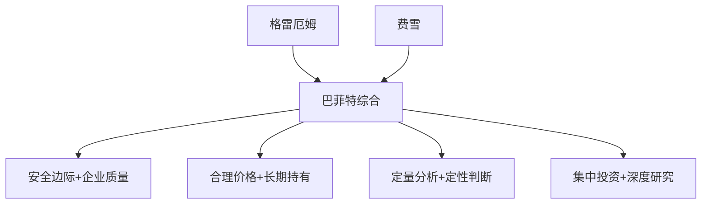
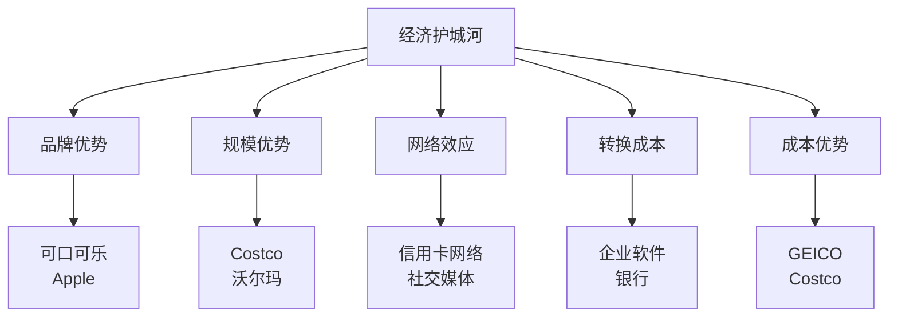

# 巴菲特投资演进：从格雷厄姆到费雪

## 概述

沃伦·巴菲特（Warren Buffett, 1930-）被誉为"奥马哈的先知"和"股神"，是有史以来最成功的投资者之一。他的投资哲学经历了从纯粹的格雷厄姆式价值投资到融合费雪成长投资理念的演变过程，这一转变不仅成就了伯克希尔·哈撒韦的传奇，也为现代价值投资指明了方向。

**学习目标**：
1. 理解巴菲特投资哲学的演变历程
2. 掌握从"烟蒂股"到"优质企业"的转变逻辑
3. 学习巴菲特的选股标准和投资原则
4. 分析巴菲特经典投资案例的成功要素
5. 理解查理·芒格对巴菲特的影响

**为什么重要**：巴菲特的投资演进代表了价值投资理论的成熟和发展。理解这一演变过程，能帮助投资者建立更完善的投资框架，在实践中平衡价格与质量，在不同市场环境中做出更明智的决策。


## 投资哲学的三个阶段

### 阶段一：格雷厄姆的学生（1950-1969）

**时期特征**：
- 严格遵循格雷厄姆的"烟蒂股"策略
- 寻找价格远低于内在价值的股票
- 高度分散投资
- 短期持有，获利后卖出

**核心策略**：
1. 寻找股价低于净流动资产价值（NCAV）的公司
2. 买入后等待价格回归
3. 达到目标价格后卖出
4. 不关心企业长期质量

**代表性投资**：
- Sanborn Map Company（1958-1960）
- Dempster Mill Manufacturing（1961-1963）
- 各种"烟蒂股"组合

**业绩表现**：
- 巴菲特合伙公司（1957-1969）
- 年化回报率：29.5%
- 同期道琼斯指数：7.4%
- 超额回报：22.1%/年
- 13年中12年跑赢市场

### 阶段二：转型期（1970-1980）

**转变契机**：
1. 市场效率提高，"烟蒂股"越来越少
2. 资金规模扩大，需要更大的投资标的
3. 查理·芒格的影响
4. See's Candies的成功经验

**新的认识**：
> "以合理的价格买入优秀的公司，远胜于以优秀的价格买入平庸的公司。" —— 查理·芒格对巴菲特的影响

**关键转变**：
- 从关注"价格"到关注"价值"
- 从短期套利到长期持有
- 从分散投资到集中投资
- 从定量分析到定性+定量

**标志性投资**：
- See's Candies（1972）
- Washington Post（1973）
- GEICO（1976）

### 阶段三：成熟期（1980至今）

**投资哲学成熟**：
1. 寻找具有持久竞争优势的企业
2. 以合理价格买入优质企业
3. 长期持有，让复利发挥作用
4. 集中投资于最了解的企业

**核心原则**：
- 护城河（Economic Moat）
- 管理层质量
- 可理解的商业模式
- 合理的价格
- 长期持有

**代表性投资**：
- Coca-Cola（1988）
- American Express（1990s）
- Wells Fargo（1990）
- Apple（2016）

## 从格雷厄姆到费雪的转变

### 格雷厄姆的影响

**核心教导**：
1. **安全边际原则**
   - 以远低于内在价值的价格买入
   - 为不确定性留出缓冲
   - 这一原则巴菲特终身坚持

2. **市场先生寓言**
   - 利用市场情绪波动
   - 不被市场左右
   - 保持独立思考

3. **投资vs投机**
   - 基于深入分析
   - 关注本金安全
   - 获得适当回报

**格雷厄姆方法的局限**：
1. 过于关注价格，忽视质量
2. 短期持有，错失长期复利
3. 高度分散，稀释超额回报
4. 适合小资金，难以规模化

### 费雪的影响

**菲利普·费雪的核心思想**：

1. **Scuttlebutt调研法**
   - 与客户、供应商、竞争对手交谈
   - 深入了解企业和行业
   - 超越财务报表的分析

2. **15个选股要点**
   - 产品市场潜力
   - 管理层决心
   - 研发能力
   - 销售组织
   - 利润率
   - 成本控制
   - 劳资关系
   - 管理层深度
   - 财务分析
   - 等等...

3. **集中投资**
   - 深入研究少数公司
   - 重仓持有最佳机会
   - 长期持有优质企业

**费雪方法的优势**：
- 关注企业质量和成长性
- 长期持有享受复利
- 集中投资提高回报
- 适合大资金运作

### 巴菲特的综合创新



**巴菲特的创新**：
1. 保留格雷厄姆的安全边际原则
2. 采纳费雪的质量和成长理念
3. 强调"护城河"概念
4. 重视管理层诚信和能力
5. 长期持有优质企业
6. 集中投资于最佳机会

## 经典投资案例分析

### 案例1：Sanborn Map Company（1958-1960）

**背景**：
- 地图制作公司
- 持有大量证券投资组合
- 股价：$45
- 证券投资价值：$65/股
- 地图业务价值：被忽视

**投资逻辑**（纯格雷厄姆式）：
- 股价低于投资组合价值
- 安全边际：31%
- 地图业务免费获得
- 典型的"烟蒂股"

**投资过程**：
- 1958年开始买入
- 最终持股24%，成为最大股东
- 推动公司分拆证券投资组合
- 1960年退出

**投资结果**：
- 持有期回报：50%+
- 年化回报：约20%

**教训**：
- 格雷厄姆方法在当时有效
- 但需要积极参与公司治理
- 短期套利，未享受长期复利

### 案例2：American Express（1964）

**背景**：
- 1963年"色拉油丑闻"
- 子公司仓储业务欺诈
- 潜在损失$5800万
- 股价从$65跌至$35
- 市场恐慌性抛售

**巴菲特的调研**：
- 亲自走访餐厅和商店
- 发现人们仍在使用美国运通卡
- 品牌价值未受损
- 核心业务（信用卡、旅行支票）完好

**投资逻辑**（开始转变）：
- 区分暂时困难和永久损害
- 品牌价值是重要资产
- 财务损失可控
- 内在价值：$65/股
- 买入价格：$35-40
- 安全边际：40%+

**投资过程**：
- 1964年投入$1300万（占基金40%）
- 罕见的集中投资
- 长期持有

**投资结果**：
- 1967年涨至$180
- 3年回报：350%+
- 后续继续持有多年

**关键转变**：
- 开始重视品牌价值
- 关注企业质量而非仅仅价格
- 愿意集中投资优质企业
- 长期持有而非短期套利

### 案例3：See's Candies（1972）

**背景**：
- 加州糖果连锁店
- 要价：$3000万
- 账面价值：$800万
- 年利润：$200万（税前）

**格雷厄姆视角**：
- 价格是账面价值的3.75倍
- 不符合格雷厄姆标准
- 应该拒绝

**巴菲特和芒格的分析**：
1. **品牌价值**
   - 加州人圣诞节必买See's
   - 强大的品牌忠诚度
   - 定价权

2. **商业模式**
   - 季节性销售（圣诞节）
   - 预收现金
   - 低资本需求

3. **增长潜力**
   - 提价空间
   - 门店扩张
   - 产品线延伸

**投资决策**：
- 最终以$2500万买入
- 虽然高于账面价值
- 但合理反映了品牌价值

**投资结果**（1972-2020）：
- 累计税前利润：$20亿+
- 累计分红：$19亿+
- 投资回报：80倍+
- 几乎不需要额外资本投入

**关键教训**：
> "See's教会了我们，优质企业的价值远超其有形资产。" —— 沃伦·巴菲特

- 品牌和商业模式比账面价值更重要
- 定价权是巨大的竞争优势
- 低资本需求的企业能产生巨大现金流
- 这次投资彻底改变了巴菲特的投资哲学

### 案例4：Washington Post（1973）

**背景**：
- 1973-1974年熊市
- 华盛顿邮报股价暴跌
- 市值：$8000万
- 巴菲特估算内在价值：$4-5亿

**投资逻辑**：
1. **特许经营权**
   - 华盛顿地区主导地位
   - 高进入壁垒
   - 类似垄断地位

2. **管理层**
   - 凯瑟琳·格雷厄姆领导
   - 诚信、能干
   - 股东导向

3. **估值**
   - 市值仅为内在价值的20%
   - 巨大的安全边际：80%

**投资过程**：
- 1973年买入$1060万
- 占基金资产的25%
- 长期持有

**投资结果**（1973-2013）：
- 40年回报：100倍+
- 年化回报：12%+
- 2013年以$11亿卖出

**关键要素**：
- 特许经营权（护城河）
- 优秀管理层
- 巨大安全边际
- 长期持有

### 案例5：Coca-Cola（1988-1989）

**背景**：
- 1987年股市崩盘后
- 可口可乐股价回调
- 巴菲特认为机会来临

**投资逻辑**：
1. **全球品牌**
   - 世界上最有价值的品牌之一
   - 无处不在的分销网络
   - 强大的品牌忠诚度

2. **经济护城河**
   - 品牌护城河
   - 规模优势
   - 分销网络
   - 几乎不可复制

3. **增长前景**
   - 国际市场扩张
   - 新兴市场潜力巨大
   - 人均消费量提升空间

4. **财务表现**
   - ROE：30%+
   - 利润率：15%+
   - 稳定增长

5. **管理层**
   - Roberto Goizueta CEO
   - 股东导向
   - 战略清晰

**估值分析**：
- 1988年EPS：$0.36
- 预期增长率：15%
- 合理估值：$48-60
- 买入价格：$10.96（拆股调整后）
- 安全边际：77-82%

**投资过程**：
- 1988-1989年投入$13亿
- 买入4亿股（占总股本7%）
- 成为最大单一投资
- 长期持有至今（部分）

**投资结果**：
- 持有至今（部分）
- 回报：50倍+
- 年化回报：12%+
- 累计分红：数十亿美元

**巴菲特的评价**：
> "如果你给我1000亿美元，让我击败可口可乐，我会把钱还给你，说这事做不成。"

**关键教训**：
- 品牌是最强大的护城河
- 全球化带来巨大增长空间
- 简单易懂的商业模式
- 长期持有优质企业的复利效应

### 案例6：Apple（2016至今）

**背景**：
- 2016年开始大量买入
- 当时市场担心iPhone销量见顶
- 股价相对低迷

**投资逻辑**：
1. **生态系统**
   - iOS生态系统
   - 高转换成本
   - 服务业务增长

2. **品牌忠诚度**
   - 极高的客户满意度
   - 品牌溢价能力
   - 重复购买率高

3. **财务表现**
   - 巨额现金流
   - 高ROE
   - 股票回购

4. **估值合理**
   - 市盈率：10-15倍
   - 相对科技股便宜
   - 安全边际充足

**投资过程**：
- 2016年开始买入
- 持续加仓至2018年
- 最高持仓：$1200亿+
- 成为伯克希尔最大持仓

**投资结果**（2016-2024）：
- 回报：5倍+
- 年化回报：25%+
- 成为最成功的投资之一

**意义**：
- 证明巴菲特能适应时代变化
- 科技公司也可以有护城河
- 生态系统是新型护城河
- 90岁仍在学习和进化

## 巴菲特的投资原则

### 1. 企业选择标准

**"护城河"概念**：


**必备特征**：
1. 简单易懂的商业模式
2. 持久的竞争优势（护城河）
3. 优秀的管理层
4. 良好的长期前景
5. 合理的价格

### 2. 管理层评估

**三个关键问题**：
1. 理性吗？（资本配置能力）
2. 坦诚吗？（对股东诚实）
3. 能抵制惯性吗？（不盲目跟风）

**评估标准**：
- 资本配置记录
- 股东沟通质量
- 薪酬结构合理性
- 长期战略眼光

### 3. 估值方法

**核心公式**：
```
内在价值 = 未来现金流的折现值
```

**实践原则**：
- 保守估算现金流
- 使用合理折现率
- 要求足够安全边际
- 宁可错过，不可做错

### 4. 投资组合管理

**集中投资**：
- 重仓最佳机会
- 前5大持仓占70%+
- 深度研究，高度确信

**长期持有**：
> "我们最喜欢的持有期是永远。" —— 沃伦·巴菲特

**原因**：
- 避免频繁交易成本
- 享受复利效应
- 延迟税收
- 让优秀企业持续创造价值

## 查理·芒格的影响

### 芒格对巴菲特的改变

**核心影响**：
1. **质量重于价格**
   > "以合理的价格买入优秀的公司，远胜于以优秀的价格买入平庸的公司。"

2. **多学科思维模型**
   - 心理学
   - 经济学
   - 数学
   - 物理学
   - 生物学

3. **逆向思维**
   - 避免愚蠢比追求聪明更重要
   - 研究失败案例
   - 识别认知偏差

4. **耐心等待**
   - 不需要频繁行动
   - 等待"肥球"
   - 保持理性

### 巴菲特-芒格组合的威力

**互补优势**：
- 巴菲特：乐观、行动力强
- 芒格：谨慎、理性分析

**决策流程**：
1. 巴菲特提出想法
2. 芒格指出问题
3. 共同完善决策
4. 达成一致后执行

**成功要素**：
- 相互信任
- 互补思维
- 共同价值观
- 长期合作

## 投资哲学的核心要义

### 1. 能力圈原则

**定义**：
- 只投资于理解的企业
- 承认知识边界
- 不懂不投

**实践**：
- 避开复杂金融衍生品
- 避开不理解的科技（早期）
- 专注于简单商业模式

**扩展能力圈**：
- 持续学习
- 深入研究
- 谨慎扩展

### 2. 安全边际

**永恒原则**：
- 格雷厄姆的核心教导
- 巴菲特终身坚持
- 为不确定性留出空间

**应用**：
- 保守估值
- 要求折扣
- 分散风险

### 3. 长期主义

**复利的力量**：
```
$1投资，年化20%回报：
10年：$6.19
20年：$38.34
30年：$237.38
40年：$1,469.77
50年：$9,100.44
```

**实践**：
- 长期持有优质企业
- 不被短期波动影响
- 让时间成为朋友

### 4. 理性决策

**避免情绪化**：
- 市场恐慌时贪婪
- 市场贪婪时恐惧
- 独立思考
- 不随波逐流

## 对现代投资者的启示

### 1. 投资哲学的演进

**关键教训**：
- 没有一成不变的方法
- 需要与时俱进
- 保留核心原则
- 调整具体策略

### 2. 质量与价格的平衡

**现代应用**：
- 不要过度追求便宜
- 优质企业值得合理溢价
- 长期回报更重要
- 避免价值陷阱

### 3. 护城河的重要性

**识别护城河**：
- 品牌优势
- 规模效应
- 网络效应
- 转换成本
- 成本优势

### 4. 长期持有的价值

**复利效应**：
- 时间是优质企业的朋友
- 避免频繁交易
- 税收优势
- 降低错误概率

### 5. 持续学习

**巴菲特的榜样**：
- 90多岁仍在学习
- 投资Apple证明适应能力
- 阅读和思考
- 保持好奇心

## 延伸阅读

### 必读书籍

1. **《巴菲特致股东的信》** - 沃伦·巴菲特
   - 投资智慧的宝库
   - 每年必读

2. **《滚雪球》** - 艾丽斯·施罗德
   - 巴菲特传记
   - 详细记录投资演进

3. **《巴菲特之道》** - 罗伯特·哈格斯特朗
   - 系统解析投资方法

4. **《穷查理宝典》** - 查理·芒格
   - 芒格的智慧
   - 多学科思维

5. **《巴菲特的护城河》** - 帕特·多尔西
   - 深入解析护城河概念

### 推荐资源

1. **Berkshire Hathaway年报** - 必读
2. **CNBC巴菲特访谈** - 了解最新思考
3. **伯克希尔股东大会** - 年度盛会
4. **《财富》杂志巴菲特专栏** - 定期文章

## 参考文献

1. Buffett, W. (1957-2024). *Berkshire Hathaway Shareholder Letters*.
2. Schroeder, A. (2008). *The Snowball: Warren Buffett and the Business of Life*.
3. Hagstrom, R. (2013). *The Warren Buffett Way* (3rd Edition).
4. Cunningham, L. (2013). *The Essays of Warren Buffett: Lessons for Corporate America*.
5. Lowenstein, R. (1995). *Buffett: The Making of an American Capitalist*.
6. Munger, C. (2005). *Poor Charlie's Almanack*.
7. Dorsey, P. (2008). *The Little Book That Builds Wealth: The Knockout Formula for Finding Great Investments*.
8. Graham, B. (1949). *The Intelligent Investor*.
9. Fisher, P. (1958). *Common Stocks and Uncommon Profits*.
10. Greenwald, B., et al. (2001). *Value Investing: From Graham to Buffett and Beyond*.

## 关键要点

1. **投资哲学演进**：从格雷厄姆的"烟蒂股"到费雪的"优质企业"
2. **核心转变**：从关注价格到关注价值，从短期到长期
3. **关键影响**：查理·芒格推动了巴菲特的转变
4. **成功要素**：护城河、优秀管理层、合理价格、长期持有
5. **永恒原则**：安全边际、能力圈、理性决策、持续学习

> "在别人贪婪时恐惧，在别人恐惧时贪婪。" —— 沃伦·巴菲特

> "我们的工作是找到少数几家伟大的公司，然后坐下来不动。" —— 查理·芒格

巴菲特的投资演进告诉我们，成功的投资者需要保持开放的心态，不断学习和进化，同时坚守核心原则。从格雷厄姆到费雪，从烟蒂股到优质企业，巴菲特的转变不仅成就了他自己，也为全球投资者指明了方向。


## 深度分析

### 核心机制解析

理解本主题需要从多个维度进行系统性分析。以下从理论基础、实践应用和历史验证三个层面展开深度探讨。

**理论基础层面**：本主题的核心逻辑建立在经济学和金融学的基本原理之上。通过对基础理论的深入理解，投资者能够建立起稳固的分析框架，避免被市场短期噪音所干扰。

**实践应用层面**：理论必须与实践相结合才能产生价值。在实际投资决策中，需要将抽象的概念转化为具体的分析工具和决策标准。

**历史验证层面**：金融市场有着丰富的历史记录，通过研究历史案例，我们可以验证理论的有效性，并从中提炼出具有普遍意义的规律。

### 关键影响因素

影响本主题的关键因素可以从以下几个维度进行分析：

1. **宏观经济环境**：利率水平、通货膨胀率、经济增长速度等宏观变量对本主题有着深远影响。在不同的宏观经济周期中，相关指标的表现会呈现出显著差异。

2. **市场结构因素**：市场参与者的构成、信息传播机制、流动性状况等市场结构因素决定了价格发现的效率和准确性。

3. **政策监管环境**：政府政策、监管框架的变化会直接影响相关市场的运作规则和参与者行为。

4. **技术创新驱动**：技术进步不断改变着金融市场的运作方式，从算法交易到区块链技术，每一次技术革新都带来新的机遇和挑战。

5. **全球化与地缘政治**：在全球化背景下，各国市场之间的联动性日益增强，地缘政治风险的影响也越来越不可忽视。

### 量化分析框架

为了更精确地分析和评估，可以采用以下量化框架：

| 分析维度 | 关键指标 | 参考基准 | 分析方法 |
|---------|---------|---------|---------|
| 规模评估 | 绝对值与相对值 | 历史均值 | 趋势分析 |
| 质量评估 | 稳定性指标 | 行业对标 | 横向比较 |
| 风险评估 | 波动率指标 | 风险阈值 | 情景分析 |
| 价值评估 | 估值倍数 | 历史区间 | 回归分析 |

通过系统性地应用上述框架，投资者可以对目标进行全面、客观的评估，从而做出更加理性的投资决策。


## 高级分析与前沿研究

### 学术研究进展

近年来，学术界对本领域的研究取得了重要进展。以下是几个值得关注的研究方向：

**行为金融学视角**：传统金融理论假设市场参与者是完全理性的，但行为金融学的研究表明，认知偏差和情绪因素在投资决策中扮演着重要角色。诺贝尔经济学奖得主丹尼尔·卡尼曼（Daniel Kahneman）和理查德·塞勒（Richard Thaler）的研究为我们理解市场非理性行为提供了重要框架。

**因子投资研究**：尤金·法玛（Eugene Fama）和肯尼斯·弗伦奇（Kenneth French）的三因子模型，以及后续发展的五因子模型，为系统性地解释股票收益差异提供了理论基础。这些研究表明，市值、账面市值比、盈利能力和投资模式等因子能够解释大部分股票收益的横截面差异。

**市场微观结构研究**：对市场流动性、价格发现机制和交易成本的深入研究，帮助我们更好地理解市场的运作机制，并为优化交易策略提供指导。

### 实战案例深度解析

**案例一：长期价值创造的典范**

以沃伦·巴菲特（Warren Buffett）的伯克希尔·哈撒韦（Berkshire Hathaway）为例，其长达数十年的卓越投资业绩证明了价值投资理念的有效性。从1965年至今，伯克希尔的账面价值年均增长率约为19.8%，远超同期标普500指数的约10.2%年均回报。

巴菲特的成功秘诀在于：
- 专注于具有持久竞争优势的优质企业
- 以合理价格买入，而非追求最低价格
- 长期持有，让复利效应充分发挥
- 保持充足的安全边际，控制下行风险

**案例二：危机中的机遇识别**

2008年金融危机期间，大多数投资者恐慌性抛售，但少数具有前瞻性的投资者却在危机中发现了历史性的投资机会。约翰·保尔森（John Paulson）通过做空次级抵押贷款相关证券，在危机中获得了约150亿美元的利润，成为金融史上最成功的单笔交易之一。

这个案例告诉我们：
- 深入的基本面研究能够发现市场定价错误
- 逆向思维往往能够发现被市场忽视的机会
- 风险管理和仓位控制是成功的关键

### 跨市场比较分析

不同市场在结构、监管、投资者构成等方面存在显著差异，这些差异对投资策略的选择有重要影响：

**美国市场特征**：
- 机构投资者主导，市场效率较高
- 信息披露制度完善，分析师覆盖广泛
- 衍生品市场发达，对冲工具丰富
- 长期牛市历史，但也经历过多次重大调整

**中国市场特征**：
- 散户投资者比例较高，市场波动性较大
- 政策因素影响显著，需要密切关注监管动向
- 新兴行业发展迅速，成长投资机会丰富
- A股、港股、美股中概股形成多层次市场体系

**欧洲市场特征**：
- 价值股比例较高，估值相对保守
- 受地缘政治和欧元区政策影响较大
- 部分行业（如奢侈品、工业）具有全球竞争优势
- ESG投资理念推广较为领先

