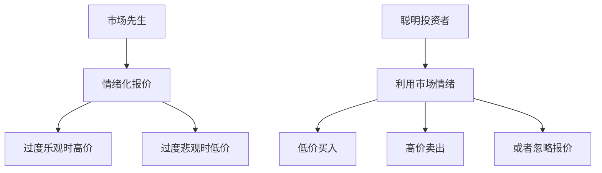
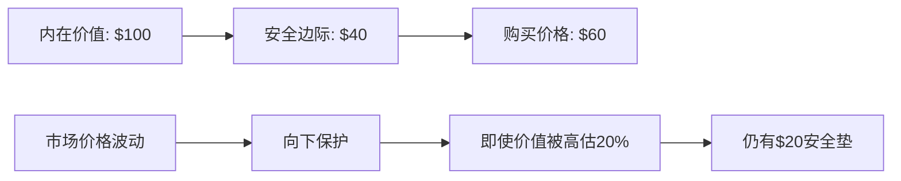
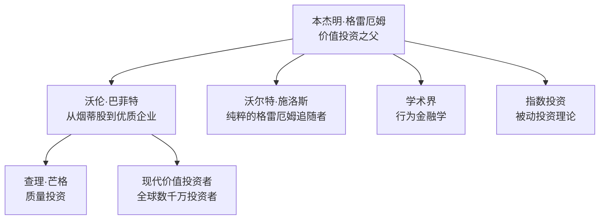

# 格雷厄姆价值投资原则

## 概述

本杰明·格雷厄姆（Benjamin Graham, 1894-1976）被誉为"价值投资之父"和"华尔街教父"，他的投资哲学奠定了现代证券分析的基础。格雷厄姆通过其经典著作《证券分析》（1934）和《聪明的投资者》（1949）系统阐述了价值投资理论，影响了包括沃伦·巴菲特在内的几代投资大师。


**学习目标**：
1. 理解格雷厄姆价值投资的核心理念和哲学基础
2. 掌握安全边际概念及其在投资决策中的应用
3. 区分防御型投资者和进取型投资者的策略差异
4. 学习格雷厄姆的选股标准和投资原则
5. 了解格雷厄姆思想在现代市场中的应用和演进

**为什么重要**：格雷厄姆的价值投资理论不仅是投资学的基石，更是在市场波动中保护资本、获取长期回报的有效方法。理解格雷厄姆原则能帮助投资者建立理性的投资框架，避免投机陷阱，在不确定性中做出明智决策。

## 核心概念

### 1. 价值投资的哲学基础

格雷厄姆价值投资的核心可以概括为三个基本原则：

**1.1 股票是企业所有权的一部分**

格雷厄姆强调，购买股票不是购买一张可以交易的纸片，而是购买企业的部分所有权。这意味着：
- 投资者应该像企业主一样思考
- 关注企业的内在价值而非股价波动
- 长期持有优质企业的股权

**1.2 市场先生的寓言**

格雷厄姆创造了"市场先生"（Mr. Market）这个经典比喻来描述市场行为：



市场先生每天都会给你报价，但他的情绪极不稳定：
- 有时过度乐观，给出高价
- 有时过度悲观，给出低价
- 聪明的投资者应该利用市场先生的情绪波动，而不是被其左右

**1.3 安全边际原则**

这是格雷厄姆投资哲学的核心，我们将在后续章节详细讨论。简而言之，安全边际是指以远低于内在价值的价格购买资产，为不确定性和判断错误留出缓冲空间。


### 2. 《聪明的投资者》核心思想

格雷厄姆在《聪明的投资者》中系统阐述了价值投资的实践方法，该书被巴菲特称为"有史以来最伟大的投资著作"。

**2.1 投资与投机的区别**

格雷厄姆明确区分了投资和投机：

**投资**是指：
- 经过深入分析
- 承诺本金安全
- 获得适当回报

**投机**则是：
- 缺乏深入分析
- 追求快速获利
- 承担过高风险

> "投资操作是基于深入分析，承诺本金安全并获得适当回报的操作。不符合这些要求的操作就是投机。" —— 本杰明·格雷厄姆

**2.2 防御型投资者 vs 进取型投资者**

格雷厄姆将投资者分为两类，并为每类提供了不同的策略：

| 特征 | 防御型投资者 | 进取型投资者 |
|------|------------|------------|
| **目标** | 避免严重错误和损失 | 获得超越平均的回报 |
| **时间投入** | 最小化时间和精力 | 愿意投入大量时间研究 |
| **风险承受** | 低风险偏好 | 中等风险偏好 |
| **策略复杂度** | 简单、被动 | 复杂、主动 |
| **预期回报** | 市场平均回报 | 超越市场回报 |

**防御型投资者策略**：
1. 股债配置：50%股票 + 50%债券（可在25%-75%范围内调整）
2. 股票选择标准：
   - 大型、知名、财务稳健的公司
   - 长期持续分红记录
   - 市盈率不超过25倍
   - 市净率不超过1.5倍
3. 分散投资：至少10-30只股票
4. 定期再平衡

**进取型投资者策略**：
1. 寻找被低估的股票（"烟蒂股"）
2. 特殊情况投资（并购、重组、破产清算）
3. 成长股投资（但要谨慎）
4. 深入的基本面分析
5. 逆向投资思维


### 3. 安全边际：价值投资的基石

安全边际是格雷厄姆投资哲学中最重要的概念，它为投资提供了保护层。

**3.1 安全边际的定义**

安全边际是指资产的内在价值与购买价格之间的差额。这个差额越大，投资的安全性就越高。



**3.2 安全边际的作用**

1. **补偿估值错误**：即使对内在价值的估计有误，安全边际也能提供缓冲
2. **应对不利变化**：企业经营环境恶化时，安全边际能减少损失
3. **心理安慰**：知道有安全边际，投资者能更从容面对市场波动
4. **提高长期回报**：低价买入自然带来更高的潜在回报

**3.3 如何确定安全边际**

格雷厄姆建议的安全边际标准：
- 普通股票：至少33%的折扣（以$0.67买入价值$1的资产）
- 高质量股票：至少20%的折扣
- 债券和优先股：更严格的安全边际要求

**3.4 安全边际的实践应用**

案例：假设一家公司的内在价值分析如下：
- 保守估值：每股$80
- 中性估值：每股$100
- 乐观估值：每股$120

应用安全边际原则：
- 以$60买入（相对中性估值40%折扣）
- 即使保守估值正确，仍有33%上涨空间
- 如果乐观估值实现，有100%上涨空间
- 下行风险有限，上行潜力巨大


## 格雷厄姆的选股标准

### 1. 防御型投资者的选股标准

格雷厄姆为防御型投资者制定了7条明确的选股标准：

**标准1：充足的企业规模**
- 工业企业：年销售额至少1亿美元
- 公用事业：总资产至少5000万美元
- 理由：大公司更稳定，抗风险能力强

**标准2：足够强的财务状况**
- 流动比率至少2:1（流动资产/流动负债）
- 长期债务不超过营运资本
- 理由：确保公司有足够的财务缓冲

**标准3：盈利稳定性**
- 过去10年每年都有盈利
- 理由：证明企业具有持续盈利能力

**标准4：股息记录**
- 至少连续20年支付股息
- 理由：显示管理层对股东的承诺和企业的稳定性

**标准5：盈利增长**
- 过去10年每股收益增长至少1/3
- 使用3年平均值比较
- 理由：确保企业在成长而非衰退

**标准6：适度的市盈率**
- 当前市盈率不超过15倍
- 或过去3年平均收益的15倍
- 理由：避免为增长支付过高价格

**标准7：适度的市净率**
- 股价不超过账面价值的1.5倍
- 或市盈率×市净率 ≤ 22.5
- 理由：确保有足够的资产支撑

### 2. 进取型投资者的选股策略

**2.1 "烟蒂股"投资法**

格雷厄姆最著名的策略是寻找"烟蒂股"（Cigar Butt）：

特征：
- 股价低于净流动资产价值（NCAV）
- NCAV = 流动资产 - 总负债
- 买入价格 < 2/3 × NCAV

逻辑：
- 即使企业停止运营，清算价值也高于股价
- 提供了极大的安全边际
- 分散投资30只以上，整体回报可观

**2.2 特殊情况投资**

格雷厄姆也关注特殊情况：
- 并购套利
- 破产重组
- 资产剥离
- 清算价值投资

**2.3 成长股投资的谨慎态度**

格雷厄姆对成长股持谨慎态度：
- 成长预期往往过于乐观
- 高估值留下的安全边际不足
- 建议：只在价格合理时买入成长股


## 历史案例分析

### 案例1：格雷厄姆-纽曼公司的实践（1936-1956）

格雷厄姆管理的格雷厄姆-纽曼公司是其投资理论的实践验证。

**投资策略**：
- 主要投资"烟蒂股"
- 严格遵守安全边际原则
- 高度分散投资

**业绩表现**：
- 20年年化回报率：约17%
- 同期道琼斯指数：约12.2%
- 超额回报：约4.8%/年
- 无一年亏损

**经典案例：GEICO保险公司**
- 1948年投资GEICO
- 买入价格：每股$27
- 占基金资产的25%（罕见的集中投资）
- 1972年卖出时：涨幅超过50倍
- 这笔投资后来被巴菲特继承并发扬光大

### 案例2：1929-1932年大萧条期间的投资

格雷厄姆在大萧条中的经历塑造了他的投资哲学。

**损失经历**：
- 1929年崩盘前，格雷厄姆的基金价值约250万美元
- 1932年底，缩水至37.5万美元
- 损失约85%

**教训与反思**：
1. 即使是专业投资者也会犯错
2. 安全边际的重要性
3. 分散投资的必要性
4. 避免使用杠杆
5. 市场情绪的极端性

**复苏与成功**：
- 1933-1936年，基金价值恢复并超越1929年高点
- 这段经历促使格雷厄姆写作《证券分析》
- 系统总结了价值投资方法论

### 案例3：现代应用 - 2008年金融危机

2008年金融危机为格雷厄姆原则提供了现代验证。

**危机前的警示信号**（格雷厄姆视角）：
- 金融股市盈率过高（>20倍）
- 杠杆率极高（违反财务稳健原则）
- 复杂金融产品缺乏透明度
- 市场普遍乐观情绪

**危机中的机会**：
- 2009年3月，许多优质公司跌破账面价值
- 例如：富国银行市净率降至0.8倍
- 符合格雷厄姆的选股标准

**遵循格雷厄姆原则的投资者**：
- 在危机前保持谨慎（高估值时减仓）
- 在危机中大胆买入（安全边际充足）
- 2009-2019年获得丰厚回报


## 现代应用与演进

### 1. 格雷厄姆原则在现代市场的适用性

**仍然有效的原则**：
1. **安全边际**：永恒的投资智慧
2. **市场先生寓言**：市场情绪化本质未变
3. **投资vs投机的区分**：仍然关键
4. **财务分析的重要性**：基本面分析的基础

**需要调整的方面**：
1. **"烟蒂股"策略**：
   - 现代市场效率提高，纯粹的烟蒂股越来越少
   - 需要更深入的分析，不能仅依赖简单指标
   - 可能需要更长的持有期

2. **估值标准**：
   - 市盈率15倍的标准在低利率环境下可能过于严格
   - 需要考虑行业特性和增长前景
   - 无形资产（品牌、技术）的价值更重要

3. **企业质量**：
   - 现代投资更强调企业质量
   - 护城河、竞争优势比单纯的低估值更重要
   - 这是巴菲特对格雷厄姆思想的重要发展

### 2. 格雷厄姆对后世的影响

**直接学生**：
- 沃伦·巴菲特：最成功的格雷厄姆学生
- 查理·芒格：虽非直接学生，但深受影响
- 沃尔特·施洛斯：严格遵循格雷厄姆方法
- 欧文·卡恩：格雷厄姆-纽曼公司的合伙人

**思想传承**：


**对投资行业的影响**：
1. 奠定了证券分析的基础
2. 推动了CFA（特许金融分析师）体系的建立
3. 影响了现代投资组合理论
4. 启发了行为金融学的发展

### 3. 格雷厄姆原则的现代实践指南

**对个人投资者的建议**：

**防御型投资者**：
1. 采用指数基金投资（符合格雷厄姆的分散化理念）
2. 保持股债平衡（50/50或根据年龄调整）
3. 定期再平衡
4. 避免追逐热门股票
5. 长期持有，忽略短期波动

**进取型投资者**：
1. 深入学习财务分析
2. 寻找被低估的优质公司
3. 关注安全边际
4. 逆向投资思维
5. 耐心等待好机会
6. 分散投资以降低个股风险

**现代工具的应用**：
- 使用筛选器寻找符合格雷厄姆标准的股票
- 利用财务数据库进行深入分析
- 关注价值投资社区的研究
- 学习现代价值投资者的方法


## 常见误区

### 误区1：格雷厄姆的方法已经过时

**错误观点**：现代市场效率更高，格雷厄姆的"烟蒂股"策略不再有效。

**正确理解**：
- 格雷厄姆的核心原则（安全边际、理性分析）永不过时
- 具体策略需要与时俱进
- 市场仍然会出现非理性，创造投资机会
- 2008年、2020年都证明了价值投资的有效性

### 误区2：只关注低市盈率股票

**错误观点**：格雷厄姆投资就是买最便宜的股票。

**正确理解**：
- 格雷厄姆强调的是"价值"而非"价格"
- 低价股可能是"价值陷阱"
- 需要综合考虑企业质量、财务状况、增长前景
- 安全边际是相对于内在价值，而非绝对低价

### 误区3：忽视企业质量

**错误观点**：只要价格够低，什么股票都可以买。

**正确理解**：
- 格雷厄姆也强调企业的财务稳健性
- 防御型投资者标准包含了质量要求
- 现代价值投资更强调质量
- "以合理价格买入优质企业"优于"以低价买入平庸企业"

### 误区4：完全机械地应用标准

**错误观点**：严格按照格雷厄姆的数字标准选股就能成功。

**正确理解**：
- 标准需要根据时代和市场环境调整
- 需要理解标准背后的逻辑
- 定性分析与定量分析同样重要
- 投资是艺术与科学的结合

### 误区5：忽视心理因素

**错误观点**：只要分析正确，就能成功投资。

**正确理解**：
- 格雷厄姆非常重视投资心理
- 市场先生寓言就是关于心理的
- 需要控制情绪，保持理性
- 耐心和纪律至关重要

## 实战应用

### 1. 构建格雷厄姆式投资组合

**步骤1：确定投资者类型**
- 评估自己的时间、能力、风险承受力
- 选择防御型或进取型策略

**步骤2：设定选股标准**

防御型投资者筛选标准（现代调整版）：
```
1. 市值 > 20亿美元
2. 流动比率 > 1.5
3. 长期债务 < 净流动资产
4. 连续10年盈利
5. 连续10年分红
6. 10年EPS增长 > 30%
7. 市盈率 < 20（或行业平均）
8. 市净率 < 2.5
9. 市盈率 × 市净率 < 40
```

**步骤3：分散投资**
- 至少10-30只股票
- 跨行业分散
- 避免过度集中

**步骤4：定期审查**
- 每季度审查持仓
- 卖出不再符合标准的股票
- 买入新的符合标准的股票

**步骤5：保持纪律**
- 不追逐热门股票
- 不频繁交易
- 忽略短期波动
- 坚持长期投资

### 2. 实际案例：应用格雷厄姆标准

**案例：2020年3月COVID-19恐慌中的机会**

市场情况：
- 标普500指数下跌34%
- 许多优质公司被错杀
- 市场极度恐慌

应用格雷厄姆原则：

**筛选结果示例**（2020年3月）：
1. **微软（MSFT）**
   - 市盈率：从30倍降至23倍
   - 财务稳健，现金充裕
   - 云业务增长强劲
   - 安全边际：约30%

2. **强生（JNJ）**
   - 市盈率：降至15倍
   - 连续57年提高股息
   - 多元化业务
   - 安全边际：约25%

3. **宝洁（PG）**
   - 市盈率：降至20倍
   - 必需消费品，抗周期
   - 稳定现金流
   - 安全边际：约20%

**投资结果**（2020年3月-2021年3月）：
- 微软：+50%
- 强生：+25%
- 宝洁：+20%
- 标普500：+75%

**关键教训**：
- 市场恐慌创造机会
- 坚持安全边际原则
- 关注企业基本面
- 耐心等待合适价格


## 延伸阅读

### 必读书籍

1. **《聪明的投资者》（The Intelligent Investor）** - 本杰明·格雷厄姆
   - 价值投资的圣经
   - 建议阅读第4修订版（含杰森·茨威格评注）
   - 重点章节：第8章（市场先生）、第20章（安全边际）

2. **《证券分析》（Security Analysis）** - 本杰明·格雷厄姆 & 大卫·多德
   - 更学术和系统的价值投资理论
   - 适合进取型投资者深入学习
   - 第6版（2008）包含现代视角的评注

3. **《格雷厄姆-多德都市的超级投资者们》** - 沃伦·巴菲特
   - 巴菲特1984年在哥伦比亚大学的演讲
   - 用实证数据证明价值投资的有效性
   - 介绍了9位成功的格雷厄姆学生

4. **《巴菲特致股东的信》** - 沃伦·巴菲特
   - 格雷厄姆思想的现代应用
   - 从烟蒂股到优质企业的演进
   - 实践智慧的宝库

5. **《价值投资：从格雷厄姆到巴菲特》** - 布鲁斯·格林沃尔德
   - 系统梳理价值投资的发展
   - 现代视角的解读
   - 包含大量案例分析

### 推荐文章

1. "The Superinvestors of Graham-and-Doddsville" - Warren Buffett (1984)
2. "Benjamin Graham: The Father of Value Investing" - Investopedia
3. "The Evolution of Value Investing" - Columbia Business School
4. "Graham's Net-Net Strategy in Modern Markets" - Various academic papers

### 在线资源

1. **Columbia Business School** - 格雷厄姆曾任教的学校，提供价值投资课程
2. **Berkshire Hathaway年报** - 巴菲特对格雷厄姆思想的应用
3. **Value Investors Club** - 价值投资者社区
4. **Morningstar** - 提供基于价值投资理念的分析工具

### 相关课程

1. **哥伦比亚大学：价值投资课程**
   - 格雷厄姆创立的课程
   - 现由布鲁斯·格林沃尔德教授

2. **CFA课程**
   - 包含大量格雷厄姆的投资理论
   - 系统的财务分析训练

## 参考文献

1. Graham, B. (1949). *The Intelligent Investor*. Harper & Brothers.
2. Graham, B., & Dodd, D. (1934). *Security Analysis*. McGraw-Hill.
3. Buffett, W. (1984). "The Superinvestors of Graham-and-Doddsville". *Hermes, Columbia Business School Magazine*.
4. Greenwald, B., Kahn, J., Sonkin, P., & van Biema, M. (2001). *Value Investing: From Graham to Buffett and Beyond*. Wiley.
5. Klarman, S. (1991). *Margin of Safety: Risk-Averse Value Investing Strategies for the Thoughtful Investor*. HarperCollins.
6. Schloss, W. (1994). "Benjamin Graham: The Memoirs of the Dean of Wall Street". *Financial Analysts Journal*.
7. Lowe, J. (1997). *Benjamin Graham on Value Investing: Lessons from the Dean of Wall Street*. Penguin Books.
8. Zweig, J. (2003). Commentary in *The Intelligent Investor* (Revised Edition). HarperCollins.
9. Cunningham, L. (2013). *The Essays of Warren Buffett: Lessons for Corporate America*. Carolina Academic Press.
10. Hagstrom, R. (2013). *The Warren Buffett Way* (3rd Edition). Wiley.
11. Lowenstein, R. (1995). *Buffett: The Making of an American Capitalist*. Random House.
12. Schroeder, A. (2008). *The Snowball: Warren Buffett and the Business of Life*. Bantam.
13. Graham, B. (1996). *Benjamin Graham: The Memoirs of the Dean of Wall Street*. McGraw-Hill.
14. Kahn, I., & Milne, R. (1977). *Benjamin Graham: The Father of Financial Analysis*. Financial Analysts Research Foundation.
15. Oppenheimer, H. (1984). "A Test of Ben Graham's Stock Selection Criteria". *Financial Analysts Journal*, 40(5), 68-74.

## 关键要点总结

1. **价值投资三大支柱**：
   - 股票是企业所有权
   - 利用市场先生的情绪
   - 坚持安全边际原则

2. **投资者分类**：
   - 防御型：追求稳健，最小化时间投入
   - 进取型：追求超额回报，愿意深入研究

3. **安全边际**：
   - 价值投资的核心
   - 以远低于内在价值的价格买入
   - 为不确定性提供保护

4. **选股标准**：
   - 财务稳健
   - 盈利稳定
   - 合理估值
   - 安全边际

5. **现代应用**：
   - 核心原则永不过时
   - 具体标准需要调整
   - 更强调企业质量
   - 结合定性和定量分析

> "投资的秘诀不在于评估一个行业对社会的影响有多大，或者它的发展前景有多好，而在于一家公司有多好，尤其是与其股价相比有多好。" —— 本杰明·格雷厄姆

格雷厄姆的价值投资原则为投资者提供了一个理性、系统的投资框架。虽然市场环境在变化，但人性的贪婪和恐惧不变，因此格雷厄姆的智慧将继续指引着一代又一代的投资者。
