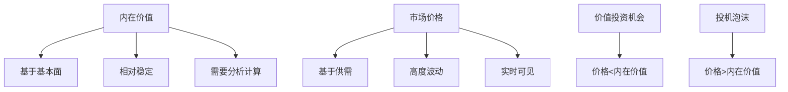

# 内在价值计算：价值投资的基石

## 概述

内在价值（Intrinsic Value）是价值投资理论的核心概念，指的是一项资产基于其基本面所具有的真实价值，独立于市场价格。格雷厄姆和巴菲特都强调，投资的本质是以低于内在价值的价格买入资产。

**学习目标**：
1. 深入理解内在价值的概念和哲学基础
2. 掌握多种内在价值计算方法
3. 学习如何评估计算结果的可靠性
4. 了解影响内在价值的关键因素
5. 通过实战案例掌握应用技巧

**为什么重要**：准确估算内在价值是价值投资成功的关键。只有知道资产的真实价值，才能判断市场价格是否合理，才能确定安全边际，才能做出理性的投资决策。

## 核心概念

### 1. 内在价值的定义

**格雷厄姆的定义**：
> "内在价值是一个难以捉摸的概念。一般来说，它是指一项事实（如资产、收益、股息、明确的前景）作为依据的价值，有别于受到人为操纵和心理因素干扰的市场价格。"

**巴菲特的定义**：
> "内在价值是一家企业在其余下的寿命中可以产生的现金流的折现值。"

**关键特征**：
1. 基于事实和分析，而非市场情绪
2. 相对稳定，不随市场价格剧烈波动
3. 需要判断和估算，存在不确定性
4. 随时间和企业基本面变化而变化

### 2. 内在价值 vs 市场价格



**两者关系**：
- 短期：市场价格可能大幅偏离内在价值
- 长期：市场价格趋向于回归内在价值
- 价值投资者：利用短期偏离获利

### 3. 内在价值的时间维度

内在价值不是静态的，会随时间变化：

**增长型企业**：
- 内在价值持续增长
- 复利效应显著
- 例如：亚马逊、腾讯

**稳定型企业**：
- 内在价值缓慢增长
- 主要通过分红回报
- 例如：公用事业、消费必需品

**衰退型企业**：
- 内在价值逐渐下降
- 需要及时退出
- 例如：传统媒体、某些制造业

## 内在价值计算方法

### 1. 现金流折现法（DCF）

这是理论上最准确的方法，也是巴菲特推崇的方法。

**基本公式**：
```
内在价值 = Σ [FCFt / (1 + r)^t] + 终值 / (1 + r)^n

其中：
FCFt = 第t年的自由现金流
r = 折现率（WACC）
n = 预测期
终值 = FCFn × (1 + g) / (r - g)
g = 永续增长率
```

**计算步骤**：

1. **预测自由现金流**（5-10年）
   ```
   自由现金流 = 经营现金流 - 资本支出
   ```

2. **确定折现率**
   ```
   WACC = (E/V) × Re + (D/V) × Rd × (1 - Tc)
   
   E = 股权市值
   D = 债务市值
   V = E + D
   Re = 股权成本（CAPM）
   Rd = 债务成本
   Tc = 税率
   ```

3. **计算终值**
   ```
   终值 = 最后一年FCF × (1 + g) / (WACC - g)
   ```

4. **折现求和**

**实例：某公司DCF估值**

假设条件：
- 当前FCF：$100M
- 预期增长率：年1-5年15%，年6-10年10%
- 永续增长率：3%
- WACC：10%
- 流通股数：50M

| 年份 | FCF ($M) | 折现因子 | 现值 ($M) |
|------|---------|---------|----------|
| 1 | 115 | 0.909 | 104.5 |
| 2 | 132 | 0.826 | 109.0 |
| 3 | 152 | 0.751 | 114.2 |
| 4 | 175 | 0.683 | 119.5 |
| 5 | 201 | 0.621 | 124.8 |
| 6 | 221 | 0.564 | 124.6 |
| 7 | 243 | 0.513 | 124.7 |
| 8 | 268 | 0.467 | 125.2 |
| 9 | 294 | 0.424 | 124.7 |
| 10 | 324 | 0.386 | 125.0 |
| **预测期总计** | | | **1,196.2** |
| **终值** | 4,757 | 0.386 | **1,836.2** |
| **企业价值** | | | **3,032.4** |

每股内在价值 = $3,032.4M / 50M = **$60.65**

### 2. 盈利倍数法

基于正常化盈利和合理市盈率估算。

**公式**：
```
内在价值 = 正常化EPS × 合理P/E倍数
```

**正常化EPS计算**：
- 剔除一次性项目
- 使用3-5年平均值
- 调整周期性影响

**合理P/E确定**：
- 历史平均P/E
- 行业平均P/E
- 考虑增长率和ROE

**示例**：
- 正常化EPS：$5
- 历史平均P/E：15倍
- 行业平均P/E：18倍
- 考虑增长率后合理P/E：16倍
- 内在价值：$5 × 16 = $80

### 3. 资产价值法

基于企业资产的价值估算。

**账面价值法**：
```
内在价值 = 账面价值 × 调整系数
```

**净流动资产法**（格雷厄姆经典）：
```
NCAV = 流动资产 - 总负债
内在价值 = NCAV × 安全系数（通常2/3）
```

**清算价值法**：
```
清算价值 = Σ(资产变现价值) - 负债 - 清算成本
```

**重置成本法**：
```
重置成本 = 重建相同企业所需成本
```

### 4. 股息折现模型（DDM）

适用于稳定分红的企业。

**戈登增长模型**：
```
内在价值 = D1 / (r - g)

D1 = 下一年预期股息
r = 要求回报率
g = 股息永续增长率
```

**多阶段DDM**：
- 高增长期：快速增长
- 过渡期：增长放缓
- 稳定期：永续增长

### 5. 相对估值法

基于可比公司的估值倍数。

**常用倍数**：
- P/E（市盈率）
- P/B（市净率）
- EV/EBITDA
- P/S（市销率）

**步骤**：
1. 选择可比公司
2. 计算平均倍数
3. 应用于目标公司
4. 调整差异

## 影响内在价值的关键因素

### 1. 盈利能力

**核心指标**：
- ROE（净资产收益率）
- ROIC（投入资本回报率）
- 利润率
- 资产周转率

**影响机制**：
- 高ROE企业能创造更多价值
- 持续的高ROIC是竞争优势的体现
- 利润率反映定价权和成本控制

### 2. 增长率

**增长来源**：
- 市场份额扩大
- 新产品/新市场
- 并购整合
- 行业增长

**可持续性评估**：
- 历史增长率
- 行业增长空间
- 竞争格局
- 管理层能力

### 3. 风险水平

**风险类型**：
- 经营风险
- 财务风险
- 行业风险
- 宏观风险

**风险对估值的影响**：
- 高风险 → 高折现率 → 低内在价值
- 低风险 → 低折现率 → 高内在价值

### 4. 资本结构

**债务影响**：
- 适度债务：财务杠杆，提升ROE
- 过度债务：财务风险，降低价值
- 最优资本结构：平衡风险和回报

### 5. 管理层质量

**评估维度**：
- 资本配置能力
- 战略眼光
- 执行力
- 诚信度

**对价值的影响**：
- 优秀管理层能持续创造价值
- 平庸管理层会毁灭价值

## 实战案例

### 案例1：可口可乐（1988年巴菲特买入）

**背景**：
- 1987年股市崩盘后
- 可口可乐股价回调
- 巴菲特开始大量买入

**内在价值分析**：

1. **盈利能力**：
   - ROE：30%+
   - 利润率：15%+
   - 全球品牌价值

2. **增长前景**：
   - 国际市场扩张
   - 新兴市场潜力
   - 预期增长率：15%

3. **DCF估值**：
   - 1988年EPS：$0.36
   - 预测10年增长率：15%
   - 终值增长率：6%
   - 折现率：12%
   - 估算内在价值：$48-60

4. **买入价格**：
   - 平均成本：$10.96（拆股调整后）
   - 安全边际：77-82%

**投资结果**：
- 持有至今（部分）
- 回报：50倍+
- 年化回报：12%+

**关键教训**：
- 优质企业的内在价值持续增长
- 巨大的安全边际提供保护
- 长期持有复利效应显著

### 案例2：亚马逊（2001年互联网泡沫后）

**背景**：
- 2000-2001年互联网泡沫破裂
- 亚马逊股价从$106跌至$6
- 市场质疑其商业模式

**内在价值分析**（2001年底）：

1. **商业模式**：
   - 在线零售领导者
   - 规模效应显现
   - 客户忠诚度高

2. **财务状况**：
   - 收入增长：30%+
   - 毛利率改善
   - 现金流转正

3. **估值**：
   - 传统DCF难以应用（亏损）
   - 基于收入倍数：
     - 2001年收入：$3.1B
     - 合理P/S：2-3倍
     - 估值：$6-9B
   - 市值：$3.8B
   - 安全边际：37-58%

**投资结果**（2001-2021）：
- 股价涨幅：500倍+
- 年化回报：37%+

**关键教训**：
- 成长型企业估值更具挑战
- 需要理解商业模式和竞争优势
- 市场恐慌创造机会

## 常见误区

### 误区1：内在价值是精确数字

**错误**：追求小数点后两位的精确。

**正确**：
- 内在价值是一个范围
- 重要的是大致正确，而非精确错误
- 巴菲特："宁要模糊的正确，不要精确的错误"

### 误区2：过度依赖单一方法

**错误**：只用DCF或只用P/E。

**正确**：
- 综合多种方法
- 交叉验证
- 理解每种方法的局限性

### 误区3：忽视定性因素

**错误**：只做数字计算，忽视商业模式、管理层、竞争优势。

**正确**：
- 定性分析决定定量假设
- 护城河影响长期价值
- 管理层质量至关重要

### 误区4：静态看待内在价值

**错误**：认为内在价值不变。

**正确**：
- 内在价值随企业发展变化
- 需要持续跟踪和更新
- 优质企业内在价值持续增长

## 延伸阅读

### 核心书籍

1. **《证券分析》** - 本杰明·格雷厄姆
   - 内在价值理论的奠基之作

2. **《估值》** - 麦肯锡公司
   - 系统的估值方法论

3. **《投资估值》** - 阿斯沃斯·达莫达兰
   - 学术和实践的完美结合

4. **《巴菲特的估值逻辑》** - 克里斯托弗·布朗
   - 巴菲特估值方法解析

5. **《财务报表分析与证券估值》** - 斯蒂芬·佩因曼
   - 基于财务报表的估值

### 在线资源

1. **Aswath Damodaran's Website** - 纽约大学教授，估值专家
2. **Morningstar** - 提供专业估值分析
3. **Value Investors Club** - 价值投资者社区

## 参考文献

1. Graham, B., & Dodd, D. (1934). *Security Analysis*.
2. Buffett, W. (Annual Letters). *Berkshire Hathaway Shareholder Letters*.
3. Damodaran, A. (2012). *Investment Valuation* (3rd Edition).
4. Koller, T., Goedhart, M., & Wessels, D. (2015). *Valuation: Measuring and Managing the Value of Companies* (6th Edition).
5. Penman, S. (2012). *Financial Statement Analysis and Security Valuation* (5th Edition).
6. Greenwald, B., et al. (2001). *Value Investing: From Graham to Buffett and Beyond*.
7. Klarman, S. (1991). *Margin of Safety*.
8. Cunningham, L. (2013). *The Essays of Warren Buffett*.


9. Graham, B. (1949). *The Intelligent Investor*. Harper & Brothers.
10. Buffett, W. E. (1977). *Berkshire Hathaway Annual Letters to Shareholders*. Berkshire Hathaway.
## 关键要点

1. **内在价值是价值投资的基石**：独立于市场价格的真实价值
2. **多种计算方法**：DCF、盈利倍数、资产价值、股息折现
3. **综合评估**：结合定量和定性分析
4. **动态视角**：内在价值随时间和基本面变化
5. **安全边际**：以低于内在价值的价格买入

> "价格是你付出的，价值是你得到的。" —— 沃伦·巴菲特


## 深度分析

### 核心机制解析

理解本主题需要从多个维度进行系统性分析。以下从理论基础、实践应用和历史验证三个层面展开深度探讨。

**理论基础层面**：本主题的核心逻辑建立在经济学和金融学的基本原理之上。通过对基础理论的深入理解，投资者能够建立起稳固的分析框架，避免被市场短期噪音所干扰。

**实践应用层面**：理论必须与实践相结合才能产生价值。在实际投资决策中，需要将抽象的概念转化为具体的分析工具和决策标准。

**历史验证层面**：金融市场有着丰富的历史记录，通过研究历史案例，我们可以验证理论的有效性，并从中提炼出具有普遍意义的规律。

### 关键影响因素

影响本主题的关键因素可以从以下几个维度进行分析：

1. **宏观经济环境**：利率水平、通货膨胀率、经济增长速度等宏观变量对本主题有着深远影响。在不同的宏观经济周期中，相关指标的表现会呈现出显著差异。

2. **市场结构因素**：市场参与者的构成、信息传播机制、流动性状况等市场结构因素决定了价格发现的效率和准确性。

3. **政策监管环境**：政府政策、监管框架的变化会直接影响相关市场的运作规则和参与者行为。

4. **技术创新驱动**：技术进步不断改变着金融市场的运作方式，从算法交易到区块链技术，每一次技术革新都带来新的机遇和挑战。

5. **全球化与地缘政治**：在全球化背景下，各国市场之间的联动性日益增强，地缘政治风险的影响也越来越不可忽视。

### 量化分析框架

为了更精确地分析和评估，可以采用以下量化框架：

| 分析维度 | 关键指标 | 参考基准 | 分析方法 |
|---------|---------|---------|---------|
| 规模评估 | 绝对值与相对值 | 历史均值 | 趋势分析 |
| 质量评估 | 稳定性指标 | 行业对标 | 横向比较 |
| 风险评估 | 波动率指标 | 风险阈值 | 情景分析 |
| 价值评估 | 估值倍数 | 历史区间 | 回归分析 |

通过系统性地应用上述框架，投资者可以对目标进行全面、客观的评估，从而做出更加理性的投资决策。


## 高级分析与前沿研究

### 学术研究进展

近年来，学术界对本领域的研究取得了重要进展。以下是几个值得关注的研究方向：

**行为金融学视角**：传统金融理论假设市场参与者是完全理性的，但行为金融学的研究表明，认知偏差和情绪因素在投资决策中扮演着重要角色。诺贝尔经济学奖得主丹尼尔·卡尼曼（Daniel Kahneman）和理查德·塞勒（Richard Thaler）的研究为我们理解市场非理性行为提供了重要框架。

**因子投资研究**：尤金·法玛（Eugene Fama）和肯尼斯·弗伦奇（Kenneth French）的三因子模型，以及后续发展的五因子模型，为系统性地解释股票收益差异提供了理论基础。这些研究表明，市值、账面市值比、盈利能力和投资模式等因子能够解释大部分股票收益的横截面差异。

**市场微观结构研究**：对市场流动性、价格发现机制和交易成本的深入研究，帮助我们更好地理解市场的运作机制，并为优化交易策略提供指导。

### 实战案例深度解析

**案例一：长期价值创造的典范**

以沃伦·巴菲特（Warren Buffett）的伯克希尔·哈撒韦（Berkshire Hathaway）为例，其长达数十年的卓越投资业绩证明了价值投资理念的有效性。从1965年至今，伯克希尔的账面价值年均增长率约为19.8%，远超同期标普500指数的约10.2%年均回报。

巴菲特的成功秘诀在于：
- 专注于具有持久竞争优势的优质企业
- 以合理价格买入，而非追求最低价格
- 长期持有，让复利效应充分发挥
- 保持充足的安全边际，控制下行风险

**案例二：危机中的机遇识别**

2008年金融危机期间，大多数投资者恐慌性抛售，但少数具有前瞻性的投资者却在危机中发现了历史性的投资机会。约翰·保尔森（John Paulson）通过做空次级抵押贷款相关证券，在危机中获得了约150亿美元的利润，成为金融史上最成功的单笔交易之一。

这个案例告诉我们：
- 深入的基本面研究能够发现市场定价错误
- 逆向思维往往能够发现被市场忽视的机会
- 风险管理和仓位控制是成功的关键

### 跨市场比较分析

不同市场在结构、监管、投资者构成等方面存在显著差异，这些差异对投资策略的选择有重要影响：

**美国市场特征**：
- 机构投资者主导，市场效率较高
- 信息披露制度完善，分析师覆盖广泛
- 衍生品市场发达，对冲工具丰富
- 长期牛市历史，但也经历过多次重大调整

**中国市场特征**：
- 散户投资者比例较高，市场波动性较大
- 政策因素影响显著，需要密切关注监管动向
- 新兴行业发展迅速，成长投资机会丰富
- A股、港股、美股中概股形成多层次市场体系

**欧洲市场特征**：
- 价值股比例较高，估值相对保守
- 受地缘政治和欧元区政策影响较大
- 部分行业（如奢侈品、工业）具有全球竞争优势
- ESG投资理念推广较为领先


## 实用工具与操作指南

### 分析工具推荐

**数据获取工具**：
- **Bloomberg Terminal**：专业级金融数据平台，提供实时行情、历史数据、新闻资讯等全方位服务，是机构投资者的首选工具
- **Wind资讯（万得）**：中国最权威的金融数据平台，覆盖A股、债券、基金等全市场数据
- **FactSet**：提供全球股票、固定收益、另类投资等多资产类别的综合数据服务
- **免费替代方案**：Yahoo Finance、Google Finance、东方财富、同花顺等提供基础数据服务

**分析软件工具**：
- **Excel/Python**：用于财务模型构建、数据分析和可视化
- **Tableau/Power BI**：用于数据可视化和仪表板创建
- **R语言**：适合统计分析和量化研究

### 实操步骤指南

**第一步：信息收集**
1. 获取目标公司/资产的基本信息和历史数据
2. 收集行业报告和竞争对手数据
3. 整理宏观经济背景信息
4. 查阅相关学术研究和专业分析报告

**第二步：定量分析**
1. 建立财务模型，计算关键指标
2. 进行历史趋势分析
3. 与同行业公司进行横向比较
4. 构建估值模型，计算合理价值区间

**第三步：定性分析**
1. 评估竞争优势和护城河
2. 分析管理层质量和公司治理
3. 识别主要风险因素
4. 评估行业发展趋势

**第四步：综合判断**
1. 整合定量和定性分析结果
2. 进行情景分析（乐观/基准/悲观）
3. 确定投资论点和关键假设
4. 制定投资决策和风险管理方案

### 常见错误与规避方法

| 常见错误 | 产生原因 | 规避方法 |
|---------|---------|---------|
| 过度依赖历史数据 | 忽视结构性变化 | 结合前瞻性分析 |
| 锚定效应 | 过度依赖初始信息 | 定期重新评估假设 |
| 确认偏误 | 只寻找支持观点的证据 | 主动寻找反驳证据 |
| 过度自信 | 高估自身分析能力 | 保持谦逊，设置安全边际 |
| 忽视流动性风险 | 只关注收益不关注风险 | 全面评估风险因素 |


## 扩展参考资料

### 经典著作推荐

**基础理论类**：
1. 本杰明·格雷厄姆（Benjamin Graham）《聪明的投资者》（The Intelligent Investor, 1949）- 价值投资圣经，巴菲特称之为"有史以来最伟大的投资书籍"
2. 菲利普·费雪（Philip Fisher）《怎样选择成长股》（Common Stocks and Uncommon Profits, 1958）- 成长投资经典，强调定性分析的重要性
3. 彼得·林奇（Peter Lynch）《彼得·林奇的成功投资》（One Up on Wall Street, 1989）- 普通投资者如何发现十倍股
4. 霍华德·马克斯（Howard Marks）《投资最重要的事》（The Most Important Thing, 2011）- 橡树资本创始人的投资智慧

**宏观经济类**：
5. 瑞·达里奥（Ray Dalio）《原则》（Principles, 2017）- 桥水基金创始人的生活和工作原则
6. 约翰·梅纳德·凯恩斯（John Maynard Keynes）《就业、利息和货币通论》（The General Theory, 1936）- 现代宏观经济学奠基之作
7. 米尔顿·弗里德曼（Milton Friedman）《货币的祸害》（Money Mischief, 1992）- 货币主义经典著作

**量化投资类**：
8. 伊曼纽尔·德曼（Emanuel Derman）《宽客人生》（My Life as a Quant, 2004）- 量化金融先驱的回忆录
9. 马科维茨（Harry Markowitz）《组合选择》（Portfolio Selection, 1952）- 现代投资组合理论奠基论文

### 权威研究报告

- **美联储经济研究**：https://www.federalreserve.gov/econres.htm
- **国际货币基金组织（IMF）报告**：https://www.imf.org/en/Publications
- **世界银行研究**：https://www.worldbank.org/en/research
- **国际清算银行（BIS）季报**：https://www.bis.org/publ/qtrpdf/
- **中国人民银行货币政策报告**：http://www.pbc.gov.cn

### 在线学习资源

- **Coursera金融课程**：耶鲁大学Robert Shiller的《金融市场》课程
- **MIT OpenCourseWare**：麻省理工学院金融工程相关课程
- **CFA Institute**：特许金融分析师协会的专业学习资源
- **Investopedia**：金融术语和概念的权威解释网站
- **SSRN**：社会科学研究网络，提供大量金融学术论文

