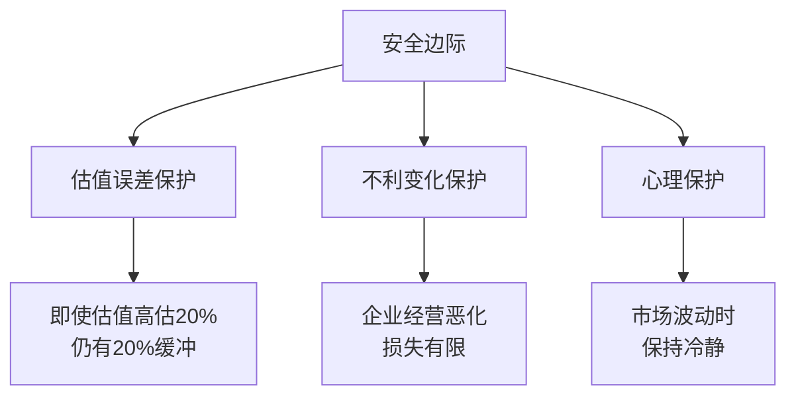
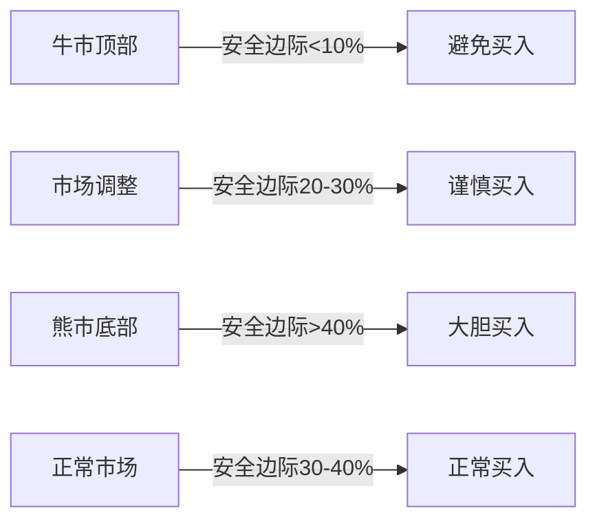

# 安全边际：价值投资的护城河

## 概述

安全边际（Margin of Safety）是本杰明·格雷厄姆价值投资理论的核心概念，也是《聪明的投资者》最后一章的标题。格雷厄姆认为，安全边际是"投资成功的秘密"，是区分投资与投机的关键。

**学习目标**：
1. 深入理解安全边际的概念和重要性
2. 掌握安全边际的计算和评估方法
3. 学习如何在不同市场环境中应用安全边际
4. 了解安全边际与风险管理的关系
5. 通过历史案例验证安全边际的有效性

**为什么重要**：安全边际不仅是一个投资原则，更是一种思维方式。它要求投资者在不确定性中寻求确定性，在风险中寻求保护。理解和应用安全边际，能够显著提高投资的成功率，降低永久性资本损失的风险。


## 核心概念

### 1. 安全边际的定义

安全边际是指资产的内在价值与购买价格之间的差额，用百分比表示：

**公式**：
```
安全边际 = (内在价值 - 购买价格) / 内在价值 × 100%
```

**示例**：
- 内在价值：$100
- 购买价格：$60
- 安全边际：($100 - $60) / $100 = 40%

### 2. 安全边际的三重保护



**1. 补偿估值误差**
- 内在价值估算本身就有不确定性
- 40%的安全边际意味着即使估值高估25%，仍有15%的保护
- 为人为判断错误提供缓冲

**2. 应对不利变化**
- 企业经营环境可能恶化
- 行业竞争可能加剧
- 宏观经济可能下行
- 安全边际提供下行保护

**3. 心理安慰**
- 知道有安全边际，投资者更能承受市场波动
- 减少恐慌性抛售
- 保持长期投资纪律

### 3. 安全边际的数学逻辑

**不对称收益**：

假设有10笔投资，每笔安全边际40%：
- 如果8笔成功，平均上涨67%（从$60到$100）
- 如果2笔失败，平均下跌30%（从$60到$42）
- 总体回报：8 × 67% + 2 × (-30%) = 476%
- 平均每笔：47.6%

**风险-收益不对称**：
- 下行风险有限（最多损失购买价格）
- 上行潜力巨大（可能数倍回报）
- 这种不对称性是价值投资的核心优势

## 安全边际的计算方法

### 1. 基于资产价值的安全边际

**净资产法**：
```
安全边际 = (账面价值 - 购买价格) / 账面价值
```

**净流动资产法**（格雷厄姆经典方法）：
```
NCAV = 流动资产 - 总负债
安全边际 = (NCAV - 购买价格) / NCAV
```

**清算价值法**：
```
清算价值 = 资产变现价值 - 负债
安全边际 = (清算价值 - 购买价格) / 清算价值
```

### 2. 基于盈利能力的安全边际

**盈利倍数法**：
```
合理价值 = 正常化盈利 × 合理市盈率
安全边际 = (合理价值 - 购买价格) / 合理价值
```

**自由现金流折现法**：
```
内在价值 = Σ(未来自由现金流的现值)
安全边际 = (DCF价值 - 购买价格) / DCF价值
```

### 3. 综合评估法

实践中，应该综合多种方法：

| 方法 | 估值结果 | 权重 | 加权价值 |
|------|---------|------|---------|
| 净资产法 | $80 | 20% | $16 |
| 盈利倍数法 | $100 | 40% | $40 |
| DCF法 | $120 | 40% | $48 |
| **综合内在价值** | | | **$104** |

如果当前价格$65，安全边际 = ($104 - $65) / $104 = 37.5%

## 不同资产类别的安全边际标准

### 1. 普通股票

**格雷厄姆建议**：
- 最低安全边际：33%（以$0.67买入价值$1的资产）
- 理想安全边际：50%或更高

**现代调整**：
- 优质大盘股：20-30%
- 中小盘股：30-40%
- 特殊情况：40-50%

### 2. 债券和优先股

**更严格的标准**：
- 投资级债券：10-15%
- 高收益债券：30-40%
- 可转换债券：20-30%

**原因**：
- 债券上行空间有限
- 需要更高的安全边际补偿风险

### 3. 房地产投资

**安全边际考虑**：
- 基于租金收益率
- 基于重置成本
- 基于可比交易价格
- 建议安全边际：25-35%

## 实战应用策略

### 1. 市场周期中的安全边际



**牛市策略**：
- 提高安全边际要求（40%+）
- 减少新投资
- 逐步获利了结

**熊市策略**：
- 降低安全边际要求（25-30%）
- 积极寻找机会
- 分批建仓

### 2. 行业差异化标准

**稳定行业**（公用事业、消费必需品）：
- 可接受较低安全边际（20-25%）
- 现金流稳定，不确定性低

**周期性行业**（能源、材料、工业）：
- 需要更高安全边际（35-45%）
- 盈利波动大，风险高

**科技行业**：
- 最高安全边际要求（40-50%）
- 技术变化快，不确定性极高

### 3. 组合层面的安全边际

**分散投资增强安全边际**：
- 单个股票可能失败
- 组合整体安全边际更可靠
- 建议：20-30只股票

**组合安全边际计算**：
```
组合安全边际 = Σ(个股权重 × 个股安全边际)
```

**示例**：
- 10只股票，每只10%权重
- 平均安全边际35%
- 即使2只失败，组合仍有正回报

## 历史案例验证

### 案例1：2000年互联网泡沫

**泡沫期特征**（1999-2000）：
- 许多科技股市盈率>100倍
- 安全边际为负（价格远超任何合理估值）
- 价值投资者被嘲笑为"不懂新经济"

**坚持安全边际的投资者**：
- 避开了科技股泡沫
- 持有传统价值股
- 2000-2002年表现优异

**结果**：
- 纳斯达克指数下跌78%（2000-2002）
- 许多科技股跌幅>90%
- 价值投资者保护了资本

**教训**：
- 没有安全边际就不要投资
- 市场狂热时保持理性
- "这次不一样"通常是危险信号

### 案例2：2008年金融危机中的机会

**危机前**（2007）：
- 金融股估值偏高
- 杠杆率极高
- 安全边际不足

**危机中**（2009年3月）：
- 优质公司被错杀
- 出现巨大安全边际

**具体案例：富国银行**
- 2009年3月低点：$8
- 账面价值：$10
- 正常化盈利能力：$2/股
- 合理估值：$20-25
- 安全边际：60-70%

**投资结果**（2009-2019）：
- 股价涨至$50+
- 10年回报：525%
- 年化回报：20%+

### 案例3：巴菲特投资美国运通（1964）

**背景**：
- 1963年"色拉油丑闻"
- 美国运通股价暴跌50%
- 市场恐慌性抛售

**巴菲特的分析**：
- 品牌价值未受损
- 核心业务（信用卡、旅行支票）完好
- 财务损失可控（$5800万）
- 内在价值：$65/股
- 市场价格：$35/股
- 安全边际：46%

**投资结果**：
- 1964-1967年涨至$180
- 回报：414%
- 成为巴菲特早期最成功的投资之一

**关键教训**：
- 危机创造安全边际
- 区分暂时困难和永久损害
- 品牌价值是重要的护城河

## 常见误区

### 误区1：安全边际=低市盈率

**错误**：只看市盈率，忽视企业质量。

**正确**：
- 安全边际是相对于内在价值
- 低市盈率可能是"价值陷阱"
- 需要综合评估企业质量

### 误区2：机械应用固定百分比

**错误**：所有投资都要求40%安全边际。

**正确**：
- 根据企业质量调整
- 根据市场环境调整
- 根据行业特性调整

### 误区3：忽视定性因素

**错误**：只做定量分析，忽视商业模式、管理层等。

**正确**：
- 定性分析影响内在价值估算
- 优秀管理层能创造价值
- 护城河决定价值持久性

### 误区4：过度保守

**错误**：要求过高安全边际，错失优质机会。

**正确**：
- 平衡安全边际和机会成本
- 优质企业可接受较低安全边际
- 不要让完美成为优秀的敌人

## 延伸阅读

### 核心书籍

1. **《安全边际》** - 塞思·卡拉曼
   - 深度阐述安全边际概念
   - 实践案例丰富
   - 注：此书已绝版，二手价格昂贵

2. **《聪明的投资者》第20章** - 本杰明·格雷厄姆
   - 安全边际的原始阐述
   - 必读经典

3. **《价值投资：从格雷厄姆到巴菲特》** - 布鲁斯·格林沃尔德
   - 现代视角的安全边际分析

### 学术研究

1. Oppenheimer, H. (1984). "A Test of Ben Graham's Stock Selection Criteria"
2. Lakonishok, J., Shleifer, A., & Vishny, R. (1994). "Contrarian Investment, Extrapolation, and Risk"
3. Piotroski, J. (2000). "Value Investing: The Use of Historical Financial Statement Information"

## 参考文献

1. Graham, B. (1949). *The Intelligent Investor*, Chapter 20: "Margin of Safety".
2. Klarman, S. (1991). *Margin of Safety: Risk-Averse Value Investing Strategies*.
3. Greenwald, B., et al. (2001). *Value Investing: From Graham to Buffett and Beyond*.
4. Buffett, W. (1984). "The Superinvestors of Graham-and-Doddsville".
5. Cunningham, L. (2013). *The Essays of Warren Buffett*.


6. Graham, B., & Dodd, D. (1934). *Security Analysis*. McGraw-Hill.
7. Buffett, W. E. (1977). *Berkshire Hathaway Annual Letters to Shareholders*. Berkshire Hathaway.
8. Greenwald, B. C. N., Kahn, J., Sonkin, P. D., & van Biema, M. (2001). *Value Investing: From Graham to Buffett and Beyond*. Wiley.
## 关键要点

1. **安全边际是价值投资的核心**：为不确定性提供保护
2. **多重保护**：补偿估值误差、应对不利变化、提供心理安慰
3. **不对称收益**：下行有限，上行巨大
4. **灵活应用**：根据企业质量、市场环境、行业特性调整标准
5. **历史验证**：危机时期创造最大安全边际和最佳投资机会

> "安全边际原则可以用一句话来概括：以40美分的价格买入价值1美元的东西。" —— 本杰明·格雷厄姆


## 深度分析

### 核心机制解析

理解本主题需要从多个维度进行系统性分析。以下从理论基础、实践应用和历史验证三个层面展开深度探讨。

**理论基础层面**：本主题的核心逻辑建立在经济学和金融学的基本原理之上。通过对基础理论的深入理解，投资者能够建立起稳固的分析框架，避免被市场短期噪音所干扰。

**实践应用层面**：理论必须与实践相结合才能产生价值。在实际投资决策中，需要将抽象的概念转化为具体的分析工具和决策标准。

**历史验证层面**：金融市场有着丰富的历史记录，通过研究历史案例，我们可以验证理论的有效性，并从中提炼出具有普遍意义的规律。

### 关键影响因素

影响本主题的关键因素可以从以下几个维度进行分析：

1. **宏观经济环境**：利率水平、通货膨胀率、经济增长速度等宏观变量对本主题有着深远影响。在不同的宏观经济周期中，相关指标的表现会呈现出显著差异。

2. **市场结构因素**：市场参与者的构成、信息传播机制、流动性状况等市场结构因素决定了价格发现的效率和准确性。

3. **政策监管环境**：政府政策、监管框架的变化会直接影响相关市场的运作规则和参与者行为。

4. **技术创新驱动**：技术进步不断改变着金融市场的运作方式，从算法交易到区块链技术，每一次技术革新都带来新的机遇和挑战。

5. **全球化与地缘政治**：在全球化背景下，各国市场之间的联动性日益增强，地缘政治风险的影响也越来越不可忽视。

### 量化分析框架

为了更精确地分析和评估，可以采用以下量化框架：

| 分析维度 | 关键指标 | 参考基准 | 分析方法 |
|---------|---------|---------|---------|
| 规模评估 | 绝对值与相对值 | 历史均值 | 趋势分析 |
| 质量评估 | 稳定性指标 | 行业对标 | 横向比较 |
| 风险评估 | 波动率指标 | 风险阈值 | 情景分析 |
| 价值评估 | 估值倍数 | 历史区间 | 回归分析 |

通过系统性地应用上述框架，投资者可以对目标进行全面、客观的评估，从而做出更加理性的投资决策。

