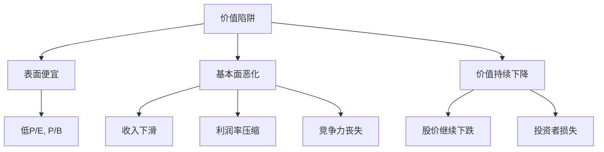

# 价值陷阱识别：避免看似便宜的昂贵股票

## 概述

价值陷阱（Value Trap）是价值投资者最常遇到的陷阱之一。这些股票看似便宜（低市盈率、低市净率），但实际上企业基本面持续恶化，内在价值不断下降，投资者不仅无法获利，反而会遭受损失。

**学习目标**：
1. 理解价值陷阱的定义和形成机制
2. 掌握识别价值陷阱的关键指标
3. 学习区分真正的价值投资机会和价值陷阱
4. 了解常见的价值陷阱类型
5. 通过案例学习规避策略

**为什么重要**：识别和避免价值陷阱是价值投资成功的关键。许多投资者因为只关注估值指标而忽视企业质量，最终陷入价值陷阱，遭受重大损失。学会识别价值陷阱能显著提高投资成功率。

## 核心概念

### 1. 什么是价值陷阱

**定义**：
价值陷阱是指那些表面上看起来估值很低（低P/E、低P/B），但实际上企业基本面持续恶化，内在价值不断下降的股票。投资者买入后，股价不仅不会上涨，反而可能继续下跌。

**核心特征**：

### 2. 价值陷阱 vs 真正的价值投资机会

| 特征 | 价值陷阱 | 真正的价值机会 |
|------|---------|--------------|
| **估值** | 看似便宜 | 真正便宜 |
| **基本面** | 持续恶化 | 暂时困难 |
| **竞争力** | 丧失护城河 | 护城河完好 |
| **行业** | 衰退行业 | 周期性或成长行业 |
| **管理层** | 无能或不诚信 | 优秀且诚信 |
| **催化剂** | 缺失 | 明确 |
| **结果** | 继续下跌 | 价值回归 |

### 3. 价值陷阱的形成机制

**典型路径**：
1. 企业曾经辉煌，市场给予高估值
2. 行业或企业基本面开始恶化
3. 股价下跌，估值指标变得"便宜"
4. 价值投资者被低估值吸引买入
5. 基本面继续恶化，股价继续下跌
6. 投资者陷入困境

## 价值陷阱的类型

### 1. 衰退行业陷阱

**特征**：
- 行业整体衰退
- 需求持续下降
- 技术被替代
- 无法逆转

**典型案例**：
- 传统媒体（报纸、杂志）
- 固定电话运营商
- 胶卷相机
- 传统零售

**识别信号**：
- 行业收入持续下滑
- 市场份额被新技术侵蚀
- 年轻用户流失
- 无法转型

### 2. 过度竞争陷阱

**特征**：
- 行业进入壁垒低
- 竞争者众多
- 价格战激烈
- 利润率持续下降

**典型案例**：
- 航空公司（历史上）
- 钢铁行业
- 某些制造业
- 低端零售

**识别信号**：
- 毛利率持续下降
- 市场份额分散
- 产品同质化
- 无定价权

### 3. 技术替代陷阱

**特征**：
- 新技术出现
- 原有产品被替代
- 企业无法跟上
- 市场份额快速流失

**典型案例**：
- 诺基亚（智能手机时代）
- 柯达（数码相机）
- Blockbuster（流媒体）
- 传统出租车（网约车）

**识别信号**：
- 研发投入不足
- 产品创新滞后
- 年轻用户流失
- 管理层保守

### 4. 财务欺诈陷阱

**特征**：
- 财务造假
- 虚增收入或利润
- 隐藏负债
- 管理层不诚信

**典型案例**：
- 安然（Enron）
- 世通（WorldCom）
- 康美药业
- 瑞幸咖啡

**识别信号**：
- 现金流与利润不匹配
- 频繁更换审计师
- 关联交易复杂
- 管理层行为可疑

### 5. 周期性高点陷阱

**特征**：
- 周期性行业
- 在周期顶部买入
- 盈利即将下滑
- 估值实际很高

**典型案例**：
- 大宗商品企业（周期顶部）
- 房地产企业（周期顶部）
- 航运企业（周期顶部）

**识别信号**：
- 历史最高利润率
- 产能大幅扩张
- 行业乐观情绪高涨
- 使用周期高点盈利计算P/E

### 6. 高负债陷阱

**特征**：
- 债务负担沉重
- 利息支出高
- 财务脆弱
- 破产风险

**典型案例**：
- 过度杠杆的房地产企业
- 高负债的零售企业
- 某些航空公司

**识别信号**：
- 债务/EBITDA > 5倍
- 利息覆盖率 < 2倍
- 债务到期压力大
- 现金流紧张

## 识别价值陷阱的关键指标

### 1. 质量指标

**ROE趋势**：
- 持续下降的ROE是危险信号
- 优质企业ROE应稳定在15%以上
- 关注ROE的可持续性

**ROIC趋势**：
- ROIC < WACC：毁灭价值
- ROIC持续下降：竞争力丧失
- 关注资本回报率

**利润率趋势**：
- 毛利率持续下降：定价权丧失
- 净利率持续下降：成本失控
- 与行业对比

### 2. 增长指标

**收入增长**：
- 收入持续下滑：需求萎缩
- 收入增长低于行业：市场份额流失
- 关注有机增长

**市场份额**：
- 市场份额下降：竞争力减弱
- 关注相对竞争对手的表现

### 3. 现金流指标

**经营现金流**：
- 经营现金流 < 净利润：质量存疑
- 经营现金流持续为负：危险
- 关注现金流质量

**自由现金流**：
- 自由现金流持续为负：不可持续
- FCF/净利润比率：应>80%

### 4. 财务健康指标

**负债率**：
- 债务/权益 > 2：高风险
- 债务/EBITDA > 5：危险
- 关注债务结构

**流动性**：
- 流动比率 < 1：流动性危机
- 速动比率 < 0.5：危险
- 关注短期偿债能力

### 5. 估值合理性

**周期调整**：
- 使用正常化盈利
- 不用周期高点盈利
- 考虑周期位置

**资产质量**：
- 账面价值的真实性
- 无形资产的价值
- 资产减值风险

## 规避价值陷阱的策略

### 1. 深入基本面分析

**超越财务报表**：
- 理解商业模式
- 分析竞争格局
- 评估行业前景
- 研究管理层

**关注定性因素**：
- 护城河是否完好
- 品牌价值是否下降
- 客户忠诚度变化
- 员工士气

### 2. 寻找催化剂

**价值实现途径**：
- 管理层变动
- 资产重组
- 行业复苏
- 并购可能

**时间限制**：
- 设定持有期限
- 缺乏催化剂及时退出
- 避免无限期等待

### 3. 分散投资

**降低单一风险**：
- 不过度集中
- 分散行业和地域
- 控制单一持仓比例

**组合管理**：
- 定期审查持仓
- 及时止损
- 动态调整

### 4. 关注管理层

**评估标准**：
- 诚信度
- 资本配置能力
- 战略眼光
- 执行力

**警示信号**：
- 频繁更换高管
- 薪酬结构不合理
- 关联交易
- 对股东不友好

### 5. 行业分析

**避开衰退行业**：
- 识别行业生命周期
- 关注技术替代风险
- 评估竞争格局
- 分析需求趋势

**关注行业动态**：
- 新进入者
- 替代品威胁
- 监管变化
- 技术创新

## 实战案例

### 案例1：通用电气（GE）

**背景**：
- 曾经的蓝筹股
- 2017年后股价暴跌
- 看似估值便宜

**价值陷阱特征**：
1. 过度多元化
2. 金融业务风险
3. 会计问题
4. 养老金负债
5. 管理层问题

**结果**：
- 2017-2020年跌幅>70%
- 削减股息
- 业务剥离
- 价值持续毁灭

**教训**：
- 复杂的企业结构是风险
- 会计质量很重要
- 过去的辉煌不代表未来
- 管理层能力至关重要

### 案例2：西尔斯（Sears）

**背景**：
- 美国零售巨头
- 长期衰退
- 估值看似便宜

**价值陷阱特征**：
1. 行业衰退（传统零售）
2. 电商冲击
3. 管理层无能
4. 资产变卖维持
5. 债务负担重

**结果**：
- 2018年破产
- 股东损失惨重
- 从$100+跌至破产

**教训**：
- 衰退行业难以逆转
- 管理层质量决定命运
- 资产变卖不是长久之计
- 便宜可能更便宜

### 案例3：诺基亚（Nokia）

**背景**：
- 手机行业霸主
- 智能手机时代落后
- 市盈率很低

**价值陷阱特征**：
1. 技术替代
2. 创新滞后
3. 市场份额快速流失
4. 管理层保守
5. 生态系统劣势

**结果**：
- 手机业务出售给微软
- 股价长期低迷
- 转型艰难

**教训**：
- 技术替代风险巨大
- 生态系统很重要
- 创新能力是核心竞争力
- 低估值不等于投资机会

### 案例4：中国石油（2007年上市）

**背景**：
- 2007年48元上市
- 市盈率看似合理
- 被认为是价值投资机会

**价值陷阱特征**：
1. 周期性高点上市
2. 油价处于历史高位
3. 盈利不可持续
4. 估值实际很高

**结果**：
- 长期下跌
- 2020年跌至4元
- 跌幅>90%

**教训**：
- 周期性企业要看周期位置
- 不能用周期高点盈利估值
- 大宗商品价格均值回归
- 上市时机很重要

## 常见误区

### 误区1：只看估值指标

**错误**：认为低P/E、低P/B就是便宜。

**正确**：
- 估值只是起点
- 必须分析基本面
- 关注企业质量
- 评估未来前景

### 误区2：相信"均值回归"

**错误**：认为股价总会回到历史平均水平。

**正确**：
- 基本面恶化时不会回归
- 行业衰退时不会回归
- 需要催化剂
- 有些企业永远回不去

### 误区3：过度分散

**错误**：买入大量"便宜"股票分散风险。

**正确**：
- 质量比数量重要
- 深入研究少数公司
- 避免价值陷阱比分散更重要
- 集中投资优质机会

### 误区4：忽视行业趋势

**错误**：只看个股，不看行业。

**正确**：
- 行业趋势决定企业命运
- 衰退行业难有赢家
- 顺势而为
- 避开夕阳行业

## 延伸阅读

### 核心书籍

1. **《价值陷阱》** - 查尔斯·布兰德斯
   - 系统讲解价值陷阱

2. **《聪明的投资者》第20章** - 本杰明·格雷厄姆
   - 安全边际与风险

3. **《投资最重要的事》** - 霍华德·马克斯
   - 风险识别和管理

4. **《反脆弱》** - 纳西姆·塔勒布
   - 避免负面黑天鹅

### 推荐文章

1. "How to Avoid Value Traps" - Morningstar
2. "The Difference Between Value and Value Traps" - Seeking Alpha
3. "Common Characteristics of Value Traps" - CFA Institute

## 参考文献

1. Brandes, C. (2004). *Value Investing Today*.
2. Graham, B. (1949). *The Intelligent Investor*.
3. Marks, H. (2011). *The Most Important Thing: Uncommon Sense for the Thoughtful Investor*.
4. Greenblatt, J. (2006). *The Little Book That Beats the Market*.
5. Klarman, S. (1991). *Margin of Safety*.
6. Carlisle, T. (2014). *Deep Value*.

7. Graham, B., & Dodd, D. (1934). *Security Analysis*. McGraw-Hill.
8. Buffett, W. E. (1977). *Berkshire Hathaway Annual Letters to Shareholders*. Berkshire Hathaway.
## 关键要点

1. **价值陷阱定义**：看似便宜但基本面持续恶化的股票
2. **识别关键**：关注质量指标、现金流、行业趋势
3. **常见类型**：衰退行业、过度竞争、技术替代、财务欺诈
4. **规避策略**：深入分析、寻找催化剂、分散投资、关注管理层
5. **核心教训**：便宜不等于价值，质量比价格更重要

> "价格是你付出的，价值是你得到的。但如果你得到的价值在不断减少，再便宜的价格也是昂贵的。" —— 改编自沃伦·巴菲特

识别和避免价值陷阱是价值投资成功的关键。投资者不应仅仅被低估值吸引，而应该深入分析企业基本面、行业前景和管理层质量。记住：真正的价值投资是以合理价格买入优质企业，而不是以任何价格买入看似便宜的股票。

## 深度分析

### 核心机制解析

理解本主题需要从多个维度进行系统性分析。以下从理论基础、实践应用和历史验证三个层面展开深度探讨。

**理论基础层面**：本主题的核心逻辑建立在经济学和金融学的基本原理之上。通过对基础理论的深入理解，投资者能够建立起稳固的分析框架，避免被市场短期噪音所干扰。

**实践应用层面**：理论必须与实践相结合才能产生价值。在实际投资决策中，需要将抽象的概念转化为具体的分析工具和决策标准。

**历史验证层面**：金融市场有着丰富的历史记录，通过研究历史案例，我们可以验证理论的有效性，并从中提炼出具有普遍意义的规律。

### 关键影响因素

影响本主题的关键因素可以从以下几个维度进行分析：

1. **宏观经济环境**：利率水平、通货膨胀率、经济增长速度等宏观变量对本主题有着深远影响。在不同的宏观经济周期中，相关指标的表现会呈现出显著差异。

2. **市场结构因素**：市场参与者的构成、信息传播机制、流动性状况等市场结构因素决定了价格发现的效率和准确性。

3. **政策监管环境**：政府政策、监管框架的变化会直接影响相关市场的运作规则和参与者行为。

4. **技术创新驱动**：技术进步不断改变着金融市场的运作方式，从算法交易到区块链技术，每一次技术革新都带来新的机遇和挑战。

5. **全球化与地缘政治**：在全球化背景下，各国市场之间的联动性日益增强，地缘政治风险的影响也越来越不可忽视。

### 量化分析框架

为了更精确地分析和评估，可以采用以下量化框架：

| 分析维度 | 关键指标 | 参考基准 | 分析方法 |
|---------|---------|---------|---------|
| 规模评估 | 绝对值与相对值 | 历史均值 | 趋势分析 |
| 质量评估 | 稳定性指标 | 行业对标 | 横向比较 |
| 风险评估 | 波动率指标 | 风险阈值 | 情景分析 |
| 价值评估 | 估值倍数 | 历史区间 | 回归分析 |

通过系统性地应用上述框架，投资者可以对目标进行全面、客观的评估，从而做出更加理性的投资决策。

