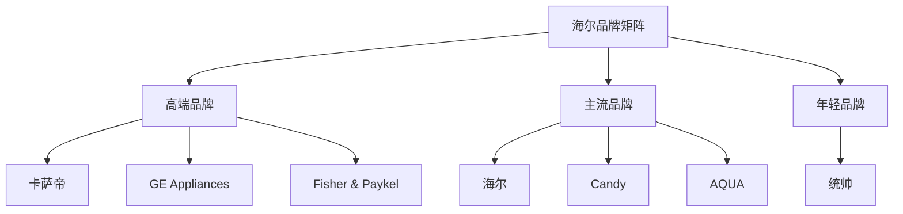

# 海尔智家 - 物联网生态引领者

## 概述

海尔智家是中国家电行业的先驱企业，全球白色家电第一品牌。本文分析海尔的全球化品牌战略、物联网生态布局和投资价值。

**学习目标**：
- 理解海尔的商业模式和战略转型
- 分析海尔的全球品牌矩阵布局
- 评估海尔的物联网生态价值
- 掌握人单合一管理模式
- 学习全球化品牌运营经验

**为什么重要**：
海尔是中国企业全球化的先行者，从传统制造向物联网生态转型的探索者。理解海尔可以学习如何构建全球品牌和生态平台。

## 公司概况

**基本信息**：
- 公司全称：海尔智家股份有限公司
- 股票代码：600690.SH / 06690.HK / 690D.DE
- 成立时间：1984 年
- 上市时间：1993 年（A股）、2020 年（D股）
- 总部位置：山东省青岛市
- 主营业务：智慧家庭解决方案和智能家电

**市值规模**（2023）：
- 总市值：约 2500-3000 亿元
- A 股家电行业前三
- 全球白色家电第一品牌

## 商业模式分析

### 核心业务

**业务结构**：
- 冰箱：占营收 30%
- 洗衣机：占营收 25%
- 空调：占营收 20%
- 热水器：占营收 10%
- 厨电及其他：占营收 15%

**全品类布局**：
- 白色家电全覆盖
- 厨房电器
- 热水器
- 智能家居

### 全球品牌矩阵

**多品牌战略**：

**高端品牌**：
- 卡萨帝（Casarte）：中国高端市场
- GE Appliances：美国市场
- Fisher & Paykel：澳新市场
- AQUA：日本市场

**主流品牌**：
- 海尔（Haier）：全球主品牌
- Candy：欧洲市场
- 统帅（Leader）：年轻市场

**品牌定位**：

### 物联网生态战略

**智慧家庭生态**：
- 智家 APP：用户交互平台
- 场景化解决方案：厨房、卧室、浴室等
- 生态合作伙伴：家居、家装、家政等
- 数据价值：用户行为数据

**三翼鸟品牌**：
- 场景品牌
- 一站式智慧家庭解决方案
- 线上线下融合
- 生态价值变现

## 竞争优势分析

### 1. 全球化品牌优势

**全球布局**：
- 海外收入占比：50%+
- 全球 10 大研发中心
- 全球 25 个工业园
- 覆盖 160+ 个国家

**品牌力**：
- 全球白色家电第一品牌（Euromonitor）
- 连续 14 年全球大型家电第一
- 高端品牌矩阵完善
- 本土化运营成功

### 2. 管理模式创新

**人单合一模式**：
- 员工即创客
- 小微组织
- 用户付薪
- 去中心化管理

**管理创新成效**：
- 激发员工创造力
- 快速响应市场
- 组织灵活高效
- 国际管理学界认可

### 3. 物联网生态优势

**生态布局**：
- 智家 APP 用户：1 亿+
- 场景方案：7 大场景
- 生态合作伙伴：1000+
- 数据资产：用户行为数据

**生态价值**：
- 用户粘性增强
- 交叉销售机会
- 服务收入增长
- 数据价值变现

### 4. 高端化优势

**高端品牌表现**：
- 卡萨帝：中国高端家电第一
- GE Appliances：美国市场领先
- Fisher & Paykel：高端定位
- 高端产品占比提升

**高端化成效**：
- 毛利率提升
- 品牌形象提升
- 盈利能力增强

## 财务分析

### 盈利能力

**营收规模**：
- 2023 年营收：约 2400 亿元
- 近 10 年 CAGR：约 8%
- 增长稳定

**利润水平**：
- 2023 年净利润：约 150 亿元
- 净利率：约 6%
- 近 10 年 CAGR：约 12%

**盈利能力指标**：
| 指标 | 海尔智家 | 美的 | 格力 |
|------|---------|------|------|
| 毛利率 | 32% | 28% | 30% |
| 净利率 | 6% | 8.5% | 13% |
| ROE | 20% | 25% | 30% |
| ROIC | 15% | 20% | 25% |

### 现金流与分红

**现金流**：
- 经营现金流稳定
- 自由现金流改善
- 资本开支较高（全球化投入）

**分红政策**：
- 分红率：30-40%
- 股息率：2-3%
- 持续稳定分红

## 投资价值分析

### 投资逻辑

**核心逻辑**：
1. **全球化品牌价值**：
   - 全球第一品牌
   - 高端品牌矩阵
   - 海外收入占比高

2. **物联网生态潜力**：
   - 智慧家庭生态
   - 用户粘性强
   - 数据价值大

3. **管理模式创新**：
   - 人单合一模式
   - 组织活力强
   - 创新能力强

4. **高端化进展**：
   - 高端品牌表现好
   - 毛利率提升
   - 盈利能力增强

### 增长驱动

**短期驱动**：
- 高端产品放量
- 海外市场增长
- 成本优化

**中期驱动**：
- 物联网生态变现
- 品牌力提升
- 市占率提升

**长期驱动**：
- 全球品牌价值
- 生态平台价值
- 数据资产价值

### 估值水平

**历史 PE 区间**：10-20 倍
**合理 PE**：12-16 倍
**当前 PE**（2023）：约 14 倍
**估值评估**：合理

## 投资风险

**主要风险**：
1. 全球化经营风险
2. 汇率波动风险
3. 生态变现不及预期
4. 竞争加剧风险
5. 原材料成本波动

## 投资策略建议

### 买入时机

**好的买入时机**：
- 估值回落时（PE < 12）
- 生态变现进展顺利时
- 高端化成效显现时
- 市场恐慌时

### 持有策略

**持有周期**：3-5 年
**仓位建议**：10-15%（消费板块内）
**再平衡**：年度调整

### 卖出时机

**考虑卖出**：
- 估值过高（PE > 18）
- 生态战略失败
- 基本面恶化
- 更好机会出现

## 与竞争对手对比

### 海尔 vs 美的 vs 格力

| 维度 | 海尔智家 | 美的集团 | 格力电器 |
|------|---------|---------|---------|
| 营收规模 | 2400亿 | 3500亿 | 2000亿 |
| 净利率 | 6% | 8.5% | 13% |
| ROE | 20% | 25% | 30% |
| 海外收入占比 | 50%+ | 40%+ | 15% |
| 业务聚焦度 | 中（全品类） | 低（多元化） | 高（空调） |
| 品牌力 | 全球第一 | 全球前三 | 国内第一 |
| 生态布局 | 领先 | 跟进 | 落后 |
| 管理模式 | 创新（人单合一） | 传统 | 传统 |

**差异化优势**：
- 海尔：全球化品牌、物联网生态
- 美的：多元化、全球化平衡
- 格力：空调专业化、盈利能力强

## 延伸阅读

### 推荐书籍

1. **《海尔转型》**
   - 海尔战略转型历程

2. **《人单合一》**
   - 张瑞敏管理思想

3. **《物联网生态》**
   - 物联网商业模式

### 研究报告

- 中金公司：海尔智家深度报告
- 招商证券：家电行业研究
- 国泰君安：海尔投资价值分析

## 参考文献

1. 海尔智家年报. 2013-2023
2. 中金公司. 《海尔智家深度报告》. 2023
3. 招商证券. 《家电行业研究》. 2023
4. 国泰君安. 《海尔投资价值分析》. 2022
5. 中国家用电器协会. 《行业发展报告》. 2023
6. 张瑞敏. 《人单合一管理模式》. 2020
7. 海尔智家投资者交流会纪要. 2018-2023
8. Euromonitor. 《全球家电市场研究》. 2023
9. 麦肯锡. 《物联网生态研究》. 2023
10. 哈佛商学院. 《海尔管理案例》. 2022

---

**关键启示**：
- 海尔是全球化品牌领导者
- 物联网生态具有长期价值
- 人单合一管理模式创新
- 高端化进展顺利

**下一步学习**：
- 研究物联网生态商业模式
- 分析全球品牌运营策略
- 学习人单合一管理模式
- 研究智慧家庭场景
