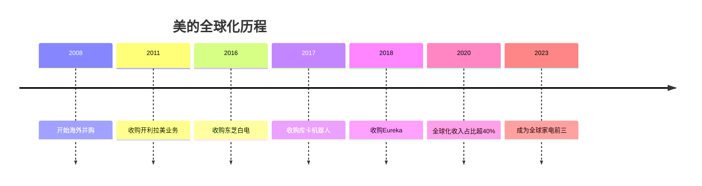

# 美的集团 - 全球家电巨头

## 概述

美的集团是中国最大的家电企业，全球家电行业前三。本文分析美的的全球化战略、多元化布局和长期投资价值。

**学习目标**：
- 理解美的的商业模式和战略布局
- 分析美的的全球化路径和成效
- 评估美的的竞争优势和增长潜力
- 掌握多元化家电企业的投资逻辑
- 学习全球化并购整合经验

**为什么重要**：
美的是中国制造业全球化的典范，过去 10 年通过并购和自主发展成为全球家电巨头。理解美的可以学习如何投资全球化企业。

## 公司概况

**基本信息**：
- 公司全称：美的集团股份有限公司
- 股票代码：000333.SZ
- 成立时间：1968 年
- 上市时间：2013 年（整体上市）
- 总部位置：广东省佛山市
- 主营业务：家电及相关产品的研发、生产和销售

**市值规模**（2023）：
- 总市值：约 4000-5000 亿元
- A 股家电行业第一
- 全球家电行业前三

## 商业模式分析

### 核心业务

**业务矩阵**：

1. **暖通空调（40%）**：
   - 家用空调
   - 中央空调
   - 热泵系统
   - 全球市占率第一

2. **消费电器（35%）**：
   - 冰箱、洗衣机
   - 厨房电器
   - 小家电
   - 全品类覆盖

3. **机器人与自动化（15%）**：
   - 工业机器人（库卡）
   - 自动化系统
   - 智能物流

4. **其他业务（10%）**：
   - 智能家居
   - 数字化服务
   - 金融服务

### 全球化布局

**全球化里程碑**：

**全球布局**：
- 生产基地：全球 30+ 个国家
- 研发中心：全球 20+ 个
- 销售网络：覆盖 200+ 个国家
- 海外收入占比：40%+

### 多品牌战略

**品牌矩阵**：
- 美的（Midea）：主品牌，全品类
- 小天鹅：洗衣机专业品牌
- 华凌：年轻化品牌
- 库卡（KUKA）：工业机器人
- 东芝（TOSHIBA）：日本品牌
- Eureka：美国品牌

## 竞争优势分析

### 1. 规模优势

**全球领先规模**：
- 营收规模：3000+ 亿元
- 员工数量：15 万+
- 生产基地：全球布局
- 采购规模：议价能力强

**规模效应**：
- 成本优势明显
- 研发投入充足
- 品牌投入能力强
- 抗风险能力强

### 2. 全球化优势

**全球化成效**：
- 海外收入占比 40%+
- 全球品牌认可度提升
- 分散单一市场风险
- 整合全球资源

**并购整合能力**：
- 成功整合东芝、库卡等
- 保留品牌独立性
- 协同效应显现
- 管理经验丰富

### 3. 技术创新优势

**研发投入**：
- 研发费用率：3-4%
- 研发人员：1 万+
- 专利数量：6 万+
- 全球研发网络

**技术领先**：
- 变频技术
- 智能控制
- 节能环保
- 工业设计

### 4. 管理优势

**职业经理人制度**：
- 去家族化管理
- 职业经理人团队
- 激励机制完善
- 执行力强

**数字化转型**：
- 智能制造
- 数字化营销
- 供应链数字化
- 数据驱动决策

## 财务分析

### 盈利能力

**营收规模**：
- 2023 年营收：约 3500 亿元
- 近 10 年 CAGR：约 12%
- 增长稳定

**利润水平**：
- 2023 年净利润：约 300 亿元
- 净利率：约 8.5%
- 近 10 年 CAGR：约 15%

**盈利能力指标**：
| 指标 | 美的 | 格力 | 行业平均 |
|------|------|------|----------|
| 毛利率 | 28% | 30% | 25% |
| 净利率 | 8.5% | 13% | 6% |
| ROE | 25% | 30% | 15% |
| ROIC | 20% | 25% | 12% |

### 现金流与分红

**现金流**：
- 经营现金流充沛
- 自由现金流稳定
- 资本开支适中

**分红政策**：
- 分红率：40-50%
- 股息率：3-4%
- 持续稳定分红
- 回购积极

## 投资价值分析

### 投资逻辑

**核心逻辑**：
1. **全球化红利**：
   - 海外收入持续增长
   - 全球品牌力提升
   - 并购协同效应

2. **多元化布局**：
   - 全品类覆盖
   - 分散风险
   - 增长动力多元

3. **管理优秀**：
   - 职业经理人制度
   - 激励机制完善
   - 执行力强

4. **估值合理**：
   - PE 10-15 倍
   - 股息率高
   - 安全边际好

### 增长驱动

**短期驱动**：
- 海外市场拓展
- 产品结构优化
- 成本控制

**中期驱动**：
- 全球化深化
- 智能化升级
- 并购整合

**长期驱动**：
- 全球品牌力提升
- 技术创新
- 生态价值

### 估值水平

**历史 PE 区间**：8-18 倍
**合理 PE**：12-15 倍
**当前 PE**（2023）：约 13 倍
**估值评估**：合理

## 投资风险

**主要风险**：
1. 原材料成本波动
2. 汇率波动风险
3. 海外市场风险
4. 并购整合风险
5. 竞争加剧风险

## 投资策略建议

### 买入时机

**好的买入时机**：
- 估值回落时（PE < 12）
- 原材料成本下降时
- 并购整合进展顺利时
- 市场恐慌时

### 持有策略

**持有周期**：3-5 年
**仓位建议**：15-20%（消费板块内）
**再平衡**：年度调整

### 卖出时机

**考虑卖出**：
- 估值过高（PE > 18）
- 全球化受挫
- 基本面恶化
- 更好机会出现

## 延伸阅读

### 推荐书籍

1. **《美的之道》**
   - 美的发展史和管理经验

2. **《全球化战略》**
   - 企业全球化理论

3. **《并购整合》**
   - 并购整合实践

### 研究报告

- 中金公司：美的集团深度报告
- 招商证券：家电行业研究
- 国泰君安：美的投资价值分析

## 参考文献

1. 美的集团年报. 2013-2023
2. 中金公司. 《美的集团深度报告》. 2023
3. 招商证券. 《家电行业研究》. 2023
4. 国泰君安. 《美的投资价值分析》. 2022
5. 中国家用电器协会. 《行业发展报告》. 2023
6. 高瓴资本. 《制造业投资方法论》. 2021
7. 美的集团投资者交流会纪要. 2018-2023
8. 麦肯锡. 《全球家电行业研究》. 2023
9. 波士顿咨询. 《中国企业全球化报告》. 2023
10. 尼尔森. 《中国消费者信心指数》. 2023

---

**关键启示**：
- 美的是全球化家电巨头
- 多元化布局分散风险
- 管理优秀，执行力强
- 估值合理，适合长期持有

**下一步学习**：
- 研究格力的竞争策略
- 分析全球化并购案例
- 学习职业经理人制度
- 研究智能制造转型

## 深度分析

### 核心机制解析

理解本主题需要从多个维度进行系统性分析。以下从理论基础、实践应用和历史验证三个层面展开深度探讨。

**理论基础层面**：本主题的核心逻辑建立在经济学和金融学的基本原理之上。通过对基础理论的深入理解，投资者能够建立起稳固的分析框架，避免被市场短期噪音所干扰。

**实践应用层面**：理论必须与实践相结合才能产生价值。在实际投资决策中，需要将抽象的概念转化为具体的分析工具和决策标准。

**历史验证层面**：金融市场有着丰富的历史记录，通过研究历史案例，我们可以验证理论的有效性，并从中提炼出具有普遍意义的规律。

### 关键影响因素

影响本主题的关键因素可以从以下几个维度进行分析：

1. **宏观经济环境**：利率水平、通货膨胀率、经济增长速度等宏观变量对本主题有着深远影响。在不同的宏观经济周期中，相关指标的表现会呈现出显著差异。

2. **市场结构因素**：市场参与者的构成、信息传播机制、流动性状况等市场结构因素决定了价格发现的效率和准确性。

3. **政策监管环境**：政府政策、监管框架的变化会直接影响相关市场的运作规则和参与者行为。

4. **技术创新驱动**：技术进步不断改变着金融市场的运作方式，从算法交易到区块链技术，每一次技术革新都带来新的机遇和挑战。

5. **全球化与地缘政治**：在全球化背景下，各国市场之间的联动性日益增强，地缘政治风险的影响也越来越不可忽视。

### 量化分析框架

为了更精确地分析和评估，可以采用以下量化框架：

| 分析维度 | 关键指标 | 参考基准 | 分析方法 |
|---------|---------|---------|---------|
| 规模评估 | 绝对值与相对值 | 历史均值 | 趋势分析 |
| 质量评估 | 稳定性指标 | 行业对标 | 横向比较 |
| 风险评估 | 波动率指标 | 风险阈值 | 情景分析 |
| 价值评估 | 估值倍数 | 历史区间 | 回归分析 |

通过系统性地应用上述框架，投资者可以对目标进行全面、客观的评估，从而做出更加理性的投资决策。

## 高级分析与前沿研究

### 学术研究进展

近年来，学术界对本领域的研究取得了重要进展。以下是几个值得关注的研究方向：

**行为金融学视角**：传统金融理论假设市场参与者是完全理性的，但行为金融学的研究表明，认知偏差和情绪因素在投资决策中扮演着重要角色。诺贝尔经济学奖得主丹尼尔·卡尼曼（Daniel Kahneman）和理查德·塞勒（Richard Thaler）的研究为我们理解市场非理性行为提供了重要框架。

**因子投资研究**：尤金·法玛（Eugene Fama）和肯尼斯·弗伦奇（Kenneth French）的三因子模型，以及后续发展的五因子模型，为系统性地解释股票收益差异提供了理论基础。这些研究表明，市值、账面市值比、盈利能力和投资模式等因子能够解释大部分股票收益的横截面差异。

**市场微观结构研究**：对市场流动性、价格发现机制和交易成本的深入研究，帮助我们更好地理解市场的运作机制，并为优化交易策略提供指导。

### 实战案例深度解析

**案例一：长期价值创造的典范**

以沃伦·巴菲特（Warren Buffett）的伯克希尔·哈撒韦（Berkshire Hathaway）为例，其长达数十年的卓越投资业绩证明了价值投资理念的有效性。从1965年至今，伯克希尔的账面价值年均增长率约为19.8%，远超同期标普500指数的约10.2%年均回报。

巴菲特的成功秘诀在于：
- 专注于具有持久竞争优势的优质企业
- 以合理价格买入，而非追求最低价格
- 长期持有，让复利效应充分发挥
- 保持充足的安全边际，控制下行风险

**案例二：危机中的机遇识别**

2008年金融危机期间，大多数投资者恐慌性抛售，但少数具有前瞻性的投资者却在危机中发现了历史性的投资机会。约翰·保尔森（John Paulson）通过做空次级抵押贷款相关证券，在危机中获得了约150亿美元的利润，成为金融史上最成功的单笔交易之一。

这个案例告诉我们：
- 深入的基本面研究能够发现市场定价错误
- 逆向思维往往能够发现被市场忽视的机会
- 风险管理和仓位控制是成功的关键

### 跨市场比较分析

不同市场在结构、监管、投资者构成等方面存在显著差异，这些差异对投资策略的选择有重要影响：

**美国市场特征**：
- 机构投资者主导，市场效率较高
- 信息披露制度完善，分析师覆盖广泛
- 衍生品市场发达，对冲工具丰富
- 长期牛市历史，但也经历过多次重大调整

**中国市场特征**：
- 散户投资者比例较高，市场波动性较大
- 政策因素影响显著，需要密切关注监管动向
- 新兴行业发展迅速，成长投资机会丰富
- A股、港股、美股中概股形成多层次市场体系

**欧洲市场特征**：
- 价值股比例较高，估值相对保守
- 受地缘政治和欧元区政策影响较大
- 部分行业（如奢侈品、工业）具有全球竞争优势
- ESG投资理念推广较为领先

