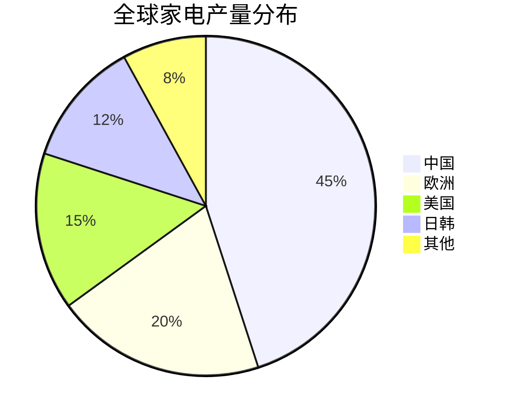
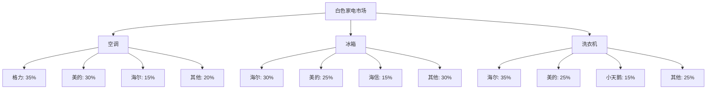
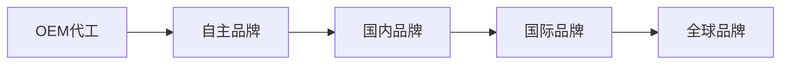

# 中国家电行业分析

## 概述

中国家电行业是全球最大的家电生产和消费市场，诞生了美的、格力、海尔等世界级企业。本文分析行业特点、竞争格局和投资机会。

**学习目标**：
- 理解中国家电行业的特点和优势
- 掌握各子行业的竞争格局
- 分析智能化、高端化趋势
- 识别优质投资标的
- 建立家电行业投资框架

**为什么重要**：
中国家电行业具有全球竞争力，是制造业升级的典范。理解这个行业对于投资中国制造业至关重要。

## 行业整体特征

### 1. 行业规模与地位

**市场规模**：
- 2023 年家电行业总产值超过 2 万亿元
- 全球最大的家电生产国
- 全球最大的家电消费市场
- 出口占全球 40%+

**全球地位**：

### 2. 行业核心特点

**制造优势明显**：
- 完整的产业链
- 规模效应显著
- 成本控制能力强
- 供应链效率高

**技术持续进步**：
- 智能化技术领先
- 节能环保技术
- 工业设计能力提升
- 创新能力增强

**品牌力提升**：
- 从 OEM 到自主品牌
- 国际品牌认可度提升
- 高端市场突破
- 品牌溢价能力增强

**全球化布局**：
- 海外建厂
- 海外并购
- 全球销售网络
- 国际竞争力强

## 子行业分析

### 1. 白色家电

**行业特点**：
- 市场成熟，增速放缓
- 更新需求为主
- 竞争格局稳定
- 龙头企业优势明显

**主要品类**：
- 空调：美的、格力、海尔三强
- 冰箱：海尔、美的、海信
- 洗衣机：海尔、美的、小天鹅

**竞争格局**：

**投资逻辑**：
- 关注龙头企业的规模优势
- 重视海外市场拓展
- 关注高端化、智能化
- 重视成本控制能力

### 2. 小家电

**行业特点**：
- 品类丰富，创新活跃
- 增长快于大家电
- 线上渗透率高
- 竞争相对分散

**主要品类**：
- 厨房小家电：豆浆机、电饭煲、破壁机
- 个护小家电：吹风机、剃须刀、电动牙刷
- 清洁小家电：吸尘器、扫地机器人
- 生活小家电：加湿器、空气净化器

**主要企业**：
- 九阳：豆浆机、破壁机
- 苏泊尔：炊具、小家电
- 小熊电器：创意小家电
- 科沃斯：扫地机器人

**投资逻辑**：
- 关注品类创新能力
- 重视线上运营能力
- 关注年轻化品牌
- 重视产品差异化

### 3. 厨房电器

**行业特点**：
- 消费升级受益
- 高端化趋势明显
- 品牌集中度高
- 毛利率较高

**主要品类**：
- 油烟机
- 燃气灶
- 消毒柜
- 洗碗机
- 蒸烤箱

**主要企业**：
- 老板电器：高端厨电龙头
- 方太：高端品牌
- 华帝：中高端品牌
- 美的、海尔：全品类

**投资逻辑**：
- 关注高端化进展
- 重视品牌力
- 关注新品类渗透（洗碗机、蒸烤箱）
- 重视渠道布局

## 行业投资逻辑

### 1. 制造优势是基础

**全球竞争力**：
- 完整产业链
- 规模效应
- 成本优势
- 供应链效率

**制造升级**：
- 自动化生产
- 智能制造
- 柔性生产
- 质量提升

### 2. 品牌力是关键

**品牌升级路径**：

**品牌力提升**：
- 产品品质提升
- 工业设计能力
- 品牌营销投入
- 用户口碑积累

### 3. 全球化是趋势

**全球化策略**：
- 海外建厂：降低成本，规避贸易壁垒
- 海外并购：获取品牌、技术、渠道
- 全球销售：拓展海外市场
- 全球研发：整合全球资源

**全球化成效**：
- 海外收入占比提升
- 国际品牌认可度提升
- 抗风险能力增强

### 4. 智能化是方向

**智能家电趋势**：
- IoT 连接
- AI 技术应用
- 语音控制
- 场景化应用
- 数据价值

**智能化机会**：
- 产品溢价
- 用户粘性
- 生态价值
- 数据价值

## 财务特征与估值

### 典型财务特征

**盈利能力**：
- 毛利率：25-40%
- 净利率：5-10%
- ROE：15-25%
- ROIC：15-20%

**现金流特征**：
- 经营现金流稳定
- 资本开支适中
- 自由现金流充沛

**资产负债表**：
- 固定资产占比适中
- 存货周转快
- 应收账款管理好
- 负债率健康

### 估值方法与水平

**PE 估值法**：
- 白色家电龙头：10-15 倍
- 小家电：15-25 倍
- 厨房电器：15-20 倍

**估值影响因素**：
- 成长性
- 盈利能力
- 全球化进展
- 市场情绪

## 投资机会与风险

### 投资机会

**1. 龙头企业持续受益**：
- 规模优势扩大
- 市占率提升
- 全球化加速
- 品牌力增强

**2. 高端化持续推进**：
- 高端产品增速快
- 毛利率提升
- 品牌形象提升

**3. 智能化带来溢价**：
- 智能产品溢价高
- 用户粘性增强
- 生态价值显现

**4. 出口替代机会**：
- 国际品牌份额下降
- 中国品牌崛起
- 全球市场拓展

### 主要风险

**1. 原材料成本波动**：
- 铜、钢材等价格波动
- 压缩利润空间

**2. 房地产周期影响**：
- 新房销售影响家电需求
- 地产下行压力

**3. 竞争加剧风险**：
- 价格战
- 营销费用上升

**4. 汇率波动风险**：
- 出口占比高
- 汇率波动影响利润

## 投资策略

### 选股标准

**必备条件**：
- 行业龙头地位
- 规模优势明显
- 品牌力强
- 财务健康
- 管理优秀

**加分项**：
- 全球化进展顺利
- 高端化成效显著
- 智能化领先
- 估值合理

### 组合配置建议

**核心持仓（60%）**：
- 白色家电龙头：美的、格力
- 综合家电龙头：海尔智家

**卫星持仓（40%）**：
- 小家电：九阳、苏泊尔
- 厨房电器：老板电器
- 成长股：科沃斯

### 买卖时机

**买入时机**：
- 行业调整时
- 原材料成本下降时
- 估值回到合理区间
- 地产政策放松时

**卖出时机**：
- 估值严重高估
- 基本面恶化
- 行业逻辑改变
- 更好机会出现

## 研究框架

### 行业研究要点

**供给端**：
- [ ] 产能情况
- [ ] 竞争格局
- [ ] 技术进步
- [ ] 成本变化

**需求端**：
- [ ] 市场规模
- [ ] 增长趋势
- [ ] 更新周期
- [ ] 消费升级

**出口**：
- [ ] 出口规模
- [ ] 主要市场
- [ ] 竞争力
- [ ] 贸易政策

### 公司研究要点

**制造能力**：
- [ ] 产能规模
- [ ] 成本控制
- [ ] 质量管理
- [ ] 供应链效率

**品牌力**：
- [ ] 品牌知名度
- [ ] 品牌美誉度
- [ ] 品牌溢价
- [ ] 市场份额

**全球化**：
- [ ] 海外收入占比
- [ ] 海外布局
- [ ] 国际品牌力
- [ ] 全球竞争力

**创新能力**：
- [ ] 研发投入
- [ ] 新品推出
- [ ] 技术储备
- [ ] 专利数量

## 延伸阅读

### 推荐书籍

1. **《美的之道》**
   - 美的发展史

2. **《格力模式》**
   - 格力管理经验

3. **《中国制造2025》**
   - 制造业升级

### 研究报告

- 中金公司：家电行业深度报告
- 招商证券：白色家电行业研究
- 国泰君安：小家电行业分析

## 参考文献

1. 中国家用电器协会. 《行业发展报告》. 2023
2. 中金公司. 《家电行业深度报告》. 2023
3. 招商证券. 《白色家电行业研究》. 2023
4. 国泰君安. 《小家电行业分析》. 2022
5. 美的集团年报. 2013-2023
6. 格力电器年报. 2013-2023
7. 海尔智家年报. 2013-2023
8. 高瓴资本. 《制造业投资方法论》. 2021
9. 麦肯锡. 《中国家电行业研究》. 2023
10. 尼尔森. 《中国消费者信心指数》. 2023

---

**关键启示**：
- 中国家电行业具有全球竞争力
- 龙头企业优势明显
- 全球化、高端化、智能化是趋势
- 适合长期投资

**下一步学习**：
- 深入研究美的集团
- 分析格力电器竞争策略
- 学习全球化布局案例
- 研究智能家居生态

## 深度分析

### 核心机制解析

理解本主题需要从多个维度进行系统性分析。以下从理论基础、实践应用和历史验证三个层面展开深度探讨。

**理论基础层面**：本主题的核心逻辑建立在经济学和金融学的基本原理之上。通过对基础理论的深入理解，投资者能够建立起稳固的分析框架，避免被市场短期噪音所干扰。

**实践应用层面**：理论必须与实践相结合才能产生价值。在实际投资决策中，需要将抽象的概念转化为具体的分析工具和决策标准。

**历史验证层面**：金融市场有着丰富的历史记录，通过研究历史案例，我们可以验证理论的有效性，并从中提炼出具有普遍意义的规律。

### 关键影响因素

影响本主题的关键因素可以从以下几个维度进行分析：

1. **宏观经济环境**：利率水平、通货膨胀率、经济增长速度等宏观变量对本主题有着深远影响。在不同的宏观经济周期中，相关指标的表现会呈现出显著差异。

2. **市场结构因素**：市场参与者的构成、信息传播机制、流动性状况等市场结构因素决定了价格发现的效率和准确性。

3. **政策监管环境**：政府政策、监管框架的变化会直接影响相关市场的运作规则和参与者行为。

4. **技术创新驱动**：技术进步不断改变着金融市场的运作方式，从算法交易到区块链技术，每一次技术革新都带来新的机遇和挑战。

5. **全球化与地缘政治**：在全球化背景下，各国市场之间的联动性日益增强，地缘政治风险的影响也越来越不可忽视。

### 量化分析框架

为了更精确地分析和评估，可以采用以下量化框架：

| 分析维度 | 关键指标 | 参考基准 | 分析方法 |
|---------|---------|---------|---------|
| 规模评估 | 绝对值与相对值 | 历史均值 | 趋势分析 |
| 质量评估 | 稳定性指标 | 行业对标 | 横向比较 |
| 风险评估 | 波动率指标 | 风险阈值 | 情景分析 |
| 价值评估 | 估值倍数 | 历史区间 | 回归分析 |

通过系统性地应用上述框架，投资者可以对目标进行全面、客观的评估，从而做出更加理性的投资决策。

## 高级分析与前沿研究

### 学术研究进展

近年来，学术界对本领域的研究取得了重要进展。以下是几个值得关注的研究方向：

**行为金融学视角**：传统金融理论假设市场参与者是完全理性的，但行为金融学的研究表明，认知偏差和情绪因素在投资决策中扮演着重要角色。诺贝尔经济学奖得主丹尼尔·卡尼曼（Daniel Kahneman）和理查德·塞勒（Richard Thaler）的研究为我们理解市场非理性行为提供了重要框架。

**因子投资研究**：尤金·法玛（Eugene Fama）和肯尼斯·弗伦奇（Kenneth French）的三因子模型，以及后续发展的五因子模型，为系统性地解释股票收益差异提供了理论基础。这些研究表明，市值、账面市值比、盈利能力和投资模式等因子能够解释大部分股票收益的横截面差异。

**市场微观结构研究**：对市场流动性、价格发现机制和交易成本的深入研究，帮助我们更好地理解市场的运作机制，并为优化交易策略提供指导。

### 实战案例深度解析

**案例一：长期价值创造的典范**

以沃伦·巴菲特（Warren Buffett）的伯克希尔·哈撒韦（Berkshire Hathaway）为例，其长达数十年的卓越投资业绩证明了价值投资理念的有效性。从1965年至今，伯克希尔的账面价值年均增长率约为19.8%，远超同期标普500指数的约10.2%年均回报。

巴菲特的成功秘诀在于：
- 专注于具有持久竞争优势的优质企业
- 以合理价格买入，而非追求最低价格
- 长期持有，让复利效应充分发挥
- 保持充足的安全边际，控制下行风险

**案例二：危机中的机遇识别**

2008年金融危机期间，大多数投资者恐慌性抛售，但少数具有前瞻性的投资者却在危机中发现了历史性的投资机会。约翰·保尔森（John Paulson）通过做空次级抵押贷款相关证券，在危机中获得了约150亿美元的利润，成为金融史上最成功的单笔交易之一。

这个案例告诉我们：
- 深入的基本面研究能够发现市场定价错误
- 逆向思维往往能够发现被市场忽视的机会
- 风险管理和仓位控制是成功的关键

### 跨市场比较分析

不同市场在结构、监管、投资者构成等方面存在显著差异，这些差异对投资策略的选择有重要影响：

**美国市场特征**：
- 机构投资者主导，市场效率较高
- 信息披露制度完善，分析师覆盖广泛
- 衍生品市场发达，对冲工具丰富
- 长期牛市历史，但也经历过多次重大调整

**中国市场特征**：
- 散户投资者比例较高，市场波动性较大
- 政策因素影响显著，需要密切关注监管动向
- 新兴行业发展迅速，成长投资机会丰富
- A股、港股、美股中概股形成多层次市场体系

**欧洲市场特征**：
- 价值股比例较高，估值相对保守
- 受地缘政治和欧元区政策影响较大
- 部分行业（如奢侈品、工业）具有全球竞争优势
- ESG投资理念推广较为领先

