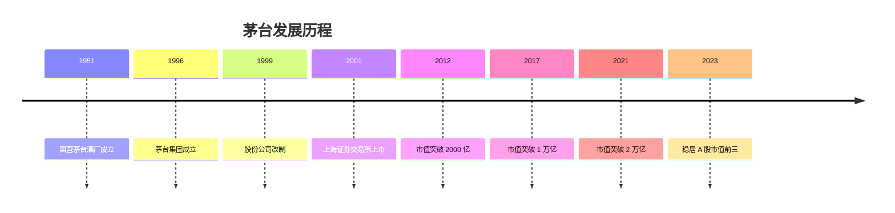
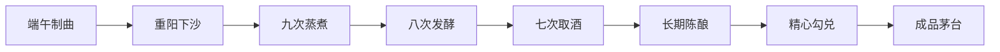
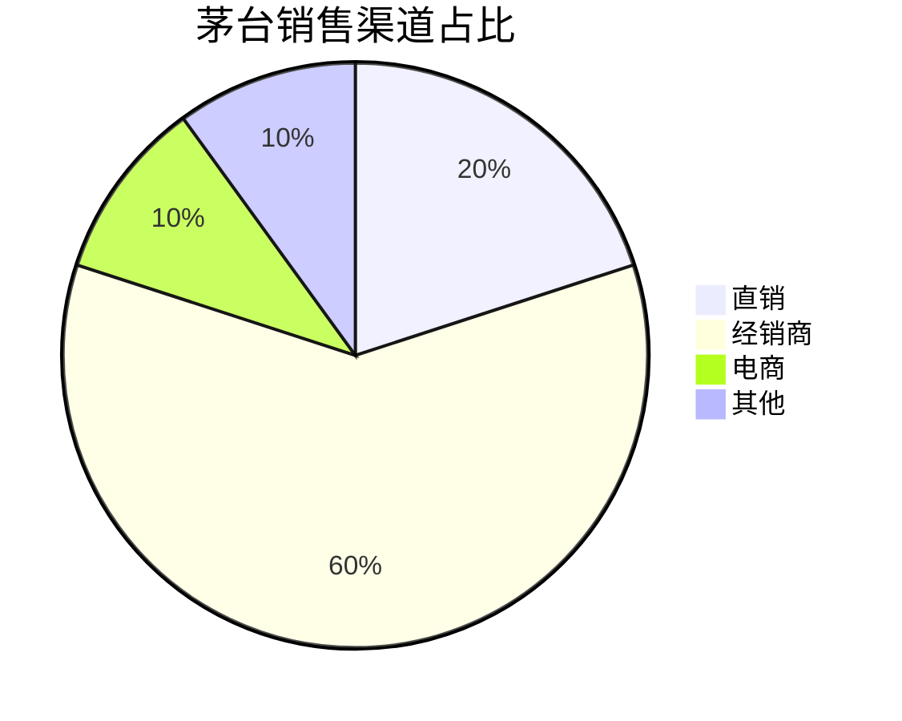
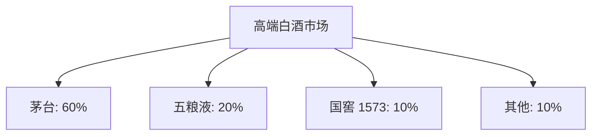
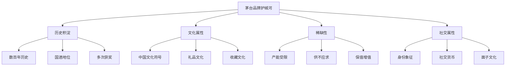
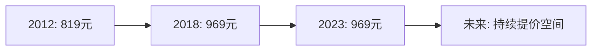
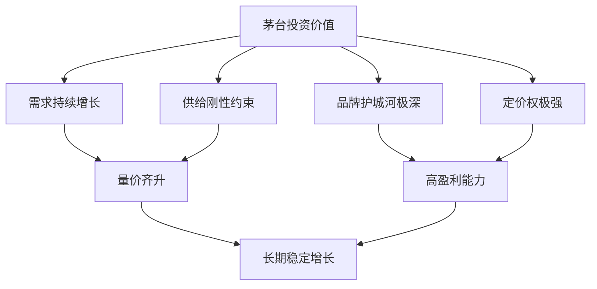

# 贵州茅台深度研究

## 概述

贵州茅台是中国最成功的消费股，也是全球市值最大的烈酒公司。本文深入分析茅台的商业模式、竞争优势、财务表现和长期投资价值。

**学习目标**：
- 理解茅台的商业模式和核心竞争力
- 分析茅台品牌护城河的来源和深度
- 掌握茅台的定价权和盈利能力
- 评估茅台的长期投资价值
- 学习如何研究优质消费股

**为什么重要**：
茅台是中国价值投资的标杆案例，过去 20 年为投资者创造了惊人回报。深入研究茅台，可以学习如何识别和投资优质消费企业。

## 公司概况

### 基本信息

**公司全称**：贵州茅台酒股份有限公司
**股票代码**：600519.SH
**成立时间**：1951 年（国营茅台酒厂），1999 年改制
**上市时间**：2001 年 8 月
**总部位置**：贵州省仁怀市茅台镇
**主营业务**：茅台酒及系列酒的生产与销售

**市值规模**（2023）：
- 总市值：约 2.5 万亿元人民币
- 全球烈酒行业市值第一
- A 股市值前三

### 发展历程

**历史沿革**：

**关键里程碑**：
- 1915 年：巴拿马万国博览会金奖
- 1951 年：国营茅台酒厂成立
- 1996 年：茅台集团成立
- 2001 年：A 股上市，发行价 31.39 元
- 2012 年：塑化剂风波，股价大跌后反弹
- 2017 年：市值突破万亿，成为 A 股第一高价股
- 2021 年：股价突破 2600 元，市值超 3 万亿

## 商业模式分析

### 核心产品

**产品矩阵**：

1. **飞天茅台（核心产品）**：
   - 53 度 500ml
   - 出厂价：969 元/瓶（2023）
   - 市场价：2500-3000 元/瓶
   - 占营收 70%+

2. **茅台系列酒**：
   - 茅台王子酒
   - 茅台迎宾酒
   - 汉酱酒
   - 仁酒
   - 占营收 10-15%

3. **其他产品**：
   - 茅台 1935
   - 茅台冰淇淋
   - 茅台啤酒
   - 占营收 5-10%

**产品特点**：
- 酱香型白酒代表
- 独特的酿造工艺（12987）
- 5 年以上陈酿
- 稀缺性和收藏价值

### 生产模式

**独特的酿造工艺**：

**12987 工艺**：
- 1 年生产周期
- 2 次投料
- 9 次蒸煮
- 8 次发酵
- 7 次取酒

**产能约束**：
- 地理环境独特（茅台镇微生物环境）
- 工艺复杂，周期长
- 产能扩张缓慢
- 供给刚性

**产能情况**：
- 基酒产能：约 5.6 万吨/年
- 成品酒产能：约 4 万吨/年
- 产能利用率：接近 100%
- 扩产计划：缓慢提升至 6 万吨

### 销售模式

**渠道结构**：

**渠道特点**：
1. **经销商体系**：
   - 约 2000 家经销商
   - 严格的配额制度
   - 打款提货模式
   - 渠道利润丰厚

2. **直销渠道**：
   - 茅台云商（i 茅台）
   - 直营店
   - 团购直销
   - 价格相对透明

3. **电商渠道**：
   - 天猫、京东旗舰店
   - 限量发售
   - 抑制价格过高

**价格体系**：
- 出厂价：969 元/瓶
- 批价：1800-2000 元/瓶
- 终端价：2500-3000 元/瓶
- 价差空间大，渠道利润丰厚

## 白酒行业地位

### 市场份额

**高端白酒市场**：
- 茅台市占率：约 60%
- 绝对龙头地位
- 份额持续提升

**整体白酒市场**：
- 按销量：约 2-3%
- 按销售额：约 20%
- 按利润：约 40%

### 竞争格局

**高端白酒（1000 元以上）**：

**竞争优势**：
- 品牌力：远超竞争对手
- 稀缺性：供不应求
- 文化属性：国酒地位
- 收藏价值：保值增值

**与五粮液对比**：

| 维度 | 茅台 | 五粮液 |
|------|------|--------|
| 品牌力 | ★★★★★ | ★★★★ |
| 稀缺性 | 极高 | 较高 |
| 定价权 | 极强 | 强 |
| 市占率 | 60% | 20% |
| 出厂价 | 969 元 | 889 元 |
| 市场价 | 2500-3000 元 | 900-1000 元 |
| 毛利率 | 93% | 75% |

### 行业地位的来源

**历史积淀**：
- 数百年酿造历史
- 国酒地位（虽已取消称号）
- 多次获得国际大奖
- 文化符号价值

**品质保证**：
- 独特的地理环境
- 传统的酿造工艺
- 严格的质量控制
- 长期陈酿

**稀缺性**：
- 产能受限
- 供不应求
- 一瓶难求
- 收藏价值

## 品牌护城河分析

### 品牌力的维度

**1. 品牌认知度**：
- 全国知名度接近 100%
- "国酒"形象深入人心
- 高端白酒代名词
- 文化符号价值

**2. 品牌美誉度**：
- 品质保证
- 身份象征
- 社交货币
- 收藏价值

**3. 品牌忠诚度**：
- 高复购率
- 低价格敏感度
- 强情感连接
- 代际传承

### 护城河的深度

**极深的品牌护城河**：

**护城河的表现**：
- 极强的定价权
- 极低的价格弹性
- 极高的品牌溢价
- 极难被替代

### 与奢侈品的相似性

**茅台的奢侈品属性**：
1. **稀缺性**：供给有限，一瓶难求
2. **身份象征**：彰显地位和品味
3. **保值增值**：具有投资收藏价值
4. **文化属性**：承载文化和情感
5. **社交货币**：重要的社交工具

**与 LV、爱马仕的对比**：
- 同样的品牌溢价能力
- 同样的稀缺性营销
- 同样的身份象征价值
- 同样的保值增值属性

**差异**：
- 茅台是消耗品（但可收藏）
- 茅台有使用价值（饮用）
- 茅台的文化属性更强（中国特色）

## 定价权分析

### 定价权的来源

**供需失衡**：
- 需求：持续增长
- 供给：刚性约束
- 结果：长期供不应求

**品牌溢价**：
- 品牌价值极高
- 消费者愿意支付溢价
- 价格不是主要考虑因素

**文化属性**：
- 礼品文化
- 面子文化
- 收藏文化
- 价格越高越有面子

### 定价权的表现

**提价历史**：

**出厂价提升**：
- 2012 年：819 元/瓶
- 2018 年：969 元/瓶
- 提价幅度：18%
- 提价频率：谨慎提价

**市场价表现**：
- 2012 年：1500-2000 元
- 2018 年：1800-2500 元
- 2023 年：2500-3000 元
- 持续上涨

**价差分析**：
- 出厂价与市场价差距大
- 渠道利润丰厚
- 公司有提价空间
- 选择谨慎提价

### 提价策略

**提价逻辑**：
- 需求持续增长
- 供给刚性约束
- 品牌力持续增强
- 通胀因素

**提价方式**：
- 直接提价（出厂价）
- 产品结构优化（高端产品占比提升）
- 控量保价（限制供给）
- 渠道价格管理

**提价空间**：
- 短期：出厂价可提至 1200-1500 元
- 中期：出厂价可提至 1500-2000 元
- 长期：跟随市场价上涨

## 财务分析

### 盈利能力

**营收规模**：
- 2023 年营收：约 1400 亿元
- 近 10 年 CAGR：约 15%
- 增长稳定

**利润水平**：
- 2023 年净利润：约 700 亿元
- 净利率：约 50%
- 近 10 年 CAGR：约 18%

**盈利能力指标**：
| 指标 | 茅台 | 五粮液 | 行业平均 |
|------|------|--------|----------|
| 毛利率 | 93% | 75% | 60% |
| 净利率 | 50% | 30% | 20% |
| ROE | 30%+ | 25% | 15% |
| ROIC | 40%+ | 30% | 20% |

**盈利能力分析**：
- 毛利率极高：定价权强
- 净利率极高：费用率低
- ROE 极高：轻资产，高周转
- ROIC 极高：资本效率高

### 现金流分析

**经营现金流**：
- 经营现金流 > 净利润
- 现金流质量极高
- 预收款模式
- 无应收账款风险

**自由现金流**：
- 资本开支低
- 自由现金流充沛
- 分红能力强

**现金流特点**：
- 预收款模式（经销商打款提货）
- 现金流领先利润
- 无应收账款
- 存货周转快

### 资产负债表

**资产结构**：
- 轻资产模式
- 固定资产占比低
- 货币资金充裕
- 存货（基酒）是核心资产

**负债结构**：
- 几乎无有息负债
- 预收款占比高
- 资产负债率低（20%左右）
- 财务极其健康

**财务健康度**：
- 现金充裕（1000 亿+）
- 无债务压力
- 分红能力强
- 抗风险能力极强

### 分红政策

**分红比例**：
- 分红率：50%左右
- 股息率：1-2%
- 持续稳定分红

**分红历史**：
- 上市以来累计分红超过 3000 亿
- 分红总额超过募资额数十倍
- 是优秀的现金奶牛

## 长期投资价值

### 投资回报

**股价表现**：
- 上市价格（2001）：31.39 元
- 最高价格（2021）：2600+ 元
- 涨幅：80+ 倍（不含分红）
- 含分红回报：100+ 倍

**年化收益率**：
- 2001-2023：约 25%
- 2013-2023：约 30%
- 远超市场平均

**与指数对比**：
| 时间段 | 茅台 | 上证指数 | 超额收益 |
|--------|------|----------|----------|
| 2001-2023 | +8000% | +100% | +7900% |
| 2013-2023 | +1500% | +30% | +1470% |

### 长期增长驱动

**需求端驱动**：
1. **消费升级**：
   - 收入增长支撑高端消费
   - 品质需求提升
   - 品牌意识增强

2. **社交需求**：
   - 商务宴请
   - 礼品馈赠
   - 收藏投资

3. **文化传承**：
   - 白酒文化深厚
   - 代际传承
   - 年轻化趋势

**供给端约束**：
- 产能扩张缓慢
- 地理环境独特
- 工艺复杂
- 供给刚性

**价格提升空间**：
- 出厂价提升
- 产品结构优化
- 市场价持续上涨

### 投资价值评估

**核心投资逻辑**：

**适合长期持有的理由**：
1. **确定性强**：需求稳定，供给刚性
2. **成长性好**：量价齐升，持续增长
3. **盈利能力强**：ROE 30%+，现金流好
4. **护城河深**：品牌难以复制
5. **管理优秀**：国企改革典范

**估值水平**：
- 历史 PE 区间：20-50 倍
- 合理 PE：25-35 倍
- 当前 PE（2023）：约 30 倍
- 估值合理

## 投资风险

### 主要风险

**1. 政策风险**：
- 限制三公消费
- 反腐败影响
- 税收政策变化
- 价格管制

**2. 经济周期风险**：
- 经济下行影响高端消费
- 收入预期下降
- 消费信心不足

**3. 竞争风险**：
- 其他高端白酒追赶
- 新兴消费品分流
- 年轻人消费习惯改变

**4. 公司治理风险**：
- 国企体制约束
- 管理层变动
- 腐败问题

**5. 估值风险**：
- 估值过高时买入
- 市场情绪波动
- 流动性风险

### 风险应对

**分散风险**：
- 不要满仓单一个股
- 配置其他优质资产
- 保持适度现金

**长期持有**：
- 不被短期波动干扰
- 享受长期复利
- 降低交易成本

**合理估值买入**：
- 在合理估值区间买入
- 估值过高时保持耐心
- 分批建仓

## 投资策略建议

### 买入时机

**好的买入时机**：
- 行业调整时（如 2012 年塑化剂风波）
- 市场恐慌时（如 2018 年贸易战）
- 估值回到合理区间（PE 25 倍以下）
- 基本面向好时

**避免的时机**：
- 估值过高时（PE 50 倍以上）
- 市场过度乐观时
- 追高买入

### 持有策略

**长期持有**：
- 持有周期：5 年以上
- 享受复利增长
- 不被短期波动干扰

**动态调整**：
- 估值过高时减仓
- 估值合理时加仓
- 保持核心仓位

**再平衡**：
- 年度再平衡
- 控制单一个股比例
- 保持组合平衡

### 卖出时机

**考虑卖出的情况**：
- 基本面恶化（概率极低）
- 估值严重高估（PE 60 倍以上）
- 更好的投资机会出现
- 需要资金时

**不应卖出的情况**：
- 短期波动
- 市场恐慌
- 估值合理时

## 研究框架

### 跟踪要点

**季度跟踪**：
- [ ] 营收和利润增速
- [ ] 产品结构变化
- [ ] 渠道库存健康度
- [ ] 批价和终端价
- [ ] 预收款变化

**年度跟踪**：
- [ ] 产能变化
- [ ] 提价情况
- [ ] 渠道政策调整
- [ ] 管理层变动
- [ ] 战略规划

**长期跟踪**：
- [ ] 品牌力变化
- [ ] 竞争格局演变
- [ ] 消费趋势变化
- [ ] 政策环境变化

### 数据来源

**公司公告**：
- 年报、季报
- 投资者交流会
- 重大事项公告

**行业数据**：
- 中国酒业协会
- 券商研究报告
- 行业媒体

**市场数据**：
- 批价和终端价
- 电商销售数据
- 第三方调研

## 延伸阅读

### 推荐书籍

1. **《茅台传》** - 张思
   - 茅台发展史

2. **《投资中最简单的事》** - 邱国鹭
   - 茅台投资案例

3. **《长期主义》** - 高瓴资本
   - 消费投资理念

4. **《巴菲特致股东的信》**
   - 价值投资理念

### 研究报告

- 中金公司：贵州茅台深度报告
- 招商证券：白酒行业策略报告
- 国泰君安：茅台投资价值分析
- 各年度年报和投资者交流会纪要

## 参考文献

1. 贵州茅台年报. 2001-2023
2. 中金公司. 《贵州茅台深度报告》. 2023
3. 招商证券. 《白酒行业策略报告》. 2023
4. 高瓴资本. 《价值投资在中国的实践》. 2021
5. 邱国鹭. 《投资中最简单的事》. 2014
6. 中国酒业协会. 《白酒行业发展报告》. 2023
7. 巴菲特致股东信. 1957-2023
8. 张思. 《茅台传》. 2019
9. 国泰君安. 《茅台投资价值分析》. 2022
10. 贵州茅台投资者交流会纪要. 2013-2023

---

**关键启示**：
- 茅台是中国价值投资的标杆
- 品牌护城河是核心竞争力
- 供需失衡带来定价权
- 长期持有是最佳策略
- 在合理估值买入并长期持有

**下一步学习**：
- 研究五粮液的竞争策略
- 分析其他高端白酒
- 学习品牌护城河理论
- 研究其他优质消费股

## 深度分析

### 核心机制解析

理解本主题需要从多个维度进行系统性分析。以下从理论基础、实践应用和历史验证三个层面展开深度探讨。

**理论基础层面**：本主题的核心逻辑建立在经济学和金融学的基本原理之上。通过对基础理论的深入理解，投资者能够建立起稳固的分析框架，避免被市场短期噪音所干扰。

**实践应用层面**：理论必须与实践相结合才能产生价值。在实际投资决策中，需要将抽象的概念转化为具体的分析工具和决策标准。

**历史验证层面**：金融市场有着丰富的历史记录，通过研究历史案例，我们可以验证理论的有效性，并从中提炼出具有普遍意义的规律。

### 关键影响因素

影响本主题的关键因素可以从以下几个维度进行分析：

1. **宏观经济环境**：利率水平、通货膨胀率、经济增长速度等宏观变量对本主题有着深远影响。在不同的宏观经济周期中，相关指标的表现会呈现出显著差异。

2. **市场结构因素**：市场参与者的构成、信息传播机制、流动性状况等市场结构因素决定了价格发现的效率和准确性。

3. **政策监管环境**：政府政策、监管框架的变化会直接影响相关市场的运作规则和参与者行为。

4. **技术创新驱动**：技术进步不断改变着金融市场的运作方式，从算法交易到区块链技术，每一次技术革新都带来新的机遇和挑战。

5. **全球化与地缘政治**：在全球化背景下，各国市场之间的联动性日益增强，地缘政治风险的影响也越来越不可忽视。

### 量化分析框架

为了更精确地分析和评估，可以采用以下量化框架：

| 分析维度 | 关键指标 | 参考基准 | 分析方法 |
|---------|---------|---------|---------|
| 规模评估 | 绝对值与相对值 | 历史均值 | 趋势分析 |
| 质量评估 | 稳定性指标 | 行业对标 | 横向比较 |
| 风险评估 | 波动率指标 | 风险阈值 | 情景分析 |
| 价值评估 | 估值倍数 | 历史区间 | 回归分析 |

通过系统性地应用上述框架，投资者可以对目标进行全面、客观的评估，从而做出更加理性的投资决策。

## 高级分析与前沿研究

### 学术研究进展

近年来，学术界对本领域的研究取得了重要进展。以下是几个值得关注的研究方向：

**行为金融学视角**：传统金融理论假设市场参与者是完全理性的，但行为金融学的研究表明，认知偏差和情绪因素在投资决策中扮演着重要角色。诺贝尔经济学奖得主丹尼尔·卡尼曼（Daniel Kahneman）和理查德·塞勒（Richard Thaler）的研究为我们理解市场非理性行为提供了重要框架。

**因子投资研究**：尤金·法玛（Eugene Fama）和肯尼斯·弗伦奇（Kenneth French）的三因子模型，以及后续发展的五因子模型，为系统性地解释股票收益差异提供了理论基础。这些研究表明，市值、账面市值比、盈利能力和投资模式等因子能够解释大部分股票收益的横截面差异。

**市场微观结构研究**：对市场流动性、价格发现机制和交易成本的深入研究，帮助我们更好地理解市场的运作机制，并为优化交易策略提供指导。

### 实战案例深度解析

**案例一：长期价值创造的典范**

以沃伦·巴菲特（Warren Buffett）的伯克希尔·哈撒韦（Berkshire Hathaway）为例，其长达数十年的卓越投资业绩证明了价值投资理念的有效性。从1965年至今，伯克希尔的账面价值年均增长率约为19.8%，远超同期标普500指数的约10.2%年均回报。

巴菲特的成功秘诀在于：
- 专注于具有持久竞争优势的优质企业
- 以合理价格买入，而非追求最低价格
- 长期持有，让复利效应充分发挥
- 保持充足的安全边际，控制下行风险

**案例二：危机中的机遇识别**

2008年金融危机期间，大多数投资者恐慌性抛售，但少数具有前瞻性的投资者却在危机中发现了历史性的投资机会。约翰·保尔森（John Paulson）通过做空次级抵押贷款相关证券，在危机中获得了约150亿美元的利润，成为金融史上最成功的单笔交易之一。

这个案例告诉我们：
- 深入的基本面研究能够发现市场定价错误
- 逆向思维往往能够发现被市场忽视的机会
- 风险管理和仓位控制是成功的关键

### 跨市场比较分析

不同市场在结构、监管、投资者构成等方面存在显著差异，这些差异对投资策略的选择有重要影响：

**美国市场特征**：
- 机构投资者主导，市场效率较高
- 信息披露制度完善，分析师覆盖广泛
- 衍生品市场发达，对冲工具丰富
- 长期牛市历史，但也经历过多次重大调整

**中国市场特征**：
- 散户投资者比例较高，市场波动性较大
- 政策因素影响显著，需要密切关注监管动向
- 新兴行业发展迅速，成长投资机会丰富
- A股、港股、美股中概股形成多层次市场体系

**欧洲市场特征**：
- 价值股比例较高，估值相对保守
- 受地缘政治和欧元区政策影响较大
- 部分行业（如奢侈品、工业）具有全球竞争优势
- ESG投资理念推广较为领先

