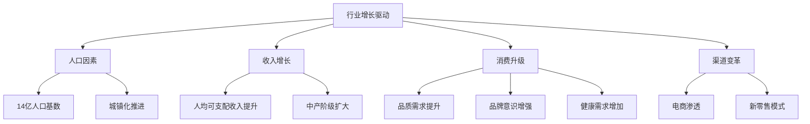
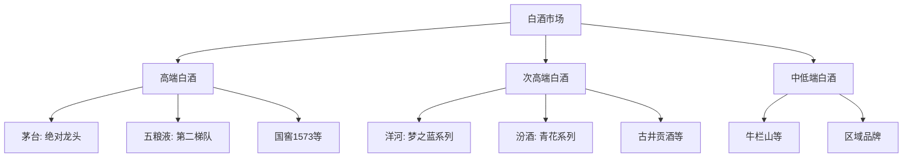

# 中国食品饮料行业分析

## 概述

食品饮料行业是中国消费板块的核心组成部分，具有需求刚性、现金流优秀、品牌护城河深厚等特点。本文深入分析行业结构、竞争格局和投资机会。

**学习目标**：
- 理解食品饮料行业的特点和价值
- 掌握各子行业的竞争格局
- 分析高端化、健康化趋势
- 识别优质投资标的
- 建立行业投资框架

**为什么重要**：
食品饮料是最优秀的长期投资赛道之一，诞生了茅台、伊利等超级牛股。理解这个行业对于价值投资者至关重要。

## 行业整体特征

### 1. 行业规模与增长

**市场规模**：
- 2023 年食品饮料行业总产值超过 10 万亿元
- 占社会消费品零售总额约 20%
- 年均增速 5-8%，高于 GDP 增速

**增长驱动因素**：

### 2. 行业核心特点

**需求刚性**：
- 食品饮料是生活必需品
- 需求相对稳定，抗周期性强
- 经济下行时影响相对较小

**品牌护城河**：
- 消费者品牌忠诚度高
- 品牌建设需要长期积累
- 新进入者难以撼动龙头地位

**现金流优秀**：
- 预收款模式（经销商打款）
- 库存周转快
- 资本开支低
- 自由现金流充沛

**高端化趋势**：
- 消费升级推动产品结构优化
- 高端产品毛利率更高
- 龙头企业受益明显

## 子行业分析

### 1. 白酒行业

**行业特点**：
- 中国特色消费品，文化属性强
- 高端白酒具有奢侈品属性
- 行业集中度持续提升
- 龙头企业定价权强

**竞争格局**：

**投资逻辑**：
- 高端白酒：稀缺性 + 社交属性 + 收藏价值
- 次高端：消费升级受益，增长空间大
- 关注品牌力、渠道力、提价能力

**关键指标**：
- 吨价：反映产品结构
- 渠道库存：健康度指标
- 预收款：需求景气度
- 毛利率：定价权体现

### 2. 乳制品行业

**行业特点**：
- 健康需求推动持续增长
- 双寡头格局稳定（伊利、蒙牛）
- 产品创新活跃
- 冷链物流是关键

**竞争格局**：
- 伊利：市占率约 25%，全品类领先
- 蒙牛：市占率约 22%，特仑苏高端化
- 光明、三元等区域品牌
- 新兴品牌：认养一头牛等

**细分品类**：
1. **常温奶**：规模最大，竞争激烈
2. **低温奶**：增长快，区域性强
3. **奶粉**：婴幼儿奶粉市场大
4. **酸奶**：创新活跃，高端化明显

**投资逻辑**：
- 龙头企业规模优势和品牌优势
- 高端化、功能化产品增长
- 渠道下沉带来增量
- 关注原奶成本波动

### 3. 调味品行业

**行业特点**：
- 生活必需品，需求稳定
- 客单价低，复购率高
- 品牌集中度提升
- 渠道为王

**竞争格局**：
- 酱油：海天味业一家独大（40%+市占率）
- 醋：恒顺醋业等区域品牌
- 复合调味品：颐海国际（火锅底料）
- 料酒：海天、恒顺等

**投资逻辑**：
- 龙头企业渠道优势明显
- 提价能力强（成本转嫁）
- 品类扩张带来增长
- 餐饮渠道恢复受益

### 4. 休闲食品行业

**行业特点**：
- 品类丰富，创新活跃
- 年轻化、个性化趋势
- 线上渠道占比高
- 竞争激烈，集中度低

**主要品类**：
- 坚果炒货：三只松鼠、洽洽食品
- 烘焙食品：桃李面包、达利食品
- 糖果巧克力：徐福记、费列罗
- 膨化食品：旺旺、好丽友

**投资逻辑**：
- 关注品类创新能力
- 线上运营能力
- 供应链效率
- 品牌年轻化

### 5. 饮料行业

**行业特点**：
- 品类多元，竞争激烈
- 健康化趋势明显
- 渠道和营销是关键
- 季节性波动

**主要品类**：
- 碳酸饮料：可口可乐、百事可乐
- 包装水：农夫山泉、怡宝
- 茶饮料：东方树叶、三得利
- 功能饮料：红牛、东鹏特饮
- 果汁：汇源、农夫果园

**投资逻辑**：
- 关注健康化产品（无糖、低糖）
- 品牌力和渠道力
- 产品创新能力
- 成本控制能力

## 行业投资逻辑

### 1. 高端化是核心主线

**高端化的驱动因素**：
- 收入增长支撑消费升级
- 品质需求提升
- 品牌意识增强
- 社交需求推动

**高端化的表现**：
- 产品结构持续优化
- 吨价持续提升
- 毛利率稳步上升
- 龙头企业受益明显

**投资机会**：
- 高端白酒：茅台、五粮液
- 高端乳制品：特仑苏、金典
- 高端调味品：海天高端系列
- 高端饮料：农夫山泉高端水

### 2. 品牌护城河是关键

**品牌价值的来源**：
- 长期积累的品牌认知
- 稳定的产品品质
- 情感连接和文化认同
- 消费习惯的形成

**品牌护城河的表现**：
- 高品牌溢价
- 强定价权
- 高消费者忠诚度
- 低营销费用率

**评估品牌力的指标**：
- 品牌知名度和美誉度
- 市场份额和份额趋势
- 价格带和价格稳定性
- 复购率和推荐率

### 3. 渠道控制力决定竞争力

**渠道的重要性**：
- 决定产品触达能力
- 影响市场反应速度
- 关系到库存健康度
- 体现企业管理能力

**渠道类型**：
1. **传统渠道**：经销商、批发、零售
2. **现代渠道**：KA 卖场、便利店
3. **餐饮渠道**：酒店、餐厅
4. **电商渠道**：天猫、京东、拼多多
5. **新零售**：社区团购、即时零售

**渠道竞争力评估**：
- 渠道覆盖广度和深度
- 渠道掌控能力
- 经销商管理能力
- 多渠道协同能力

### 4. 成本控制能力

**成本构成**：
- 原材料成本（50-70%）
- 包装成本（10-20%）
- 人工成本（5-10%）
- 营销费用（10-20%）

**成本优势来源**：
- 规模效应
- 供应链管理
- 生产效率
- 采购议价能力

**关注成本波动**：
- 原材料价格（粮食、奶源等）
- 包装材料价格
- 运输成本
- 人工成本

## 财务特征与估值

### 典型财务特征

**盈利能力**：
- 毛利率：30-80%（白酒最高）
- 净利率：10-40%
- ROE：15-30%
- ROIC：20-40%

**现金流特征**：
- 经营现金流 > 净利润
- 预收款模式
- 资本开支低
- 自由现金流充沛

**资产负债表**：
- 轻资产模式
- 存货周转快
- 应收账款少
- 负债率低

### 估值方法与水平

**PE 估值法**：
- 白酒：20-40 倍（茅台可更高）
- 乳制品：15-25 倍
- 调味品：25-35 倍
- 休闲食品：20-30 倍
- 饮料：20-35 倍

**估值影响因素**：
- 成长性：增速越高估值越高
- 确定性：确定性越强估值越高
- 品牌力：品牌越强估值越高
- 市场情绪：牛市估值扩张

**估值陷阱**：
- 不要只看静态 PE
- 关注 PEG 是否合理
- 评估长期成长空间
- 考虑周期性因素

## 投资机会与风险

### 投资机会

**1. 龙头企业持续受益**：
- 品牌集中度提升
- 规模优势扩大
- 渠道优势强化
- 马太效应明显

**2. 高端化持续推进**：
- 高端产品增速快
- 毛利率持续提升
- 盈利能力增强

**3. 健康化趋势**：
- 无糖饮料
- 有机食品
- 功能性产品
- 低脂低盐产品

**4. 渠道变革机会**：
- 电商渗透提升
- 新零售模式
- 直播带货
- 社区团购

### 主要风险

**1. 食品安全风险**：
- 质量问题影响品牌
- 监管趋严
- 舆论风险

**2. 原材料成本波动**：
- 粮食价格波动
- 奶源价格波动
- 包装材料涨价
- 压缩利润空间

**3. 竞争加剧风险**：
- 新品牌冲击
- 价格战
- 营销费用上升

**4. 政策监管风险**：
- 限制三公消费（白酒）
- 食品安全监管
- 广告营销限制
- 环保要求

## 投资策略

### 选股标准

**必备条件**：
- 行业龙头地位
- 品牌护城河深厚
- 财务健康，现金流好
- 管理层优秀
- 治理结构良好

**加分项**：
- 高端化进展顺利
- 渠道控制力强
- 产品创新能力
- 全国化布局
- 估值合理

### 组合配置建议

**核心持仓（60%）**：
- 白酒龙头：茅台、五粮液
- 乳制品龙头：伊利
- 调味品龙头：海天

**卫星持仓（40%）**：
- 次高端白酒：汾酒、洋河
- 细分龙头：颐海、桃李
- 成长股：新兴品牌

### 买卖时机

**买入时机**：
- 行业调整时（如白酒反腐）
- 个股利空出尽
- 估值回到合理区间
- 基本面向好

**卖出时机**：
- 基本面恶化
- 估值严重高估
- 行业逻辑改变
- 更好机会出现

## 研究框架

### 行业研究要点

**供给端**：
- [ ] 产能情况
- [ ] 竞争格局
- [ ] 集中度趋势
- [ ] 新进入者

**需求端**：
- [ ] 市场规模
- [ ] 增长趋势
- [ ] 消费者偏好
- [ ] 渗透率

**价格**：
- [ ] 提价空间
- [ ] 价格带分布
- [ ] 价格竞争态势

**渠道**：
- [ ] 渠道结构
- [ ] 渠道变革
- [ ] 库存健康度

### 公司研究要点

**品牌力**：
- [ ] 品牌知名度
- [ ] 品牌美誉度
- [ ] 品牌溢价能力
- [ ] 消费者忠诚度

**产品力**：
- [ ] 产品结构
- [ ] 产品创新
- [ ] 品质稳定性
- [ ] 差异化优势

**渠道力**：
- [ ] 渠道覆盖
- [ ] 渠道掌控
- [ ] 经销商管理
- [ ] 多渠道协同

**财务健康**：
- [ ] 盈利能力
- [ ] 现金流
- [ ] 资产质量
- [ ] 负债水平

## 实战案例

### 案例 1：茅台的投资价值

**投资逻辑**：
- 高端白酒绝对龙头
- 品牌护城河极深
- 供需长期失衡
- 定价权极强

**财务表现**：
- ROE 持续 30%+
- 毛利率 90%+
- 净利率 50%+
- 现金流充沛

**长期回报**：
- 2013-2023：约 15 倍
- 年化收益率：约 30%

### 案例 2：伊利的成长之路

**投资逻辑**：
- 乳制品行业龙头
- 全品类领先
- 渠道优势明显
- 管理优秀

**成长路径**：
- 规模扩张
- 高端化
- 全国化
- 国际化

**投资回报**：
- 2013-2023：约 8 倍
- 年化收益率：约 22%

## 延伸阅读

### 推荐书籍

1. **《定位》** - 艾·里斯、杰克·特劳特
   - 品牌定位理论

2. **《品牌22律》** - 艾·里斯、劳拉·里斯
   - 品牌建设规律

3. **《长期主义》** - 高瓴资本
   - 消费投资理念

### 研究报告

- 中金公司：食品饮料行业深度报告
- 招商证券：白酒行业策略报告
- 国泰君安：乳制品行业研究
- 各公司年报和投资者交流会纪要

## 参考文献

1. 国家统计局. 《中国统计年鉴》. 2023
2. 中国食品工业协会. 《行业发展报告》. 2023
3. 高瓴资本. 《消费投资方法论》. 2021
4. 邱国鹭. 《投资中最简单的事》. 2014
5. 中金公司. 《食品饮料行业深度报告》. 2023
6. 招商证券. 《白酒行业策略报告》. 2023
7. 贵州茅台年报. 2013-2023
8. 伊利股份年报. 2013-2023
9. 海天味业年报. 2014-2023
10. 尼尔森. 《中国消费者信心指数》. 2023

---

**下一步学习**：
- 深入研究贵州茅台案例
- 分析五粮液竞争策略
- 学习伊利的成长路径
- 了解调味品行业格局
