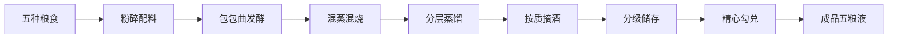
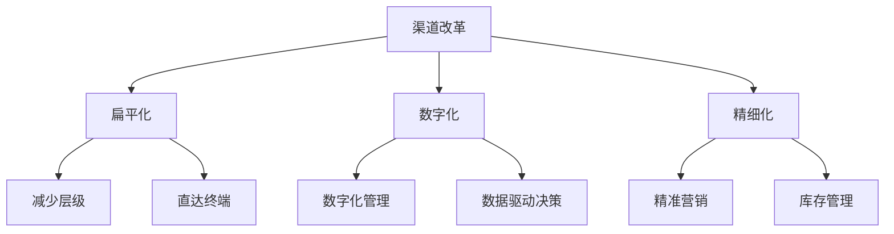

# 五粮液 - 中国白酒第二品牌

## 概述

五粮液是中国高端白酒的第二品牌，仅次于茅台。本文分析五粮液的商业模式、竞争优势、发展策略和投资价值。

**学习目标**：
- 理解五粮液的商业模式和产品体系
- 分析五粮液与茅台的差异
- 评估五粮液的竞争地位和增长潜力
- 掌握次高端白酒的投资逻辑
- 学习品牌定位和渠道策略

**为什么重要**：
五粮液作为高端白酒第二品牌，具有独特的投资价值。理解五粮液可以帮助投资者把握次高端白酒的投资机会。

## 公司概况

### 基本信息

**公司全称**：宜宾五粮液股份有限公司
**股票代码**：000858.SZ
**成立时间**：1997 年（改制）
**上市时间**：1998 年
**总部位置**：四川省宜宾市
**主营业务**：五粮液系列酒的生产与销售

**市值规模**（2023）：
- 总市值：约 7000-8000 亿元
- A 股白酒行业第二
- 深市市值前十

### 发展历程

**历史沿革**：
- 1909 年：前身"利川永"酒坊创立
- 1952 年：国营宜宾五粮液酒厂成立
- 1997 年：股份公司改制
- 1998 年：深圳证券交易所上市
- 2000s：快速扩张，成为行业龙头之一
- 2010s：品牌整顿，聚焦主品牌
- 2020s：高端化战略，缩小与茅台差距

## 商业模式分析

### 核心产品

**产品矩阵**：

1. **五粮液（核心产品）**：
   - 52 度 500ml
   - 出厂价：889 元/瓶（2023）
   - 市场价：900-1000 元/瓶
   - 占营收 70%+

2. **五粮液系列**：
   - 五粮春
   - 五粮醇
   - 尖庄
   - 占营收 20%

3. **其他产品**：
   - 五粮液 1618
   - 五粮液经典
   - 占营收 10%

**产品特点**：
- 浓香型白酒代表
- 五种粮食酿造（高粱、大米、糯米、小麦、玉米）
- 独特的"包包曲"工艺
- 窖池历史悠久（明代古窖）

### 生产模式

**酿造工艺**：

**产能情况**：
- 基酒产能：约 20 万吨/年
- 成品酒产能：约 15 万吨/年
- 产能利用率：80-90%
- 扩产空间：相对充足

### 销售模式

**渠道结构**：
- 经销商体系：约 3000 家
- 直销渠道：团购、直营店
- 电商渠道：天猫、京东
- 渠道改革：扁平化、数字化

**价格体系**：
- 出厂价：889 元/瓶
- 批价：900-950 元/瓶
- 终端价：900-1000 元/瓶
- 价差较小，渠道利润有限

## 竞争地位分析

### 与茅台的对比

| 维度 | 五粮液 | 茅台 |
|------|--------|------|
| 香型 | 浓香型 | 酱香型 |
| 品牌力 | ★★★★ | ★★★★★ |
| 稀缺性 | 较高 | 极高 |
| 定价权 | 强 | 极强 |
| 出厂价 | 889 元 | 969 元 |
| 市场价 | 900-1000 元 | 2500-3000 元 |
| 毛利率 | 75% | 93% |
| 产能 | 15 万吨 | 4 万吨 |
| 市占率 | 20% | 60% |

### 竞争优势

**1. 品牌优势**：
- 中国名酒
- 浓香型白酒代表
- 历史悠久
- 全国知名度高

**2. 产品优势**：
- 五粮酿造，口感独特
- 明代古窖，历史底蕴
- 产品线丰富
- 品质稳定

**3. 渠道优势**：
- 渠道覆盖广
- 经销商网络完善
- 渠道改革成效显著
- 数字化转型领先

**4. 规模优势**：
- 产能充足
- 成本控制能力强
- 供应链完善
- 抗风险能力强

### 竞争劣势

**1. 品牌力弱于茅台**：
- 品牌溢价能力有限
- 稀缺性不足
- 收藏价值较低

**2. 定价权受限**：
- 市场价接近出厂价
- 提价空间有限
- 渠道利润薄

**3. 产品结构待优化**：
- 低端产品占比高
- 高端化进展慢
- 品牌形象需提升

## 发展战略

### 高端化战略

**战略目标**：
- 缩小与茅台的差距
- 提升品牌价值
- 优化产品结构
- 提高盈利能力

**具体措施**：
1. **聚焦主品牌**：
   - 减少子品牌数量
   - 集中资源打造五粮液主品牌
   - 提升品牌形象

2. **产品升级**：
   - 推出超高端产品（五粮液 1618）
   - 优化产品结构
   - 提升产品品质

3. **渠道改革**：
   - 扁平化渠道
   - 数字化转型
   - 提升渠道掌控力

4. **价格管理**：
   - 控量保价
   - 提升出厂价
   - 稳定市场价

### 渠道改革

**改革方向**：

**改革成效**：
- 渠道效率提升
- 库存健康度改善
- 价格体系稳定
- 终端掌控力增强

## 财务分析

### 盈利能力

**营收规模**：
- 2023 年营收：约 700 亿元
- 近 10 年 CAGR：约 12%
- 增长稳定

**利润水平**：
- 2023 年净利润：约 250 亿元
- 净利率：约 35%
- 近 10 年 CAGR：约 15%

**盈利能力指标**：
| 指标 | 五粮液 | 茅台 | 行业平均 |
|------|--------|------|----------|
| 毛利率 | 75% | 93% | 60% |
| 净利率 | 35% | 50% | 20% |
| ROE | 25% | 30%+ | 15% |
| ROIC | 30% | 40%+ | 20% |

### 现金流分析

**经营现金流**：
- 经营现金流 > 净利润
- 现金流质量好
- 预收款模式
- 应收账款少

**自由现金流**：
- 资本开支适中
- 自由现金流充沛
- 分红能力强

### 资产负债表

**资产结构**：
- 轻资产模式
- 固定资产占比适中
- 货币资金充裕
- 存货（基酒）价值高

**负债结构**：
- 有息负债少
- 预收款占比高
- 资产负债率低（30%左右）
- 财务健康

### 分红政策

**分红比例**：
- 分红率：40-50%
- 股息率：2-3%
- 持续稳定分红

## 投资价值分析

### 投资逻辑

**核心逻辑**：
1. **消费升级受益**：
   - 高端白酒需求增长
   - 品牌力提升
   - 产品结构优化

2. **改革红利释放**：
   - 渠道改革成效显著
   - 管理效率提升
   - 盈利能力增强

3. **估值相对合理**：
   - PE 低于茅台
   - 成长性好
   - 安全边际高

4. **分红稳定**：
   - 股息率高于茅台
   - 现金流充沛
   - 分红可持续

### 增长驱动

**短期驱动**：
- 渠道改革成效
- 产品结构优化
- 提价预期

**中期驱动**：
- 高端化战略推进
- 品牌力提升
- 市占率提升

**长期驱动**：
- 消费升级持续
- 品牌价值增长
- 行业集中度提升

### 估值水平

**历史 PE 区间**：15-30 倍
**合理 PE**：20-25 倍
**当前 PE**（2023）：约 22 倍
**估值评估**：合理偏低

**与茅台估值对比**：
- 茅台 PE：30 倍
- 五粮液 PE：22 倍
- 估值折价：约 25%
- 折价合理性：品牌力差距

## 投资风险

### 主要风险

**1. 竞争风险**：
- 茅台挤压
- 其他品牌追赶
- 市场份额压力

**2. 改革风险**：
- 改革进展不及预期
- 渠道调整阵痛
- 管理层变动

**3. 宏观风险**：
- 经济下行
- 消费疲软
- 政策变化

**4. 估值风险**：
- 估值波动
- 市场情绪
- 流动性风险

### 风险应对

**分散投资**：
- 不要满仓
- 配置其他资产
- 保持流动性

**长期持有**：
- 享受改革红利
- 不被短期波动干扰
- 获取分红收益

**合理估值买入**：
- PE 20 倍以下买入
- 分批建仓
- 保持耐心

## 投资策略建议

### 买入时机

**好的买入时机**：
- 行业调整时
- 估值回落时（PE < 20）
- 改革进展顺利时
- 市场恐慌时

### 持有策略

**持有周期**：3-5 年
**仓位建议**：10-20%（消费板块内）
**再平衡**：年度调整

### 卖出时机

**考虑卖出**：
- 估值过高（PE > 30）
- 改革受挫
- 基本面恶化
- 更好机会出现

## 与茅台的投资选择

### 选择标准

**选择茅台的理由**：
- 追求确定性
- 长期持有
- 不在乎估值
- 追求品牌溢价

**选择五粮液的理由**：
- 追求性价比
- 看好改革红利
- 估值敏感
- 追求高股息

**组合配置建议**：
- 茅台：五粮液 = 2:1 或 3:1
- 茅台作为核心持仓
- 五粮液作为卫星持仓
- 享受不同风险收益特征

## 延伸阅读

### 推荐书籍

1. **《五粮液传》**
   - 五粮液发展史

2. **《白酒投资指南》**
   - 白酒行业投资

3. **《投资中最简单的事》** - 邱国鹭
   - 消费投资理念

### 研究报告

- 中金公司：五粮液深度报告
- 招商证券：白酒行业策略
- 国泰君安：五粮液投资价值分析

## 参考文献

1. 五粮液年报. 2013-2023
2. 中金公司. 《五粮液深度报告》. 2023
3. 招商证券. 《白酒行业策略报告》. 2023
4. 国泰君安. 《五粮液投资价值分析》. 2022
5. 中国酒业协会. 《白酒行业发展报告》. 2023
6. 邱国鹭. 《投资中最简单的事》. 2014
7. 五粮液投资者交流会纪要. 2018-2023
8. 高瓴资本. 《消费投资方法论》. 2021
9. 贝恩公司. 《中国奢侈品市场研究》. 2023
10. 尼尔森. 《中国消费者信心指数》. 2023

---

**关键启示**：
- 五粮液是高端白酒第二品牌
- 改革红利值得期待
- 估值相对合理，性价比高
- 适合作为茅台的补充配置

**下一步学习**：
- 研究其他次高端白酒
- 分析白酒行业竞争格局
- 学习渠道改革案例
- 研究消费品牌定位策略

## 深度分析

### 核心机制解析

理解本主题需要从多个维度进行系统性分析。以下从理论基础、实践应用和历史验证三个层面展开深度探讨。

**理论基础层面**：本主题的核心逻辑建立在经济学和金融学的基本原理之上。通过对基础理论的深入理解，投资者能够建立起稳固的分析框架，避免被市场短期噪音所干扰。

**实践应用层面**：理论必须与实践相结合才能产生价值。在实际投资决策中，需要将抽象的概念转化为具体的分析工具和决策标准。

**历史验证层面**：金融市场有着丰富的历史记录，通过研究历史案例，我们可以验证理论的有效性，并从中提炼出具有普遍意义的规律。

### 关键影响因素

影响本主题的关键因素可以从以下几个维度进行分析：

1. **宏观经济环境**：利率水平、通货膨胀率、经济增长速度等宏观变量对本主题有着深远影响。在不同的宏观经济周期中，相关指标的表现会呈现出显著差异。

2. **市场结构因素**：市场参与者的构成、信息传播机制、流动性状况等市场结构因素决定了价格发现的效率和准确性。

3. **政策监管环境**：政府政策、监管框架的变化会直接影响相关市场的运作规则和参与者行为。

4. **技术创新驱动**：技术进步不断改变着金融市场的运作方式，从算法交易到区块链技术，每一次技术革新都带来新的机遇和挑战。

5. **全球化与地缘政治**：在全球化背景下，各国市场之间的联动性日益增强，地缘政治风险的影响也越来越不可忽视。

### 量化分析框架

为了更精确地分析和评估，可以采用以下量化框架：

| 分析维度 | 关键指标 | 参考基准 | 分析方法 |
|---------|---------|---------|---------|
| 规模评估 | 绝对值与相对值 | 历史均值 | 趋势分析 |
| 质量评估 | 稳定性指标 | 行业对标 | 横向比较 |
| 风险评估 | 波动率指标 | 风险阈值 | 情景分析 |
| 价值评估 | 估值倍数 | 历史区间 | 回归分析 |

通过系统性地应用上述框架，投资者可以对目标进行全面、客观的评估，从而做出更加理性的投资决策。

