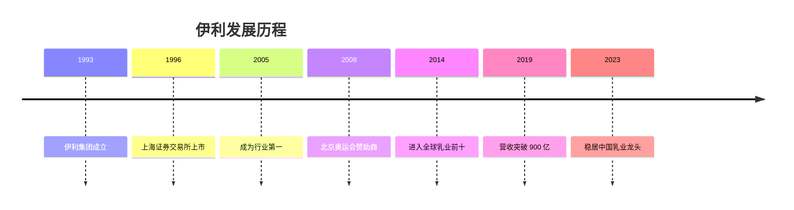
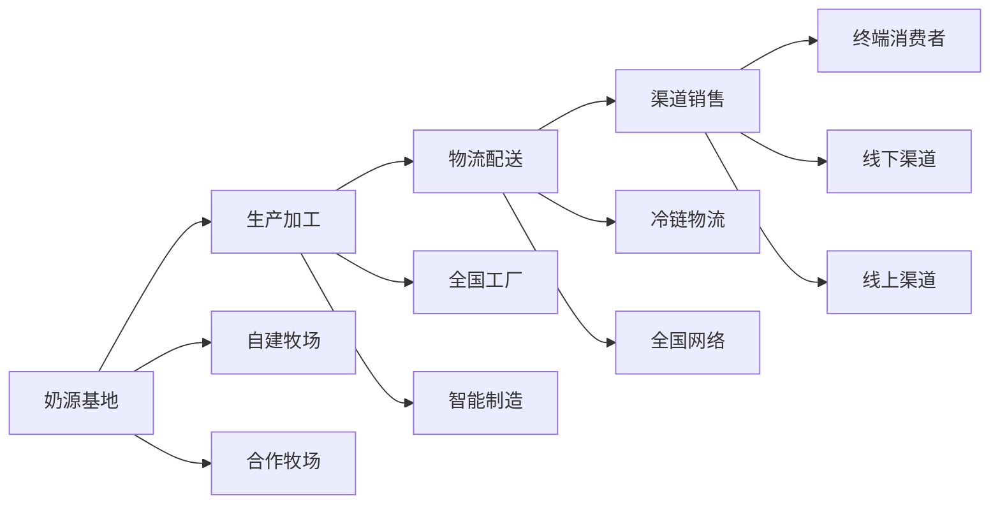

# 伊利股份 - 中国乳业龙头

## 概述

伊利股份是中国乳制品行业的绝对龙头，市占率第一，全品类领先。本文分析伊利的商业模式、竞争优势和长期投资价值。

**学习目标**：
- 理解伊利的商业模式和产品体系
- 分析伊利的竞争优势和护城河
- 评估伊利的成长路径和增长潜力
- 掌握乳制品行业的投资逻辑
- 学习全国化品牌的打造方法

**为什么重要**：
伊利是中国消费品行业的优秀代表，过去 20 年持续增长，为投资者创造了丰厚回报。理解伊利可以学习如何投资优质消费品企业。

## 公司概况

### 基本信息

**公司全称**：内蒙古伊利实业集团股份有限公司
**股票代码**：600887.SH
**成立时间**：1993 年
**上市时间**：1996 年
**总部位置**：内蒙古呼和浩特
**主营业务**：乳制品的研发、生产和销售

**市值规模**（2023）：
- 总市值：约 2000-2500 亿元
- A 股食品饮料行业前五
- 乳制品行业第一

### 发展历程

**关键里程碑**：

## 商业模式分析

### 核心产品

**产品矩阵**：

1. **液态奶（核心业务）**：
   - 常温奶：金典、安慕希、纯牛奶
   - 低温奶：鲜牛奶、酸奶
   - 占营收 70%+

2. **奶粉**：
   - 婴幼儿奶粉：金领冠系列
   - 成人奶粉
   - 占营收 15-20%

3. **冷饮**：
   - 冰淇淋：巧乐兹、甄稀等
   - 占营收 5-10%

4. **其他**：
   - 奶酪、黄油等
   - 占营收 5%

**产品特点**：
- 全品类覆盖
- 高中低端齐全
- 创新能力强
- 品质稳定

### 生产模式

**产业链布局**：

**产能布局**：
- 全国 80+ 个生产基地
- 覆盖所有省份
- 产能充足
- 就近生产，降低成本

### 销售模式

**渠道结构**：
- 线下渠道：KA 卖场、便利店、传统渠道
- 线上渠道：天猫、京东、拼多多
- 餐饮渠道：酒店、餐厅
- 特殊渠道：学校、医院

**渠道优势**：
- 渠道覆盖最广
- 深度分销能力强
- 终端掌控力强
- 多渠道协同

## 竞争地位分析

### 市场份额

**整体市场**：
- 伊利市占率：约 25%
- 行业第一
- 份额持续提升

**细分市场**：
- 常温奶：第一（30%+）
- 低温奶：第一（20%+）
- 奶粉：前三（15%+）
- 冷饮：前三（10%+）

### 与蒙牛的对比

| 维度 | 伊利 | 蒙牛 |
|------|------|------|
| 市占率 | 25% | 22% |
| 营收 | 1200 亿+ | 900 亿+ |
| 净利润 | 90 亿+ | 50 亿+ |
| 毛利率 | 38% | 35% |
| 净利率 | 7.5% | 5.5% |
| ROE | 20%+ | 15%+ |
| 品牌力 | ★★★★★ | ★★★★ |

### 竞争优势

**1. 品牌优势**：
- 全品类第一品牌
- 品牌知名度最高
- 消费者信任度高
- 品牌价值大

**2. 规模优势**：
- 行业最大规模
- 成本控制能力强
- 采购议价能力强
- 抗风险能力强

**3. 渠道优势**：
- 渠道覆盖最广
- 深度分销能力强
- 终端掌控力强
- 多渠道协同

**4. 产品优势**：
- 全品类覆盖
- 创新能力强
- 品质稳定
- 高端化领先

**5. 管理优势**：
- 管理团队稳定
- 执行力强
- 激励机制完善
- 企业文化好

## 成长路径

### 全国化扩张

**扩张策略**：
1. **产能布局**：全国建厂，就近生产
2. **渠道下沉**：覆盖低线城市和农村
3. **品牌推广**：全国性营销
4. **产品创新**：满足不同区域需求

**扩张成效**：
- 从区域品牌到全国品牌
- 市占率持续提升
- 规模效应显现
- 盈利能力增强

### 高端化升级

**高端化战略**：
- 推出高端产品：金典、安慕希
- 提升产品结构
- 提高毛利率
- 增强品牌力

**高端化成效**：
- 高端产品占比提升
- 毛利率稳步上升
- 品牌形象提升
- 盈利能力增强

### 国际化布局

**国际化策略**：
- 海外并购：新西兰、欧洲等
- 全球资源整合
- 国际品牌引进
- 出口业务拓展

**国际化进展**：
- 进入全球乳业前十
- 海外收入占比提升
- 国际竞争力增强

## 财务分析

### 盈利能力

**营收规模**：
- 2023 年营收：约 1200 亿元
- 近 10 年 CAGR：约 10%
- 增长稳定

**利润水平**：
- 2023 年净利润：约 90 亿元
- 净利率：约 7.5%
- 近 10 年 CAGR：约 15%

**盈利能力指标**：
| 指标 | 伊利 | 蒙牛 | 行业平均 |
|------|------|------|----------|
| 毛利率 | 38% | 35% | 30% |
| 净利率 | 7.5% | 5.5% | 5% |
| ROE | 20%+ | 15%+ | 12% |
| ROIC | 18% | 13% | 10% |

### 现金流分析

**经营现金流**：
- 经营现金流 > 净利润
- 现金流质量好
- 回款能力强

**自由现金流**：
- 资本开支适中
- 自由现金流充沛
- 分红能力强

### 资产负债表

**资产结构**：
- 固定资产占比适中
- 存货周转快
- 应收账款少
- 货币资金充裕

**负债结构**：
- 有息负债适中
- 资产负债率健康（50%左右）
- 财务风险可控

### 分红政策

**分红比例**：
- 分红率：30-40%
- 股息率：2-3%
- 持续稳定分红

## 投资价值分析

### 投资逻辑

**核心逻辑**：
1. **行业龙头地位稳固**：
   - 市占率第一
   - 全品类领先
   - 规模优势明显

2. **成长性好**：
   - 渠道下沉空间大
   - 高端化持续推进
   - 国际化拓展
   - 品类扩张

3. **盈利能力提升**：
   - 规模效应
   - 产品结构优化
   - 管理效率提升

4. **估值合理**：
   - PE 15-20 倍
   - PEG < 1
   - 安全边际高

### 增长驱动

**短期驱动**：
- 渠道下沉
- 产品创新
- 市占率提升

**中期驱动**：
- 高端化推进
- 品类扩张
- 国际化布局

**长期驱动**：
- 消费升级
- 健康需求增长
- 行业集中度提升

### 估值水平

**历史 PE 区间**：12-25 倍
**合理 PE**：15-20 倍
**当前 PE**（2023）：约 18 倍
**估值评估**：合理

## 投资风险

### 主要风险

**1. 原材料成本波动**：
- 奶源价格波动
- 包装材料涨价
- 压缩利润空间

**2. 食品安全风险**：
- 质量问题影响品牌
- 监管趋严
- 舆论风险

**3. 竞争加剧风险**：
- 蒙牛追赶
- 新品牌冲击
- 价格战

**4. 宏观经济风险**：
- 经济下行
- 消费疲软
- 收入预期下降

### 风险应对

**分散投资**：
- 配置其他消费股
- 保持适度现金
- 控制单一个股比例

**长期持有**：
- 享受成长红利
- 不被短期波动干扰
- 获取分红收益

## 投资策略建议

### 买入时机

**好的买入时机**：
- 行业调整时
- 估值回落时（PE < 15）
- 原材料成本下降时
- 市场恐慌时

### 持有策略

**持有周期**：3-5 年
**仓位建议**：10-15%（消费板块内）
**再平衡**：年度调整

### 卖出时机

**考虑卖出**：
- 估值过高（PE > 25）
- 基本面恶化
- 食品安全事故
- 更好机会出现

## 延伸阅读

### 推荐书籍

1. **《伊利之道》**
   - 伊利发展史

2. **《长期主义》** - 高瓴资本
   - 消费投资理念

3. **《投资中最简单的事》** - 邱国鹭
   - 消费股投资

### 研究报告

- 中金公司：伊利股份深度报告
- 招商证券：乳制品行业研究
- 国泰君安：伊利投资价值分析

## 参考文献

1. 伊利股份年报. 2013-2023
2. 中金公司. 《伊利股份深度报告》. 2023
3. 招商证券. 《乳制品行业研究》. 2023
4. 国泰君安. 《伊利投资价值分析》. 2022
5. 中国乳制品工业协会. 《行业发展报告》. 2023
6. 邱国鹭. 《投资中最简单的事》. 2014
7. 高瓴资本. 《消费投资方法论》. 2021
8. 伊利股份投资者交流会纪要. 2018-2023
9. 尼尔森. 《中国消费者信心指数》. 2023
10. 贝恩公司. 《中国消费市场研究》. 2023

---

**关键启示**：
- 伊利是中国乳业绝对龙头
- 全品类领先，竞争优势明显
- 成长性好，估值合理
- 适合长期持有

**下一步学习**：
- 研究蒙牛的竞争策略
- 分析乳制品行业格局
- 学习全国化品牌打造
- 研究其他食品饮料龙头

## 深度分析

### 核心机制解析

理解本主题需要从多个维度进行系统性分析。以下从理论基础、实践应用和历史验证三个层面展开深度探讨。

**理论基础层面**：本主题的核心逻辑建立在经济学和金融学的基本原理之上。通过对基础理论的深入理解，投资者能够建立起稳固的分析框架，避免被市场短期噪音所干扰。

**实践应用层面**：理论必须与实践相结合才能产生价值。在实际投资决策中，需要将抽象的概念转化为具体的分析工具和决策标准。

**历史验证层面**：金融市场有着丰富的历史记录，通过研究历史案例，我们可以验证理论的有效性，并从中提炼出具有普遍意义的规律。

### 关键影响因素

影响本主题的关键因素可以从以下几个维度进行分析：

1. **宏观经济环境**：利率水平、通货膨胀率、经济增长速度等宏观变量对本主题有着深远影响。在不同的宏观经济周期中，相关指标的表现会呈现出显著差异。

2. **市场结构因素**：市场参与者的构成、信息传播机制、流动性状况等市场结构因素决定了价格发现的效率和准确性。

3. **政策监管环境**：政府政策、监管框架的变化会直接影响相关市场的运作规则和参与者行为。

4. **技术创新驱动**：技术进步不断改变着金融市场的运作方式，从算法交易到区块链技术，每一次技术革新都带来新的机遇和挑战。

5. **全球化与地缘政治**：在全球化背景下，各国市场之间的联动性日益增强，地缘政治风险的影响也越来越不可忽视。

### 量化分析框架

为了更精确地分析和评估，可以采用以下量化框架：

| 分析维度 | 关键指标 | 参考基准 | 分析方法 |
|---------|---------|---------|---------|
| 规模评估 | 绝对值与相对值 | 历史均值 | 趋势分析 |
| 质量评估 | 稳定性指标 | 行业对标 | 横向比较 |
| 风险评估 | 波动率指标 | 风险阈值 | 情景分析 |
| 价值评估 | 估值倍数 | 历史区间 | 回归分析 |

通过系统性地应用上述框架，投资者可以对目标进行全面、客观的评估，从而做出更加理性的投资决策。

## 高级分析与前沿研究

### 学术研究进展

近年来，学术界对本领域的研究取得了重要进展。以下是几个值得关注的研究方向：

**行为金融学视角**：传统金融理论假设市场参与者是完全理性的，但行为金融学的研究表明，认知偏差和情绪因素在投资决策中扮演着重要角色。诺贝尔经济学奖得主丹尼尔·卡尼曼（Daniel Kahneman）和理查德·塞勒（Richard Thaler）的研究为我们理解市场非理性行为提供了重要框架。

**因子投资研究**：尤金·法玛（Eugene Fama）和肯尼斯·弗伦奇（Kenneth French）的三因子模型，以及后续发展的五因子模型，为系统性地解释股票收益差异提供了理论基础。这些研究表明，市值、账面市值比、盈利能力和投资模式等因子能够解释大部分股票收益的横截面差异。

**市场微观结构研究**：对市场流动性、价格发现机制和交易成本的深入研究，帮助我们更好地理解市场的运作机制，并为优化交易策略提供指导。

### 实战案例深度解析

**案例一：长期价值创造的典范**

以沃伦·巴菲特（Warren Buffett）的伯克希尔·哈撒韦（Berkshire Hathaway）为例，其长达数十年的卓越投资业绩证明了价值投资理念的有效性。从1965年至今，伯克希尔的账面价值年均增长率约为19.8%，远超同期标普500指数的约10.2%年均回报。

巴菲特的成功秘诀在于：
- 专注于具有持久竞争优势的优质企业
- 以合理价格买入，而非追求最低价格
- 长期持有，让复利效应充分发挥
- 保持充足的安全边际，控制下行风险

**案例二：危机中的机遇识别**

2008年金融危机期间，大多数投资者恐慌性抛售，但少数具有前瞻性的投资者却在危机中发现了历史性的投资机会。约翰·保尔森（John Paulson）通过做空次级抵押贷款相关证券，在危机中获得了约150亿美元的利润，成为金融史上最成功的单笔交易之一。

这个案例告诉我们：
- 深入的基本面研究能够发现市场定价错误
- 逆向思维往往能够发现被市场忽视的机会
- 风险管理和仓位控制是成功的关键

### 跨市场比较分析

不同市场在结构、监管、投资者构成等方面存在显著差异，这些差异对投资策略的选择有重要影响：

**美国市场特征**：
- 机构投资者主导，市场效率较高
- 信息披露制度完善，分析师覆盖广泛
- 衍生品市场发达，对冲工具丰富
- 长期牛市历史，但也经历过多次重大调整

**中国市场特征**：
- 散户投资者比例较高，市场波动性较大
- 政策因素影响显著，需要密切关注监管动向
- 新兴行业发展迅速，成长投资机会丰富
- A股、港股、美股中概股形成多层次市场体系

**欧洲市场特征**：
- 价值股比例较高，估值相对保守
- 受地缘政治和欧元区政策影响较大
- 部分行业（如奢侈品、工业）具有全球竞争优势
- ESG投资理念推广较为领先

