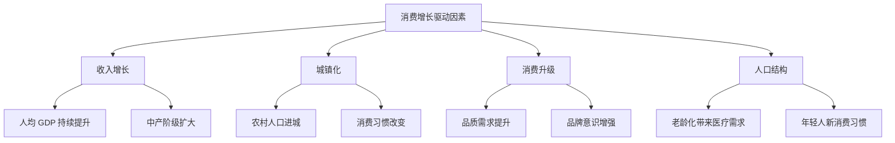
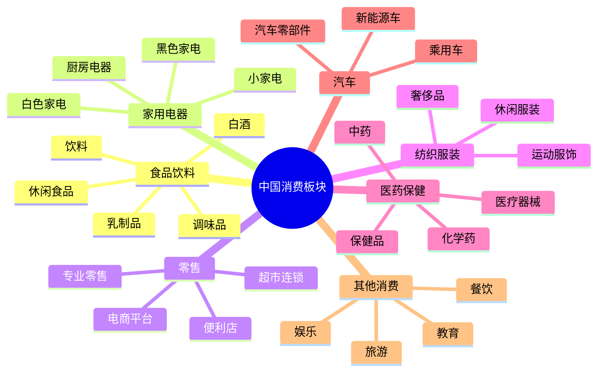

# 中国消费板块总览

## 概述

中国消费板块是 A 股市场最重要的投资领域之一，受益于中国庞大的人口基数、持续的消费升级和中产阶级崛起。本文全面分析中国消费市场的结构、特点、投资逻辑和长期机会。

**学习目标**：
- 理解中国消费市场的独特性和发展阶段
- 掌握消费板块的细分行业和投资逻辑
- 分析消费升级趋势和结构性机会
- 识别优质消费企业的核心特征
- 建立中国消费投资的分析框架

**为什么重要**：
中国拥有 14 亿人口和全球最大的中等收入群体，消费市场规模巨大且持续增长。消费板块诞生了茅台、美的、腾讯等世界级企业，是长期投资者获取稳定回报的重要来源。

## 中国消费市场特征

### 1. 市场规模与增长

**庞大的市场基础**：
- 14 亿人口，全球最大单一市场
- 2023 年社会消费品零售总额超过 47 万亿元
- 中等收入群体超过 4 亿人
- 城镇化率约 65%，仍有提升空间

**持续的增长动力**：

### 2. 消费升级趋势

**从量到质的转变**：
- 基本需求满足后追求品质
- 从价格敏感到价值认同
- 从功能消费到体验消费
- 从模仿型到个性化消费

**消费升级的表现**：
1. **品牌化**：愿意为品牌支付溢价
2. **高端化**：高端产品份额提升
3. **服务化**：服务消费占比上升
4. **健康化**：健康、环保产品受青睐
5. **便利化**：线上消费、即时配送

### 3. 区域差异显著

**多层次市场结构**：
- 一线城市：消费成熟，追求品质和个性
- 二三线城市：消费升级主战场
- 四五线及农村：基础消费增长，下沉市场潜力

**区域消费特点**：
- 东部沿海：消费能力强，接受新事物快
- 中西部：增长潜力大，性价比需求高
- 南北差异：饮食、气候导致消费偏好不同

## 消费板块细分结构

### 核心子行业分类

### 1. 食品饮料行业

**行业特点**：
- 需求刚性，抗周期性强
- 品牌护城河深厚
- 高端化趋势明显
- 现金流优秀

**核心子行业**：
- **白酒**：高端白酒具有奢侈品属性，茅台、五粮液等龙头企业定价权强
- **乳制品**：健康需求推动，伊利、蒙牛双寡头格局
- **调味品**：必需品，海天味业等龙头市占率提升
- **休闲食品**：年轻化、多元化，品类创新活跃

**投资逻辑**：
- 寻找具有品牌护城河的龙头企业
- 关注高端化、健康化趋势
- 重视渠道控制力和定价权
- 优秀的现金流和分红能力

### 2. 家用电器行业

**行业特点**：
- 中国制造优势明显
- 规模效应显著
- 技术迭代推动更新需求
- 出口占比高

**核心子行业**：
- **白色家电**：空调、冰箱、洗衣机，美的、格力、海尔三强格局
- **小家电**：品类丰富，创新驱动，九阳、苏泊尔等
- **厨房电器**：消费升级受益，老板电器、方太等

**投资逻辑**：
- 关注龙头企业的规模优势和成本控制
- 重视研发创新和产品升级
- 关注海外市场拓展
- 智能化、高端化趋势

### 3. 零售行业

**行业特点**：
- 线上线下融合加速
- 平台经济主导
- 供应链效率是核心竞争力
- 消费数据价值凸显

**核心子行业**：
- **电商平台**：阿里巴巴、京东、拼多多三足鼎立
- **超市连锁**：永辉、家家悦等区域龙头
- **便利店**：城市化推动，7-11、罗森等
- **专业零售**：垂直品类，如名创优品

**投资逻辑**：
- 平台型企业的网络效应
- 供应链和物流效率
- 用户规模和活跃度
- 盈利模式的可持续性

## 中国消费投资逻辑

### 1. 长期投资价值

**消费股的优势**：
- **需求稳定**：刚性需求，抗周期
- **现金流好**：轻资产，高周转
- **品牌护城河**：难以复制的竞争优势
- **定价权**：优质品牌可以提价
- **复利效应**：长期稳定增长

**适合长期持有的特征**：
- 行业空间大，渗透率仍有提升
- 龙头地位稳固，市占率持续提升
- 品牌力强，消费者忠诚度高
- 管理层优秀，治理结构良好
- 财务健康，现金流充沛

### 2. 选股核心要素

**品牌力评估**：
- 品牌知名度和美誉度
- 消费者复购率
- 品牌溢价能力
- 品牌延伸能力

**渠道控制力**：
- 渠道覆盖广度和深度
- 渠道掌控能力
- 线上线下融合程度
- 经销商管理能力

**产品竞争力**：
- 产品差异化
- 技术含量
- 品质稳定性
- 创新能力

**财务指标**：
- ROE 持续高于 15%
- 毛利率和净利率趋势
- 经营现金流 > 净利润
- 资产负债率健康
- 存货周转率

### 3. 估值方法

**消费股估值特点**：
- 通常享有估值溢价
- 成长性和确定性决定估值水平
- 品牌价值难以量化但很重要

**常用估值方法**：

1. **PE 估值法**：
   - 白酒：15-30 倍 PE（高端白酒可更高）
   - 家电：10-20 倍 PE
   - 零售：20-40 倍 PE（平台型更高）

2. **PEG 估值法**：
   - 适合成长型消费股
   - PEG < 1 通常被认为低估

3. **DCF 估值法**：
   - 适合现金流稳定的成熟企业
   - 关键是增长率和折现率假设

## 投资机会与风险

### 结构性投资机会

**1. 消费升级主线**：
- 高端白酒：茅台、五粮液
- 高端家电：美的、格力高端产品线
- 品牌服饰：运动品牌、轻奢品牌

**2. 新消费趋势**：
- 健康消费：保健品、有机食品
- 便利消费：即时零售、社区团购
- 体验消费：餐饮、旅游、娱乐
- 智能消费：智能家居、可穿戴设备

**3. 下沉市场**：
- 性价比品牌：拼多多模式
- 区域龙头：地方食品、零售企业
- 基础消费：日用品、基础家电

**4. 国产替代**：
- 化妆品：国货美妆崛起
- 运动服饰：李宁、安踏等
- 家电：全面领先国际品牌

### 主要投资风险

**1. 宏观经济风险**：
- 经济增速下滑影响消费能力
- 收入预期下降抑制消费意愿
- 失业率上升影响消费信心

**2. 行业竞争风险**：
- 新进入者冲击
- 价格战侵蚀利润
- 渠道变革带来的不确定性

**3. 政策监管风险**：
- 反垄断监管
- 食品安全监管
- 广告营销限制
- 环保要求提升

**4. 企业特定风险**：
- 产品质量问题
- 品牌形象受损
- 管理层变动
- 财务造假

## 中国 vs 美国消费市场对比

### 相似之处

| 维度 | 共同特点 |
|------|---------|
| 市场规模 | 都是全球最大消费市场之一 |
| 龙头企业 | 都有世界级消费品牌 |
| 投资价值 | 都是长期投资者的核心配置 |
| 品牌护城河 | 优质品牌都具有强大护城河 |

### 差异之处

| 维度 | 中国市场 | 美国市场 |
|------|---------|---------|
| 发展阶段 | 消费升级进行中 | 成熟消费市场 |
| 增长速度 | 高速增长（5-10%） | 稳定增长（2-3%） |
| 市场集中度 | 提升中，空间大 | 高度集中 |
| 线上渗透率 | 高（30%+） | 相对较低（15%） |
| 品牌格局 | 国产品牌崛起 | 国际品牌主导 |
| 估值水平 | 相对较高 | 相对合理 |
| 监管环境 | 加强中 | 相对成熟 |

### 投资启示

**中国市场的独特优势**：
- 更高的增长速度
- 更大的市场空间
- 更多的结构性机会
- 更强的创新活力

**需要注意的差异**：
- 监管不确定性更高
- 市场波动性更大
- 企业治理仍在完善
- 估值体系不够成熟

## 投资策略建议

### 1. 核心-卫星策略

**核心持仓（60-70%）**：
- 白酒龙头：茅台、五粮液
- 家电龙头：美的、格力
- 食品龙头：伊利、海天

**卫星持仓（30-40%）**：
- 成长型消费股
- 细分领域龙头
- 新消费概念股

### 2. 分散与集中平衡

**行业分散**：
- 配置 3-5 个子行业
- 降低单一行业风险
- 把握不同机会

**个股集中**：
- 每个行业选 1-2 只龙头
- 深度研究，重仓持有
- 避免过度分散

### 3. 长期持有为主

**持有周期**：
- 优质消费股：3-5 年以上
- 成长型消费股：1-3 年
- 周期性消费股：根据周期调整

**再平衡策略**：
- 年度再平衡
- 估值过高时减仓
- 估值合理时加仓

### 4. 关注关键时点

**买入时机**：
- 市场恐慌时
- 行业调整时
- 个股利空出尽时
- 估值回到合理区间

**卖出时机**：
- 基本面恶化
- 估值严重高估
- 更好的投资机会出现
- 行业逻辑改变

## 研究框架与工具

### 消费股研究清单

**行业层面**：
- [ ] 行业规模和增速
- [ ] 行业集中度趋势
- [ ] 竞争格局变化
- [ ] 政策环境影响
- [ ] 技术变革影响

**公司层面**：
- [ ] 品牌力评估
- [ ] 渠道控制力
- [ ] 产品竞争力
- [ ] 管理层能力
- [ ] 财务健康度

**估值层面**：
- [ ] 历史估值区间
- [ ] 同业估值对比
- [ ] 成长性匹配度
- [ ] 安全边际

### 数据来源

**官方数据**：
- 国家统计局：社会消费品零售总额
- 商务部：消费市场数据
- 行业协会：细分行业数据

**公司数据**：
- 年报、季报
- 投资者交流会
- 券商研究报告
- 第三方数据平台

**市场数据**：
- Wind、Choice 等金融终端
- 电商平台销售数据
- 第三方调研机构

## 实战案例：消费股投资

### 案例：茅台的长期投资价值

**投资逻辑**：
- 白酒行业龙头，品牌护城河极深
- 高端白酒需求持续增长
- 定价权强，提价能力突出
- 现金流优秀，分红稳定

**持有周期**：2013-2023 年
**投资回报**：10 年约 15 倍（含分红）
**年化收益率**：约 30%

**成功要素**：
- 选对了赛道（高端白酒）
- 选对了龙头（茅台）
- 长期持有，不被短期波动干扰
- 享受了消费升级的红利

### 案例：美的集团的全球化

**投资逻辑**：
- 家电行业龙头，规模优势明显
- 全球化布局，海外收入占比高
- 产品线丰富，抗风险能力强
- 管理优秀，激励机制完善

**投资回报**：2013-2023 年约 10 倍
**年化收益率**：约 25%

**成功要素**：
- 制造业优势
- 全球化战略
- 持续创新
- 优秀管理

## 常见误区

### 误区 1：只看短期业绩

**错误做法**：
- 追逐季度业绩高增长
- 忽视长期竞争力
- 频繁交易

**正确做法**：
- 关注长期趋势
- 评估持续竞争优势
- 长期持有优质企业

### 误区 2：忽视估值

**错误做法**：
- 不管估值高低都买入
- 认为好公司可以无限溢价
- 忽视安全边际

**正确做法**：
- 在合理估值区间买入
- 估值过高时保持耐心
- 等待好价格

### 误区 3：过度分散

**错误做法**：
- 持有几十只消费股
- 每只仓位都很小
- 无法深度跟踪

**正确做法**：
- 集中持有 5-10 只
- 深度研究，重仓持有
- 能够及时跟踪变化

### 误区 4：忽视风险

**错误做法**：
- 认为消费股没有风险
- 不设止损
- 满仓单一个股

**正确做法**：
- 识别各类风险
- 适度分散
- 动态调整仓位

## 延伸阅读

### 推荐书籍

1. **《消费者行为学》** - 迈克尔·所罗门
   - 理解消费者决策过程

2. **《品牌22律》** - 艾·里斯、劳拉·里斯
   - 品牌建设的基本规律

3. **《零售的哲学》** - 铃木敏文
   - 7-11 创始人的零售智慧

4. **《长期主义》** - 高瓴资本
   - 消费投资的长期视角

5. **《投资中最简单的事》** - 邱国鹭
   - 消费股投资实战经验

### 研究报告

- 各大券商消费行业年度策略报告
- 麦肯锡中国消费者报告
- 贝恩中国奢侈品市场研究
- 尼尔森中国消费者信心指数

### 在线资源

- 国家统计局官网
- 各行业协会网站
- 上市公司投资者关系平台
- 专业财经媒体

## 参考文献

1. 国家统计局. 《中国统计年鉴》. 2023
2. 麦肯锡. 《2023 中国消费者报告》. 2023
3. 高瓴资本. 《价值投资在中国的实践》. 2021
4. 邱国鹭. 《投资中最简单的事》. 2014
5. 波特, 迈克尔. 《竞争战略》. 1980
6. 巴菲特致股东信. 1957-2023
7. 中金公司. 《消费行业深度报告》. 2023
8. 招商证券. 《消费升级系列研究》. 2022
9. 贝恩公司. 《中国奢侈品市场研究》. 2023
10. 尼尔森. 《中国消费者信心指数报告》. 2023

---

**下一步学习**：
- 深入研究食品饮料子行业
- 分析家电行业竞争格局
- 学习零售行业商业模式
- 研究具体公司案例（茅台、美的、阿里等）
