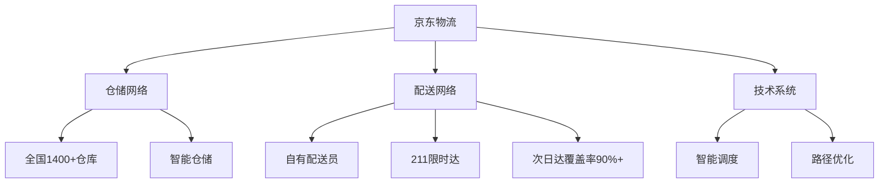

# 京东 - 中国第二大电商

## 概述

京东是中国第二大电商平台，以自营模式和物流优势著称。本文分析京东的商业模式、竞争优势和投资价值。

**学习目标**：
- 理解京东的自营 + 平台商业模式
- 分析京东物流的竞争优势
- 评估京东的盈利能力和增长潜力
- 掌握电商平台的投资逻辑
- 学习供应链管理经验

**为什么重要**：
京东通过自建物流建立了差异化竞争优势，是中国电商行业的重要参与者。理解京东可以学习如何通过供应链优势建立护城河。

## 公司概况

**基本信息**：
- 公司全称：京东集团股份有限公司
- 股票代码：JD（纳斯达克）、9618.HK（港股）
- 成立时间：1998 年（京东商城 2004 年）
- 上市时间：2014 年（纳斯达克）、2020 年（港股）
- 总部位置：北京
- 主营业务：电商零售、物流服务、技术服务

**市值规模**（2023）：
- 总市值：约 600-800 亿美元
- 中国电商第二
- 全球电商前十

## 商业模式分析

### 核心业务

**业务结构**：
1. **京东零售（80%）**：
   - 自营业务：3C、家电、日用品
   - 平台业务（POP）：第三方商家
   - 占营收主体

2. **京东物流（10%）**：
   - 自建物流网络
   - 第三方物流服务
   - 供应链解决方案

3. **京东科技（5%）**：
   - 金融科技
   - 云计算
   - 数字化服务

4. **其他业务（5%）**：
   - 京东健康
   - 京东到家
   - 海外业务

### 自营 + 平台模式

**自营模式**：
- 自己采购、销售
- 品质可控
- 用户体验好
- 毛利率低（10-15%）

**平台模式**：
- 第三方商家入驻
- 收取佣金和广告费
- 毛利率高（50%+）
- 占比逐步提升

**模式优势**：
- 自营建立品牌信任
- 平台提升盈利能力
- 两者互补

### 物流优势

**自建物流网络**：

**物流优势**：
- 配送速度快：次日达、211 限时达
- 用户体验好：自有配送员，服务标准化
- 成本可控：规模效应显现
- 开放服务：为第三方提供物流服务

## 竞争地位分析

### 市场份额

**电商市场**：
- GMV 市占率：约 20%
- 行业第二
- 份额稳定

**细分市场**：
- 3C 家电：市占率 40%+，第一
- 日用品：市占率 15%，第二
- 服装：市占率 10%，第三

### 与阿里的对比

| 维度 | 京东 | 阿里 |
|------|------|------|
| GMV | 3 万亿+ | 8 万亿+ |
| 市占率 | 20% | 45% |
| 商业模式 | 自营 + 平台 | 纯平台 |
| 物流 | 自建 | 菜鸟（整合） |
| 毛利率 | 15% | 40% |
| 净利率 | 2% | 15% |
| 优势品类 | 3C 家电 | 服装、日用品 |

### 竞争优势

**1. 物流优势**：
- 自建物流网络
- 配送速度快
- 用户体验好
- 难以复制

**2. 品质保证**：
- 自营模式品质可控
- 正品保证
- 用户信任度高

**3. 3C 家电优势**：
- 品类优势明显
- 市占率第一
- 供应链深耕

**4. 技术能力**：
- 智能物流
- 大数据应用
- AI 技术

### 竞争劣势

**1. 盈利能力弱**：
- 自营模式毛利率低
- 物流投入大
- 净利率低

**2. 品类覆盖不足**：
- 服装、日用品弱于阿里
- 长尾商品少

**3. 生态不如阿里**：
- 支付、云计算等弱
- 生态价值低

## 财务分析

### 盈利能力

**营收规模**：
- 2023 年营收：约 1 万亿元
- 近 10 年 CAGR：约 25%
- 增长稳定

**利润水平**：
- 2023 年净利润：约 200 亿元
- 净利率：约 2%
- 盈利能力逐步改善

**盈利能力指标**：
| 指标 | 京东 | 阿里 | 拼多多 |
|------|------|------|--------|
| 毛利率 | 15% | 40% | 60% |
| 净利率 | 2% | 15% | 15% |
| ROE | 10% | 20% | 30% |

### 现金流

**经营现金流**：
- 经营现金流为正
- 现金流质量改善
- 自由现金流转正

## 投资价值分析

### 投资逻辑

**核心逻辑**：
1. **物流优势建立护城河**
2. **平台业务占比提升，盈利改善**
3. **3C 家电龙头地位稳固**
4. **估值相对合理**

### 增长驱动

**短期**：平台业务增长、盈利改善
**中期**：物流开放服务、下沉市场
**长期**：供应链价值、生态价值

### 估值水平

**历史 PS 区间**：0.3-1.0 倍
**合理 PS**：0.5-0.7 倍
**当前 PS**（2023）：约 0.4 倍
**估值评估**：偏低

## 投资风险

**主要风险**：
1. 竞争加剧风险
2. 盈利能力改善不及预期
3. 物流成本上升
4. 监管风险

## 投资策略建议

### 买入时机

**好的买入时机**：
- 估值低位（PS < 0.4）
- 盈利改善超预期
- 物流开放服务进展顺利

### 持有策略

**持有周期**：3-5 年
**仓位建议**：10-15%（电商板块内）

## 延伸阅读

### 推荐书籍

1. **《京东传》**
   - 京东发展史

2. **《刘强东自述》**
   - 创业经历

3. **《供应链管理》**
   - 供应链理论

### 研究报告

- 中金公司：京东深度报告
- 招商证券：电商行业研究
- 国泰君安：京东投资价值分析

## 参考文献

1. 京东集团年报. 2014-2023
2. 中金公司. 《京东深度报告》. 2023
3. 招商证券. 《电商行业研究》. 2023
4. 国泰君安. 《京东投资价值分析》. 2022
5. 艾瑞咨询. 《中国电商行业报告》. 2023
6. 麦肯锡. 《中国零售市场研究》. 2023
7. 京东投资者交流会纪要. 2018-2023
8. 高瓴资本. 《电商投资方法论》. 2021
9. 贝恩公司. 《中国电商报告》. 2023
10. 尼尔森. 《中国消费者信心指数》. 2023

---

**关键启示**：
- 京东通过物流建立差异化优势
- 盈利能力逐步改善
- 估值相对合理
- 适合看好供应链价值的投资者

**下一步学习**：
- 研究阿里巴巴的平台生态
- 分析拼多多的下沉市场策略
- 学习供应链管理
- 研究物流行业

## 深度分析

### 核心机制解析

理解本主题需要从多个维度进行系统性分析。以下从理论基础、实践应用和历史验证三个层面展开深度探讨。

**理论基础层面**：本主题的核心逻辑建立在经济学和金融学的基本原理之上。通过对基础理论的深入理解，投资者能够建立起稳固的分析框架，避免被市场短期噪音所干扰。

**实践应用层面**：理论必须与实践相结合才能产生价值。在实际投资决策中，需要将抽象的概念转化为具体的分析工具和决策标准。

**历史验证层面**：金融市场有着丰富的历史记录，通过研究历史案例，我们可以验证理论的有效性，并从中提炼出具有普遍意义的规律。

### 关键影响因素

影响本主题的关键因素可以从以下几个维度进行分析：

1. **宏观经济环境**：利率水平、通货膨胀率、经济增长速度等宏观变量对本主题有着深远影响。在不同的宏观经济周期中，相关指标的表现会呈现出显著差异。

2. **市场结构因素**：市场参与者的构成、信息传播机制、流动性状况等市场结构因素决定了价格发现的效率和准确性。

3. **政策监管环境**：政府政策、监管框架的变化会直接影响相关市场的运作规则和参与者行为。

4. **技术创新驱动**：技术进步不断改变着金融市场的运作方式，从算法交易到区块链技术，每一次技术革新都带来新的机遇和挑战。

5. **全球化与地缘政治**：在全球化背景下，各国市场之间的联动性日益增强，地缘政治风险的影响也越来越不可忽视。

### 量化分析框架

为了更精确地分析和评估，可以采用以下量化框架：

| 分析维度 | 关键指标 | 参考基准 | 分析方法 |
|---------|---------|---------|---------|
| 规模评估 | 绝对值与相对值 | 历史均值 | 趋势分析 |
| 质量评估 | 稳定性指标 | 行业对标 | 横向比较 |
| 风险评估 | 波动率指标 | 风险阈值 | 情景分析 |
| 价值评估 | 估值倍数 | 历史区间 | 回归分析 |

通过系统性地应用上述框架，投资者可以对目标进行全面、客观的评估，从而做出更加理性的投资决策。

## 高级分析与前沿研究

### 学术研究进展

近年来，学术界对本领域的研究取得了重要进展。以下是几个值得关注的研究方向：

**行为金融学视角**：传统金融理论假设市场参与者是完全理性的，但行为金融学的研究表明，认知偏差和情绪因素在投资决策中扮演着重要角色。诺贝尔经济学奖得主丹尼尔·卡尼曼（Daniel Kahneman）和理查德·塞勒（Richard Thaler）的研究为我们理解市场非理性行为提供了重要框架。

**因子投资研究**：尤金·法玛（Eugene Fama）和肯尼斯·弗伦奇（Kenneth French）的三因子模型，以及后续发展的五因子模型，为系统性地解释股票收益差异提供了理论基础。这些研究表明，市值、账面市值比、盈利能力和投资模式等因子能够解释大部分股票收益的横截面差异。

**市场微观结构研究**：对市场流动性、价格发现机制和交易成本的深入研究，帮助我们更好地理解市场的运作机制，并为优化交易策略提供指导。

### 实战案例深度解析

**案例一：长期价值创造的典范**

以沃伦·巴菲特（Warren Buffett）的伯克希尔·哈撒韦（Berkshire Hathaway）为例，其长达数十年的卓越投资业绩证明了价值投资理念的有效性。从1965年至今，伯克希尔的账面价值年均增长率约为19.8%，远超同期标普500指数的约10.2%年均回报。

巴菲特的成功秘诀在于：
- 专注于具有持久竞争优势的优质企业
- 以合理价格买入，而非追求最低价格
- 长期持有，让复利效应充分发挥
- 保持充足的安全边际，控制下行风险

**案例二：危机中的机遇识别**

2008年金融危机期间，大多数投资者恐慌性抛售，但少数具有前瞻性的投资者却在危机中发现了历史性的投资机会。约翰·保尔森（John Paulson）通过做空次级抵押贷款相关证券，在危机中获得了约150亿美元的利润，成为金融史上最成功的单笔交易之一。

这个案例告诉我们：
- 深入的基本面研究能够发现市场定价错误
- 逆向思维往往能够发现被市场忽视的机会
- 风险管理和仓位控制是成功的关键

### 跨市场比较分析

不同市场在结构、监管、投资者构成等方面存在显著差异，这些差异对投资策略的选择有重要影响：

**美国市场特征**：
- 机构投资者主导，市场效率较高
- 信息披露制度完善，分析师覆盖广泛
- 衍生品市场发达，对冲工具丰富
- 长期牛市历史，但也经历过多次重大调整

**中国市场特征**：
- 散户投资者比例较高，市场波动性较大
- 政策因素影响显著，需要密切关注监管动向
- 新兴行业发展迅速，成长投资机会丰富
- A股、港股、美股中概股形成多层次市场体系

**欧洲市场特征**：
- 价值股比例较高，估值相对保守
- 受地缘政治和欧元区政策影响较大
- 部分行业（如奢侈品、工业）具有全球竞争优势
- ESG投资理念推广较为领先

