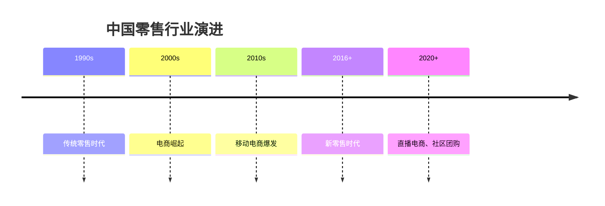
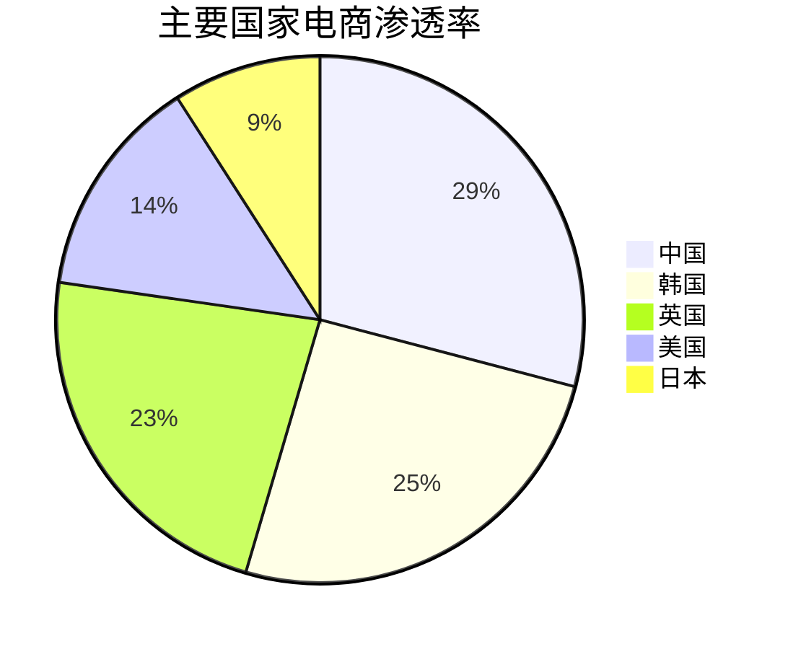

# 中国零售行业分析

## 概述

中国零售行业经历了从传统零售到电商，再到新零售的深刻变革。本文分析行业特点、竞争格局和投资机会。

**学习目标**：
- 理解中国零售行业的演进历程
- 掌握电商平台的商业模式
- 分析新零售的创新模式
- 识别优质投资标的
- 建立零售行业投资框架

**为什么重要**：
中国是全球最大的零售市场，电商渗透率全球领先。理解这个行业对于投资中国消费市场至关重要。

## 行业演进历程

### 发展阶段

### 三大时代特征

**1. 传统零售时代（1990s-2000s）**：
- 百货商场、超市主导
- 线下为主
- 区域性强
- 效率较低

**2. 电商时代（2000s-2016）**：
- 淘宝、京东崛起
- 线上快速增长
- 全国化
- 效率提升

**3. 新零售时代（2016-至今）**：
- 线上线下融合
- 数据驱动
- 即时零售
- 体验升级

## 行业整体特征

### 1. 市场规模

**规模数据**：
- 2023 年社会消费品零售总额：47 万亿元
- 网上零售额：15 万亿元
- 电商渗透率：32%
- 全球最大零售市场

### 2. 电商渗透率高

**全球对比**：

### 3. 移动化程度高

**移动电商特点**：
- 移动端占比 80%+
- 支付便捷
- 社交电商活跃
- 直播带货火爆

## 子行业分析

### 1. 综合电商平台

**主要平台**：
- 阿里巴巴（淘宝、天猫）：市占率 45%
- 京东：市占率 20%
- 拼多多：市占率 15%
- 其他：市占率 20%

**商业模式**：
- 平台模式（淘宝、拼多多）
- 自营 + 平台（京东）
- 佣金 + 广告收入
- 网络效应明显

**投资逻辑**：
- 关注用户规模和活跃度
- 重视GMV增长和变现率
- 关注盈利能力改善
- 重视生态价值

### 2. 垂直电商

**主要领域**：
- 生鲜电商：盒马、每日优鲜
- 母婴电商：贝贝网、蜜芽
- 奢侈品电商：寺库、魅力惠
- 二手电商：闲鱼、转转

**特点**：
- 专注细分领域
- 供应链深耕
- 用户粘性高
- 竞争激烈

### 3. 社交电商

**主要模式**：
- 拼团模式：拼多多
- 分销模式：云集
- 内容电商：小红书
- 直播电商：抖音、快手

**特点**：
- 社交裂变
- 获客成本低
- 下沉市场强
- 增长快

### 4. 新零售

**主要模式**：
- 盒马鲜生：生鲜新零售
- 永辉超级物种：超市 +餐饮
- 无人零售：便利蜂
- 社区团购：美团优选、多多买菜

**特点**：
- 线上线下融合
- 数据驱动
- 即时配送
- 体验升级

## 行业投资逻辑

### 1. 平台价值是核心

**网络效应**：
- 用户越多，价值越大
- 商家越多，选择越多
- 正向循环
- 赢家通吃

**平台价值评估**：
- 用户规模
- 用户活跃度
- GMV规模
- 变现率
- 生态价值

### 2. 供应链效率是关键

**效率提升**：
- 物流效率
- 库存周转
- 成本控制
- 配送速度

**京东案例**：
- 自建物流
- 次日达
- 用户体验好
- 成本可控

### 3. 用户体验是根本

**体验要素**：
- 商品丰富度
- 价格竞争力
- 配送速度
- 售后服务
- 购物便利性

### 4. 技术创新是趋势

**技术应用**：
- 大数据：精准营销
- AI：智能推荐
- 云计算：弹性扩展
- 物联网：智能物流

## 财务特征与估值

### 典型财务特征

**盈利能力**：
- 毛利率：10-40%（模式差异大）
- 净利率：-5% 到 5%（多数微利或亏损）
- ROE：10-20%（盈利企业）

**现金流特征**：
- 经营现金流：通常为正
- 资本开支：物流、技术投入大
- 自由现金流：逐步改善

### 估值方法

**PS 估值法**（常用）：
- 综合电商：1-3 倍 PS
- 垂直电商：0.5-2 倍 PS
- 社交电商：2-5 倍 PS

**用户价值法**：
- 单用户价值 = GMV / 用户数 × 变现率
- 用户获取成本
- 用户生命周期价值

## 投资机会与风险

### 投资机会

**1. 龙头平台持续受益**：
- 网络效应强化
- 市占率提升
- 盈利能力改善

**2. 下沉市场潜力大**：
- 三四线城市
- 农村市场
- 增长空间大

**3. 新模式创新**：
- 直播电商
- 社区团购
- 即时零售

**4. 供应链数字化**：
- 效率提升
- 成本下降
- 体验改善

### 主要风险

**1. 竞争加剧风险**：
- 价格战
- 补贴战
- 利润率下降

**2. 监管风险**：
- 反垄断
- 数据安全
- 平台责任

**3. 宏观经济风险**：
- 消费疲软
- 收入预期下降

**4. 技术变革风险**：
- 新模式冲击
- 用户迁移

## 投资策略

### 选股标准

**必备条件**：
- 平台地位稳固
- 用户规模大
- 增长潜力好
- 管理团队优秀

**加分项**：
- 盈利能力改善
- 生态价值显现
- 技术创新领先
- 估值合理

### 组合配置建议

**核心持仓（60%）**：
- 综合电商龙头：阿里、京东

**卫星持仓（40%）**：
- 成长型平台：拼多多
- 垂直电商：细分龙头
- 新零售：创新企业

## 延伸阅读

### 推荐书籍

1. **《新零售》** - 阿里研究院
   - 新零售理论

2. **《平台革命》**
   - 平台经济理论

3. **《长尾理论》**
   - 电商商业逻辑

### 研究报告

- 中金公司：零售行业深度报告
- 招商证券：电商行业研究
- 国泰君安：新零售分析

## 参考文献

1. 国家统计局. 《社会消费品零售总额数据》. 2023
2. 中金公司. 《零售行业深度报告》. 2023
3. 招商证券. 《电商行业研究》. 2023
4. 阿里研究院. 《新零售研究报告》. 2023
5. 京东研究院. 《零售创新报告》. 2023
6. 麦肯锡. 《中国零售市场研究》. 2023
7. 贝恩公司. 《中国电商报告》. 2023
8. 尼尔森. 《中国消费者信心指数》. 2023
9. 艾瑞咨询. 《中国电商行业报告》. 2023
10. 易观分析. 《零售行业数字化报告》. 2023

---

**关键启示**：
- 中国零售行业变革深刻
- 电商渗透率全球领先
- 平台价值和供应链效率是核心
- 新模式创新活跃

**下一步学习**：
- 深入研究阿里巴巴生态
- 分析京东物流优势
- 学习拼多多下沉市场策略
- 研究新零售创新模式

## 深度分析

### 核心机制解析

理解本主题需要从多个维度进行系统性分析。以下从理论基础、实践应用和历史验证三个层面展开深度探讨。

**理论基础层面**：本主题的核心逻辑建立在经济学和金融学的基本原理之上。通过对基础理论的深入理解，投资者能够建立起稳固的分析框架，避免被市场短期噪音所干扰。

**实践应用层面**：理论必须与实践相结合才能产生价值。在实际投资决策中，需要将抽象的概念转化为具体的分析工具和决策标准。

**历史验证层面**：金融市场有着丰富的历史记录，通过研究历史案例，我们可以验证理论的有效性，并从中提炼出具有普遍意义的规律。

### 关键影响因素

影响本主题的关键因素可以从以下几个维度进行分析：

1. **宏观经济环境**：利率水平、通货膨胀率、经济增长速度等宏观变量对本主题有着深远影响。在不同的宏观经济周期中，相关指标的表现会呈现出显著差异。

2. **市场结构因素**：市场参与者的构成、信息传播机制、流动性状况等市场结构因素决定了价格发现的效率和准确性。

3. **政策监管环境**：政府政策、监管框架的变化会直接影响相关市场的运作规则和参与者行为。

4. **技术创新驱动**：技术进步不断改变着金融市场的运作方式，从算法交易到区块链技术，每一次技术革新都带来新的机遇和挑战。

5. **全球化与地缘政治**：在全球化背景下，各国市场之间的联动性日益增强，地缘政治风险的影响也越来越不可忽视。

### 量化分析框架

为了更精确地分析和评估，可以采用以下量化框架：

| 分析维度 | 关键指标 | 参考基准 | 分析方法 |
|---------|---------|---------|---------|
| 规模评估 | 绝对值与相对值 | 历史均值 | 趋势分析 |
| 质量评估 | 稳定性指标 | 行业对标 | 横向比较 |
| 风险评估 | 波动率指标 | 风险阈值 | 情景分析 |
| 价值评估 | 估值倍数 | 历史区间 | 回归分析 |

通过系统性地应用上述框架，投资者可以对目标进行全面、客观的评估，从而做出更加理性的投资决策。

## 高级分析与前沿研究

### 学术研究进展

近年来，学术界对本领域的研究取得了重要进展。以下是几个值得关注的研究方向：

**行为金融学视角**：传统金融理论假设市场参与者是完全理性的，但行为金融学的研究表明，认知偏差和情绪因素在投资决策中扮演着重要角色。诺贝尔经济学奖得主丹尼尔·卡尼曼（Daniel Kahneman）和理查德·塞勒（Richard Thaler）的研究为我们理解市场非理性行为提供了重要框架。

**因子投资研究**：尤金·法玛（Eugene Fama）和肯尼斯·弗伦奇（Kenneth French）的三因子模型，以及后续发展的五因子模型，为系统性地解释股票收益差异提供了理论基础。这些研究表明，市值、账面市值比、盈利能力和投资模式等因子能够解释大部分股票收益的横截面差异。

**市场微观结构研究**：对市场流动性、价格发现机制和交易成本的深入研究，帮助我们更好地理解市场的运作机制，并为优化交易策略提供指导。

### 实战案例深度解析

**案例一：长期价值创造的典范**

以沃伦·巴菲特（Warren Buffett）的伯克希尔·哈撒韦（Berkshire Hathaway）为例，其长达数十年的卓越投资业绩证明了价值投资理念的有效性。从1965年至今，伯克希尔的账面价值年均增长率约为19.8%，远超同期标普500指数的约10.2%年均回报。

巴菲特的成功秘诀在于：
- 专注于具有持久竞争优势的优质企业
- 以合理价格买入，而非追求最低价格
- 长期持有，让复利效应充分发挥
- 保持充足的安全边际，控制下行风险

**案例二：危机中的机遇识别**

2008年金融危机期间，大多数投资者恐慌性抛售，但少数具有前瞻性的投资者却在危机中发现了历史性的投资机会。约翰·保尔森（John Paulson）通过做空次级抵押贷款相关证券，在危机中获得了约150亿美元的利润，成为金融史上最成功的单笔交易之一。

这个案例告诉我们：
- 深入的基本面研究能够发现市场定价错误
- 逆向思维往往能够发现被市场忽视的机会
- 风险管理和仓位控制是成功的关键

### 跨市场比较分析

不同市场在结构、监管、投资者构成等方面存在显著差异，这些差异对投资策略的选择有重要影响：

**美国市场特征**：
- 机构投资者主导，市场效率较高
- 信息披露制度完善，分析师覆盖广泛
- 衍生品市场发达，对冲工具丰富
- 长期牛市历史，但也经历过多次重大调整

**中国市场特征**：
- 散户投资者比例较高，市场波动性较大
- 政策因素影响显著，需要密切关注监管动向
- 新兴行业发展迅速，成长投资机会丰富
- A股、港股、美股中概股形成多层次市场体系

**欧洲市场特征**：
- 价值股比例较高，估值相对保守
- 受地缘政治和欧元区政策影响较大
- 部分行业（如奢侈品、工业）具有全球竞争优势
- ESG投资理念推广较为领先

